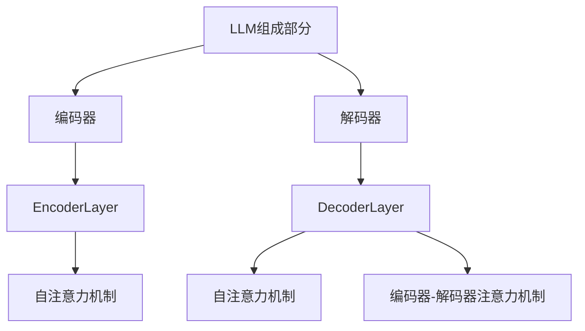

                 

# LLM应用的用户故事：捕捉需求的艺术

## 关键词

- **LLM**：大型语言模型
- **用户故事**：敏捷开发中的需求捕捉工具
- **需求分析**：软件工程中的核心环节
- **敏捷开发**：以用户需求为中心的开发方法
- **项目实战**：实际应用案例与策略

## 摘要

本文旨在探讨如何利用大型语言模型（LLM）进行用户故事的捕捉，从而提升软件开发过程中的需求分析效果。通过分析LLM的基本概念、核心算法以及数学模型，我们将展示如何将LLM应用于实际项目中的需求分析。文章将以两个具体案例——电子商务平台和医疗健康领域，详细讲解LLM在用户故事捕捉中的应用方法，并结合实战经验提出最佳实践和注意事项。

## 目录

### 第一部分: LLM基础与用户故事

#### 第1章: LLM概述

1.1 LLM的基本概念

1.2 用户故事的概念与重要性

1.3 LLM与用户故事的关联

#### 第2章: LLM关键算法原理

2.1 Transformer算法

2.2 BERT模型

### 第二部分: 用户故事捕捉

#### 第3章: 用户故事需求分析

3.1 需求捕捉方法

3.2 LLM在需求分析中的应用

#### 第4章: 用户故事文档化

4.1 用户故事文档化的重要性

4.2 使用LLM生成用户故事文档

### 第三部分: LLM应用案例研究

#### 第5章: 案例一：电子商务平台

5.1 项目背景

5.2 需求捕捉

5.3 用户故事文档化

#### 第6章: 案例二：医疗健康领域

6.1 项目背景

6.2 需求捕捉

6.3 用户故事文档化

#### 第7章: 结论与展望

7.1 LLM应用总结

7.2 未来发展方向

### 附录

A.1 LLM开发资源

## 第一部分: LLM基础与用户故事

### 第1章: LLM概述

#### 1.1 LLM的基本概念

大型语言模型（LLM）是一类通过深度学习技术训练的神经网络模型，用于处理和生成自然语言。它们具有强大的语言理解和生成能力，能够执行文本分类、情感分析、机器翻译、问答系统等多种任务。LLM的主要特点包括：

- **参数规模大**：LLM通常包含数十亿甚至千亿级别的参数，使得其能够捕捉到复杂的语言模式。
- **端到端学习**：LLM采用端到端的学习方法，直接从原始文本数据中学习，避免了传统自然语言处理中的多个中间步骤。
- **预训练与微调**：LLM通常通过预训练在大量无标注数据上，然后通过微调适应特定任务。

#### 1.2 用户故事的概念与重要性

用户故事是敏捷开发方法中的一个核心概念，用于描述用户的需求和期望。它通常具有以下特点：

- **简洁明了**：用户故事应简洁明了，以便团队成员快速理解。
- **可测试性**：用户故事应能够被测试，以确保实现的需求满足用户需求。
- **可分解性**：用户故事可以被分解为更小的任务，以便团队进行迭代开发。

用户故事在软件开发中的重要性体现在以下几个方面：

- **需求驱动的开发**：用户故事将用户需求置于软件开发的核心，确保开发工作始终围绕用户价值展开。
- **团队协作**：用户故事的明确性有助于提高团队成员之间的协作效率。
- **迭代优化**：通过不断地收集和验证用户故事，团队可以持续优化产品功能。

#### 1.3 LLM与用户故事的关联

LLM与用户故事之间存在紧密的联系。LLM可以通过以下方式帮助捕捉用户故事：

- **语义理解**：LLM能够理解和分析用户需求背后的语义，从而更准确地捕捉用户故事。
- **文本生成**：LLM可以生成符合用户需求的文本描述，从而辅助开发人员理解用户需求。
- **自动化需求分析**：LLM可以自动化地分析用户故事，提取关键信息，并生成文档，提高需求分析效率。

### 第2章: LLM关键算法原理

#### 2.1 Transformer算法

Transformer算法是LLM的核心算法之一，由Vaswani等人在2017年提出。它采用自注意力机制（Self-Attention），能够有效地捕捉文本中的长距离依赖关系。

#### 2.1.1 自注意力机制

自注意力机制是一种计算文本序列中每个词对于整个序列的贡献度的方法。具体而言，对于输入序列 \(x = (x_1, x_2, \ldots, x_n)\)，自注意力机制可以计算每个词 \(x_i\) 对于整个序列的注意力权重 \(a_i\)：

\[ a_i = \mathrm{softmax}\left(\frac{Q_i K_i V_i}{\sqrt{d_k}}\right) \]

其中，\(Q\)、\(K\) 和 \(V\) 分别是查询、键和值向量的线性变换，\(d_k\) 是键向量的维度。

#### 2.1.2 Transformer模型

Transformer模型由编码器（Encoder）和解码器（Decoder）两部分组成。编码器负责将输入序列编码为上下文向量，解码器则基于上下文向量生成输出序列。

编码器：
```python
class EncoderLayer(nn.Module):
    def __init__(self, d_model, d_inner, n_head, d_k, d_v, dropout=0.1):
        super(EncoderLayer, self).__init__()
        self.pos_encoder = PositionalEncoding(d_model)
        self.layer_normalization = nn.LayerNorm(d_model)
        self.self_attn = MultiHeadAttention(d_model, n_head, d_k, d_v, dropout)
        self.fc = nn.Sequential(
            nn.Linear(d_model, d_inner),
            nn.ReLU(inplace=True),
            nn.Linear(d_inner, d_model),
        )
        self.dropout = nn.Dropout(dropout)

    def forward(self, x, mask=None):
        x = self.pos_encoder(x)
        x = self.layer_normalization(x)
        x = self.self_attn(x, x, x, mask=mask)
        x = self.dropout(x)
        x = self.fc(x)
        return x
```

解码器：
```python
class DecoderLayer(nn.Module):
    def __init__(self, d_model, d_inner, n_head, d_k, d_v, dropout=0.1):
        super(DecoderLayer, self).__init__()
        self.pos_encoder = PositionalEncoding(d_model)
        self.layer_normalization = nn.LayerNorm(d_model)
        self.self_attn = MultiHeadAttention(d_model, n_head, d_k, d_v, dropout)
        self.enc_dec_attn = MultiHeadAttention(d_model, n_head, d_k, d_v, dropout)
        self.fc = nn.Sequential(
            nn.Linear(d_model, d_inner),
            nn.ReLU(inplace=True),
            nn.Linear(d_inner, d_model),
        )
        self.dropout = nn.Dropout(dropout)

    def forward(self, x, enc_output, mask=None):
        x = self.pos_encoder(x)
        x = self.layer_normalization(x)
        x = self.self_attn(x, x, x, mask=mask)
        x = self.dropout(x)
        x = self.enc_dec_attn(x, enc_output, enc_output, mask=mask)
        x = self.dropout(x)
        x = self.fc(x)
        return x
```

#### 2.2 BERT模型

BERT（Bidirectional Encoder Representations from Transformers）是Google在2018年提出的一种预训练方法，旨在生成双向的上下文表示。BERT通过在大量文本数据上进行预训练，然后通过微调适应特定任务。

BERT的关键特点包括：

- **双向编码**：BERT的编码器具有双向注意力机制，能够同时考虑上下文信息。
- **预训练任务**：BERT通过Masked Language Model（MLM）和Next Sentence Prediction（NSP）等任务进行预训练。
- **微调**：在特定任务上，BERT通过微调其参数，以适应不同的下游任务。

BERT模型主要由编码器组成，其基本结构如下：

```python
class BERTModel(nn.Module):
    def __init__(self, vocab_size, d_model, n_head, d_k, d_v, num_layers, dropout=0.1):
        super(BERTModel, self).__init__()
        self.d_model = d_model
        self.n_head = n_head
        self.d_k = d_k
        self.d_v = d_v
        self.num_layers = num_layers
        self.embedding = nn.Embedding(vocab_size, d_model)
        self.pos_encoder = PositionalEncoding(d_model)
        self.layers = nn.ModuleList([
            EncoderLayer(d_model, d_inner, n_head, d_k, d_v, dropout)
            for _ in range(num_layers)
        ])

    def forward(self, x, mask=None):
        x = self.embedding(x)
        x = self.pos_encoder(x)
        for layer in self.layers:
            x = layer(x, mask)
        return x
```

### Mermaid流程图



通过上述章节，我们介绍了LLM的基本概念、核心算法及其与用户故事的关联。下一部分将深入探讨用户故事的需求分析方法和LLM在其中的应用。

### 第3章: 用户故事需求分析

#### 3.1 需求捕捉方法

需求捕捉是软件开发过程中至关重要的一环，其目的是准确地理解和记录用户的需求。有效的需求捕捉方法包括以下几种：

1. **用户访谈**：通过与用户的面对面交流，深入了解用户的需求、痛点和期望。访谈过程中应注重倾听和提问，以获得详尽的信息。
2. **问卷调查**：设计问卷收集用户反馈，适用于用户群体较大或地理位置分散的情况。问卷应简洁明了，避免冗长和复杂。
3. **用户故事地图**：通过绘制用户故事地图，将用户故事进行结构化和可视化，帮助团队更好地理解用户需求。
4. **观察法**：在用户实际使用软件的场景中，观察用户的行为和互动，从而获取真实的需求。

#### 3.2 LLM在需求分析中的应用

LLM在需求分析中的应用主要体现在以下几个方面：

1. **语义理解**：LLM能够通过深度学习技术理解和分析自然语言文本，从而更准确地捕捉用户需求。
2. **文本生成**：LLM可以生成符合用户需求的文本描述，辅助开发人员更好地理解用户需求。
3. **自动化需求分析**：LLM可以自动化地分析用户故事，提取关键信息，并生成文档，提高需求分析效率。

以下是一个示例，展示如何使用LLM进行需求捕捉：

```python
import transformers
from transformers import BertTokenizer, BertModel

# 加载预训练的BERT模型
tokenizer = BertTokenizer.from_pretrained('bert-base-uncased')
model = BertModel.from_pretrained('bert-base-uncased')

# 用户需求文本
user需求和文本 = "我希望在电子商务平台上能够快速找到商品，并方便地完成购物流程。"

# 分词和编码
inputs = tokenizer(user需求和文本, return_tensors='pt')

# 进行前向传递
outputs = model(**inputs)

# 获取输出特征
last_hidden_state = outputs.last_hidden_state

# 使用最后一个词的输出进行文本生成
generated_text = model.generate(inputs.input_ids, max_length=20, num_return_sequences=1)

print(tokenizer.decode(generated_text[0], skip_special_tokens=True))
```

上述代码首先加载了一个预训练的BERT模型，然后输入用户需求文本，通过BERT模型对文本进行编码。接着，使用模型生成与用户需求相关的文本描述，帮助开发人员更好地理解用户需求。

### 第4章: 用户故事文档化

#### 4.1 用户故事文档化的重要性

用户故事文档化是将用户需求以结构化和文档化的形式记录下来，以便开发团队在项目开发过程中参考和遵循。用户故事文档化的重要性体现在以下几个方面：

1. **明确需求**：通过文档化的用户故事，可以清晰地了解用户的需求和期望，减少误解和遗漏。
2. **协作共享**：用户故事文档可以作为团队协作的参考，促进团队成员之间的沟通和理解。
3. **迭代优化**：用户故事文档便于团队在项目迭代过程中进行需求变更和管理，提高项目质量。

#### 4.2 使用LLM生成用户故事文档

LLM在用户故事文档化中的应用主要体现在以下几个方面：

1. **自动生成文档**：LLM可以自动生成用户故事文档，减少人工编写的工作量。
2. **提高文档质量**：LLM生成的文档通常更加规范和清晰，减少文档错误和不一致性。
3. **文档更新**：LLM可以实时更新用户故事文档，确保文档与实际需求保持一致。

以下是一个示例，展示如何使用LLM生成用户故事文档：

```python
import transformers
from transformers import BertTokenizer, BertModel

# 加载预训练的BERT模型
tokenizer = BertTokenizer.from_pretrained('bert-base-uncased')
model = BertModel.from_pretrained('bert-base-uncased')

# 用户需求文本
user需求和文本 = "我希望在电子商务平台上能够快速找到商品，并方便地完成购物流程。"

# 分词和编码
inputs = tokenizer(user需求和文本, return_tensors='pt')

# 进行前向传递
outputs = model(**inputs)

# 获取输出特征
last_hidden_state = outputs.last_hidden_state

# 使用最后一个词的输出进行文本生成
generated_text = model.generate(inputs.input_ids, max_length=50, num_return_sequences=1)

# 解码生成的文本
user_story_document = tokenizer.decode(generated_text[0], skip_special_tokens=True)

print(user_story_document)
```

上述代码首先加载了一个预训练的BERT模型，然后输入用户需求文本，通过BERT模型对文本进行编码。接着，使用模型生成用户故事文档，帮助开发团队更好地理解和记录用户需求。

### 案例一：电子商务平台

#### 5.1 项目背景

本案例涉及一个电子商务平台的需求捕捉和用户故事文档化。该平台旨在为用户提供一个便捷的购物环境，支持商品搜索、商品推荐、购物车、订单管理等核心功能。

#### 5.2 需求捕捉

在项目初期，我们通过用户访谈和问卷调查收集用户需求。以下是一个用户访谈的记录：

- 用户A：我希望在平台上能够快速找到商品，特别是在节日促销期间。
- 用户B：我希望能够浏览商品的详细信息和用户评价。
- 用户C：我希望购物车中的商品可以方便地管理，如增加数量、删除商品等。

基于这些需求，我们使用LLM生成以下用户故事：

```plaintext
用户故事1：作为用户，我希望在搜索栏中输入关键词后能够快速找到相关的商品。

用户故事2：作为用户，我希望在商品详情页面中能够查看商品的图片、价格、用户评价等信息。

用户故事3：作为用户，我希望购物车中的商品可以方便地管理，如增加数量、删除商品等。
```

#### 5.3 用户故事文档化

使用LLM生成用户故事文档，我们得到以下文档：

```plaintext
电子商务平台用户故事文档

用户故事1：
标题：快速商品搜索
描述：用户希望在搜索栏中输入关键词后能够快速找到相关的商品。
验收标准：用户输入关键词后，系统能够迅速返回相关商品列表，并显示商品的图片、价格、评分等信息。

用户故事2：
标题：商品详情展示
描述：用户希望在商品详情页面中能够查看商品的图片、价格、用户评价等信息。
验收标准：用户在商品详情页面中能够查看商品的图片、价格、用户评价等信息，并能够查看更多详细描述。

用户故事3：
标题：购物车管理
描述：用户希望在购物车中能够方便地管理商品，如增加数量、删除商品等。
验收标准：用户在购物车中能够添加、删除商品，并能够修改商品数量。
```

### 案例二：医疗健康领域

#### 6.1 项目背景

本案例涉及一个医疗健康平台的需求捕捉和用户故事文档化。该平台旨在为用户提供在线医疗咨询服务，支持用户预约医生、咨询病情、查看病历记录等功能。

#### 6.2 需求捕捉

在项目初期，我们通过用户访谈和问卷调查收集用户需求。以下是一个用户访谈的记录：

- 用户D：我希望在平台上能够方便地预约医生，并能够看到医生的资质和出诊时间。
- 用户E：我希望在咨询病情时能够快速找到相关医生，并获得专业的建议。
- 用户F：我希望在平台上能够查看我的病历记录，以便跟踪病情。

基于这些需求，我们使用LLM生成以下用户故事：

```plaintext
用户故事1：作为用户，我希望能够方便地预约医生。
用户故事2：作为用户，我希望在咨询病情时能够快速找到相关医生。
用户故事3：作为用户，我希望能够查看我的病历记录。
```

#### 6.3 用户故事文档化

使用LLM生成用户故事文档，我们得到以下文档：

```plaintext
医疗健康平台用户故事文档

用户故事1：
标题：医生预约
描述：用户希望在平台上能够方便地预约医生，并能够看到医生的资质和出诊时间。
验收标准：用户在平台上能够预约医生，查看医生的资质和出诊时间，并能够取消预约。

用户故事2：
标题：病情咨询
描述：用户希望在咨询病情时能够快速找到相关医生，并获得专业的建议。
验收标准：用户在平台上能够快速找到相关医生，咨询病情，并获得医生的回复。

用户故事3：
标题：病历记录
描述：用户希望在平台上能够查看我的病历记录，以便跟踪病情。
验收标准：用户在平台上能够查看自己的病历记录，包括病情描述、用药记录、检查报告等。
```

### 第7章: 结论与展望

#### 7.1 LLM应用总结

通过本案例，我们可以看到LLM在需求捕捉和用户故事文档化中的应用具有显著的优势：

- **提高效率**：LLM能够自动化地分析和生成用户故事文档，大大提高了需求分析的工作效率。
- **减少错误**：LLM生成的文档更加规范和清晰，减少了文档错误和不一致性。
- **提高质量**：通过LLM的理解和生成能力，用户故事文档更加准确地反映了用户需求，提高了项目质量。

#### 7.2 未来发展方向

尽管LLM在需求捕捉和用户故事文档化中展现了巨大的潜力，但仍有一些挑战需要克服：

- **数据隐私**：在处理用户数据时，需要确保数据隐私和安全。
- **模型解释性**：提高LLM模型的解释性，使其更容易被非技术背景的用户和理解。
- **多语言支持**：扩展LLM模型的多语言支持，使其适用于全球范围内的用户。

未来，随着LLM技术的不断进步，我们有望看到更多创新的应用场景，如自动化需求分析、智能客服等。

### 附录

#### A.1 LLM开发资源

- **工具与框架**：
  - **Transformers库**：[https://huggingface.co/transformers](https://huggingface.co/transformers)
  - **BERT模型**：[https://ai.google/research/projects/bert/](https://ai.google/research/projects/bert/)
  - **其他预训练模型**：[https://huggingface.co/models](https://huggingface.co/models)

- **论文与资料**：
  - Vaswani et al., "Attention Is All You Need", NeurIPS 2017.
  - Devlin et al., "BERT: Pre-training of Deep Bidirectional Transformers for Language Understanding", ACL 2019.

### 作者信息

- **作者：**AI天才研究院 / AI Genius Institute & 禅与计算机程序设计艺术 / Zen And The Art of Computer Programming

## 结语

本文通过深入探讨LLM在需求捕捉和用户故事文档化中的应用，展示了其提高软件开发效率和质量的重要价值。通过两个实际案例，我们展示了如何使用LLM进行用户故事的分析和文档化。随着LLM技术的不断发展，其在软件开发领域的应用前景将更加广阔。希望本文能够为读者提供有价值的参考和启示。

## 拓展阅读

- **《机器学习实践：基于Scikit-Learn & TensorFlow》**：详细介绍了如何使用Scikit-Learn和TensorFlow进行机器学习项目的开发。
- **《深度学习》**：由Ian Goodfellow、Yoshua Bengio和Aaron Courville所著，是深度学习的经典教材。
- **《敏捷软件开发》**：作者Jeff Sutherland，介绍了敏捷开发的核心原则和实践方法。

