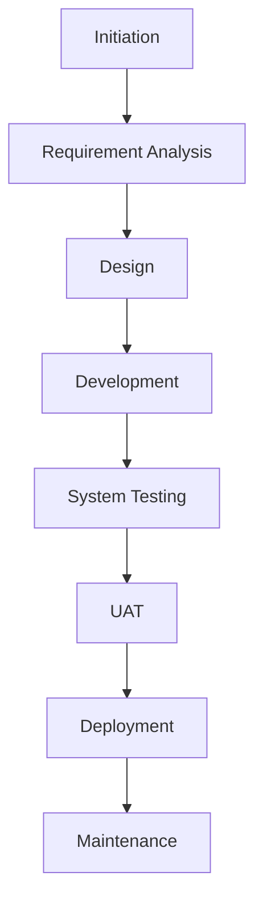

                 

### 用户验收测试（UAT）的定义与重要性

用户验收测试（User Acceptance Testing，简称UAT）是软件开发生命周期中至关重要的一环。它是指最终用户对软件产品进行全面测试的过程，以验证该产品是否符合业务需求和用户期望。UAT通常在系统测试之后进行，但在此之前，所有的缺陷修复和系统功能验证都应已完成。

#### UAT的定义

用户验收测试旨在确认软件系统是否能够满足用户的业务需求和预期。这一过程通常由非技术用户（如市场营销人员、销售人员、财务人员等）或专门的用户验收测试团队负责执行。UAT的目的是确保软件产品在交付之前已经通过了最终的质量检查，并且符合用户的业务流程和操作要求。

#### UAT的重要性

1. **用户满意度**：UAT是用户首次与即将部署的软件系统互动的机会。通过这一过程，用户可以验证系统的功能是否满足其需求，从而确保系统的成功部署。

2. **质量保证**：UAT是发现和修复软件缺陷的最后机会。在软件发布之前，确保所有已知问题都得到了解决，可以显著降低后期维护成本。

3. **风险管理**：UAT有助于降低软件发布后的风险。通过提前发现和解决潜在问题，可以减少系统上线后的故障率和用户投诉。

4. **业务连续性**：确保软件系统能够无缝集成到现有的业务流程中，从而保障业务的连续性和稳定性。

5. **合规性**：对于某些行业，如金融和医疗，合规性要求非常严格。UAT确保软件系统符合相关的法律法规和标准。

#### UAT与敏捷开发的联系

在敏捷开发中，UAT的角色和重要性被进一步强化。敏捷开发强调快速迭代和持续交付，这使得UAT必须在每个迭代周期中频繁执行。以下是UAT在敏捷开发中的几个关键方面：

1. **迭代式UAT**：敏捷开发中的UAT是迭代进行的，每次迭代都会进行一次或多次UAT。这样可以确保每次交付的软件版本都是经过用户验证的。

2. **用户参与**：在敏捷开发中，用户代表（如产品经理或业务分析师）在整个开发过程中持续参与，以便及时提供反馈和需求调整。这使得UAT更加紧密地结合到开发流程中。

3. **自动化UAT**：为了支持敏捷开发的高频迭代，自动化UAT变得至关重要。自动化测试可以加速测试过程，确保每个版本的质量，并减少人工测试的负担。

4. **持续集成/持续部署（CI/CD）**：敏捷开发环境下的UAT通常与CI/CD流程集成，以确保每次代码提交都会经过完整的测试链，并及时反馈测试结果。

### 总结

用户验收测试（UAT）是软件开发生命周期中的关键环节，尤其在敏捷开发环境中扮演着至关重要的角色。通过UAT，可以确保软件系统不仅满足技术需求，还能满足业务需求和用户期望。在下一部分中，我们将进一步探讨敏捷开发的概念、原则和实践，以及这些实践如何影响UAT的执行。

#### 参考资料

- Beizer, B. (2016). [Software Testing Techniques](https://www.amazon.com/Software-Testing-Techniques-Beyond-Documentation/dp/0133708276). Addison-Wesley Professional.
- Mak, Y. W., & Chong, A. P. (2012). [Practical Guide to User Acceptance Testing: User Centric Software Quality Management](https://www.amazon.com/Practical-Guide-User-Acceptance-Testing/dp/1118337279). McGraw-Hill Education.
- Copeland, M. (2014). [Agile Testing: How to Create a Successful Product Through Quality Early and Often](https://www.amazon.com/Agile-Testing-Create-Successful-Product/dp/111836176X). John Wiley & Sons.

### 流程图

以下是UAT在敏捷开发中的流程图，展示了UAT与敏捷迭代的关系：

- **Initiation**：项目启动阶段，定义项目范围和目标。
- **Requirement Analysis**：收集和分析用户需求。
- **Design**：系统设计阶段，包括架构设计、UI设计等。
- **Development**：开发阶段，编码和实现系统功能。
- **System Testing**：对系统进行全面测试，确保功能正确。
- **UAT**：用户验收测试，验证系统是否符合用户需求。
- **Deployment**：部署到生产环境。
- **Maintenance**：系统上线后的维护和更新。

