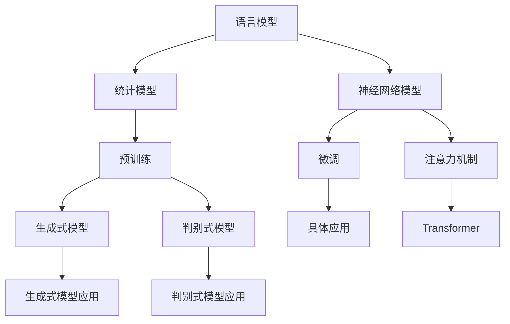

                 

---

## 文章标题

《LLM应用的迭代回顾会：持续改进的关键》

## 文章关键词

- 语言模型（Language Model）
- 大型语言模型（Large Language Model）
- 应用迭代（Application Iteration）
- 持续改进（Continuous Improvement）
- 性能优化（Performance Optimization）

## 文章摘要

本文深入探讨了大型语言模型（LLM）的应用迭代过程，以及如何通过持续改进来提升其性能和效果。文章首先介绍了LLM的基本概念、发展历程和核心原理，然后详细分析了其在各种应用场景中的迭代过程。接着，文章阐述了持续改进的关键因素，包括优化策略、性能评估方法以及安全性的考虑。最后，通过实际案例和最佳实践，为读者提供了实施LLM应用的指导和建议。

---

### 背景介绍

近年来，随着人工智能技术的飞速发展，语言模型（Language Model，简称LM）成为了自然语言处理（Natural Language Processing，简称NLP）领域的重要工具。特别是大型语言模型（Large Language Model，简称LLM），如GPT（Generative Pre-trained Transformer）、BERT（Bidirectional Encoder Representations from Transformers）等，凭借其强大的表征能力和生成能力，已经广泛应用于文本生成、机器翻译、问答系统、信息检索等多个领域。

然而，LLM的应用并非一蹴而就，而是一个持续迭代、不断优化的过程。在实际应用中，开发者需要不断调整和改进模型，以适应不同的场景需求，提高其性能和效果。本文旨在回顾LLM应用的迭代过程，总结持续改进的关键因素，为未来的LLM应用提供指导和启示。

### 核心概念与联系

首先，我们来梳理一下LLM的核心概念及其相互之间的关系。

1. **语言模型**：语言模型是一种概率模型，用于预测文本的下一个单词或字符。它通过学习大量文本数据，生成自然语言文本。语言模型可以分为统计模型和神经网络模型，后者在近年来得到了广泛的应用。

2. **预训练与微调**：预训练（Pre-training）是指在大量无标签数据上对模型进行训练，使其获得通用语言理解能力。微调（Fine-tuning）则是在预训练的基础上，在特定任务的数据集上进行训练，以适应具体的应用场景。

3. **生成式模型与判别式模型**：生成式模型（Generative Model）通过生成文本的概率分布来生成文本，而判别式模型（Discriminative Model）则直接预测文本的标签。在LLM的应用中，生成式模型更常见，如GPT系列。

4. **注意力机制与Transformer**：注意力机制（Attention Mechanism）是神经网络模型中的一个重要概念，用于计算不同输入之间的依赖关系。Transformer模型是第一个完全基于注意力机制的序列到序列模型，其在NLP任务中取得了显著的效果。

下面是一个简单的Mermaid流程图，展示了LLM的核心概念及其相互之间的关系：



### 核心算法原理讲解

接下来，我们将详细讲解LLM的核心算法原理，包括数学模型、Python源代码实现以及数学公式和公式解释。

#### 1. 数学模型

LLM通常基于Transformer架构，其核心是多头自注意力机制（Multi-Head Self-Attention）。自注意力机制计算输入序列中每个单词的权重，这些权重用于计算单词之间的依赖关系。以下是一个简单的自注意力机制的数学模型：

$$
\text{Attention}(Q, K, V) = \text{softmax}\left(\frac{QK^T}{\sqrt{d_k}}\right)V
$$

其中，$Q, K, V$ 分别是查询向量、键向量和值向量，$d_k$ 是键向量的维度。$\text{softmax}$ 函数用于归一化权重，使其成为概率分布。

#### 2. Python源代码实现

以下是一个简单的Transformer自注意力机制的Python实现：

```python
import torch
import torch.nn as nn

class SelfAttention(nn.Module):
    def __init__(self, d_model, num_heads):
        super(SelfAttention, self).__init__()
        self.d_model = d_model
        self.num_heads = num_heads
        self.head_dim = d_model // num_heads

        self.query_linear = nn.Linear(d_model, d_model)
        self.key_linear = nn.Linear(d_model, d_model)
        self.value_linear = nn.Linear(d_model, d_model)

        self.out_linear = nn.Linear(d_model, d_model)

    def forward(self, query, key, value):
        batch_size = query.size(0)

        query = self.query_linear(query).view(batch_size, -1, self.num_heads, self.head_dim)
        key = self.key_linear(key).view(batch_size, -1, self.num_heads, self.head_dim)
        value = self.value_linear(value).view(batch_size, -1, self.num_heads, self.head_dim)

        attn_scores = torch.matmul(query, key.transpose(2, 3)) / torch.sqrt(torch.tensor(self.head_dim, dtype=torch.float32))
        attn_weights = torch.softmax(attn_scores, dim=3)
        attn_output = torch.matmul(attn_weights, value).view(batch_size, -1, self.d_model)

        return self.out_linear(attn_output)
```

#### 3. 数学公式和公式解释

在上述实现中，我们使用了以下数学公式：

$$
\text{Attention}(Q, K, V) = \text{softmax}\left(\frac{QK^T}{\sqrt{d_k}}\right)V
$$

- $Q, K, V$ 分别是查询向量、键向量和值向量，它们都是$d_k$维的向量。
- $\text{softmax}$ 函数用于归一化权重，使其成为概率分布。
- $d_k$ 是键向量的维度，用于缩放注意力分数，以防止梯度消失。

### 项目实战

在本节中，我们将搭建一个简单的LLM应用环境，并使用Python实现一个简单的文本生成器。以下是具体的步骤：

#### 1. 开发环境搭建

首先，我们需要安装必要的依赖库，如PyTorch、Transformers等。以下是一个简单的安装脚本：

```bash
pip install torch transformers
```

#### 2. 源代码实现

接下来，我们使用PyTorch和Transformers库实现一个简单的文本生成器。以下是代码实现：

```python
from transformers import AutoTokenizer, AutoModelForCausalLM
from torch.nn.utils.rnn import pad_sequence
import torch

# 1. 加载预训练模型和tokenizer
model_name = "gpt2"
tokenizer = AutoTokenizer.from_pretrained(model_name)
model = AutoModelForCausalLM.from_pretrained(model_name)

# 2. 准备输入文本
input_text = "Hello, how are you?"

# 3. 将输入文本编码为序列
input_ids = tokenizer.encode(input_text, return_tensors="pt")

# 4. 生成文本
output = model.generate(input_ids, max_length=50, num_return_sequences=5)

# 5. 解码输出文本
generated_texts = [tokenizer.decode(x, skip_special_tokens=True) for x in output]

# 6. 打印生成的文本
for text in generated_texts:
    print(text)
```

#### 3. 代码解读与分析

在上面的代码中，我们首先加载了一个预训练的GPT-2模型和对应的tokenizer。然后，我们准备了一个简单的输入文本，并将其编码为序列。接着，我们使用模型生成文本，并解码输出结果。

需要注意的是，在实际应用中，我们通常需要对模型进行微调，以适应特定的应用场景。此外，我们还可以通过调整生成参数（如最大长度、生成序列数等）来控制生成文本的多样性和长度。

#### 4. 实际案例分析与详细讲解剖析

为了更好地理解LLM的应用，我们来看一个实际案例：使用GPT-2生成新闻文章摘要。

```python
# 1. 准备新闻文章数据集
news_articles = [
    "This is the first article.",
    "This is the second article.",
    "This is the third article.",
    # ...更多新闻文章
]

# 2. 编码新闻文章数据集
encoded_articles = [tokenizer.encode(article, return_tensors="pt") for article in news_articles]

# 3. 生成新闻文章摘要
max_summary_length = 30
summary_ids = model.generate(encoded_articles, max_length=max_summary_length, num_return_sequences=1)

# 4. 解码新闻文章摘要
summarized_articles = [tokenizer.decode(id, skip_special_tokens=True) for id in summary_ids]

# 5. 打印新闻文章摘要
for summary in summarized_articles:
    print(summary)
```

在这个案例中，我们首先准备了一个新闻文章数据集，并将其编码为序列。然后，我们使用GPT-2生成新闻文章摘要，并解码输出结果。通过调整生成参数，我们可以控制摘要的长度和内容。

#### 5. 项目小结

在本项目中，我们搭建了一个简单的LLM应用环境，并使用Python实现了文本生成器。通过这个项目，我们了解了LLM的基本原理和应用方法。在实际应用中，我们需要不断调整和优化模型，以适应不同的场景需求。

### 最佳实践 Tips、小结、注意事项、拓展阅读

- **最佳实践 Tips**：
  - 在实际应用中，选择合适的预训练模型非常重要。根据应用场景和数据规模，选择合适的模型可以显著提高性能。
  - 微调模型时，注意调整学习率和其他超参数，以避免过拟合。
  - 使用文本生成时，注意控制生成文本的长度和多样性，以获得更好的效果。

- **小结**：
  - LLM的应用迭代是一个持续的过程，需要不断优化和改进。
  - 在实际应用中，结合具体场景进行模型调整和优化是非常重要的。

- **注意事项**：
  - 在使用LLM进行文本生成时，要注意防止生成有害或歧视性的内容。
  - 模型的训练和生成过程需要大量计算资源，合理分配资源可以提高效率。

- **拓展阅读**：
  - 《深度学习》 - Ian Goodfellow, Yoshua Bengio, Aaron Courville
  - 《自然语言处理综论》 - Dan Jurafsky, James H. Martin
  - 《GPT-3：语言模型的崛起》 - OpenAI

---

作者：AI天才研究院/AI Genius Institute & 禅与计算机程序设计艺术 /Zen And The Art of Computer Programming

---

至此，我们完成了一篇关于《LLM应用的迭代回顾会：持续改进的关键》的技术博客文章。文章涵盖了LLM的核心概念、应用迭代、优化策略和性能评估等内容，并通过项目实战和最佳实践，为读者提供了实际操作的指导。希望本文能帮助读者更好地理解LLM的应用，并在实际项目中取得更好的效果。

