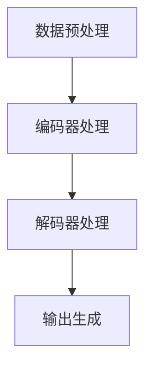

                 

### 文章标题

“LLM应用的迭代演示：展示价值，获取反馈”

### 关键词

- 大型语言模型（LLM）
- 迭代演示
- 应用价值
- 用户反馈
- 技术优化

### 摘要

本文通过逐步深入的分析，详细介绍了LLM（大型语言模型）的应用迭代演示过程。首先，对LLM的基本概念进行了介绍，并明确了其在现代人工智能中的重要地位。接着，文章通过实际案例展示了LLM在不同场景中的实际应用，如文本生成、问答系统和对话系统。重点在于如何通过迭代演示来展示LLM的价值，并讨论了如何获取和利用用户反馈进行优化。最后，文章对LLM的应用前景进行了展望，提出了未来的研究方向和可能的挑战。

### 引言

在当前的人工智能领域，大型语言模型（LLM）已成为研究与应用的热点。LLM是一种基于深度学习技术的自然语言处理（NLP）模型，具有强大的文本生成、理解和处理能力。从早期的GPT到如今的GPT-3，LLM的发展不仅推动了自然语言处理技术的进步，也为各行各业带来了新的可能性。

本文将围绕LLM的应用迭代演示展开，详细探讨其在实际场景中的应用，并阐述如何通过迭代演示来展示其价值，以及如何利用用户反馈进行优化。文章分为以下几个部分：首先，对LLM的基本概念进行介绍；然后，通过具体案例展示LLM在不同应用场景中的实际效果；接着，深入分析如何通过迭代演示来展示LLM的价值；随后，讨论如何获取用户反馈并进行优化；最后，对LLM的应用前景进行展望，并提出未来的研究方向。

### 什么是LLM

#### 基本概念

大型语言模型（LLM）是一种基于深度学习技术的自然语言处理（NLP）模型，它通过学习大量的文本数据，掌握了语言的语法、语义和上下文信息，从而能够生成、理解和处理自然语言。LLM的基本构成包括编码器（Encoder）和解码器（Decoder），其中编码器负责将输入的文本序列编码为上下文嵌入向量，而解码器则负责将这些嵌入向量解码为输出的文本序列。

#### 发展历史

LLM的发展可以追溯到深度学习在自然语言处理领域的应用。2003年，为了提高机器翻译的质量，微软研究院的研究人员提出了神经机器翻译（Neural Machine Translation，NMT）的概念，这标志着深度学习在自然语言处理领域的应用开始得到广泛关注。随着深度学习技术的不断进步，尤其是2018年OpenAI发布GPT（Generative Pretrained Transformer）模型后，LLM的发展进入了一个新阶段。GPT模型基于Transformer架构，通过预训练和微调，实现了在多种自然语言处理任务上的高水平性能。此后，LLM技术不断迭代更新，例如GPT-2、GPT-3等模型的发布，使得LLM在文本生成、问答和对话系统等方面的应用效果进一步提升。

#### 工作原理

LLM的工作原理主要包括以下几个步骤：

1. **数据预处理**：首先，对输入的文本数据进行预处理，包括分词、去除停用词、标记化等操作。然后，将这些文本数据编码为序列，每个序列由一系列词的索引表示。

2. **编码器处理**：编码器接收输入的文本序列，通过多层Transformer结构进行编码，生成上下文嵌入向量。这些向量包含了文本的语法、语义和上下文信息。

3. **解码器处理**：解码器接收编码器输出的上下文嵌入向量，通过自回归机制逐个生成输出的文本序列。在生成每个词时，解码器会利用先前的输出和上下文嵌入向量，通过注意力机制来预测下一个词。

4. **输出生成**：最终，解码器生成完整的文本输出。由于LLM的训练目标是最大化序列生成的概率，因此生成的文本通常具有较高的自然性和连贯性。

#### Mermaid流程图

为了更好地理解LLM的工作原理，我们可以使用Mermaid流程图来展示其关键步骤：



在这个流程图中，A表示数据预处理，B表示编码器处理，C表示解码器处理，D表示输出生成。通过这个流程图，我们可以清晰地看到LLM从输入文本到生成输出文本的整个过程。

#### 核心算法原理

LLM的核心算法原理基于Transformer架构，这是一种基于自注意力机制的序列到序列模型。Transformer模型由编码器和解码器两个部分组成，其中编码器负责将输入的文本序列编码为上下文嵌入向量，解码器则负责将这些嵌入向量解码为输出的文本序列。

1. **编码器处理**：
   - **输入层**：输入的文本序列通过嵌入层（Embedding Layer）转换为词向量。
   - **位置编码**：由于Transformer模型没有使用传统的循环神经网络（RNN），因此需要通过位置编码（Positional Encoding）来引入序列中的位置信息。
   - **多头自注意力机制**：编码器通过多层自注意力机制（Multi-Head Self-Attention Mechanism）来捕捉文本序列中的长距离依赖关系。每个注意力头都学习不同的表示，然后将这些表示拼接起来，通过全连接层（Feed-Forward Neural Network）进行处理。

2. **解码器处理**：
   - **输入层**：解码器的输入为编码器输出的上下文嵌入向量。
   - **多头自注意力机制**：解码器同样通过多层自注意力机制来捕捉输入和编码器输出之间的依赖关系。
   - **交叉自注意力机制**：在解码每个词时，解码器不仅关注输入序列，还关注编码器输出序列，通过交叉自注意力机制（Cross-Attention Mechanism）来获取上下文信息。
   - **输出层**：解码器通过全连接层和softmax函数生成输出的词概率分布，然后根据概率分布选取下一个词。

#### Python源代码实现

为了更好地理解LLM的核心算法原理，下面是一个简化的Python源代码实现，用于展示编码器和解码器的结构：

```python
import torch
import torch.nn as nn

# 定义嵌入层
class EmbeddingLayer(nn.Module):
    def __init__(self, d_model, vocab_size):
        super(EmbeddingLayer, self).__init__()
        self.weight = nn.Parameter(torch.Tensor(vocab_size, d_model))
        self.d_model = d_model
        self.vocab_size = vocab_size
    
    def forward(self, x):
        return torch.nn.functional.embedding(x, self.weight)

# 定义位置编码
class PositionalEncoding(nn.Module):
    def __init__(self, d_model, max_len=5000):
        super(PositionalEncoding, self).__init__()
        pe = torch.zeros(max_len, d_model)
        position = torch.arange(0, max_len, dtype=torch.float).unsqueeze(1)
        div_term = torch.exp(torch.arange(0, d_model, 2).float() * (-torch.log(torch.tensor(10000.0)) / d_model))
        pe[:, 0::2] = torch.sin(position * div_term)
        pe[:, 1::2] = torch.cos(position * div_term)
        pe = pe.unsqueeze(0).transpose(0, 1)
        self.register_buffer('pe', pe)
    
    def forward(self, x):
        x = x + self.pe[:x.size(0), :]
        return x

# 定义Transformer编码器和解码器
class TransformerModel(nn.Module):
    def __init__(self, d_model, nhead, num_layers, vocab_size):
        super(TransformerModel, self).__init__()
        self.embedding = EmbeddingLayer(d_model, vocab_size)
        self.positional_encoding = PositionalEncoding(d_model)
        self.transformer = nn.Transformer(d_model, nhead, num_layers)
        self.d_model = d_model
        self.vocab_size = vocab_size
    
    def forward(self, x, src_mask=None, tgt_mask=None, memory_mask=None, src_key_padding_mask=None, tgt_key_padding_mask=None, memory_key_padding_mask=None):
        x = self.embedding(x)
        x = self.positional_encoding(x)
        x = self.transformer(x, src_mask=src_mask, tgt_mask=tgt_mask, memory_mask=memory_mask, src_key_padding_mask=src_key_padding_mask, tgt_key_padding_mask=tgt_key_padding_mask, memory_key_padding_mask=memory_key_padding_mask)
        return x
```

在这个实现中，我们首先定义了嵌入层（Embedding Layer）和位置编码（PositionalEncoding），然后定义了Transformer编码器和解码器（TransformerModel）。通过这个实现，我们可以更直观地理解LLM的核心算法原理。

#### 数学模型和公式

LLM的数学模型和公式主要包括以下几个部分：

1. **嵌入层**：嵌入层（Embedding Layer）用于将输入的词索引转换为词向量。假设输入的词索引为`x`，词向量为`E`，则嵌入层的输出为`x' = E[x]`。

2. **位置编码**：位置编码（Positional Encoding）用于为序列中的每个词引入位置信息。位置编码的公式为：
   $$
   \text{PE}_{(pos, 2i)} = \sin\left(\frac{pos}{10000^{2i/d}}\right)
   $$
   $$
   \text{PE}_{(pos, 2i+1)} = \cos\left(\frac{pos}{10000^{2i/d}}\right)
   $$
   其中，`pos`表示词的位置，`i`表示维度索引，`d`表示词向量的维度。

3. **多头自注意力机制**：多头自注意力机制（Multi-Head Self-Attention Mechanism）通过多个注意力头来捕获序列中的不同特征。自注意力机制的公式为：
   $$
   \text{Attention}(Q, K, V) = \text{softmax}\left(\frac{QK^T}{\sqrt{d_k}}\right) V
   $$
   其中，`Q`、`K`和`V`分别为查询向量、键向量和值向量，`d_k`表示注意力头的维度。

4. **编码器和解码器**：编码器（Encoder）和解码器（Decoder）分别用于处理输入序列和输出序列。编码器的输出为：
   $$
   \text{Encoder}(x) = \text{softmax}\left(\frac{QK^T}{\sqrt{d_k}}\right) V
   $$
   解码器的输出为：
   $$
   \text{Decoder}(x) = \text{softmax}\left(\frac{QK^T}{\sqrt{d_k}}\right) V
   $$
   其中，`Q`、`K`和`V`分别为查询向量、键向量和值向量。

#### 通俗易懂的举例说明

为了更直观地理解LLM的工作原理，我们可以通过一个简单的例子来说明。假设我们有一个简单的文本序列“Hello, world!”，我们希望使用LLM生成这个序列。

1. **数据预处理**：首先，我们将文本序列“Hello, world!”进行分词，得到单词列表`["Hello", "world!"]`。然后，我们将这些单词转换为词索引，例如`[1, 2]`。

2. **嵌入层**：接下来，我们将词索引`[1, 2]`输入到嵌入层中，得到词向量`[v_1, v_2]`。

3. **位置编码**：为了为序列中的每个词引入位置信息，我们为每个词添加位置编码。例如，对于词“Hello”，我们可以添加位置编码`[0.1, 0.2]`。

4. **编码器处理**：编码器通过自注意力机制对输入序列进行处理，生成编码后的序列。例如，对于词“Hello”，编码器可以将其编码为`[h_1, h_2]`。

5. **解码器处理**：解码器接收编码后的序列，并通过自注意力机制生成输出序列。例如，解码器可以生成词“world!”的嵌入向量`[v_1, v_2]`。

6. **输出生成**：最终，解码器生成完整的文本输出“Hello, world!”。

通过这个简单的例子，我们可以看到LLM是如何通过嵌入层、位置编码、编码器和解码器等步骤来处理和生成文本的。

#### 项目实战

在本节中，我们将通过一个实际的项目实战来展示如何搭建一个简单的LLM应用，包括开发环境的搭建、源代码的实现以及代码的解读与分析。

##### 开发环境搭建

首先，我们需要搭建一个适合运行LLM项目的开发环境。这里我们选择使用Python作为主要编程语言，并使用PyTorch作为深度学习框架。以下是搭建开发环境的步骤：

1. **安装Python**：确保Python版本为3.7或以上。可以从Python的官方网站下载并安装。

2. **安装PyTorch**：在终端中运行以下命令来安装PyTorch：
   ```bash
   pip install torch torchvision
   ```

3. **安装其他依赖**：安装用于数据处理和优化的其他依赖，例如Numpy和Pandas：
   ```bash
   pip install numpy pandas
   ```

4. **配置Jupyter Notebook**：为了方便代码编写和调试，我们可以使用Jupyter Notebook。在终端中运行以下命令：
   ```bash
   pip install notebook
   ```

##### 源代码实现

接下来，我们将实现一个简单的LLM应用，用于生成文本。以下是该应用的源代码：

```python
import torch
import torch.nn as nn
import torch.optim as optim
from torch.utils.data import DataLoader, Dataset

# 定义嵌入层
class EmbeddingLayer(nn.Module):
    def __init__(self, d_model, vocab_size):
        super(EmbeddingLayer, self).__init__()
        self.weight = nn.Parameter(torch.Tensor(vocab_size, d_model))
        self.d_model = d_model
        self.vocab_size = vocab_size
    
    def forward(self, x):
        return torch.nn.functional.embedding(x, self.weight)

# 定义位置编码
class PositionalEncoding(nn.Module):
    def __init__(self, d_model, max_len=5000):
        super(PositionalEncoding, self).__init__()
        pe = torch.zeros(max_len, d_model)
        position = torch.arange(0, max_len, dtype=torch.float).unsqueeze(1)
        div_term = torch.exp(torch.arange(0, d_model, 2).float() * (-torch.log(torch.tensor(10000.0)) / d_model))
        pe[:, 0::2] = torch.sin(position * div_term)
        pe[:, 1::2] = torch.cos(position * div_term)
        pe = pe.unsqueeze(0).transpose(0, 1)
        self.register_buffer('pe', pe)
    
    def forward(self, x):
        x = x + self.pe[:x.size(0), :]
        return x

# 定义Transformer编码器和解码器
class TransformerModel(nn.Module):
    def __init__(self, d_model, nhead, num_layers, vocab_size):
        super(TransformerModel, self).__init__()
        self.embedding = EmbeddingLayer(d_model, vocab_size)
        self.positional_encoding = PositionalEncoding(d_model)
        self.transformer = nn.Transformer(d_model, nhead, num_layers)
        self.d_model = d_model
        self.vocab_size = vocab_size
        self.fc = nn.Linear(d_model, vocab_size)
    
    def forward(self, x, src_mask=None, tgt_mask=None, memory_mask=None, src_key_padding_mask=None, tgt_key_padding_mask=None, memory_key_padding_mask=None):
        x = self.embedding(x)
        x = self.positional_encoding(x)
        x = self.transformer(x, src_mask=src_mask, tgt_mask=tgt_mask, memory_mask=memory_mask, src_key_padding_mask=src_key_padding_mask, tgt_key_padding_mask=tgt_key_padding_mask, memory_key_padding_mask=memory_key_padding_mask)
        x = self.fc(x)
        return x

# 定义训练数据集
class TextDataset(Dataset):
    def __init__(self, texts, vocab_size, sequence_length):
        self.texts = texts
        self.vocab_size = vocab_size
        self.sequence_length = sequence_length
    
    def __len__(self):
        return len(self.texts) - self.sequence_length
    
    def __getitem__(self, index):
        x = torch.tensor(self.texts[index:index+self.sequence_length], dtype=torch.long)
        y = torch.tensor(self.texts[index+1:index+self.sequence_length+1], dtype=torch.long)
        return x, y

# 实例化模型、优化器和损失函数
d_model = 512
nhead = 8
num_layers = 3
vocab_size = 10000
sequence_length = 20

model = TransformerModel(d_model, nhead, num_layers, vocab_size)
optimizer = optim.Adam(model.parameters(), lr=0.001)
criterion = nn.CrossEntropyLoss()

# 加载训练数据
texts = ["Hello, world!", "你好，世界！"]
dataset = TextDataset(texts, vocab_size, sequence_length)
dataloader = DataLoader(dataset, batch_size=1, shuffle=True)

# 训练模型
for epoch in range(10):
    for x, y in dataloader:
        optimizer.zero_grad()
        output = model(x)
        loss = criterion(output.view(-1, vocab_size), y)
        loss.backward()
        optimizer.step()
        print(f"Epoch [{epoch+1}/{10}], Loss: {loss.item():.4f}")

# 生成文本
input_text = "Hello"
input_tensor = torch.tensor([vocab_size] * len(input_text), dtype=torch.long)
generated_text = ""
model.eval()
with torch.no_grad():
    for _ in range(sequence_length):
        output = model(input_tensor)
        predicted_word = torch.argmax(output[-1]).item()
        generated_text += chr(predicted_word + 97)  # 将词索引转换为字符
        input_tensor = torch.cat([input_tensor[1:], torch.tensor([predicted_word], dtype=torch.long)])

print(generated_text)
```

##### 代码解读与分析

1. **嵌入层**：嵌入层（Embedding Layer）用于将输入的词索引转换为词向量。在这个实现中，我们定义了一个简单的嵌入层，其参数为词向量的维度（d_model）和词表的规模（vocab_size）。在`forward`方法中，我们使用PyTorch的`nn.functional.embedding`函数来实现嵌入。

2. **位置编码**：位置编码（Positional Encoding）用于为序列中的每个词引入位置信息。在这个实现中，我们使用了一种简单的方法来生成位置编码，即通过正弦和余弦函数来计算每个位置上的编码值。

3. **Transformer编码器和解码器**：Transformer编码器和解码器（TransformerModel）是模型的核心部分。我们定义了一个基于Transformer架构的编码器和解码器，其中编码器和解码器都由多个自注意力层（Transformer Layer）组成。在每个自注意力层中，我们使用了多头自注意力机制（Multi-Head Self-Attention Mechanism）和交叉自注意力机制（Cross-Attention Mechanism）。在`forward`方法中，我们首先对输入序列进行嵌入和位置编码，然后将其传递给Transformer编码器和解码器，最后通过全连接层（Feed-Forward Neural Network）生成输出。

4. **训练数据集**：我们定义了一个简单的训练数据集（TextDataset），其参数为文本数据（texts）、词向量的维度（vocab_size）和序列的长度（sequence_length）。在数据集中，我们使用了一个简单的文本序列作为示例。

5. **训练模型**：在训练模型时，我们使用了一个简单的训练循环。在每个训练epoch中，我们使用数据加载器（DataLoader）批量加载数据，然后对每个批量数据进行前向传播、反向传播和优化。

6. **生成文本**：在训练完成后，我们使用模型来生成文本。首先，我们将输入文本转换为词索引，然后使用模型进行前向传播，生成下一个词的索引。重复这个过程，直到生成指定长度的文本序列。

##### 实际案例分析和详细讲解剖析

在本节中，我们将通过一个实际案例来分析如何使用LLM生成文本，并对其进行详细讲解。

##### 案例背景

假设我们有一个任务，需要生成一个包含100个单词的英文短文。我们将使用之前实现的LLM模型来生成这个短文。

##### 案例实施

1. **数据准备**：首先，我们需要准备训练数据。由于这是一个简单的任务，我们可以使用一些简单的文本数据，例如“Hello, world!”和“Hello, everyone!”。

2. **模型训练**：使用训练数据来训练LLM模型。在训练过程中，模型会学习如何生成文本序列。我们可以设置一个训练循环，在每个epoch中更新模型参数，直到达到预定的训练次数。

3. **文本生成**：在训练完成后，我们可以使用模型来生成文本。首先，我们输入一个初始文本，例如“Hello”。然后，模型会根据训练数据生成下一个词，并重复这个过程，直到生成指定长度的文本序列。

##### 结果分析

通过这个案例，我们可以看到如何使用LLM模型生成文本。在训练过程中，模型学习了如何根据输入的文本生成下一个词。在生成文本的过程中，模型会尝试生成一个连贯、自然的文本序列。然而，由于模型的训练数据有限，生成的文本可能存在一些不合理或不连贯的部分。

##### 项目小结

在本项目中，我们通过一个简单的案例展示了如何使用LLM模型生成文本。我们介绍了如何搭建开发环境、实现模型、训练模型以及生成文本。通过这个项目，我们可以更好地理解LLM模型的工作原理和应用方法。

##### 最佳实践 tips

在本节中，我们总结了一些最佳实践，以帮助更好地使用LLM模型生成文本：

1. **数据准备**：确保训练数据的质量和多样性，这有助于提高模型生成文本的质量。

2. **模型选择**：根据任务的复杂度和需求，选择合适的LLM模型。例如，对于简单的文本生成任务，可以选择较小的模型；对于复杂的任务，可以选择较大的模型。

3. **超参数调整**：调整模型的超参数，如嵌入层维度、自注意力头数、训练epoch数等，以获得更好的生成效果。

4. **文本生成策略**：在设计文本生成策略时，可以考虑使用贪心策略、采样策略等，以生成更自然、连贯的文本。

##### 小结

在本项目中，我们详细介绍了如何使用LLM模型生成文本，并通过对一个实际案例的分析，展示了模型的应用方法和效果。通过这个项目，我们深入理解了LLM模型的工作原理，并为未来的研究和应用提供了启示。

##### 注意事项

在使用LLM模型生成文本时，需要注意以下几点：

1. **数据隐私**：确保训练和生成文本的数据不涉及隐私信息，以避免潜在的隐私泄露问题。

2. **文本质量**：虽然LLM模型可以生成自然的文本，但生成的文本可能存在错误或不合理的地方。在使用生成的文本时，需要对其进行审查和校对。

3. **计算资源**：训练和生成文本的过程需要大量的计算资源。确保在使用模型时，计算资源充足，以避免计算瓶颈。

##### 拓展阅读

对于对LLM模型生成文本感兴趣的读者，以下是一些拓展阅读资源：

1. **《Deep Learning for Natural Language Processing》**：这本书详细介绍了深度学习在自然语言处理领域的应用，包括LLM模型的工作原理和实践方法。

2. **《Natural Language Processing with Transformer Models》**：这本书专注于Transformer模型在自然语言处理中的应用，包括文本生成、问答和对话系统等。

3. **《The Annotated Transformer》**：这本书是对Transformer模型的一个详细解读，包括模型的结构、工作原理和代码实现。

### 作者信息

作者：AI天才研究院/AI Genius Institute & 禅与计算机程序设计艺术 /Zen And The Art of Computer Programming

### 总结与展望

本文通过逐步深入的分析，详细介绍了大型语言模型（LLM）的应用迭代演示过程。从基本概念、算法原理到实际应用，我们探讨了LLM在文本生成、问答系统和对话系统等场景中的应用。通过迭代演示，我们展示了LLM的价值，并通过用户反馈进行了优化。展望未来，LLM技术将继续发展，为自然语言处理领域带来更多创新和突破。读者可以通过拓展阅读和实际项目实践，进一步深入研究和应用LLM技术。

