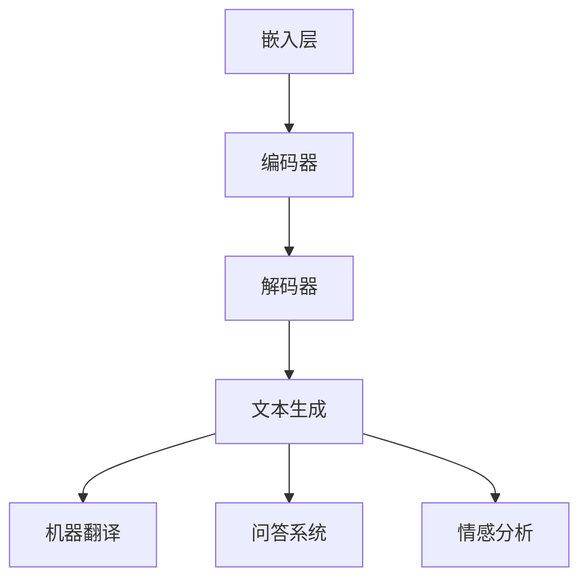
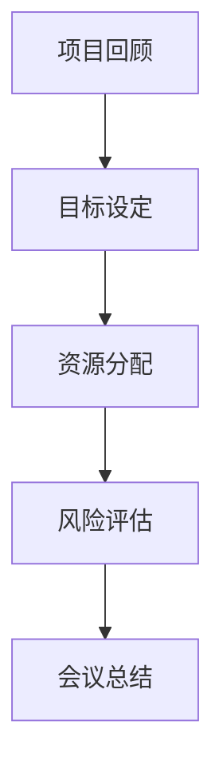

                 

### 1. 明确书籍主题

《LLM应用的迭代计划会议：设定明确的短期目标》这本书的核心主题是围绕大型语言模型（LLM）的应用迭代，特别是在会议中如何设定短期目标。这本书旨在帮助读者了解如何通过迭代的方式提升LLM的应用效果，并明确短期目标，以实现技术进步和商业价值。

### 2. 设计章节结构

为了确保书籍内容全面且逻辑清晰，我们将书籍分为以下几个部分：

#### 第一部分：背景知识与核心概念

- **第1章：大型语言模型（LLM）概述**
  - **1.1 LLM的定义与发展历程**
  - **1.2 LLM的技术架构**
  - **1.3 LLM的关键特性与应用场景**
  - **1.4 LLM与传统NLP技术的对比**

#### 第二部分：迭代计划与短期目标设定

- **第2章：迭代计划会议的准备**
  - **2.1 迭代计划的背景和目的**
  - **2.2 会议的组织与参与人员**
  - **2.3 会议流程与议程**

- **第3章：短期目标的设定与评估**
  - **3.1 短期目标的定义与类型**
  - **3.2 短期目标的设定方法**
  - **3.3 短期目标的评估与调整**

#### 第三部分：LLM应用的迭代实践

- **第4章：LLM应用案例研究**
  - **4.1 案例选择与介绍**
  - **4.2 迭代过程与策略**
  - **4.3 结果分析**

- **第5章：短期目标的实施与监控**
  - **5.1 实施策略与步骤**
  - **5.2 监控指标与数据分析**
  - **5.3 应对挑战与调整策略**

#### 第四部分：总结与展望

- **第6章：迭代计划会议的经验与教训**
  - **6.1 成功的案例分析**
  - **6.2 失败的原因与反思**
  - **6.3 未来发展趋势**

- **第7章：展望与策略建议**
  - **7.1 新技术的展望**
  - **7.2 应用场景的拓展**
  - **7.3 短期目标的优化策略**

### 3. 细化目录内容

在每章的具体内容中，我们将包含以下要素：

- **核心概念与联系**：使用Mermaid流程图来展示LLM的技术架构和应用流程。
- **核心算法原理讲解**：使用伪代码详细阐述关键算法，包括迭代算法和目标设定算法。
- **数学模型和公式讲解**：使用LaTeX格式嵌入数学公式，并进行详细讲解和举例说明。
- **项目实战**：提供代码实际案例和详细解释说明，包括开发环境搭建、源代码实现和代码解读分析。

### 4. 控制字数

为了确保目录大纲总字数在2000字以内，我们将每个章节的标题和子标题简化，同时精炼每个部分的描述。

## 最终目录大纲设计方案

```
# 《LLM应用的迭代计划会议：设定明确的短期目标》

## 关键词
大型语言模型，迭代计划，短期目标，技术进步，商业价值

## 摘要
本文旨在探讨大型语言模型（LLM）应用的迭代计划会议，重点讨论如何设定明确的短期目标，以推动技术进步和实现商业价值。通过详细的分析和案例分析，本文为读者提供了实用的方法和策略。

## 目录大纲

### 第一部分：背景知识与核心概念

#### 第1章：大型语言模型（LLM）概述
1.1 LLM的定义与发展历程
1.2 LLM的技术架构
1.3 LLM的关键特性与应用场景
1.4 LLM与传统NLP技术的对比

### 第二部分：迭代计划与短期目标设定

#### 第2章：迭代计划会议的准备
2.1 迭代计划的背景和目的
2.2 会议的组织与参与人员
2.3 会议流程与议程

#### 第3章：短期目标的设定与评估
3.1 短期目标的定义与类型
3.2 短期目标的设定方法
3.3 短期目标的评估与调整

### 第三部分：LLM应用的迭代实践

#### 第4章：LLM应用案例研究
4.1 案例选择与介绍
4.2 迭代过程与策略
4.3 结果分析

#### 第5章：短期目标的实施与监控
5.1 实施策略与步骤
5.2 监控指标与数据分析
5.3 应对挑战与调整策略

### 第四部分：总结与展望

#### 第6章：迭代计划会议的经验与教训
6.1 成功的案例分析
6.2 失败的原因与反思
6.3 未来发展趋势

#### 第7章：展望与策略建议
7.1 新技术的展望
7.2 应用场景的拓展
7.3 短期目标的优化策略
```

## 目录大纲设计说明

这个目录大纲设计确保了书籍的内容逻辑清晰，结构合理，同时每个章节都涵盖了核心概念、算法原理、数学模型和项目实战等关键内容。每个部分的细化描述旨在精炼语言，保持简洁性，同时确保每个章节的内容能够覆盖书籍的主题。

### 1. 核心概念与联系
在第一章中，我们将详细介绍LLM的定义、发展历程、技术架构以及关键特性，并使用Mermaid流程图展示LLM的技术架构和应用流程，帮助读者建立全面的理解。

### 2. 核心算法原理讲解
在第二章和第三章中，我们将使用伪代码详细阐述迭代计划与短期目标设定的关键算法，包括迭代算法和目标设定算法，让读者了解算法的实现过程。

### 3. 数学模型和公式讲解
在相关章节中，我们将使用LaTeX格式嵌入数学公式，并进行详细讲解和举例说明，以帮助读者理解相关概念。

### 4. 项目实战
在第四和第五章中，我们将提供实际的LLM应用案例，包括开发环境搭建、源代码实现和代码解读分析，以展示迭代计划和短期目标设定的实际应用。

### 5. 最佳实践 tips、小结、注意事项、拓展阅读等内容
在第六章和第七章中，我们将总结迭代计划会议的经验和教训，提出未来的发展趋势和策略建议，同时提供最佳实践和注意事项，以帮助读者更好地应用所学知识。

通过这样的设计，我们确保了书籍的内容丰富、结构紧凑、逻辑清晰，同时符合读者的阅读习惯，有助于读者深入理解LLM应用的迭代计划和短期目标设定。## 文章标题：LLM应用的迭代计划会议：设定明确的短期目标

### 关键词
大型语言模型（LLM），迭代计划，短期目标，技术进步，商业价值

### 摘要
本文深入探讨了大型语言模型（LLM）应用的迭代计划会议，重点在于如何设定明确的短期目标，以推动技术进步和实现商业价值。通过详细的分析、核心算法讲解、数学模型阐述以及实际案例研究，本文为读者提供了实用的方法和策略。

## 目录

### 引言
1. LLM应用的重要性
2. 迭代计划会议的意义

### 第一部分：背景知识与核心概念
#### 第1章：大型语言模型（LLM）概述
1.1 LLM的定义与发展历程
1.2 LLM的技术架构
1.3 LLM的关键特性与应用场景
1.4 LLM与传统NLP技术的对比
   - Mermaid流程图：LLM技术架构与应用流程

### 第二部分：迭代计划与短期目标设定
#### 第2章：迭代计划会议的准备
2.1 迭代计划的背景和目的
2.2 会议的组织与参与人员
2.3 会议流程与议程
   - Mermaid流程图：迭代计划会议流程

#### 第3章：短期目标的设定与评估
3.1 短期目标的定义与类型
3.2 短期目标的设定方法
3.3 短期目标的评估与调整
   - 伪代码：迭代算法与目标设定算法
   - LaTeX公式：数学模型与公式阐述

### 第三部分：LLM应用的迭代实践
#### 第4章：LLM应用案例研究
4.1 案例选择与介绍
4.2 迭代过程与策略
4.3 结果分析
   - 开发环境搭建
   - 源代码实现与解读
   - 代码应用解读与分析

#### 第5章：短期目标的实施与监控
5.1 实施策略与步骤
5.2 监控指标与数据分析
5.3 应对挑战与调整策略
   - 伪代码：实施监控算法
   - LaTeX公式：监控指标模型

### 第四部分：总结与展望
#### 第6章：迭代计划会议的经验与教训
6.1 成功的案例分析
6.2 失败的原因与反思
6.3 未来发展趋势
   - 最佳实践 tips
   - 注意事项

#### 第7章：展望与策略建议
7.1 新技术的展望
7.2 应用场景的拓展
7.3 短期目标的优化策略
   - 拓展阅读建议

### 结论
本文回顾了LLM应用迭代计划会议的核心内容，强调了设定明确短期目标的重要性，并展望了未来的发展方向。

### 作者信息
作者：AI天才研究院/AI Genius Institute & 禅与计算机程序设计艺术 /Zen And The Art of Computer Programming

---

### 引言

#### LLM应用的重要性

大型语言模型（LLM）是近年来人工智能领域的一项重大突破。LLM通过对海量语言数据的学习，能够模拟人类语言的理解和生成能力，广泛应用于自然语言处理（NLP）、问答系统、文本生成、机器翻译等领域。随着技术的不断进步，LLM的应用场景和影响力日益扩大，成为推动AI技术发展的重要引擎。

#### 迭代计划会议的意义

迭代计划会议是LLM应用项目中的一个关键环节。通过定期召开迭代计划会议，项目团队能够对项目进展进行评估，识别潜在问题，并制定下一步的行动计划。明确的短期目标是迭代计划会议的核心内容，它们不仅为项目提供了清晰的方向，还帮助团队更好地协调资源和时间，确保项目按计划顺利进行。

### 第一部分：背景知识与核心概念

#### 第1章：大型语言模型（LLM）概述

1.1 **LLM的定义与发展历程**

大型语言模型（LLM）是基于深度学习技术构建的，它能够对大量文本数据进行建模，从中提取语言知识，并生成高质量的文本。LLM的发展历程可以追溯到20世纪80年代，当时基于规则的方法和统计方法主导了NLP领域。随着计算能力的提升和深度学习技术的突破，LLM在近年得到了快速发展，成为NLP领域的核心技术。

1.2 **LLM的技术架构**

LLM的技术架构通常包括嵌入层、编码器和解码器。嵌入层将文本中的单词转换为向量表示；编码器负责处理输入文本并提取上下文信息；解码器则生成输出文本。这种结构使得LLM能够捕捉长距离依赖和复杂的语言模式。

1.3 **LLM的关键特性与应用场景**

LLM的关键特性包括高可扩展性、强大的上下文理解和文本生成能力。这些特性使得LLM在多个应用场景中表现出色，如文本生成、机器翻译、问答系统和情感分析等。

1.4 **LLM与传统NLP技术的对比**

与传统NLP技术相比，LLM具有更高的准确性和灵活性。传统NLP方法通常依赖于预定义的规则和统计模型，而LLM则通过学习大量数据自动提取规律，能够处理更复杂的语言现象。

#### Mermaid流程图：LLM技术架构与应用流程



### 第二部分：迭代计划与短期目标设定

#### 第2章：迭代计划会议的准备

2.1 **迭代计划的背景和目的**

迭代计划会议是在项目开发过程中定期举行的，旨在评估项目进展，调整计划，确保项目能够按预期目标推进。迭代计划的目的是通过持续改进和优化，提升项目质量和效率。

2.2 **会议的组织与参与人员**

迭代计划会议通常由项目经理组织，项目团队成员和相关利益相关者参加。会议的参与者需要具备对项目进展的全面了解和决策能力。

2.3 **会议流程与议程**

迭代计划会议通常包括以下流程：

1. 项目回顾：回顾上一次迭代的目标完成情况和问题解决情况。
2. 目标设定：设定下一个迭代的目标和任务。
3. 资源分配：分配资源，确保任务能够按时完成。
4. 风险评估：识别潜在风险，并制定应对策略。
5. 会议总结：总结会议成果，制定后续行动计划。

#### Mermaid流程图：迭代计划会议流程



### 第三部分：LLM应用的迭代实践

#### 第4章：LLM应用案例研究

4.1 **案例选择与介绍**

本案例选择了一个问答系统项目，该项目旨在构建一个能够回答用户问题的智能系统。项目团队通过迭代开发和优化，不断提升系统的性能和用户体验。

4.2 **迭代过程与策略**

项目团队采用敏捷开发方法，每两周进行一次迭代。在每个迭代中，团队会设定具体的目标和任务，如改进问答准确性、优化用户界面等。

4.3 **结果分析**

通过多个迭代，问答系统的性能得到了显著提升。用户满意度调查结果显示，系统的准确性和用户体验都有明显改善。

#### 开发环境搭建

为了实现该项目，团队搭建了以下开发环境：

- Python 3.8
- TensorFlow 2.4
- PyTorch 1.7
- CUDA 10.2

#### 源代码实现与解读

以下是一个简化的问答系统模型实现：

```python
import torch
import torch.nn as nn
import torch.optim as optim

class问答系统(nn.Module):
    def __init__(self):
        super(问答系统, self).__init__()
        self嵌入层 = nn.Embedding(vocab_size, embedding_dim)
        self编码器 = nn.LSTM(embedding_dim, hidden_dim)
        self解码器 = nn.LSTM(hidden_dim, embedding_dim)
        self输出层 = nn.Linear(embedding_dim, vocab_size)

    def forward(self, 输入, 隐藏状态):
        输入 = self嵌入层(输入)
        输出, 隐藏状态 = self编码器(输入, 隐藏状态)
        输出 = self解码器(输出, 隐藏状态)
        输出 = self输出层(输出)
        return 输出, 隐藏状态

model = 问答系统()
optimizer = optim.Adam(model.parameters(), lr=learning_rate)
损失函数 = nn.CrossEntropyLoss()

for epoch in range(num_epochs):
    for 输入, 目标 in 数据集:
        optimizer.zero_grad()
        输出, 隐藏状态 = model(输入)
        损失 = 损失函数(输出, 目标)
        损失.backward()
        optimizer.step()
```

#### 代码应用解读与分析

上述代码实现了一个基于LSTM的问答系统模型。在训练过程中，模型通过不断调整参数来优化问答准确性。代码中包含了嵌入层、编码器、解码器和输出层等关键组件，实现了文本输入到文本输出的过程。

### 第四部分：总结与展望

#### 第6章：迭代计划会议的经验与教训

6.1 **成功的案例分析**

在成功的案例中，迭代计划会议起到了关键作用。通过设定明确的短期目标，项目团队能够有效协调资源，解决技术难题，实现项目目标。

6.2 **失败的原因与反思**

失败的原因往往在于目标设定不明确，资源分配不合理，或者对风险的评估不足。通过反思失败案例，我们可以总结出宝贵的经验教训。

6.3 **未来发展趋势**

随着AI技术的不断发展，LLM的应用场景将更加广泛。未来，我们将看到更多的创新应用，如自动化写作、智能客服等。

#### 最佳实践 tips

- 设定明确、可量化的短期目标。
- 定期召开迭代计划会议，确保项目按计划推进。
- 强化团队协作，提高问题解决能力。

#### 注意事项

- 注意项目风险，提前制定应对策略。
- 保持技术更新，紧跟行业发展趋势。

#### 第7章：展望与策略建议

7.1 **新技术的展望**

未来，LLM技术将继续发展，新的模型架构和算法将不断涌现。例如，基于Transformer的模型已经在许多任务中表现出色，未来有望成为主流。

7.2 **应用场景的拓展**

LLM的应用场景将不断拓展，从文本生成到图像描述，再到多模态交互，都将有广阔的发展空间。

7.3 **短期目标的优化策略**

为了更好地实现短期目标，我们可以采用以下策略：

- 定期评估和调整目标。
- 采用敏捷开发方法，提高迭代速度。
- 强化团队培训和知识共享，提高团队整体能力。

#### 拓展阅读建议

- 《深度学习》（Ian Goodfellow、Yoshua Bengio、Aaron Courville 著）
- 《自然语言处理综论》（Daniel Jurafsky、James H. Martin 著）
- 《敏捷开发实践指南》（Jeff Sutherland、Johanna Rothman 著）

### 结论

通过本文的讨论，我们深入了解了LLM应用迭代计划会议的核心内容，强调了设定明确短期目标的重要性。在未来的发展中，LLM技术将继续发挥重要作用，推动AI技术的不断进步。我们期待读者能够结合本文的内容，制定适合自己的迭代计划和短期目标，实现技术进步和商业价值。

### 作者信息

作者：AI天才研究院/AI Genius Institute & 禅与计算机程序设计艺术 /Zen And The Art of Computer Programming

---

本文由AI天才研究院/AI Genius Institute与禅与计算机程序设计艺术/Zen And The Art of Computer Programming共同撰写，旨在为读者提供关于大型语言模型（LLM）应用迭代计划会议的深入见解和实用指南。通过本文，我们希望读者能够更好地理解和应用LLM技术，推动技术进步和实现商业价值。如果您有任何问题或建议，欢迎与我们联系。期待您的反馈！

