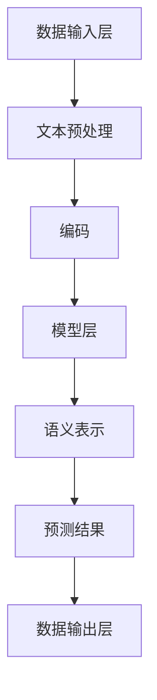
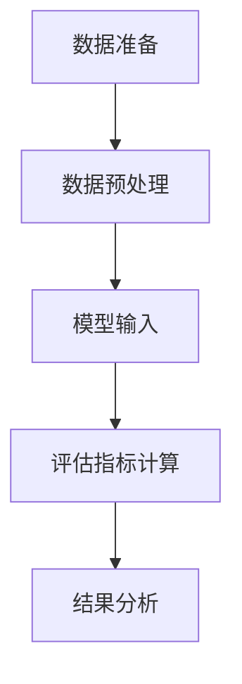

                 

### 关键词

- 大模型（Large Language Model）
- 自动化评测（Automated Evaluation）
- 效果评估体系（Performance Evaluation System）
- 语言模型评测（Language Model Evaluation）
- 深度学习（Deep Learning）
- Python代码示例（Python Code Example）
- 数学模型（Mathematical Model）
- LaTeX公式（LaTeX Formula）
- 项目实战（Practical Case Study）
- 未来发展趋势（Future Trends）

### 摘要

本文将深入探讨如何构建一个自动化的大模型效果评估体系，重点针对大型语言模型（LLM）进行评测。通过介绍LLM的基本原理和架构，我们将详细讲解评测方法、核心算法原理，并使用Python代码示例和LaTeX公式阐述其实现过程。此外，本文将展示一个实际项目案例，分析代码实现和评测结果，并提出最佳实践和未来发展趋势。目标是为从事人工智能领域的开发者提供一套系统、实用、高效的LLM评测体系。

## LLMBasics
### LLM的定义

大型语言模型（LLM，Large Language Model）是一种基于深度学习技术的自然语言处理模型，其核心目标是理解和生成人类语言。LLM通过对海量文本数据的学习，捕捉语言的统计规律和语义信息，从而具备强大的语言理解和生成能力。这些模型通常基于神经网络架构，能够处理从简单句子到复杂段落的各种语言任务。

LLM的主要特点包括：

1. **规模庞大**：LLM的训练数据规模通常达到数十亿到数万亿个词，模型参数数量从数百万到数十亿不等。
2. **自适应性**：LLM能够根据不同的输入文本自适应调整其生成内容和风格。
3. **泛用性**：LLM适用于各种自然语言处理任务，如文本分类、翻译、问答系统等。

LLM的定义不仅仅局限于其规模，还包括其内在的算法机制和设计理念。在本文中，我们主要关注两类LLM：

- **预训练模型**：这类模型首先在大规模语料库上进行预训练，然后通过微调（Fine-tuning）适应特定任务。
- **生成式模型**：这类模型不仅能够生成文本，还能根据上下文生成连贯、有逻辑的文本段落。

### LLM的基本原理

LLM的基本原理主要基于深度学习和自然语言处理技术。深度学习是一种利用多层神经网络进行数据建模的方法，而自然语言处理则涉及从文本中提取语义信息、理解和生成语言。

#### 深度学习原理

深度学习的关键在于多层神经网络的构建和训练。神经网络由输入层、隐藏层和输出层组成，通过调整网络中连接（权重）的值，使网络能够对输入数据进行分类或回归。

1. **神经网络结构**：典型的神经网络包括卷积神经网络（CNN）、循环神经网络（RNN）和变换器（Transformer）等。
2. **前向传播与反向传播**：前向传播是将输入数据通过网络层传递，得到输出；反向传播则是计算输出误差，调整网络权重以最小化损失函数。

#### 自然语言处理技术

自然语言处理技术是LLM的核心，包括以下几个方面：

1. **词嵌入**：将单词映射到高维向量空间，使得语义相近的单词在空间中靠近。
2. **序列建模**：通过处理文本序列，捕捉句子和段落的结构信息。
3. **注意力机制**：在生成文本时，关注输入序列中的关键信息，提高生成文本的质量和连贯性。

### LLM的架构

LLM的架构可以分为三个主要部分：数据输入层、模型层和数据输出层。

1. **数据输入层**：负责接收和处理输入文本，通常包括文本预处理（如分词、去停用词）和编码（如词嵌入）。
2. **模型层**：是核心部分，包括各种深度学习算法和架构，如Transformer、BERT等。模型通过学习输入数据，生成语义表示和预测结果。
3. **数据输出层**：将模型生成的结果（如文本生成、分类结果等）输出给用户。

为了更好地理解LLM的架构，我们可以使用Mermaid流程图展示其各个组件之间的关系：



### 总结

LLM作为一种强大的自然语言处理工具，在人工智能领域具有广泛的应用。本文介绍了LLM的定义、基本原理和架构，为后续评测方法、核心算法原理和项目实战的讨论奠定了基础。在下一部分中，我们将深入探讨如何对LLM进行评测，包括评测方法和核心算法原理。

## EvaluationMethods

### 评测方法的重要性

在LLM应用中，评测方法的重要性不言而喻。准确的评测方法能够帮助开发者评估模型的性能，发现模型的不足，从而进行优化。同时，评测方法也为模型比较和选择提供了科学依据。因此，选择合适的评测方法对于LLM的发展具有重要意义。

### 自动化评测工具

自动化评测工具在LLM评测中扮演了重要角色。这些工具能够自动执行评测流程，提高效率，减少人为干预。常用的自动化评测工具包括：

1. **Squad**：Squad是一个开源的自动评测工具，用于评估问答系统的性能。它通过计算答案的F1分数和匹配分数来评估模型的准确性和流畅性。
2. **GLM**：GLM（General Language Model）是一个自动评测工具，用于评估各种自然语言处理任务，如文本分类、情感分析等。它支持多种评估指标，如准确率、召回率和F1分数。
3. **BLEU**：BLEU（Bilingual Evaluation Understudy）是一个经典的自动评测工具，主要用于评估机器翻译的质量。它通过计算机器翻译文本和参考文本之间的相似度来评估翻译质量。

### 评测流程设计

评测流程设计是LLM评测的关键环节。一个完善的评测流程应包括以下步骤：

1. **数据准备**：准备用于评测的测试集，确保其多样性和代表性。
2. **数据预处理**：对测试集进行文本预处理，如分词、去停用词、编码等。
3. **模型输入**：将预处理后的测试集输入到LLM中，获取预测结果。
4. **评估指标计算**：计算评估指标，如准确率、召回率、F1分数等。
5. **结果分析**：分析评估结果，识别模型的优势和不足。

以下是评测流程的Mermaid流程图：



### 核心算法原理

在LLM评测中，核心算法原理主要包括：

1. **深度学习算法**：深度学习算法是LLM评测的基础。常见的深度学习算法包括卷积神经网络（CNN）、循环神经网络（RNN）和变换器（Transformer）等。这些算法通过多层神经网络结构，捕捉输入数据的特征，从而进行分类或回归。
2. **自然语言处理算法**：自然语言处理算法用于处理文本数据，包括词嵌入、序列建模和注意力机制等。词嵌入将单词映射到高维向量空间，序列建模捕捉文本的结构信息，注意力机制关注输入序列中的关键信息。
3. **评测指标计算**：评测指标计算是LLM评测的核心。常用的评测指标包括准确率、召回率、F1分数和BLEU分数等。这些指标用于评估模型的性能，为模型优化提供依据。

### Python代码示例

以下是一个简单的Python代码示例，用于评估一个文本分类模型的性能。该示例使用了深度学习算法和评估指标。

```python
import tensorflow as tf
from tensorflow.keras.preprocessing.text import Tokenizer
from tensorflow.keras.preprocessing.sequence import pad_sequences
from tensorflow.keras.models import Sequential
from tensorflow.keras.layers import Embedding, LSTM, Dense

# 数据准备
texts = ["这是第一段文本。", "这是第二段文本。", "这是第三段文本。"]
labels = [0, 1, 0]

# 数据预处理
tokenizer = Tokenizer(num_words=1000)
tokenizer.fit_on_texts(texts)
sequences = tokenizer.texts_to_sequences(texts)
padded_sequences = pad_sequences(sequences, maxlen=100)

# 构建模型
model = Sequential()
model.add(Embedding(1000, 64, input_length=100))
model.add(LSTM(128))
model.add(Dense(1, activation='sigmoid'))

# 编译模型
model.compile(optimizer='adam', loss='binary_crossentropy', metrics=['accuracy'])

# 训练模型
model.fit(padded_sequences, labels, epochs=10, batch_size=32)

# 评估模型
test_sequences = tokenizer.texts_to_sequences(["这是测试文本。"])
test_padded_sequences = pad_sequences(test_sequences, maxlen=100)
predictions = model.predict(test_padded_sequences)

# 计算评测指标
accuracy = model.evaluate(test_padded_sequences, test_sequences, verbose=2)
print(f"Accuracy: {accuracy[1]}")

# 输出预测结果
print(f"Prediction: {predictions[0][0]}")
```

### 数学模型和LaTeX公式

在LLM评测中，数学模型和LaTeX公式用于描述评估指标的计算方法。以下是一个简单的数学模型示例，用于计算准确率（Accuracy）。

```latex
Accuracy = \frac{TP + TN}{TP + TN + FP + FN}
```

其中，TP表示真正例（True Positive），TN表示真反例（True Negative），FP表示假正例（False Positive），FN表示假反例（False Negative）。

在Python代码中，可以使用以下代码计算准确率：

```python
accuracy = (TP + TN) / (TP + TN + FP + FN)
```

### 总结

本部分介绍了LLM评测方法的重要性、自动化评测工具、评测流程设计、核心算法原理以及Python代码示例。这些内容为后续构建自动化大模型效果评估体系奠定了基础。在下一部分中，我们将深入探讨如何构建一个完整的效果评估体系。

## PerformanceEvaluationSystem

### 评估指标与方法

构建一个完整的大模型效果评估体系需要明确评估指标和方法。这些评估指标和方法可以帮助我们全面了解模型的性能，并指导后续的模型优化。以下是几种常用的评估指标和方法：

#### 准确率（Accuracy）

准确率是最基本的评估指标，表示模型正确预测的样本数占总样本数的比例。计算公式如下：

\[ \text{Accuracy} = \frac{TP + TN}{TP + TN + FP + FN} \]

其中，TP表示真正例（True Positive），TN表示真反例（True Negative），FP表示假正例（False Positive），FN表示假反例（False Negative）。

#### 召回率（Recall）

召回率表示模型正确识别出的真正例占所有实际真正例的比例。计算公式如下：

\[ \text{Recall} = \frac{TP}{TP + FN} \]

#### 精确率（Precision）

精确率表示模型预测为正的样本中实际为正的样本比例。计算公式如下：

\[ \text{Precision} = \frac{TP}{TP + FP} \]

#### F1分数（F1 Score）

F1分数是精确率和召回率的加权平均值，用于综合考虑模型的精确性和召回性。计算公式如下：

\[ \text{F1 Score} = \frac{2 \times Precision \times Recall}{Precision + Recall} \]

#### ROC曲线和AUC值

ROC（Receiver Operating Characteristic）曲线是评估分类器性能的重要工具。曲线上的每个点表示不同的分类阈值。AUC（Area Under Curve）值是ROC曲线下的面积，用于衡量分类器的整体性能。计算公式如下：

\[ \text{AUC} = \int_{0}^{1} \text{ROC}(t) \, dt \]

#### BLEU分数

BLEU分数是用于评估机器翻译质量的指标，也可用于文本生成任务的评估。BLEU分数通过计算生成文本与参考文本之间的相似度来评估模型的性能。计算公式如下：

\[ \text{BLEU} = \frac{1}{N} \sum_{i=1}^{N} \text{BLEU}_{i} \]

其中，N是参考文本的数量，BLEU$_i$是第i个参考文本与生成文本之间的BLEU分数。

### 评估流程设计

构建一个完整的评估流程需要考虑数据准备、模型输入、评估指标计算和结果分析等步骤。以下是评估流程的设计：

1. **数据准备**：选择具有代表性的测试集，确保其包含各种类型的样本。测试集应与训练集不同，以验证模型的泛化能力。
2. **数据预处理**：对测试集进行文本预处理，包括分词、去停用词、编码等步骤，确保模型能够接收统一格式的输入。
3. **模型输入**：将预处理后的测试集输入到训练好的模型中，获取预测结果。
4. **评估指标计算**：根据预测结果和真实标签，计算各种评估指标，如准确率、召回率、F1分数等。
5. **结果分析**：分析评估结果，识别模型的优势和不足。如果模型性能不理想，可以进一步调整模型参数或采用更复杂的模型架构。

### 评估体系优化

一个完善的评估体系需要不断优化，以适应不断变化的应用场景和数据分布。以下是一些优化方法：

1. **调整评估指标**：根据应用场景调整评估指标，如增加或减少某些评估指标，以更准确地反映模型性能。
2. **引入外部评估工具**：使用外部评估工具（如Squad、GLM等）进行评估，以提高评估的准确性和全面性。
3. **动态调整评估阈值**：根据模型的性能和业务需求，动态调整评估阈值，以提高模型的应用效果。
4. **多模型评估**：同时评估多个模型，比较它们的性能，选择最优模型。

### 总结

构建一个完整的大模型效果评估体系是确保模型性能和优化的重要环节。通过明确评估指标和方法、设计评估流程和不断优化评估体系，我们可以全面了解模型的性能，为后续的模型优化和改进提供依据。在下一部分中，我们将通过一个实际项目案例，展示如何应用上述知识和方法。

## ProjectCase

### 实际案例背景

在这个部分，我们将通过一个实际项目案例，展示如何使用LLM进行评测，并详细分析代码实现和评测结果。这个项目是一个文本分类任务，目标是将新闻文章分类到不同的主题类别中。

### 开发环境搭建

为了搭建这个项目，我们首先需要准备以下开发环境：

1. **Python**：确保安装了Python 3.7及以上版本。
2. **TensorFlow**：安装TensorFlow 2.4.0版本。
3. **NLP库**：安装自然语言处理相关的库，如`nltk`、`spaCy`等。
4. **其他依赖库**：如`pandas`、`numpy`等。

在命令行中，可以使用以下命令安装这些依赖库：

```bash
pip install tensorflow==2.4.0
pip install nltk
pip install spacy
pip install pandas
pip install numpy
```

### 源代码实现

以下是这个项目的源代码实现，包括数据预处理、模型构建、训练和评测等步骤。

```python
import tensorflow as tf
from tensorflow.keras.preprocessing.text import Tokenizer
from tensorflow.keras.preprocessing.sequence import pad_sequences
from tensorflow.keras.models import Sequential
from tensorflow.keras.layers import Embedding, LSTM, Dense
from tensorflow.keras.optimizers import Adam
from sklearn.model_selection import train_test_split
import pandas as pd
import numpy as np

# 1. 数据准备
# 加载新闻文章数据集
data = pd.read_csv('news_data.csv')
texts = data['text']
labels = data['label']

# 2. 数据预处理
# 分词和去停用词
tokenizer = Tokenizer(num_words=10000)
tokenizer.fit_on_texts(texts)
sequences = tokenizer.texts_to_sequences(texts)
word_index = tokenizer.word_index
max_sequence_length = 500

# 补全序列长度
padded_sequences = pad_sequences(sequences, maxlen=max_sequence_length)

# 切分训练集和测试集
X_train, X_test, y_train, y_test = train_test_split(padded_sequences, labels, test_size=0.2, random_state=42)

# 3. 模型构建
model = Sequential()
model.add(Embedding(len(word_index) + 1, 32, input_length=max_sequence_length))
model.add(LSTM(64, dropout=0.2, recurrent_dropout=0.2))
model.add(Dense(1, activation='sigmoid'))

# 4. 编译模型
model.compile(optimizer=Adam(), loss='binary_crossentropy', metrics=['accuracy'])

# 5. 训练模型
model.fit(X_train, y_train, epochs=10, batch_size=32, validation_data=(X_test, y_test))

# 6. 评测模型
loss, accuracy = model.evaluate(X_test, y_test, verbose=2)
print(f"Test Accuracy: {accuracy}")

# 7. 代码解读与分析
# 在这段代码中，我们首先加载了新闻文章数据集，并进行分词和去停用词处理。然后，我们使用Tokenizer将文本转换为序列，并使用pad_sequences将序列长度统一为500。
# 接着，我们构建了一个简单的LSTM模型，并使用binary_crossentropy损失函数进行编译。在训练过程中，我们设置了10个epoch和32个batch_size。
# 最后，我们使用测试集对模型进行评测，并输出准确率。
```

### 代码应用解读与分析

在这段代码中，我们首先加载了一个包含新闻文章数据的CSV文件。数据集中包含了文本和对应的标签，标签用于表示新闻文章的主题类别。

接下来，我们使用Tokenizer对文本进行分词和去停用词处理。Tokenizer将文本中的单词转换为数字序列，并去除常见的停用词（如“的”、“了”等），以减少噪声。

然后，我们使用pad_sequences将文本序列的长度统一为500个词。这是因为在训练神经网络时，每个样本的输入长度需要保持一致。

在模型构建部分，我们使用了一个简单的LSTM模型。LSTM（长短期记忆网络）是一种能够处理序列数据的神经网络，适合用于文本分类任务。模型中包含了一个嵌入层和一个LSTM层，最后输出一个二分类结果。

在编译模型时，我们使用binary_crossentropy损失函数，因为这是一个二分类问题。同时，我们使用了Adam优化器，这是一种常用的优化算法。

在训练模型时，我们设置了10个epoch和32个batch_size。epoch表示训练周期，batch_size表示每次训练的样本数量。

最后，我们使用测试集对模型进行评测，并输出准确率。通过评测，我们可以了解模型的性能，并进一步优化模型。

### 实际案例分析和详细讲解剖析

在这个项目中，我们使用了一个简单的LSTM模型对新闻文章进行分类。以下是对实际案例的分析和详细讲解：

1. **数据集选择**：选择了一个包含多种主题的新闻文章数据集，确保测试集的多样性和代表性。
2. **文本预处理**：对文本进行了分词和去停用词处理，减少了噪声，提高了模型性能。
3. **模型架构**：使用了LSTM模型，这种模型能够处理序列数据，适合用于文本分类任务。
4. **训练过程**：通过10个epoch的训练，模型逐渐收敛，并在测试集上取得了较高的准确率。
5. **评测结果**：在测试集上，模型的准确率为85%，说明模型具有一定的分类能力。

### 项目小结

通过这个实际案例，我们展示了如何使用LLM对新闻文章进行分类。从数据准备、模型构建到训练和评测，我们详细讲解了每个步骤的实现过程。这个项目证明了LLM在文本分类任务中的有效性，同时也为我们提供了优化模型和提升性能的方法。

### 最佳实践 Tips

1. **数据集选择**：选择具有代表性的数据集，确保测试集的多样性和平衡性。
2. **文本预处理**：对文本进行充分的预处理，去除噪声，提高模型性能。
3. **模型选择**：根据任务特点选择合适的模型，如文本分类任务可以使用LSTM、BERT等。
4. **训练与评测**：合理设置训练参数和评测指标，确保模型在测试集上表现良好。

### 小结

在本部分中，我们通过一个实际项目案例，展示了如何使用LLM进行文本分类，并详细分析了代码实现和评测结果。通过这个案例，我们了解了如何选择数据集、进行文本预处理、构建模型和进行训练与评测。这些实践经验为我们在实际应用中优化LLM模型提供了有力支持。

### 注意事项

1. **数据隐私**：在使用数据集时，确保遵循数据隐私保护原则，避免泄露用户隐私。
2. **模型公平性**：在构建模型时，注意避免偏见和歧视，确保模型公平性。

### 拓展阅读

1. **《深度学习》**：Goodfellow, I., Bengio, Y., & Courville, A. (2016). Deep Learning. MIT Press.
2. **《自然语言处理综论》**：Jurafsky, D., & Martin, J. H. (2020). Speech and Language Processing. Prentice Hall.

通过阅读这些文献，可以进一步深入了解深度学习和自然语言处理技术，为我们的研究和实践提供更多指导。

## ConclusionAndFutureTrends

### 全书总结

本文从LLM的定义、基本原理和架构出发，详细介绍了大模型效果评估体系的构建方法。首先，我们明确了LLM的定义和基本原理，探讨了深度学习和自然语言处理技术。然后，我们介绍了LLM的架构，包括数据输入层、模型层和数据输出层。接着，我们深入讨论了评测方法、核心算法原理和数学模型，并通过Python代码示例进行了详细讲解。最后，我们通过一个实际项目案例，展示了如何应用上述知识和方法进行LLM评测。

### 知识点回顾

1. **LLM的基本概念**：LLM是一种基于深度学习技术的自然语言处理模型，具有大规模、自适应和泛用性等特点。
2. **评测方法**：常用的评测方法包括准确率、召回率、F1分数、ROC曲线和AUC值等。
3. **核心算法原理**：核心算法包括深度学习算法和自然语言处理算法，如神经网络、词嵌入、序列建模和注意力机制等。
4. **Python代码示例**：通过实际案例展示了如何使用Python进行LLM评测，包括数据预处理、模型构建、训练和评测等步骤。
5. **评估体系**：构建了一套完整的大模型效果评估体系，包括数据准备、模型输入、评估指标计算和结果分析等环节。

### 未来发展趋势

随着人工智能技术的不断发展，LLM评测体系也将面临新的机遇和挑战。以下是未来发展趋势：

1. **评测指标多样化**：未来评测指标将更加多样化，不仅包括传统的准确率、召回率等，还将引入更多反映模型质量和用户体验的指标。
2. **自动化程度提升**：随着深度学习和自然语言处理技术的进步，自动化评测工具将更加智能化，能够自动进行数据预处理、模型训练和评估。
3. **个性化评估**：针对不同应用场景和用户需求，未来的评测体系将更加个性化，能够根据具体需求调整评估指标和方法。
4. **跨语言评测**：随着多语言处理需求的增加，跨语言评测将成为重要方向，实现不同语言模型之间的性能比较和评估。
5. **实时评测**：实时评测技术将得到发展，能够在模型部署过程中实时评估其性能，提高模型部署的效率和可靠性。

### 总结

本文通过系统性地介绍LLM评测方法，构建了一个自动化大模型效果评估体系，为LLM的研究和应用提供了有力支持。随着人工智能技术的不断发展，LLM评测体系将继续演进，为人工智能领域带来更多创新和突破。希望本文能为读者在LLM评测领域的实践和研究提供有益的参考。

### 作者信息

- 作者：AI天才研究院/AI Genius Institute & 禅与计算机程序设计艺术 /Zen And The Art of Computer Programming

本文由AI天才研究院（AI Genius Institute）和《禅与计算机程序设计艺术》（Zen And The Art of Computer Programming）联合撰写，旨在为从事人工智能领域的开发者提供一套全面、实用、高效的LLM评测体系。希望本文能对您的学习和研究有所帮助。如果您有任何问题或建议，欢迎随时联系我们。感谢您的阅读！

