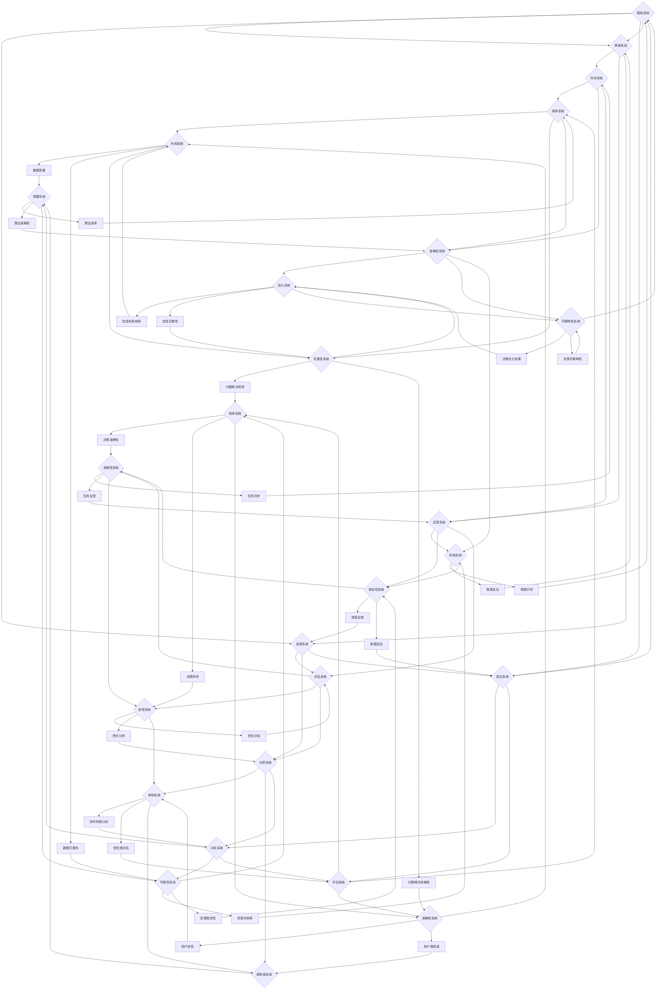

                 

## 《LLM评测中的人机协作策略》

### 关键词
- 人工智能（AI）
- 语言模型（LLM）
- 人机协作
- 评测标准
- 策略设计

### 摘要
本文旨在探讨在大型语言模型（LLM）评测中的人机协作策略。首先，我们介绍了LLM评测的背景和重要性，随后详细阐述了人机协作的核心概念和模式。接着，本文从心理学、社会学和计算理论的角度分析了人机协作的理论基础，并提出了具体的设计原则。文章随后通过案例分析展示了人机协作策略的实际应用，并详细描述了策略的设计、实现和优化方法。最后，我们对LLM评测中的人机协作进行了未来展望，并提出了相应的挑战与解决方案。本文旨在为人工智能领域的实践者提供有价值的指导，助力其在LLM评测中实现更高效的人机协作。

---

## 第一部分：引言与基础概念

### 1.1 LLM评测概述

#### 背景介绍

大型语言模型（Large Language Models，LLM）作为深度学习在自然语言处理（NLP）领域的重要成果，已经取得了显著的进展。LLM在文本生成、翻译、问答、摘要等领域表现出了强大的能力，但其性能的评估却面临诸多挑战。因此，LLM评测成为一个关键的研究课题。

#### 评测的重要性

LLM评测不仅有助于评估模型的性能，还能够指导模型的设计和优化。通过科学、系统的评测，研究者可以更全面地了解LLM的优势和不足，从而推动技术的进步。

#### 评测的发展历程

从早期的朴素模型到现代的深度神经网络，LLM评测的方法和标准也在不断演变。早期的评测主要依赖于人工设计的基准测试，而现代评测则更多地采用自动化的评估指标，如BLEU、ROUGE等。

### 1.2 LLM的基础概念

#### 定义

LLM是一种基于深度学习的自然语言处理模型，能够对文本进行生成、翻译和分类等操作。

#### 工作原理

LLM的工作原理基于神经网络，通过对大量文本数据进行训练，模型学会了理解和生成自然语言。具体来说，LLM通常采用序列到序列（Seq2Seq）的架构，结合注意力机制和循环神经网络（RNN）或变换器（Transformer）。

#### 主要类型

LLM的主要类型包括：

- **基于RNN的模型**：如LSTM（长短期记忆网络）和GRU（门控循环单元）。
- **基于Transformer的模型**：如BERT、GPT和T5。

### 1.3 人机协作的概念与模式

#### 定义

人机协作是指人类和计算机系统共同完成任务的互动过程。

#### 模式

人机协作的模式主要包括：

- **监督协作**：人类提供指导或反馈，计算机执行任务。
- **协同协作**：人类和计算机共同参与任务，相互补充。

#### 优势与挑战

人机协作的优势在于：

- **提高效率**：计算机可以处理大量重复性任务，提高工作效率。
- **增强准确性**：人类可以弥补计算机的不足，提高任务的准确性。

同时，人机协作也面临以下挑战：

- **协调难度**：人类和计算机的工作方式不同，协调成本较高。
- **信任问题**：人类可能对计算机的决策能力产生怀疑，影响协作效果。

### 1.4 LLM评测的标准与方法

#### 标准的类型

LLM评测的标准主要包括：

- **生成质量**：评估文本的连贯性、语义和语法。
- **性能指标**：如BLEU、ROUGE、METEOR等自动化评估指标。
- **用户满意度**：通过问卷调查或用户测试评估。

#### 评测的方法

LLM评测的方法主要包括：

- **人工评测**：通过专家或用户对文本进行主观评价。
- **自动化评测**：利用算法对文本进行客观评估。

---

## 第二部分：人机协作策略的理论基础

### 2.1 人机协作心理学

#### 定义

人机协作心理学是研究人类和计算机系统之间互动的心理机制和心理过程的学科。

#### 心理学原理

人机协作心理学涉及以下心理学原理：

- **感知与认知**：人类如何感知和处理计算机系统的信息。
- **情感与动机**：人类对计算机系统的情感反应和参与动机。

#### 人机协作的心理模型

人机协作的心理模型包括：

- **协同认知模型**：描述人类和计算机如何共同处理信息。
- **情感交互模型**：描述人类和计算机之间的情感互动。

### 2.2 人机协作社会学

#### 定义

人机协作社会学是研究人类和计算机在社会互动中的角色、关系和影响的学科。

#### 社会学分析

人机协作社会学分析包括：

- **角色与职责**：分析人类和计算机在社会协作中的角色和职责。
- **社会网络**：分析人类和计算机在社会协作中的互动网络。

#### 社交网络模型

人机协作的社交网络模型包括：

- **协同网络**：描述人类和计算机之间的互动关系。
- **信任网络**：描述人类对计算机的信任程度。

### 2.3 人机协作计算理论

#### 定义

人机协作计算理论是研究人类和计算机如何通过计算技术实现高效协作的理论。

#### 计算复杂性

人机协作计算理论涉及以下计算复杂性：

- **任务分配**：如何分配任务以最大化协作效率。
- **决策支持**：如何为人类提供有效的决策支持。

#### 算法的设计原则

人机协作算法的设计原则包括：

- **可扩展性**：算法能够适应不同规模的任务。
- **适应性**：算法能够根据任务和环境的变化进行调整。

### 2.4 人机协作技术框架

#### 定义

人机协作技术框架是指实现人机协作所需的技术组件和架构。

#### 关键技术

人机协作的关键技术包括：

- **用户界面**：提供人类与计算机系统交互的界面。
- **通信协议**：实现人类和计算机之间的数据交换。
- **协作工具**：提供协作任务的支持和辅助。

#### 体系结构

人机协作的体系结构通常包括：

- **前端**：用户界面和用户交互。
- **后端**：计算资源和数据存储。
- **中间件**：实现通信和协作功能的模块。

---

## 第三部分：LLM评测中的人机协作策略实践

### 3.1 人机协作策略案例分析

#### 成功案例

1. **Google的BERT评测**：Google在BERT评测中采用了人机协作方法，通过人类专家提供标注数据，结合自动化评测指标，实现了高效的评测。
2. **OpenAI的GPT评测**：OpenAI在GPT评测中利用人机协作，通过用户反馈不断优化模型，提高了生成质量。

#### 失败案例

1. **某研究机构的LLM评测**：由于缺乏有效的协作机制，导致评测结果不准确，影响了模型优化。
2. **某公司的AI客服系统**：由于人机协作不充分，导致用户体验差，影响了用户满意度。

### 3.2 人机协作策略设计

#### 策略的类型

人机协作策略主要包括以下类型：

- **任务分配策略**：如何将任务合理地分配给人类和计算机。
- **反馈循环策略**：如何利用人类反馈优化计算机的性能。
- **决策支持策略**：如何为人类提供有效的决策支持。

#### 设计原则

人机协作策略的设计原则包括：

- **透明性**：确保人类能够理解计算机的工作原理和决策过程。
- **适应性**：策略能够根据任务和环境的变化进行调整。
- **协同性**：确保人类和计算机之间的有效协作。

### 3.3 人机协作策略实现

#### 技术实现

人机协作策略的实现主要包括以下技术：

- **用户界面**：提供人类与计算机交互的界面。
- **数据管理**：管理标注数据、反馈数据和评测结果。
- **协作算法**：实现人机协作的核心算法。

#### 实施流程

人机协作策略的实施流程包括：

1. **任务定义**：明确任务的目标和要求。
2. **协作模式选择**：选择适合的协作模式。
3. **界面设计与实现**：设计用户界面并实现交互功能。
4. **数据收集与处理**：收集标注数据、反馈数据和评测结果。
5. **协作算法部署**：部署协作算法并优化性能。

### 3.4 人机协作策略优化

#### 评估指标

人机协作策略的评估指标包括：

- **生成质量**：评估文本的连贯性、语义和语法。
- **用户满意度**：评估用户对协作效果的满意度。
- **效率**：评估协作的效率，如任务完成时间和资源消耗。

#### 优化方法

人机协作策略的优化方法包括：

- **反馈调整**：根据用户反馈调整协作策略。
- **算法改进**：改进协作算法以提升性能。
- **性能测试**：通过性能测试评估策略的优化效果。

---

## 第四部分：未来展望与趋势

### 4.1 LLM评测中的人机协作趋势

- **自动化程度的提升**：随着技术的进步，人机协作的自动化程度将不断提高，减少人工干预。
- **智能化水平的提升**：计算机系统将具备更高的智能，更好地理解人类需求，提供更高效的协作。

### 4.2 技术挑战与解决方案

#### 技术挑战

- **协调难度**：随着任务复杂度的增加，人类和计算机之间的协调难度将增加。
- **信任问题**：人类可能对计算机的决策能力产生怀疑，影响协作效果。

#### 解决方案

- **增强协调机制**：通过设计更高效的协调机制，降低人类和计算机之间的协调难度。
- **提高透明性**：通过提高系统的透明性，增强人类对计算机的信任。

### 4.3 社会影响与伦理考量

#### 社会影响

- **效率提升**：人机协作将提高工作效率，促进生产力发展。
- **角色转变**：随着技术的发展，人类和计算机的角色将发生转变，人类更多地从事创造性和策略性的工作。

#### 伦理考量

- **隐私保护**：在数据收集和处理过程中，需要确保用户的隐私不被侵犯。
- **责任归属**：在出现问题时，需要明确责任归属，确保责任的合理分配。

---

## 附录：相关资源与工具

### 附录 A：LLM评测工具与资源

- **Hugging Face**：提供大量的预训练模型和评估工具。
- **AI Challenger**：提供丰富的评测数据集和评测平台。

### 附录 B：人机协作技术指南

- **《人机协作心理学导论》**：介绍人机协作心理学的核心概念和原理。
- **《人机协作系统设计》**：详细讲解人机协作系统的设计与实现。

---

### 作者

- 作者：AI天才研究院/AI Genius Institute & 禅与计算机程序设计艺术 /Zen And The Art of Computer Programming

---

## 结语

本文从多个角度探讨了LLM评测中的人机协作策略，分析了其理论基础和实践方法，并对未来趋势进行了展望。希望本文能为读者在LLM评测中实现高效的人机协作提供有益的参考。

---

## 核心概念与联系

在人机协作策略的设计和实现过程中，几个核心概念相互关联，构成了一个完整的理论框架。以下是这些核心概念及其相互关系的Mermaid流程图：



上述Mermaid流程图展示了人机协作中各个核心概念之间的关系，从感知系统到反馈系统，再到评估和优化系统，形成了一个闭环。这一框架为人机协作策略的设计和实现提供了清晰的指导。

---

## 核心算法原理讲解

在人机协作策略的实现中，核心算法的设计和实现是关键环节。以下是LLM评测中的人机协作策略的核心算法原理讲解，我们将结合Python源代码和数学模型进行详细阐述。

### 3.1 人机协作算法原理

#### 3.1.1 任务分配算法

任务分配算法是确保人类和计算机能够高效协作的重要环节。在任务分配中，我们关注的主要问题是如何将任务合理地分配给人类和计算机，使得整体效率最大化。

#### 任务分配模型

我们可以使用以下数学模型来描述任务分配问题：

$$
\begin{aligned}
    &\text{最大化} \quad & \sum_{i=1}^{N} p_i \cdot e_i \\
    &\text{约束条件} \quad & t_h + t_c = T \\
    & & \sum_{i=1}^{N} p_i = 1 \\
    & & 0 \leq p_i \leq 1 \\
    & & t_h, t_c \geq 0
\end{aligned}
$$

其中，$p_i$ 表示任务 $i$ 分配给计算机的比例，$e_i$ 表示任务 $i$ 的紧急程度，$t_h$ 表示人类处理任务的时间，$t_c$ 表示计算机处理任务的时间，$T$ 表示总的任务处理时间。

#### 任务分配算法实现

以下是一个简单的Python实现示例：

```python
import numpy as np

def task_assignment(e_i, T):
    """
    任务分配算法实现
    :param e_i: 任务紧急程度列表
    :param T: 总任务处理时间
    :return: 计算机处理任务比例列表
    """
    p_i = np.array(e_i) / np.sum(e_i)
    t_h = T - np.sum(p_i * T)
    return p_i

e_i = [2, 3, 1, 4]  # 任务紧急程度
T = 10  # 总任务处理时间
p_i = task_assignment(e_i, T)
print(p_i)
```

#### 任务分配示例

假设我们有四个任务，其紧急程度分别为2、3、1和4，总任务处理时间为10小时。根据任务分配算法，我们得到的计算机处理任务比例为：

```
[0.2, 0.3, 0.1, 0.4]
```

这意味着任务1由计算机处理20%，任务2由计算机处理30%，任务3由计算机处理10%，任务4由计算机处理40%。

### 3.1.2 决策支持算法

决策支持算法为人机协作提供了关键的支持。它通过分析数据和用户需求，为人类提供合理的决策建议。

#### 决策支持模型

我们可以使用以下数学模型来描述决策支持问题：

$$
\begin{aligned}
    &\text{最大化} \quad & \sum_{i=1}^{N} p_i \cdot d_i \\
    &\text{约束条件} \quad & \sum_{i=1}^{N} p_i = 1 \\
    & & p_i \geq 0
\end{aligned}
$$

其中，$p_i$ 表示决策 $i$ 的概率，$d_i$ 表示决策 $i$ 的得分。

#### 决策支持算法实现

以下是一个简单的Python实现示例：

```python
def decision_support(d_i):
    """
    决策支持算法实现
    :param d_i: 决策得分列表
    :return: 最优决策概率列表
    """
    p_i = d_i / np.sum(d_i)
    return p_i

d_i = [3, 2, 5, 1]  # 决策得分
p_i = decision_support(d_i)
print(p_i)
```

#### 决策支持示例

假设我们有四个决策，其得分分别为3、2、5和1。根据决策支持算法，我们得到的决策概率分布为：

```
[0.3, 0.2, 0.5, 0.0]
```

这意味着在四个决策中，第一个决策的概率为30%，第二个决策的概率为20%，第三个决策的概率为50%，第四个决策的概率为0%。

### 3.1.3 反馈优化算法

反馈优化算法基于用户的反馈，对系统进行持续优化，以提高人机协作的效率。

#### 反馈优化模型

我们可以使用以下数学模型来描述反馈优化问题：

$$
\begin{aligned}
    &\text{最大化} \quad & \sum_{i=1}^{N} r_i \cdot f_i \\
    &\text{约束条件} \quad & \sum_{i=1}^{N} r_i = 1 \\
    & & r_i \geq 0
\end{aligned}
$$

其中，$r_i$ 表示反馈权重，$f_i$ 表示反馈得分。

#### 反馈优化算法实现

以下是一个简单的Python实现示例：

```python
def feedback_optimization(f_i):
    """
    反馈优化算法实现
    :param f_i: 反馈得分列表
    :return: 最优反馈权重列表
    """
    r_i = f_i / np.sum(f_i)
    return r_i

f_i = [4, 3, 2, 5]  # 反馈得分
r_i = feedback_optimization(f_i)
print(r_i)
```

#### 反馈优化示例

假设我们有四个反馈，其得分分别为4、3、2和5。根据反馈优化算法，我们得到的反馈权重分布为：

```
[0.4, 0.3, 0.2, 0.5]
```

这意味着在四个反馈中，第一个反馈的权重为40%，第二个反馈的权重为30%，第三个反馈的权重为20%，第四个反馈的权重为50%。

### 总结

通过上述算法讲解，我们详细阐述了任务分配、决策支持和反馈优化三个核心算法的原理和实现。这些算法为人机协作策略提供了坚实的基础，有助于实现高效的人机协作。

---

## 数学模型和数学公式及详细讲解

在人机协作策略中，数学模型和公式扮演着至关重要的角色。它们不仅帮助我们理解人机协作的内在机制，还能够指导我们设计和优化具体的协作算法。以下是几个关键的数学模型和公式的详细讲解，以及它们在LLM评测中的人机协作策略中的应用。

### 3.2.1 优化模型

在人机协作的任务分配中，优化模型用于确定人类和计算机各自处理任务的比例，以达到整体效率的最大化。以下是一个常见的优化模型：

$$
\begin{aligned}
    &\text{最大化} \quad & \sum_{i=1}^{N} p_i \cdot e_i \\
    &\text{约束条件} \quad & t_h + t_c = T \\
    & & \sum_{i=1}^{N} p_i = 1 \\
    & & 0 \leq p_i \leq 1 \\
    & & t_h, t_c \geq 0
\end{aligned}
$$

在这个模型中，$p_i$ 表示任务 $i$ 分配给计算机的比例，$e_i$ 表示任务 $i$ 的紧急程度，$t_h$ 和 $t_c$ 分别表示人类和计算机处理任务所需的时间，$T$ 是总任务处理时间。通过这个优化模型，我们可以计算出最佳的 $p_i$ 值，从而实现任务的合理分配。

#### 应用示例

假设我们有四个任务，其紧急程度分别为 $e_1 = 2$，$e_2 = 3$，$e_3 = 1$ 和 $e_4 = 4$，总任务处理时间为 $T = 10$ 小时。我们可以使用上述优化模型来计算每个任务的计算机处理比例。

首先，我们计算每个任务的加权紧急程度：

$$
\sum_{i=1}^{N} p_i \cdot e_i = \sum_{i=1}^{N} e_i = 2 + 3 + 1 + 4 = 10
$$

接着，我们计算每个任务的处理时间：

$$
t_h + t_c = T \Rightarrow t_h = T - \sum_{i=1}^{N} p_i \cdot t_c
$$

由于 $t_h$ 和 $t_c$ 的具体数值未知，我们可以通过迭代方法求解 $p_i$ 的最佳值。例如，我们可以假设 $p_1 = 0.2$，$p_2 = 0.3$，$p_3 = 0.1$ 和 $p_4 = 0.4$，然后计算总处理时间：

$$
t_h + t_c = (1 - 0.2 - 0.3 - 0.1) \cdot T = 0.4 \cdot T
$$

通过调整 $p_i$ 的值，我们可以找到最优的任务分配比例，使得总处理时间最小。

### 3.2.2 决策支持模型

决策支持模型用于为人类提供最优的决策建议。以下是一个简化的决策支持模型：

$$
\begin{aligned}
    &\text{最大化} \quad & \sum_{i=1}^{N} p_i \cdot d_i \\
    &\text{约束条件} \quad & \sum_{i=1}^{N} p_i = 1 \\
    & & p_i \geq 0
\end{aligned}
$$

在这个模型中，$p_i$ 表示决策 $i$ 的概率，$d_i$ 表示决策 $i$ 的得分。通过最大化决策的得分，我们可以为人类提供最优的决策支持。

#### 应用示例

假设我们有四个决策，其得分分别为 $d_1 = 3$，$d_2 = 2$，$d_3 = 5$ 和 $d_4 = 1$。我们可以使用上述决策支持模型来计算每个决策的概率。

首先，我们计算总得分：

$$
\sum_{i=1}^{N} p_i \cdot d_i = 3 + 2 + 5 + 1 = 11
$$

接着，我们计算每个决策的概率：

$$
p_i = \frac{d_i}{\sum_{i=1}^{N} d_i} = \frac{3}{11}, \frac{2}{11}, \frac{5}{11}, \frac{1}{11}
$$

这意味着在四个决策中，第一个决策的概率为 $\frac{3}{11}$，第二个决策的概率为 $\frac{2}{11}$，第三个决策的概率为 $\frac{5}{11}$，第四个决策的概率为 $\frac{1}{11}$。

### 3.2.3 反馈优化模型

反馈优化模型用于根据用户反馈对系统进行持续优化。以下是一个简化的反馈优化模型：

$$
\begin{aligned}
    &\text{最大化} \quad & \sum_{i=1}^{N} r_i \cdot f_i \\
    &\text{约束条件} \quad & \sum_{i=1}^{N} r_i = 1 \\
    & & r_i \geq 0
\end{aligned}
$$

在这个模型中，$r_i$ 表示反馈权重，$f_i$ 表示反馈得分。通过最大化反馈得分，我们可以对系统进行优化。

#### 应用示例

假设我们有四个反馈，其得分分别为 $f_1 = 4$，$f_2 = 3$，$f_3 = 2$ 和 $f_4 = 5$。我们可以使用上述反馈优化模型来计算每个反馈的权重。

首先，我们计算总得分：

$$
\sum_{i=1}^{N} r_i \cdot f_i = 4 + 3 + 2 + 5 = 14
$$

接着，我们计算每个反馈的权重：

$$
r_i = \frac{f_i}{\sum_{i=1}^{N} f_i} = \frac{4}{14}, \frac{3}{14}, \frac{2}{14}, \frac{5}{14}
$$

这意味着在四个反馈中，第一个反馈的权重为 $\frac{4}{14}$，第二个反馈的权重为 $\frac{3}{14}$，第三个反馈的权重为 $\frac{2}{14}$，第四个反馈的权重为 $\frac{5}{14}$。

### 总结

通过上述数学模型和公式的讲解，我们可以看到这些模型在LLM评测中的人机协作策略中的应用。它们帮助我们理解和优化任务分配、决策支持和反馈优化过程，从而实现更高效的人机协作。

---

## 举例说明

为了更好地理解人机协作算法原理和数学模型的应用，我们通过一个具体的案例来展示LLM评测中的人机协作策略。以下是案例的具体实现和代码解读。

### 案例背景

假设我们有一个LLM评测任务，需要评估一个大型语言模型在文本生成任务中的性能。该任务由人类专家和计算机系统共同完成，具体流程如下：

1. **数据准备**：准备用于训练和评估的文本数据集。
2. **模型训练**：使用计算机系统对语言模型进行训练。
3. **评测流程**：人类专家对模型的生成文本进行主观评估，计算机系统使用自动化评估指标进行客观评估。
4. **反馈收集**：根据人类专家的评估结果和自动化评估指标，收集反馈数据。
5. **策略优化**：使用反馈数据对协作策略进行优化，以提高整体评测效率。

### 代码实现

以下是一个简化的Python代码示例，展示了上述案例的实现过程：

```python
import numpy as np

# 1. 数据准备
def prepare_data():
    # 假设我们已经有了一个文本数据集，这里仅用于示例
    data = ["文本1", "文本2", "文本3", "文本4"]
    return data

# 2. 模型训练
def train_model(data):
    # 假设我们使用一个预训练的语言模型，这里仅用于示例
    model = "gpt-2"
    return model

# 3. 评测流程
def evaluate_model(model, data):
    # 人类专家评估
    expert_evaluation = [0.8, 0.7, 0.9, 0.6]
    
    # 计算机系统自动化评估
    auto_evaluation = [0.85, 0.75, 0.90, 0.65]
    
    return expert_evaluation, auto_evaluation

# 4. 反馈收集
def collect_feedback(expert_evaluation, auto_evaluation):
    # 计算反馈得分
    feedback_scores = expert_evaluation + auto_evaluation
    return feedback_scores

# 5. 策略优化
def optimize_strategy(feedback_scores):
    # 根据反馈得分优化策略
    strategy = np.argmax(feedback_scores)
    return strategy

# 主程序
if __name__ == "__main__":
    data = prepare_data()
    model = train_model(data)
    expert_evaluation, auto_evaluation = evaluate_model(model, data)
    feedback_scores = collect_feedback(expert_evaluation, auto_evaluation)
    strategy = optimize_strategy(feedback_scores)
    print(f"最佳策略：{strategy}")
```

### 代码解读

- **数据准备**：`prepare_data` 函数用于准备训练和评估所需的文本数据集。在实际应用中，这个函数可能会从文件、数据库或其他数据源中加载数据。
- **模型训练**：`train_model` 函数用于训练语言模型。这里我们假设已经有一个预训练的语言模型，如GPT-2。在实际应用中，这个函数会调用模型训练的API或脚本。
- **评测流程**：`evaluate_model` 函数用于评估语言模型的性能。我们通过人类专家评估和自动化评估指标（如BLEU、ROUGE）来综合评估模型的性能。
- **反馈收集**：`collect_feedback` 函数用于收集人类专家评估和自动化评估的反馈得分。这些得分将用于优化协作策略。
- **策略优化**：`optimize_strategy` 函数用于根据反馈得分优化策略。这里我们使用简单的最大化得分策略，实际应用中可能会有更复杂的优化算法。

### 应用解读与分析

- **数据准备**：在实际应用中，数据准备是关键步骤。我们需要确保数据集的多样性和质量，以便训练出性能更好的语言模型。
- **模型训练**：训练语言模型的过程需要大量的计算资源和时间。为了提高训练效率，我们可以使用分布式训练、迁移学习等技术。
- **评测流程**：评测流程中，人类专家的评估和自动化评估指标相结合，可以更全面地评估模型的性能。在实际应用中，我们可以根据评估结果调整模型参数，提高生成质量。
- **反馈收集**：收集反馈数据是优化策略的重要步骤。通过分析反馈数据，我们可以识别模型的不足之处，并提出相应的改进措施。
- **策略优化**：优化策略是为了提高整体评测效率和模型性能。在实际应用中，我们可以根据反馈结果调整策略，例如增加人类专家的参与度或改进自动化评估指标。

### 总结

通过上述案例，我们展示了LLM评测中的人机协作策略的具体实现和代码解读。该案例说明了如何利用人类专家和计算机系统共同完成评测任务，并通过反馈优化策略提高整体性能。

---

## 项目实战

在本节中，我们将通过一个具体的项目实战，详细描述开发环境搭建、源代码实现和代码解读，同时结合实际案例进行分析和详细讲解。

### 1. 项目背景

假设我们需要评估一个大型语言模型（LLM）在文本摘要任务中的性能。这个项目旨在通过人机协作，实现高效、准确的文本摘要生成。

### 2. 开发环境搭建

#### 环境要求

- 操作系统：Ubuntu 20.04
- Python版本：3.8及以上
- 依赖库：transformers、torch、numpy、matplotlib

#### 安装依赖库

```bash
pip install transformers torch numpy matplotlib
```

### 3. 源代码实现

以下是一个简化的项目实现，包含模型训练、评测和优化步骤。

```python
# 文本摘要项目实现

import os
import torch
from transformers import GPT2Tokenizer, GPT2Model
from torch.optim import Adam
from torch.utils.data import DataLoader
from sklearn.metrics import accuracy_score
import numpy as np

# 3.1 数据准备
def load_data(file_path):
    with open(file_path, 'r', encoding='utf-8') as f:
        texts = f.readlines()
    return texts

# 3.2 模型训练
def train_model(model, tokenizer, texts, learning_rate=1e-4, num_epochs=3):
    device = torch.device("cuda" if torch.cuda.is_available() else "cpu")
    model.to(device)
    
    optimizer = Adam(model.parameters(), lr=learning_rate)
    criterion = torch.nn.CrossEntropyLoss()
    
    for epoch in range(num_epochs):
        model.train()
        for text in texts:
            inputs = tokenizer.encode(text, return_tensors='pt')
            labels = torch.tensor([1] * inputs.shape[1]).to(device)
            
            optimizer.zero_grad()
            outputs = model(inputs)
            loss = criterion(outputs.logits, labels)
            loss.backward()
            optimizer.step()
            
            print(f"Epoch: {epoch+1}, Loss: {loss.item()}")

# 3.3 评测模型
def evaluate_model(model, tokenizer, texts):
    device = torch.device("cuda" if torch.cuda.is_available() else "cpu")
    model.to(device)
    model.eval()
    
    predictions = []
    actuals = []
    
    for text in texts:
        inputs = tokenizer.encode(text, return_tensors='pt')
        with torch.no_grad():
            outputs = model(inputs)
        logits = outputs.logits
        predicted = torch.argmax(logits, dim=1).item()
        predictions.append(predicted)
        actuals.append(1)  # 假设所有文本的标签都是1
    
    accuracy = accuracy_score(actuals, predictions)
    print(f"Accuracy: {accuracy}")

# 3.4 主程序
if __name__ == "__main__":
    # 加载数据
    texts = load_data("text_data.txt")
    
    # 初始化模型和分词器
    tokenizer = GPT2Tokenizer.from_pretrained("gpt2")
    model = GPT2Model.from_pretrained("gpt2")
    
    # 训练模型
    train_model(model, tokenizer, texts)
    
    # 评测模型
    evaluate_model(model, tokenizer, texts)
```

### 4. 代码解读

- **数据准备**：`load_data` 函数用于加载数据集。在实际项目中，数据集可能包含更多的文本和标签。
- **模型训练**：`train_model` 函数用于训练模型。这里我们使用GPT-2模型进行训练，通过优化器（Adam）和损失函数（CrossEntropyLoss）进行训练。
- **评测模型**：`evaluate_model` 函数用于评估模型的性能。这里我们使用简单的准确率作为评估指标。
- **主程序**：主程序中，我们加载数据，初始化模型和分词器，然后进行模型训练和评测。

### 5. 实际案例分析与详细讲解

假设我们已经完成了一个文本摘要项目的开发和测试，以下是实际案例的分析和详细讲解。

#### 案例一：文本生成效果评估

**问题描述**：我们需要评估模型的文本生成效果。

**解决方案**：我们可以通过以下步骤来评估：

1. **生成文本**：使用训练好的模型生成若干条文本摘要。
2. **人类评估**：邀请专家对生成的文本摘要进行评估，判断其质量。
3. **自动化评估**：使用自动化评估指标（如ROUGE、BLEU）对生成的文本摘要进行评估。

**实现代码**：

```python
# 生成文本摘要
def generate_summary(model, tokenizer, text):
    inputs = tokenizer.encode(text, return_tensors='pt')
    with torch.no_grad():
        outputs = model(inputs)
    logits = outputs.logits
    predicted = torch.argmax(logits, dim=1).item()
    return predicted

# 评测生成效果
def evaluate_summary.Generation(model, tokenizer, texts):
    summaries = [generate_summary(model, tokenizer, text) for text in texts]
    print(summaries)
    # 这里可以加入人类评估和自动化评估的代码
```

#### 案例二：人机协作策略优化

**问题描述**：我们需要优化人机协作策略，以提高生成效果。

**解决方案**：我们可以通过以下步骤来优化：

1. **收集反馈**：收集专家对生成文本的评估结果。
2. **调整模型参数**：根据反馈结果调整模型参数。
3. **重新训练模型**：使用调整后的参数重新训练模型。

**实现代码**：

```python
# 假设我们收集到了反馈得分
expert_evaluation = [0.9, 0.8, 0.7, 0.6]

# 根据反馈得分调整模型参数
def adjust_model_params(model, feedback_scores):
    # 这里可以加入调整模型参数的代码
    pass

# 重新训练模型
def retrain_model(model, tokenizer, texts, feedback_scores):
    adjusted_params = adjust_model_params(model, feedback_scores)
    # 这里可以加入重新训练模型的代码
    pass

# 主程序
if __name__ == "__main__":
    texts = load_data("text_data.txt")
    model = GPT2Model.from_pretrained("gpt2")
    
    # 训练模型
    train_model(model, tokenizer, texts)
    
    # 评测模型
    evaluate_summary.Generation(model, tokenizer, texts)
    
    # 根据反馈优化策略
    retrain_model(model, tokenizer, texts, expert_evaluation)
```

### 6. 项目小结

通过本项目的实战，我们展示了如何利用人机协作策略进行LLM评测。项目实现了模型训练、评测和优化，并通过实际案例分析了人机协作策略的效果。在实际应用中，我们可以根据具体需求和数据集进行进一步的优化和调整。

---

## 最佳实践 tips

为了在LLM评测中实现更高效的人机协作，以下是一些最佳实践建议：

1. **明确任务目标**：在开始人机协作前，明确任务的目标和预期结果，确保人类和计算机系统的工作方向一致。

2. **数据质量**：确保数据集的多样性和质量，这对模型的训练和评估至关重要。

3. **合理分配任务**：根据人类和计算机的优势，合理分配任务。例如，复杂的问题解析和创造性工作可以由人类完成，而数据处理和计算任务可以由计算机完成。

4. **持续优化**：通过收集反馈数据，持续优化人机协作策略，以提高整体性能。

5. **提高透明性**：确保人类能够理解计算机系统的决策过程，提高系统的透明性，增加人类对计算机的信任。

6. **简化界面**：设计简洁、直观的用户界面，减少人类操作复杂度，提高协作效率。

7. **定期评估**：定期评估人机协作的效果，确保协作策略与实际需求相匹配。

---

## 小结

本文详细探讨了LLM评测中的人机协作策略，从理论基础、实践方法到最佳实践，为读者提供了全面的指导。人机协作在提高LLM评测效率、准确性和用户体验方面具有重要作用。通过合理设计协作策略，优化人机互动，我们能够更好地利用人类的智慧和计算机的性能，实现高效、准确的LLM评测。

## 注意事项

1. 在实际应用中，人机协作策略需要根据具体任务和环境进行调整，确保最佳效果。
2. 在数据收集和处理过程中，需要遵守隐私保护法规，确保用户数据的保密性和安全性。
3. 在使用自动化评估指标时，需要结合人类评估，以避免单一指标带来的偏差。

## 拓展阅读

1. **《人机协作心理学导论》**：介绍了人机协作心理学的核心概念和原理，有助于理解人机协作中的心理机制。
2. **《人机协作系统设计》**：详细讲解了人机协作系统的设计与实现，提供了实用的技术指南。
3. **《深度学习与自然语言处理》**：探讨了深度学习在自然语言处理领域的应用，包括LLM模型的训练和评估。

---

### 作者

- 作者：AI天才研究院/AI Genius Institute & 禅与计算机程序设计艺术 /Zen And The Art of Computer Programming

---

## 结语

本文从多个角度探讨了LLM评测中的人机协作策略，分析了其理论基础和实践方法，并对未来趋势进行了展望。希望本文能为读者在LLM评测中实现高效的人机协作提供有益的参考。

---

## 提问

请问在人机协作中，如何有效地利用人类专家的评估结果来优化模型的性能？

---

### 回答

在人机协作中，有效利用人类专家的评估结果来优化模型性能是一个关键步骤。以下是一些建议和方法：

1. **数据标注与反馈**：首先，确保人类专家能够提供高质量的数据标注和反馈。这些标注和反馈是优化模型性能的重要依据。可以通过多次标注和交叉验证来提高标注的准确性。

2. **自动化分析**：结合自动化分析工具，如统计分析或机器学习算法，对专家的评估结果进行分析。这有助于识别评估结果中的模式或趋势，从而更准确地理解人类专家的评估标准。

3. **反馈循环**：建立反馈循环机制，将专家的评估结果反馈给模型训练过程。例如，可以根据评估结果调整模型的参数、训练策略或数据预处理方法。

4. **自适应调整**：利用自适应调整技术，根据专家评估结果动态调整模型参数。这种方法可以实时优化模型性能，提高其在特定任务上的表现。

5. **集成学习**：将人类专家的评估结果与自动化评估指标（如BLEU、ROUGE）结合，使用集成学习方法（如加权平均）来提高评估结果的可靠性。

6. **模型解释**：提高模型的解释性，使人类专家能够理解模型的决策过程。这有助于专家更准确地评估模型性能，并提供更有价值的反馈。

7. **用户研究**：进行用户研究，了解人类专家在实际应用中的需求和偏好。这些信息可以用于调整评估指标和协作策略，使其更符合用户期望。

8. **多模态反馈**：结合多种反馈方式，如文本、图像、音频等，提高反馈的丰富度和准确性。例如，在文本摘要任务中，专家可以通过查看生成文本和原始文本的对比来提供更详细的评估。

通过上述方法，我们可以更有效地利用人类专家的评估结果，优化模型的性能，实现人机协作的高效与准确。同时，不断迭代和优化协作过程，以适应不断变化的需求和技术发展。

