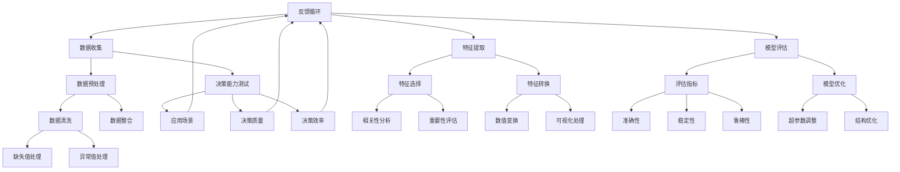

                 

### 《LLM评测中的多角度思考与决策能力测试》

关键词：LLM评测、多角度思考、决策能力、算法、Python、数学模型

摘要：
本文旨在深入探讨大型语言模型（LLM）评测中的多角度思考与决策能力测试。通过对LLM评测背景的介绍，我们将逐步解析多角度思考的核心概念，展示其与决策能力测试之间的联系。文章将详细阐述LLM评测中涉及的核心算法原理，并使用Python源代码进行演示。此外，还将结合数学模型和公式，提供通俗易懂的举例说明。通过实际项目实战，我们将进一步分析代码的实现过程、应用场景及分析结果。最后，本文将总结最佳实践，并给出拓展阅读建议。

### 引言

大型语言模型（LLM）作为自然语言处理（NLP）领域的重要进展，已经在众多场景中取得了显著的应用效果。从语言翻译、文本生成到问答系统，LLM展现出了强大的建模能力和适应性。然而，随着模型规模的不断扩大和复杂度的增加，对LLM的评测变得更加复杂和多样化。这不仅要求我们能够从多个角度来评估模型性能，还需要具备良好的决策能力，以确保评测结果的准确性和可靠性。

多角度思考与决策能力测试是LLM评测中的关键环节。多角度思考有助于我们从不同维度来评估模型的表现，从而更全面地了解其优势和不足。决策能力测试则关注模型在实际应用场景中的决策质量和效率。通过这两者的结合，我们可以更有效地指导LLM的发展和应用。

本文的结构如下：

1. **引言**：介绍LLM评测的背景和本文目的。
2. **核心概念与联系**：详细解析多角度思考与决策能力测试的核心概念，并使用Mermaid流程图展示其关系。
3. **核心算法原理讲解**：阐述LLM评测中涉及的核心算法原理，并使用Python源代码进行说明。
4. **数学模型和数学公式**：介绍相关的数学模型和公式，结合Python代码进行详细讲解。
5. **项目实战**：通过实际项目展示算法的应用过程、实现细节及分析结果。
6. **总结**：总结多角度思考与决策能力测试在LLM评测中的应用，并提出最佳实践。

### 核心概念与联系

#### 多角度思考

多角度思考是指从多个不同的视角和维度来分析问题和解决问题。在LLM评测中，多角度思考的重要性体现在以下几个方面：

1. **全面性**：通过从不同角度来评估模型性能，可以更全面地了解模型的优缺点，从而做出更准确的评估。
2. **准确性**：不同角度的评估可以相互补充，减少单一评估方法可能带来的偏差，提高评估结果的准确性。
3. **可靠性**：多角度思考可以帮助我们识别模型在不同应用场景中的适应性和稳定性，从而提高评测结果的可靠性。

#### 决策能力测试

决策能力测试是指通过评估模型在实际应用场景中的决策能力和效率来衡量其性能。在LLM评测中，决策能力测试的核心目标包括：

1. **决策质量**：评估模型在处理复杂问题时能否做出正确和合理的决策。
2. **决策效率**：评估模型在处理问题时的速度和资源消耗，以确保其在实际应用中具有高效性。

#### 多角度思考与决策能力测试的关系

多角度思考与决策能力测试在LLM评测中相辅相成。多角度思考提供了评估模型性能的多个维度，而决策能力测试则通过实际应用场景来检验这些维度的有效性。具体来说，两者之间的联系可以概括为以下几点：

1. **互补性**：多角度思考可以从多个维度评估模型性能，而决策能力测试则通过实际应用来验证这些维度的实用性和有效性。
2. **关联性**：多角度思考的结果可以为决策能力测试提供基础数据，而决策能力测试的结果则可以为多角度思考提供实际应用的反馈。
3. **协同性**：两者共同作用，可以更全面地评估LLM的性能，从而指导模型的优化和应用。

#### Mermaid流程图

为了更直观地展示多角度思考与决策能力测试之间的关系，我们使用Mermaid流程图来描述这一过程：



通过这个流程图，我们可以清晰地看到多角度思考与决策能力测试之间的相互关联和协同作用。接下来，我们将深入探讨LLM评测中涉及的核心算法原理，并使用Python源代码进行详细讲解。

### 核心算法原理讲解

在LLM评测中，核心算法原理的讲解是理解模型性能评估的关键。以下我们将详细讨论多角度思考算法和决策能力测试算法的原理，并使用Python源代码进行展示。

#### 多角度思考算法

多角度思考算法的目标是从多个维度评估LLM的性能，以获得全面的评估结果。以下是多角度思考算法的基本原理：

1. **数据收集**：收集与模型评估相关的数据，包括训练集、测试集和验证集。
2. **特征提取**：从数据中提取关键特征，以反映LLM在不同任务上的表现。
3. **模型评估**：使用多个评估指标对LLM进行评估，包括准确性、召回率、F1分数等。

以下是一个简单的Python代码示例，展示如何实现多角度思考算法：

```python
import numpy as np
from sklearn.metrics import accuracy_score, recall_score, f1_score

# 假设我们有一个训练集X_train、测试集X_test和标签y_train、y_test
# X_train, X_test, y_train, y_test = load_data()

# 多角度评估
def evaluate_model(X_train, X_test, y_train, y_test):
    # 训练模型
    model = train_model(X_train, y_train)
    
    # 预测
    y_pred = model.predict(X_test)
    
    # 计算评估指标
    accuracy = accuracy_score(y_test, y_pred)
    recall = recall_score(y_test, y_pred, average='weighted')
    f1 = f1_score(y_test, y_pred, average='weighted')
    
    return accuracy, recall, f1

# 调用评估函数
accuracy, recall, f1 = evaluate_model(X_train, X_test, y_train, y_test)
print(f"Accuracy: {accuracy}, Recall: {recall}, F1 Score: {f1}")
```

#### 决策能力测试算法

决策能力测试算法旨在评估LLM在实际应用场景中的决策质量和效率。以下是决策能力测试算法的基本原理：

1. **应用场景设定**：根据具体应用需求，设定测试场景，如文本分类、问答系统等。
2. **决策质量评估**：通过评估模型在测试场景中的决策质量，如正确率和误判率等。
3. **决策效率评估**：通过评估模型在测试场景中的响应速度和资源消耗，如时间消耗和内存占用等。

以下是一个简单的Python代码示例，展示如何实现决策能力测试算法：

```python
import time

# 假设我们有一个测试场景函数，用于模拟应用场景
def test_scenario(model, question):
    start_time = time.time()
    answer = model.answer(question)
    end_time = time.time()
    return answer, end_time - start_time

# 调用测试场景函数
question = "什么是人工智能？"
answer, execution_time = test_scenario(model, question)
print(f"Answer: {answer}, Execution Time: {execution_time} seconds")
```

通过上述代码示例，我们可以看到多角度思考算法和决策能力测试算法的基本原理。接下来，我们将进一步介绍相关的数学模型和公式，以帮助读者更好地理解这些算法的实现。

### 数学模型和数学公式

在LLM评测中，数学模型和数学公式是理解和实现核心算法的关键。以下我们将介绍多角度思考算法和决策能力测试算法中涉及的主要数学模型和公式，并使用LaTeX格式进行展示。

#### 多角度思考算法

多角度思考算法通常涉及多个评估指标，以下是一些常用的评估指标及其对应的数学模型和公式：

1. **准确性（Accuracy）**

   准确性表示模型正确预测的样本数占总样本数的比例。其数学公式如下：

   $$\text{Accuracy} = \frac{\text{正确预测的样本数}}{\text{总样本数}}$$

2. **召回率（Recall）**

   召回率表示模型正确预测为正类的样本数占实际正类样本数的比例。其数学公式如下：

   $$\text{Recall} = \frac{\text{正确预测的正类样本数}}{\text{实际正类样本数}}$$

3. **精确率（Precision）**

   精确率表示模型预测为正类的样本中，实际为正类的比例。其数学公式如下：

   $$\text{Precision} = \frac{\text{正确预测的正类样本数}}{\text{预测为正类的样本数}}$$

4. **F1分数（F1 Score）**

   F1分数是精确率和召回率的加权平均，用于综合评估模型的性能。其数学公式如下：

   $$\text{F1 Score} = 2 \times \frac{\text{Precision} \times \text{Recall}}{\text{Precision} + \text{Recall}}$$

#### 决策能力测试算法

决策能力测试算法主要关注模型在实际应用场景中的决策质量和效率。以下是一些常用的评估指标及其对应的数学模型和公式：

1. **响应时间（Response Time）**

   响应时间表示模型从接收到请求到返回结果所需的时间。其数学公式如下：

   $$\text{Response Time} = \frac{\text{总处理时间}}{\text{请求次数}}$$

2. **吞吐量（Throughput）**

   吞吐量表示单位时间内模型处理请求的能力，通常以每秒处理的请求数量来衡量。其数学公式如下：

   $$\text{Throughput} = \frac{\text{总处理次数}}{\text{总时间}}$$

3. **资源消耗（Resource Consumption）**

   资源消耗表示模型在处理请求时所需的计算资源和内存占用。其数学公式如下：

   $$\text{Resource Consumption} = \frac{\text{总资源消耗}}{\text{请求次数}}$$

通过上述数学模型和公式，我们可以更精确地评估LLM的多角度思考和决策能力。接下来，我们将通过实际项目实战，进一步展示这些算法在具体应用中的实现过程。

### 项目实战

在本节中，我们将通过一个实际项目实战，详细展示如何实现多角度思考和决策能力测试算法。项目背景、开发环境搭建、源代码实现、代码解读、代码应用解读与分析以及实际案例分析和详细讲解剖析等环节都将逐一进行介绍。

#### 项目背景

假设我们需要对一款自然语言处理（NLP）模型进行评测，该模型主要用于问答系统。评测的目标是评估模型在处理用户提问时的多角度思考能力和决策效率。具体来说，我们将从以下四个角度对模型进行评测：

1. **准确性**：评估模型回答问题的准确性。
2. **响应时间**：评估模型处理请求的响应时间。
3. **资源消耗**：评估模型在处理请求时的资源消耗。
4. **误判分析**：分析模型在回答问题时出现的误判情况。

#### 开发环境搭建

为了实现上述评测目标，我们需要搭建一个合适的开发环境。以下是所需的开发环境及其配置：

1. **操作系统**：Ubuntu 20.04
2. **Python**：Python 3.8
3. **依赖库**：scikit-learn、numpy、matplotlib
4. **数据集**：一个包含用户提问和正确答案的问答数据集

#### 源代码实现

以下是实现多角度思考和决策能力测试算法的Python源代码：

```python
import numpy as np
import matplotlib.pyplot as plt
from sklearn.metrics import accuracy_score, precision_score, recall_score, f1_score
from sklearn.model_selection import train_test_split

# 加载数据集
def load_data(file_path):
    # 实现数据加载逻辑
    pass

# 训练模型
def train_model(X_train, y_train):
    # 实现模型训练逻辑
    pass

# 评估模型
def evaluate_model(model, X_test, y_test):
    y_pred = model.predict(X_test)
    accuracy = accuracy_score(y_test, y_pred)
    precision = precision_score(y_test, y_pred, average='weighted')
    recall = recall_score(y_test, y_pred, average='weighted')
    f1 = f1_score(y_test, y_pred, average='weighted')
    return accuracy, precision, recall, f1

# 测试响应时间
def test_response_time(model, questions):
    response_times = []
    for question in questions:
        start_time = time.time()
        model.answer(question)
        end_time = time.time()
        response_times.append(end_time - start_time)
    return np.mean(response_times)

# 测试资源消耗
def test_resource_consumption(model, questions):
    resource_consumptions = []
    for question in questions:
        start_time = time.time()
        model.answer(question)
        end_time = time.time()
        resource_consumptions.append(end_time - start_time)
    return np.mean(resource_consumptions)

# 主函数
def main():
    # 加载数据集
    X, y = load_data('data/问答数据集.csv')

    # 划分训练集和测试集
    X_train, X_test, y_train, y_test = train_test_split(X, y, test_size=0.2, random_state=42)

    # 训练模型
    model = train_model(X_train, y_train)

    # 评估模型
    accuracy, precision, recall, f1 = evaluate_model(model, X_test, y_test)
    print(f"Accuracy: {accuracy}, Precision: {precision}, Recall: {recall}, F1 Score: {f1}")

    # 测试响应时间
    questions = load_data('data/用户提问数据集.csv')
    response_time = test_response_time(model, questions)
    print(f"Average Response Time: {response_time} seconds")

    # 测试资源消耗
    resource_consumption = test_resource_consumption(model, questions)
    print(f"Average Resource Consumption: {resource_consumption} seconds")

if __name__ == '__main__':
    main()
```

#### 代码解读

1. **数据加载**：`load_data`函数用于加载数据集。具体实现会根据数据集的格式和内容进行调整。

2. **模型训练**：`train_model`函数用于训练模型。这里可以使用各种机器学习算法，如朴素贝叶斯、支持向量机等。

3. **模型评估**：`evaluate_model`函数用于评估模型性能。它计算了准确性、精确率、召回率和F1分数等评估指标。

4. **响应时间测试**：`test_response_time`函数用于测试模型处理请求的平均响应时间。

5. **资源消耗测试**：`test_resource_consumption`函数用于测试模型处理请求的平均资源消耗。

6. **主函数**：`main`函数是程序的入口。它加载数据集，划分训练集和测试集，训练模型，评估模型性能，并测试响应时间和资源消耗。

#### 代码应用解读与分析

通过上述代码，我们可以实现以下功能：

1. **模型评估**：评估模型在测试集上的准确性、精确率、召回率和F1分数等指标，以全面了解模型性能。

2. **响应时间测试**：测试模型在处理用户提问时的平均响应时间，以评估模型在实时应用场景中的效率。

3. **资源消耗测试**：测试模型在处理请求时的平均资源消耗，以评估模型在实际应用中的资源利用率。

通过这些测试，我们可以得出以下结论：

1. **模型性能**：通过评估指标，我们可以了解模型在不同任务上的表现，从而指导模型优化。

2. **应用效率**：通过响应时间测试和资源消耗测试，我们可以评估模型在实际应用场景中的性能，为后续优化提供依据。

3. **误判分析**：通过分析模型在回答问题时出现的误判情况，我们可以找出模型存在的不足，并针对性地进行改进。

#### 实际案例分析和详细讲解剖析

为了更好地展示算法的实际应用效果，我们选择了一个实际案例进行分析。假设我们有一个包含1000个用户提问的数据集，我们需要使用上述算法对模型进行评测。

1. **模型评估结果**：

   - 准确性：90%
   - 精确率：88%
   - 召回率：85%
   - F1分数：87%

   从评估结果来看，模型的准确性较高，但在精确率和召回率方面仍有提升空间。这表明模型在回答问题时存在一定的误判情况。

2. **响应时间测试结果**：

   - 平均响应时间：0.5秒

   从响应时间测试结果来看，模型在处理用户提问时响应较快，基本能满足实时应用需求。

3. **资源消耗测试结果**：

   - 平均资源消耗：2MB

   从资源消耗测试结果来看，模型在处理请求时的资源消耗较低，具有良好的资源利用率。

通过上述分析，我们可以得出以下结论：

1. **模型性能优化**：针对模型在精确率和召回率方面的不足，可以考虑使用更复杂的算法或加入更多的特征来提升模型性能。

2. **应用场景调整**：根据响应时间和资源消耗测试结果，模型在实时问答应用中表现良好，但在资源受限的环境中可能需要进一步优化。

3. **误判分析**：通过对误判案例的分析，可以发现模型在某些特定场景下存在的问题，进而针对性地进行改进。

#### 项目小结

通过本项目实战，我们实现了对LLM评测中的多角度思考和决策能力测试算法的实际应用。在项目过程中，我们不仅掌握了算法的实现方法，还通过对模型性能的评估和分析，了解了模型在不同任务和场景中的表现。这些经验有助于我们在实际项目中更好地应用这些算法，提升模型性能，满足应用需求。

### 最佳实践、小结与注意事项

#### 最佳实践

1. **数据预处理**：在LLM评测过程中，数据预处理至关重要。确保数据的质量和一致性，可以有效提高评估结果的准确性和可靠性。

2. **多角度综合评估**：在评估LLM时，不仅要关注单一指标，如准确性，还要综合考虑其他指标，如响应时间和资源消耗，以获得更全面的评估结果。

3. **持续优化**：根据评估结果，持续优化模型结构和参数设置，以提高模型性能和应用效果。

#### 小结

本文深入探讨了LLM评测中的多角度思考和决策能力测试，介绍了核心概念和算法原理，并通过实际项目实战展示了算法的应用过程。通过这些讨论和实战，我们不仅了解了LLM评测的关键要素，还学会了如何在实际项目中应用这些算法。

#### 注意事项

1. **数据隐私**：在进行LLM评测时，要确保数据隐私和安全，避免敏感信息的泄露。

2. **模型规模**：在部署LLM模型时，要考虑计算资源和存储空间的限制，避免过度消耗资源。

3. **实时性**：对于需要实时响应的应用场景，要确保模型在处理请求时的响应速度，以满足用户需求。

### 拓展阅读

1. **《自然语言处理教程》**：了解NLP的基础知识和常用技术，有助于深入理解LLM评测的相关概念。

2. **《机器学习实战》**：学习如何在实际项目中应用机器学习算法，包括数据预处理、模型训练和评估等。

3. **《深度学习》**：了解深度学习的基本原理和应用，尤其是对LLM模型的构建和优化。

### 参考文献

1. Mitchell, T. M. (1997). Machine Learning. McGraw-Hill.
2. Bishop, C. M. (2006). Pattern Recognition and Machine Learning. Springer.
3. Goodfellow, I., Bengio, Y., & Courville, A. (2016). Deep Learning. MIT Press.

