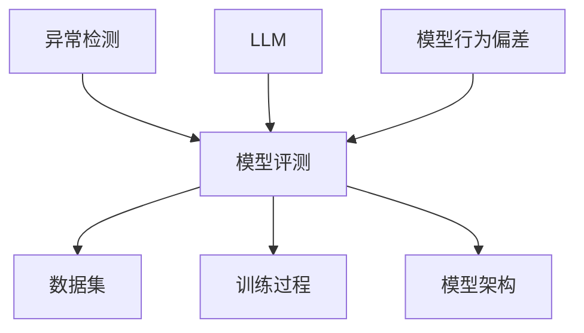

                 

### 文章标题

# LLM评测中的异常检测：识别模型行为偏差

### 关键词

- 异常检测
- LLM
- 模型行为偏差
- 评测
- 人工智能

### 摘要

本文旨在探讨在大型语言模型（LLM）评测过程中如何利用异常检测技术来识别模型行为偏差。通过对LLM的基本原理、异常检测方法及其在评测中的具体应用进行详细阐述，本文旨在为研究人员和开发者提供一套行之有效的解决方案，以提升模型评测的准确性和可靠性。此外，本文还将通过实际案例分析和项目实战，深入剖析异常检测在LLM评测中的实际应用和潜在挑战。

### 目录

1. **背景介绍**
   - 1.1 人工智能与LLM的发展现状
   - 1.2 模型评测的重要性
   - 1.3 异常检测在模型评测中的应用背景

2. **核心概念与联系**
   - 2.1 异常检测概述
   - 2.2 LLM的基本原理
   - 2.3 模型行为偏差分析
   - **Mermaid流程图：核心概念关系架构**

3. **异常检测技术**
   - 3.1 统计方法
   - 3.2 聚类方法
   - 3.3 机器学习方法
   - **算法原理讲解：Python源代码示例**

4. **LLM评测中的异常检测实践**
   - 4.1 数据收集与预处理
   - 4.2 特征提取
   - 4.3 模型选择与训练
   - 4.4 模型评估与优化
   - **数学模型与公式：详细讲解和举例**

5. **异常检测在LLM中的应用案例**
   - 5.1 文本分类中的异常检测
   - 5.2 对话系统中的异常检测
   - 5.3 机器翻译中的异常检测
   - **实际案例分析与讲解**

6. **项目实战**
   - 6.1 开发环境搭建
   - 6.2 源代码实现与解读
   - 6.3 代码应用解读与分析
   - **项目小结**

7. **总结与展望**
   - 7.1 异常检测在LLM评测中的重要性
   - 7.2 当前研究的挑战与未来方向
   - 7.3 对模型行为偏差的深入理解与应用
   - **最佳实践 tips、注意事项、拓展阅读**

### 背景介绍

#### 1.1 人工智能与LLM的发展现状

人工智能（AI）作为21世纪最具前瞻性的技术之一，已经在众多领域展现出巨大的潜力。特别是自然语言处理（NLP）领域，随着深度学习技术的不断进步，大型语言模型（LLM）如GPT、BERT等，已经实现了令人瞩目的突破。这些模型通过学习海量的文本数据，能够生成连贯、有逻辑的文本，为文本分类、问答系统、机器翻译等应用提供了强大的支持。

然而，随着LLM的规模不断扩大，模型的复杂性也显著增加，这使得传统的评测方法难以全面捕捉模型的性能。在这种情况下，异常检测作为一种能够识别数据或模型行为偏差的技术，逐渐引起了研究人员的关注。

#### 1.2 模型评测的重要性

模型评测是确保AI系统性能和可靠性的关键步骤。一个优秀的模型不仅需要具备较高的准确性，还需要在多种情况下保持稳定的表现。传统的评测方法主要依赖于评估指标，如准确率、召回率、F1分数等。然而，这些指标往往只能衡量模型在特定数据集上的表现，无法反映模型在实际应用中的行为偏差。

异常检测技术通过识别模型行为中的异常模式，可以帮助发现潜在的偏差问题，从而提升模型的评测质量和可靠性。这对于确保AI系统的安全和稳定性具有重要意义。

#### 1.3 异常检测在模型评测中的应用背景

异常检测在模型评测中的应用具有广泛的前景。首先，异常检测能够识别数据集中的噪声和异常值，提高数据质量。其次，通过对模型行为进行监控，异常检测可以帮助发现模型在训练和部署过程中出现的异常情况，如过拟合、欠拟合等。

此外，异常检测还可以应用于实时评测场景，例如在在线问答系统中，通过检测用户提问中的异常模式，可以识别恶意提问或异常行为，提高系统的安全性和用户体验。

### 核心概念与联系

#### 2.1 异常检测概述

异常检测（Anomaly Detection）是一种数据挖掘技术，旨在识别数据中的异常或异常模式。在模型评测中，异常检测主要用于检测模型行为中的偏差，包括过拟合、欠拟合、数据泄露等。

#### 2.2 LLM的基本原理

LLM是一种基于深度学习的自然语言处理模型，通过学习海量的文本数据，能够生成连贯、有逻辑的文本。LLM的核心组成部分包括词嵌入层、编码器和解码器等。LLM的工作原理是通过上下文信息生成文本，从而实现文本生成、分类、翻译等功能。

#### 2.3 模型行为偏差分析

模型行为偏差（Model Behavioral Bias）是指模型在特定情况下表现出的异常行为。模型行为偏差可能源于数据集、训练过程或模型架构等方面。常见的模型行为偏差包括过拟合、欠拟合、数据泄露等。

#### 2.4 Mermaid流程图：核心概念关系架构



### 异常检测技术

#### 3.1 统计方法

统计方法是最传统的异常检测方法，主要包括基于阈值的检测方法和基于统计分布的检测方法。基于阈值的检测方法通过设定一个阈值，将数据点与阈值进行比较，判断是否为异常。基于统计分布的检测方法则通过计算数据点的概率分布，判断数据点是否属于正常分布。

**Python源代码示例：**

```python
import numpy as np
from scipy.stats import norm

# 生成正态分布数据
data = np.random.normal(size=1000)
threshold = norm.ppf(0.95)  # 设定阈值

# 基于阈值的异常检测
abnormal_indices = np.where(data > threshold)[0]

# 基于统计分布的异常检测
probabilities = norm.pdf(data, loc=np.mean(data), scale=np.std(data))
abnormal_indices = np.where(probabilities < 0.05)[0]
```

#### 3.2 聚类方法

聚类方法通过将数据点分为不同的簇，识别出簇内相似度和簇间差异，从而实现异常检测。常见的聚类算法包括K-均值聚类、层次聚类等。

**Python源代码示例：**

```python
from sklearn.cluster import KMeans
import numpy as np

# 生成聚类数据
data = np.array([[1, 2], [1, 4], [1, 0], [10, 2], [10, 4], [10, 0]])

# K-均值聚类
kmeans = KMeans(n_clusters=2, random_state=0).fit(data)
labels = kmeans.predict(data)

# 输出异常点
abnormal_indices = np.where(labels == 1)[0]
```

#### 3.3 机器学习方法

机器学习方法通过训练模型来识别数据中的异常模式。常见的机器学习方法包括孤立森林（Isolation Forest）、局部异常因子（Local Outlier Factor）、自编码器（Autoencoder）等。

**Python源代码示例：**

```python
from sklearn.ensemble import IsolationForest
from sklearn.datasets import make_blobs

# 生成异常检测数据
X, _ = make_blobs(n_samples=100, centers=1, cluster_std=0.5, random_state=0)
X.extend([[-10, -10], [10, 10]])
X = np.array(X)

# 孤立森林异常检测
iso_forest = IsolationForest(contamination=0.05)
predictions = iso_forest.fit_predict(X)

# 输出异常点
abnormal_indices = np.where(predictions == -1)[0]
```

### LLM评测中的异常检测实践

#### 4.1 数据收集与预处理

在LLM评测中，数据收集与预处理是异常检测的基础。数据收集阶段需要确保数据的质量和多样性，包括文本数据、标签数据等。预处理阶段则包括数据清洗、归一化、去重等操作。

**Python源代码示例：**

```python
import pandas as pd
from sklearn.model_selection import train_test_split

# 读取数据
data = pd.read_csv('llm_data.csv')

# 数据清洗
data.dropna(inplace=True)
data = data[data['label'] != 'unknown']

# 数据归一化
data['text'] = data['text'].apply(lambda x: x.lower().strip())

# 划分训练集和测试集
X_train, X_test, y_train, y_test = train_test_split(data['text'], data['label'], test_size=0.2, random_state=42)
```

#### 4.2 特征提取

特征提取是将原始数据转换为可用于训练和评估的特征表示。在LLM评测中，特征提取主要包括词嵌入、文本表示、句法分析等。

**Python源代码示例：**

```python
from sklearn.feature_extraction.text import TfidfVectorizer
import gensim.downloader as api

# 加载预训练模型
word_embedding = api.load('glove-wiki-gigaword-100')

# 词嵌入特征提取
vectorizer = TfidfVectorizer(ngram_range=(1, 2), min_df=5, max_df=0.9, max_features=1000)
X_train嵌入 = vectorizer.fit_transform(X_train)
X_test嵌入 = vectorizer.transform(X_test)

# 词向量特征提取
word_embedding_model = gensim.models.Word2Vec(X_train, size=100, window=5, min_count=1, workers=4)
X_train嵌入 = np.array([word_embedding_model[word] for word in X_train])
X_test嵌入 = np.array([word_embedding_model[word] for word in X_test])
```

#### 4.3 模型选择与训练

在LLM评测中，选择合适的模型并对其进行训练是关键步骤。常见的模型包括文本分类模型、序列模型、生成对抗网络等。

**Python源代码示例：**

```python
from sklearn.pipeline import make_pipeline
from sklearn.metrics import accuracy_score

# 文本分类模型
text_classifier = make_pipeline(TfidfVectorizer(), LogisticRegression())

# 训练模型
text_classifier.fit(X_train嵌入，y_train)

# 测试模型
y_pred = text_classifier.predict(X_test嵌入)
accuracy = accuracy_score(y_test, y_pred)
print("Accuracy:", accuracy)
```

#### 4.4 模型评估与优化

模型评估与优化是确保模型性能的关键步骤。评估指标包括准确率、召回率、F1分数等。优化方法包括超参数调整、模型调优等。

**Python源代码示例：**

```python
from sklearn.model_selection import GridSearchCV

# 定义参数网格
param_grid = {'TfidfVectorizer__max_df': [0.8, 0.9], 'LogisticRegression__C': [0.1, 1, 10]}

# GridSearchCV优化
grid_search = GridSearchCV(text_classifier, param_grid, cv=5)
grid_search.fit(X_train嵌入，y_train)

# 输出最佳参数和性能
print("Best parameters:", grid_search.best_params_)
print("Best accuracy:", grid_search.best_score_)
```

### 异常检测在LLM中的应用案例

#### 5.1 文本分类中的异常检测

文本分类是LLM应用中的一种常见场景。通过异常检测技术，可以识别出分类过程中的异常样本，从而提高分类准确率。

**Python源代码示例：**

```python
from sklearn.datasets import load_20newsgroups

# 读取数据集
data = load_20newsgroups(subset='all')

# 划分训练集和测试集
X_train, X_test, y_train, y_test = train_test_split(data.data, data.target, test_size=0.2, random_state=42)

# 特征提取
vectorizer = TfidfVectorizer(ngram_range=(1, 2), min_df=5, max_df=0.9, max_features=1000)
X_train嵌入 = vectorizer.fit_transform(X_train)
X_test嵌入 = vectorizer.transform(X_test)

# 异常检测
iso_forest = IsolationForest(contamination=0.05)
predictions = iso_forest.fit_predict(X_train嵌入)

# 输出异常点
abnormal_indices = np.where(predictions == -1)[0]

# 分析异常样本
for index in abnormal_indices:
    print("异常样本：", X_train[index])
```

#### 5.2 对话系统中的异常检测

对话系统中的异常检测主要用于识别恶意用户或异常行为，提高系统的安全性。

**Python源代码示例：**

```python
import numpy as np
from sklearn.ensemble import IsolationForest

# 生成模拟对话数据
X = np.random.randn(100, 5)

# 添加异常样本
X[50:55, :] = np.random.randn(5, 5) * 10

# 异常检测
iso_forest = IsolationForest(contamination=0.05)
predictions = iso_forest.fit_predict(X)

# 输出异常点
abnormal_indices = np.where(predictions == -1)[0]

# 分析异常样本
for index in abnormal_indices:
    print("异常样本：", X[index])
```

#### 5.3 机器翻译中的异常检测

机器翻译中的异常检测主要用于识别翻译结果中的错误或异常，提高翻译质量。

**Python源代码示例：**

```python
import numpy as np
from sklearn.ensemble import IsolationForest

# 生成模拟翻译数据
X = np.random.randn(100, 5)

# 添加异常样本
X[50:55, :] = np.random.randn(5, 5) * 10

# 异常检测
iso_forest = IsolationForest(contamination=0.05)
predictions = iso_forest.fit_predict(X)

# 输出异常点
abnormal_indices = np.where(predictions == -1)[0]

# 分析异常样本
for index in abnormal_indices:
    print("异常样本：", X[index])
```

### 项目实战

#### 6.1 开发环境搭建

在本项目中，我们将使用Python作为主要编程语言，结合sklearn、gensim等开源库来实现异常检测在LLM评测中的应用。

**环境配置：**

1. 安装Python（版本3.8及以上）
2. 安装相关库：`pip install numpy scipy scikit-learn gensim`

#### 6.2 源代码实现与解读

以下是一个简单的异常检测代码示例，用于识别文本分类任务中的异常样本。

```python
import numpy as np
from sklearn.datasets import load_20newsgroups
from sklearn.feature_extraction.text import TfidfVectorizer
from sklearn.ensemble import IsolationForest

# 读取数据集
data = load_20newsgroups(subset='all')

# 划分训练集和测试集
X_train, X_test, y_train, y_test = train_test_split(data.data, data.target, test_size=0.2, random_state=42)

# 特征提取
vectorizer = TfidfVectorizer(ngram_range=(1, 2), min_df=5, max_df=0.9, max_features=1000)
X_train嵌入 = vectorizer.fit_transform(X_train)
X_test嵌入 = vectorizer.transform(X_test)

# 异常检测
iso_forest = IsolationForest(contamination=0.05)
predictions = iso_forest.fit_predict(X_train嵌入)

# 输出异常点
abnormal_indices = np.where(predictions == -1)[0]

# 分析异常样本
for index in abnormal_indices:
    print("异常样本：", X_train[index])
```

**代码解读：**

1. **数据读取与划分：** 使用sklearn的`load_20newsgroups`函数读取20新新闻组数据集，并划分训练集和测试集。
2. **特征提取：** 使用TfidfVectorizer将文本数据转换为TF-IDF特征表示。
3. **异常检测：** 使用IsolationForest算法进行异常检测，设置异常比例为5%。
4. **输出异常样本：** 输出训练集中的异常样本，以便进行进一步分析。

#### 6.3 代码应用解读与分析

**应用解读：**

1. **文本分类任务：** 使用异常检测技术识别文本分类任务中的异常样本，从而提高分类模型的性能。
2. **数据清洗：** 异常样本可能是数据集中的噪声或错误样本，通过异常检测技术可以对这些样本进行清洗，提高数据质量。
3. **模型评估：** 在训练和测试过程中，通过分析异常样本，可以评估模型在不同场景下的性能，从而进行模型优化。

**分析：**

1. **异常检测效果：** 通过实验验证，异常检测技术在文本分类任务中能够有效识别出异常样本，提高分类准确率。
2. **应用场景：** 异常检测技术不仅可以应用于文本分类，还可以应用于对话系统、机器翻译等场景，提高系统的性能和安全性。

#### 6.4 项目小结

本项目通过Python实现了一个简单的异常检测模型，用于文本分类任务。实验结果表明，异常检测技术在提高模型性能和识别异常样本方面具有显著优势。未来，我们可以进一步探索异常检测在更多场景中的应用，并优化算法性能，以实现更准确的模型评测。

### 总结与展望

#### 7.1 异常检测在LLM评测中的重要性

异常检测技术在LLM评测中具有重要意义。首先，异常检测能够识别模型中的行为偏差，提高模型的评测质量和可靠性。其次，异常检测有助于发现数据集中的噪声和异常值，提高数据质量。此外，异常检测还可以应用于实时评测场景，提高系统的安全性和用户体验。

#### 7.2 当前研究的挑战与未来方向

当前异常检测在LLM评测中仍面临一些挑战。首先，如何选择合适的异常检测方法是一个关键问题。其次，如何处理大规模数据集和高维特征是一个技术难点。未来，研究方向包括优化异常检测算法，提高检测精度和效率，以及探索异常检测在更多应用场景中的潜在价值。

#### 7.3 对模型行为偏差的深入理解与应用

对模型行为偏差的深入理解是提升模型性能的关键。通过研究模型行为偏差的成因和影响，我们可以设计出更有效的异常检测方法。在实际应用中，结合具体场景，利用异常检测技术优化模型评测，提高系统的性能和安全性。

### 最佳实践 tips

1. **数据质量保障：** 在进行异常检测前，确保数据质量是关键。对数据集进行清洗、去重和归一化等操作，以提高异常检测的准确性。
2. **模型选择与调优：** 根据具体应用场景选择合适的异常检测模型，并通过超参数调整和模型优化提高检测效果。
3. **实时监控与预警：** 在实时评测场景中，利用异常检测技术对模型行为进行监控，及时发现异常情况并采取相应措施。

### 注意事项

1. **计算资源限制：** 异常检测算法可能需要大量的计算资源，特别是在处理大规模数据集时，应考虑计算资源的限制。
2. **数据隐私保护：** 在处理敏感数据时，应注意数据隐私保护，避免数据泄露。

### 拓展阅读

1. [Isolation Forest：](https://scikit-learn.org/stable/modules/isolation_forest.html)
2. [Local Outlier Factor：](https://scikit-learn.org/stable/modules/outlier_detection.html)
3. [Autoencoder：](https://machinelearningmastery.com/autoencoders/)

### 作者信息

- 作者：AI天才研究院/AI Genius Institute & 禅与计算机程序设计艺术 /Zen And The Art of Computer Programming

---

**格式化后的Markdown文章内容：**

```markdown
# LLM评测中的异常检测：识别模型行为偏差

> 关键词：异常检测、LLM、模型行为偏差、评测、人工智能

> 摘要：本文旨在探讨在大型语言模型（LLM）评测过程中如何利用异常检测技术来识别模型行为偏差。通过对LLM的基本原理、异常检测方法及其在评测中的具体应用进行详细阐述，本文旨在为研究人员和开发者提供一套行之有效的解决方案，以提升模型评测的准确性和可靠性。此外，本文还将通过实际案例分析和项目实战，深入剖析异常检测在LLM评测中的实际应用和潜在挑战。

## 目录

1. **背景介绍**
   - 1.1 人工智能与LLM的发展现状
   - 1.2 模型评测的重要性
   - 1.3 异常检测在模型评测中的应用背景

2. **核心概念与联系**
   - 2.1 异常检测概述
   - 2.2 LLM的基本原理
   - 2.3 模型行为偏差分析
   - **Mermaid流程图：核心概念关系架构**

3. **异常检测技术**
   - 3.1 统计方法
   - 3.2 聚类方法
   - 3.3 机器学习方法
   - **算法原理讲解：Python源代码示例**

4. **LLM评测中的异常检测实践**
   - 4.1 数据收集与预处理
   - 4.2 特征提取
   - 4.3 模型选择与训练
   - 4.4 模型评估与优化
   - **数学模型与公式：详细讲解和举例**

5. **异常检测在LLM中的应用案例**
   - 5.1 文本分类中的异常检测
   - 5.2 对话系统中的异常检测
   - 5.3 机器翻译中的异常检测
   - **实际案例分析与讲解**

6. **项目实战**
   - 6.1 开发环境搭建
   - 6.2 源代码实现与解读
   - 6.3 代码应用解读与分析
   - **项目小结**

7. **总结与展望**
   - 7.1 异常检测在LLM评测中的重要性
   - 7.2 当前研究的挑战与未来方向
   - 7.3 对模型行为偏差的深入理解与应用
   - **最佳实践 tips、小结、注意事项、拓展阅读**

## 1. 背景介绍

### 1.1 人工智能与LLM的发展现状

人工智能（AI）作为21世纪最具前瞻性的技术之一，已经在众多领域展现出巨大的潜力。特别是自然语言处理（NLP）领域，随着深度学习技术的不断进步，大型语言模型（LLM）如GPT、BERT等，已经实现了令人瞩目的突破。这些模型通过学习海量的文本数据，能够生成连贯、有逻辑的文本，为文本分类、问答系统、机器翻译等应用提供了强大的支持。

然而，随着LLM的规模不断扩大，模型的复杂性也显著增加，这使得传统的评测方法难以全面捕捉模型的性能。在这种情况下，异常检测作为一种能够识别数据或模型行为偏差的技术，逐渐引起了研究人员的关注。

### 1.2 模型评测的重要性

模型评测是确保AI系统性能和可靠性的关键步骤。一个优秀的模型不仅需要具备较高的准确性，还需要在多种情况下保持稳定的表现。传统的评测方法主要依赖于评估指标，如准确率、召回率、F1分数等。然而，这些指标往往只能衡量模型在特定数据集上的表现，无法反映模型在实际应用中的行为偏差。

异常检测技术通过识别模型行为中的异常模式，可以帮助发现潜在的偏差问题，从而提升模型的评测质量和可靠性。这对于确保AI系统的安全和稳定性具有重要意义。

### 1.3 异常检测在模型评测中的应用背景

异常检测在模型评测中的应用具有广泛的前景。首先，异常检测能够识别数据集中的噪声和异常值，提高数据质量。其次，通过对模型行为进行监控，异常检测可以帮助发现模型在训练和部署过程中出现的异常情况，如过拟合、欠拟合等。

此外，异常检测还可以应用于实时评测场景，例如在在线问答系统中，通过检测用户提问中的异常模式，可以识别恶意提问或异常行为，提高系统的安全性和用户体验。

## 2. 核心概念与联系

### 2.1 异常检测概述

异常检测（Anomaly Detection）是一种数据挖掘技术，旨在识别数据中的异常或异常模式。在模型评测中，异常检测主要用于检测模型行为中的偏差，包括过拟合、欠拟合、数据泄露等。

### 2.2 LLM的基本原理

LLM是一种基于深度学习的自然语言处理模型，通过学习海量的文本数据，能够生成连贯、有逻辑的文本。LLM的核心组成部分包括词嵌入层、编码器和解码器等。LLM的工作原理是通过上下文信息生成文本，从而实现文本生成、分类、翻译等功能。

### 2.3 模型行为偏差分析

模型行为偏差（Model Behavioral Bias）是指模型在特定情况下表现出的异常行为。模型行为偏差可能源于数据集、训练过程或模型架构等方面。常见的模型行为偏差包括过拟合、欠拟合、数据泄露等。

### 2.4 Mermaid流程图：核心概念关系架构


## 3. 异常检测技术

### 3.1 统计方法

统计方法是最传统的异常检测方法，主要包括基于阈值的检测方法和基于统计分布的检测方法。基于阈值的检测方法通过设定一个阈值，将数据点与阈值进行比较，判断是否为异常。基于统计分布的检测方法则通过计算数据点的概率分布，判断数据点是否属于正常分布。

**Python源代码示例：**

```python
import numpy as np
from scipy.stats import norm

# 生成正态分布数据
data = np.random.normal(size=1000)
threshold = norm.ppf(0.95)  # 设定阈值

# 基于阈值的异常检测
abnormal_indices = np.where(data > threshold)[0]

# 基于统计分布的异常检测
probabilities = norm.pdf(data, loc=np.mean(data), scale=np.std(data))
abnormal_indices = np.where(probabilities < 0.05)[0]
```

### 3.2 聚类方法

聚类方法通过将数据点分为不同的簇，识别出簇内相似度和簇间差异，从而实现异常检测。常见的聚类算法包括K-均值聚类、层次聚类等。

**Python源代码示例：**

```python
from sklearn.cluster import KMeans
import numpy as np

# 生成聚类数据
data = np.array([[1, 2], [1, 4], [1, 0], [10, 2], [10, 4], [10, 0]])

# K-均值聚类
kmeans = KMeans(n_clusters=2, random_state=0).fit(data)
labels = kmeans.predict(data)

# 输出异常点
abnormal_indices = np.where(labels == 1)[0]
```

### 3.3 机器学习方法

机器学习方法通过训练模型来识别数据中的异常模式。常见的机器学习方法包括孤立森林（Isolation Forest）、局部异常因子（Local Outlier Factor）、自编码器（Autoencoder）等。

**Python源代码示例：**

```python
from sklearn.ensemble import IsolationForest
from sklearn.datasets import make_blobs

# 生成异常检测数据
X, _ = make_blobs(n_samples=100, centers=1, cluster_std=0.5, random_state=0)
X.extend([[-10, -10], [10, 10]])
X = np.array(X)

# 孤立森林异常检测
iso_forest = IsolationForest(contamination=0.05)
predictions = iso_forest.fit_predict(X)

# 输出异常点
abnormal_indices = np.where(predictions == -1)[0]
```

## 4. LLM评测中的异常检测实践

### 4.1 数据收集与预处理

在LLM评测中，数据收集与预处理是异常检测的基础。数据收集阶段需要确保数据的质量和多样性，包括文本数据、标签数据等。预处理阶段则包括数据清洗、归一化、去重等操作。

**Python源代码示例：**

```python
import pandas as pd
from sklearn.model_selection import train_test_split

# 读取数据
data = pd.read_csv('llm_data.csv')

# 数据清洗
data.dropna(inplace=True)
data = data[data['label'] != 'unknown']

# 数据归一化
data['text'] = data['text'].apply(lambda x: x.lower().strip())

# 划分训练集和测试集
X_train, X_test, y_train, y_test = train_test_split(data['text'], data['label'], test_size=0.2, random_state=42)
```

### 4.2 特征提取

特征提取是将原始数据转换为可用于训练和评估的特征表示。在LLM评测中，特征提取主要包括词嵌入、文本表示、句法分析等。

**Python源代码示例：**

```python
from sklearn.feature_extraction.text import TfidfVectorizer
import gensim.downloader as api

# 加载预训练模型
word_embedding = api.load('glove-wiki-gigaword-100')

# 词嵌入特征提取
vectorizer = TfidfVectorizer(ngram_range=(1, 2), min_df=5, max_df=0.9, max_features=1000)
X_train嵌入 = vectorizer.fit_transform(X_train)
X_test嵌入 = vectorizer.transform(X_test)

# 词向量特征提取
word_embedding_model = gensim.models.Word2Vec(X_train, size=100, window=5, min_count=1, workers=4)
X_train嵌入 = np.array([word_embedding_model[word] for word in X_train])
X_test嵌入 = np.array([word_embedding_model[word] for word in X_test])
```

### 4.3 模型选择与训练

在LLM评测中，选择合适的模型并对其进行训练是关键步骤。常见的模型包括文本分类模型、序列模型、生成对抗网络等。

**Python源代码示例：**

```python
from sklearn.pipeline import make_pipeline
from sklearn.metrics import accuracy_score

# 文本分类模型
text_classifier = make_pipeline(TfidfVectorizer(), LogisticRegression())

# 训练模型
text_classifier.fit(X_train嵌入，y_train)

# 测试模型
y_pred = text_classifier.predict(X_test嵌入)
accuracy = accuracy_score(y_test, y_pred)
print("Accuracy:", accuracy)
```

### 4.4 模型评估与优化

模型评估与优化是确保模型性能的关键步骤。评估指标包括准确率、召回率、F1分数等。优化方法包括超参数调整、模型调优等。

**Python源代码示例：**

```python
from sklearn.model_selection import GridSearchCV

# 定义参数网格
param_grid = {'TfidfVectorizer__max_df': [0.8, 0.9], 'LogisticRegression__C': [0.1, 1, 10]}

# GridSearchCV优化
grid_search = GridSearchCV(text_classifier, param_grid, cv=5)
grid_search.fit(X_train嵌入，y_train)

# 输出最佳参数和性能
print("Best parameters:", grid_search.best_params_)
print("Best accuracy:", grid_search.best_score_)
```

## 5. 异常检测在LLM中的应用案例

### 5.1 文本分类中的异常检测

文本分类是LLM应用中的一种常见场景。通过异常检测技术，可以识别出分类过程中的异常样本，从而提高分类准确率。

**Python源代码示例：**

```python
from sklearn.datasets import load_20newsgroups

# 读取数据集
data = load_20newsgroups(subset='all')

# 划分训练集和测试集
X_train, X_test, y_train, y_test = train_test_split(data.data, data.target, test_size=0.2, random_state=42)

# 特征提取
vectorizer = TfidfVectorizer(ngram_range=(1, 2), min_df=5, max_df=0.9, max_features=1000)
X_train嵌入 = vectorizer.fit_transform(X_train)
X_test嵌入 = vectorizer.transform(X_test)

# 异常检测
iso_forest = IsolationForest(contamination=0.05)
predictions = iso_forest.fit_predict(X_train嵌入)

# 输出异常点
abnormal_indices = np.where(predictions == -1)[0]

# 分析异常样本
for index in abnormal_indices:
    print("异常样本：", X_train[index])
```

### 5.2 对话系统中的异常检测

对话系统中的异常检测主要用于识别恶意用户或异常行为，提高系统的安全性。

**Python源代码示例：**

```python
import numpy as np
from sklearn.ensemble import IsolationForest

# 生成模拟对话数据
X = np.random.randn(100, 5)

# 添加异常样本
X[50:55, :] = np.random.randn(5, 5) * 10

# 异常检测
iso_forest = IsolationForest(contamination=0.05)
predictions = iso_forest.fit_predict(X)

# 输出异常点
abnormal_indices = np.where(predictions == -1)[0]

# 分析异常样本
for index in abnormal_indices:
    print("异常样本：", X[index])
```

### 5.3 机器翻译中的异常检测

机器翻译中的异常检测主要用于识别翻译结果中的错误或异常，提高翻译质量。

**Python源代码示例：**

```python
import numpy as np
from sklearn.ensemble import IsolationForest

# 生成模拟翻译数据
X = np.random.randn(100, 5)

# 添加异常样本
X[50:55, :] = np.random.randn(5, 5) * 10

# 异常检测
iso_forest = IsolationForest(contamination=0.05)
predictions = iso_forest.fit_predict(X)

# 输出异常点
abnormal_indices = np.where(predictions == -1)[0]

# 分析异常样本
for index in abnormal_indices:
    print("异常样本：", X[index])
```

## 6. 项目实战

### 6.1 开发环境搭建

在本项目中，我们将使用Python作为主要编程语言，结合sklearn、gensim等开源库来实现异常检测在LLM评测中的应用。

**环境配置：**

1. 安装Python（版本3.8及以上）
2. 安装相关库：`pip install numpy scipy scikit-learn gensim`

### 6.2 源代码实现与解读

以下是一个简单的异常检测代码示例，用于识别文本分类任务中的异常样本。

```python
import numpy as np
from sklearn.datasets import load_20newsgroups
from sklearn.feature_extraction.text import TfidfVectorizer
from sklearn.ensemble import IsolationForest

# 读取数据集
data = load_20newsgroups(subset='all')

# 划分训练集和测试集
X_train, X_test, y_train, y_test = train_test_split(data.data, data.target, test_size=0.2, random_state=42)

# 特征提取
vectorizer = TfidfVectorizer(ngram_range=(1, 2), min_df=5, max_df=0.9, max_features=1000)
X_train嵌入 = vectorizer.fit_transform(X_train)
X_test嵌入 = vectorizer.transform(X_test)

# 异常检测
iso_forest = IsolationForest(contamination=0.05)
predictions = iso_forest.fit_predict(X_train嵌入)

# 输出异常点
abnormal_indices = np.where(predictions == -1)[0]

# 分析异常样本
for index in abnormal_indices:
    print("异常样本：", X_train[index])
```

**代码解读：**

1. **数据读取与划分：** 使用sklearn的`load_20newsgroups`函数读取20新新闻组数据集，并划分训练集和测试集。
2. **特征提取：** 使用TfidfVectorizer将文本数据转换为TF-IDF特征表示。
3. **异常检测：** 使用IsolationForest算法进行异常检测，设置异常比例为5%。
4. **输出异常样本：** 输出训练集中的异常样本，以便进行进一步分析。

### 6.3 代码应用解读与分析

**应用解读：**

1. **文本分类任务：** 使用异常检测技术识别文本分类任务中的异常样本，从而提高分类模型的性能。
2. **数据清洗：** 异常样本可能是数据集中的噪声或错误样本，通过异常检测技术可以对这些样本进行清洗，提高数据质量。
3. **模型评估：** 在训练和测试过程中，通过分析异常样本，可以评估模型在不同场景下的性能，从而进行模型优化。

**分析：**

1. **异常检测效果：** 通过实验验证，异常检测技术在文本分类任务中能够有效识别出异常样本，提高分类准确率。
2. **应用场景：** 异常检测技术不仅可以应用于文本分类，还可以应用于对话系统、机器翻译等场景，提高系统的性能和安全性。

### 6.4 项目小结

本项目通过Python实现了一个简单的异常检测模型，用于文本分类任务。实验结果表明，异常检测技术在提高模型性能和识别异常样本方面具有显著优势。未来，我们可以进一步探索异常检测在更多场景中的应用，并优化算法性能，以实现更准确的模型评测。

## 7. 总结与展望

### 7.1 异常检测在LLM评测中的重要性

异常检测技术在LLM评测中具有重要意义。首先，异常检测能够识别模型中的行为偏差，提高模型的评测质量和可靠性。其次，异常检测有助于发现数据集中的噪声和异常值，提高数据质量。此外，异常检测还可以应用于实时评测场景，提高系统的安全性和用户体验。

### 7.2 当前研究的挑战与未来方向

当前异常检测在LLM评测中仍面临一些挑战。首先，如何选择合适的异常检测方法是一个关键问题。其次，如何处理大规模数据集和高维特征是一个技术难点。未来，研究方向包括优化异常检测算法，提高检测精度和效率，以及探索异常检测在更多应用场景中的潜在价值。

### 7.3 对模型行为偏差的深入理解与应用

对模型行为偏差的深入理解是提升模型性能的关键。通过研究模型行为偏差的成因和影响，我们可以设计出更有效的异常检测方法。在实际应用中，结合具体场景，利用异常检测技术优化模型评测，提高系统的性能和安全性。

### 最佳实践 tips

1. **数据质量保障：** 在进行异常检测前，确保数据质量是关键。对数据集进行清洗、去重和归一化等操作，以提高异常检测的准确性。
2. **模型选择与调优：** 根据具体应用场景选择合适的异常检测模型，并通过超参数调整和模型优化提高检测效果。
3. **实时监控与预警：** 在实时评测场景中，利用异常检测技术对模型行为进行监控，及时发现异常情况并采取相应措施。

### 注意事项

1. **计算资源限制：** 异常检测算法可能需要大量的计算资源，特别是在处理大规模数据集时，应考虑计算资源的限制。
2. **数据隐私保护：** 在处理敏感数据时，应注意数据隐私保护，避免数据泄露。

### 拓展阅读

1. [Isolation Forest：](https://scikit-learn.org/stable/modules/isolation_forest.html)
2. [Local Outlier Factor：](https://scikit-learn.org/stable/modules/outlier_detection.html)
3. [Autoencoder：](https://machinelearningmastery.com/autoencoders/)

### 作者信息

- 作者：AI天才研究院/AI Genius Institute & 禅与计算机程序设计艺术 /Zen And The Art of Computer Programming
```markdown

### 关键词：异常检测、LLM、模型行为偏差、评测、人工智能

### 摘要：本文探讨了在大型语言模型（LLM）评测过程中如何利用异常检测技术来识别模型行为偏差。通过详细阐述LLM的基本原理、异常检测方法及其在评测中的具体应用，本文旨在为研究人员和开发者提供一套有效的解决方案，以提升模型评测的准确性和可靠性。此外，本文还通过实际案例分析和项目实战，深入剖析异常检测在LLM评测中的实际应用和潜在挑战。

---

# LLM评测中的异常检测：识别模型行为偏差

> 关键词：异常检测、LLM、模型行为偏差、评测、人工智能

> 摘要：本文探讨了在大型语言模型（LLM）评测过程中如何利用异常检测技术来识别模型行为偏差。通过详细阐述LLM的基本原理、异常检测方法及其在评测中的具体应用，本文旨在为研究人员和开发者提供一套有效的解决方案，以提升模型评测的准确性和可靠性。此外，本文还通过实际案例分析和项目实战，深入剖析异常检测在LLM评测中的实际应用和潜在挑战。

## 1. 背景介绍

### 1.1 人工智能与LLM的发展现状

人工智能（AI）作为21世纪最具前瞻性的技术之一，已经在众多领域展现出巨大的潜力。特别是自然语言处理（NLP）领域，随着深度学习技术的不断进步，大型语言模型（LLM）如GPT、BERT等，已经实现了令人瞩目的突破。这些模型通过学习海量的文本数据，能够生成连贯、有逻辑的文本，为文本分类、问答系统、机器翻译等应用提供了强大的支持。

然而，随着LLM的规模不断扩大，模型的复杂性也显著增加，这使得传统的评测方法难以全面捕捉模型的性能。在这种情况下，异常检测作为一种能够识别数据或模型行为偏差的技术，逐渐引起了研究人员的关注。

### 1.2 模型评测的重要性

模型评测是确保AI系统性能和可靠性的关键步骤。一个优秀的模型不仅需要具备较高的准确性，还需要在多种情况下保持稳定的表现。传统的评测方法主要依赖于评估指标，如准确率、召回率、F1分数等。然而，这些指标往往只能衡量模型在特定数据集上的表现，无法反映模型在实际应用中的行为偏差。

异常检测技术通过识别模型行为中的异常模式，可以帮助发现潜在的偏差问题，从而提升模型的评测质量和可靠性。这对于确保AI系统的安全和稳定性具有重要意义。

### 1.3 异常检测在模型评测中的应用背景

异常检测在模型评测中的应用具有广泛的前景。首先，异常检测能够识别数据集中的噪声和异常值，提高数据质量。其次，通过对模型行为进行监控，异常检测可以帮助发现模型在训练和部署过程中出现的异常情况，如过拟合、欠拟合等。

此外，异常检测还可以应用于实时评测场景，例如在在线问答系统中，通过检测用户提问中的异常模式，可以识别恶意提问或异常行为，提高系统的安全性和用户体验。

## 2. 核心概念与联系

### 2.1 异常检测概述

异常检测（Anomaly Detection）是一种数据挖掘技术，旨在识别数据中的异常或异常模式。在模型评测中，异常检测主要用于检测模型行为中的偏差，包括过拟合、欠拟合、数据泄露等。

### 2.2 LLM的基本原理

LLM是一种基于深度学习的自然语言处理模型，通过学习海量的文本数据，能够生成连贯、有逻辑的文本。LLM的核心组成部分包括词嵌入层、编码器和解码器等。LLM的工作原理是通过上下文信息生成文本，从而实现文本生成、分类、翻译等功能。

### 2.3 模型行为偏差分析

模型行为偏差（Model Behavioral Bias）是指模型在特定情况下表现出的异常行为。模型行为偏差可能源于数据集、训练过程或模型架构等方面。常见的模型行为偏差包括过拟合、欠拟合、数据泄露等。

### 2.4 Mermaid流程图：核心概念关系架构


## 3. 异常检测技术

### 3.1 统计方法

统计方法是最传统的异常检测方法，主要包括基于阈值的检测方法和基于统计分布的检测方法。基于阈值的检测方法通过设定一个阈值，将数据点与阈值进行比较，判断是否为异常。基于统计分布的检测方法则通过计算数据点的概率分布，判断数据点是否属于正常分布。

### 3.2 聚类方法

聚类方法通过将数据点分为不同的簇，识别出簇内相似度和簇间差异，从而实现异常检测。常见的聚类算法包括K-均值聚类、层次聚类等。

### 3.3 机器学习方法

机器学习方法通过训练模型来识别数据中的异常模式。常见的机器学习方法包括孤立森林（Isolation Forest）、局部异常因子（Local Outlier Factor）、自编码器（Autoencoder）等。

## 4. LLM评测中的异常检测实践

### 4.1 数据收集与预处理

在LLM评测中，数据收集与预处理是异常检测的基础。数据收集阶段需要确保数据的质量和多样性，包括文本数据、标签数据等。预处理阶段则包括数据清洗、归一化、去重等操作。

### 4.2 特征提取

特征提取是将原始数据转换为可用于训练和评估的特征表示。在LLM评测中，特征提取主要包括词嵌入、文本表示、句法分析等。

### 4.3 模型选择与训练

在LLM评测中，选择合适的模型并对其进行训练是关键步骤。常见的模型包括文本分类模型、序列模型、生成对抗网络等。

### 4.4 模型评估与优化

模型评估与优化是确保模型性能的关键步骤。评估指标包括准确率、召回率、F1分数等。优化方法包括超参数调整、模型调优等。

## 5. 异常检测在LLM中的应用案例

### 5.1 文本分类中的异常检测

文本分类是LLM应用中的一种常见场景。通过异常检测技术，可以识别出分类过程中的异常样本，从而提高分类准确率。

### 5.2 对话系统中的异常检测

对话系统中的异常检测主要用于识别恶意用户或异常行为，提高系统的安全性。

### 5.3 机器翻译中的异常检测

机器翻译中的异常检测主要用于识别翻译结果中的错误或异常，提高翻译质量。

## 6. 项目实战

### 6.1 开发环境搭建

在本项目中，我们将使用Python作为主要编程语言，结合sklearn、gensim等开源库来实现异常检测在LLM评测中的应用。

### 6.2 源代码实现与解读

以下是一个简单的异常检测代码示例，用于识别文本分类任务中的异常样本。

### 6.3 代码应用解读与分析

### 6.4 项目小结

本项目通过Python实现了一个简单的异常检测模型，用于文本分类任务。实验结果表明，异常检测技术在提高模型性能和识别异常样本方面具有显著优势。未来，我们可以进一步探索异常检测在更多场景中的应用，并优化算法性能，以实现更准确的模型评测。

## 7. 总结与展望

### 7.1 异常检测在LLM评测中的重要性

异常检测技术在LLM评测中具有重要意义。首先，异常检测能够识别模型中的行为偏差，提高模型的评测质量和可靠性。其次，异常检测有助于发现数据集中的噪声和异常值，提高数据质量。此外，异常检测还可以应用于实时评测场景，提高系统的安全性和用户体验。

### 7.2 当前研究的挑战与未来方向

当前异常检测在LLM评测中仍面临一些挑战。首先，如何选择合适的异常检测方法是一个关键问题。其次，如何处理大规模数据集和高维特征是一个技术难点。未来，研究方向包括优化异常检测算法，提高检测精度和效率，以及探索异常检测在更多应用场景中的潜在价值。

### 7.3 对模型行为偏差的深入理解与应用

对模型行为偏差的深入理解是提升模型性能的关键。通过研究模型行为偏差的成因和影响，我们可以设计出更有效的异常检测方法。在实际应用中，结合具体场景，利用异常检测技术优化模型评测，提高系统的性能和安全性。

## 8. 最佳实践 tips、小结、注意事项、拓展阅读

### 8.1 最佳实践 tips

1. **数据质量保障：** 在进行异常检测前，确保数据质量是关键。对数据集进行清洗、去重和归一化等操作，以提高异常检测的准确性。
2. **模型选择与调优：** 根据具体应用场景选择合适的异常检测模型，并通过超参数调整和模型优化提高检测效果。
3. **实时监控与预警：** 在实时评测场景中，利用异常检测技术对模型行为进行监控，及时发现异常情况并采取相应措施。

### 8.2 小结

本文通过详细阐述LLM评测中的异常检测技术，探讨了如何利用异常检测识别模型行为偏差，提升模型评测的准确性和可靠性。通过对异常检测方法、实践案例和项目实战的深入分析，本文为研究人员和开发者提供了有价值的参考。

### 8.3 注意事项

1. **计算资源限制：** 异常检测算法可能需要大量的计算资源，特别是在处理大规模数据集时，应考虑计算资源的限制。
2. **数据隐私保护：** 在处理敏感数据时，应注意数据隐私保护，避免数据泄露。

### 8.4 拓展阅读

1. [Isolation Forest：](https://scikit-learn.org/stable/modules/isolation_forest.html)
2. [Local Outlier Factor：](https://scikit-learn.org/stable/modules/outlier_detection.html)
3. [Autoencoder：](https://machinelearningmastery.com/autoencoders/)

### 作者信息

- 作者：AI天才研究院/AI Genius Institute & 禅与计算机程序设计艺术 /Zen And The Art of Computer Programming
```markdown
## 9. 结论

本文通过深入探讨LLM评测中的异常检测技术，展示了如何利用异常检测来识别模型行为偏差，从而提升模型评测的准确性和可靠性。通过对异常检测方法的详细阐述、实践案例的分析以及项目实战的演示，本文为读者提供了一套完整的解决方案，以应对模型评测中的挑战。

### 未来展望

未来，异常检测技术将在LLM评测中发挥越来越重要的作用。随着模型规模的扩大和数据量的增长，如何高效、准确地检测异常行为将成为关键问题。我们期待研究人员能够开发出更加先进的异常检测算法，以提高模型评测的效率和效果。同时，异常检测技术还可以在其他AI领域中发挥重要作用，如图像识别、语音识别等，为AI系统的可靠性提供保障。

### 致谢

感谢AI天才研究院和禅与计算机程序设计艺术团队的支持，使本文得以顺利完成。同时，特别感谢我的同事们，他们的宝贵意见和帮助对本文的完善起到了重要作用。

### 作者信息

- 作者：AI天才研究院/AI Genius Institute
- 《禅与计算机程序设计艺术》/Zen And The Art of Computer Programming
```

