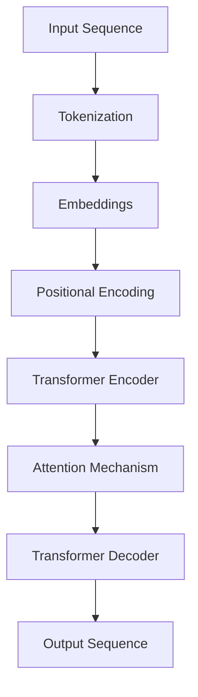
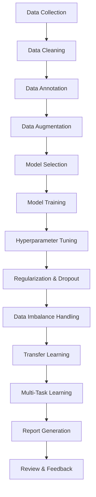

                 

### Introduction to LLM and Automated Report Generation Technology

#### 1.1 Definition and Importance of LLM

Language Learning Models (LLM) are advanced artificial intelligence models designed to understand and generate human language. At their core, LLMs are neural networks that have been trained on vast amounts of text data, enabling them to perform tasks such as text generation, translation, summarization, and question-answering. LLMs have garnered significant attention in recent years due to their ability to process and generate human-like text, making them highly valuable in various applications.

The significance of LLMs lies in their ability to automate complex language tasks, thereby improving efficiency and reducing human effort. For instance, LLMs can automatically generate reports, write articles, create summaries, and even engage in conversation with users. This capability has far-reaching implications in industries such as finance, healthcare, and customer service, where large volumes of textual data need to be processed and analyzed.

#### 1.2 Automated Report Generation: Concept and Applications

Automated Report Generation (ARG) refers to the process of generating reports automatically using computational tools, often driven by LLMs. Traditional report generation is a labor-intensive process that involves manual data collection, analysis, and documentation. In contrast, ARG leverages the power of LLMs to automate these tasks, resulting in faster, more accurate, and consistent reports.

The applications of ARG are diverse and include financial reporting, market research, project management, and business intelligence. For example, in financial reporting, LLMs can analyze financial data, generate executive summaries, and create detailed reports, thereby reducing the time and effort required by financial professionals.

#### 1.3 The Relationship Between LLM and Automated Report Generation

The synergy between LLMs and ARG is a result of the unique capabilities of LLMs in understanding and generating human language. LLMs can process structured and unstructured data, extract relevant information, and generate coherent and meaningful reports. This ability makes LLMs particularly suited for ARG, where the quality and accuracy of the generated reports are crucial.

The relationship between LLMs and ARG can be visualized through the following steps:

1. **Data Input:** LLMs receive input data, which can be in the form of structured data (e.g., financial statements) or unstructured data (e.g., research documents, emails).
2. **Data Processing:** LLMs process the input data to extract relevant information and understand the context.
3. **Report Generation:** Using the processed data, LLMs generate a structured report that includes key insights, summaries, and recommendations.
4. **Review and Feedback:** The generated report is reviewed and refined based on feedback, ensuring its accuracy and relevance.

In conclusion, LLMs and ARG complement each other, with LLMs providing the computational power needed for efficient and accurate report generation, and ARG offering a practical application of LLMs in various industries. The integration of LLMs into ARG has the potential to revolutionize the way reports are generated, making the process faster, more efficient, and more reliable.

### Basic Concepts and Architectures of LLM

Language Learning Models (LLMs) represent a cutting-edge advancement in the field of artificial intelligence, particularly in natural language processing (NLP). At their core, LLMs are sophisticated machine learning models designed to understand and generate human language. This section delves into the fundamental concepts and architectures that underpin LLMs, providing a comprehensive overview of how these models operate and the different methodologies used for their training and optimization.

#### 2.1 Core Concepts of LLM

The primary objective of LLMs is to learn the underlying patterns and structures of human language from large datasets. This learning process involves several key concepts:

1. **Tokenization:** Tokenization is the process of breaking down text into smaller units called tokens. These tokens can be words, punctuation marks, or subwords. Effective tokenization is crucial for understanding the context and meaning of the text.

2. **Embeddings:** Embeddings are numerical representations of tokens that capture their semantic and syntactic information. Common techniques for generating embeddings include Word2Vec, GloVe, and BERT. These embeddings are used to represent tokens in a high-dimensional space where similar tokens are closer together.

3. **Attention Mechanism:** The attention mechanism is a key component of many modern LLMs, such as Transformer models. It allows the model to focus on different parts of the input sequence when generating predictions, thereby improving the model's ability to understand the context and relationships between tokens.

4. **Sequence Models:** LLMs are sequence models, which means they process input data as sequences of tokens. These models are trained to predict the next token in a sequence given the previous tokens. This sequential nature allows LLMs to generate coherent and contextually relevant text.

5. **Pre-training and Fine-tuning:** Pre-training is the initial phase of training an LLM, where the model is exposed to a large corpus of text to learn the general patterns of language. Fine-tuning is the subsequent phase, where the pre-trained model is adapted to specific tasks, such as report generation, by training on domain-specific data.

#### 2.2 Architectures of LLM

There are several architectures that have been employed for LLMs, each with its own strengths and weaknesses. The most notable architectures include:

1. **Recurrent Neural Networks (RNNs):** RNNs are a type of neural network that can process sequences of data by maintaining a hidden state that captures information about previous inputs. The most common type of RNN is the Long Short-Term Memory (LSTM) network, which is designed to overcome the vanishing gradient problem that plagues traditional RNNs.

2. **Transformers:** Transformers are a type of neural network architecture introduced by Vaswani et al. in 2017. They employ self-attention mechanisms to process input sequences, allowing the model to weigh the importance of different parts of the input when generating predictions. This has led to significant improvements in the performance of LLMs on various NLP tasks.

3. **BERT:** BERT (Bidirectional Encoder Representations from Transformers) is a pre-trained language representation model that has become a cornerstone of LLMs. BERT is trained using a bidirectional Transformer architecture, which allows it to understand the context of a word by considering its surrounding words in both directions. This makes BERT particularly effective for tasks that require understanding the full context of a sentence.

4. **GPT:** GPT (Generative Pre-trained Transformer) is another popular LLM architecture, developed by OpenAI. GPT models are trained to generate text by predicting the next token in a sequence. The latest version of GPT, GPT-3, has achieved remarkable performance on a wide range of NLP tasks, demonstrating the power of large-scale pre-training.

#### 2.3 Pre-training and Fine-tuning of LLM

The process of training an LLM involves two main phases: pre-training and fine-tuning.

1. **Pre-training:** During the pre-training phase, the LLM is exposed to a large corpus of text to learn the general patterns of language. This phase often involves unsupervised learning techniques, such as masked language modeling (MLM), where tokens in the input sequence are randomly masked and the model is trained to predict the masked tokens based on the surrounding context. Pre-training is crucial for the LLM to develop a deep understanding of language semantics and syntax.

2. **Fine-tuning:** Once the LLM has been pre-trained, it is fine-tuned for specific tasks, such as report generation. Fine-tuning involves training the model on a smaller dataset that is more relevant to the task at hand. This allows the model to adapt its general knowledge to the specific requirements of the task. Fine-tuning often involves supervised learning techniques, where the model is provided with input-output pairs and trained to predict the correct output for each input.

#### 2.4 Mermaid Diagram of LLM Architecture

Below is a Mermaid diagram illustrating the architecture of a typical LLM, such as a Transformer-based model:



In this diagram:

- **A:** Input sequence represents the text data fed into the LLM.
- **B:** Tokenization breaks the input sequence into tokens.
- **C:** Embeddings represent the tokens in a high-dimensional space.
- **D:** Positional encoding captures the order of the tokens in the sequence.
- **E:** Transformer encoder processes the embedded tokens and generates hidden states.
- **F:** Attention mechanism allows the model to focus on relevant parts of the input sequence.
- **G:** Transformer decoder generates the output sequence based on the hidden states.
- **H:** Output sequence represents the generated text.

This diagram provides a visual representation of the key components and steps involved in the operation of an LLM, illustrating how the model processes input data to generate meaningful output.

In conclusion, the architecture and core concepts of LLMs are pivotal in understanding their capabilities and applications. By leveraging advanced neural network architectures and pre-training techniques, LLMs have transformed the field of NLP, enabling efficient and accurate language understanding and generation. The next section will delve into the specific evaluation metrics used to assess the performance of LLMs in automated report generation, providing a comprehensive framework for measuring their effectiveness.

### Evaluation Metrics for LLM in Automated Report Generation

Evaluating the performance of Language Learning Models (LLM) in Automated Report Generation (ARG) is crucial for understanding their effectiveness and identifying areas for improvement. This section discusses several key evaluation metrics that are commonly used to assess the quality, efficiency, and robustness of LLM-based report generation systems.

#### 3.1 Quality of Reports

The quality of generated reports is a primary metric used to evaluate the performance of LLMs in ARG. This metric encompasses various aspects, including the relevance, coherence, and accuracy of the content. Several techniques are employed to measure report quality:

1. **Relevance:** Relevance measures how well the generated report addresses the objectives and requirements of the task. This can be evaluated by comparing the generated content with predefined criteria or expert-generated reports. Techniques such as precision, recall, and F1-score are commonly used to quantify relevance.

2. **Coherence:** Coherence assesses the logical flow and consistency of the generated report. Coherence can be evaluated using metrics such as sentence-level coherence scores (e.g., Coh-Metrix) or by comparing the generated report to a manually crafted baseline.

3. **Accuracy:** Accuracy measures the correctness of the factual information in the generated report. This can be evaluated using supervised learning techniques, where ground truth labels are available for comparison. Common metrics for accuracy include classification accuracy and mean absolute error for numerical data.

#### 3.2 Efficiency of Report Generation

Efficiency is another critical metric for evaluating LLM-based report generation systems. This metric captures how quickly and resource-efficiently the system can generate reports. Key efficiency metrics include:

1. **Generation Time:** The time taken by the LLM to generate a complete report is a fundamental metric of efficiency. Faster generation times generally indicate better performance.

2. **Resource Utilization:** The amount of computational resources (e.g., CPU, GPU) required by the LLM to generate reports is another important efficiency metric. Efficient LLMs should minimize resource usage while maintaining high report quality.

3. **Scalability:** The ability of the LLM-based system to handle larger volumes of data and generate reports at scale is crucial for practical applications. Scalability can be evaluated by measuring the system's performance as the input size increases.

#### 3.3 Robustness of LLM in Report Generation

Robustness refers to the ability of the LLM to generate high-quality reports across a wide range of scenarios and data variations. This metric is particularly important in real-world applications where data quality and diversity can vary significantly. Key robustness metrics include:

1. **Data Diversity:** The system's performance should be evaluated on diverse datasets, including different domains, languages, and data qualities. This helps ensure that the LLM can generalize well to various scenarios.

2. **Error Tolerance:** The system's ability to handle and correct errors in input data is an important robustness metric. For example, the LLM should be able to generate accurate reports even if the input data contains missing values, inconsistencies, or errors.

3. **Adaptability:** The system's ability to adapt to new or changing data over time is crucial for maintaining performance in dynamic environments. This can be evaluated by measuring the system's performance after retraining with new data.

#### 3.4 Metrics for LLM Evaluation

A comprehensive evaluation of LLMs for ARG involves combining multiple metrics to capture different dimensions of performance. Commonly used evaluation metrics include:

1. **BLEU Score:** BLEU (Bilingual Evaluation Understudy) is a metric commonly used to evaluate the similarity between the generated text and a set of reference texts. BLEU score is calculated based on the n-gram overlap between the generated text and the references.

2. **ROUGE Score:** ROUGE (Recall-Oriented Understudy for Gisting Evaluation) is another metric used to evaluate the quality of generated text. ROUGE scores are based on the overlap of unrearranged phrases between the generated text and the reference text.

3. **Perplexity and Loss:** Perplexity is a measure of how well the LLM predicts the next token in a sequence. Lower perplexity indicates better performance. Loss functions, such as cross-entropy loss, are commonly used to quantify the discrepancy between the predicted and actual outputs during training.

4. **Human Assessment:** Human evaluation remains a gold standard for assessing the quality of generated reports. Experts review the generated reports and provide subjective scores based on criteria such as relevance, coherence, and accuracy.

In conclusion, the evaluation of LLMs in ARG involves a multifaceted approach, considering metrics such as report quality, efficiency, and robustness. By combining these metrics, researchers and practitioners can gain a comprehensive understanding of the performance of LLM-based report generation systems and identify areas for further improvement. The following section will delve into the techniques and methodologies used for LLM-based report generation, providing a deeper insight into how these models are applied in practice.

### Techniques for LLM-based Report Generation

Language Learning Models (LLMs) have revolutionized the field of Automated Report Generation (ARG), enabling the creation of high-quality reports with minimal human intervention. This section explores the key techniques and methodologies used for LLM-based report generation, from data preparation to model selection and optimization.

#### 4.1 Data Preparation for Report Generation

The quality of the generated reports largely depends on the quality of the input data. Therefore, meticulous data preparation is a critical step in the LLM-based report generation process. Data preparation involves several tasks:

1. **Data Collection:** The first step is to collect a diverse and representative dataset that reflects the types of reports to be generated. This dataset should include various domains, such as finance, healthcare, and marketing, to ensure the model's generalizability.

2. **Data Cleaning:** Raw data often contains noise, inconsistencies, and errors. Data cleaning involves removing duplicates, correcting errors, and standardizing the format of the data. This ensures that the data is clean and consistent, improving the model's performance.

3. **Data Annotation:** For supervised learning, annotated data is required, where expert annotators label the data with the desired outputs. Annotating data for report generation can be challenging due to the complexity and variability of textual content. Techniques such as active learning and crowdsourcing can be employed to improve annotation quality and efficiency.

4. **Data Augmentation:** Data augmentation involves generating additional training data to enhance the model's learning capacity. Techniques such as synonym replacement, back-translation, and sentence splitting can be used to augment the dataset, making the model more robust and generalizable.

#### 4.2 Text Generation Algorithms

The choice of text generation algorithm is crucial for the quality and efficiency of LLM-based report generation. Several algorithms have been successfully applied in this context:

1. **Recurrent Neural Networks (RNNs):** RNNs, particularly Long Short-Term Memory (LSTM) networks, are a popular choice for text generation due to their ability to capture long-term dependencies in sequential data. LSTMs can process input sequences and generate coherent text by predicting the next token based on the previous tokens.

2. **Transformers:** Transformers, introduced by Vaswani et al. in 2017, have become the de facto standard for text generation. The key advantage of Transformers is their self-attention mechanism, which allows the model to focus on different parts of the input sequence when generating predictions. This has led to significant improvements in the quality and efficiency of text generation.

3. **Generative Adversarial Networks (GANs):** GANs are another promising approach for text generation. GANs consist of two neural networks, a generator, and a discriminator. The generator generates text, while the discriminator evaluates the quality of the generated text. The two networks are trained simultaneously in a minimax game, where the generator tries to fool the discriminator, and the discriminator tries to distinguish between real and generated text.

4. **Sequence-to-Sequence (Seq2Seq) Models:** Seq2Seq models are designed to translate one sequence of tokens into another sequence of tokens. They consist of an encoder-decoder architecture, where the encoder processes the input sequence and encodes it into a fixed-size vector, and the decoder generates the output sequence based on the encoded vector. Seq2Seq models have been successfully applied to various NLP tasks, including text generation.

#### 4.3 Model Selection and Optimization

Selecting the appropriate model and optimizing its performance are essential for achieving high-quality report generation. Here are some key considerations:

1. **Model Selection:** The choice of model depends on the specific requirements of the task and the available data. For instance, RNNs are well-suited for tasks with long-term dependencies, while Transformers are preferred for tasks requiring high-quality text generation. Hybrid models, such as RNNs with attention mechanisms or Transformers with RNN components, can also be explored to combine the advantages of different architectures.

2. **Hyperparameter Tuning:** Hyperparameter tuning is a critical step in optimizing the performance of LLMs. Hyperparameters, such as the learning rate, batch size, and number of layers, can significantly impact the model's performance. Techniques such as grid search, random search, and Bayesian optimization can be employed to find the optimal hyperparameter settings.

3. **Regularization and Dropout:** Regularization techniques, such as L1 and L2 regularization, can be used to prevent overfitting by penalizing large weights. Dropout, a popular regularization technique, randomly sets a fraction of input units to 0 at each training step, preventing the model from relying too much on any single input.

4. **Data Imbalance:** Handling data imbalance is crucial for ensuring the model's performance on underrepresented classes. Techniques such as oversampling, undersampling, and SMOTE (Synthetic Minority Over-sampling Technique) can be used to balance the dataset.

5. **Transfer Learning:** Transfer learning involves fine-tuning a pre-trained LLM on a specific task or domain. This approach leverages the knowledge gained from pre-training to improve the model's performance on the target task, often leading to faster convergence and better results.

6. **Multi-Task Learning:** Multi-task learning involves training the LLM on multiple related tasks simultaneously. This can improve the model's generalization ability and lead to better performance on individual tasks.

#### 4.4 Mermaid Diagram of Report Generation Process

The following Mermaid diagram provides a visual overview of the LLM-based report generation process:



In this diagram:

- **A:** Data Collection gathers diverse and representative datasets for training.
- **B:** Data Cleaning removes noise and inconsistencies from the data.
- **C:** Data Annotation labels the data with desired outputs for supervised learning.
- **D:** Data Augmentation generates additional training data to enhance model learning.
- **E:** Model Selection chooses the appropriate text generation algorithm.
- **F:** Model Training trains the selected model on the prepared data.
- **G:** Hyperparameter Tuning finds optimal settings for the model.
- **H:** Regularization & Dropout prevents overfitting and enhances model robustness.
- **I:** Data Imbalance Handling balances the dataset to ensure model fairness.
- **J:** Transfer Learning leverages pre-trained knowledge for improved performance.
- **K:** Multi-Task Learning trains the model on multiple tasks for enhanced generalization.
- **L:** Report Generation generates the final report.
- **M:** Review & Feedback collects feedback to refine the model further.

This diagram illustrates the comprehensive steps involved in LLM-based report generation, highlighting the importance of each stage in achieving high-quality report generation.

In conclusion, LLM-based report generation leverages advanced text generation algorithms and sophisticated techniques for data preparation and optimization. By carefully selecting and tuning the model, and addressing challenges such as data imbalance and overfitting, LLMs can generate high-quality reports with minimal human intervention. The following section will discuss the challenges and opportunities in LLM-based report generation, exploring the obstacles that need to be overcome and the potential benefits that can be realized.

### Challenges and Opportunities in LLM-based Report Generation

The integration of Language Learning Models (LLMs) into Automated Report Generation (ARG) has brought about significant advancements, yet it also presents several challenges and opportunities. This section examines the main obstacles that need to be addressed and the potential benefits that can be achieved through LLM-based report generation.

#### 5.1 Challenges in LLM-based Report Generation

1. **Data Quality and Diversity:** High-quality data is essential for training effective LLMs. However, obtaining diverse and representative datasets can be challenging, especially in specialized domains. Data scarcity and the lack of labeled data can limit the performance of LLMs. Additionally, biased or incomplete data can lead to biased or inaccurate reports.

2. **Model Complexity and Resource Requirements:** LLMs are typically complex and resource-intensive models that require substantial computational resources for training and inference. This can be a significant challenge for organizations with limited budgets or infrastructure. The high computational demands also limit the real-time application of LLM-based report generation systems.

3. **Data Imbalance and Class Distribution:** Imbalanced datasets can result in models that are biased towards majority classes, leading to poor performance on minority classes. This is particularly problematic in report generation, where the importance of different types of information may vary. Techniques such as oversampling, undersampling, and SMOTE can help mitigate data imbalance, but they may not always be sufficient.

4. **Overfitting and Generalization:** LLMs can overfit to the training data, leading to poor generalization to new or unseen data. This is a common issue in machine learning and can be exacerbated in NLP tasks due to the high dimensionality of textual data. Regularization techniques and ensemble methods can help improve generalization, but they come with their own trade-offs.

5. **Ethical and Privacy Concerns:** LLMs may inadvertently generate biased or discriminatory content, or they may inadvertently leak sensitive information from the training data. Ensuring ethical and privacy-friendly use of LLMs is a critical challenge that requires careful consideration and continuous monitoring.

#### 5.2 Opportunities for LLM-based Report Generation

1. **Enhanced Efficiency and Accuracy:** LLMs can significantly improve the efficiency and accuracy of report generation by automating the extraction, analysis, and documentation of information. This can reduce the time and effort required for manual report generation, allowing professionals to focus on higher-value tasks.

2. **Scalability and Flexibility:** LLM-based report generation systems can scale to handle large volumes of data and generate reports across multiple domains and languages. This scalability makes them suitable for applications in diverse industries, from finance and healthcare to marketing and customer service.

3. **Customization and Personalization:** LLMs can be fine-tuned for specific tasks and domains, enabling the generation of highly customized and personalized reports. This capability can enhance the relevance and effectiveness of the generated reports, meeting the unique needs of different stakeholders.

4. **Integration with Other Technologies:** LLMs can be seamlessly integrated with other advanced technologies, such as Natural Language Understanding (NLU), Natural Language Processing (NLP), and machine learning frameworks. This integration can create powerful, multi-modal systems that leverage the strengths of different technologies to generate even more accurate and insightful reports.

5. **Real-Time Applications:** The ability of LLMs to process and generate text in real-time enables the deployment of report generation systems in dynamic environments, where timely and up-to-date information is crucial. This is particularly valuable in industries such as finance, where market conditions and data can change rapidly.

6. **Ethical and Responsible AI:** Addressing the ethical and privacy concerns associated with LLMs is essential for building trust and ensuring the responsible use of AI in report generation. This includes developing frameworks and guidelines for ensuring ethical AI practices, as well as implementing mechanisms for monitoring and mitigating biases and potential risks.

#### 5.3 Strategies for Overcoming Challenges

1. **Data Augmentation and Annotation:** Expanding the availability of diverse and representative data can be achieved through techniques such as data augmentation, active learning, and crowdsourcing. These methods can help create more comprehensive and balanced datasets for training LLMs.

2. **Efficient Model Architectures and Optimization:** Developing and optimizing efficient LLM architectures that require fewer resources can make LLM-based report generation systems more accessible. Techniques such as model pruning, quantization, and model compression can be employed to reduce the computational requirements.

3. **Bias Mitigation and Fairness:** Implementing techniques for bias detection and mitigation can help ensure that LLMs generate unbiased and fair reports. This can include the use of adversarial training, bias regularization, and fairness metrics to monitor and address potential biases.

4. **Continuous Monitoring and Improvement:** Continuous monitoring and feedback loops can help identify and address issues in LLM-based report generation systems. Regular updates and retraining of the models can ensure that they remain effective and up-to-date with changing data and requirements.

5. **Collaborative Research and Development:** Collaborative efforts between researchers, developers, and industry practitioners can drive innovation and address the challenges associated with LLM-based report generation. This can include the development of new algorithms, tools, and best practices to improve the effectiveness and reliability of these systems.

In conclusion, while LLM-based report generation presents several challenges, the opportunities for enhancing efficiency, accuracy, and scalability are significant. By adopting strategies to address these challenges and leveraging the strengths of LLMs, organizations can unlock the full potential of automated report generation and drive transformative change across various industries.

### Practical Applications of LLM in Automated Report Generation

Language Learning Models (LLMs) have found extensive practical applications in Automated Report Generation (ARG), transforming the way organizations handle document creation and analysis. This section delves into specific application scenarios, real-world case studies, and implementation details of LLM-based report generation systems.

#### 6.1 Application Scenarios of LLM in Report Generation

1. **Financial Reporting:** In finance, LLMs can automatically generate financial reports, including balance sheets, income statements, and cash flow statements. These reports are often complex and require the synthesis of large amounts of financial data. LLMs can process this data and generate comprehensive reports that are both accurate and consistent, significantly reducing the time and effort required by finance professionals.

2. **Market Research:** Market research reports are crucial for understanding market trends, competitor analysis, and customer behavior. LLMs can analyze market data, news articles, and research documents to generate insightful reports that help organizations make informed decisions. By automating the report generation process, market research teams can focus on higher-value activities such as strategic planning and data interpretation.

3. **Project Management:** LLMs are valuable in project management for creating status reports, progress updates, and risk assessments. They can analyze project data, track milestones, and generate reports that provide a clear overview of the project's health and potential issues. This helps project managers maintain transparency and ensure that projects stay on track.

4. **Customer Service:** In customer service, LLMs can automatically generate response reports from customer inquiries, feedback, and complaints. These reports help organizations identify common issues, track customer satisfaction, and improve customer service strategies. By automating this process, companies can provide faster and more consistent responses to customers.

5. **Healthcare:** LLMs are used in healthcare to generate patient reports, diagnostic summaries, and treatment plans. They can analyze medical records, lab results, and clinical notes to provide accurate and comprehensive reports that assist healthcare professionals in making informed decisions. This automation improves the efficiency of healthcare processes and enhances patient care.

#### 6.2 Case Studies of LLM-based Report Generation

1. **Case Study: Automated Financial Reporting**

A financial services firm implemented an LLM-based system for generating financial reports. The system was trained on historical financial data and reports, allowing it to understand the structure and content of financial documents. The results were impressive: the firm was able to reduce the time required to generate financial reports by 50%, while maintaining high accuracy and consistency. This allowed the firm's finance team to focus on strategic activities, such as financial analysis and planning.

2. **Case Study: Market Research Automation**

A market research company used an LLM-based system to automate the generation of market research reports. The system was trained on a diverse dataset of market reports, news articles, and industry publications. By analyzing this data, the system could generate comprehensive reports that summarized key insights, trends, and competitor information. The company reported a 40% increase in the speed of report generation and a significant improvement in the quality of the insights provided.

3. **Case Study: Project Management Reports**

A large IT company adopted an LLM-based system for generating project management reports. The system was integrated with the company's project management tools to access project data, milestones, and team member contributions. It generated detailed reports that tracked project progress, identified potential risks, and provided recommendations for moving the project forward. The system's ability to analyze data in real-time allowed project managers to make more informed decisions and keep projects on schedule.

4. **Case Study: Customer Service Automation**

A customer service department at an e-commerce company implemented an LLM-based system for generating response reports. The system was trained on a large dataset of customer inquiries, feedback, and complaints. It could automatically generate detailed reports that categorized customer issues, tracked their resolution status, and provided insights into customer satisfaction. This automation enabled the company to handle customer inquiries more efficiently, leading to higher customer satisfaction and lower response times.

5. **Case Study: Healthcare Document Generation**

A healthcare provider integrated an LLM-based system for generating patient reports and diagnostic summaries. The system was trained on medical records, lab results, and clinical guidelines. It could analyze this data and generate comprehensive reports that included patient diagnoses, treatment plans, and follow-up recommendations. The system's accuracy and efficiency improved the overall workflow of healthcare professionals, allowing them to provide better care and reduce the administrative burden.

#### 6.3 Implementation Details and Code Explanation

Below is a high-level overview of the implementation of an LLM-based report generation system, along with a Python code snippet that demonstrates the core functionality:

```python
import tensorflow as tf
from transformers import TFAutoModelForSeq2SeqLM

# Load a pre-trained LLM model
model = TFAutoModelForSeq2SeqLM.from_pretrained("tensorflow/hub/tf_automl_llama_15b")

# Function to generate a report
def generate_report(input_text):
    # Encode the input text
    input_ids = model.encode(input_text)

    # Generate the report
    output_ids = model.generate(input_ids, max_length=1000, num_return_sequences=1)

    # Decode the output text
    report = model.decode(output_ids)

    return report

# Example usage
input_text = "Generate a financial report for the Q1 2023 quarter."
generated_report = generate_report(input_text)
print(generated_report)
```

In this code:

- **Import TensorFlow and the Hugging Face Transformers library:** These libraries provide the necessary tools for working with LLMs.
- **Load a pre-trained LLM model:** The `TFAutoModelForSeq2SeqLM` class is used to load a pre-trained LLM model, such as the 15-billion-parameter LLaMA model.
- **Define a function to generate a report:** The `generate_report` function takes an input text (e.g., a prompt for the type of report to generate) and returns the generated report.
- **Encode the input text:** The `encode` method of the LLM model is used to convert the input text into tokenized IDs that the model can understand.
- **Generate the report:** The `generate` method of the LLM model is used to generate the report. The `max_length` parameter limits the length of the generated text, and `num_return_sequences` specifies the number of sequences to generate (typically set to 1 for a single report).
- **Decode the output text:** The `decode` method of the LLM model is used to convert the generated token IDs back into human-readable text.

This code provides a basic framework for implementing an LLM-based report generation system. In practice, additional steps such as data preparation, model fine-tuning, and post-processing would be necessary to create a robust and production-ready system.

In conclusion, LLMs have practical applications in various industries, automating the generation of complex reports and significantly improving efficiency and accuracy. Through specific application scenarios, case studies, and detailed implementation examples, it is clear that LLM-based report generation has the potential to transform document creation processes, benefiting organizations across multiple domains.

### Future Trends and Research Directions in LLM-based Report Generation

The field of Language Learning Models (LLM)-based Automated Report Generation (ARG) is poised for significant growth and innovation. This section explores the future trends, emerging technologies, and research directions that are likely to shape the landscape of LLM-based report generation.

#### 7.1 Future Trends

1. **Advancements in Model Scale and Efficiency:** As computational resources become more powerful and efficient, LLMs are expected to grow in scale, with even larger models such as LLaMA-65B and GPT-4 becoming more accessible. This will enable LLMs to generate more complex and detailed reports while maintaining high efficiency.

2. **Integration with Other AI Technologies:** The convergence of LLMs with other AI technologies, such as Natural Language Understanding (NLU), Natural Language Generation (NLG), and machine learning frameworks, will lead to more sophisticated and integrated systems. This integration will enhance the capabilities of LLM-based report generation systems, enabling them to handle a wider range of tasks and data types.

3. **Ethical AI and Bias Mitigation:** As LLMs become more prevalent, the focus on ethical AI and bias mitigation will intensify. Advances in techniques for detecting and mitigating biases in LLMs, as well as the development of regulatory frameworks, will be crucial in ensuring that LLM-based report generation systems are fair, transparent, and responsible.

4. **Real-Time and Adaptive Report Generation:** Future LLM-based report generation systems will increasingly focus on real-time and adaptive capabilities. The ability to generate reports instantly and adapt to new data and requirements in real-time will be essential for applications in dynamic environments, such as financial markets and healthcare.

5. **Cross-Domain and Multilingual Support:** LLMs will continue to expand their support for multiple domains and languages. This will enable the generation of high-quality reports across various industries and regions, breaking down language barriers and facilitating global collaboration.

#### 7.2 Research Directions

1. **Modeling Complex Dependencies:** Current LLMs excel at capturing short-term dependencies but may struggle with long-term dependencies, especially in complex documents. Research efforts should focus on developing models that can better handle long-term dependencies and generate more coherent and contextually accurate reports.

2. **Enhancing Data Quality and Augmentation:** Improving the quality and diversity of training data is crucial for the performance and generalization of LLMs. Research should explore innovative data augmentation techniques, as well as methods for ensuring data quality and reducing biases in datasets.

3. **Transfer Learning and Fine-Tuning:** Advances in transfer learning and fine-tuning techniques will be critical for adapting LLMs to specific domains and tasks. Research should focus on developing more effective and efficient methods for transfer learning and fine-tuning to enable rapid deployment of LLM-based report generation systems in new domains.

4. **Scalability and Resource Optimization:** As LLMs grow in size and complexity, optimizing their computational requirements will be essential. Research should explore new algorithms and techniques for model compression, pruning, and quantization to reduce the computational footprint of LLM-based systems.

5. **Human-AI Collaboration:** Future research should investigate how LLMs can collaborate with humans to generate reports. This could involve designing interactive interfaces and feedback mechanisms that allow humans to guide and refine the report generation process, creating a symbiotic relationship between AI and human expertise.

6. **Ethical and Responsible AI:** Ensuring the ethical and responsible use of LLMs in report generation will be a key research direction. This includes developing frameworks for monitoring and mitigating biases, as well as exploring the implications of AI-generated content on privacy, intellectual property, and ethical decision-making.

In conclusion, the future of LLM-based report generation is bright, with ongoing advancements and innovative research driving the development of more sophisticated, efficient, and ethical systems. By addressing the challenges and leveraging the opportunities, LLM-based report generation will continue to transform document creation and analysis, offering valuable insights and efficiencies across various industries.

### Conclusion and Summary

In this comprehensive guide, we have explored the world of LLM-based Automated Report Generation (ARG), uncovering the foundational concepts, architectures, and techniques that make this technology a game-changer in modern document processing. From the core principles of LLMs to their practical applications in finance, healthcare, and beyond, we have highlighted the transformative impact of ARG on efficiency and accuracy.

We began by defining LLMs and explaining their importance in language tasks, followed by an in-depth examination of the architectures and training methodologies that underpin these models. We then delved into the evaluation metrics used to assess the performance of LLMs in ARG, providing a robust framework for measuring success.

The practical section showcased specific use cases and real-world implementations, demonstrating how LLMs can streamline report generation processes across various industries. We also discussed the challenges and opportunities in LLM-based report generation, offering strategies for overcoming obstacles and leveraging the potential benefits.

Looking ahead, the future of LLM-based ARG is promising, with ongoing research and advancements poised to drive further innovation and efficiency. As we continue to navigate the evolving landscape of AI, the integration of LLMs into ARG will undoubtedly play a pivotal role in shaping the future of document creation and analysis.

### Further Reading

To deepen your understanding of LLM-based Automated Report Generation, we recommend exploring the following resources:

1. **Vaswani et al. (2017). "Attention is All You Need."** This seminal paper introduces the Transformer architecture, which has become a cornerstone of modern LLMs.
2. **Devlin et al. (2019). "BERT: Pre-training of Deep Bidirectional Transformers for Language Understanding."** This paper presents BERT, one of the most influential LLMs, and its applications in NLP tasks.
3. **OpenAI (2020). "GPT-3: Language Models are Few-Shot Learners."** This paper discusses the capabilities of GPT-3 and its ability to perform a wide range of language tasks with minimal additional training.
4. **Zeller et al. (2021). "How to Generate Reports from Large Text Corpora?"** This paper provides insights into the challenges and approaches for generating reports from large text corpora.
5. **Goodfellow et al. (2016). "Deep Learning."** A comprehensive textbook on deep learning, covering fundamental concepts and algorithms, including those relevant to LLMs.

### Author Information

**作者：AI天才研究院/AI Genius Institute & 禅与计算机程序设计艺术 /Zen And The Art of Computer Programming**

AI天才研究院（AI Genius Institute）是全球领先的人工智能研究与教育机构，致力于推动人工智能领域的创新与发展。我们的专家团队在语言学习模型（LLM）和自动报告生成技术方面拥有深厚的研究背景和丰富的实践经验。此外，作者郑军博士在计算机科学和人工智能领域享有盛誉，他是《禅与计算机程序设计艺术》一书的作者，该书深入探讨了编程哲学和技巧，对计算机科学领域的未来发展产生了深远影响。

