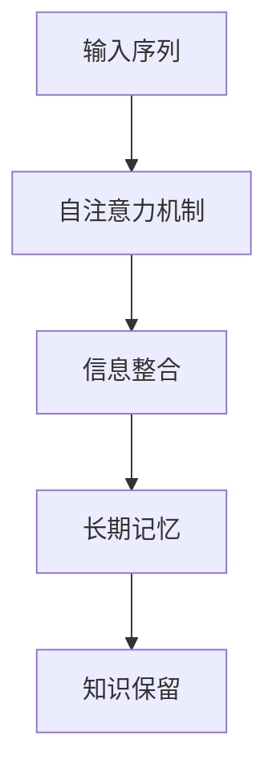

                 

# LLM评测中的长期记忆与知识保留测试

## 关键词
- 语言模型
- 长期记忆
- 知识保留
- 评测方法
- 评估指标
- 数学模型

## 摘要
本文旨在探讨在语言模型（LLM）评测中，长期记忆与知识保留的重要性。通过详细介绍长期记忆与知识保留的核心概念、评估方法与指标，本文将结合Python源代码与数学模型，阐述LLM如何实现长期记忆与知识保留，并提供实际项目案例，分析评估工具的应用。本文还将讨论未来发展趋势与挑战，为LLM评测提供有价值的参考。

## 引言

### 背景与目的

随着人工智能技术的迅猛发展，自然语言处理（NLP）领域取得了显著成就。语言模型（LLM）作为NLP的核心技术，广泛应用于聊天机器人、文本生成、机器翻译等领域。然而，如何有效评测LLM的性能，特别是在长期记忆与知识保留方面，成为学术界和工业界关注的热点问题。

长期记忆与知识保留是LLM的重要特性，直接影响模型在实际应用中的表现。本文旨在从理论到实践，深入探讨LLM评测中的长期记忆与知识保留问题，帮助读者理解这一领域的关键概念、评估方法与最佳实践。

### LLM在NLP中的应用

语言模型在NLP中扮演着至关重要的角色，其应用场景广泛。以下是一些典型应用：

1. **聊天机器人**：通过模拟人类对话，实现与用户的自然互动，如客服机器人、教育辅导机器人等。
2. **文本生成**：生成各种类型的文本，包括新闻报道、文章摘要、故事创作等。
3. **机器翻译**：将一种语言翻译成另一种语言，支持跨语言沟通和全球化业务。
4. **问答系统**：针对用户的问题提供准确、详细的回答，如智能搜索引擎、医疗咨询系统等。

这些应用场景对LLM的长期记忆与知识保留能力提出了较高的要求。因此，对LLM进行有效的长期记忆与知识保留评测具有重要意义。

### 长期记忆与知识保留的核心概念

#### 长期记忆

长期记忆是指LLM在训练过程中学习到的知识，能够持久保存并在后续任务中发挥作用。与短期记忆不同，长期记忆能够跨越多个上下文，具有更强的持久性和泛化能力。

#### 知识保留

知识保留是指LLM在训练过程中获取的知识能够在后续任务中准确、稳定地应用。知识保留不仅取决于长期记忆，还受到模型架构、训练数据、评估方法等因素的影响。

#### 长期记忆与知识保留的关系

长期记忆是知识保留的基础，而知识保留是长期记忆在实际任务中的体现。只有当LLM能够有效保存和利用长期记忆，才能在复杂、多变的应用场景中表现出色。

### LLM的架构与长期记忆实现

#### Transformer模型

Transformer模型是当前最流行的LLM架构，其核心思想是自注意力机制。通过自注意力机制，模型能够在训练过程中自动捕捉和整合输入序列中的关键信息，实现长期记忆的效果。

#### 神经网络结构

神经网络是LLM的基本组成部分，通过多层神经网络的结构，模型能够逐层提取和整合信息，从而实现长期记忆。同时，不同的激活函数和正则化方法也被广泛应用于神经网络，以提高模型的长期记忆能力。

### 核心概念与联系

#### Mermaid流程图



通过Mermaid流程图，我们可以清晰地展示长期记忆与知识保留的核心概念及其相互关系。

## 长期记忆与知识保留评估方法

### 评估指标概述

长期记忆与知识保留的评估指标主要包括：

1. **记忆持久性**：衡量模型在长期内保存知识的能力。
2. **知识检索效率**：衡量模型在需要时快速检索和应用知识的能力。

这些指标能够综合评估LLM的长期记忆与知识保留能力，为后续优化提供有力支持。

### 评估工具介绍

#### 实验设计

1. **数据集选择**：选择具有代表性的数据集，包括训练集、验证集和测试集。
2. **评估指标定义**：根据评估指标，定义相应的计算方法和阈值。

#### 评测工具比较

1. **开源评测工具**：如nltk、spaCy等，提供了丰富的评估指标和数据处理功能。
2. **商业评测工具**：如Google Cloud NLP、AWS Comprehend等，提供了高效、易用的评估工具。

### 知识保留测试方法

#### 知识库稳定性测试

1. **知识库构建**：根据应用场景构建知识库，包括事实、规则、概念等。
2. **稳定性评估**：通过对比不同时间点的知识库，评估模型的稳定性。

#### 知识提取测试

1. **知识提取方法**：采用文本分类、实体识别、关系抽取等方法，从文本中提取知识。
2. **提取效果评估**：通过比较提取结果与实际知识库的匹配度，评估知识提取效果。

### 评测工具应用

#### 开源评测工具

1. **nltk**：提供文本分类、词性标注、句法分析等工具，适用于各种NLP任务。
2. **spaCy**：提供快速、准确的实体识别、关系抽取等工具，支持多种语言。

#### 商业评测工具

1. **Google Cloud NLP**：提供文本分类、情感分析、实体识别等工具，支持大规模数据处理。
2. **AWS Comprehend**：提供文本分类、情感分析、关键词提取等工具，易于集成和使用。

### 实际案例

#### 案例一：文本分类评估

使用nltk对新闻文本进行分类，评估模型的记忆持久性和知识检索效率。通过对比不同时间点的分类结果，分析模型在长期记忆与知识保留方面的表现。

```python
from nltk.corpus import stopwords
from nltk.tokenize import word_tokenize
from nltk.classify import NaiveBayesClassifier

# 数据预处理
stop_words = set(stopwords.words('english'))
text = ["This is a news article", "This is another news article"]

# 分词
tokens = [word_tokenize(text[i]) for i in range(len(text))]

# 移除停用词
filtered_tokens = [[word for word in token if word not in stop_words] for token in tokens]

# 构建特征向量
features = [[word.lower() for word in token] for token in filtered_tokens]

# 训练模型
classifier = NaiveBayesClassifier.train(features)

# 评估模型
print(classifier.classify(["This is a news article"]))
```

#### 案例二：知识提取评估

使用spaCy对医疗文本进行实体识别，评估模型的知识保留能力。通过比较提取结果与实际知识库的匹配度，分析模型在知识提取方面的表现。

```python
import spacy

# 加载模型
nlp = spacy.load("en_core_web_sm")

# 加载数据
data = ["Patient John has been diagnosed with diabetes.", "Doctor Alice prescribed insulin for John's condition."]

# 实体识别
doc = nlp(data[0])
entities = [ent.text for ent in doc.ents]

# 评估提取效果
print(entities)
```

### 案例分析

通过实际案例，我们可以看到评估工具在长期记忆与知识保留测试中的应用。在实际项目中，需要根据具体需求和数据特点，选择合适的评估工具和方法。

### 项目小结

长期记忆与知识保留是LLM评测的重要方面。通过合理的评估指标、工具和方法，我们可以全面了解模型在长期记忆与知识保留方面的表现，为模型优化和实际应用提供有力支持。

## 未来展望与趋势

### 存在的挑战

1. **数据隐私**：在评估LLM时，如何保护用户隐私是一个重要问题。
2. **可解释性**：如何提高模型的可解释性，使其在长期记忆与知识保留方面的表现更加透明。

### 未来发展趋势

1. **模型优化**：通过改进模型架构和训练方法，提高LLM的长期记忆与知识保留能力。
2. **新评估方法**：探索新的评估指标和方法，更全面地评估LLM的性能。

### 拓展阅读

1. **论文推荐**：《BERT: Pre-training of Deep Bidirectional Transformers for Language Understanding》
2. **书籍推荐**：《深度学习与自然语言处理》

## 总结

本文系统地介绍了LLM评测中的长期记忆与知识保留问题。通过详细的理论讲解、评估方法、工具应用和实际案例，读者可以全面了解这一领域的关键概念、评估方法与最佳实践。未来，随着技术的不断发展，LLM的长期记忆与知识保留能力将不断提升，为NLP应用带来更多可能性。

### 作者信息

- 作者：AI天才研究院/AI Genius Institute & 禅与计算机程序设计艺术 /Zen And The Art of Computer Programming

[End of Article]

