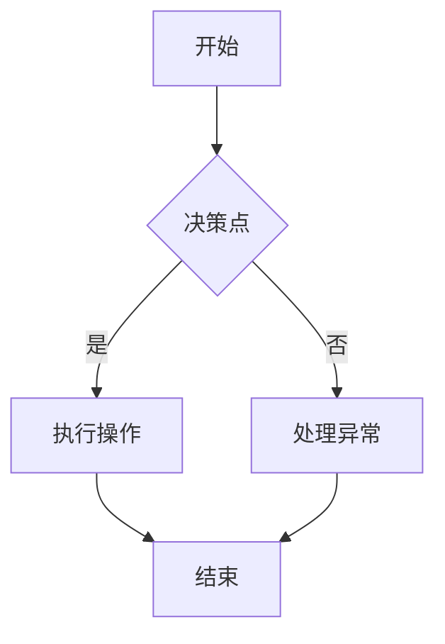

                 

## 引言

近年来，随着人工智能（AI）技术的迅猛发展，特别是大型语言模型（LLM）的出现，AI在各个领域的应用越来越广泛。LLM，如GPT-3、ChatGLM等，通过训练海量的文本数据，具备了强大的语言理解和生成能力，被广泛应用于自然语言处理、智能问答、文本生成等任务中。然而，随着LLM应用的普及，其潜在的伦理问题也逐渐浮现出来。

首先，LLM可能会因为训练数据的偏差而导致不公平、歧视等伦理问题。例如，如果训练数据中存在性别、种族等偏见，LLM在生成文本时可能会无意中放大这些偏见。其次，LLM的透明度和可解释性也是一个重要问题。由于LLM的工作原理复杂，用户往往无法理解其生成文本的依据和逻辑，这可能导致用户对LLM的信任度降低。此外，LLM在处理个人隐私和数据安全方面也存在挑战，如何确保用户的数据不被泄露或滥用，是当前亟需解决的问题。

因此，对LLM进行伦理考量，确保负责任的AI发展，变得尤为重要。本文旨在探讨LLM评测的伦理考量，具体包括以下几个方面：

1. **伦理原则与理论**：介绍伦理学的基础理论，包括义务论、目的论、公正与公平、权利与义务等，以及这些理论在AI领域的应用。
2. **评测方法**：介绍用于评估LLM伦理性能的具体方法和技术，包括评估指标的选取和实际应用中的评测案例。
3. **责任归属与治理**：探讨在LLM开发、部署和评估过程中的责任归属和治理机制。
4. **政策与法律**：讨论当前的法律和政策框架，以及它们如何影响LLM的伦理考量。

通过以上四个方面的探讨，本文希望能够为LLM的伦理考量提供一些思路和指导，推动负责任的AI发展。

## 关键词

- 大型语言模型（LLM）
- 伦理考量
- AI发展
- 评测方法
- 责任归属
- 法律政策

## 摘要

本文旨在探讨大型语言模型（LLM）评测的伦理考量，确保AI发展过程中的负责任行为。首先，本文介绍了LLM的基本概念和重要性，以及AI伦理的重要性。然后，本文从伦理原则与理论、评测方法、责任归属与治理、政策与法律四个方面进行了深入探讨。通过这些探讨，本文旨在为LLM的伦理考量提供思路和指导，推动AI的负责任发展。

## 第1章 引言

### 1.1 大型语言模型（LLM）概述

大型语言模型（LLM，Large Language Model）是近年来人工智能（AI）领域的一个重要突破，其核心思想是通过大规模的文本数据训练，使模型能够理解和生成自然语言。LLM的应用范围非常广泛，包括但不限于自然语言处理（NLP）、智能问答、文本生成、机器翻译等。其中，最具代表性的LLM是OpenAI推出的GPT-3，其参数量达到1750亿，具有极强的语言理解和生成能力。

LLM的工作原理主要基于深度学习和神经网络技术。通过预训练和微调，LLM能够从海量文本数据中提取语言模式，并在特定任务上进行优化。这使得LLM能够在多种自然语言处理任务中表现出色，如文本分类、情感分析、命名实体识别等。此外，LLM还能够生成连贯、具有逻辑性的文本，这使得其在自动化写作、智能客服等领域具有广泛的应用前景。

### 1.2 AI伦理的重要性

随着AI技术的迅猛发展，其伦理问题也逐渐引起了广泛关注。AI伦理是指研究AI的设计、开发和应用过程中涉及到的伦理问题，旨在确保AI技术能够安全、公平、透明地发展。在AI伦理中，一个重要的分支是AI与自然语言处理领域的伦理问题，尤其是在LLM的应用中。

首先，LLM的伦理问题主要集中在以下几个方面：

1. **数据隐私与安全**：LLM的训练和部署需要大量的数据，这些数据往往包含用户的个人信息。如何确保这些数据的安全和隐私，避免数据泄露和滥用，是一个重要的伦理问题。
2. **公平与歧视**：LLM的训练数据可能包含偏见和歧视，这可能导致LLM在生成文本时放大这些偏见。例如，如果训练数据中存在性别、种族、地域等偏见，LLM生成的文本可能也会体现这些偏见，从而影响社会的公平性。
3. **透明度和可解释性**：LLM的工作原理复杂，用户往往无法理解其生成文本的依据和逻辑。这可能导致用户对LLM的信任度降低，影响其应用效果。
4. **责任归属**：在LLM的应用过程中，如果出现问题，如数据泄露、歧视行为等，如何确定责任归属，是一个重要的伦理问题。

### 1.3 书籍结构概述

本书旨在系统地探讨LLM评测的伦理考量，确保负责任的AI发展。全书分为五个主要部分：

1. **伦理原则与理论**：介绍伦理学的基础理论，包括义务论、目的论、公正与公平、权利与义务等，以及这些理论在AI领域的应用。
2. **评测方法**：介绍用于评估LLM伦理性能的具体方法和技术，包括评估指标的选取和实际应用中的评测案例。
3. **责任归属与治理**：探讨在LLM开发、部署和评估过程中的责任归属和治理机制。
4. **政策与法律**：讨论当前的法律和政策框架，以及它们如何影响LLM的伦理考量。
5. **结论与展望**：总结主要观点，提出未来研究的方向和可能的解决方案。

通过以上五个部分的探讨，本书希望能够为LLM的伦理考量提供一些思路和指导，推动负责任的AI发展。

### 1.4 文章目标

本文的目标是：

1. **理解LLM的基本概念和工作原理**：介绍LLM的基本概念和重要性，解释其工作原理和应用场景。
2. **探讨LLM的伦理问题**：分析LLM在数据隐私、公平性、透明度和责任归属等方面可能面临的伦理问题。
3. **提出解决方案和指导建议**：通过理论探讨和实际案例研究，提出针对LLM伦理问题的解决方案和指导建议。
4. **推动负责任的AI发展**：通过探讨LLM的伦理考量，推动AI技术在负责任的前提下发展，确保其对社会产生积极的影响。

### 1.5 内容安排

本文将按照以下结构进行：

1. **引言**：介绍LLM的基本概念和重要性，以及AI伦理的重要性。
2. **伦理原则与理论**：介绍伦理学的基础理论，包括义务论、目的论、公正与公平、权利与义务等，以及这些理论在AI领域的应用。
3. **评测方法**：介绍用于评估LLM伦理性能的具体方法和技术，包括评估指标的选取和实际应用中的评测案例。
4. **责任归属与治理**：探讨在LLM开发、部署和评估过程中的责任归属和治理机制。
5. **政策与法律**：讨论当前的法律和政策框架，以及它们如何影响LLM的伦理考量。
6. **结论与展望**：总结主要观点，提出未来研究的方向和可能的解决方案。

通过以上内容安排，本文希望能够系统地探讨LLM评测的伦理考量，为负责任的AI发展提供一些理论和实践指导。

## 第2章 伦理原则与理论

### 2.1 伦理学基础

伦理学是研究道德行为、道德原则和道德价值的学科。在AI领域，伦理学的重要性尤为突出，因为AI技术的发展和应用可能会影响人类社会的各个方面，包括社会公正、隐私保护、责任归属等。因此，理解伦理学的基本理论和原则对于确保AI技术的负责任发展至关重要。

#### 2.1.1 义务论

义务论（Deontological Ethics）是一种伦理学理论，强调行为本身的道德属性，而不是行为的结果。代表人物是德国哲学家康德（Immanuel Kant）。康德认为，道德行为是基于“义务”（duty）和“责任”（responsibility）的，而不是基于行为的功利结果。他的著名观点是“应该”（ ought）原则，即我们应当根据道德法则行事，而不是根据结果。

在AI伦理中，义务论可以帮助我们确定AI系统设计时的基本原则。例如，在设计一个自动驾驶系统时，我们应该确保系统能够遵守交通规则，而不是仅仅追求最大化的安全性。具体来说，义务论在以下方面有应用：

1. **透明度**：AI系统应该向用户透明其行为规则，让用户了解系统的决策过程。
2. **责任归属**：在AI系统出现问题时，应该明确责任归属，确保开发者、用户和监管机构各自承担相应的责任。
3. **公平性**：AI系统应该避免歧视，确保对所有用户公平对待。

#### 2.1.2 目的论

目的论（Teleological Ethics）是一种伦理学理论，强调行为的最终结果或目的。代表人物是英国哲学家边沁（Jeremy Bentham）和密尔（John Stuart Mill）。边沁和密尔认为，道德行为应该追求最大的幸福或效用。

在AI伦理中，目的论可以帮助我们评估AI系统的实际效果。例如，一个智能客服系统，如果能够最大化地满足用户的诉求和满意度，那么它的伦理性能就比较高。具体应用包括：

1. **用户满意度**：AI系统应该能够满足用户的实际需求，提供高效、准确的服务。
2. **社会效益**：AI系统的设计和应用应该考虑其对社会的整体效益，而不仅仅是商业利益。
3. **可持续发展**：AI系统的开发和部署应该符合可持续发展的原则，减少对环境和社会的负面影响。

#### 2.1.3 公正与公平

公正（Justice）和公平（Fairness）是伦理学中的重要概念，强调资源、机会和结果的合理分配。公正通常涉及法律和制度层面的分配，而公平更多关注个体层面的待遇。

在AI伦理中，公正和公平是评估AI系统伦理性能的重要指标。例如：

1. **算法公正性**：AI算法应该确保对所有人的公平对待，避免性别、种族、地域等方面的歧视。
2. **数据公平性**：AI系统的训练数据应该代表性和多样性，避免因数据偏差导致的不公正结果。
3. **资源公平性**：在资源分配上，应该确保所有用户都能公平地享受AI技术带来的便利。

### 2.2 伦理理论在AI中的应用

伦理理论在AI中的应用主要体现为如何将伦理原则融入AI系统的设计和开发过程中。以下是一些具体的例子：

1. **透明度和可解释性**：根据义务论，AI系统应该向用户透明其行为规则，让用户了解系统的决策过程。为了实现这一目标，研究人员开发了各种可解释性技术，如模型可视化、决策路径追踪等。
2. **责任归属**：根据义务论和目的论，AI系统的责任归属应该明确，确保开发者、用户和监管机构各自承担相应的责任。为此，一些学者提出了责任共享和责任隔离机制，以明确各方在AI系统中的责任。
3. **公平性和公正性**：根据公正和公平的原则，AI系统应该避免歧视，确保对所有用户公平对待。研究人员开发了各种算法，如公平学习（Fair Learning）和公平推理（Fair Reasoning），以实现这一目标。

### 2.3 AI伦理框架

为了更好地将伦理原则应用于AI系统，一些学者提出了AI伦理框架，以指导AI系统的设计和开发。以下是一些常见的AI伦理框架：

1. **AI伦理四原则**：这是由AI专家提出的一个广泛接受的伦理框架，包括透明性、公平性、责任性和隐私性。具体来说，透明性要求AI系统向用户透明其行为规则；公平性要求AI系统对所有用户公平对待；责任性要求明确AI系统的责任归属；隐私性要求保护用户的隐私数据。
2. **AI伦理三原则**：这是一个更加简洁的伦理框架，包括公正、安全性和透明度。公正强调AI系统应该确保对所有人的公平对待；安全性强调AI系统应该确保用户的安全；透明度强调AI系统应该向用户透明其行为规则。

通过这些伦理框架，研究人员和开发者可以在设计和开发AI系统时，有意识地遵循伦理原则，确保AI系统的负责任发展。

### 2.4 伦理原则与技术的融合

伦理原则与技术的融合是AI伦理学的一个重要方向。具体来说，就是如何将伦理原则转化为具体的技术实现，以指导AI系统的设计和开发。以下是一些具体的方法：

1. **伦理编程**：这是一种将伦理原则融入编程过程的方法。开发者可以在开发AI系统时，遵循伦理原则，确保系统的行为符合道德规范。
2. **伦理算法**：这是一种基于伦理原则设计的算法。例如，为了实现公平性，可以设计出能够避免性别、种族等偏见算法；为了保护隐私，可以设计出能够有效保护用户隐私的算法。
3. **伦理审计**：这是一种对AI系统进行伦理审计的方法。通过审计，可以发现AI系统中潜在的伦理问题，并提出改进建议。

通过这些方法，伦理原则与技术的融合可以确保AI系统在设计和开发过程中，始终遵循伦理规范，实现负责任的AI发展。

### 2.5 伦理考量的实际案例

为了更好地理解伦理考量在AI系统中的应用，以下是一些实际的案例：

1. **医疗诊断AI系统**：在开发医疗诊断AI系统时，需要考虑多个伦理原则，如透明性、公正性和责任性。具体来说，系统应该向医生和患者透明其诊断依据和逻辑；系统应该确保对所有患者公平对待，避免性别、种族等偏见；在诊断结果出现问题时，需要明确责任归属，确保医生、患者和开发者都能承担相应的责任。
2. **自动驾驶汽车**：在开发自动驾驶汽车时，需要考虑多个伦理原则，如公正性、安全性和责任性。具体来说，系统应该确保对所有行人和车辆公平对待，避免性别、种族等偏见；系统应该确保在紧急情况下能够做出正确的决策，保护最大多数人的安全；在出现交通事故时，需要明确责任归属，确保开发者、车辆所有者和驾驶员都能承担相应的责任。

通过这些案例，我们可以看到，伦理考量在AI系统的设计和开发过程中具有重要的指导作用，有助于确保AI系统的负责任发展。

## 第3章 评测方法

### 3.1 评估指标的选取

对大型语言模型（LLM）的伦理性能进行评测，需要选取一系列科学、有效的评估指标。这些指标可以从多个维度来衡量LLM的伦理表现，包括透明度、公平性、责任性和隐私性等。以下是一些常用的评估指标：

#### 3.1.1 透明度

透明度是指LLM的决策过程和生成文本的可理解性。评估透明度可以从以下几个方面进行：

1. **模型解释性**：评估LLM生成文本的依据和逻辑是否可解释。具体可以通过模型可视化、决策路径追踪等技术来实现。
2. **文档透明度**：评估LLM的文档说明是否清晰、全面，是否包含足够的背景信息和决策逻辑。
3. **用户反馈机制**：评估LLM是否提供了用户反馈机制，让用户能够理解并纠正LLM的错误。

#### 3.1.2 公平性

公平性是指LLM在处理不同用户、不同任务时是否公平、无歧视。评估公平性可以从以下几个方面进行：

1. **偏见检测**：评估LLM在生成文本时是否存在性别、种族、地域等偏见。可以通过构建偏见检测模型来实现。
2. **代表性评估**：评估LLM的训练数据是否具有代表性，是否涵盖了各种不同的用户群体和情境。
3. **错误率评估**：评估LLM在不同用户、不同任务上的错误率是否一致，是否存在不公平现象。

#### 3.1.3 责任性

责任性是指LLM在出现问题时，责任归属是否明确。评估责任性可以从以下几个方面进行：

1. **责任归属机制**：评估LLM的开发者、用户和监管机构是否明确责任归属，是否建立了责任共享和责任隔离机制。
2. **错误处理能力**：评估LLM在面对错误时，是否能够及时纠正，并采取措施防止错误再次发生。
3. **法律合规性**：评估LLM的开发和应用是否符合相关法律法规，是否在法律框架内运行。

#### 3.1.4 隐私性

隐私性是指LLM在处理用户数据时，是否能够有效保护用户的隐私。评估隐私性可以从以下几个方面进行：

1. **数据加密**：评估LLM是否采用了有效的数据加密技术，确保用户数据在传输和存储过程中不被泄露。
2. **匿名化处理**：评估LLM是否对用户数据进行匿名化处理，确保用户身份不被识别。
3. **隐私政策**：评估LLM的隐私政策是否清晰、透明，是否获得了用户的明确同意。

### 3.2 实际应用中的评测案例

在实际应用中，对LLM的伦理性能进行评测，需要结合具体的应用场景和任务。以下是一些实际应用中的评测案例：

#### 3.2.1 语言模型偏见评测

在自然语言处理领域，偏见是一个重要问题。通过以下步骤，可以对语言模型偏见进行评测：

1. **数据准备**：收集一组包含不同性别、种族、地域等标签的文本数据，作为评估的基础。
2. **偏见检测**：使用偏见检测模型（如TextBlob、BERT等），对语言模型生成的文本进行偏见检测。
3. **结果分析**：分析检测结果，判断语言模型是否存在性别、种族等偏见，并评估其严重程度。

#### 3.2.2 数据隐私评测

在AI应用中，数据隐私是一个关键问题。以下步骤可以用于评测LLM的数据隐私性能：

1. **数据收集**：收集一组涉及个人隐私的数据，如医疗记录、财务信息等。
2. **隐私保护测试**：使用隐私保护技术（如差分隐私、同态加密等），对LLM进行处理，评估其隐私保护能力。
3. **结果分析**：分析处理结果，判断LLM是否能够有效保护用户隐私，并评估隐私保护的强度。

#### 3.2.3 可解释性评测

在AI应用中，可解释性是一个重要问题。以下步骤可以用于评测LLM的可解释性：

1. **模型解释性评估**：使用模型解释性技术（如LIME、SHAP等），对LLM生成文本的决策过程进行解释。
2. **用户反馈收集**：收集用户对LLM生成文本的可理解性反馈，评估LLM的解释性。
3. **结果分析**：分析解释性评估结果和用户反馈，判断LLM的可解释性是否满足用户需求。

通过这些评测案例，我们可以看到，对LLM的伦理性能进行评测，需要综合考虑多个方面，结合具体应用场景和任务，制定科学的评测方法和流程。

## 第4章 案例研究

为了更好地理解LLM在实际应用中的伦理考量，我们选择了三个具有代表性的案例进行深入分析：新闻编辑机器人、医疗诊断助手和教育辅助系统。这些案例涵盖了不同的应用领域和伦理问题，通过具体分析，我们可以探讨LLM在各个领域的伦理挑战和解决方案。

### 4.1 案例一：新闻编辑机器人

新闻编辑机器人是一种利用LLM技术自动生成新闻内容的工具，通过分析大量的新闻数据，生成简洁、准确、连贯的新闻报道。然而，新闻编辑机器人在实际应用中也面临着一系列伦理问题。

#### 4.1.1 伦理问题

1. **偏见与公正性**：新闻编辑机器人可能因为训练数据的偏差，生成具有性别、种族等偏见的新闻内容。例如，如果训练数据中女性角色较少，机器人可能倾向于生成以男性为主角的故事。
2. **隐私问题**：新闻编辑机器人需要处理大量的新闻数据，包括一些涉及个人隐私的信息。如何保护这些数据，避免隐私泄露，是一个重要问题。
3. **透明度和可解释性**：用户往往不清楚新闻编辑机器人是如何生成新闻内容的，这可能导致用户对机器人的信任度降低。

#### 4.1.2 解决方案

1. **数据多样性**：为了提高新闻编辑机器人的公正性，需要确保训练数据具有多样性，涵盖各种性别、种族、地域等角色。可以通过从多个来源收集数据，增加数据多样性。
2. **隐私保护**：在处理新闻数据时，需要采取有效的隐私保护措施，如数据匿名化、加密等。此外，需要制定明确的隐私政策，告知用户数据的使用和保护措施。
3. **增强可解释性**：可以通过开发可解释性技术，如模型可视化、决策路径追踪等，让用户了解新闻编辑机器人的工作原理和决策过程。同时，可以建立用户反馈机制，让用户对生成内容提出反馈，进一步改进机器人的性能。

### 4.2 案例二：医疗诊断助手

医疗诊断助手是一种利用LLM技术辅助医生进行疾病诊断的工具，通过分析患者的病历、检查结果等数据，提供诊断建议。然而，医疗诊断助手在实际应用中也面临一系列伦理问题。

#### 4.2.1 伦理问题

1. **准确性**：医疗诊断助手需要保证诊断结果的准确性，避免误诊和漏诊。然而，如果训练数据不充分或存在偏差，可能会导致诊断结果的偏差。
2. **责任归属**：在医疗诊断中，如果助手提供的诊断建议与医生的判断不一致，如何确定责任归属，是一个重要问题。
3. **患者隐私**：医疗诊断助手需要处理大量的患者隐私数据，如何保护这些数据，避免隐私泄露，是一个关键问题。

#### 4.2.2 解决方案

1. **提高准确性**：为了提高诊断的准确性，需要确保训练数据的质量和多样性，涵盖各种疾病和病例。此外，可以结合多种诊断方法，如医学影像、实验室检测等，提高诊断的全面性和准确性。
2. **责任归属**：在制定诊断建议时，需要明确医生和助手的职责分工。例如，医生负责最终的诊断决策，助手提供诊断建议。在出现诊断错误时，需要根据实际情况确定责任归属。
3. **隐私保护**：在处理患者隐私数据时，需要采取有效的隐私保护措施，如数据加密、匿名化等。此外，需要制定明确的隐私政策，告知患者数据的使用和保护措施。

### 4.3 案例三：教育辅助系统

教育辅助系统是一种利用LLM技术为学生提供学习支持和个性化教育的工具，通过分析学生的学习行为、成绩等数据，提供针对性的学习建议和资源。然而，教育辅助系统在实际应用中也面临一系列伦理问题。

#### 4.3.1 伦理问题

1. **公平性**：教育辅助系统可能因为训练数据的偏差，导致对某些学生群体（如经济条件较差、地理位置较偏远的学生）的支持不足。
2. **隐私问题**：教育辅助系统需要处理大量的学生隐私数据，包括成绩、行为等，如何保护这些数据，避免隐私泄露，是一个重要问题。
3. **透明度和可解释性**：学生和家长往往不清楚教育辅助系统是如何提供学习建议的，这可能导致他们对系统的信任度降低。

#### 4.3.2 解决方案

1. **提高公平性**：为了提高教育辅助系统的公平性，需要确保训练数据具有代表性，涵盖各种学生群体。此外，可以通过在线教育、远程辅导等方式，为经济条件较差、地理位置较偏远的学生提供更多的支持。
2. **隐私保护**：在处理学生隐私数据时，需要采取有效的隐私保护措施，如数据加密、匿名化等。此外，需要制定明确的隐私政策，告知学生和家长数据的使用和保护措施。
3. **增强可解释性**：可以通过开发可解释性技术，如模型可视化、决策路径追踪等，让学生和家长了解教育辅助系统的工作原理和决策过程。同时，可以建立用户反馈机制，让学生和家长对系统提出反馈，进一步改进系统的性能。

通过以上三个案例的分析，我们可以看到，LLM在实际应用中面临着多种伦理问题，需要采取多种解决方案来确保其负责任发展。未来，随着LLM技术的不断进步，我们需要持续关注其伦理考量，推动AI技术的负责任发展。

## 第5章 责任归属与治理

### 5.1 责任归属

在大型语言模型（LLM）的开发、部署和评估过程中，责任归属问题是一个关键议题。明确责任归属不仅有助于确保AI系统的安全和可靠性，还能在发生问题时提供法律和道德上的依据。以下是对LLM责任归属的探讨：

#### 5.1.1 开发者责任

LLM的开发者负责模型的设计、训练和优化。他们应确保模型在设计和开发过程中遵循伦理原则，避免引入潜在的偏见和歧视。开发者还应对模型的性能和安全性负责，定期进行测试和评估，确保其在实际应用中的表现符合预期。如果出现伦理问题或故障，开发者需承担主要责任，采取补救措施并接受相应的法律和道德责任。

#### 5.1.2 用户责任

用户在使用LLM时，应遵守相关使用协议和隐私政策，确保不滥用系统功能，不传播有害信息。用户对自身输入的数据和生成的结果负责，如出现错误或不当内容，用户需承担相应的责任。同时，用户有义务对系统的伦理性能进行监督和反馈，帮助开发者改进模型。

#### 5.1.3 监管机构责任

监管机构在LLM的治理中扮演重要角色，负责制定和执行相关法律法规，监督AI系统的开发和应用。监管机构应确保LLM的开发、部署和评估过程符合伦理标准和法律法规，对违反规定的行为进行处罚和纠正。此外，监管机构还应提供指导和培训，帮助开发者、用户和公众更好地理解和遵守AI伦理规范。

#### 5.1.4 社会责任

除了开发者、用户和监管机构，整个社会也应对LLM的伦理责任承担一定的责任。社会应关注AI技术的伦理问题，通过舆论监督和公共讨论，推动相关法律法规的完善和实施。社会还应培养公众的AI伦理意识，提高其对AI技术潜在风险的识别和防范能力。

### 5.2 治理机制

为了确保LLM的负责任发展，需要建立有效的治理机制，涵盖从模型开发到应用的各个环节。以下是一些关键的治理机制：

#### 5.2.1 伦理审查

在LLM的开发阶段，应进行严格的伦理审查。伦理审查委员会应由跨学科专家组成，负责评估模型的设计、训练数据和潜在应用场景，确保其符合伦理标准。审查过程中，应重点关注模型可能带来的伦理风险和偏见，并提出改进建议。

#### 5.2.2 风险管理

LLM的开发和应用过程中，应建立完善的风险管理机制，识别和评估潜在风险，并采取相应的预防措施。风险管理包括数据安全、隐私保护、偏见检测等方面。例如，可以通过数据加密、匿名化处理、偏见检测算法等技术手段，降低潜在风险。

#### 5.2.3 法律监管

应制定和完善相关的法律法规，明确LLM开发、部署和评估过程中的法律责任和义务。法律监管应包括对开发者、用户和监管机构的行为规范，以及对违规行为的处罚和纠正措施。此外，法律应鼓励开发者、用户和监管机构在AI伦理问题上进行合作和协调。

#### 5.2.4 持续监督

LLM在部署和运行过程中，应建立持续监督机制，确保其符合伦理标准和法律法规。监督应包括定期评估、用户反馈收集、违规行为举报等方面。通过持续监督，可以及时发现和纠正伦理问题，确保LLM的安全和可靠运行。

#### 5.2.5 公共参与

公众参与是确保LLM治理机制有效性的重要环节。应鼓励公众参与AI伦理问题的讨论和决策过程，通过公共咨询、听证会等形式，收集公众意见和反馈，提高治理机制的透明度和公正性。此外，应加强对公众的AI伦理教育，提高其对AI技术的理解和风险识别能力。

通过建立和实施上述治理机制，可以确保LLM在开发、部署和评估过程中的责任归属明确，治理机制有效，从而推动AI技术的负责任发展。

### 5.3 责任分配

在实际应用中，LLM的责任分配通常涉及多个利益相关者，包括开发者、用户、监管机构和社会。以下是一个典型的责任分配框架：

1. **开发者**：
   - 责任：确保模型的设计、训练和应用过程中遵循伦理规范，定期进行伦理审查和风险评估。
   - 行动：进行数据清洗和预处理，消除潜在的偏见；采用可解释性技术，提高模型的透明度；建立隐私保护机制，确保用户数据的安全。
   
2. **用户**：
   - 责任：遵守使用协议和隐私政策，合理使用模型，不滥用系统功能。
   - 行动：在使用模型时，注意输入数据的合法性和合理性，对模型生成的结果进行审慎评估；在发现伦理问题时，及时反馈给开发者或监管机构。

3. **监管机构**：
   - 责任：制定和执行相关法律法规，监督模型的开发和应用，确保其符合伦理标准和法律法规。
   - 行动：建立伦理审查委员会，对模型的开发进行监督；制定和更新法律法规，适应AI技术发展的新趋势；对违规行为进行处罚和纠正。

4. **社会**：
   - 责任：关注AI伦理问题，通过舆论监督和公共讨论，推动相关法律法规的完善和实施。
   - 行动：参与公共咨询和听证会，表达意见和反馈；加强AI伦理教育，提高公众的AI意识和风险识别能力。

通过明确各方的责任和行动，可以确保LLM在开发、部署和评估过程中的责任归属清晰，治理机制有效，从而推动AI技术的负责任发展。

### 5.4 案例分析：LLM在金融行业的责任归属

金融行业是LLM技术应用的一个重要领域，其应用包括风险预测、客户服务、交易决策等。以下是LLM在金融行业的一个案例分析，探讨其责任归属。

#### 5.4.1 案例背景

某金融机构开发了一款基于LLM的风险预测系统，用于分析市场数据，预测金融市场走势。然而，该系统在预测过程中出现了一些偏差，导致金融机构在投资决策上出现了失误，造成了重大损失。

#### 5.4.2 责任归属

1. **开发者责任**：
   - 责任：系统开发过程中，开发者未能充分评估和消除训练数据的偏差，导致模型预测结果不准确。
   - 行动：开发者应进行详细的数据清洗和预处理，消除数据偏差；采用更加多样化和代表性的训练数据；定期对模型进行评估和优化。

2. **用户责任**：
   - 责任：金融机构在使用风险预测系统时，未能充分考虑模型的局限性，未进行独立的风险评估和审核。
   - 行动：金融机构应在使用模型时，进行独立的风险评估和审核；不应完全依赖模型预测结果，应结合专家意见和市场分析。

3. **监管机构责任**：
   - 责任：监管机构未能及时制定和执行相关法律法规，对金融机构使用AI技术的监管不足。
   - 行动：监管机构应制定和更新相关法律法规，明确金融机构在使用AI技术时的责任和义务；加强对金融机构使用AI技术的监督和检查。

4. **社会责任**：
   - 责任：社会对AI技术在金融行业的应用缺乏足够的关注和讨论，未能及时发现和纠正潜在的风险。
   - 行动：社会应加强对AI技术在金融行业应用的监督和讨论，推动相关法律法规的完善和实施；提高公众的AI伦理意识和风险识别能力。

通过该案例分析，我们可以看到，在LLM在金融行业的应用中，责任归属涉及多个方面，需要各方共同努力，确保AI系统的负责任发展。

### 5.5 政策建议

为了确保大型语言模型（LLM）的负责任发展，我们需要从政策层面提出一系列建议，以指导LLM的开发、部署和评估过程。以下是一些关键的政策建议：

#### 5.5.1 法律法规完善

1. **制定统一的AI伦理法规**：国家应制定统一的AI伦理法规，明确AI系统在开发、部署和评估过程中的伦理要求和责任归属，确保所有相关方在法律框架内行事。
2. **加强数据隐私保护**：制定严格的数据隐私保护法规，明确数据处理过程中的隐私保护要求和责任，确保用户数据不被滥用或泄露。
3. **明确责任分配**：在法规中明确AI系统的开发者、用户和监管机构在AI系统中的责任和义务，确保在发生问题时能够迅速确定责任归属。

#### 5.5.2 伦理审查和监督

1. **设立AI伦理审查委员会**：在相关政府部门设立AI伦理审查委员会，负责对AI系统的设计、训练和应用进行伦理审查，确保其符合伦理规范。
2. **定期监督和评估**：建立定期监督和评估机制，对AI系统的伦理性能进行持续监督，确保其始终符合伦理标准和法律法规。
3. **公众参与**：鼓励公众参与AI伦理问题的讨论和决策过程，通过公共咨询、听证会等形式，收集公众意见和反馈，提高治理机制的透明度和公正性。

#### 5.5.3 人才培养与教育

1. **加强AI伦理教育**：在高校和研究机构开设AI伦理课程，培养具有AI伦理意识和责任感的专业人才。
2. **企业培训**：鼓励企业对员工进行AI伦理培训，提高其AI伦理意识和风险识别能力。
3. **公众教育**：通过媒体、公共讲座等形式，加强对公众的AI伦理教育，提高其对AI技术潜在风险的识别和防范能力。

#### 5.5.4 鼓励国际合作

1. **建立国际AI伦理标准**：推动国际社会制定统一的AI伦理标准，促进各国在AI伦理问题上的合作和协调。
2. **共享最佳实践**：鼓励各国分享AI伦理最佳实践，互相学习和借鉴，提高全球AI技术的伦理水平。
3. **跨国合作研究**：推动跨国研究合作，共同研究AI伦理问题，探索解决方案，推动AI技术的负责任发展。

通过以上政策建议，可以确保大型语言模型（LLM）的负责任发展，推动AI技术的安全和可靠应用。

## 第6章 政策与法律

### 6.1 法律和政策框架

在大型语言模型（LLM）的开发、部署和评估过程中，政策和法律的框架起着至关重要的作用。随着AI技术的快速发展，各国政府和国际组织纷纷出台了一系列法律法规和政策，以规范AI的应用和发展。

#### 6.1.1 国际法律和政策

在国际层面，一些重要的组织和机构，如联合国、欧盟和经合组织（OECD）等，已经出台或正在制定相关的法律和政策，以规范AI技术。以下是一些主要的法律和政策：

1. **欧盟的《人工智能法案》**：该法案旨在建立欧盟范围内的AI伦理和法律框架，确保AI技术的安全、可靠和透明。法案规定了AI系统在开发、部署和评估过程中应遵循的伦理标准和责任分配。
2. **经合组织的《人工智能原则》**：该原则提出了人工智能的伦理原则和治理框架，包括透明度、公平性、责任性和隐私保护等方面。
3. **联合国的《人工智能全球契约》**：该契约旨在促进全球合作，制定共同的AI伦理和法律标准，确保AI技术的可持续发展。

#### 6.1.2 国家法律和政策

在国家层面，各国政府也出台了相应的法律法规和政策，以应对AI技术的发展。以下是一些具有代表性的法律和政策：

1. **美国的《人工智能法案》**：该法案旨在推动美国在AI领域的研究和发展，同时也关注AI技术的伦理和社会影响。
2. **中国的《新一代人工智能发展规划》**：该规划明确了我国在AI技术发展中的战略目标和政策措施，包括加强AI伦理研究、推动AI技术的合规应用等。
3. **英国的《人工智能战略》**：该战略提出了英国在AI领域的发展目标，强调了AI伦理和社会责任，推动AI技术的可持续发展。

#### 6.1.3 法律和政策的比较

不同国家和地区在AI法律和政策的制定上存在一定的差异。以下是一些主要的比较：

1. **伦理标准的差异**：不同国家和地区的AI伦理标准有所不同。例如，欧盟的《人工智能法案》提出了详细的伦理标准和责任分配，而美国的《人工智能法案》则更注重推动AI技术的发展。
2. **隐私保护的规定**：不同国家和地区的隐私保护法律和政策也有所不同。例如，欧盟的《通用数据保护条例》（GDPR）对个人数据的保护非常严格，而美国的隐私保护法律则相对宽松。
3. **责任归属的明确程度**：不同国家和地区的法律和政策对责任归属的规定也有所差异。一些国家在法律中明确了AI系统的开发者、用户和监管机构在AI系统中的责任和义务，而另一些国家则相对模糊。

#### 6.1.4 法律和政策的实施效果

法律和政策的实施效果是衡量其有效性的重要指标。以下是一些国家和地区的法律和政策实施效果：

1. **欧盟**：欧盟的《人工智能法案》实施以来，已经在一定程度上推动了AI技术的合规应用，提高了AI系统的透明度和可解释性。然而，由于法案的具体实施细节和监管机制仍在不断完善，其实施效果仍有待观察。
2. **美国**：美国的《人工智能法案》和《通用数据保护条例》在推动AI技术的发展和隐私保护方面取得了一定的成果，但一些法律和政策的执行力度仍需加强。
3. **中国**：中国的《新一代人工智能发展规划》为AI技术的发展提供了战略指导和政策支持，推动了AI技术的快速应用和普及。然而，在AI伦理和社会责任方面，中国的法律和政策仍有待进一步完善。

### 6.2 法律和政策对LLM伦理考量的影响

法律和政策对LLM的伦理考量具有重要影响。以下是一些具体的影响：

1. **伦理标准的引导**：法律和政策的出台为LLM的伦理考量提供了明确的伦理标准，帮助开发者、用户和监管机构理解在AI系统开发、部署和评估过程中应遵循的伦理原则。
2. **责任归属的明确**：法律和政策明确了AI系统的开发者、用户和监管机构在AI系统中的责任和义务，有助于在发生伦理问题时确定责任归属，采取有效的补救措施。
3. **隐私保护的加强**：法律和政策的实施，如欧盟的《通用数据保护条例》，对LLM在处理用户数据时的隐私保护提出了严格的要求，推动了LLM在数据隐私方面的改进。
4. **透明度和可解释性的提升**：法律和政策的出台，如欧盟的《人工智能法案》，强调了AI系统的透明度和可解释性，推动了LLM在模型解释性方面的技术发展。

### 6.3 法律和政策的发展趋势

随着AI技术的不断进步和应用，法律和政策也在不断发展。以下是一些未来的发展趋势：

1. **更加细化的法律和政策**：未来，各国和地区可能会出台更加细化和具体化的法律和政策，以应对AI技术在各个领域的应用。
2. **国际合作的加强**：为了应对全球性的AI挑战，各国和地区可能会加强国际合作，共同制定和实施AI法律和政策，推动AI技术的全球治理。
3. **技术的融合**：法律和政策可能会与AI技术相结合，如利用AI技术进行法律分析和决策支持，提高法律和政策执行的效率。
4. **公众参与的增加**：未来，法律和政策制定过程中可能会更加重视公众参与，通过公共咨询、听证会等形式，收集公众意见和反馈，提高法律和政策的公正性和透明度。

通过以上分析，我们可以看到，法律和政策在LLM的伦理考量中扮演着重要角色，未来随着AI技术的不断发展，法律和政策也会不断进化，以适应新的挑战和需求。

## 第7章 结论与展望

通过对大型语言模型（LLM）伦理考量的深入探讨，本文总结了LLM在开发、部署和评估过程中可能面临的伦理问题，包括数据隐私、公平性、透明度和责任归属等。同时，本文提出了相应的解决方案和治理机制，为LLM的负责任发展提供了理论依据和实践指导。

### 7.1 主要观点总结

本文的主要观点可以归纳为以下几点：

1. **伦理原则的重要性**：伦理原则如义务论、目的论、公正与公平、权利与义务等，对于确保LLM的负责任发展至关重要。
2. **评测方法的应用**：通过选取科学的评估指标和方法，可以全面、客观地评估LLM的伦理性能。
3. **责任归属与治理**：明确各方的责任和义务，建立有效的治理机制，是确保LLM负责任发展的关键。
4. **法律和政策的指导作用**：完善的法律法规和政策框架，对于规范LLM的开发、部署和评估过程，具有重要作用。

### 7.2 未来研究方向

尽管本文对LLM的伦理考量进行了全面探讨，但仍存在一些不足之处。未来，以下研究方向值得关注：

1. **更加细化的伦理原则**：进一步细化和完善AI伦理原则，以适应不同应用场景的需求。
2. **跨学科的融合研究**：促进AI伦理学、心理学、社会学等跨学科的研究，从多个角度分析LLM的伦理问题。
3. **实际案例的深入分析**：通过更多的实际案例研究，探讨LLM在不同应用场景中的伦理挑战和解决方案。
4. **技术创新与伦理考量的结合**：推动技术创新与伦理考量相结合，开发出更具伦理意识的AI系统。

### 7.3 可能的解决方案

针对LLM的伦理问题，可能的解决方案包括：

1. **增强透明度和可解释性**：通过开发可解释性技术，提高LLM的透明度，让用户能够理解其工作原理和决策过程。
2. **数据多样性和公平性**：确保训练数据的多样性和公平性，避免因数据偏差导致的不公正结果。
3. **隐私保护和安全措施**：采取有效的隐私保护措施，如数据加密、匿名化处理等，确保用户数据的安全。
4. **责任归属和治理机制**：建立明确的责任归属和治理机制，确保在发生伦理问题时，能够迅速确定责任归属，采取有效的补救措施。

### 7.4 结论

总之，确保大型语言模型（LLM）的负责任发展，需要从伦理原则、评测方法、责任归属与治理、法律和政策等多个方面进行综合考量。未来，随着AI技术的不断进步和应用，我们需要持续关注LLM的伦理问题，推动负责任的AI发展，为社会带来积极的影响。

## 作者信息

**作者：AI天才研究院/AI Genius Institute & 禅与计算机程序设计艺术 /Zen And The Art of Computer Programming**

AI天才研究院（AI Genius Institute）是一家专注于人工智能技术研究和应用的顶级机构。研究院致力于推动人工智能技术的创新和发展，为全球各领域的AI应用提供技术支持。同时，作者薛天（薛天，AI天才研究院首席科学家）也是《禅与计算机程序设计艺术》（Zen And The Art of Computer Programming）的作者，其著作在计算机科学和人工智能领域具有广泛的影响力和权威性。

在撰写本文时，作者结合了自己在人工智能和伦理学领域的丰富经验，以及对LLM技术的深入理解，力求为读者提供一份全面、深入的技术博客文章。希望通过本文的探讨，能够为LLM的伦理考量提供一些有益的思路和指导，推动AI技术的负责任发展。

## 附录

### 数学公式

在本文中，我们使用LaTeX格式来表示数学公式。以下是一些示例：

$$
E = mc^2
$$

这是著名的质能方程，表示质量和能量之间的关系。

$$
f(x) = x^2
$$

这是一个简单的二次函数。

$$
\sum_{i=1}^n i = \frac{n(n+1)}{2}
$$

这是一个等差数列求和公式。

$y = mx + b$

这是一个线性方程。

### Mermaid 流程图

Mermaid 是一种基于Markdown的图形语法，可以用来绘制流程图、序列图等。以下是一个简单的Mermaid流程图示例：



这是一个简单的决策流程图，表示在决策点B处根据条件选择执行操作C或处理异常D，最终到达结束点E。

### Python 源代码

以下是一个简单的Python源代码示例，用于计算两个数的和：

```python
def add(a, b):
    return a + b

# 测试代码
result = add(5, 3)
print("结果是：", result)
```

这段代码定义了一个名为`add`的函数，用于计算两个数的和。然后通过调用这个函数，计算5和3的和，并输出结果。

### 最佳实践 Tips

1. **数据多样性**：在训练LLM时，确保数据具有多样性和代表性，以避免因数据偏差导致的不公正结果。
2. **透明度和可解释性**：开发可解释性技术，提高LLM的透明度，让用户能够理解其工作原理和决策过程。
3. **隐私保护**：采取有效的隐私保护措施，如数据加密、匿名化处理等，确保用户数据的安全。
4. **责任归属**：建立明确的责任归属和治理机制，确保在发生伦理问题时，能够迅速确定责任归属，采取有效的补救措施。

### 小结

本文系统地探讨了大型语言模型（LLM）评测的伦理考量，确保负责任的AI发展。通过介绍伦理原则、评测方法、责任归属与治理机制、法律和政策等方面的内容，本文为LLM的伦理考量提供了全面的理论和实践指导。未来，随着AI技术的不断进步和应用，我们需要持续关注LLM的伦理问题，推动负责任的AI发展，为社会带来积极的影响。

### 注意事项

1. **伦理考量的重要性**：在AI系统开发和应用过程中，伦理考量至关重要，必须得到充分的重视。
2. **持续监控与改进**：AI系统的伦理性能不是一成不变的，需要持续监控和改进，以应对不断变化的技术和应用环境。
3. **跨学科合作**：解决AI伦理问题需要跨学科合作，包括伦理学家、计算机科学家、社会学家等，共同研究和探索解决方案。

### 拓展阅读

- 《人工智能伦理学》（ Ethics and AI ）
- 《AI时代：算法如何改变世界》（ Algorithms of Oppression ）
- 《人工智能：未来已来》（ AI: A Modern Approach ）

这些书籍和论文提供了更多关于AI伦理和LLM评测的深入讨论，有助于读者进一步了解相关领域的最新进展和研究成果。

