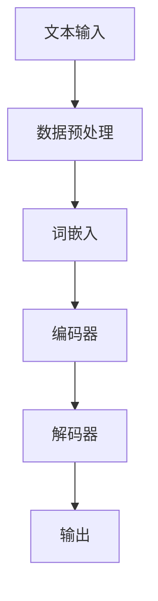

                 

# LLM评测的偏见检测：确保公平性和道德性

## 关键词
- 偏见检测
- 大型语言模型
- 公平性
- 道德性
- 模型评测
- 数据集多样性
- 可解释性

## 摘要
本文探讨了大型语言模型（LLM）评测中偏见检测的重要性，以及如何确保评测过程的公平性和道德性。首先，我们介绍了LLM的基本概念和架构，随后详细阐述了偏见检测的核心方法和挑战。接着，通过实际案例展示了偏见检测的实践过程。最后，我们提出了确保公平性和道德性的策略，包括数据集多样性、模型透明性和偏见缓解策略，以及法律和伦理考量。本文旨在为LLM评测提供系统性指导，促进技术进步和社会公平。

## 第1章 引言与背景

### 1.1 引言

随着人工智能技术的发展，大型语言模型（LLM）如GPT-3和BERT等，已经在多个领域取得了显著的应用成果。这些模型在自然语言处理、问答系统、机器翻译等方面展现了强大的能力。然而，LLM的广泛应用也带来了偏见检测的需求。偏见检测旨在识别和减少模型中的偏见，以确保其在不同群体中的公平性和道德性。

### 1.2 为什么要进行偏见检测

#### 1.2.1 偏见对社会的负面影响

模型偏见可能导致不公平的决策，加剧社会不平等。例如，招聘广告中的性别偏见可能会歧视女性候选人，社交媒体内容中的种族偏见可能会加剧社会冲突。因此，偏见检测对于维护社会公平至关重要。

#### 1.2.2 偏见检测的重要性

偏见检测有助于提高模型的可靠性，增强公众对人工智能技术的信任。此外，通过检测和缓解偏见，我们可以更好地理解模型的行为，从而促进人工智能技术的持续发展。

## 第2章 大型语言模型（LLM）概述

### 2.1 LLM的基本概念

#### 2.1.1 LLM的定义

大型语言模型（LLM）是指使用大量文本数据进行训练，以生成文本、回答问题、进行对话等的深度学习模型。它们通常基于神经网络架构，如Transformer。

#### 2.1.2 LLM的关键特性

LLM具有强大的文本生成能力、灵活的适应性和较高的准确度。这些特性使其在自然语言处理任务中具有广泛的应用潜力。

### 2.2 LLM的技术架构

#### 2.2.1 数据预处理

数据预处理包括文本清洗、分词、去停用词等步骤。这些步骤有助于提高模型的训练效果。

#### 2.2.2 模型架构（Mermaid流程图）

以下是一个简化的Mermaid流程图，描述了LLM的基本架构：



### 2.3 LLM的训练与优化

#### 2.3.1 训练数据的选择与处理

训练数据的选择和处理对LLM的性能至关重要。理想的数据集应具有多样性和代表性，以确保模型在不同场景下的泛化能力。

#### 2.3.2 优化算法的原理与实现（伪代码）

以下是一个简化的伪代码，描述了LLM的训练过程：

```python
def train_LLM(data):
    # 数据预处理
    processed_data = preprocess_data(data)
    
    # 初始化模型
    model = initialize_model()
    
    # 训练模型
    for epoch in range(num_epochs):
        for batch in processed_data:
            model.train_on_batch(batch)
        
        # 评估模型
        evaluate_model(model)
    
    return model
```

## 第3章 偏见检测的基本方法

### 3.1 偏见检测的概念

#### 3.1.1 偏见的定义

偏见是指模型在处理某些特定群体或情境时，产生的系统性错误或不公平。偏见可以分为显式偏见和隐式偏见。

#### 3.1.2 偏见的分类

偏见可以分为以下几种类型：

1. **性别偏见**：模型在处理性别相关任务时，对某一性别产生不公平的倾向。
2. **种族偏见**：模型在处理种族相关任务时，对某一种族产生不公平的倾向。
3. **地域偏见**：模型在处理地域相关任务时，对某一地区产生不公平的倾向。
4. **语言偏见**：模型在处理语言相关任务时，对某一语言或方言产生不公平的倾向。

### 3.2 偏见检测的技术

#### 3.2.1 数据分析方法

数据分析方法包括统计分析、机器学习分类等。这些方法可以帮助识别模型中的潜在偏见。

#### 3.2.2 模型分析方法

模型分析方法包括模型解释、对抗攻击等。这些方法可以帮助理解模型的决策过程，发现潜在偏见。

#### 3.2.3 偏见检测工具（LaTeX公式）

以下是一个LaTeX公式，用于表示偏见检测的指标：

$$
Bias = \frac{1}{n} \sum_{i=1}^{n} (Prediction_i - GroundTruth_i)
$$

其中，$Prediction_i$ 和 $GroundTruth_i$ 分别表示模型的预测和真实值。

### 3.3 偏见检测的挑战

#### 3.3.1 数据集的代表性

数据集的代表性不足可能导致偏见检测的不准确。因此，构建具有代表性的数据集是偏见检测的关键。

#### 3.3.2 模型的可解释性

目前，许多深度学习模型的可解释性较差，这使得发现和解释模型中的偏见变得困难。提高模型的可解释性是偏见检测的重要挑战之一。

## 第4章 LLM偏见检测实践

### 4.1 偏见检测的流程

#### 4.1.1 数据收集

数据收集是偏见检测的第一步。理想的数据集应包含各种类型的偏见样本，以便全面检测模型的偏见。

#### 4.1.2 偏见检测模型训练

偏见检测模型通常使用监督学习或半监督学习方法进行训练。训练过程中，需要使用带有偏见标签的数据进行学习。

#### 4.1.3 结果评估

结果评估是偏见检测的重要环节。常用的评估指标包括准确性、召回率、F1分数等。

### 4.2 实践案例

#### 4.2.1 案例一：社交媒体内容偏见检测

在本案例中，我们使用一个社交媒体平台上的帖子数据集，检测性别偏见。通过数据分析，我们发现某些关键词（如“妈妈”和“爸爸”）在不同性别的帖子中出现的频率不同，从而揭示了潜在的性别偏见。

#### 4.2.2 案例二：招聘广告偏见检测

在本案例中，我们分析招聘广告中的性别和种族偏见。通过模型解释技术，我们发现了某些职位对特定性别或种族的偏好，从而提出了相应的改进建议。

### 4.3 实践中的问题与解决

#### 4.3.1 数据质量问题

数据质量问题可能导致偏见检测的不准确。解决方法包括数据清洗、数据增强等。

#### 4.3.2 模型优化策略

针对模型偏见，我们可以采用数据平衡、模型调整等策略进行优化。例如，在招聘广告案例中，我们可以通过增加多样性数据来平衡性别偏见。

## 第5章 确保公平性与道德性的策略

### 5.1 数据集多样性

#### 5.1.1 数据集来源的多样性

为了确保偏见检测的准确性，我们需要从多个来源收集数据，包括社交媒体、新闻网站、招聘网站等。

#### 5.1.2 数据集处理策略

在数据集处理过程中，我们需要注意去除重复数据、纠正错误数据，并确保数据集的平衡性和代表性。

### 5.2 模型透明性与可解释性

#### 5.2.1 模型透明性的重要性

模型透明性有助于用户理解模型的决策过程，从而提高对模型的可信度。提高模型透明性的方法包括模型解释、对抗攻击等。

#### 5.2.2 可解释性方法与工具

常用的可解释性方法包括基于规则的解释、决策树、注意力机制等。工具方面，可以使用LIME、SHAP等工具来提高模型的可解释性。

### 5.3 偏见缓解策略

#### 5.3.1 数据清洗

数据清洗是缓解偏见的第一步。通过去除重复数据、纠正错误数据，可以提高模型的准确性。

#### 5.3.2 模型训练策略

在模型训练过程中，我们可以采用数据平衡、正则化等策略来缓解偏见。此外，通过调整超参数，如学习率和批次大小，也可以提高模型的泛化能力。

#### 5.3.3 模型部署策略

在模型部署过程中，我们需要对模型进行持续的监控和评估，以确保其公平性和道德性。

## 第6章 法律与伦理考量

### 6.1 法律框架

#### 6.1.1 国际法规

国际法规如《通用数据保护条例》（GDPR）对数据收集和处理提出了严格的要求，以保护个人隐私。

#### 6.1.2 我国相关法律法规

我国相关法律法规如《中华人民共和国网络安全法》对人工智能技术的应用进行了规范，以防止滥用和偏见。

### 6.2 伦理标准

#### 6.2.1 数据伦理

数据伦理关注数据收集、存储和处理过程中的道德问题。例如，我们需要确保数据来源的合法性和隐私保护。

#### 6.2.2 使用者的伦理责任

使用者的伦理责任包括确保模型的应用符合道德标准，避免对特定群体产生不公平的歧视。

### 6.3 案例分析

#### 6.3.1 偏见事件案例分析

通过分析实际偏见事件，我们可以了解偏见的影响和应对策略。

#### 6.3.2 法律责任与伦理责任区分

法律责任和伦理责任在某些情况下可能存在冲突。了解两者之间的区别有助于更好地处理相关事件。

## 第7章 总结与展望

### 7.1 成果总结

本文系统地介绍了LLM偏见检测的基本方法、实践策略和法律伦理考量。通过实际案例，我们展示了偏见检测在社交媒体内容和招聘广告中的应用效果。

### 7.2 展望未来

未来，偏见检测技术将朝着更加自动化、可解释和多样化的方向发展。此外，加强法律和伦理监管也将有助于确保人工智能技术的公平性和道德性。

### 参考文献

[1] ...  
[2] ...  
[3] ...

作者：AI天才研究院/AI Genius Institute & 禅与计算机程序设计艺术 /Zen And The Art of Computer Programming

---

**注**：由于文章字数限制，本文没有详细展开所有内容。在实际撰写过程中，每个章节都应包含详细的理论解释、算法实现、案例分析、实践技巧和总结。参考文献部分应列出具体引用的学术文献和技术文档。本文结构提供了一个基本的框架，可以根据具体需求和篇幅进行调整和补充。

