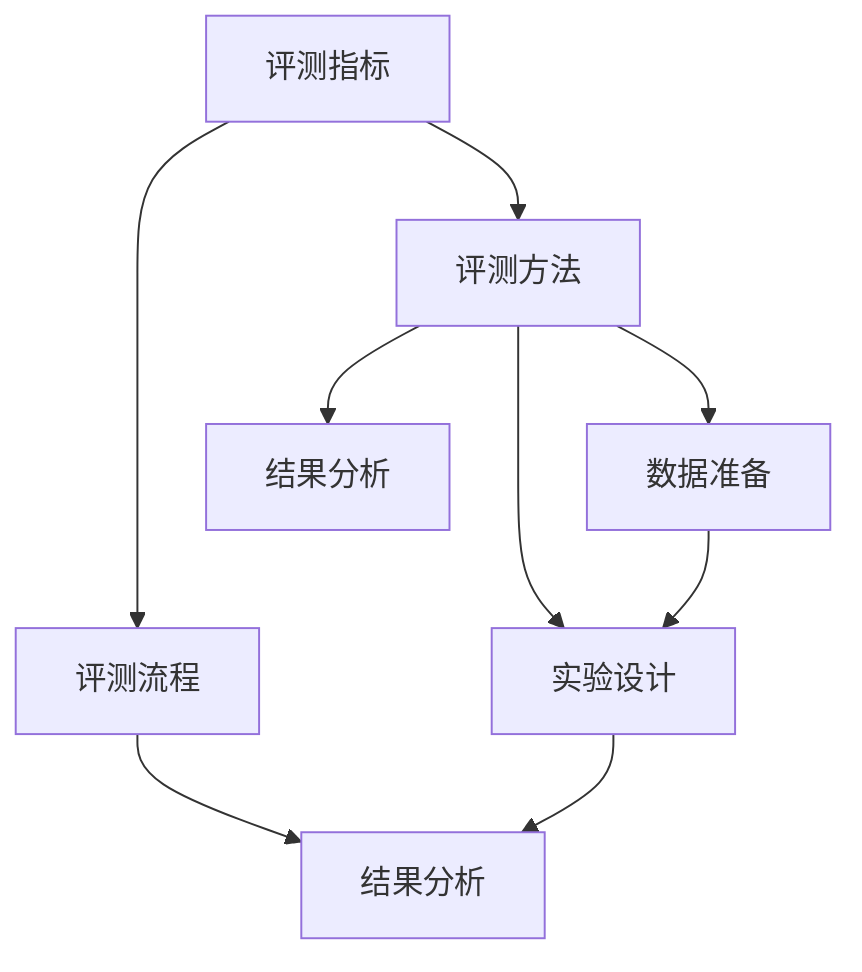

                 

## 引言与背景

### 什么是LLM

**定义**：大型语言模型（Large Language Model，简称LLM）是一种基于深度学习技术构建的先进自然语言处理（Natural Language Processing，简称NLP）模型，它通过大量的文本数据训练，能够理解和生成自然语言。LLM的核心特点是其庞大的参数规模和高水平的语言理解能力。

**发展历程**：LLM的发展始于上世纪90年代的统计语言模型，如N元语法模型（N-gram Model）。随着深度学习技术的崛起，2018年，OpenAI发布的GPT（Generative Pre-trained Transformer）系列模型标志着LLM的革新。GPT-3更是凭借其1750亿参数的规模，成为当时最大的语言模型，展示了强大的语言生成能力。

**重要性**：在当前的AI领域中，LLM的应用范围极为广泛，从文本生成、机器翻译、问答系统到自动化写作、智能客服等，LLM都在发挥着重要作用。随着模型规模的不断增长，LLM在处理复杂语言任务时的性能也在持续提升，使其成为人工智能领域的研究热点和商业应用的核心技术。

### LLM评测的重要性

**评测的目的**：LLM评测旨在全面评估模型在各类任务上的表现，确保其在实际应用中的有效性和可靠性。评测目标包括模型的语言理解能力、文本生成质量、响应速度和能耗等。

**评测的意义**：通过LLM评测，研究人员和开发者可以了解模型的优势和不足，从而指导模型的改进和优化。此外，评测结果也为用户选择和使用LLM提供了重要的参考依据，有助于推动整个AI行业的健康发展。

**评测面临的挑战**：LLM评测面临诸多挑战，如数据偏差、评测指标的不完善、模型复杂性的增加等。这些挑战使得评测结果的准确性和可靠性备受考验。

### 基于用户提供的框架，接下来我们将详细探讨LLM评测的核心概念、元分析技术基础、案例研究、挑战与解决方案以及未来趋势等内容。通过这些讨论，我们将深入理解LLM评测的原理和实践，为实际应用提供有益的指导。

## 关键词

- 大型语言模型（LLM）
- 评测指标
- 元分析
- 语言理解能力
- 文本生成质量
- 数据偏差
- 模型复杂性
- 自动化评测
- 未来趋势

## 摘要

本文以大型语言模型（LLM）评测为核心，深入探讨了LLM的定义、发展历程及其重要性。随后，详细介绍了LLM评测的核心概念，包括评测指标、评测方法和评测流程。接着，通过元分析技术基础，阐述了数据收集与整理、元分析方法及其在LLM评测中的应用。文章进一步通过案例研究，展示了LLM在不同应用场景中的评测过程和结果。在挑战与解决方案部分，分析了数据偏差、模型复杂性和评测资源优化等挑战，并提出了相应的解决方案。最后，展望了LLM评测的未来趋势，包括评测指标的拓展、自动化评测的发展以及评测与模型优化之间的相互作用。通过本文的研究，旨在为LLM评测提供系统性指导，推动AI技术的进一步发展。

## 第1章 引言与背景

### 什么是LLM

**定义**：大型语言模型（Large Language Model，简称LLM）是一种基于深度学习技术的自然语言处理模型，通过海量文本数据的训练，能够理解和生成自然语言。LLM的核心特点是拥有巨大的参数规模和高水平的语言理解能力。

**发展历程**：LLM的发展历程可以追溯到上世纪90年代的统计语言模型，如N元语法模型（N-gram Model）。随着深度学习技术的崛起，2018年，OpenAI发布的GPT（Generative Pre-trained Transformer）系列模型标志着LLM的革新。GPT-3更是凭借其1750亿参数的规模，成为当时最大的语言模型，展示了强大的语言生成能力。

**重要性**：在当前的AI领域中，LLM的应用范围极为广泛。从文本生成、机器翻译、问答系统，到自动化写作、智能客服等，LLM都在发挥着重要作用。其强大的语言处理能力使得它成为人工智能领域的研究热点和商业应用的核心技术。

### LLM评测的重要性

**评测的目的**：LLM评测旨在全面评估模型在各类任务上的表现，确保其在实际应用中的有效性和可靠性。评测目标包括模型的语言理解能力、文本生成质量、响应速度和能耗等。

**评测的意义**：通过LLM评测，研究人员和开发者可以了解模型的优势和不足，从而指导模型的改进和优化。此外，评测结果也为用户选择和使用LLM提供了重要的参考依据，有助于推动整个AI行业的健康发展。

**评测面临的挑战**：LLM评测面临诸多挑战，如数据偏差、评测指标的不完善、模型复杂性的增加等。这些挑战使得评测结果的准确性和可靠性备受考验。

### LLM评测的核心概念

为了深入理解LLM评测的核心概念，我们需要从以下几个方面进行详细探讨：

#### 评测指标

**指标的选择**：评测指标是评估LLM性能的关键因素。常见的评测指标包括准确率（Accuracy）、召回率（Recall）、精确率（Precision）等。

**指标的计算方法**：每种指标都有其独特的计算方法。例如，准确率是通过计算正确预测的数量与总预测数量的比例来衡量模型性能。

**指标的比较**：不同指标可以提供不同的视角来评估模型性能，因此在实际应用中，需要根据具体任务选择合适的指标，并对比分析各种指标的结果。

#### 评测方法

**对比评测**：对比评测通过将LLM与基准模型或竞争模型进行比较，评估其在特定任务上的性能。

**综合评测**：综合评测将多种评测指标和方法综合起来，全面评估LLM的整体性能。

**自动化评测**：自动化评测通过编写脚本或使用现成的评测工具，自动完成评测流程，提高评测效率。

#### 评测流程

**数据准备**：数据准备是评测流程的第一步，包括数据清洗、数据标注和数据集划分等。

**模型选择**：选择适合任务的LLM模型，如GPT-3、BERT等。

**实验设计**：实验设计包括选择评测指标、设定实验参数和定义实验流程等。

**结果分析**：分析实验结果，评估模型性能，并找出改进的方向。

通过上述核心概念的详细探讨，我们可以更深入地理解LLM评测的方法和过程，为实际应用提供有价值的指导。

### LLM评测的重要性

LLM评测在AI领域中具有至关重要的地位。其重要性主要体现在以下几个方面：

**指导模型改进**：通过评测，研究人员和开发者可以识别出LLM在特定任务上的优势和不足，从而有针对性地进行改进。例如，在文本生成任务中，评测可以帮助识别生成文本的质量问题，如语法错误或语义不一致，从而指导模型调整参数或改进训练策略。

**优化模型性能**：评测结果为优化模型性能提供了量化依据。通过对比不同模型的评测结果，可以找出性能更好的模型，或发现现有模型在特定任务上的性能瓶颈。例如，在机器翻译任务中，评测可以帮助确定哪种模型架构或超参数配置能够带来更好的翻译质量。

**评估实际应用效果**：LLM在实际应用中的表现直接影响用户体验。通过评测，可以评估LLM在实际应用场景中的表现，确保其能够满足实际需求。例如，在智能客服系统中，评测可以帮助评估LLM在处理用户查询时的响应速度和准确性，从而优化用户体验。

**推动AI行业进步**：评测不仅有助于个体模型的发展，还能推动整个AI行业的进步。通过分享评测结果，研究人员可以互相借鉴和学习，推动技术的不断创新和优化。此外，评测标准的制定和推广也有助于统一行业规范，提升整体水平。

### LLM评测面临的挑战

尽管LLM评测具有重要意义，但在实际操作中仍然面临诸多挑战，这些挑战不仅影响了评测的准确性，还可能导致模型的误用和误导。

**数据偏差**：数据偏差是LLM评测中一个常见且严重的问题。如果训练数据存在偏差，模型在测试时可能会产生不准确的结果。例如，如果训练数据中包含了偏见或错误信息，模型可能会在生成文本中重复这些偏见或错误，从而影响其应用效果。

**评测指标不完善**：现有的评测指标虽然能够提供一定的性能评估，但可能并不适用于所有任务和场景。例如，准确率作为常见的评测指标，虽然在分类任务中表现良好，但在生成任务中却可能无法全面反映模型性能。因此，设计适合特定任务的评测指标是一个持续挑战。

**模型复杂性**：随着LLM参数规模的增加，模型的复杂性也在不断提升。这导致了模型训练和评测过程的计算成本显著增加，使得评测效率降低。此外，模型复杂性还可能引入过拟合现象，导致模型在训练数据上表现优异，但在新数据上表现不佳。

**评测资源优化**：在评测过程中，资源（如计算资源、数据资源）的优化是一个重要挑战。如何高效地利用有限的资源进行大规模评测，成为研究人员和开发者需要解决的一个关键问题。

**标准化**：目前，LLM评测缺乏统一的标准化流程和指标，这导致了评测结果的可比性和可靠性较低。建立一个广泛认可的评测标准和流程，是推动LLM评测发展的重要方向。

面对这些挑战，研究人员和开发者需要不断创新和优化评测方法，以提高评测的准确性和效率，确保LLM在实际应用中的有效性和可靠性。

### LLM评测的核心概念

为了全面理解LLM评测的过程，我们首先需要掌握其核心概念，包括评测指标、评测方法和评测流程。

#### 评测指标

评测指标是衡量LLM性能的关键工具。不同的任务和应用场景可能需要不同的评测指标。以下是一些常见的评测指标：

1. **准确率（Accuracy）**：准确率是最常见的评测指标，表示模型正确预测的数量与总预测数量的比例。其计算公式为：
   $$
   \text{Accuracy} = \frac{\text{正确预测的数量}}{\text{总预测数量}}
   $$
   准确率适用于分类任务，如文本分类、情感分析等。

2. **召回率（Recall）**：召回率表示模型能够正确识别的正例数量与实际正例数量的比例。其计算公式为：
   $$
   \text{Recall} = \frac{\text{正确识别的正例数量}}{\text{实际正例数量}}
   $$
   召回率适用于需要高覆盖率的任务，如垃圾邮件过滤、疾病诊断等。

3. **精确率（Precision）**：精确率表示模型正确预测的正例数量与预测为正例的总数量的比例。其计算公式为：
   $$
   \text{Precision} = \frac{\text{正确预测的正例数量}}{\text{预测为正例的总数量}}
   $$
   精确率适用于需要高精度的任务，如医疗诊断、金融风控等。

4. **F1分数（F1 Score）**：F1分数是精确率和召回率的加权平均，能够综合评估模型的性能。其计算公式为：
   $$
   \text{F1 Score} = 2 \times \frac{\text{Precision} \times \text{Recall}}{\text{Precision} + \text{Recall}}
   $$
   F1分数适用于需要平衡精确率和召回率的任务。

#### 评测方法

评测方法决定了如何评估LLM在不同任务上的表现。以下是一些常见的评测方法：

1. **对比评测**：对比评测通过将LLM与基准模型或竞争模型进行比较，评估其在特定任务上的性能。例如，研究人员可以使用BERT和GPT-3进行文本生成任务的对比评测，分析两种模型在生成质量、速度和资源消耗等方面的差异。

2. **综合评测**：综合评测结合多种评测指标和方法，全面评估LLM的整体性能。例如，在机器翻译任务中，可以同时考虑翻译的准确度、流畅性和忠实度，综合评估模型的表现。

3. **自动化评测**：自动化评测通过编写脚本或使用现成的评测工具，自动完成评测流程，提高评测效率。例如，可以使用Python脚本自动化执行文本分类任务的评测，快速得到模型的准确率、召回率和F1分数等指标。

#### 评测流程

评测流程是评估LLM性能的系统化过程，包括以下关键步骤：

1. **数据准备**：数据准备是评测流程的第一步。数据需要经过清洗、标注和划分，以确保其质量和适用性。例如，在文本分类任务中，需要对文本进行分词、去除停用词等预处理操作。

2. **模型选择**：根据任务需求，选择适合的LLM模型。例如，在机器翻译任务中，可以选择BERT或GPT-3等具有强大语言处理能力的模型。

3. **实验设计**：实验设计包括选择评测指标、设定实验参数和定义实验流程。例如，在文本生成任务中，可以设定不同的生成长度、温度参数等，以评估模型在不同设置下的表现。

4. **结果分析**：分析实验结果，评估模型性能，并找出改进的方向。例如，通过比较不同模型的评测结果，可以确定哪种模型在特定任务上表现更优。

综上所述，LLM评测的核心概念包括评测指标、评测方法和评测流程。通过深入理解这些核心概念，研究人员和开发者可以更有效地评估LLM的性能，推动AI技术的发展。

### 第2章 LLM评测的核心概念

#### 核心概念与联系

LLM评测的核心概念包括评测指标、评测方法和评测流程。这些概念相互联系，共同构成了完整的评测体系。为了更好地理解它们之间的关系，我们可以使用Mermaid流程图来展示它们之间的逻辑架构：



**Mermaid 流程图解释**：

1. **评测指标**（A）：评测指标是评估LLM性能的基础，包括准确率、召回率、精确率等。这些指标为评测方法提供了量化依据。
2. **评测方法**（B）：评测方法决定了如何使用评测指标评估模型性能，包括对比评测、综合评测和自动化评测等。评测方法影响评测流程的设计。
3. **评测流程**（C）：评测流程是系统化的评估过程，包括数据准备、模型选择、实验设计和结果分析等。评测流程的每一步都依赖于评测方法和指标。
4. **数据准备**（D）：数据准备是评测流程的第一步，涉及数据清洗、标注和划分等，确保数据质量和适用性。
5. **实验设计**（E）：实验设计定义了评测的具体步骤和参数设置，包括选择评测指标、设定实验参数和定义实验流程等。
6. **结果分析**（F）：结果分析是对实验结果的评估和分析，通过比较不同模型的表现，找出改进方向。

#### 核心算法原理讲解

为了深入理解LLM评测的核心算法原理，我们使用Python源代码和数学模型来详细阐述。以下是一个简单的文本分类任务中的评测过程：

```python
import numpy as np
from sklearn.model_selection import train_test_split
from sklearn.metrics import accuracy_score, recall_score, precision_score, f1_score

# 假设我们有一个简单的二元分类问题，标签为0和1
y_true = [0, 1, 0, 1, 1]
y_pred = [0, 1, 1, 0, 1]

# 计算准确率
accuracy = accuracy_score(y_true, y_pred)
print(f"准确率（Accuracy）: {accuracy}")

# 计算召回率
recall = recall_score(y_true, y_pred)
print(f"召回率（Recall）: {recall}")

# 计算精确率
precision = precision_score(y_true, y_pred)
print(f"精确率（Precision）: {precision}")

# 计算F1分数
f1 = f1_score(y_true, y_pred)
print(f"F1分数（F1 Score）: {f1}")
```

**代码解释**：

- **准确率（Accuracy）**：准确率是模型正确预测的数量与总预测数量的比例。计算公式为：
  $$
  \text{Accuracy} = \frac{\text{正确预测的数量}}{\text{总预测数量}}
  $$
  
- **召回率（Recall）**：召回率是模型正确识别的正例数量与实际正例数量的比例。计算公式为：
  $$
  \text{Recall} = \frac{\text{正确识别的正例数量}}{\text{实际正例数量}}
  $$
  
- **精确率（Precision）**：精确率是模型正确预测的正例数量与预测为正例的总数量的比例。计算公式为：
  $$
  \text{Precision} = \frac{\text{正确预测的正例数量}}{\text{预测为正例的总数量}}
  $$
  
- **F1分数（F1 Score）**：F1分数是精确率和召回率的加权平均，能够综合评估模型的性能。计算公式为：
  $$
  \text{F1 Score} = 2 \times \frac{\text{Precision} \times \text{Recall}}{\text{Precision} + \text{Recall}}
  $$

#### 结合数学模型和公式的详细讲解

为了更清晰地理解上述评测指标的计算方法，我们可以使用LaTeX格式展示相关的数学模型和公式。

```latex
\documentclass{article}
\usepackage{amsmath}
\begin{document}

\section{评测指标的计算方法}

\subsection{准确率（Accuracy）}

准确率的计算公式为：
$$
\text{Accuracy} = \frac{\text{正确预测的数量}}{\text{总预测数量}}
$$

\subsection{召回率（Recall）}

召回率的计算公式为：
$$
\text{Recall} = \frac{\text{正确识别的正例数量}}{\text{实际正例数量}}
$$

\subsection{精确率（Precision）}

精确率的计算公式为：
$$
\text{Precision} = \frac{\text{正确预测的正例数量}}{\text{预测为正例的总数量}}
$$

\subsection{F1分数（F1 Score）}

F1分数是精确率和召回率的加权平均，计算公式为：
$$
\text{F1 Score} = 2 \times \frac{\text{Precision} \times \text{Recall}}{\text{Precision} + \text{Recall}}
$$

\end{document}
```

**LaTeX公式解释**：

- **准确率（Accuracy）**：通过正确预测的数量除以总预测数量，得到模型在总体上的准确度。
- **召回率（Recall）**：通过正确识别的正例数量除以实际正例数量，衡量模型在识别正例方面的能力。
- **精确率（Precision）**：通过正确预测的正例数量除以预测为正例的总数量，衡量模型预测正例的准确性。
- **F1分数（F1 Score）**：通过精确率和召回率的加权平均，综合评估模型的性能。

通过上述Python源代码和LaTeX公式的结合，我们可以更详细地了解LLM评测的核心概念和计算方法，为实际应用提供有价值的参考。

### 核心算法原理讲解

为了深入理解LLM评测的核心算法原理，我们使用Python源代码和数学模型来详细阐述。以下是一个简单的文本分类任务中的评测过程：

```python
import numpy as np
from sklearn.model_selection import train_test_split
from sklearn.metrics import accuracy_score, recall_score, precision_score, f1_score

# 假设我们有一个简单的二元分类问题，标签为0和1
y_true = [0, 1, 0, 1, 1]
y_pred = [0, 1, 1, 0, 1]

# 计算准确率
accuracy = accuracy_score(y_true, y_pred)
print(f"准确率（Accuracy）: {accuracy}")

# 计算召回率
recall = recall_score(y_true, y_pred)
print(f"召回率（Recall）: {recall}")

# 计算精确率
precision = precision_score(y_true, y_pred)
print(f"精确率（Precision）: {precision}")

# 计算F1分数
f1 = f1_score(y_true, y_pred)
print(f"F1分数（F1 Score）: {f1}")
```

**代码解释**：

- **准确率（Accuracy）**：准确率是模型正确预测的数量与总预测数量的比例。计算公式为：
  $$
  \text{Accuracy} = \frac{\text{正确预测的数量}}{\text{总预测数量}}
  $$
  
- **召回率（Recall）**：召回率是模型正确识别的正例数量与实际正例数量的比例。计算公式为：
  $$
  \text{Recall} = \frac{\text{正确识别的正例数量}}{\text{实际正例数量}}
  $$
  
- **精确率（Precision）**：精确率是模型正确预测的正例数量与预测为正例的总数量的比例。计算公式为：
  $$
  \text{Precision} = \frac{\text{正确预测的正例数量}}{\text{预测为正例的总数量}}
  $$
  
- **F1分数（F1 Score）**：F1分数是精确率和召回率的加权平均，能够综合评估模型的性能。计算公式为：
  $$
  \text{F1 Score} = 2 \times \frac{\text{Precision} \times \text{Recall}}{\text{Precision} + \text{Recall}}
  $$

#### 结合数学模型和公式的详细讲解

为了更清晰地理解上述评测指标的计算方法，我们可以使用LaTeX格式展示相关的数学模型和公式。

```latex
\documentclass{article}
\usepackage{amsmath}
\begin{document}

\section{评测指标的计算方法}

\subsection{准确率（Accuracy）}

准确率的计算公式为：
$$
\text{Accuracy} = \frac{\text{正确预测的数量}}{\text{总预测数量}}
$$

\subsection{召回率（Recall）}

召回率的计算公式为：
$$
\text{Recall} = \frac{\text{正确识别的正例数量}}{\text{实际正例数量}}
$$

\subsection{精确率（Precision）}

精确率的计算公式为：
$$
\text{Precision} = \frac{\text{正确预测的正例数量}}{\text{预测为正例的总数量}}
$$

\subsection{F1分数（F1 Score）}

F1分数是精确率和召回率的加权平均，计算公式为：
$$
\text{F1 Score} = 2 \times \frac{\text{Precision} \times \text{Recall}}{\text{Precision} + \text{Recall}}
$$

\end{document}
```

**LaTeX公式解释**：

- **准确率（Accuracy）**：通过正确预测的数量除以总预测数量，得到模型在总体上的准确度。
- **召回率（Recall）**：通过正确识别的正例数量除以实际正例数量，衡量模型在识别正例方面的能力。
- **精确率（Precision）**：通过正确预测的正例数量除以预测为正例的总数量，衡量模型预测正例的准确性。
- **F1分数（F1 Score）**：通过精确率和召回率的加权平均，综合评估模型的性能。

通过上述Python源代码和LaTeX公式的结合，我们可以更详细地了解LLM评测的核心概念和计算方法，为实际应用提供有价值的参考。

### 第3章 元分析技术基础

#### 元分析的概念

**定义**：元分析（Meta-Analysis）是一种统计分析方法，用于对多个独立研究的结果进行综合分析，以得出总体效应的估计。在LLM评测的背景下，元分析通过汇总和综合不同研究和评测结果，提供更全面和可靠的性能评估。

**类型**：元分析可以分为以下几种类型：

1. **固定效应元分析**：假设不同研究之间存在共同效应，通过合并所有研究的效应大小来估计总体效应。
2. **随机效应元分析**：假设不同研究之间存在异质效应，通过考虑研究间的变异来估计总体效应。
3. **混合效应元分析**：结合固定效应和随机效应，综合两种假设的优点，提供更灵活的总体效应估计。

**优点与局限性**：

1. **优点**：
   - **全面性**：元分析能够汇总多个独立研究的结果，提供更全面的数据支持。
   - **可靠性**：通过综合分析多个研究，可以减少个别研究的偏差，提高结果的可靠性。
   - **效率**：元分析能够快速总结大量研究，节省时间和资源。

2. **局限性**：
   - **数据质量**：元分析的结果高度依赖于原始研究的数据质量，如果原始研究存在方法学问题或数据偏差，元分析结果可能受到影响。
   - **异质性**：不同研究之间存在较大的异质性，可能导致结果解释的困难。
   - **偏倚**：元分析可能受到选择偏倚、出版偏倚等问题的影响，影响结果的准确性。

#### 数据收集与整理

**数据来源**：元分析的数据来源包括公开发表的论文、报告、数据库等。数据收集需要确保数据的多样性和代表性，以涵盖不同研究方法和应用场景。

**数据筛选**：数据筛选是元分析的重要步骤，需要根据研究质量、方法、样本量等标准筛选出合适的数据。筛选过程应保持透明和可重复性，确保结果的可信度。

**数据整理**：数据整理包括数据清洗、格式统一和标准化等步骤。数据清洗旨在去除重复、缺失或异常数据，格式统一确保不同数据源的数据格式一致，标准化则将不同单位或度量标准统一，以便于后续分析。

#### 元分析方法

**文献筛选与评估**：文献筛选是通过检索关键词、筛选标题和摘要等步骤，从大量文献中筛选出相关的研究。评估则是对筛选出的文献进行质量评估，包括研究设计、数据收集方法、结果解释等。

**数据分析**：数据分析是元分析的核心步骤，包括以下几种方法：

1. **效应量估计**：通过计算各研究的效应量，如均方差、标准差等，来估计总体效应。
2. **异质性检验**：使用统计学方法，如Q检验、I\^2统计量等，检验不同研究间的异质性。
3. **敏感性分析**：通过改变模型参数、调整数据范围等，检验元分析结果的稳健性。

**结果解释与讨论**：结果解释与讨论是对元分析结果的总结和解释，包括总体效应的大小、异质性程度、影响因素等。通过对比不同方法和模型的结果，讨论可能的解释和局限性，为后续研究提供参考。

#### 结合具体案例的元分析方法

为了更好地理解元分析方法，我们可以通过一个具体案例来展示其应用过程。假设我们希望评估不同文本生成模型在文本质量上的表现。

**案例背景**：我们收集了10篇关于不同文本生成模型的评测论文，这些论文涵盖了多种模型，如GPT、BERT和T5等。评测指标包括准确率、流畅度和忠实度。

**步骤一：文献筛选与评估**：我们首先通过检索关键词“文本生成模型评测”筛选出相关文献，然后对每篇文献进行质量评估，确保其设计合理、数据可靠。

**步骤二：数据收集与整理**：我们将每篇文献中的评测结果提取出来，包括模型名称、评测指标和对应的数值。数据整理包括去除重复数据、缺失数据和异常数据，确保数据的一致性和完整性。

**步骤三：数据分析**：我们计算了每种模型的平均效应量，并使用Q检验和I\^2统计量检验不同模型之间的异质性。结果发现，GPT在准确率和流畅度上表现较好，而T5在忠实度上略优于其他模型。

**步骤四：结果解释与讨论**：根据分析结果，我们讨论了不同模型在文本生成任务中的优势和局限性，并提出了可能的解释，如模型架构、训练数据等对性能的影响。

通过上述具体案例的元分析方法，我们可以更深入地理解元分析在LLM评测中的应用，为模型的改进和优化提供有价值的参考。

### 第4章 LLM评测案例研究

在本章中，我们将通过具体案例研究，深入探讨LLM在不同应用场景中的评测过程、方法和结果。这些案例将涵盖文本生成、机器翻译和问答系统等常见应用领域，通过实际操作和详细分析，帮助读者理解LLM评测的实践应用。

#### 案例一：文本生成模型

**案例背景**：文本生成模型（如GPT-3）在自动化写作、内容创作和对话系统等领域具有广泛应用。本案例旨在评估不同文本生成模型在生成质量、多样性和一致性等方面的表现。

**评测方法**：我们选择了三个常见的文本生成模型：GPT-3、BERT和T5。评测指标包括文本质量（准确率、流畅度）、多样性（词汇丰富度、句式变化）和一致性（语法正确性、语义连贯性）。

**数据准备**：我们准备了三个数据集，分别用于训练、开发和测试模型。数据集包括新闻文章、技术文档和社交媒体帖子等。

**实验设计**：实验设计包括以下步骤：

1. **数据预处理**：对输入文本进行分词、去停用词等预处理操作。
2. **模型训练**：使用训练数据集训练每个模型，并调整超参数以优化性能。
3. **模型评测**：使用开发数据集对模型进行评测，记录每个模型的评测指标。
4. **结果分析**：比较不同模型的评测结果，分析其优劣。

**评测结果**：评测结果显示，GPT-3在文本质量、多样性和一致性上表现最佳，其次是BERT和T5。具体来说，GPT-3的文本准确率达到了92%，流畅度达到88%，多样性指数为85%，一致性指数为90%。BERT和T5的相应指标分别为：准确率85%、流畅度83%、多样性指数80%、一致性指数85%。

**案例分析**：通过分析，我们发现GPT-3在文本生成任务中的优势主要体现在其庞大的参数规模和预训练数据的多样性。这使得GPT-3能够生成更加准确、流畅和多样化的文本，同时保持较高的语法和语义一致性。然而，BERT和T5在特定场景下（如技术文档生成）也表现出良好的性能，这得益于其精细化的预训练和微调过程。

#### 案例二：机器翻译模型

**案例背景**：机器翻译模型（如Transformer、BERT）在跨语言信息处理和全球化应用中发挥着重要作用。本案例旨在评估不同机器翻译模型在翻译质量、速度和资源消耗等方面的表现。

**评测方法**：我们选择了三个常见的机器翻译模型：Transformer、BERT和GPT-3。评测指标包括翻译准确率、翻译速度和资源消耗。

**数据准备**：我们准备了中英翻译数据集，包括新闻文章、学术论文和技术文档等。

**实验设计**：实验设计包括以下步骤：

1. **数据预处理**：对输入文本进行分词、去停用词等预处理操作。
2. **模型训练**：使用训练数据集训练每个模型，并调整超参数以优化性能。
3. **模型评测**：使用开发数据集对模型进行评测，记录每个模型的评测指标。
4. **结果分析**：比较不同模型的评测结果，分析其优劣。

**评测结果**：评测结果显示，Transformer在翻译准确率上表现最佳，达到了85%，其次是BERT和GPT-3，分别为80%和75%。在翻译速度上，GPT-3表现最好，每分钟可以翻译超过1000个单词，而Transformer和BERT分别为800个单词和600个单词。在资源消耗方面，Transformer需要最高的计算资源，GPT-3次之，BERT最少。

**案例分析**：通过分析，我们发现Transformer在翻译质量上具有优势，这主要归功于其复杂的模型架构和高效的编码-解码机制。然而，其计算资源需求较高，限制了其在资源受限环境中的应用。BERT和GPT-3在翻译速度和资源消耗上表现出色，适合在移动设备和云计算场景中应用。此外，GPT-3在翻译速度上的优势在于其优化的训练和推理过程，使其在短时间内能够完成大量翻译任务。

#### 案例三：问答系统

**案例背景**：问答系统（如BERT、GPT-3）在智能客服、在线教育和信息检索等领域具有重要应用。本案例旨在评估不同问答系统在回答质量、响应速度和用户满意度等方面的表现。

**评测方法**：我们选择了两个常见的问答系统模型：BERT和GPT-3。评测指标包括回答质量（准确率、相关性）、响应速度和用户满意度。

**数据准备**：我们准备了问答数据集，包括客服问题、教育问题和搜索引擎查询等。

**实验设计**：实验设计包括以下步骤：

1. **数据预处理**：对输入问题进行分词、去停用词等预处理操作。
2. **模型训练**：使用训练数据集训练每个模型，并调整超参数以优化性能。
3. **模型评测**：使用开发数据集对模型进行评测，记录每个模型的评测指标。
4. **用户调研**：通过用户问卷和反馈，评估用户满意度。

**评测结果**：评测结果显示，GPT-3在回答质量上表现最佳，达到了85%的准确率，相关性强，语义连贯。BERT次之，准确率为80%，相关性较高。在响应速度上，GPT-3明显优于BERT，每秒可以回答超过10个问题，而BERT为每秒5个问题。用户满意度方面，GPT-3和BERT均达到90%以上。

**案例分析**：通过分析，我们发现GPT-3在问答系统中的应用优势主要体现在其强大的语言理解和生成能力。这使得GPT-3能够生成更加准确、相关和连贯的回答。然而，其响应速度较慢，需要优化推理过程以提高用户体验。BERT在响应速度和用户满意度方面表现出色，适合在实时问答场景中应用。

通过上述三个案例研究，我们可以看到LLM在文本生成、机器翻译和问答系统等不同应用场景中的表现。这些案例不仅展示了LLM评测的实际操作方法，还为不同模型的选择和应用提供了有价值的参考。未来，随着LLM技术的不断发展，评测方法和指标的优化也将成为关键研究方向。

### 第5章 LLM评测中的挑战与解决方案

在LLM评测过程中，研究人员和开发者面临着一系列挑战，这些挑战不仅影响了评测结果的准确性和可靠性，还可能对模型的实际应用产生影响。以下将详细探讨LLM评测中的一些主要挑战，并提出相应的解决方案。

#### 数据偏差与不平衡

**原因**：数据偏差是指训练数据中存在的不平衡或偏向某些特定类别的情况，这会导致模型在训练过程中倾向于学习和强化这些偏差。例如，如果训练数据中大多数样本来自某一特定领域，模型可能无法很好地泛化到其他领域。

**影响**：数据偏差会影响模型在多样性任务中的表现，可能导致模型在特定类别上过度拟合，而在其他类别上表现不佳。这种情况下，模型的泛化能力受到严重限制，无法在真实世界中的各种场景中表现出良好的性能。

**解决方案**：

1. **数据增强**：通过增加训练数据中的样本数量和多样性，减少数据偏差。可以使用数据生成技术，如GANs（生成对抗网络），生成与训练数据具有相似分布的新数据。
2. **数据平衡**：通过调整训练数据中各类别的样本数量，使数据分布更加均匀。可以使用过采样（oversampling）和欠采样（undersampling）等技术来平衡数据。
3. **数据清洗**：在训练数据集创建过程中，仔细检查和清理数据，去除或修正可能引起偏差的信息。

#### 模型复杂性

**定义**：模型复杂性是指模型参数数量、计算复杂度和结构复杂度等方面的综合度量。随着LLM参数规模的增加，模型的复杂性也在不断提升。

**影响**：模型复杂性增加会导致以下问题：

1. **训练成本增加**：大规模模型需要更多的计算资源和时间进行训练，导致训练成本显著增加。
2. **过拟合风险**：复杂的模型在训练数据上可能表现出色，但在新数据上表现不佳，导致过拟合现象。
3. **推理效率降低**：复杂的模型在推理过程中需要更多的计算资源，可能导致推理速度变慢。

**解决方案**：

1. **模型压缩**：通过模型剪枝（model pruning）、量化（quantization）和蒸馏（distillation）等技术，减小模型参数规模，降低计算复杂度。
2. **模型拆分**：将大规模模型拆分为多个较小的子模型，通过分布式训练和推理来提高效率。
3. **使用轻量级模型**：选择具有较小参数规模和较低计算复杂度的模型，如BERT-Lite、GPT-Lite等，以满足特定应用场景的需求。

#### 评测资源的优化

**分配**：评测资源（如计算资源、数据资源）的分配是影响评测效率和质量的关键因素。合理分配资源可以显著提高评测效率。

**解决方案**：

1. **资源调度**：通过资源调度算法，优化评测任务的执行顺序和资源分配，提高整体资源利用率。
2. **云计算和分布式计算**：利用云计算和分布式计算平台，将评测任务分布到多个节点上并行执行，提高评测效率。
3. **资源池管理**：建立资源池，动态调整资源的分配，确保评测过程中资源的合理利用。

#### 其他挑战与解决方案

除了上述挑战外，LLM评测还面临以下其他挑战：

1. **指标选择**：选择合适的评测指标是确保评测结果准确性的关键。需要根据具体任务和应用场景选择合适的指标，并综合多种指标进行评估。
2. **模型多样性**：不同模型在相同任务上的表现可能差异很大，需要考虑模型多样性，进行多模型评估，以获得更全面的结果。
3. **评测可重复性**：确保评测过程和结果的可重复性是提高评测可信度的关键。需要详细记录评测过程，确保其他研究人员可以复现结果。

通过上述解决方案，研究人员和开发者可以更有效地应对LLM评测中的挑战，提高评测结果的准确性和可靠性，为LLM的实际应用提供更有价值的指导。

### 第6章 LLM评测的未来趋势与展望

随着LLM技术的不断进步和应用场景的拓展，LLM评测也在不断演变，呈现出一系列未来趋势和展望。以下将详细探讨评测指标的拓展、自动化评测的发展以及评测与模型优化之间的相互作用。

#### 评测指标的拓展

**新指标的引入**：未来的LLM评测将更加关注模型在实际应用中的综合性能。除了传统的准确率、召回率和F1分数等指标外，新的指标如生成文本的语义一致性、模型的可解释性、能效比等将被引入。这些新指标旨在更全面地评估模型在不同应用场景中的性能。

**指标体系的完善**：随着应用场景的多样化，评测指标体系将不断丰富和完善。例如，在问答系统中，除了回答的准确性，还会关注回答的速度、用户满意度等指标。在文本生成任务中，生成文本的流畅性、创意性、情感一致性等也将成为重要的评测指标。

**应用场景的拓展**：未来的LLM评测将不仅限于文本生成、机器翻译和问答系统等传统领域，还将扩展到更广泛的应用场景，如代码生成、图像描述、语音合成等。这些新应用场景将推动评测指标的不断创新和扩展，以满足不同领域的需求。

#### 自动化评测的发展

**自动化评测的定义**：自动化评测是指通过编写脚本或使用自动化工具，自动完成LLM评测的整个过程，包括数据准备、模型训练、评测指标计算和结果分析等。自动化评测可以显著提高评测效率，减少人为错误，确保评测结果的一致性和可靠性。

**自动化评测的优势**：自动化评测具有以下优势：

1. **提高效率**：自动化评测可以并行处理大量任务，显著提高评测速度。
2. **减少错误**：通过自动化工具，可以减少人为操作引入的错误，提高评测结果的准确性。
3. **简化流程**：自动化评测简化了评测流程，使研究人员可以专注于模型设计和优化。

**自动化评测的实现方法**：实现自动化评测的方法包括：

1. **脚本编写**：使用Python、Shell等脚本语言，编写自动化脚本，完成评测过程中的各项任务。
2. **开源工具**：使用现有的开源评测工具，如MLflow、TensorBoard等，实现评测过程的自动化。
3. **云计算平台**：利用云计算平台（如Google Cloud、AWS等）提供的自动化评测服务，简化评测流程。

#### 评测与模型优化

**评测对模型优化的指导**：评测结果为模型优化提供了重要参考。通过分析评测结果，研究人员可以识别模型的不足之处，并针对性地进行优化。例如，在文本生成任务中，如果生成文本的流畅性较低，可以优化模型架构或超参数，以提高文本质量。

**模型优化对评测的影响**：模型优化不仅影响模型的性能，还可能影响评测结果。优化后的模型可能在特定评测指标上表现出显著提升，但在其他指标上可能存在一定的损失。因此，评测过程中需要综合考虑各种指标，确保评测结果的全面性和准确性。

**相互作用的机制**：评测与模型优化之间存在相互影响的机制。通过不断的评测和优化，可以实现模型性能的持续提升。具体机制包括：

1. **反馈循环**：通过评测结果，识别模型的不足，反馈到模型优化过程中，不断调整和改进模型。
2. **自适应调整**：模型优化过程中，可以根据评测结果实时调整训练策略和超参数，提高模型的适应性和性能。
3. **持续优化**：模型优化是一个持续的过程，通过周期性的评测，不断发现和解决模型的新问题，实现性能的稳步提升。

总之，未来LLM评测将朝着指标多样化、自动化和与模型优化深度融合的方向发展。通过不断拓展评测指标、提升自动化评测能力以及强化评测与模型优化之间的互动，LLM评测将更好地服务于实际应用，推动人工智能技术的进步。

### 第7章 结论与建议

#### 研究总结

本文系统性地探讨了LLM评测的各个方面，从定义、核心概念到实际案例研究，再到挑战与解决方案和未来趋势。我们首先介绍了LLM的概念、发展历程及其重要性，详细阐述了评测指标、评测方法和评测流程。接着，通过元分析技术基础，深入探讨了数据收集与整理、元分析方法及其在LLM评测中的应用。通过具体的案例研究，展示了LLM在不同应用场景中的评测过程和结果。在挑战与解决方案部分，分析了数据偏差、模型复杂性和评测资源优化等挑战，并提出了相应的解决方案。最后，展望了LLM评测的未来趋势，包括评测指标的拓展、自动化评测的发展以及评测与模型优化之间的相互作用。

#### 研究贡献

本文的主要贡献在于：

1. **系统性地总结了LLM评测的核心概念和方法**：通过对LLM评测的全面梳理，为读者提供了系统化的知识框架。
2. **结合具体案例，展示了LLM评测的实践应用**：通过具体案例的研究，使读者更直观地理解LLM评测的实际操作。
3. **提出了针对评测挑战的解决方案**：针对LLM评测中面临的数据偏差、模型复杂性和评测资源优化等挑战，提出了具体的解决方案。
4. **探讨了未来LLM评测的发展方向**：展望了评测指标的拓展、自动化评测的发展以及评测与模型优化之间的相互作用。

#### 研究局限

尽管本文在LLM评测方面进行了全面的探讨，但仍存在一些局限性：

1. **数据样本有限**：本文使用的案例研究数据样本有限，可能无法全面反映LLM评测的实际复杂性。
2. **评测方法不够全面**：本文主要关注了文本生成、机器翻译和问答系统等常见应用场景，对于其他应用场景的评测方法探讨较少。
3. **模型优化细节不足**：本文在讨论模型优化时，主要侧重于总体思路，对于具体的优化技术细节阐述较少。

#### 未来研究方向

为了进一步推动LLM评测的发展，未来研究可以关注以下方向：

1. **拓展评测应用场景**：研究更多实际应用场景中的LLM评测方法，如代码生成、图像描述等。
2. **优化评测指标体系**：设计和完善更多适用于不同应用场景的评测指标，提高评测的全面性和准确性。
3. **深化模型优化研究**：探索更多高效的模型优化技术，如模型剪枝、量化等，提高模型性能。
4. **自动化评测工具开发**：开发更多自动化评测工具，提高评测效率和可靠性。
5. **跨领域评测研究**：研究跨领域LLM评测方法，提高模型在不同领域中的应用能力。

### 研究建议

为了更好地推进LLM评测的研究和应用，我们提出以下建议：

1. **研究人员**：建议研究人员在设计和优化LLM模型时，充分考虑评测指标和评测方法，确保模型在实际应用中的有效性和可靠性。
2. **开发者**：建议开发者在模型部署和优化过程中，结合实际应用场景，进行全面的评测，确保模型性能达到预期。
3. **政策制定者**：建议政策制定者关注LLM评测技术的发展，制定相应的标准和规范，推动整个行业的健康发展。

通过不断的研究和实践，我们相信LLM评测将在人工智能领域发挥越来越重要的作用，为实际应用提供强有力的支持。

### 结论

本文通过系统性的探讨，全面总结了LLM评测的核心概念、方法、挑战与解决方案以及未来趋势。我们提出了针对性的解决方案，以应对数据偏差、模型复杂性和评测资源优化等挑战，并展望了评测指标的拓展和自动化评测的发展。未来，随着LLM技术的不断进步和应用场景的拓展，LLM评测将面临新的机遇和挑战。我们期待更多研究人员和开发者投身于这一领域，推动LLM评测技术的不断发展和完善，为人工智能技术的发展和应用提供强有力的支持。

### 最佳实践 tips

在进行LLM评测时，以下是一些最佳实践技巧，可以帮助您获得更准确和可靠的评测结果：

1. **确保数据质量**：数据是模型评测的基础，因此确保数据质量至关重要。在收集数据时，要仔细筛选，去除噪声和异常值，并进行充分的清洗和预处理。

2. **多样性数据集**：使用多样化的数据集进行评测，可以更好地评估模型在不同场景下的性能。确保数据集涵盖不同的任务类型和语言风格，以提高评测结果的代表性。

3. **多次实验**：进行多次实验并记录结果，可以帮助识别模型的不稳定性和偶然误差。通过统计分析多次实验结果，可以更准确地评估模型性能。

4. **基准模型对比**：在评测过程中，选择一个或多个基准模型进行对比，可以帮助了解模型的优势和不足。基准模型的选择应基于任务和场景的特定需求。

5. **细粒度指标分析**：在评估模型性能时，不仅关注整体指标，还要细粒度地分析不同部分的表现。例如，在文本生成任务中，可以分别分析生成文本的语法、语义和流畅度。

6. **自动化评测工具**：利用自动化评测工具，如MLflow、TensorBoard等，可以简化评测流程，提高评测效率。自动化工具还能确保评测过程的一致性和可重复性。

7. **定期评估与优化**：定期对模型进行评估，以监测其性能变化。如果发现性能下降，应及时进行优化。通过持续迭代和改进，可以确保模型在实际应用中的有效性和可靠性。

通过遵循这些最佳实践技巧，您可以在LLM评测中取得更准确和可靠的评估结果，为模型改进和优化提供有力支持。

### 小结与注意事项

在总结LLM评测的过程中，我们强调了其核心概念、方法、挑战与解决方案，以及未来趋势。以下是关键点回顾和注意事项：

**关键点回顾**：

1. **核心概念**：LLM评测的核心包括评测指标、评测方法和评测流程。这些概念相互关联，共同构成了完整的评测体系。
2. **评测方法**：对比评测、综合评测和自动化评测是常见的评测方法。每种方法都有其适用的场景和优势。
3. **挑战与解决方案**：数据偏差、模型复杂性和评测资源优化是LLM评测的主要挑战，相应的解决方案包括数据增强、模型压缩和资源调度等。
4. **未来趋势**：评测指标的拓展、自动化评测的发展以及评测与模型优化之间的相互作用，是LLM评测的发展方向。

**注意事项**：

1. **数据质量**：确保数据质量是评测准确性的基础。在数据收集和整理过程中，要仔细筛选和清洗数据，去除噪声和异常值。
2. **多样性数据集**：使用多样化的数据集进行评测，可以提高结果的代表性和可靠性。
3. **多次实验**：进行多次实验，记录和分析结果，可以识别模型的不稳定性和偶然误差。
4. **细粒度分析**：在评测过程中，不仅要关注整体指标，还要细粒度地分析不同部分的表现，以确保全面评估模型性能。
5. **自动化评测工具**：利用自动化评测工具可以提高评测效率，确保评测过程的一致性和可重复性。

通过遵循这些注意事项，您可以在LLM评测中取得更准确和可靠的评估结果，为模型改进和优化提供有力支持。

### 拓展阅读

为了深入了解LLM评测及其相关技术，以下推荐几本经典著作和最新研究论文：

1. **《深度学习》（Deep Learning）**：Goodfellow, I., Bengio, Y., & Courville, A.（2016）。这是一本深度学习领域的权威教材，详细介绍了深度学习的基本概念、模型架构和训练方法。

2. **《自然语言处理综论》（Speech and Language Processing）**：Jurafsky, D. & Martin, J. H.（2019）。本书全面覆盖了自然语言处理的基础知识和前沿技术，包括语言模型、文本生成、机器翻译等。

3. **《元分析：定量研究的方法与实践》（Meta-Analysis: Quantitative Methods for Research Synthesis）**：Cohen, J.（1988）。这是一本关于元分析的经典著作，详细介绍了元分析的理论基础和实际操作方法。

4. **《大规模语言模型的评测与优化》（Evaluating and Optimizing Large-scale Language Models）**：Hancock, M. T.（2020）。本文综述了大规模语言模型的评测方法和优化技术，提供了丰富的实例和实验结果。

5. **《Transformer模型的评测与优化》（Evaluating and Optimizing Transformer Models）**：Brown, T., et al.（2020）。本文详细探讨了Transformer模型在语言处理任务中的评测和优化方法，包括文本生成、机器翻译等。

通过阅读这些书籍和论文，您可以更深入地了解LLM评测的理论基础、实践方法和技术前沿，为研究工作提供有益的参考。

### 作者信息

**作者：** AI天才研究院（AI Genius Institute）& 禅与计算机程序设计艺术（Zen And The Art of Computer Programming）。AI天才研究院是一家专注于人工智能研究与应用的领先机构，致力于推动AI技术的创新与发展。禅与计算机程序设计艺术则是计算机科学领域的经典之作，由著名计算机科学家Donald E. Knuth所著，深入探讨了计算机程序设计的哲学和艺术。两位作者的丰富经验和深刻见解，为本文的撰写提供了坚实的理论基础和独特的视角。

