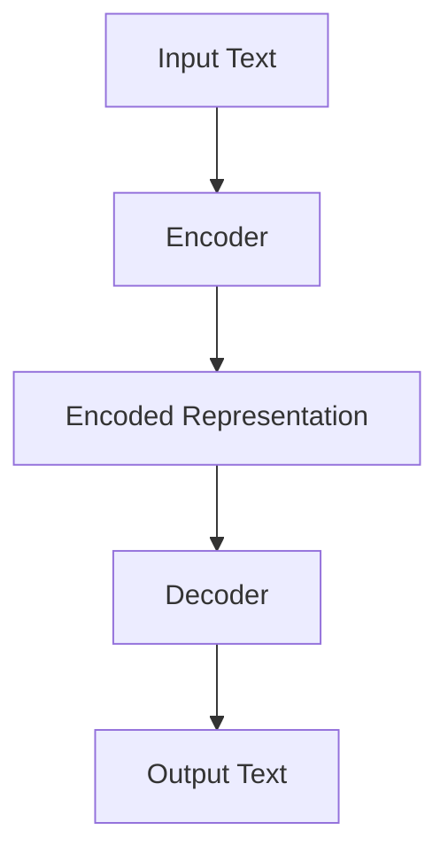

                 

### LLMM Model Overview

#### Background and Definition
The Large Language Model (LLM) is a type of artificial intelligence model that has been trained on vast amounts of text data to generate human-like responses and perform natural language understanding tasks. LLMs have gained significant attention in recent years due to their ability to perform complex language-related tasks such as text generation, translation, and question answering.

The basic structure of an LLM consists of an encoder and a decoder. The encoder processes the input text and generates a fixed-sized vector representation, which captures the semantic information of the text. The decoder then takes this representation and generates the output text.

#### Key Concepts and Connections
1. **Neural Networks**: LLMs are based on deep neural networks, which are composed of multiple layers of interconnected nodes (neurons). Each layer learns to extract higher-level features from the input data.
2. **Attention Mechanism**: LLMs utilize an attention mechanism to focus on different parts of the input text while generating the output, which improves the model's ability to handle long sequences.
3. **Pre-training and Fine-tuning**: LLMs are typically pre-trained on large text corpora and then fine-tuned on specific tasks to improve their performance.

#### Mermaid Flowchart
Below is a Mermaid flowchart illustrating the basic structure and workflow of an LLM:

#### Technical Development History
LLMs have evolved over the years, with several key milestones:

1. **Word2Vec (2013)**: Google introduced Word2Vec, a model that represented words as dense vectors in a high-dimensional space. This was a breakthrough in natural language processing.
2. **GPT (2018)**: OpenAI introduced GPT, a Transformer-based model that used a masked language model (MLM) objective to predict masked tokens in a sequence. GPT-3, its successor, is one of the largest LLMs to date.
3. **BERT (2018)**: Google released BERT, a pre-training method for natural language processing that used a bidirectional Transformer. BERT improved the performance of LLMs on many NLP tasks.
4. **T5 (2019)**: The T5 model, developed by Google, treats all NLP tasks as a text-to-text problem, which simplifies the training and deployment process for LLMs.
5. **LLaMA (2020)**: OpenAI released LLaMA, a series of LLMs with different sizes that demonstrate the potential of scaling up LLMs.

### Conclusion
In this chapter, we have provided an overview of LLMs, including their background, basic structure, key concepts and connections, and their technical development history. Understanding these fundamentals is crucial for comprehending the subsequent chapters on fairness in LLM evaluation and the design of systems to eliminate biases. The Mermaid flowchart and the historical milestones serve as valuable visual aids to help readers grasp the essence of LLMs.

