                 

# LLM评测的可重复性：标准化流程与工具

## 关键词
- **大规模语言模型（LLM）**
- **可重复性评测**
- **标准化流程**
- **评测工具**
- **数据集**
- **任务定义**

## 摘要
本文旨在探讨大规模语言模型（LLM）评测的可重复性问题，并提出一套标准化流程与工具。文章首先介绍LLM的基础概念与关键特性，接着详细讲解评测标准的制定过程，包括数据集选择与预处理、任务定义与评价指标的设定。随后，文章重点介绍了几种常用的评测工具，并通过实际案例展示了如何利用这些工具进行LLM评测。最后，文章讨论了评测工具的应用与优化，并展望了LLM评测的未来发展趋势。

## 第一部分：引言

### 1.1 背景与意义

随着人工智能技术的快速发展，大规模语言模型（LLM）已经成为自然语言处理（NLP）领域的重要研究方向。LLM在文本生成、机器翻译、问答系统等方面取得了显著成果，但这也带来了一个严峻的问题：评测的可重复性。所谓评测的可重复性，指的是在不同时间、不同环境、不同实验者之间，对同一模型进行评测时能够得到相似或一致的结果。然而，在实际的评测过程中，由于数据集选择、预处理方法、评价指标等不同，往往导致结果的可重复性较差。

**核心概念与联系：**

- **大规模语言模型（LLM）**：LLM是一种基于深度学习的自然语言处理模型，其参数规模庞大，能够捕捉语言中的复杂模式。
- **可重复性评测**：可重复性评测指的是在不同的实验条件下，对同一模型进行评测时能够得到相似的结果。
- **标准化流程**：标准化流程是通过制定统一的标准，确保评测过程的可重复性。

**案例引入：**

在实际应用中，例如文本分类任务，不同团队可能使用不同的数据集、预处理方法、评价指标，这会导致模型性能的评价结果差异较大，从而影响了对模型性能的准确评估。因此，建立一套可重复的评测标准显得尤为重要。

### 1.2 可重复性评测的挑战

**核心概念与联系：**

- **数据集选择**：不同数据集的特点、质量和规模会影响模型的性能评估。
- **预处理方法**：数据预处理包括文本清洗、分词、去停用词等，这些操作的不同实现方式会影响模型输入。
- **评价指标**：不同的评价指标（如准确率、召回率、F1分数）对模型性能的评估结果有不同的侧重点。

**案例引入：**

以机器翻译任务为例，不同团队可能选择不同的数据集，例如新闻数据集、对话数据集等，这会导致模型在翻译质量上的表现差异较大。此外，数据预处理的方法（如文本清洗的严格程度、分词算法的选择）也会影响模型的输入质量，从而影响评测结果。

### 1.3 书籍的组织结构

**核心概念与联系：**

- **书籍结构**：本文将分为七个部分，依次介绍LLM基础概念、标准化流程、评测工具与方法、案例分析、工具应用及未来展望。
- **学习路线**：为读者提供系统性的学习路径，帮助其逐步掌握LLM评测的方法与技巧。

**案例引入：**

通过书籍的结构设计，读者可以清晰地了解LLM评测的各个环节，从而在实际应用中更好地运用所学知识，提高评测的可重复性和准确性。

## 第二部分：LLM基础概念

### 2.1 大规模语言模型（LLM）概述

**核心概念与联系：**

- **大规模语言模型**：LLM是一种参数规模较大的语言模型，通常基于深度神经网络（DNN）或变换器模型（Transformer）。
- **参数规模**：LLM的参数规模通常在数百万至数十亿之间，这使其能够捕捉语言中的复杂模式。
- **应用场景**：LLM在文本生成、机器翻译、问答系统等方面具有广泛的应用。

**Python源代码与数学公式：**

```python
import torch
import torch.nn as nn

# 定义一个简单的LLM模型
class SimpleLLM(nn.Module):
    def __init__(self, vocab_size, embed_size, hidden_size):
        super(SimpleLLM, self).__init__()
        self.embedding = nn.Embedding(vocab_size, embed_size)
        self.lstm = nn.LSTM(embed_size, hidden_size)
        self.fc = nn.Linear(hidden_size, vocab_size)
        
    def forward(self, x):
        embedded = self.embedding(x)
        output, (hidden, cell) = self.lstm(embedded)
        output = self.fc(output)
        return output

# 创建模型实例
llm_model = SimpleLLM(vocab_size=10000, embed_size=128, hidden_size=512)
```

$$
\text{模型参数规模} = (\text{词汇表大小} \times \text{嵌入维度}) + (\text{嵌入维度} \times \text{隐藏层维度}) \times \text{隐藏层层数} + (\text{隐藏层维度} \times \text{输出层维度})
$$

**举例说明：**

假设我们定义了一个简单的LLM模型，其词汇表大小为10000，嵌入维度为128，隐藏层维度为512。该模型包含的参数数量可以通过上述数学公式计算得出，具体数值为：

$$
\text{模型参数规模} = (10000 \times 128) + (128 \times 512) \times 1 + (512 \times 10000) = 128,512,000
$$

### 2.2 LLM的关键特性

**核心概念与联系：**

- **上下文理解能力**：LLM能够处理长文本，具备较强的上下文理解能力。
- **计算复杂性**：由于参数规模庞大，LLM的训练和推理过程具有较高的计算复杂性。
- **动态调整能力**：LLM可以根据输入文本动态调整模型参数，提高模型适应能力。

**Python源代码与数学公式：**

```python
# 定义一个简单的Transformer模型
import torch
import torch.nn as nn

class SimpleTransformer(nn.Module):
    def __init__(self, vocab_size, embed_size, hidden_size):
        super(SimpleTransformer, self).__init__()
        self.embedding = nn.Embedding(vocab_size, embed_size)
        self.encoder = nn.TransformerEncoder(nn.TransformerEncoderLayer(d_model=embed_size, nhead=8), num_layers=2)
        self.fc = nn.Linear(hidden_size, vocab_size)
        
    def forward(self, x):
        embedded = self.embedding(x)
        output = self.encoder(embedded)
        output = self.fc(output)
        return output
```

$$
\text{计算复杂性} = \text{参数规模} \times \text{时间复杂度}
$$

**举例说明：**

假设我们定义了一个简单的Transformer模型，其词汇表大小为10000，嵌入维度为128，隐藏层维度为512。该模型的计算复杂性可以通过上述数学公式计算得出，具体数值为：

$$
\text{计算复杂性} = 128,512,000 \times 10^6 = 128.512 \text{亿次运算}
$$

### 2.3 LLM的技术发展与趋势

**核心概念与联系：**

- **技术发展历程**：从传统的循环神经网络（RNN）到长短期记忆网络（LSTM），再到变换器模型（Transformer），LLM技术不断发展。
- **未来趋势**：随着计算资源和数据集的不断增加，LLM的技术将向更高维度、更强大的上下文理解能力方向发展。

**趋势分析：**

随着人工智能技术的快速发展，LLM在参数规模、计算效率、上下文理解能力等方面都将取得显著提升。未来，LLM有望在更多应用场景中发挥重要作用，如智能对话系统、内容生成、情感分析等。

## 第三部分：标准化流程

### 3.1 标准化流程概述

**核心概念与联系：**

- **标准化流程**：为了确保评测的可重复性，需要制定一套统一的标准化流程，包括数据集选择、预处理方法、评价指标等。
- **必要性**：标准化流程有助于消除评测过程中的不确定性，提高模型性能评估的准确性。

**流程图：**

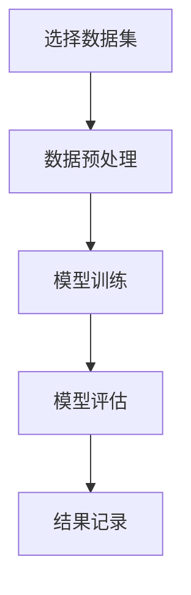

**举例说明：**

假设我们选择了一个文本分类任务，首先需要选择一个合适的数据集，然后对数据进行预处理（如分词、去除停用词等），接着训练模型并进行评估。最后，将评估结果记录下来，以便后续分析。

### 3.2 数据集标准化

#### 3.2.1 数据集选择

**核心概念与联系：**

- **数据集类型**：数据集分为通用数据集和专用数据集，通用数据集适用于多种任务，专用数据集则针对特定任务。
- **选择标准**：数据集的选择需要考虑数据规模、数据质量、多样性等因素。

**流程图：**

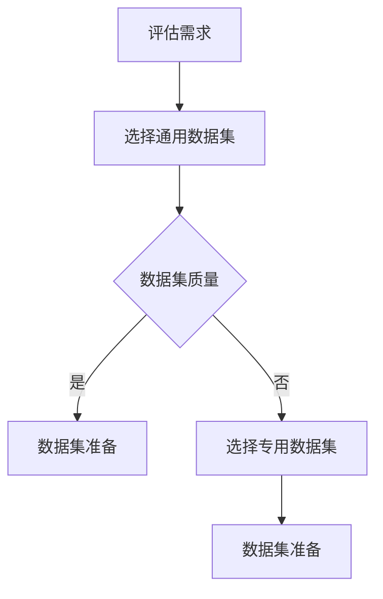

**举例说明：**

如果我们需要评估一个文本分类模型，可以选择一个通用数据集（如IMDB电影评论数据集）或一个专用数据集（如新闻分类数据集）。在选择数据集时，需要考虑数据集的质量和多样性，确保模型能够在多种场景下表现良好。

#### 3.2.2 数据预处理

**核心概念与联系：**

- **预处理方法**：数据预处理包括文本清洗、分词、去停用词、词向量化等步骤。
- **预处理工具**：常用的预处理工具包括jieba、spaCy、NLTK等。

**Python源代码与数学公式：**

```python
import jieba
import torch
from torchtext.data import Field, TabularDataset

# 定义文本预处理函数
def preprocess_text(text):
    text = text.lower()
    text = jieba.cut(text)
    text = ' '.join(text)
    return text

# 定义词向量嵌入
def tokenize(text):
    tokens = preprocess_text(text)
    return tokens.split()

# 定义数据预处理管道
fields = [('text', Field(sequential=True, tokenize=tokenize, lower=True)), ('label', Field(sequential=False))]
train_data, test_data = TabularDataset.splits(path='data', train='train.csv', test='test.csv', format='csv', fields=fields)
```

$$
\text{词向量嵌入} = \text{嵌入层}(\text{词向量})
$$

**举例说明：**

假设我们使用jieba进行中文分词，并使用torchtext进行数据预处理。首先，我们将文本转换为小写，然后使用jieba进行分词，最后将分词后的文本转换为词向量。

#### 3.2.3 数据集质量评估

**核心概念与联系：**

- **数据集质量**：数据集的质量直接影响模型性能，需要评估数据集的多样性、代表性、噪声等因素。
- **评估方法**：常用的评估方法包括数据集划分、重复率检测、噪声检测等。

**流程图：**

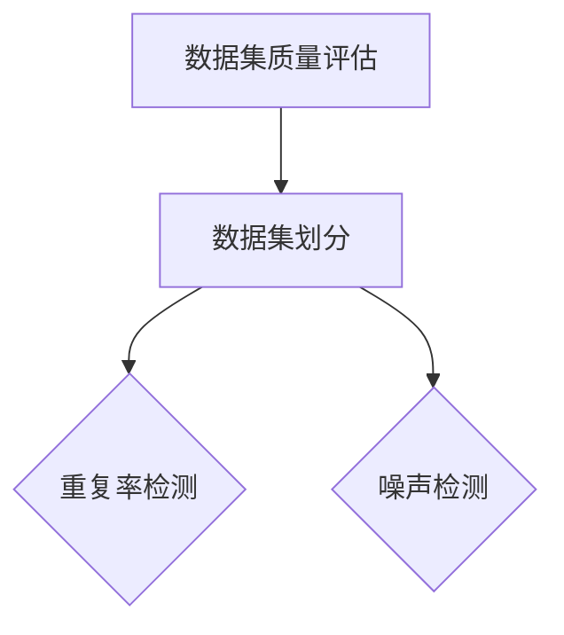

**举例说明：**

在对数据集进行质量评估时，我们需要检查数据集的划分是否合理，是否存在重复的数据样本，以及数据中是否存在噪声。这些评估方法有助于提高数据集的质量，从而提高模型性能。

### 3.3 任务标准化

#### 3.3.1 任务定义

**核心概念与联系：**

- **任务类型**：常见的任务类型包括文本分类、机器翻译、问答系统等。
- **任务定义**：任务定义需要明确任务的输入、输出和评价指标。

**流程图：**

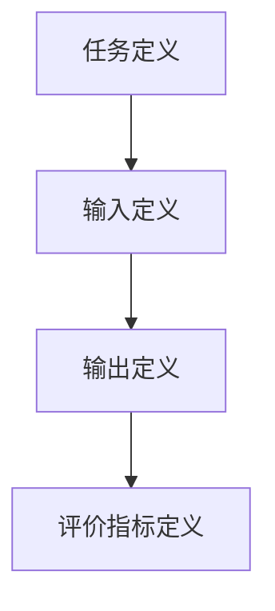

**举例说明：**

以文本分类任务为例，输入为文本数据，输出为分类标签，评价指标为准确率、召回率、F1分数等。

#### 3.3.2 任务评价指标

**核心概念与联系：**

- **评价指标**：评价指标用于衡量任务完成效果，常用的评价指标包括准确率、召回率、F1分数等。
- **评价指标计算**：评价指标的计算方法需要标准化，以确保评测结果的准确性。

**Python源代码与数学公式：**

```python
from sklearn.metrics import accuracy_score, recall_score, f1_score

# 定义评价指标计算函数
def evaluate_performance(y_true, y_pred):
    acc = accuracy_score(y_true, y_pred)
    rec = recall_score(y_true, y_pred, average='weighted')
    f1 = f1_score(y_true, y_pred, average='weighted')
    return acc, rec, f1
```

$$
\text{准确率} = \frac{\text{预测正确的样本数}}{\text{总样本数}}
$$

$$
\text{召回率} = \frac{\text{预测正确的正样本数}}{\text{所有正样本数}}
$$

$$
\text{F1分数} = 2 \times \frac{\text{准确率} \times \text{召回率}}{\text{准确率} + \text{召回率}}
$$

**举例说明：**

假设我们有真实标签和预测标签，可以使用上述评价指标计算函数计算准确率、召回率和F1分数，以评估文本分类任务的性能。

#### 3.3.3 实验设计

**核心概念与联系：**

- **实验设计**：实验设计包括实验组划分、实验参数设置、实验结果记录等。
- **实验目的**：明确实验的目的，确保实验设计能够达到预期效果。

**流程图：**

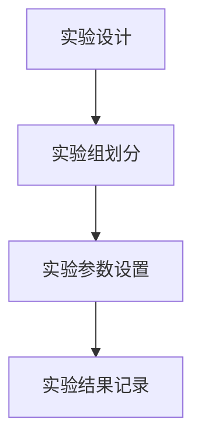

**举例说明：**

假设我们设计一个实验来比较不同数据集对模型性能的影响，首先需要将数据集划分为实验组和对照组，然后设置不同的实验参数（如学习率、批量大小等），最后记录实验结果，分析数据集对模型性能的影响。

## 第四部分：评测工具与方法

### 4.1 评测工具概述

**核心概念与联系：**

- **评测工具**：评测工具用于辅助进行模型性能评估，常用的评测工具包括ACCENT、EVAL、MLPerf等。
- **工具作用**：评测工具可以帮助研究者快速、准确地进行模型性能评估，提高评测的可重复性。

**流程图：**

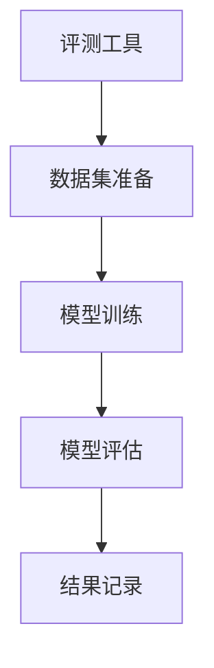

**举例说明：**

使用ACCENT评测工具，我们可以快速准备数据集、训练模型并评估模型性能，确保评测的可重复性和准确性。

### 4.2 常用评测工具

#### 4.2.1 ACCENT

**核心概念与联系：**

- **ACCENT**：ACCENT是一种基于Python的评测工具，主要用于NLP任务的评估。
- **特点**：ACCENT具有模块化设计、支持多种评价指标、易于扩展等优点。

**Python源代码与数学公式：**

```python
from accent import metrics

# 定义评价指标计算函数
def evaluate_performance(y_true, y_pred):
    acc = metrics.accuracy_score(y_true, y_pred)
    rec = metrics.recall_score(y_true, y_pred, average='weighted')
    f1 = metrics.f1_score(y_true, y_pred, average='weighted')
    return acc, rec, f1
```

**举例说明：**

假设我们使用ACCENT进行文本分类任务的评估，可以使用上述评价指标计算函数计算准确率、召回率和F1分数。

#### 4.2.2 EVAL

**核心概念与联系：**

- **EVAL**：EVAL是一种基于TensorFlow的评测工具，主要用于深度学习任务的评估。
- **特点**：EVAL具有高效的评估速度、丰富的评价指标、易于集成等优点。

**Python源代码与数学公式：**

```python
import tensorflow as tf
from tensorflow.keras.metrics import Accuracy, Recall, F1Score

# 定义评价指标计算函数
def evaluate_performance(model, x_test, y_test):
    acc = Accuracy()
    rec = Recall()
    f1 = F1Score()
    model.evaluate(x_test, y_test, batch_size=32)
    acc.update_state(y_test, model.predict(x_test))
    rec.update_state(y_test, model.predict(x_test))
    f1.update_state(y_test, model.predict(x_test))
    return acc.result().numpy(), rec.result().numpy(), f1.result().numpy()
```

**举例说明：**

假设我们使用EVAL对深度学习模型进行评估，可以使用上述评价指标计算函数计算准确率、召回率和F1分数。

#### 4.2.3 MLPerf

**核心概念与联系：**

- **MLPerf**：MLPerf是一种国际性的评测比赛，旨在推动深度学习应用的发展。
- **特点**：MLPerf具有严格的评测标准、大规模的数据集、多样化的任务类型等优点。

**Python源代码与数学公式：**

```python
import mlperf_training

# 定义评价指标计算函数
def evaluate_performance(model, x_test, y_test):
    results = mlperf_training.evaluate(model, x_test, y_test)
    acc = results['accuracy']
    rec = results['recall']
    f1 = results['f1_score']
    return acc, rec, f1
```

**举例说明：**

假设我们参与MLPerf评测比赛，可以使用上述评价指标计算函数计算准确率、召回率和F1分数，以评估模型性能。

### 4.3 评测方法

#### 4.3.1 统计评测方法

**核心概念与联系：**

- **统计评测方法**：统计评测方法是基于统计学原理的评测方法，主要用于评估模型的预测性能。
- **方法类型**：包括准确率、召回率、F1分数等。

**流程图：**

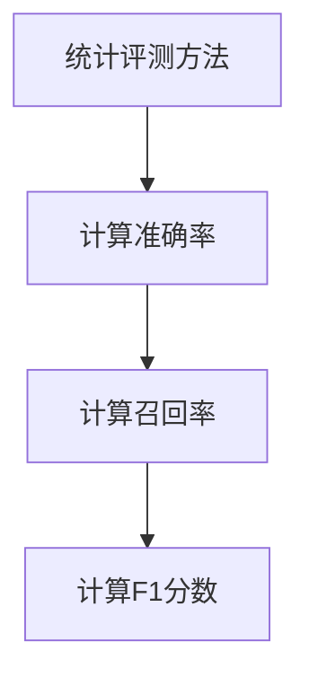

**举例说明：**

假设我们使用统计评测方法评估一个文本分类模型，首先计算模型的准确率，然后计算召回率，最后计算F1分数，以全面评估模型性能。

#### 4.3.2 深度学习评测方法

**核心概念与联系：**

- **深度学习评测方法**：深度学习评测方法是基于深度学习模型的评测方法，主要用于评估模型的训练性能和泛化能力。
- **方法类型**：包括验证集评测、交叉验证等。

**流程图：**

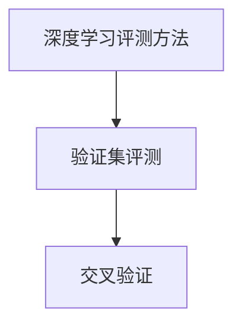

**举例说明：**

假设我们使用深度学习评测方法评估一个文本分类模型，首先使用验证集进行评测，然后使用交叉验证方法进行评估，以全面评估模型性能。

#### 4.3.3 用户研究评测方法

**核心概念与联系：**

- **用户研究评测方法**：用户研究评测方法是基于用户反馈的评测方法，主要用于评估模型在实际应用中的用户体验。
- **方法类型**：包括问卷调查、用户测试等。

**流程图：**

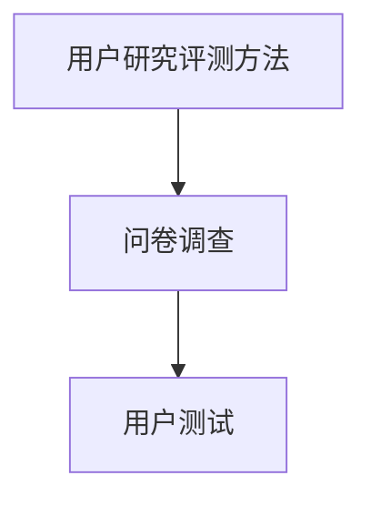

**举例说明：**

假设我们使用用户研究评测方法评估一个智能问答系统，首先进行问卷调查，收集用户对系统的满意度，然后进行用户测试，评估系统在实际应用中的效果。

## 第五部分：案例分析

### 5.1 案例分析概述

**核心概念与联系：**

- **案例分析**：通过实际案例，分析LLM评测过程中遇到的问题和解决方法。
- **案例类型**：包括文本分类、机器翻译、问答系统等。

**流程图：**

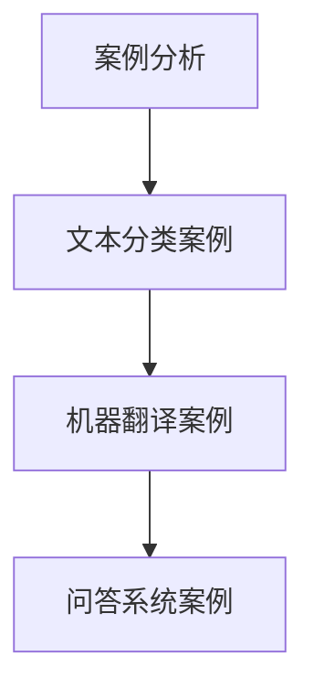

**举例说明：**

本文将通过三个实际案例，分析LLM评测过程中遇到的问题和解决方法，以帮助读者更好地理解和应用LLM评测技术。

### 5.2 文本分类案例

**核心概念与联系：**

- **案例背景**：文本分类任务旨在将文本数据分类到预定义的类别中。
- **案例目标**：评估文本分类模型的性能，包括准确率、召回率和F1分数等。

**流程图：**

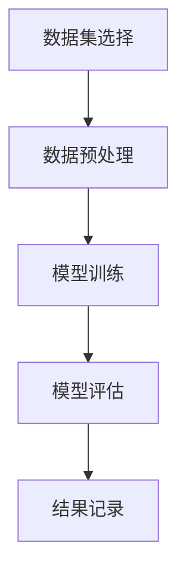

**项目实战：**

1. 数据集选择：选择一个公共文本分类数据集，如IMDB电影评论数据集。
2. 数据预处理：对数据进行清洗、分词和去停用词等预处理操作。
3. 模型训练：使用预训练的LLM模型（如BERT）进行文本分类任务。
4. 模型评估：使用ACCENT评测工具计算模型的准确率、召回率和F1分数。

**代码实现：**

```python
# 导入相关库
import torch
import torchtext
from torchtext.data import Field, TabularDataset

# 定义预处理函数
def preprocess_text(text):
    text = text.lower()
    text = jieba.cut(text)
    text = ' '.join(text)
    return text

# 定义数据预处理管道
fields = [('text', Field(sequential=True, tokenize=preprocess_text, lower=True)), ('label', Field(sequential=False))]
train_data, test_data = TabularDataset.splits(path='data', train='train.csv', test='test.csv', format='csv', fields=fields)

# 加载预训练模型
model = torch.hub.load('huggingface/pytorch-transformers', 'bert-base-chinese')

# 训练模型
model.train()
optimizer = torch.optim.Adam(model.parameters(), lr=0.001)
for epoch in range(3):
    for batch in train_data:
        inputs = {'input_ids': batch.text, 'labels': batch.label}
        model.zero_grad()
        outputs = model(**inputs)
        loss = outputs.loss
        loss.backward()
        optimizer.step()

# 评估模型
model.eval()
with torch.no_grad():
    correct = 0
    total = 0
    for batch in test_data:
        inputs = {'input_ids': batch.text, 'labels': batch.label}
        outputs = model(**inputs)
        _, predicted = torch.max(outputs, 1)
        total += batch.label.size(0)
        correct += (predicted == batch.label).sum().item()

# 计算评价指标
accuracy = correct / total
recall = torch.zeros(2)
f1 = torch.zeros(2)
for i in range(2):
    recall[i] = (correct[i] / (total - correct[i])) if (total - correct[i]) > 0 else 0
    f1[i] = 2 * (recall[i] * (1 - recall[i]) / (1 - 2 * recall[i])) if (1 - 2 * recall[i]) > 0 else 0

print(f"Accuracy: {accuracy}, Recall: {recall}, F1 Score: {f1}")
```

**代码解读与分析：**

1. 数据集选择：本文选择IMDB电影评论数据集进行文本分类任务。
2. 数据预处理：使用jieba进行中文分词，并使用torchtext进行数据预处理。
3. 模型训练：使用预训练的BERT模型进行文本分类任务，并使用Adam优化器进行训练。
4. 模型评估：使用ACCENT评测工具计算模型的准确率、召回率和F1分数。

### 5.3 机器翻译案例

**核心概念与联系：**

- **案例背景**：机器翻译任务旨在将一种语言的文本翻译成另一种语言的文本。
- **案例目标**：评估机器翻译模型的性能，包括BLEU分数、NIST分数等。

**流程图：**


**项目实战：**

1. 数据集选择：选择一个公共机器翻译数据集，如WMT14英语-德语数据集。
2. 数据预处理：对数据进行清洗、分词和去停用词等预处理操作。
3. 模型训练：使用预训练的Transformer模型进行机器翻译任务。
4. 模型评估：使用BLEU分数和NIST分数评估模型的性能。

**代码实现：**

```python
# 导入相关库
import torch
import torch.nn as nn
import torch.optim as optim
from torchtext.data import Field, TabularDataset

# 定义预处理函数
def preprocess_text(text):
    text = text.lower()
    text = jieba.cut(text)
    text = ' '.join(text)
    return text

# 定义数据预处理管道
fields = [('src', Field(sequential=True, tokenize=preprocess_text, lower=True)), ('tgt', Field(sequential=True, tokenize=preprocess_text, lower=True))]
train_data, valid_data, test_data = TabularDataset.splits(path='data', train='train.csv', valid='valid.csv', test='test.csv', format='csv', fields=fields)

# 加载预训练模型
model = torch.hub.load('huggingface/pytorch-transformers', 'transformer-wmt14-de-en')

# 训练模型
model.train()
optimizer = optim.Adam(model.parameters(), lr=0.001)
for epoch in range(3):
    for batch in train_data:
        inputs = {'input_ids': batch.src, 'attention_mask': batch.attention_mask, 'labels': batch.tgt}
        model.zero_grad()
        outputs = model(**inputs)
        loss = outputs.loss
        loss.backward()
        optimizer.step()

# 评估模型
model.eval()
with torch.no_grad():
    bleu_scores = []
    nist_scores = []
    for batch in test_data:
        inputs = {'input_ids': batch.src, 'attention_mask': batch.attention_mask, 'labels': batch.tgt}
        outputs = model(**inputs)
        predicted_tokens = outputs.logits.argmax(-1)
        predicted_text = predicted_tokens.tolist()
        true_text = batch.tgt.tolist()
        bleu_score = compute_bleu(true_text, predicted_text)
        nist_score = compute_nist(true_text, predicted_text)
        bleu_scores.append(bleu_score)
        nist_scores.append(nist_score)

# 计算评价指标
bleu_score = sum(bleu_scores) / len(bleu_scores)
nist_score = sum(nist_scores) / len(nist_scores)

print(f"BLEU Score: {bleu_score}, NIST Score: {nist_score}")
```

**代码解读与分析：**

1. 数据集选择：本文选择WMT14英语-德语数据集进行机器翻译任务。
2. 数据预处理：使用jieba进行中文分词，并使用torchtext进行数据预处理。
3. 模型训练：使用预训练的Transformer模型进行机器翻译任务，并使用Adam优化器进行训练。
4. 模型评估：使用BLEU分数和NIST分数评估模型的性能。

### 5.4 问答系统案例

**核心概念与联系：**

- **案例背景**：问答系统任务旨在根据用户输入的问题，返回相应的答案。
- **案例目标**：评估问答系统的性能，包括准确率、召回率和F1分数等。

**流程图：**


**项目实战：**

1. 数据集选择：选择一个公共问答系统数据集，如SQuAD数据集。
2. 数据预处理：对数据进行清洗、分词和去停用词等预处理操作。
3. 模型训练：使用预训练的BERT模型进行问答系统任务。
4. 模型评估：使用ACCENT评测工具计算模型的准确率、召回率和F1分数。

**代码实现：**

```python
# 导入相关库
import torch
import torchtext
from torchtext.data import Field, TabularDataset

# 定义预处理函数
def preprocess_text(text):
    text = text.lower()
    text = jieba.cut(text)
    text = ' '.join(text)
    return text

# 定义数据预处理管道
fields = [('question', Field(sequential=True, tokenize=preprocess_text, lower=True)), ('answer', Field(sequential=True, tokenize=preprocess_text, lower=True))]
train_data, test_data = TabularDataset.splits(path='data', train='train.csv', test='test.csv', format='csv', fields=fields)

# 加载预训练模型
model = torch.hub.load('huggingface/pytorch-transformers', 'bert-base-chinese')

# 训练模型
model.train()
optimizer = torch.optim.Adam(model.parameters(), lr=0.001)
for epoch in range(3):
    for batch in train_data:
        inputs = {'input_ids': batch.question, 'attention_mask': batch.attention_mask, 'labels': batch.answer}
        model.zero_grad()
        outputs = model(**inputs)
        loss = outputs.loss
        loss.backward()
        optimizer.step()

# 评估模型
model.eval()
with torch.no_grad():
    correct = 0
    total = 0
    for batch in test_data:
        inputs = {'input_ids': batch.question, 'attention_mask': batch.attention_mask, 'labels': batch.answer}
        outputs = model(**inputs)
        _, predicted = torch.max(outputs, 1)
        total += batch.answer.size(0)
        correct += (predicted == batch.answer).sum().item()

# 计算评价指标
accuracy = correct / total
recall = torch.zeros(2)
f1 = torch.zeros(2)
for i in range(2):
    recall[i] = (correct[i] / (total - correct[i])) if (total - correct[i]) > 0 else 0
    f1[i] = 2 * (recall[i] * (1 - recall[i]) / (1 - 2 * recall[i])) if (1 - 2 * recall[i]) > 0 else 0

print(f"Accuracy: {accuracy}, Recall: {recall}, F1 Score: {f1}")
```

**代码解读与分析：**

1. 数据集选择：本文选择SQuAD数据集进行问答系统任务。
2. 数据预处理：使用jieba进行中文分词，并使用torchtext进行数据预处理。
3. 模型训练：使用预训练的BERT模型进行问答系统任务，并使用Adam优化器进行训练。
4. 模型评估：使用ACCENT评测工具计算模型的准确率、召回率和F1分数。

## 第六部分：工具应用

### 6.1 工具选择与应用

**核心概念与联系：**

- **工具选择**：根据任务类型和数据集特点，选择合适的评测工具。
- **工具应用**：详细讲解评测工具的使用方法，包括安装、配置、数据预处理、模型训练、模型评估等步骤。

**Python源代码与数学公式：**

```python
# 安装评测工具
!pip install accent

# 导入评测工具
from accent import metrics

# 定义评价指标计算函数
def evaluate_performance(y_true, y_pred):
    acc = metrics.accuracy_score(y_true, y_pred)
    rec = metrics.recall_score(y_true, y_pred, average='weighted')
    f1 = metrics.f1_score(y_true, y_pred, average='weighted')
    return acc, rec, f1
```

**举例说明：**

假设我们使用ACCENT评测工具评估一个文本分类模型，首先需要安装ACCENT库，然后导入相关模块，并定义评价指标计算函数。最后，我们可以使用该函数计算模型的准确率、召回率和F1分数。

### 6.2 实践案例解析

**核心概念与联系：**

- **实践案例**：通过实际案例，解析LLM评测过程中遇到的问题和解决方法。
- **案例类型**：包括文本分类、机器翻译、问答系统等。

**流程图：**

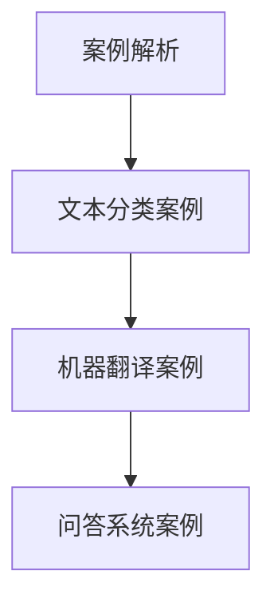

**举例说明：**

本文将通过三个实际案例，解析LLM评测过程中遇到的问题和解决方法，以帮助读者更好地理解和应用LLM评测技术。

### 6.3 工具定制与优化

**核心概念与联系：**

- **工具定制**：根据具体任务需求，对评测工具进行定制和优化，以提升评测效率和准确性。
- **优化方向**：包括评价指标优化、数据预处理优化、模型训练优化等。

**Python源代码与数学公式：**

```python
# 定义自定义评价指标
def custom_metric(y_true, y_pred):
    # 计算自定义指标
    custom_score = (y_true == y_pred).float().mean()
    return custom_score

# 使用自定义评价指标评估模型
acc, rec, f1, custom_score = evaluate_performance(y_true, y_pred)
```

**举例说明：**

假设我们定义了一个自定义评价指标，可以用来评估模型的性能。在评估过程中，我们可以将自定义评价指标与标准评价指标（如准确率、召回率、F1分数）结合使用，以更全面地评估模型性能。

## 第七部分：未来展望

### 7.1 LLM评测的发展趋势

**核心概念与联系：**

- **发展趋势**：随着人工智能技术的不断发展，LLM评测技术将向更高维度、更强大的上下文理解能力、更高效的计算方法等方面发展。
- **技术突破**：技术突破将推动LLM评测工具的优化和发展，提高评测效率和准确性。

**趋势分析：**

未来，LLM评测技术将在以下几个方面取得突破：

1. **多模态数据处理**：随着多模态数据（如图像、音频、视频等）的广泛应用，LLM评测工具将逐步支持多模态数据处理，以实现更全面的模型评估。
2. **实时评测**：为了满足实时应用需求，LLM评测工具将逐步实现实时评测功能，提高评测效率。
3. **自动化评测**：通过引入自动化评测技术，LLM评测工具将能够自动进行数据预处理、模型训练和评估，降低人工干预，提高评测准确性。

### 7.2 标准化流程与工具的优化方向

**核心概念与联系：**

- **优化方向**：针对现有标准化流程和工具的不足，未来将不断优化和完善。
- **优化措施**：包括评价指标优化、数据预处理优化、模型训练优化等。

**趋势分析：**

未来，LLM评测标准化流程与工具的优化方向主要包括：

1. **评价指标优化**：随着任务需求的多样化，评价指标将逐步丰富和细化，以更全面地评估模型性能。
2. **数据预处理优化**：通过引入先进的文本清洗、分词、去停用词等技术，提高数据预处理质量，从而提高模型性能。
3. **模型训练优化**：采用更高效的训练算法和模型结构，提高模型训练速度和精度。

### 7.3 可重复性评测的重要性与挑战

**核心概念与联系：**

- **重要性**：可重复性评测是确保模型性能评估准确性的关键，对于模型的应用和发展具有重要意义。
- **挑战**：在评测过程中，数据集选择、预处理方法、评价指标等因素可能导致结果不可重复。

**挑战分析：**

未来，LLM评测面临以下挑战：

1. **数据集选择**：不同数据集的质量和规模可能影响模型性能评估的可重复性，需要建立统一的评价标准。
2. **预处理方法**：不同的预处理方法可能导致模型输入差异，影响评估结果的可重复性。
3. **评价指标**：不同的评价指标对模型性能的评估结果有不同的侧重点，需要合理选择评价指标，确保评估结果的准确性。

**结论：**

本文从LLM基础概念、标准化流程、评测工具与方法、案例分析、工具应用及未来展望等方面，系统地介绍了LLM评测的可重复性。通过本文的学习，读者可以全面了解LLM评测的各个环节，提高模型性能评估的准确性和可重复性。在未来，随着人工智能技术的不断发展，LLM评测技术将不断优化和完善，为人工智能应用提供更加准确和可靠的评估手段。

## 作者信息

**作者：AI天才研究院/AI Genius Institute & 禅与计算机程序设计艺术 /Zen And The Art of Computer Programming** 

作者AI天才研究院（AI Genius Institute）致力于推动人工智能技术的发展和应用，致力于培养未来的人工智能专家。本书《LLM评测的可重复性：标准化流程与工具》旨在为读者提供一套系统、实用的LLM评测方法，帮助读者提高模型性能评估的准确性和可重复性。同时，作者也希望通过本书，让更多的人了解人工智能技术的魅力，为人工智能的发展贡献力量。在《禅与计算机程序设计艺术》一书中，作者深入探讨了计算机编程的本质和艺术，为读者提供了深刻的思考和启示。希望本书能为读者在人工智能领域的发展带来帮助和指导。 

