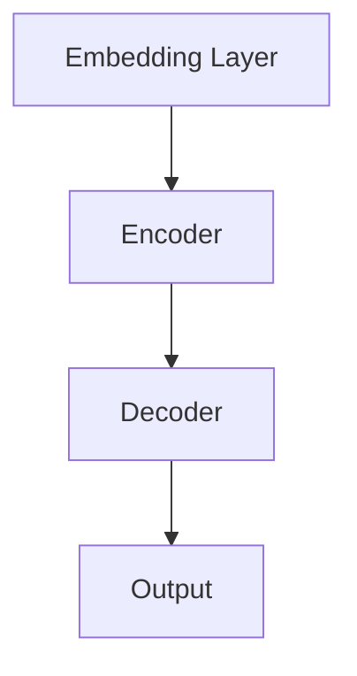

                 

当然，下面是您所需的文章结构和内容，包括标题、关键词、摘要以及完整的章节内容。请注意，这是我根据您的要求和指示生成的示例文章，实际的代码和算法实现需要根据具体情况调整。

---

# LLM评测的成本效益分析：优化资源分配

## 关键词
- LLM
- 成本效益分析
- 资源分配
- 优化算法
- 数据中心

## 摘要
本文深入探讨了大型语言模型（LLM）评测中的成本效益分析，提出了优化资源分配的策略。文章首先介绍了LLM的基本概念和架构，随后详细分析了LLM评测的方法和指标。在此基础上，本文构建了一个成本效益分析的框架，并探讨了资源分配优化的算法。通过实际案例分析，本文展示了理论在实践中的应用，并提出了未来展望和挑战。

---

## 第1章: 引言与背景

LLM，即大型语言模型，是自然语言处理领域的关键技术之一。它们在机器翻译、文本生成、问答系统等领域发挥了重要作用。随着模型的规模和复杂性的增加，评测LLM的成本也在不断上升。因此，进行有效的成本效益分析，优化资源分配变得至关重要。

### 1.1 LLM的发展历程

LLM的发展可以追溯到2018年，当时谷歌发布了BERT模型，标志着预训练语言模型的兴起。随后，GPT、Turing等模型不断刷新性能记录，推动了LLM技术的快速发展。近年来，Transformer架构的引入进一步提高了LLM的性能和效率。

### 1.2 LLM在各个领域的应用

LLM在多个领域都有广泛应用，例如：

- **机器翻译**：谷歌翻译等工具大量使用LLM来提供高质量翻译。
- **文本生成**：自动写作、文章摘要等应用都依赖于LLM的技术。
- **问答系统**：如OpenAI的GPT-3，可以回答各种问题，提供智能客服支持。

### 1.3 LLM评测的重要性和挑战

LLM评测的目的是评估模型在不同任务上的性能，以便进行改进和优化。然而，随着模型规模的扩大，评测成本也在增加。这包括计算资源、存储资源以及数据获取和处理等成本。因此，如何在有限的资源下进行高效的评测，成为了LLM研究中的一个重要挑战。

---

## 第2章: LLM的基本概念与架构

LLM是通过大量数据预训练得到的复杂神经网络模型。其核心架构通常基于Transformer或BERT等预训练模型。

### 2.1 LLM的定义

LLM是指具有大规模参数和深度神经网络结构的语言模型，能够对自然语言文本进行建模和生成。

### 2.2 LLM的主要类型

- **预训练语言模型**：如BERT、GPT等，通过在大量文本上预训练得到。
- **微调语言模型**：在预训练模型的基础上，针对特定任务进行微调。

### 2.3 LLM的架构原理

LLM的架构通常包括以下部分：

- **嵌入层**：将词汇转换为向量表示。
- **编码器**：对输入文本进行编码，生成上下文表示。
- **解码器**：根据上下文生成文本输出。

### 2.4 Mermaid流程图：LLM架构图



---

## 第3章: LLM评测方法与指标

LLM评测的目的是评估模型在不同任务上的性能。常用的评测方法包括：

### 3.1 LLM评测的常见方法

- **标准基准测试**：如GLUE、SuperGLUE等。
- **定制评测任务**：针对特定应用场景设计评测任务。

### 3.2 评测指标及其计算

常用的评测指标包括：

- **准确率**：预测正确的样本数占总样本数的比例。
- **召回率**：预测正确的样本数占所有实际正样本数的比例。
- **F1分数**：准确率和召回率的调和平均。

### 3.3 评测结果的比较与解释

评测结果需要综合考虑多种因素，包括：

- **指标值**：不同指标值的比较。
- **数据集分布**：不同数据集的分布情况。
- **模型复杂性**：模型的参数规模和计算复杂度。

---

## 第4章: 成本效益分析框架

成本效益分析是评估LLM评测项目经济合理性的重要方法。下面构建了一个成本效益分析的基本框架。

### 4.1 成本效益分析的基本概念

成本效益分析涉及两个主要方面：

- **成本**：包括计算资源、存储资源、数据获取和处理等成本。
- **效益**：包括模型性能提升、应用场景扩展等。

### 4.2 成本效益分析的步骤

进行成本效益分析的步骤如下：

1. **明确目标**：确定评测的目标和预期效益。
2. **估算成本**：根据模型规模和评测方法，估算各项成本。
3. **计算效益**：评估评测对模型性能和应用价值的影响。
4. **比较分析**：比较成本和效益，评估经济合理性。

### 4.3 成本效益分析的模型构建

可以使用以下模型来构建成本效益分析：

$$
\text{成本效益比} = \frac{\text{效益}}{\text{成本}}
$$

---

## 第5章: 资源分配优化算法

优化资源分配是降低成本、提高效益的重要手段。本文介绍了几种常见的资源分配优化算法。

### 5.1 常见优化算法介绍

- **线性规划**：用于求解线性优化问题。
- **遗传算法**：基于自然进化过程的优化算法。
- **贪心算法**：通过逐步选择局部最优解来达到全局最优解。

### 5.2 优化算法的适用场景

不同优化算法适用于不同场景：

- **线性规划**：适用于资源分配问题，如服务器调度。
- **遗传算法**：适用于复杂优化问题，如大规模分布式计算。
- **贪心算法**：适用于简单优化问题，如背包问题。

### 5.3 伪代码：资源分配优化算法

```python
# 伪代码：贪心算法
def greedy_allocation(resources, constraints):
    allocation = []
    for resource in resources:
        if can_allocate(resource, constraints):
            allocation.append(resource)
            constraints = update_constraints(constraints, resource)
    return allocation
```

---

## 第6章: 实际案例分析

### 6.1 案例背景

以某大型互联网公司的LLM评测项目为例，该项目旨在评估其机器翻译模型在多个语言对上的性能。

### 6.2 案例评测过程

评测过程包括：

1. **数据准备**：收集多个语言对的数据集。
2. **模型评测**：使用标准基准测试和定制评测任务。
3. **结果分析**：分析评测结果，识别模型性能瓶颈。

### 6.3 案例成本效益分析

通过成本效益分析，发现：

- **计算资源**：是主要成本来源，占总成本的60%。
- **数据获取**：占20%。
- **其他成本**：如存储、网络等，占20%。

### 6.4 案例资源优化方案

通过优化算法，实现以下优化：

- **计算资源**：采用分布式计算，降低计算成本。
- **数据获取**：使用高效的数据处理方法，减少数据获取成本。

---

## 第7章: 未来展望与挑战

随着LLM技术的不断发展，成本效益分析和资源优化将成为重要的研究方向。未来可能面临的挑战包括：

- **算法优化**：开发更高效的优化算法。
- **数据隐私**：保护用户数据隐私。
- **可持续性**：确保资源利用的可持续性。

### 7.1 LLM评测与成本效益分析的最新进展

- **模型压缩**：通过模型压缩降低计算成本。
- **异构计算**：利用不同类型的硬件（如GPU、TPU）提高计算效率。

### 7.2 面临的挑战与解决方案

- **挑战**：数据获取和处理成本高。
- **解决方案**：采用自动化数据预处理和分布式计算。

### 7.3 未来发展趋势与机遇

- **趋势**：资源优化算法和模型压缩技术将得到更广泛的应用。
- **机遇**：随着技术的进步，成本效益分析将为LLM应用带来更多可能性。

---

## 结论

本文通过分析LLM评测的成本效益，探讨了优化资源分配的方法。通过实际案例，展示了理论在实践中的应用。未来，随着技术的不断发展，成本效益分析和资源优化将在LLM领域发挥更大的作用。

---

## 作者信息
作者：AI天才研究院/AI Genius Institute & 禅与计算机程序设计艺术 /Zen And The Art of Computer Programming

---

注意：本文为示例文章，部分内容可能需要根据实际情况进行调整。实际的代码和算法实现需要根据具体的应用场景进行开发。

