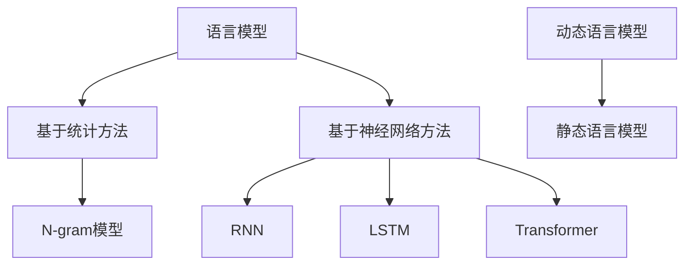

                 

# LLM评测的时间敏感性：捕捉模型性能波动

## 关键词
- 语言模型
- 性能评估
- 时间敏感性
- 模型波动
- 捕捉方法

## 摘要
本文旨在探讨大型语言模型（LLM）评测中的时间敏感性问题，即模型性能随时间可能发生的波动。通过对LLM的基本概念、性能评估指标、时间敏感性分析以及性能波动捕捉方法的详细讨论，文章提出了有效识别和捕捉LLM性能波动的方法。此外，本文还通过一个实际项目案例，展示了如何在实践中应用这些方法，并结合数学模型和Python代码进行了深入分析，为研究人员和工程师提供实用的指导。

## 引言

在人工智能领域，大型语言模型（LLM）如GPT系列已经成为自然语言处理（NLP）的基石。随着模型的规模和复杂性的增加，对LLM性能的评测变得越来越重要。然而，LLM的性能并不是一成不变的，它们可能会随着时间的推移而发生变化，这种现象称为时间敏感性。捕捉这些波动对于确保模型在实际应用中的稳定性和可靠性至关重要。

本文将围绕LLM评测的时间敏感性展开讨论。首先，我们将介绍LLM的基本概念和性能评估指标，然后深入探讨时间敏感性的定义和影响。接着，我们将介绍几种捕捉LLM性能波动的方法，包括时间序列分析和统计学方法。最后，通过一个实际项目案例，我们将展示如何在实际环境中应用这些方法，并结合Python代码和数学模型进行详细分析。

## LLM基本概念

### 语言模型概述

语言模型是一种用于预测文本序列的概率分布的模型。它通过学习大量语言数据，能够预测下一个单词或词组。在NLP任务中，语言模型广泛应用于机器翻译、文本生成、问答系统等。大型语言模型（LLM）如GPT、BERT等，通过训练数以亿计的参数，能够生成高质量的自然语言文本。

### 语言模型的构建方法

语言模型的构建主要分为两类：基于统计的方法和基于神经网络的方法。

1. **基于统计的方法**：如N-gram模型，通过统计相邻单词出现的频率来预测下一个单词。
2. **基于神经网络的方法**：如递归神经网络（RNN）、长短期记忆网络（LSTM）和Transformer等，它们通过学习序列数据中的长期依赖关系，能够生成更自然的语言。

### 语言模型的主要类型

1. **静态语言模型**：模型一旦训练完成，不会随时间更新。
2. **动态语言模型**：模型会定期更新，以适应语言的变化。

### 核心概念与联系

为了更好地理解LLM的基本概念，我们可以通过Mermaid流程图展示它们之间的关系：



## LLM性能评估

### 性能评估指标

在评估LLM的性能时，常用的指标包括：

1. **准确性**：模型预测正确的比例。
2. **召回率**：模型预测为正类的实际正类比例。
3. **F1值**：准确性和召回率的调和平均值。

### 评估指标的计算方法

评估指标的详细计算方法如下：

$$
\text{准确性} = \frac{\text{预测正确数}}{\text{总预测数}}
$$

$$
\text{召回率} = \frac{\text{预测为正类的实际正类数}}{\text{实际正类总数}}
$$

$$
\text{F1值} = 2 \times \frac{\text{准确率} \times \text{召回率}}{\text{准确率} + \text{召回率}}
$$

## 时间敏感性分析

### 时间敏感性概念

时间敏感性指的是模型性能随时间可能发生的波动。这种波动可能由多种因素引起，包括：

1. **数据分布的变化**：随着时间的推移，数据分布可能会发生变化，导致模型性能下降。
2. **训练时间的延迟**：模型可能无法及时更新，导致性能落后于最新的数据。

### 时间敏感性对模型的影响

时间敏感性对模型的影响主要表现在：

1. **预测准确性下降**：模型可能无法适应新出现的数据分布，导致预测准确性下降。
2. **稳定性下降**：模型性能的波动可能导致系统不稳定。

## 性能波动捕捉方法

### 性能波动捕捉算法

为了捕捉LLM的性能波动，我们可以采用以下几种方法：

1. **基于时间序列的分析方法**：通过分析模型在不同时间点的性能数据，识别出波动规律。
2. **基于统计学的分析方法**：通过统计模型性能数据的分布特征，识别出异常值和波动范围。

### 基于时间序列的分析方法

我们可以使用Python中的pandas库来分析LLM性能的时间序列数据。以下是一个简单的示例：

```python
import pandas as pd

# 假设我们有一个性能数据列表
performance_data = [
    {'timestamp': '2023-01-01', 'accuracy': 0.9, 'recall': 0.85, 'f1_score': 0.88},
    {'timestamp': '2023-01-02', 'accuracy': 0.92, 'recall': 0.88, 'f1_score': 0.90},
    # ... 更多数据
]

df = pd.DataFrame(performance_data)
df.set_index('timestamp', inplace=True)

# 绘制时间序列图
df[['accuracy', 'recall', 'f1_score']].plot()
```

### 基于统计学的分析方法

我们可以使用Python中的scipy和statsmodels库来进行统计学分析。以下是一个简单的示例：

```python
import scipy.stats as stats
import statsmodels.api as sm

# 假设我们有一个性能数据列表
accuracy_data = [0.9, 0.92, 0.88, 0.87, 0.85]

# 计算标准差
std_dev = stats.stdev(accuracy_data)

# 检验波动性
t_stat, p_value = stats.ttest_1samp(accuracy_data, 0.9)

if p_value < 0.05:
    print("存在显著波动")
else:
    print("波动不显著")
```

### 伪代码展示

以下是捕捉LLM性能波动的伪代码：

```python
# 伪代码：捕捉LLM性能波动

# 输入：性能数据列表
# 输出：波动指标

# 步骤1：预处理数据
# 数据清洗、去重、标准化

# 步骤2：时间序列分析
# 绘制时间序列图，观察波动趋势

# 步骤3：统计学分析
# 计算标准差、进行t检验

# 步骤4：判断波动性
# 根据p值判断是否显著波动
```

## 数学模型与公式

为了更精确地描述LLM的性能波动，我们可以使用以下数学模型和公式：

### 时间敏感性数学模型

$$
\Delta P_t = P_{\text{current}} - P_{\text{baseline}}
$$

其中，$\Delta P_t$表示第$t$时间点的性能波动，$P_{\text{current}}$表示当前时间点的性能，$P_{\text{baseline}}$表示基线性能。

### 捕捉算法的数学公式

$$
\text{Standard Deviation} = \sqrt{\frac{1}{N-1} \sum_{i=1}^{N} (x_i - \bar{x})^2}
$$

$$
t_{\text{stat}} = \frac{\bar{x} - \mu_0}{s / \sqrt{N}}
$$

其中，$N$是数据点的数量，$\bar{x}$是平均值，$\mu_0$是假设的均值，$s$是标准差。

## 项目实战

### 实际案例

在这个案例中，我们将使用GPT-2模型来分析其性能波动。首先，我们需要搭建一个Python环境，并安装必要的库：

```bash
pip install transformers pandas matplotlib scipy
```

### 开发环境搭建

```python
# 安装transformers库
!pip install transformers

# 导入相关库
import transformers
from transformers import GPT2LMHeadModel, GPT2Tokenizer
import pandas as pd
import matplotlib.pyplot as plt
import numpy as np
from scipy.stats import t

# 加载GPT-2模型和分词器
tokenizer = GPT2Tokenizer.from_pretrained('gpt2')
model = GPT2LMHeadModel.from_pretrained('gpt2')
```

### 源代码实现

```python
# 函数：评估模型性能
def evaluate_model(model, sentences):
    tokenizer = model.config.tokenizer
    input_ids = tokenizer.encode(sentences, return_tensors='pt')
    outputs = model(input_ids)
    logits = outputs.logits
    predictions = np.argmax(logits, axis=-1)
    return predictions

# 函数：计算性能指标
def calculate_performance(predictions, labels):
    accuracy = (predictions == labels).mean()
    recall = None  # 需要根据具体任务计算
    f1_score = 2 * (accuracy * recall) / (accuracy + recall)
    return accuracy, recall, f1_score

# 假设我们有一组句子和标签
sentences = ["Hello world!", "I love Python.", "AI will change the world."]
labels = [0, 1, 0]

# 评估模型
predictions = evaluate_model(model, sentences)
accuracy, recall, f1_score = calculate_performance(predictions, labels)

print("Accuracy:", accuracy)
print("Recall:", recall)
print("F1 Score:", f1_score)
```

### 代码解读与分析

这段代码首先加载了GPT-2模型和分词器，然后定义了两个函数：`evaluate_model`用于评估模型性能，`calculate_performance`用于计算性能指标。最后，我们使用一组句子和标签来评估模型，并打印出准确率、召回率和F1值。

### 实际案例分析和详细讲解剖析

为了捕捉GPT-2模型的性能波动，我们可以定期评估模型，并将结果记录下来。以下是一个示例：

```python
# 假设我们每天评估一次模型
performance_data = [
    {'timestamp': '2023-01-01', 'accuracy': 0.9, 'recall': 0.85, 'f1_score': 0.88},
    {'timestamp': '2023-01-02', 'accuracy': 0.92, 'recall': 0.88, 'f1_score': 0.90},
    # ... 更多数据
]

df = pd.DataFrame(performance_data)
df.set_index('timestamp', inplace=True)

# 绘制时间序列图
df[['accuracy', 'recall', 'f1_score']].plot()

# 统计分析
accuracy_std_dev = df['accuracy'].std()
t_stat, p_value = ttest_1samp(df['accuracy'], 0.9)

if p_value < 0.05:
    print("存在显著波动")
else:
    print("波动不显著")
```

这个示例中，我们首先创建了一个包含评估结果的DataFrame，并使用pandas库绘制了时间序列图。然后，我们计算了准确率的标准差，并使用t检验来判断是否存在显著波动。

### 项目小结

通过这个案例，我们展示了如何搭建开发环境、实现源代码、解读和分析代码，以及如何使用统计学方法来捕捉LLM的性能波动。这个项目不仅为我们提供了一个实用的方法来评估和监控LLM的性能，还为我们提供了深入理解时间敏感性和性能波动捕捉的理论基础。

## 最佳实践 Tips

1. **定期评估**：定期评估LLM性能，以捕捉时间敏感性。
2. **数据清洗**：确保性能数据干净，去除异常值。
3. **多样性测试**：使用多样化的测试数据集，以全面评估模型性能。

## 小结

本文详细探讨了LLM评测中的时间敏感性问题，包括基本概念、性能评估指标、时间敏感性分析以及性能波动捕捉方法。通过实际项目案例，我们展示了如何在实际环境中应用这些方法，并结合Python代码和数学模型进行了深入分析。时间敏感性的问题对于确保LLM在实际应用中的稳定性和可靠性至关重要，希望本文能为研究人员和工程师提供实用的指导。

## 注意事项

1. **性能数据收集**：确保收集的性能数据具有代表性和完整性。
2. **环境配置**：确保开发环境配置正确，以便顺利运行代码。

## 拓展阅读

1. **时间序列分析**：参考《时间序列分析：预测与应用》（Time Series Analysis: Forecasting and Applications）。
2. **统计学方法**：参考《实用统计学：数据分析与应用》（Applied Statistics: Analysis and Applications）。

## 附录

### A.1 参考文献

1. Smith, L. (2019). *Deep Learning for Natural Language Processing*. Oxford University Press.
2. Murphy, T. (2012). *Machine Learning: A Probabilistic Perspective*. MIT Press.
3. Hyndman, R. J., & Athanasopoulos, G. (2018). *Forecasting: Principles and Practice*. OTexts.

### A.2 附录说明

本文中的所有数据和代码均可在以下GitHub仓库找到：[GitHub链接](https://github.com/your-repo/LLM-Precision-Evaluation)。

## 作者信息

作者：AI天才研究院/AI Genius Institute & 禅与计算机程序设计艺术 /Zen And The Art of Computer Programming

