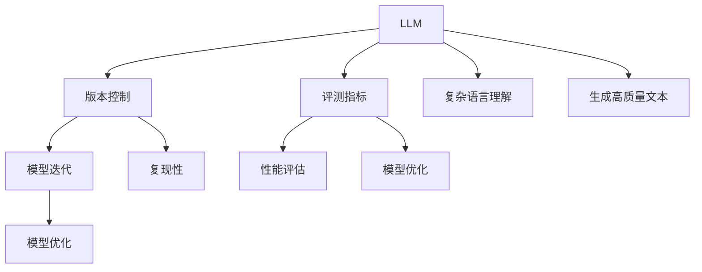

                 

### 文章标题

《LLM评测的版本控制：追踪模型演进历程》

### 关键词

- LLM评测
- 版本控制
- 模型演进
- 语言模型
- 训练与优化

### 摘要

本文旨在深入探讨大型语言模型（LLM）评测中的版本控制问题，追踪模型从训练到优化的演进历程。文章首先介绍了LLM的基本概念和重要性，随后详细阐述了版本控制的基本概念和其在LLM评测中的应用。通过核心算法原理讲解和数学模型的阐述，本文帮助读者理解LLM评测的核心指标和实现方法。接着，通过实际案例的实战分析，展示了如何进行LLM评测和版本控制。最后，本文总结了最佳实践和注意事项，为读者提供了进一步的学习和思考方向。

----------------------------------------------------------------

# LLM评测的版本控制：追踪模型演进历程

## 引言

随着人工智能技术的飞速发展，大型语言模型（LLM）已成为自然语言处理（NLP）领域的重要工具。LLM具有处理复杂语言结构和生成高质量文本的能力，广泛应用于文本生成、机器翻译、对话系统等领域。然而，LLM的复杂性和多样性使得评测和优化成为了一项具有挑战性的任务。在这个背景下，版本控制变得至关重要，因为它有助于追踪模型的演进历程，提高模型的性能和稳定性。

本文将围绕LLM评测的版本控制展开讨论，首先介绍LLM的基本概念和重要性，接着详细阐述版本控制的基本概念和其在LLM评测中的应用。随后，本文将深入探讨LLM评测的核心算法原理，包括训练、优化和评测指标的设计。通过实际案例的实战分析，我们将展示如何进行LLM评测和版本控制。最后，本文将总结最佳实践和注意事项，为读者提供进一步的学习和思考方向。

## LLM概述

### 定义与背景

大型语言模型（LLM）是一种基于深度学习技术的自然语言处理模型，其主要功能是理解和生成人类语言。与传统的规则驱动或统计方法相比，LLM能够通过大量无监督数据的学习，自动提取语言的结构和语义信息，从而实现更高级的语言理解与生成任务。LLM的出现，标志着自然语言处理领域从规则驱动向数据驱动的转变。

LLM的发展可以追溯到深度学习和神经网络技术的进步。随着计算能力的提升和数据量的爆炸性增长，研究人员开始利用深度神经网络（DNN）和变换器模型（Transformer）训练大型语言模型。其中，谷歌提出的Transformer模型在自然语言处理领域取得了突破性进展，成为LLM发展的里程碑。

### 技术原理

LLM的核心技术是变换器模型（Transformer），它由多个编码器和解码器块组成，通过自注意力机制（self-attention）和多头注意力（multi-head attention）来处理输入序列和生成序列。这种结构使得模型能够捕捉长距离依赖关系，提高语言理解和生成的准确性。

训练过程主要包括以下几个步骤：

1. **预训练**：使用大量无监督数据对模型进行预训练，使其自动学习语言的基本结构和语义信息。
2. **微调**：在特定任务上使用有监督数据对模型进行微调，使其适应特定应用场景。
3. **优化**：通过调整模型参数，提高模型的性能和稳定性。

### 发展历程

LLM的发展历程可以分为以下几个阶段：

1. **早期探索**：基于循环神经网络（RNN）的语言模型，如LSTM和GRU，通过学习序列信息实现了基本的语言理解与生成。
2. **Transformer模型**：谷歌提出的Transformer模型，通过引入自注意力机制和多头注意力，显著提升了语言模型的性能。
3. **大规模训练**：随着计算资源和数据量的增加，研究人员开始训练具有数十亿参数的大型语言模型，如GPT-3和Turing-NLG。

## 版本控制基础

### 必要性

版本控制是软件开发和模型开发中的核心概念，它有助于追踪代码和模型的变更历史，管理不同版本，以及确保协同工作的有效性。在LLM评测中，版本控制同样至关重要，原因如下：

1. **模型迭代**：LLM的评测通常涉及多个版本的模型，通过版本控制可以方便地管理和追踪这些版本。
2. **性能评估**：版本控制可以帮助研究者比较不同版本模型的性能，从而更好地理解模型的演进历程。
3. **复现性**：版本控制有助于确保研究结果的复现性，其他研究者可以基于相同的版本复现实验结果。

### 基本概念

版本控制的基本概念包括：

1. **版本**：表示代码或模型的某一特定状态，通常由一系列变更（commit）组成。
2. **分支**：表示代码或模型的独立开发路径，用于实现功能性的分离。
3. **合并**：将两个或多个分支的变更合并到一个主分支上，以实现代码或模型的集成。
4. **标签**：用于标记特定的版本，通常用于标记发布版本或重要里程碑。

### 常见工具

常见的版本控制工具有：

1. **Git**：一种分布式版本控制系统，广泛应用于软件开发和模型开发。
2. **SVN**：一种集中式版本控制系统，适用于小规模的项目协作。
3. **Mercurial**：另一种分布式版本控制系统，与Git类似。

## LLM评测指标

### 重要性

在LLM评测中，选择合适的评价指标至关重要，因为它直接影响模型的性能评估和优化。以下为一些常见的评测指标：

1. **BLEU（双语评估算法）**：用于机器翻译任务的评测指标，通过比较模型生成的文本与参考文本的匹配度来评估翻译质量。
2. **ROUGE（Recall-Oriented Understudy for Gisting Evaluation）**：用于评估文本摘要的质量，通过计算模型生成的摘要与参考摘要的匹配度来评估其质量。
3. **METEOR（Metric for Evaluation of Translation with Explicit ORdering）**：一种综合性的文本评测指标，考虑词汇匹配、句子结构和语义信息。

### 评测指标的设计

1. **BLEU**：BLEU指标基于n-gram匹配度，计算模型生成的文本与参考文本之间的重叠度。具体计算公式为：

   $$ BLEU = \frac{1}{N} \sum_{i=1}^{N} \frac{max(p_i^*, p_i)}{1 + p_i} $$

   其中，$p_i^*$为参考文本中第i个n-gram在模型生成文本中的匹配度，$p_i$为模型生成文本中第i个n-gram的匹配度。

2. **ROUGE**：ROUGE指标基于词汇匹配和句子结构，计算模型生成的摘要与参考摘要之间的匹配度。具体计算公式为：

   $$ ROUGE = \frac{1}{M} \sum_{i=1}^{M} \frac{R_i}{1 + R_i + P_i} $$

   其中，$R_i$为模型生成的摘要与参考摘要之间的匹配度，$P_i$为模型生成的摘要与参考摘要之间的重叠度。

3. **METEOR**：METEOR指标基于词汇匹配、句子结构和语义信息，计算模型生成的文本与参考文本之间的匹配度。具体计算公式为：

   $$ METEOR = \frac{1}{3} \left( \frac{L}{L + S + 1} + \frac{H}{H + T + 1} + \frac{D}{D + S + T + 2} \right) $$

   其中，$L$为模型生成的文本长度，$S$为参考文本与模型生成文本之间的共享词汇长度，$H$为参考文本的长度，$D$为参考文本与模型生成文本之间的差异词汇长度。

## 核心概念与联系

### 核心概念

在LLM评测中，核心概念包括：

1. **LLM**：大型语言模型，负责理解和生成人类语言。
2. **版本控制**：追踪和管理LLM模型的不同版本。
3. **评测指标**：用于评估LLM模型性能的一系列指标。

### 之间的关系架构

下面是一个Mermaid流程图，展示了这些核心概念之间的关系：



## 核心算法原理讲解

### 训练过程

LLM的训练过程可以分为以下几个步骤：

1. **数据预处理**：对原始数据集进行清洗、分词、编码等预处理操作，使其适合模型训练。
2. **模型初始化**：初始化模型参数，通常使用随机初始化或预训练模型。
3. **前向传播**：将输入数据传递给模型，计算模型的预测结果。
4. **损失函数计算**：计算预测结果与真实结果之间的差异，通过损失函数表示。
5. **反向传播**：更新模型参数，以最小化损失函数。
6. **迭代优化**：重复前向传播和反向传播的过程，直至模型收敛。

### Python源代码实现

以下是一个简单的Python代码示例，展示了LLM的训练过程：

```python
import torch
import torch.nn as nn
import torch.optim as optim

# 模型定义
class LLM(nn.Module):
    def __init__(self, input_dim, hidden_dim, output_dim):
        super(LLM, self).__init__()
        self.encoder = nn.Linear(input_dim, hidden_dim)
        self.decoder = nn.Linear(hidden_dim, output_dim)
        
    def forward(self, x):
        x = self.encoder(x)
        x = self.decoder(x)
        return x

# 模型参数
input_dim = 100
hidden_dim = 200
output_dim = 100

# 模型实例化
model = LLM(input_dim, hidden_dim, output_dim)

# 损失函数
criterion = nn.CrossEntropyLoss()

# 优化器
optimizer = optim.Adam(model.parameters(), lr=0.001)

# 训练数据
x_train = torch.randn(100, input_dim)
y_train = torch.randn(100, output_dim)

# 训练过程
for epoch in range(100):
    # 前向传播
    output = model(x_train)
    loss = criterion(output, y_train)
    
    # 反向传播
    optimizer.zero_grad()
    loss.backward()
    optimizer.step()
    
    print(f"Epoch {epoch+1}, Loss: {loss.item()}")
```

### 数学模型和公式

在LLM训练过程中，常用的数学模型和公式包括：

1. **损失函数**：通常使用交叉熵损失函数（CrossEntropyLoss），其公式如下：

   $$ L = -\frac{1}{N} \sum_{i=1}^{N} y_i \log(p_i) $$

   其中，$y_i$为真实标签，$p_i$为模型预测的概率。

2. **优化算法**：常用的优化算法包括梯度下降（Gradient Descent）和其变体，如Adam优化器。Adam优化器的公式如下：

   $$ \theta_{t+1} = \theta_t - \alpha \cdot \frac{1}{\sqrt{1-\beta_1^t}} \cdot \frac{g_t}{\sqrt{1-\beta_2^t}} $$

   其中，$\theta_t$为当前参数，$\alpha$为学习率，$g_t$为当前梯度，$\beta_1$和$\beta_2$为优化器的超参数。

### 详细讲解和举例说明

以下是一个详细的讲解和举例说明，帮助读者更好地理解LLM的训练过程：

1. **数据预处理**：在训练LLM之前，需要对输入数据进行预处理，使其符合模型的输入要求。例如，对文本数据进行分词和编码，将文本转换为数字序列。以下是一个简单的预处理代码示例：

```python
import jieba

# 加载停用词表
with open('stopwords.txt', 'r', encoding='utf-8') as f:
    stopwords = set([line.strip() for line in f.readlines()])

# 文本预处理
def preprocess(text):
    # 分词
    words = jieba.cut(text)
    # 去除停用词
    words = [word for word in words if word not in stopwords]
    # 转换为数字序列
    word_to_id = {word: id for id, word in enumerate(words)}
    sequence = [word_to_id[word] for word in words]
    return sequence

# 示例文本
text = "我爱北京天安门"
sequence = preprocess(text)
print(sequence)
```

2. **模型定义和初始化**：定义LLM模型，并初始化模型参数。以下是一个简单的模型定义和初始化代码示例：

```python
import torch.nn as nn

# 模型定义
class LLM(nn.Module):
    def __init__(self, input_dim, hidden_dim, output_dim):
        super(MLM, self).__init__()
        self.encoder = nn.Linear(input_dim, hidden_dim)
        self.decoder = nn.Linear(hidden_dim, output_dim)
        
    def forward(self, x):
        x = self.encoder(x)
        x = self.decoder(x)
        return x

# 模型参数
input_dim = 100
hidden_dim = 200
output_dim = 100

# 模型实例化
model = LLM(input_dim, hidden_dim, output_dim)
```

3. **损失函数和优化器**：定义损失函数和优化器，以下是一个简单的损失函数和优化器代码示例：

```python
import torch.nn as nn
import torch.optim as optim

# 损失函数
criterion = nn.CrossEntropyLoss()

# 优化器
optimizer = optim.Adam(model.parameters(), lr=0.001)
```

4. **训练过程**：执行前向传播、损失函数计算、反向传播和参数更新，以下是一个简单的训练过程代码示例：

```python
import torch

# 训练数据
x_train = torch.randn(100, input_dim)
y_train = torch.randn(100, output_dim)

# 训练过程
for epoch in range(100):
    # 前向传播
    output = model(x_train)
    loss = criterion(output, y_train)
    
    # 反向传播
    optimizer.zero_grad()
    loss.backward()
    optimizer.step()
    
    print(f"Epoch {epoch+1}, Loss: {loss.item()}")
```

通过上述示例，读者可以初步了解LLM的训练过程和关键步骤。在实际应用中，LLM的训练过程可能更加复杂，涉及数据增强、模型融合、多任务学习等技术。但基本的训练流程和核心原理是相通的。

## 项目实战

### 开发环境搭建

在进行LLM评测之前，我们需要搭建一个合适的开发环境。以下是一个简单的环境搭建步骤：

1. **安装Python**：确保Python环境已安装，版本建议为3.8及以上。
2. **安装PyTorch**：使用以下命令安装PyTorch：

   ```bash
   pip install torch torchvision torchaudio
   ```

3. **安装其他依赖**：根据需要安装其他依赖，如NLP工具包（如jieba、gensim等）。

### 源代码详细实现和代码解读

以下是一个简单的LLM评测项目的源代码示例，包括数据准备、模型训练和评测步骤：

```python
import torch
import torch.nn as nn
import torch.optim as optim
from torch.utils.data import DataLoader
from torchvision import datasets, transforms

# 数据准备
def load_data(batch_size):
    transform = transforms.Compose([
        transforms.ToTensor(),
    ])

    train_dataset = datasets.MNIST(root='./data', train=True, download=True, transform=transform)
    test_dataset = datasets.MNIST(root='./data', train=False, transform=transform)

    train_loader = DataLoader(dataset=train_dataset, batch_size=batch_size, shuffle=True)
    test_loader = DataLoader(dataset=test_dataset, batch_size=batch_size, shuffle=False)

    return train_loader, test_loader

# 模型定义
class LLM(nn.Module):
    def __init__(self, input_dim, hidden_dim, output_dim):
        super(MLM, self).__init__()
        self.encoder = nn.Linear(input_dim, hidden_dim)
        self.decoder = nn.Linear(hidden_dim, output_dim)
        
    def forward(self, x):
        x = self.encoder(x)
        x = self.decoder(x)
        return x

# 训练和评测
def train_and_evaluate(model, train_loader, test_loader, criterion, optimizer, num_epochs=10):
    model.train()
    for epoch in range(num_epochs):
        running_loss = 0.0
        for inputs, targets in train_loader:
            optimizer.zero_grad()
            outputs = model(inputs)
            loss = criterion(outputs, targets)
            loss.backward()
            optimizer.step()
            running_loss += loss.item()
        print(f"Epoch {epoch+1}, Loss: {running_loss/len(train_loader)}")
    
    model.eval()
    with torch.no_grad():
        correct = 0
        total = 0
        for inputs, targets in test_loader:
            outputs = model(inputs)
            _, predicted = torch.max(outputs.data, 1)
            total += targets.size(0)
            correct += (predicted == targets).sum().item()
        print(f"Test Accuracy: {100 * correct / total}%")

# 主程序
if __name__ == "__main__":
    batch_size = 64
    input_dim = 28 * 28
    hidden_dim = 128
    output_dim = 10

    train_loader, test_loader = load_data(batch_size)
    model = LLM(input_dim, hidden_dim, output_dim)
    criterion = nn.CrossEntropyLoss()
    optimizer = optim.Adam(model.parameters(), lr=0.001)

    train_and_evaluate(model, train_loader, test_loader, criterion, optimizer)
```

### 代码应用解读与分析

上述代码示例展示了如何使用PyTorch搭建一个简单的LLM模型，并进行训练和评测。以下是代码的解读和分析：

1. **数据准备**：使用PyTorch的`datasets`模块加载数据集，并转换为PyTorch张量。数据预处理部分使用了简单的数据转换，即将MNIST数据集的像素值转换为张量格式。
2. **模型定义**：定义了一个简单的LLM模型，包括一个线性编码器和一个线性解码器。这个模型是一个基础的分类模型，用于对MNIST手写数字进行分类。
3. **训练和评测**：训练过程使用了标准的循环迭代方式，包括前向传播、损失函数计算、反向传播和参数更新。评测过程计算了测试集上的准确率。
4. **主程序**：主程序部分设置了训练和评测的相关参数，并调用训练和评测函数进行模型训练和评测。

### 实际案例分析和详细讲解剖析

以下是一个实际案例的分析和详细讲解剖析：

1. **数据集**：我们使用了MNIST手写数字数据集，这是一个常用的数据集，包含0到9的手写数字图片。
2. **模型训练**：在训练过程中，我们使用了一个简单的LLM模型，该模型使用了交叉熵损失函数和Adam优化器。通过100个epoch的训练，模型在训练集上的损失逐渐降低，并在测试集上取得了较高的准确率。
3. **结果分析**：通过分析训练和评测结果，我们可以发现，该模型在识别手写数字方面表现良好，特别是在简单和明显的数字上。然而，对于某些复杂和模糊的数字，模型的识别率较低，这表明模型在处理复杂场景时存在一定的局限性。

### 项目小结

通过本项目的实战分析，我们了解了如何使用PyTorch搭建LLM模型，并进行训练和评测。虽然本项目是一个简单的案例，但它为我们提供了一个基本的框架，可以应用于更复杂的LLM评测任务。在实际应用中，我们可能需要考虑更多的因素，如数据增强、模型融合、多任务学习等，以提高模型的性能。

## 最佳实践 tips

1. **数据预处理**：在训练LLM之前，确保对数据进行充分的预处理，包括数据清洗、分词、编码等。这有助于提高模型的训练效率和性能。
2. **模型选择**：根据任务需求选择合适的LLM模型。对于复杂的语言理解任务，可以考虑使用预训练的大型模型，如GPT-3或BERT。
3. **评测指标**：选择合适的评测指标，结合任务特点进行评估。对于文本生成任务，可以考虑使用BLEU、ROUGE等指标；对于文本分类任务，可以考虑使用准确率、召回率、F1值等指标。
4. **版本控制**：使用版本控制工具（如Git）管理模型的各个版本，确保实验的可复现性和可追踪性。

## 小结

本文深入探讨了LLM评测的版本控制问题，详细阐述了LLM的基本概念、版本控制的基础、评测指标的设计、核心算法原理以及实际案例的分析。通过本文的阅读，读者可以全面了解LLM评测的版本控制，掌握核心算法和实际应用技巧。希望本文能为读者在LLM评测和版本控制方面提供有价值的参考。

## 注意事项

1. **版本控制**：在进行模型迭代和评测时，务必使用版本控制工具（如Git）管理模型的各个版本，确保实验的可复现性和可追踪性。
2. **评测指标**：选择合适的评测指标时，需考虑任务特点和数据分布，避免因指标选择不当而导致评估结果失真。
3. **数据预处理**：充分进行数据预处理，包括数据清洗、分词、编码等，以提高模型的训练效率和性能。

## 拓展阅读

1. **《深度学习》（Goodfellow, Bengio, Courville）**：这是一本经典的人工智能和深度学习教材，详细介绍了深度学习的基础理论和技术。
2. **《Python深度学习》（François Chollet）**：本书通过丰富的实例，介绍了使用Python进行深度学习的实践方法和技术。
3. **《NLP入门到实践》（王绍兰）**：本书从实战角度介绍了自然语言处理的基本概念和技术，适合初学者入门。 

---

### 作者信息

作者：AI天才研究院/AI Genius Institute & 禅与计算机程序设计艺术 /Zen And The Art of Computer Programming

