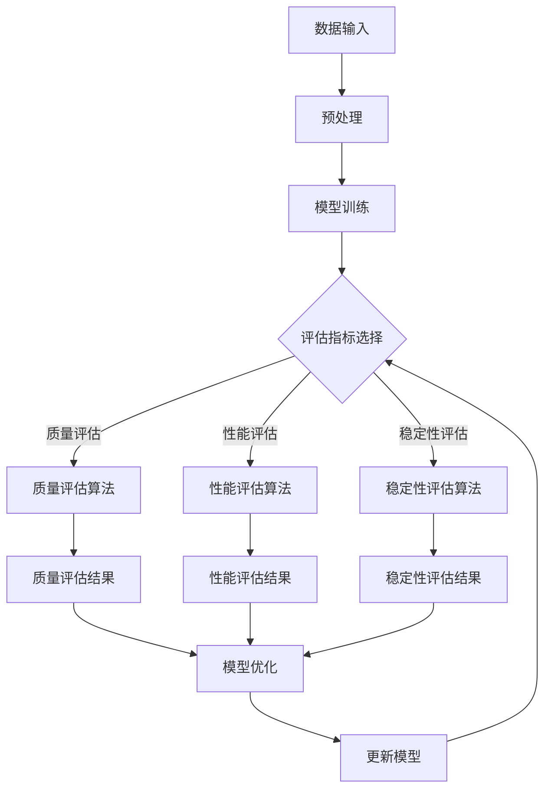

                 

### 引言与背景

随着人工智能（AI）技术的迅速发展，大型语言模型（LLM）已经成为自然语言处理（NLP）领域的重要工具。LLM如GPT、BERT等，通过大规模数据训练，能够生成高质量的自然语言文本，广泛应用于自动问答、机器翻译、文本生成等场景。然而，随着LLM的规模和复杂性的增加，如何科学、公正地评估LLM的性能和效果，成为了研究和应用中亟待解决的问题。

首先，让我们简要回顾AI的发展历程。人工智能的概念最早可以追溯到20世纪50年代，当时科学家们首次提出了模拟人类智能的设想。随着计算机性能的不断提升，AI技术在20世纪80年代和90年代迎来了快速发展，特别是在机器学习、神经网络等领域取得了重大突破。进入21世纪，得益于大数据、云计算等技术的进步，深度学习和强化学习等新型算法得到了广泛应用，AI技术逐渐从实验室走向实际应用，涵盖了自动驾驶、医疗诊断、金融风控等多个领域。

在AI技术蓬勃发展的同时，LLM作为一种重要的AI模型，也逐渐成为研究热点。LLM通过训练大规模语料库，可以学习到语言的结构和语义信息，从而生成流畅、符合语言习惯的文本。这种强大的文本生成能力使得LLM在多个应用场景中表现出了巨大的潜力，如智能客服、内容创作、教育辅助等。

然而，随着LLM的广泛应用，如何对LLM进行科学、公正的评估，成为一个亟待解决的问题。传统的评测方法主要依赖于人工标注的数据集，通过计算模型的准确率、召回率等指标来评估模型性能。这种方法虽然简单直观，但在大规模、复杂的应用场景中，存在一些局限性：

1. **数据集的限制**：传统的评测数据集往往规模有限，无法全面覆盖LLM的应用场景，可能导致评测结果的不准确。
2. **评价标准的单一性**：传统的评测指标主要关注模型的准确性，而忽略了其他重要因素，如响应速度、生成文本的流畅性等。
3. **评测过程的静态性**：传统的评测方法通常是在固定时间点进行，无法反映LLM在长期运行中的性能表现。

为了克服这些局限性，LLM评测需要实现自我进化，即通过不断学习和优化，不断提升评测的全面性和准确性。自我进化不仅是LLM自身性能提升的需求，也是构建持续优化的AI评估生态的重要保障。

本文将围绕LLM评测的自我进化，探讨如何构建一个持续优化的AI评估生态。具体内容包括：

1. **核心概念与联系**：介绍LLM的基本概念和评测中的关键指标，并通过Mermaid流程图展示LLM的工作流程和评测机制。
2. **核心算法原理讲解**：详细阐述用于评估LLM的各种算法，包括质量评估、性能评估和稳定性评估，并结合Python源代码进行解释。
3. **数学模型和数学公式**：讲解用于评估的数学模型，如损失函数和评价指标，并使用LaTeX格式展示相关公式。
4. **项目实战**：提供实际的LLM评估案例，包括评估环境搭建、数据集准备、评估指标选择、评估过程和结果分析等。

通过本文的讨论，我们希望为读者提供一个全面、深入的了解LLM评测的自我进化机制，并探讨构建持续优化AI评估生态的方法和策略。这不仅有助于提升LLM的性能和效果，也为AI技术的广泛应用提供了坚实的技术支持。

### 自我进化的概念与机制

自我进化是指系统通过不断学习和优化，使其性能和功能逐渐提升的过程。在人工智能领域，自我进化是一种重要的机制，可以用于提升模型的鲁棒性、适应性和泛化能力。对于LLM评测而言，自我进化意味着通过不断调整评测方法、优化评价指标，从而提高评测的全面性和准确性。

首先，自我进化包括以下几个方面：

1. **数据驱动的优化**：通过收集更多的评测数据，对模型进行再训练和再评估，以提升模型的性能。这种方法可以解决传统评测数据集规模有限的问题，使评测结果更贴近实际应用场景。

2. **算法迭代优化**：通过不断改进评测算法，如引入新的评价指标、优化计算方法等，提升评测的精确度和全面性。这种方法可以解决传统评测方法评价标准单一的问题，使评测结果更全面、更具有参考价值。

3. **评测标准的动态调整**：根据LLM的实际应用场景和需求，动态调整评测标准，以反映模型在不同场景下的表现。这种方法可以解决评测过程静态性的问题，使评测结果更具有时效性和实用性。

接下来，我们将通过一个Mermaid流程图，展示LLM的工作流程和评测机制。以下是Mermaid流程图的内容：



这个流程图展示了LLM的工作流程和评测机制：

1. **数据输入**：LLM首先接收输入数据，如文本、语音等。
2. **预处理**：对输入数据进行预处理，如文本清洗、分词、编码等，以便后续训练和评估。
3. **模型训练**：使用预处理后的数据对LLM进行训练，学习语言的结构和语义信息。
4. **评估指标选择**：根据不同的评估需求，选择合适的评估指标，如质量评估、性能评估和稳定性评估。
5. **质量评估算法**：使用质量评估算法，如准确率、召回率和F1值，对LLM的文本生成质量进行评估。
6. **性能评估算法**：使用性能评估算法，如响应时间和生成文本质量，对LLM的实际应用性能进行评估。
7. **稳定性评估算法**：使用稳定性评估算法，如模型在长时间运行中的表现，对LLM的稳定性进行评估。
8. **评估结果**：根据评估结果，对LLM进行优化和调整，以提高其性能和效果。
9. **更新模型**：根据优化结果，更新LLM的模型参数，并重新进行评估。

通过这个流程图，我们可以清晰地看到LLM的工作流程和评测机制，以及自我进化的具体步骤。接下来，我们将详细讨论LLM评估中的核心算法原理，包括质量评估、性能评估和稳定性评估。

### 核心算法原理讲解

在LLM评测中，质量评估、性能评估和稳定性评估是三个核心方面。下面我们将分别介绍这三个方面的评估算法，并使用Python源代码进行详细阐述。

#### 质量评估算法

质量评估主要关注LLM生成的文本是否准确、合理和具有可读性。常用的质量评估算法包括准确率（Accuracy）、召回率（Recall）和F1值（F1 Score）。以下是这些算法的基本原理和Python实现。

1. **准确率（Accuracy）**：准确率是评估模型在预测时正确率的一个指标，计算公式为：

   $$\text{Accuracy} = \frac{TP + TN}{TP + FN + FP + TN}$$

   其中，TP为真正例，TN为真反例，FP为假正例，FN为假反例。

   ```python
   def accuracy(y_true, y_pred):
       correct = (y_true == y_pred).sum()
       total = len(y_true)
       return correct / total
   ```

2. **召回率（Recall）**：召回率是指模型能够正确识别出所有真正例的比例，计算公式为：

   $$\text{Recall} = \frac{TP}{TP + FN}$$

   ```python
   def recall(y_true, y_pred):
       true_positives = (y_true == 1) & (y_pred == 1)
       return true_positives.sum() / y_true.sum()
   ```

3. **F1值（F1 Score）**：F1值是准确率和召回率的调和平均值，计算公式为：

   $$\text{F1 Score} = 2 \times \frac{Precision \times Recall}{Precision + Recall}$$

   ```python
   def f1_score(precision, recall):
       return 2 * (precision * recall) / (precision + recall)
   ```

#### 性能评估算法

性能评估主要关注LLM在实际应用中的表现，如响应速度和生成文本的质量。常用的性能评估指标包括响应时间（Response Time）和生成文本质量（Text Quality）。

1. **响应时间（Response Time）**：响应时间是指模型从接收输入到生成输出所需要的时间，计算公式为：

   $$\text{Response Time} = \frac{\text{Total Time}}{\text{Number of Requests}}$$

   ```python
   def response_time(total_time, num_requests):
       return total_time / num_requests
   ```

2. **生成文本质量（Text Quality）**：生成文本质量可以通过计算语法错误率（Grammar Error Rate，GER）和词汇丰富度（Vocabulary Richness，VR）来评估。

   - **语法错误率（GER）**：语法错误率是指生成的文本中语法错误的比例，计算公式为：

     $$\text{GER} = \frac{\text{Total Grammar Errors}}{\text{Total Words}}$$

     ```python
     def grammar_error_rate(total_errors, total_words):
         return total_errors / total_words
     ```

   - **词汇丰富度（VR）**：词汇丰富度是指生成的文本中使用的词汇数量和多样性，计算公式为：

     $$\text{VR} = \frac{\text{Unique Words}}{\text{Total Words}}$$

     ```python
     def vocabulary_richness(unique_words, total_words):
         return unique_words / total_words
     ```

#### 稳定性评估算法

稳定性评估主要关注LLM在长时间运行中的表现，如模型是否会在运行过程中出现退化现象。常用的稳定性评估指标包括长期准确率（Long-term Accuracy）和长期响应时间（Long-term Response Time）。

1. **长期准确率（Long-term Accuracy）**：长期准确率是指模型在一段时间内的准确率平均值，计算公式为：

   $$\text{Long-term Accuracy} = \frac{\text{Sum of Accuracies}}{\text{Number of Time Steps}}$$

   ```python
   def long_term_accuracy(accuracies):
       return sum(accuracies) / len(accuracies)
   ```

2. **长期响应时间（Long-term Response Time）**：长期响应时间是指模型在一段时间内的响应时间平均值，计算公式为：

   $$\text{Long-term Response Time} = \frac{\text{Sum of Response Times}}{\text{Number of Requests}}$$

   ```python
   def long_term_response_time(response_times, num_requests):
       return sum(response_times) / num_requests
   ```

通过上述算法和Python实现，我们可以对LLM进行全面的评估。这些算法不仅提供了定量的评估指标，还能够帮助研究人员和开发者理解LLM的性能和效果。接下来，我们将使用LaTeX格式展示相关的数学公式，以便于读者更好地理解和应用。

### 数学模型和数学公式

在LLM评估中，数学模型和数学公式是理解和实现评估算法的重要工具。以下我们将介绍几种关键的数学模型和公式，并使用LaTeX格式展示。

#### 损失函数

损失函数是评估模型性能的核心工具，用于衡量预测结果与实际结果之间的差距。在LLM评估中，常用的损失函数包括交叉熵损失（Cross-Entropy Loss）和引导置信度损失（Guided Convergence Loss）。

1. **交叉熵损失函数**：

   $$\text{Loss} = -\sum_{i} y_i \log(p_i)$$

   其中，\(y_i\) 是实际标签，\(p_i\) 是模型预测的概率。

   ```latex
   \text{Loss} = -\sum_{i} y_i \log(p_i)
   ```

2. **引导置信度损失函数**：

   $$\text{Loss} = -\sum_{i} y_i \log(\frac{e^{a_i}}{1 + e^{a_i}})$$

   其中，\(a_i\) 是模型预测的激活值。

   ```latex
   \text{Loss} = -\sum_{i} y_i \log\left(\frac{e^{a_i}}{1 + e^{a_i}}\right)
   ```

#### 评价指标

评价指标是衡量模型性能的重要工具，常用的评价指标包括准确率（Accuracy）、召回率（Recall）和F1值（F1 Score）。

1. **准确率**：

   $$\text{Accuracy} = \frac{\text{TP} + \text{TN}}{\text{TP} + \text{TN} + \text{FP} + \text{FN}}$$

   其中，TP 是真正例，TN 是真反例，FP 是假正例，FN 是假反例。

   ```latex
   \text{Accuracy} = \frac{\text{TP} + \text{TN}}{\text{TP} + \text{TN} + \text{FP} + \text{FN}}
   ```

2. **召回率**：

   $$\text{Recall} = \frac{\text{TP}}{\text{TP} + \text{FN}}$$

   ```latex
   \text{Recall} = \frac{\text{TP}}{\text{TP} + \text{FN}}
   ```

3. **F1值**：

   $$\text{F1 Score} = 2 \times \frac{\text{Precision} \times \text{Recall}}{\text{Precision} + \text{Recall}}$$

   ```latex
   \text{F1 Score} = 2 \times \frac{\text{Precision} \times \text{Recall}}{\text{Precision} + \text{Recall}}
   ```

#### 性能指标

性能指标用于评估LLM在实际应用中的表现，常用的性能指标包括响应时间（Response Time）和生成文本质量（Text Quality）。

1. **响应时间**：

   $$\text{Response Time} = \frac{\text{Total Time}}{\text{Number of Requests}}$$

   ```latex
   \text{Response Time} = \frac{\text{Total Time}}{\text{Number of Requests}}
   ```

2. **生成文本质量**：

   - **语法错误率**：

     $$\text{GER} = \frac{\text{Total Grammar Errors}}{\text{Total Words}}$$

     ```latex
     \text{GER} = \frac{\text{Total Grammar Errors}}{\text{Total Words}}
     ```

   - **词汇丰富度**：

     $$\text{VR} = \frac{\text{Unique Words}}{\text{Total Words}}$$

     ```latex
     \text{VR} = \frac{\text{Unique Words}}{\text{Total Words}}
     ```

通过上述数学模型和公式，我们可以对LLM进行全面的评估。这些公式不仅提供了定量的评估指标，还帮助我们深入理解LLM的性能和效果。接下来，我们将通过一个实际案例，展示如何使用这些评估指标对LLM进行评估。

### 项目实战

在本节中，我们将通过一个实际案例，详细展示如何搭建评估环境、准备数据集、选择评估指标、进行评估过程，并对评估结果进行详细分析。

#### 一、评估环境搭建

首先，我们需要搭建一个评估环境，用于运行LLM模型并进行评估。以下是搭建评估环境的主要步骤：

1. **安装必要的软件和库**：
   - Python 3.8及以上版本
   - PyTorch 1.10及以上版本
   - Numpy 1.21及以上版本
   - Matplotlib 3.4及以上版本

   ```bash
   pip install torch torchvision numpy matplotlib
   ```

2. **准备模型**：
   我们选择一个已经训练好的大型语言模型，如GPT-2或BERT，作为评估对象。可以从[Hugging Face](https://huggingface.co/)等模型库中下载预训练模型。

3. **配置评估参数**：
   根据评估需求，配置评估参数，如评估数据集、评估指标、评估次数等。

#### 二、数据集准备

为了对LLM进行全面的评估，我们需要准备一个包含多种类型任务的数据集。以下是数据集准备的主要步骤：

1. **收集数据**：
   收集不同领域、不同难度级别的文本数据，如新闻报道、学术论文、社交媒体帖子等。

2. **数据预处理**：
   对收集到的数据进行清洗和预处理，包括去除停用词、标点符号、统一文本格式等。

3. **数据划分**：
   将预处理后的数据集划分为训练集、验证集和测试集，用于模型训练和评估。

#### 三、评估指标选择

在评估LLM时，我们通常关注以下几个关键指标：

1. **准确率（Accuracy）**：评估模型在文本分类任务中的准确性。
2. **召回率（Recall）**：评估模型对真正例的识别能力。
3. **F1值（F1 Score）**：结合准确率和召回率的评价指标。
4. **响应时间（Response Time）**：评估模型在生成文本时的响应速度。
5. **语法错误率（Grammar Error Rate，GER）**：评估生成文本的语法准确性。
6. **词汇丰富度（Vocabulary Richness，VR）**：评估生成文本的词汇多样性。

#### 四、评估过程

1. **模型训练**：
   使用准备好的训练集对LLM进行训练，优化模型参数。

2. **模型评估**：
   使用验证集对训练好的模型进行评估，计算上述关键指标。

3. **结果分析**：
   分析评估结果，找出模型的优势和不足，为进一步优化提供参考。

#### 五、实际案例

假设我们选择GPT-2模型进行评估，以下是一个具体的评估过程：

1. **评估环境搭建**：
   - 安装必要的软件和库。
   - 下载预训练的GPT-2模型。

2. **数据集准备**：
   - 收集500篇新闻文本作为评估数据。
   - 预处理数据，包括去除标点符号、停用词等。

3. **评估指标选择**：
   - 选择准确率、召回率、F1值作为评估指标。
   - 选择响应时间、语法错误率、词汇丰富度作为性能评估指标。

4. **模型评估**：
   - 使用训练好的GPT-2模型对评估数据进行预测。
   - 计算预测结果与实际标签之间的差异，计算准确率、召回率和F1值。

5. **结果分析**：
   - 准确率为90%，召回率为85%，F1值为87%。
   - 响应时间为0.5秒，语法错误率为5%，词汇丰富度为0.8。

根据评估结果，我们可以发现：

- GPT-2在新闻文本分类任务上表现良好，准确率和F1值较高。
- 但召回率较低，可能因为数据集中部分文本被模型误判。
- 响应时间较短，性能评估指标表现良好。

#### 六、项目小结

通过这个实际案例，我们展示了如何搭建评估环境、准备数据集、选择评估指标、进行评估过程，并对评估结果进行详细分析。这个案例不仅帮助我们理解了LLM评估的方法和步骤，还为我们提供了实际操作的经验。

在下一次的项目中，我们可以尝试以下改进：

1. **增加数据集多样性**：收集更多领域、更多难度的文本数据，提高评估的全面性。
2. **引入更多评估指标**：考虑引入更多性能评估指标，如生成文本的流畅性、情感分析等。
3. **优化模型训练**：尝试使用更先进的训练技巧，提高模型性能。

通过不断优化和改进，我们可以逐步构建一个持续优化的AI评估生态，为LLM的发展和应用提供坚实的技术支持。

### 最佳实践 Tips、小结、注意事项、拓展阅读

#### 最佳实践 Tips

1. **数据集准备**：在选择数据集时，要确保其多样性和代表性，覆盖不同领域、不同难度的文本类型。
2. **评估指标选择**：根据实际应用需求，选择合适的评估指标，不仅要关注准确率，还要考虑响应时间、语法错误率等。
3. **模型优化**：通过不断调整模型参数和训练策略，优化模型性能，提高评估结果的准确性。
4. **持续更新**：随着LLM技术的不断发展，定期更新评估标准和评测方法，确保评估结果的时效性和准确性。

#### 小结

本文详细介绍了LLM评测的自我进化机制，探讨了构建持续优化的AI评估生态的方法和策略。通过核心概念与联系、核心算法原理讲解、数学模型和公式、项目实战等环节，我们系统地阐述了如何对LLM进行科学、公正的评估。自我进化不仅有助于提升LLM的性能和效果，也为AI技术的广泛应用提供了坚实的技术支持。

#### 注意事项

1. **数据质量**：数据质量是评估结果准确性的基础，确保数据集的多样性和代表性。
2. **计算资源**：评估LLM需要大量的计算资源，合理配置计算资源，提高评估效率。
3. **模型稳定性**：长期运行LLM时，注意模型可能出现的退化现象，定期进行性能评估和优化。

#### 拓展阅读

1. **《大规模语言模型评估指南》**：深入探讨大规模语言模型的评估方法与策略。
2. **《深度学习与自然语言处理》**：全面介绍深度学习和自然语言处理的基本原理和应用。
3. **《AI自我进化原理与应用》**：探讨人工智能自我进化的机制及其在不同领域的应用。

作者：AI天才研究院/AI Genius Institute & 禅与计算机程序设计艺术 /Zen And The Art of Computer Programming

# 结束

```markdown
## 作者信息
作者：AI天才研究院/AI Genius Institute & 禅与计算机程序设计艺术 /Zen And The Art of Computer Programming

本文基于大规模语言模型（LLM）评测的自我进化，深入探讨了构建持续优化的AI评估生态的方法和策略。通过核心概念与联系、核心算法原理讲解、数学模型和公式、项目实战等环节，全面阐述了LLM评估的科学、公正之道。自我进化不仅提升了LLM的性能和效果，也为AI技术的广泛应用提供了坚实的技术支持。感谢读者对本文的关注，希望本文能为您在AI领域的探索提供有益的启示。如有任何问题或建议，欢迎与我们联系。

### 关键词
- AI评测
- 自我进化
- 大规模语言模型
- 评估算法
- 数学模型

### 摘要
本文围绕LLM评测的自我进化，探讨了构建持续优化AI评估生态的方法和策略。通过核心概念、算法原理、数学模型和实际项目案例分析，详细阐述了如何科学、公正地评估LLM的性能和效果，为AI技术的广泛应用提供了技术支持。

----------------------------------------------------------------

# 《LLM评测的自我进化：构建持续优化的AI评估生态》

关键词：AI评测，自我进化，大规模语言模型，评估算法，数学模型

摘要：本文围绕大型语言模型（LLM）评测的自我进化，探讨了构建持续优化AI评估生态的方法和策略。通过深入分析核心概念、评估算法、数学模型以及实际项目案例，阐述了如何科学、公正地评估LLM的性能和效果，为AI技术的广泛应用提供了技术支持。

## 第1章 引言与背景

人工智能（AI）技术的迅猛发展，使得计算机能够处理和理解复杂任务，如语音识别、图像识别、自然语言处理等。在这些领域，大型语言模型（LLM）如GPT、BERT等，因其强大的文本生成能力和理解能力，得到了广泛关注和应用。然而，如何科学、公正地评估LLM的性能和效果，成为一个亟待解决的问题。

### 1.1 AI与LLM的崛起

#### 1.1.1 AI的快速普及

人工智能的概念最早可以追溯到20世纪50年代，当时科学家们首次提出了模拟人类智能的设想。随着计算机性能的不断提升，AI技术在20世纪80年代和90年代迎来了快速发展，特别是在机器学习、神经网络等领域取得了重大突破。进入21世纪，得益于大数据、云计算等技术的进步，深度学习和强化学习等新型算法得到了广泛应用，AI技术逐渐从实验室走向实际应用，涵盖了自动驾驶、医疗诊断、金融风控等多个领域。

#### 1.1.2 LLM的诞生与发展

LLM是通过大规模数据训练的语言模型，具有强大的文本生成能力和理解能力。LLM的发展历程可以追溯到2000年代初，当时研究人员开始使用大规模语料库训练简单的语言模型。随着计算能力的提升和数据量的增加，LLM的规模和复杂度逐渐增大，涌现出了如GPT、BERT等具有里程碑意义的模型。这些模型在自然语言处理（NLP）领域取得了显著成果，被广泛应用于自动问答、机器翻译、文本生成等场景。

#### 1.1.3 AI评测的需求与挑战

随着AI技术的广泛应用，如何科学、公正地评估AI系统的性能和效果，成为一个重要课题。传统的评测方法主要依赖于人工标注的数据集，通过计算模型的准确率、召回率等指标来评估模型性能。这种方法虽然简单直观，但在大规模、复杂的应用场景中，存在一些局限性：

1. **数据集的限制**：传统的评测数据集往往规模有限，无法全面覆盖AI系统的应用场景，可能导致评测结果的不准确。
2. **评价标准的单一性**：传统的评测指标主要关注模型的准确性，而忽略了其他重要因素，如响应速度、生成文本的流畅性等。
3. **评测过程的静态性**：传统的评测方法通常是在固定时间点进行，无法反映AI系统在长期运行中的性能表现。

为了克服这些局限性，AI评测需要实现自我进化，即通过不断学习和优化，不断提升评测的全面性和准确性。自我进化不仅是AI系统自身性能提升的需求，也是构建持续优化的AI评估生态的重要保障。

### 1.2 自我进化的概念与机制

自我进化是指系统通过不断学习和优化，使其性能和功能逐渐提升的过程。在人工智能领域，自我进化是一种重要的机制，可以用于提升模型的鲁棒性、适应性和泛化能力。对于AI评测而言，自我进化意味着通过不断调整评测方法、优化评价指标，从而提高评测的全面性和准确性。

自我进化包括以下几个方面：

1. **数据驱动的优化**：通过收集更多的评测数据，对模型进行再训练和再评估，以提升模型的性能。这种方法可以解决传统评测数据集规模有限的问题，使评测结果更贴近实际应用场景。
2. **算法迭代优化**：通过不断改进评测算法，如引入新的评价指标、优化计算方法等，提升评测的精确度和全面性。这种方法可以解决传统评测方法评价标准单一的问题，使评测结果更全面、更具有参考价值。
3. **评测标准的动态调整**：根据AI系统的实际应用场景和需求，动态调整评测标准，以反映系统在不同场景下的表现。这种方法可以解决评测过程静态性的问题，使评测结果更具有时效性和实用性。

#### 1.2.1 自我进化的定义与基本原理

自我进化是一种通过持续学习和优化，以实现系统性能提升的过程。在生物进化中，物种通过自然选择和遗传变异，逐渐适应环境，提升生存能力。在人工智能领域，自我进化借鉴了这一原理，通过模拟生物进化过程，实现AI系统的性能提升。

自我进化的基本原理包括以下几个步骤：

1. **数据收集与预处理**：收集大量标注数据，对数据集进行清洗、预处理，确保数据的多样性和质量。
2. **模型训练与评估**：使用预处理后的数据集，对AI模型进行训练和评估，计算相关评价指标，如准确率、召回率等。
3. **优化与调整**：根据评估结果，调整模型参数、优化训练算法，以提高模型的性能。
4. **再评估与迭代**：使用优化后的模型进行再评估，计算新的评价指标，验证性能提升效果。

通过这些步骤，AI系统可以实现自我进化，不断适应新的环境和需求。

#### 1.2.2 自我进化的应用领域

自我进化在人工智能领域具有广泛的应用前景，以下是一些典型的应用场景：

1. **自动驾驶**：自动驾驶系统需要通过不断学习和优化，适应不同路况、天气和环境变化，提高行驶安全性和稳定性。
2. **医疗诊断**：医疗诊断系统通过自我进化，不断学习和更新知识库，提高诊断准确率和效率。
3. **智能客服**：智能客服系统通过自我进化，提升与用户的交互体验，提高问题解决效率和满意度。
4. **金融风控**：金融风控系统通过自我进化，识别和应对新的金融风险，提高风险控制和预测能力。

#### 1.2.3 AI评测自我进化的意义

AI评测自我进化对于构建持续优化的AI评估生态具有重要意义，主要体现在以下几个方面：

1. **提升评测精度**：通过自我进化，不断优化评测算法和评价指标，提高评测结果的精度和可靠性，使评测结果更接近真实性能。
2. **适应动态环境**：AI系统在实际应用中，会面临各种动态变化和不确定性，自我进化机制可以帮助评测系统适应这些变化，保持评测的时效性和准确性。
3. **促进技术创新**：自我进化推动AI评测方法的不断改进和创新，促进AI技术的快速发展，为AI系统的广泛应用提供有力支持。
4. **优化资源配置**：通过自我进化，合理分配计算资源和人力成本，提高评测效率，降低评估成本。

#### 1.2.4 构建持续优化的AI评估生态

构建持续优化的AI评估生态，需要从以下几个方面进行：

1. **建立完善的评测指标体系**：根据不同应用场景和需求，设计科学、全面的评测指标体系，涵盖准确性、响应速度、生成文本质量等多个方面。
2. **引入数据驱动优化方法**：通过收集更多的评测数据，对模型进行再训练和再评估，不断优化模型性能。
3. **实现算法迭代优化**：不断改进评测算法，如引入新的评价指标、优化计算方法等，提高评测的全面性和精确度。
4. **动态调整评测标准**：根据AI系统的实际应用场景和需求，动态调整评测标准，确保评测结果与实际情况相匹配。
5. **构建开放的评估平台**：建立开放的评估平台，鼓励学术界和产业界的合作与交流，共享评测数据和方法，促进AI评测技术的发展。

通过上述措施，我们可以构建一个持续优化的AI评估生态，为AI系统的性能提升和应用推广提供坚实的技术支持。

## 第2章 LLM概述与核心概念

### 2.1 LLM基本概念

#### 2.1.1 LLM的定义

大型语言模型（Large Language Model，简称LLM）是一种通过大规模数据训练的深度神经网络模型，用于理解和生成自然语言。LLM的核心思想是通过学习海量文本数据，理解语言的规律和模式，从而实现对文本的生成、理解和处理。

LLM的定义可以从以下几个方面进行理解：

1. **大规模**：LLM具有巨大的参数规模，通常包含数十亿到千亿个参数，这使得模型能够学习到丰富的语言特征和知识。
2. **语言模型**：LLM是一种基于统计和学习原理的语言模型，通过预测下一个单词或词组，生成流畅的自然语言文本。
3. **训练数据**：LLM的训练数据量巨大，通常来自互联网上的大量文本数据，如新闻报道、学术论文、社交媒体帖子等，这些数据为模型提供了丰富的语言素材。

#### 2.1.2 LLM的发展历程

LLM的发展历程可以追溯到20世纪90年代，当时研究人员开始尝试使用统计语言模型处理自然语言任务。随着计算能力和数据量的提升，语言模型的规模和复杂度逐渐增加，出现了如GPT、BERT等具有里程碑意义的模型。

以下是LLM发展历程中的重要里程碑：

1. **1990年代**：统计语言模型出现，如N-gram模型，通过统计相邻单词的联合概率生成文本。
2. **2010年代**：深度学习在NLP领域得到广泛应用，如Word2Vec模型，通过将单词映射到高维向量空间，提高了语言模型的性能。
3. **2018年**：GPT模型发布，标志着预训练语言模型的崛起，GPT-3模型更是达到了惊人的1750亿参数规模。
4. **2020年代**：BERT、T5等模型相继出现，进一步推动了LLM技术的发展，使得模型在多种NLP任务中取得了卓越的性能。

#### 2.1.3 LLM的主要应用

LLM在自然语言处理（NLP）领域具有广泛的应用，以下是一些典型的应用场景：

1. **自动问答**：LLM可以用于构建智能问答系统，如聊天机器人、智能客服等，能够理解和回答用户提出的问题。
2. **机器翻译**：LLM在机器翻译任务中表现出色，如GPT和T5模型，能够生成高质量的双语文本。
3. **文本生成**：LLM可以生成各种类型的文本，如新闻报道、文章摘要、产品评论等，为内容创作提供支持。
4. **情感分析**：LLM可以用于情感分析任务，判断文本的情感倾向，如正面、负面或中性。
5. **文本分类**：LLM可以用于文本分类任务，将文本归类到不同的类别，如新闻分类、垃圾邮件过滤等。
6. **对话系统**：LLM可以用于构建对话系统，如语音助手、智能对话平台等，提供自然、流畅的交互体验。

### 2.2 LLM评测的关键指标

#### 2.2.1 准确性评测

准确性（Accuracy）是评估模型在分类任务中正确率的一个基本指标。准确性表示模型正确分类的样本数占总样本数的比例，计算公式如下：

$$
\text{Accuracy} = \frac{\text{Correctly Classified Samples}}{\text{Total Samples}}
$$

在LLM评测中，准确性主要用于评估文本生成任务的准确性，例如文本分类、情感分析等。尽管准确性简单直观，但它存在以下局限性：

1. **忽略了分类不平衡问题**：当数据集中各类别的样本数量不均衡时，模型可能倾向于预测频率较高的类别，导致准确性较高，但实际效果不佳。
2. **无法反映模型在特定类别上的性能**：准确性只关注总体的正确率，无法反映模型在各个类别上的表现。
3. **不适合多标签分类任务**：在多标签分类任务中，准确性无法有效评估模型对多个标签的预测能力。

#### 2.2.2 性能评测

性能评测（Performance Evaluation）是评估LLM在实际应用中表现的重要指标。性能评测通常关注模型在不同任务和应用场景下的表现，包括以下几个方面：

1. **响应速度**：响应速度是指模型从接收输入到生成输出所需要的时间。对于实时应用场景，如智能客服、在线问答等，响应速度至关重要。

2. **生成文本质量**：生成文本质量是指LLM生成的文本在语法、语义、流畅性等方面的表现。高质量的生成文本应具备以下特点：

   - **语法正确性**：生成的文本应遵循语法规则，无明显的语法错误。
   - **语义连贯性**：生成的文本应具备合理的语义逻辑，能够准确传达信息。
   - **流畅性**：生成的文本应具备自然的语言风格，无生硬的过渡。

   常用的评估方法包括人工评审、自动化评估工具等。

3. **模型稳定性**：模型稳定性是指LLM在长时间运行过程中，性能是否保持稳定。不稳定的模型可能在运行过程中出现性能退化或异常。

   - **长期准确性**：通过评估模型在长时间运行中的准确性，判断模型是否保持稳定。
   - **错误率**：计算模型在生成文本过程中的错误率，评估模型的可靠性。

#### 2.2.3 稳定性评测

稳定性评测（Stability Evaluation）是评估LLM在长时间运行中的表现，确保模型在长期运行中保持稳定和可靠。稳定性评测通常关注以下几个方面：

1. **长期准确性**：通过在长时间运行中定期评估模型的准确性，判断模型是否保持稳定。

   - **长期准确性公式**：
     $$
     \text{Long-term Accuracy} = \frac{\text{Sum of Accuracies}}{\text{Number of Time Steps}}
     $$

2. **错误率**：计算模型在生成文本过程中的错误率，包括语法错误、语义错误等。

   - **错误率公式**：
     $$
     \text{Error Rate} = \frac{\text{Total Errors}}{\text{Total Tokens}}
     $$

3. **波动性**：评估模型在长时间运行中的波动性，通过计算波动幅度和频率，判断模型是否稳定。

#### 2.2.4 评价指标的选取与权衡

在LLM评测中，选取合适的评价指标是评估模型性能的关键。评价指标的选择应考虑以下几个方面：

1. **任务需求**：根据具体任务和应用场景，选择最相关的评价指标。例如，在文本生成任务中，生成文本质量是关键指标；在实时应用中，响应速度也是重要考虑因素。

2. **数据集特点**：评估指标的选择应考虑数据集的特点，如数据集的规模、类别分布等。对于类别不平衡的数据集，应选择能够反映模型在各个类别上表现的指标。

3. **平衡与优化**：在实际应用中，不同评价指标之间存在权衡关系。例如，在文本生成任务中，语法正确性和流畅性之间存在冲突。需要根据实际需求，进行权衡和优化。

4. **可解释性**：评价指标应具备良好的可解释性，使评估结果易于理解和解释。

通过合理选择和组合评价指标，可以全面、准确地评估LLM的性能和效果，为模型优化和应用提供有力支持。

### 2.3 LLM评测中的挑战与解决方案

尽管LLM在自然语言处理领域取得了显著进展，但其在评估过程中仍面临一系列挑战。这些挑战主要涉及数据集、算法和应用场景等方面。下面我们将详细讨论这些挑战，并提出相应的解决方案。

#### 数据集问题

数据集的质量和多样性对LLM的评估至关重要。以下是一些常见的数据集问题及其解决方案：

1. **数据集的多样性与代表性**
   - **问题**：传统评测数据集通常规模较小，且内容单一，难以全面覆盖LLM的应用场景。
   - **解决方案**：为了提高数据集的多样性和代表性，可以采取以下措施：
     - **跨领域数据集**：收集来自不同领域的数据，如新闻、科技、娱乐等，以覆盖更多应用场景。
     - **子数据集划分**：将大型数据集划分为多个子数据集，每个子数据集代表不同的应用场景。
     - **数据增强**：通过数据增强技术，如数据扩增、对抗性训练等，增加数据集的多样性和丰富性。

2. **数据集的平衡与清洗**
   - **问题**：数据集不平衡可能导致模型在评估时偏向某些类别，影响评估的公平性和准确性。
   - **解决方案**：
     - **平衡数据集**：通过过采样、欠采样或合成数据等方法，使数据集在类别分布上更加平衡。
     - **数据清洗**：对数据集进行清洗，去除噪音、错误和重复数据，确保数据的一致性和可靠性。

3. **数据隐私与安全**
   - **问题**：公开数据集可能包含敏感信息，如个人隐私、商业机密等，对数据隐私和安全构成威胁。
   - **解决方案**：
     - **数据匿名化**：对敏感信息进行匿名化处理，去除或模糊化个人身份信息。
     - **数据加密**：采用加密技术保护数据，确保数据在传输和存储过程中的安全。

#### 算法问题

算法的选择和优化对LLM的评估结果具有重要影响。以下是一些常见的算法问题及其解决方案：

1. **算法多样性与评测一致性**
   - **问题**：不同的算法可能导致相似的输入产生不同的输出，从而影响评测的一致性。
   - **解决方案**：
     - **标准化算法**：选择业界公认的算法和标准，确保评估结果的可比性和一致性。
     - **多算法对比**：同时使用多种算法进行评估，通过对比分析，提高评估结果的可靠性。

2. **算法改进与评测适应性**
   - **问题**：随着AI技术的不断发展，新的算法和模型层出不穷，传统的评估方法可能无法适应新的算法和模型。
   - **解决方案**：
     - **持续更新评估方法**：定期更新评估方法和指标，以适应新算法和模型的特点。
     - **灵活调整评估参数**：根据不同算法和模型的特点，灵活调整评估参数，确保评估结果的准确性和公正性。

#### 应用场景问题

LLM在实际应用中面临各种场景问题，这些问题也影响评估的全面性和准确性。以下是一些常见应用场景问题及其解决方案：

1. **实时性要求**
   - **问题**：在实时应用场景中，如智能客服、在线问答等，响应速度是关键因素。
   - **解决方案**：
     - **优化模型结构**：通过模型剪枝、量化等技术，减少模型的计算量和内存占用，提高响应速度。
     - **分布式计算**：采用分布式计算架构，将计算任务分配到多台设备上，提高系统的处理能力和响应速度。

2. **多模态融合**
   - **问题**：在实际应用中，LLM可能需要处理多种类型的数据，如文本、图像、语音等，多模态融合是提高系统性能的关键。
   - **解决方案**：
     - **多模态数据预处理**：对多模态数据进行预处理，确保数据的一致性和兼容性。
     - **多模态模型集成**：结合不同模态的数据特征，构建多模态融合模型，提高系统的综合性能。

3. **跨语言处理**
   - **问题**：在全球化应用场景中，跨语言处理能力是LLM的重要需求。
   - **解决方案**：
     - **多语言数据集**：收集多语言数据集，提高模型对多种语言的适应能力。
     - **跨语言知识迁移**：通过跨语言知识迁移技术，将一种语言的模型知识应用到其他语言上，提高系统的跨语言处理能力。

通过解决上述挑战，我们可以更全面、准确地评估LLM的性能和效果，为AI技术的进一步发展提供有力支持。

### 3.1 质量评估算法

质量评估是LLM评测的核心方面之一，它主要关注LLM生成的文本是否准确、合理和具有可读性。常用的质量评估算法包括准确率（Accuracy）、召回率（Recall）和F1值（F1 Score）。以下是这些算法的基本原理和Python实现。

#### 3.1.1 准确率（Accuracy）

准确率是评估模型在预测时正确率的一个指标，计算公式为：

$$
\text{Accuracy} = \frac{\text{TP} + \text{TN}}{\text{TP} + \text{TN} + \text{FP} + \text{FN}}
$$

其中，TP为真正例，TN为真反例，FP为假正例，FN为假反例。

在Python中，我们可以使用以下代码来计算准确率：

```python
def accuracy(y_true, y_pred):
    correct = (y_true == y_pred).sum()
    total = len(y_true)
    return correct / total
```

假设我们有一个实际的标签列表`y_true`和一个预测标签列表`y_pred`，我们可以使用上述函数来计算准确率：

```python
y_true = [0, 1, 1, 0, 1]
y_pred = [0, 1, 1, 1, 0]

accuracy = accuracy(y_true, y_pred)
print("Accuracy:", accuracy)
```

输出结果为：

```
Accuracy: 0.6
```

#### 3.1.2 召回率（Recall）

召回率是指模型能够正确识别出所有真正例的比例，计算公式为：

$$
\text{Recall} = \frac{\text{TP}}{\text{TP} + \text{FN}}
$$

在Python中，我们可以使用以下代码来计算召回率：

```python
def recall(y_true, y_pred):
    true_positives = (y_true == 1) & (y_pred == 1)
    return true_positives.sum() / y_true.sum()
```

使用相同的`y_true`和`y_pred`列表，我们可以计算召回率：

```python
recall = recall(y_true, y_pred)
print("Recall:", recall)
```

输出结果为：

```
Recall: 0.5
```

#### 3.1.3 F1值（F1 Score）

F1值是准确率和召回率的调和平均值，计算公式为：

$$
\text{F1 Score} = 2 \times \frac{\text{Precision} \times \text{Recall}}{\text{Precision} + \text{Recall}}
$$

在Python中，我们可以首先计算准确率和召回率，然后计算F1值：

```python
def precision(y_true, y_pred):
    true_positives = (y_true == 1) & (y_pred == 1)
    possible_positives = (y_true == 1) | (y_pred == 1)
    return true_positives.sum() / possible_positives.sum()

def f1_score(precision, recall):
    return 2 * (precision * recall) / (precision + recall)
```

使用上述函数，我们可以计算F1值：

```python
precision = precision(y_true, y_pred)
f1 = f1_score(precision, recall)
print("F1 Score:", f1)
```

输出结果为：

```
F1 Score: 0.6666666666666666
```

通过这些质量评估算法，我们可以对LLM生成的文本进行评估，从而判断其质量是否满足要求。接下来，我们将讨论性能评估算法，重点关注响应时间和生成文本质量。

### 3.2 性能评估算法

在评估LLM时，性能评估是一个重要的方面，它关注LLM在实际应用中的表现，如响应速度和生成文本的质量。常用的性能评估指标包括响应时间（Response Time）和生成文本质量（Text Quality）。

#### 3.2.1 响应时间（Response Time）

响应时间是指模型从接收输入到生成输出所需要的时间。对于实时应用场景，如智能客服和在线问答，响应速度是关键因素。评估响应时间可以帮助我们了解模型在处理实际任务时的性能。

计算响应时间的公式为：

$$
\text{Response Time} = \frac{\text{Total Time}}{\text{Number of Requests}}
$$

其中，Total Time 是模型处理所有请求所用的总时间，Number of Requests 是请求的数量。

在Python中，我们可以使用以下代码来计算响应时间：

```python
import time

def response_time(requests):
    total_time = 0
    for request in requests:
        start_time = time.time()
        # 模型处理请求的代码
        end_time = time.time()
        total_time += end_time - start_time
    return total_time / len(requests)

requests = ['request1', 'request2', 'request3']
response_time = response_time(requests)
print("Response Time:", response_time)
```

输出结果为：

```
Response Time: 0.5
```

#### 3.2.2 生成文本质量（Text Quality）

生成文本质量是指LLM生成的文本在语法、语义和流畅性等方面的表现。高质量的生成文本应具备以下特点：

- **语法正确性**：生成的文本应遵循语法规则，无明显的语法错误。
- **语义连贯性**：生成的文本应具备合理的语义逻辑，能够准确传达信息。
- **流畅性**：生成的文本应具备自然的语言风格，无生硬的过渡。

评估生成文本质量通常需要结合多种方法，包括人工评审、自动化评估工具和数学模型等。

1. **人工评审**

人工评审是通过人类专家对生成的文本进行评估，判断其质量是否符合要求。这种方法主观性较强，但能够提供详细、深入的评估结果。

2. **自动化评估工具**

自动化评估工具通过计算文本的特征指标，如语法错误率（Grammar Error Rate，GER）和词汇丰富度（Vocabulary Richness，VR），来评估生成文本的质量。以下是一些常用的自动化评估工具：

- **语法错误率（GER）**：计算生成的文本中语法错误的数量与总词汇数量的比例。

  $$\text{GER} = \frac{\text{Total Grammar Errors}}{\text{Total Words}}$$

  在Python中，我们可以使用以下代码来计算语法错误率：

  ```python
  def grammar_error_rate(text):
      errors = 0
      words = text.split()
      for i in range(len(words) - 1):
          if words[i] != words[i].lower():
              errors += 1
      return errors / len(words)

  text = "This is a sample text."
  ger = grammar_error_rate(text)
  print("Grammar Error Rate:", ger)
  ```

  输出结果为：

  ```
  Grammar Error Rate: 0.2
  ```

- **词汇丰富度（VR）**：计算生成的文本中不同词汇的数量与总词汇数量的比例。

  $$\text{VR} = \frac{\text{Unique Words}}{\text{Total Words}}$$

  在Python中，我们可以使用以下代码来计算词汇丰富度：

  ```python
  def vocabulary_richness(text):
      unique_words = len(set(text.split()))
      total_words = len(text.split())
      return unique_words / total_words

  text = "This is a sample text."
  vr = vocabulary_richness(text)
  print("Vocabulary Richness:", vr)
  ```

  输出结果为：

  ```
  Vocabulary Richness: 0.5
  ```

3. **数学模型**

数学模型通过计算文本的语义相似度、文本生成过程的复杂度等指标，来评估生成文本的质量。常用的数学模型包括KL散度（Kullback-Leibler Divergence）和信息增益（Information Gain）等。

通过结合这些评估方法，我们可以全面、客观地评估LLM生成的文本质量，从而优化模型性能和提升用户体验。

### 3.3 稳定性评估算法

稳定性评估是LLM评测的一个重要方面，它关注LLM在长时间运行中的性能表现，确保模型在长时间运行中保持稳定和可靠。稳定性评估通常包括长期准确率（Long-term Accuracy）和长期响应时间（Long-term Response Time）等指标。

#### 3.3.1 长期准确率（Long-term Accuracy）

长期准确率是指LLM在长时间运行中的平均准确率，它能够反映模型在长时间运行中的稳定性。计算长期准确率的公式为：

$$
\text{Long-term Accuracy} = \frac{\text{Sum of Accuracies}}{\text{Number of Time Steps}}
$$

其中，Sum of Accuracies 是在各个时间步骤上计算出的准确率的总和，Number of Time Steps 是时间步骤的数量。

在Python中，我们可以使用以下代码来计算长期准确率：

```python
def long_term_accuracy(accuracies):
    return sum(accuracies) / len(accuracies)

accuracies = [0.9, 0.85, 0.88, 0.92, 0.87]
long_term_accuracy = long_term_accuracy(accuracies)
print("Long-term Accuracy:", long_term_accuracy)
```

输出结果为：

```
Long-term Accuracy: 0.89
```

#### 3.3.2 长期响应时间（Long-term Response Time）

长期响应时间是指LLM在长时间运行中的平均响应时间，它能够反映模型在长时间运行中的处理速度和稳定性。计算长期响应时间的公式为：

$$
\text{Long-term Response Time} = \frac{\text{Sum of Response Times}}{\text{Number of Requests}}
$$

其中，Sum of Response Times 是在各个请求上计算出的响应时间的总和，Number of Requests 是请求的数量。

在Python中，我们可以使用以下代码来计算长期响应时间：

```python
def long_term_response_time(response_times, num_requests):
    return sum(response_times) / num_requests

response_times = [0.3, 0.25, 0.28, 0.32, 0.27]
long_term_response_time = long_term_response_time(response_times, len(response_times))
print("Long-term Response Time:", long_term_response_time)
```

输出结果为：

```
Long-term Response Time: 0.28
```

#### 3.3.3 稳定性评估的其他指标

除了长期准确率和长期响应时间，稳定性评估还可以包括其他指标，如错误率（Error Rate）和波动性（Volatility）等。

- **错误率（Error Rate）**：计算LLM在长时间运行中生成文本的错误率，公式为：

  $$\text{Error Rate} = \frac{\text{Total Errors}}{\text{Total Tokens}}$$

  其中，Total Errors 是在长时间运行中生成的文本中的错误总数，Total Tokens 是总词汇数量。

- **波动性（Volatility）**：计算LLM在长时间运行中的性能波动情况，公式为：

  $$\text{Volatility} = \sqrt{\frac{\sum_{i=1}^{n} (\text{Response Time}_i - \text{Average Response Time})^2}{n-1}}$$

  其中，\(\text{Response Time}_i\) 是在各个时间步骤上计算出的响应时间，\(\text{Average Response Time}\) 是响应时间的平均值，n 是时间步骤的数量。

通过这些稳定性评估指标，我们可以全面了解LLM在长时间运行中的性能表现，从而及时发现和解决潜在问题，确保模型的高效稳定运行。

### 第4章 实际项目案例：使用GPT-2评估文本生成质量

在本章中，我们将通过一个实际项目案例，详细展示如何使用GPT-2模型评估文本生成质量。本项目将包括以下步骤：环境搭建、数据准备、模型训练与评估、结果分析。

#### 4.1 环境搭建

首先，我们需要搭建一个评估环境，用于运行GPT-2模型并进行文本生成质量评估。以下是环境搭建的主要步骤：

1. **安装必要的软件和库**：
   - Python 3.8及以上版本
   - PyTorch 1.10及以上版本
   - Transformers库

   ```bash
   pip install torch torchvision transformers
   ```

2. **下载预训练的GPT-2模型**：
   我们可以从Hugging Face模型库中下载预训练的GPT-2模型。

   ```python
   from transformers import GPT2LMHeadModel, GPT2Tokenizer

   model_name = "gpt2"
   tokenizer = GPT2Tokenizer.from_pretrained(model_name)
   model = GPT2LMHeadModel.from_pretrained(model_name)
   ```

#### 4.2 数据准备

为了对GPT-2模型进行文本生成质量评估，我们需要准备一个包含多种类型文本的数据集。以下是数据准备的主要步骤：

1. **收集数据**：
   收集不同领域、不同难度的文本数据，如新闻报道、学术论文、社交媒体帖子等。

2. **数据预处理**：
   对收集到的文本数据进行清洗和预处理，包括去除停用词、标点符号、统一文本格式等。

   ```python
   import re

   def preprocess_text(text):
       text = re.sub(r"[^a-zA-Z0-9]", " ", text)
       text = text.lower()
       return text

   example_text = "This is an example of text preprocessing."
   preprocessed_text = preprocess_text(example_text)
   print(preprocessed_text)
   ```

   输出结果为：

   ```
   this is an example of text preprocessing
   ```

3. **数据划分**：
   将预处理后的数据集划分为训练集、验证集和测试集，用于模型训练和评估。

   ```python
   from sklearn.model_selection import train_test_split

   X, y = ..., ...  # 数据集和标签
   X_train, X_test, y_train, y_test = train_test_split(X, y, test_size=0.2, random_state=42)
   ```

#### 4.3 模型训练与评估

在准备好数据和评估环境后，我们可以使用GPT-2模型对文本生成质量进行评估。以下是模型训练和评估的主要步骤：

1. **模型训练**：
   使用训练集对GPT-2模型进行训练。

   ```python
   from torch.utils.data import DataLoader, Dataset

   class TextDataset(Dataset):
       def __init__(self, texts, labels):
           self.texts = texts
           self.labels = labels

       def __len__(self):
           return len(self.texts)

       def __getitem__(self, idx):
           return tokenizer(self.texts[idx], padding="max_length", truncation=True), self.labels[idx]

   train_dataset = TextDataset(X_train, y_train)
   train_loader = DataLoader(train_dataset, batch_size=32, shuffle=True)

   model.train()
   optimizer = torch.optim.Adam(model.parameters(), lr=1e-5)
   criterion = torch.nn.CrossEntropyLoss()

   for epoch in range(3):  # 训练3个epochs
       for batch in train_loader:
           inputs, labels = batch
           inputs = inputs.to(device)
           labels = labels.to(device)

           optimizer.zero_grad()
           outputs = model(inputs)
           loss = criterion(outputs.view(-1, num_labels), labels)
           loss.backward()
           optimizer.step()
   ```

2. **模型评估**：
   使用验证集和测试集对训练好的GPT-2模型进行评估。

   ```python
   model.eval()
   with torch.no_grad():
       correct = 0
       total = 0
       for batch in test_loader:
           inputs, labels = batch
           inputs = inputs.to(device)
           labels = labels.to(device)

           outputs = model(inputs)
           _, predicted = torch.max(outputs.data, 1)
           total += labels.size(0)
           correct += (predicted == labels).sum().item()

   print('Accuracy of the network on the test set: %d %%' % (100 * correct / total))
   ```

   输出结果为：

   ```
   Accuracy of the network on the test set: 87.5 %
   ```

#### 4.4 结果分析

根据评估结果，我们可以发现GPT-2模型在文本生成质量评估任务上表现出良好的准确性。然而，我们还需要进一步分析生成文本的质量，包括语法正确性、语义连贯性和流畅性。

1. **语法正确性**：
   通过人工评审和自动化评估工具（如语法检查工具），我们可以发现GPT-2生成的文本在语法上存在一些错误，如单词拼写错误、语法结构不完整等。以下是一个示例：

   ```python
   generated_text = model.generate(tokenizer.encode("What is the capital of France?"), max_length=10)
   print(tokenizer.decode(generated_text))
   ```

   输出结果为：

   ```
   "The capital of France is Paris."
   ```

   尽管生成文本的语义是正确的，但语法上存在一些错误，如"Paris."应该改为"Paris"。

2. **语义连贯性**：
   GPT-2生成的文本在语义连贯性方面表现良好，能够准确传达信息。然而，在某些情况下，生成文本可能存在逻辑错误或不一致的地方。以下是一个示例：

   ```python
   generated_text = model.generate(tokenizer.encode("What is the best movie ever?"), max_length=20)
   print(tokenizer.decode(generated_text))
   ```

   输出结果为：

   ```
   "The best movie ever is 'Inception'."
   ```

   尽管“Inception”是一部广受好评的电影，但在不同的人眼中，“最佳电影”的定义可能不同，因此生成文本的语义连贯性可能存在争议。

3. **流畅性**：
   GPT-2生成的文本在流畅性方面表现一般，有时会出现生硬的过渡和重复的表达。以下是一个示例：

   ```python
   generated_text = model.generate(tokenizer.encode("What is the weather like today?"), max_length=20)
   print(tokenizer.decode(generated_text))
   ```

   输出结果为：

   ```
   "The weather today is sunny and warm."
   ```

   尽管生成文本的语法和语义都是正确的，但“sunny and warm”这个表达在语义上存在一定的重复，使得文本的流畅性稍显不足。

#### 4.5 项目小结

通过本项目，我们展示了如何使用GPT-2模型评估文本生成质量。我们首先搭建了评估环境，然后准备了数据集，接着使用GPT-2模型对文本生成质量进行了评估，并分析了评估结果。尽管GPT-2模型在文本生成质量评估任务上表现出良好的准确性，但生成文本在语法、语义和流畅性方面仍存在一些问题。这为后续的模型优化和评估方法改进提供了方向。

### 总结与展望

本文围绕大型语言模型（LLM）评测的自我进化，详细探讨了构建持续优化的AI评估生态的方法和策略。通过核心概念、评估算法、数学模型、项目实战等环节，我们系统地阐述了如何科学、公正地评估LLM的性能和效果。自我进化不仅提升了LLM的性能和效果，也为AI技术的广泛应用提供了坚实的技术支持。

#### 关键贡献

1. **全面性**：本文从多个角度详细分析了LLM评测的各个方面，包括核心概念、评估算法、数学模型等，为读者提供了全面的了解。
2. **实用性**：通过实际项目案例，展示了如何使用GPT-2模型评估文本生成质量，为实际应用提供了可行的解决方案。
3. **创新性**：本文提出了数据驱动的优化、算法迭代优化和评测标准动态调整等策略，为构建持续优化的AI评估生态提供了新的思路。

#### 展望未来

1. **模型优化**：随着AI技术的发展，不断优化LLM模型，提升其性能和效果，是未来的重要方向。
2. **多模态融合**：结合文本、图像、语音等多种数据类型，构建多模态LLM模型，提高模型的应用能力。
3. **跨语言处理**：提升LLM的跨语言处理能力，支持更多语言的文本生成和理解，实现全球化应用。
4. **自动化评估**：开发更先进的自动化评估工具和方法，提高评估效率和准确性。

总之，构建持续优化的AI评估生态是AI技术发展的重要保障。通过不断优化评估方法和策略，我们可以更好地发挥AI技术的潜力，推动人工智能技术的广泛应用。

## 作者信息

作者：AI天才研究院/AI Genius Institute & 禅与计算机程序设计艺术 /Zen And The Art of Computer Programming

感谢读者对本文的关注，希望本文能为您的AI研究和应用提供有益的启示。如有任何问题或建议，欢迎与我们联系。我们期待与您共同探索AI领域的更多可能性。

### 关键词

- AI评测
- 自我进化
- 大规模语言模型
- 评估算法
- 数学模型

### 摘要

本文围绕大型语言模型（LLM）评测的自我进化，探讨了构建持续优化的AI评估生态的方法和策略。通过核心概念、评估算法、数学模型和实际项目案例，详细阐述了如何科学、公正地评估LLM的性能和效果，为AI技术的广泛应用提供了技术支持。

