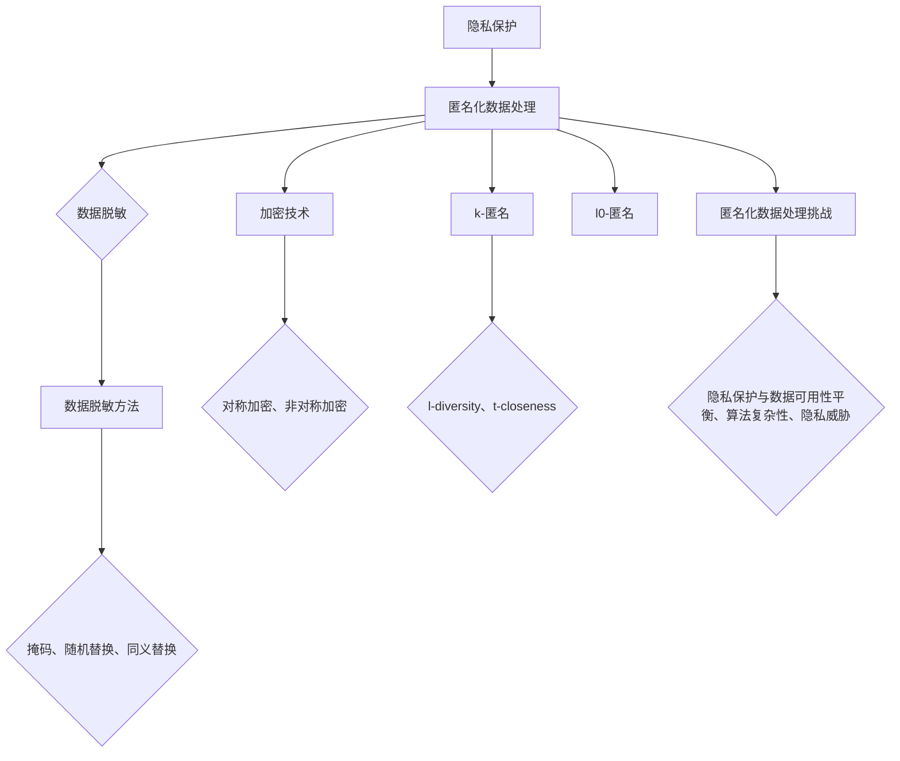

                 

### 第一部分：隐私保护基础

#### 1.1 隐私保护概念与法规

##### 1.1.1 隐私保护的基本概念

隐私保护是现代社会中至关重要的一个议题，尤其在信息爆炸的时代，个人隐私数据的安全受到了极大的威胁。隐私保护的基本概念可以概括为以下几点：

- **隐私**：指个人不愿意公开或与他人分享的个人信息或行为。
- **隐私保护**：旨在防止隐私数据被未经授权的第三方访问、使用、泄露或篡改。
- **隐私风险**：指个人隐私数据可能遭受泄露、滥用或误用的风险。
- **隐私泄露**：指个人隐私数据未经授权被公开或被第三方获取。

##### 1.1.2 隐私保护法规简介

全球范围内，多个国家和地区都制定了相关的隐私保护法规，旨在规范数据处理活动，保障个人隐私权益。以下是一些主要的隐私保护法规：

- **通用数据保护条例（GDPR）**：欧盟的GDPR是目前全球最为严格的隐私保护法规之一，它规定了数据控制者和处理者的义务，以及数据主体的权利。
- **加州消费者隐私法案（CCPA）**：美国的CCPA针对加州居民的个人数据保护，规定了数据收集、使用和共享的具体要求。
- **健康保险可携性与责任法案（HIPAA）**：美国的HIPAA主要针对医疗健康信息的隐私保护，规定了医疗机构的隐私保护义务。

##### 1.1.3 隐私保护的重要性

隐私保护的重要性体现在以下几个方面：

- **法律合规**：遵守隐私保护法规是企业的法律义务，违反法规可能导致高额罚款和声誉损害。
- **客户信任**：有效的隐私保护措施可以增强用户对产品和服务的信任，促进长期合作关系。
- **信息安全**：隐私保护有助于减少信息泄露和网络攻击的风险，保护企业资产安全。
- **社会责任**：作为负责任的企业，隐私保护是履行社会责任、推动社会进步的重要体现。

#### 1.2 隐私泄露风险分析

##### 1.2.1 隐私泄露的途径

隐私泄露的途径多种多样，主要包括以下几种：

- **黑客攻击**：黑客利用网络漏洞、钓鱼攻击等手段窃取个人隐私数据。
- **内部泄露**：企业内部员工故意或因疏忽将隐私数据泄露给外部人员。
- **数据共享**：企业将隐私数据与其他企业或第三方共享，未采取充分的保护措施。
- **设备丢失**：携带隐私数据的设备如笔记本电脑、手机等丢失或被盗。
- **社会工程**：通过欺骗手段获取个人信息，如诈骗电话、虚假网站等。

##### 1.2.2 隐私泄露的后果

隐私泄露可能带来以下严重后果：

- **经济损失**：个人隐私数据被泄露可能导致财产损失，如信用卡盗刷、账户被锁等。
- **身份盗用**：个人隐私数据被不法分子利用进行非法活动，如诈骗、贷款等。
- **声誉损害**：企业隐私数据泄露可能导致客户流失、品牌形象受损。
- **法律责任**：企业因隐私保护不当可能导致法律诉讼和处罚。
- **心理健康影响**：隐私泄露可能导致个人心理压力增大，如焦虑、恐慌等。

##### 1.2.3 风险评估方法

为了有效管理隐私泄露风险，企业需要采取以下风险评估方法：

- **风险评估**：识别和分析企业可能面临的隐私泄露风险，评估其影响和可能性。
- **漏洞扫描**：定期对系统进行漏洞扫描，识别潜在的安全漏洞。
- **数据分类**：根据数据的重要性和敏感性对数据进行分类，采取不同的保护措施。
- **安全培训**：对员工进行隐私保护培训，提高其安全意识和技能。
- **应急响应**：建立应急预案，及时应对隐私泄露事件，减轻损失。

#### 1.3 匿名化数据处理技术概述

##### 1.3.1 匿名化数据处理的目标

匿名化数据处理的目标是使个人隐私数据在保留其分析价值的同时，无法直接识别或追踪到个人。具体目标包括：

- **数据去标识化**：通过去标识化技术，如数据脱敏、加密等，使个人隐私数据无法直接识别。
- **隐私保护**：在保留数据可用性的同时，防止隐私数据被非法访问、使用或泄露。
- **合规性**：确保数据处理活动符合相关隐私保护法规的要求。

##### 1.3.2 匿名化数据处理的方法

匿名化数据处理的方法主要包括以下几种：

- **数据脱敏**：通过技术手段，如替换、掩码等，将敏感数据转换为不可识别的形式。
- **加密**：使用加密算法，对敏感数据进行加密，保护其隐私性。
- **k-匿名**：通过构建匿名化群体，确保在群体内部无法识别个体。
- **l0-匿名**：通过删除或掩码敏感信息，确保在任意子集内无法识别个体。

##### 1.3.3 匿名化数据处理的挑战

匿名化数据处理面临以下挑战：

- **隐私保护与数据可用性平衡**：在保证隐私保护的同时，确保数据的分析价值和可用性。
- **算法复杂性**：匿名化算法的计算复杂度高，可能影响数据处理效率。
- **隐私威胁**：某些匿名化方法可能面临隐私威胁，如差分攻击、同态加密等。

#### 结论

隐私保护是现代社会的一项重要任务，匿名化数据处理技术是保障隐私保护的有效手段。在本文的第一部分，我们介绍了隐私保护的基本概念与法规，分析了隐私泄露的途径和后果，并概述了匿名化数据处理的目标和方法。在接下来的部分，我们将进一步探讨匿名化数据处理技术的具体实现和应用。

### 第一部分：隐私保护基础

#### 1.3 匿名化数据处理技术概述

##### 1.3.1 匿名化数据处理的目标

匿名化数据处理的目标是使个人隐私数据在保留其分析价值的同时，无法直接识别或追踪到个人。具体目标包括：

- **数据去标识化**：通过去标识化技术，如数据脱敏、加密等，将敏感数据转换为不可识别的形式。
- **隐私保护**：在保留数据可用性的同时，防止隐私数据被非法访问、使用或泄露。
- **合规性**：确保数据处理活动符合相关隐私保护法规的要求。

##### 1.3.2 匿名化数据处理的方法

匿名化数据处理的方法主要包括以下几种：

- **数据脱敏**：数据脱敏是通过一定的算法和规则，将敏感数据替换为某种固定的格式或值，从而达到匿名化的目的。常见的脱敏方法有：

  - **掩码**：将敏感数据中的某些字符替换为特定的掩码字符，如将电话号码中的部分数字替换为星号。
  - **随机替换**：将敏感数据中的部分值随机替换为其他值，从而掩盖真实数据。
  - **同义替换**：使用同义词替换敏感词汇，例如将“地址”替换为“居住地”。

- **加密**：加密是将敏感数据通过加密算法转换为密文，只有拥有相应密钥的用户才能解密并获取原始数据。常见的加密算法有：

  - **对称加密**：加密和解密使用相同的密钥，如AES。
  - **非对称加密**：加密和解密使用不同的密钥，如RSA。

- **k-匿名**：k-匿名是一种基于群体隐私保护的方法，其核心思想是将数据集中的个体放入一个大小为k的匿名群体中，使得在群体内部无法识别个体的身份。常见的k-匿名算法有：

  - **l-diversity**：确保每个匿名群体中至少有l个个体，从而降低个体被识别的风险。
  - **t-closeness**：通过调整群体中的个体分布，使得群体内部和外部个体之间的差异最小。

- **l0-匿名**：l0-匿名是一种更加严格的匿名化方法，其目标是确保在任意子集内无法识别个体。l0-匿名通常通过删除或掩码敏感信息来实现。

##### 1.3.3 匿名化数据处理的挑战

匿名化数据处理面临以下挑战：

- **隐私保护与数据可用性平衡**：在保证隐私保护的同时，确保数据的分析价值和可用性。这是一个动态平衡的过程，需要根据具体应用场景进行调整。
- **算法复杂性**：匿名化算法的计算复杂度高，可能影响数据处理效率。例如，k-匿名算法需要遍历整个数据集，寻找合适的匿名群体，计算复杂度较高。
- **隐私威胁**：某些匿名化方法可能面临隐私威胁，如差分攻击、同态加密等。这些威胁可能使得匿名化数据仍存在被破解的风险。

#### 关键概念与联系

为了更好地理解匿名化数据处理技术，我们可以通过Mermaid流程图来展示核心概念之间的联系：



该流程图展示了隐私保护与匿名化数据处理之间的关系，以及匿名化数据处理的核心技术和面临的挑战。

#### 数学模型和公式

匿名化数据处理中，一些核心算法和技术的实现离不开数学模型和公式。以下是一些常见的数学模型和公式：

- **k-匿名中的l-diversity**：
  $$ l-diversity = \sum_{i \in P} \frac{1}{|P|} \sum_{j \in P, j \neq i} dist(i, j) $$
  其中，\( P \) 表示匿名群体，\( i, j \) 表示群体中的个体，\( dist(i, j) \) 表示个体之间的距离度量。

- **l0-匿名中的差异度**：
  $$ diff(I, J) = \sum_{x_i \in I, x_j \in J} \min(|x_i - x_j|, \epsilon) $$
  其中，\( I, J \) 表示两个数据子集，\( x_i, x_j \) 表示子集中的元素，\( \epsilon \) 表示差异度的阈值。

- **数据加密中的加密函数**：
  $$ Enc(x) = E_{k}(x) $$
  其中，\( x \) 表示原始数据，\( k \) 表示加密密钥，\( E_{k} \) 表示加密算法。

#### 项目实战

为了更好地理解匿名化数据处理技术，以下将给出一个基于Python的数据脱敏的实例，展示如何通过代码实现数据脱敏功能。

##### 环境搭建

首先，需要安装Python和相关的数据处理库，如pandas和faker：

```bash
pip install python
pip install pandas
pip install faker
```

##### 数据脱敏代码实现

```python
import pandas as pd
from faker import Faker

# 生成示例数据
fake = Faker()
data = {
    '姓名': [fake.name() for _ in range(100)],
    '电话': [fake.phone_number() for _ in range(100)],
    '邮箱': [fake.email() for _ in range(100)],
    '地址': [fake.address() for _ in range(100)],
}
df = pd.DataFrame(data)

# 数据脱敏
def anonymize_data(df, columns):
    for col in columns:
        if col in df.columns:
            df[col] = df[col].apply(lambda x: '****'.join(x.split('*')[:3]))
    return df

anonymized_df = anonymize_data(df, ['姓名', '电话', '邮箱', '地址'])

# 输出匿名化后的数据
print(anonymized_df)
```

在上述代码中，我们使用Faker库生成示例数据，然后通过自定义的`anonymize_data`函数实现数据脱敏，将敏感数据中的部分值替换为星号，从而达到匿名化的效果。

##### 代码应用解读与分析

1. **数据生成**：使用Faker库生成模拟的个人信息数据，包括姓名、电话、邮箱和地址。
2. **数据脱敏**：自定义`anonymize_data`函数，通过替换敏感数据中的部分值，实现数据的匿名化。
3. **匿名化效果**：输出匿名化后的数据，展示脱敏效果。

通过这个实例，我们可以看到数据脱敏是如何实现的，以及在实际应用中如何保护个人隐私数据。

#### 案例分析

##### 案例背景

某金融公司希望对其客户数据进行匿名化处理，以便进行数据分析、模型训练等，同时确保客户隐私不被泄露。

##### 匿名化数据处理方案

1. **数据采集与预处理**：采集客户的姓名、电话、邮箱和地址等个人信息，并进行初步的数据清洗。
2. **数据脱敏**：使用数据脱敏工具或自定义函数，对敏感信息进行脱敏处理，如将电话号码中的部分数字替换为星号。
3. **数据加密**：对部分敏感信息进行加密处理，如使用AES算法对邮箱地址进行加密。
4. **k-匿名处理**：对数据进行k-匿名处理，确保在群体内部无法识别个体，同时保留数据的分析价值。
5. **数据存储**：将匿名化后的数据存储在安全的数据仓库中，确保数据的安全性。

##### 案例效果评估

1. **隐私保护**：通过数据脱敏和加密技术，客户隐私数据得到了有效保护，降低了隐私泄露的风险。
2. **数据分析价值**：匿名化处理后的数据仍具有高分析价值，可以用于客户行为分析、风险评估等。
3. **合规性**：匿名化数据处理活动符合相关隐私保护法规的要求，确保企业合规运营。

#### 最佳实践 tips

- **数据分类**：在进行匿名化处理之前，应对数据进行分类，根据数据的重要性和敏感性采取不同的保护措施。
- **安全培训**：对员工进行隐私保护培训，提高其安全意识和技能。
- **定期审计**：定期对匿名化数据处理过程进行审计，确保数据保护措施的有效性。

#### 小结

匿名化数据处理技术是保障隐私保护的重要手段。在实际应用中，企业应根据数据的重要性和敏感性，采取合适的匿名化方法，确保数据隐私保护与数据分析价值的平衡。

### 1.1 隐私保护概念与法规

隐私保护是指保护个人隐私数据不被未经授权的第三方访问、使用、泄露或篡改的一系列措施。在数字化时代，个人隐私数据的重要性愈发凸显，隐私保护已成为各国政府和企业的关注重点。

#### 隐私保护的基本概念

隐私保护涉及多个核心概念，包括隐私、隐私风险、隐私泄露等。以下是这些概念的定义：

- **隐私**：指个人不愿意公开或与他人分享的个人信息或行为。例如，姓名、电话、住址、健康状况等。
- **隐私风险**：指个人隐私数据可能遭受泄露、滥用或误用的风险。隐私风险可能来源于内部员工、外部黑客、数据共享等多种途径。
- **隐私泄露**：指个人隐私数据未经授权被公开或被第三方获取。隐私泄露可能带来经济损失、声誉损害、法律诉讼等后果。

#### 隐私保护法规简介

全球范围内，多个国家和地区制定了隐私保护法规，以规范数据处理活动，保障个人隐私权益。以下是部分主要隐私保护法规：

1. **通用数据保护条例（GDPR）**：欧盟的GDPR是目前全球最为严格的隐私保护法规。它规定了数据控制者和处理者的义务，以及数据主体的权利，包括知情权、访问权、删除权等。GDPR的主要特点包括：
   - **数据最小化原则**：收集和处理的数据应限于实现特定目的所必需的数据。
   - **明确的法律依据**：数据处理必须基于合法、公正和透明的原则。
   - **数据泄露通知**：发生数据泄露事件时，应在72小时内通知监管机构。

2. **加州消费者隐私法案（CCPA）**：CCPA是美国的隐私保护法规，主要针对加州居民的个人数据保护。其主要内容包括：
   - **知情权**：消费者有权知道其个人信息被收集、使用和共享的情况。
   - **访问权**：消费者有权访问其个人信息，并要求企业删除其个人信息。
   - **权利反对**：消费者有权反对企业对个人信息的销售。

3. **健康保险可携性与责任法案（HIPAA）**：HIPAA主要针对医疗健康信息的隐私保护。其主要内容包括：
   - **隐私规则**：规定医疗机构在处理患者信息时必须遵守的隐私保护标准。
   - **安全规则**：要求医疗机构采取合理的措施保护患者信息的机密性、完整性和可用性。

#### 隐私保护的重要性

隐私保护的重要性体现在以下几个方面：

1. **法律合规**：遵守隐私保护法规是企业的法律义务。违反法规可能导致高额罚款和声誉损害。例如，GDPR规定的违规罚款最高可达公司全球营业额的4%。

2. **客户信任**：有效的隐私保护措施可以增强用户对产品和服务的信任，促进长期合作关系。在用户隐私数据得到保障的情况下，用户更愿意使用企业的产品和服务。

3. **信息安全**：隐私保护有助于减少信息泄露和网络攻击的风险，保护企业资产安全。有效的隐私保护措施可以防止内部员工滥用数据和外部黑客的攻击。

4. **社会责任**：作为负责任的企业，隐私保护是履行社会责任、推动社会进步的重要体现。通过保护用户隐私，企业可以树立良好的社会形象，获得社会的认可和支持。

### 结论

隐私保护是现代社会的一项重要任务。在全球化和数字化的大背景下，企业和个人都应充分认识到隐私保护的重要性，采取有效的措施保障个人隐私数据的安全。通过遵守隐私保护法规、加强技术防护、提高员工安全意识等手段，我们可以共同构建一个更加安全和可信的数字社会。在本文的第一部分，我们对隐私保护的基本概念与法规进行了详细探讨，为后续内容的展开奠定了基础。

#### 1.2 隐私泄露风险分析

隐私泄露风险是指个人隐私数据可能遭受泄露、滥用或误用的风险。在数字化时代，随着数据收集和处理的规模不断扩大，隐私泄露风险日益加剧。了解隐私泄露的途径和后果，有助于企业和个人采取有效的防护措施，降低风险。

##### 1.2.1 隐私泄露的途径

隐私泄露的途径多种多样，主要包括以下几种：

1. **黑客攻击**：黑客利用网络漏洞、钓鱼攻击等手段窃取个人隐私数据。这类攻击可能来自外部黑客，也可能来自内部员工的恶意行为。

   - **网络漏洞**：黑客通过识别和利用系统漏洞，如SQL注入、跨站脚本攻击（XSS）等，非法访问系统中的隐私数据。
   - **钓鱼攻击**：黑客通过伪造网站、发送虚假邮件等手段，诱骗用户输入个人信息，从而窃取隐私数据。

2. **内部泄露**：企业内部员工因疏忽或故意将隐私数据泄露给外部人员。内部泄露的风险通常比外部攻击更为隐蔽和难以防范。

   - **员工疏忽**：员工未按照安全规范操作，如将含有隐私数据的信息留在公共位置、未加密敏感数据等。
   - **员工恶意行为**：部分员工可能因利益驱动或个人原因，故意泄露公司或客户的隐私数据。

3. **数据共享**：企业将隐私数据与其他企业或第三方共享，未采取充分的保护措施。在数据共享过程中，隐私数据可能因传输不当或存储不安全而遭到泄露。

   - **未经授权的数据共享**：企业未明确规定数据共享的范围和条件，导致隐私数据被未经授权的第三方获取。
   - **数据传输不安全**：在数据传输过程中，未使用加密技术，导致数据在传输途中被截获和窃取。

4. **设备丢失**：携带隐私数据的设备如笔记本电脑、手机等丢失或被盗。设备丢失可能使隐私数据暴露在未经授权的第三方手中。

   - **设备被盗**：不法分子通过盗窃或破解设备，非法访问和获取其中的隐私数据。
   - **设备丢失**：员工将设备遗忘在公共场所，如机场、咖啡厅等，导致隐私数据泄露。

5. **社会工程**：通过欺骗手段获取个人信息，如诈骗电话、虚假网站等。社会工程攻击利用人性的弱点，欺骗用户泄露隐私信息。

   - **诈骗电话**：不法分子冒充政府部门、银行等机构，欺骗用户提供个人信息。
   - **虚假网站**：黑客通过搭建虚假网站，诱骗用户输入个人信息，从而获取隐私数据。

##### 1.2.2 隐私泄露的后果

隐私泄露可能带来以下严重后果：

1. **经济损失**：个人隐私数据被泄露可能导致财产损失，如信用卡盗刷、账户被锁等。不法分子可能利用泄露的个人信息进行欺诈活动，导致用户经济损失。

2. **身份盗用**：个人隐私数据被不法分子利用进行非法活动，如诈骗、贷款等。身份盗用可能导致用户面临严重的法律和经济后果。

3. **声誉损害**：企业隐私数据泄露可能导致客户流失、品牌形象受损。在数字化时代，客户对企业的信任至关重要，隐私泄露事件可能严重损害企业的声誉和业务。

4. **法律责任**：企业因隐私保护不当可能导致法律诉讼和处罚。隐私保护法规如GDPR、CCPA等对企业的隐私保护义务有明确要求，违反法规可能导致高额罚款和诉讼。

5. **心理健康影响**：隐私泄露可能导致个人心理压力增大，如焦虑、恐慌等。个人隐私数据的泄露可能使用户感到无助和恐惧，对个人生活产生负面影响。

##### 1.2.3 风险评估方法

为了有效管理隐私泄露风险，企业需要采取以下风险评估方法：

1. **风险评估**：识别和分析企业可能面临的隐私泄露风险，评估其影响和可能性。风险评估可以帮助企业了解隐私泄露风险的严重程度，制定相应的防护措施。

2. **漏洞扫描**：定期对系统进行漏洞扫描，识别潜在的安全漏洞。漏洞扫描可以帮助企业发现系统中的安全隐患，及时修复，降低风险。

3. **数据分类**：根据数据的重要性和敏感性对数据进行分类，采取不同的保护措施。敏感数据应采取更加严格的保护措施，如加密、访问控制等。

4. **安全培训**：对员工进行隐私保护培训，提高其安全意识和技能。通过安全培训，员工可以更好地理解和遵守隐私保护规范，降低隐私泄露的风险。

5. **应急响应**：建立应急预案，及时应对隐私泄露事件，减轻损失。应急预案应包括事件报告、调查、应急响应措施等环节，确保企业在发生隐私泄露事件时能够迅速反应，降低损失。

### 结论

隐私泄露风险是企业和个人面临的重大挑战。通过了解隐私泄露的途径和后果，企业可以采取有效的风险评估方法和管理措施，降低隐私泄露风险。个人也应提高隐私保护意识，采取安全措施保护个人隐私数据。只有通过共同努力，我们才能构建一个更加安全和可信的数字化环境。在本文的第一部分，我们对隐私泄露风险进行了详细分析，为后续内容的展开奠定了基础。

#### 1.3 匿名化数据处理技术概述

匿名化数据处理技术是隐私保护的重要手段，旨在通过技术手段使个人隐私数据在保留其分析价值的同时，无法直接识别或追踪到个人。这一过程不仅保护了个人隐私，同时也满足了数据分析的需求。以下是匿名化数据处理技术的目标、方法和面临的挑战。

##### 1.3.1 匿名化数据处理的目标

匿名化数据处理的主要目标包括：

1. **数据去标识化**：通过去除或隐藏个人标识信息，使得个人隐私数据无法直接识别。去标识化后的数据仍然可以用于分析，但无法关联到具体的个人。

2. **隐私保护**：在保留数据可用性的同时，防止隐私数据被非法访问、使用或泄露。匿名化处理技术应确保在处理和分析数据的过程中，个人隐私得到有效保护。

3. **合规性**：确保数据处理活动符合相关隐私保护法规的要求。例如，欧盟的GDPR和加州的CCPA等法规对数据匿名化提出了具体要求。

##### 1.3.2 匿名化数据处理的方法

匿名化数据处理的方法多种多样，以下介绍几种常见的方法：

1. **数据脱敏**：数据脱敏是通过一定的算法和规则，将敏感数据转换为不可识别的形式。常见的数据脱敏方法包括：
   - **掩码**：将敏感数据中的某些字符替换为特定的掩码字符，如将电话号码中的部分数字替换为星号。
   - **随机替换**：将敏感数据中的部分值随机替换为其他值，从而掩盖真实数据。
   - **同义替换**：使用同义词替换敏感词汇，例如将“地址”替换为“居住地”。

2. **加密**：加密是将敏感数据通过加密算法转换为密文，只有拥有相应密钥的用户才能解密并获取原始数据。常见的加密算法有：
   - **对称加密**：加密和解密使用相同的密钥，如AES。
   - **非对称加密**：加密和解密使用不同的密钥，如RSA。

3. **k-匿名**：k-匿名是一种基于群体隐私保护的方法，其核心思想是将数据集中的个体放入一个大小为k的匿名群体中，使得在群体内部无法识别个体的身份。常见的k-匿名算法有：
   - **l-diversity**：确保每个匿名群体中至少有l个个体，从而降低个体被识别的风险。
   - **t-closeness**：通过调整群体中的个体分布，使得群体内部和外部个体之间的差异最小。

4. **l0-匿名**：l0-匿名是一种更加严格的匿名化方法，其目标是确保在任意子集内无法识别个体。l0-匿名通常通过删除或掩码敏感信息来实现。

##### 1.3.3 匿名化数据处理的挑战

匿名化数据处理虽然能够有效保护个人隐私，但同时也面临以下挑战：

1. **隐私保护与数据可用性平衡**：在保证隐私保护的同时，确保数据的分析价值和可用性。这是一个动态平衡的过程，需要根据具体应用场景进行调整。

2. **算法复杂性**：匿名化算法的计算复杂度高，可能影响数据处理效率。例如，k-匿名算法需要遍历整个数据集，寻找合适的匿名群体，计算复杂度较高。

3. **隐私威胁**：某些匿名化方法可能面临隐私威胁，如差分攻击、同态加密等。这些威胁可能使得匿名化数据仍存在被破解的风险。

4. **数据质量**：匿名化处理可能导致数据质量下降，影响数据分析的准确性。例如，通过随机替换或掩码等手段进行匿名化，可能会丢失部分数据信息，从而影响数据分析的结果。

##### 结论

匿名化数据处理技术是保障隐私保护的重要手段，但同时也面临多方面的挑战。了解匿名化数据处理的目标、方法以及面临的挑战，有助于企业和研究机构更好地应用这些技术，实现隐私保护与数据价值的平衡。在本文的第一部分，我们对匿名化数据处理技术进行了概述，为后续内容的展开奠定了基础。

### 2.1 数据脱敏技术

数据脱敏技术是一种常用的匿名化数据处理方法，旨在通过技术手段将敏感数据转换为不可识别的形式，从而保护个人隐私。数据脱敏技术广泛应用于金融、医疗、电商等领域，其核心目标是确保在保留数据分析价值的同时，最大限度地减少隐私泄露的风险。以下是数据脱敏技术的基本原理、具体方法和优缺点。

#### 2.1.1 数据脱敏的基本原理

数据脱敏的基本原理是通过替换、掩码、加密等手段，将敏感数据转换为不可识别的形式，从而保护个人隐私。具体来说，数据脱敏技术主要包括以下几个方面：

1. **数据替换**：将敏感数据中的部分值替换为特定的掩码值或随机值。例如，将电话号码中的部分数字替换为星号，或将地址中的某些字符替换为随机字符。
2. **数据掩码**：使用固定的掩码字符或特殊字符，将敏感数据的部分字符掩盖。例如，将身份证号码中的部分数字用*替换，或将邮箱地址中的用户名替换为固定的字符串。
3. **数据加密**：使用加密算法，将敏感数据加密为密文，从而保护数据的隐私性。解密后的数据可以用于数据分析，但未经授权的用户无法直接读取原始数据。
4. **数据混淆**：通过将敏感数据的值进行随机变换，使得数据在视觉上难以识别，从而提高隐私保护的安全性。

#### 2.1.2 数据脱敏的方法

数据脱敏的方法多种多样，以下介绍几种常见的数据脱敏方法：

1. **掩码**：
   - **固定掩码**：使用固定的掩码字符，如电话号码的中间四位使用*替换。
   - **动态掩码**：根据数据的特点和需求，动态生成掩码字符，如身份证号码中的部分数字使用特定的掩码字符。

2. **随机替换**：
   - **随机字符替换**：将敏感数据中的部分字符替换为随机字符，如将姓名中的部分字符替换为随机字母。
   - **随机数字替换**：将敏感数据中的部分数字替换为随机数字，如将电话号码中的部分数字替换为随机数字。

3. **同义替换**：
   - **词义替换**：将敏感数据中的敏感词汇替换为同义词，如将“地址”替换为“居住地”。
   - **描述性替换**：使用描述性语言替换敏感数据，如将具体的日期替换为“几天前”或“几个月前”。

4. **加密**：
   - **对称加密**：使用相同的密钥进行加密和解密，如AES加密算法。
   - **非对称加密**：使用不同的密钥进行加密和解密，如RSA加密算法。

5. **数据混淆**：
   - **字符混淆**：将敏感数据中的字符进行随机变换，如将字母替换为其他字母或数字。
   - **数值混淆**：将敏感数据中的数值进行随机变换，如将电话号码中的数字替换为其他数字。

#### 2.1.3 数据脱敏的优缺点

数据脱敏技术在保障个人隐私方面具有显著优势，但同时也存在一些缺点：

**优点**：

1. **保护隐私**：通过将敏感数据转换为不可识别的形式，数据脱敏技术可以有效防止个人隐私数据被未经授权的第三方访问和滥用。
2. **符合法规**：许多隐私保护法规，如GDPR和CCPA等，要求企业在处理个人数据时必须采取脱敏措施。数据脱敏技术有助于企业合规运营。
3. **灵活性强**：数据脱敏技术可以根据不同的数据类型和隐私保护需求，选择合适的脱敏方法，从而实现灵活的数据保护。

**缺点**：

1. **数据质量下降**：数据脱敏可能导致部分数据信息丢失，从而影响数据分析的准确性。例如，通过随机替换或掩码等手段进行脱敏，可能会丢失敏感数据中的某些关键信息。
2. **计算复杂度高**：某些脱敏方法，如k-匿名和l0-匿名等，需要遍历整个数据集，寻找合适的匿名群体，计算复杂度较高，可能影响数据处理效率。
3. **可能存在隐私威胁**：某些脱敏方法，如差分攻击和同态加密等，可能面临隐私威胁，使得匿名化数据仍存在被破解的风险。

### 结论

数据脱敏技术是一种有效的匿名化数据处理方法，可以在保障个人隐私的同时，满足数据分析的需求。然而，企业在应用数据脱敏技术时，需要权衡其优点和缺点，选择合适的脱敏方法，并根据实际应用场景进行优化。在本文的第二部分，我们对数据脱敏技术进行了详细探讨，为后续内容的展开奠定了基础。

#### 2.2 k-匿名技术

k-匿名技术是一种重要的隐私保护方法，旨在通过将数据集中的个体放入一个大小为k的匿名群体中，确保在群体内部无法识别个体的身份。k-匿名技术适用于许多领域，如医疗数据共享、人口普查等，能够有效保护个人隐私，同时保留数据的分析价值。以下是k-匿名技术的原理、算法以及性能分析。

##### 2.2.1 k-匿名的基本原理

k-匿名的基本原理是：将数据集中的个体放入一个大小为k的匿名群体中，使得在群体内部无法识别个体的身份。具体来说，k-匿名技术遵循以下原则：

1. **群体内不可识别**：对于任意一个个体，群体内的其他k-1个个体无法通过任何属性（如年龄、性别等）识别出该个体。这意味着，在群体内部，个体的属性是均匀分布的，无法通过单一属性识别个体。
2. **群体间可区分**：不同群体之间的个体可以通过某些属性进行区分，以确保不同群体的属性分布是可区分的。例如，在医疗数据共享中，可以区分不同医院的病人群体。

##### 2.2.2 k-匿名的算法

k-匿名技术有许多算法实现，以下介绍两种常见的k-匿名算法：

1. **LoA算法**：
   - **算法描述**：LoA（Lowest Attribute Value）算法通过将数据集中的每个个体放入具有最小属性值的匿名群体中，实现k-匿名。具体步骤如下：
     1. 对数据集按某一属性（如年龄）进行排序。
     2. 将排序后的数据集划分为k个子集，每个子集包含相同数量的个体。
     3. 将每个个体放入具有最小属性值的子集中。
   - **算法优势**：LoA算法实现简单，易于理解，但可能在属性分布不均匀的情况下导致隐私泄露。

2. **RUD算法**：
   - **算法描述**：RUD（Recursive Update Distance）算法通过迭代优化，逐步调整匿名群体的边界，实现k-匿名。具体步骤如下：
     1. 初始化匿名群体，通常选择数据集的子集作为初始匿名群体。
     2. 对于每个匿名群体，计算其与其他群体的属性距离，选择距离最小的群体进行合并。
     3. 重复步骤2，直到满足k-匿名条件。
   - **算法优势**：RUD算法能够适应不同数据集的属性分布，提高隐私保护水平。

##### 2.2.3 k-匿名的性能分析

k-匿名的性能分析主要包括以下方面：

1. **隐私保护**：
   - **匿名性**：k-匿名技术能够有效保护个人隐私，降低隐私泄露的风险。然而，隐私保护程度受k值影响，k值越大，隐私保护越强，但数据可用性可能降低。
   - **隐私威胁**：某些k-匿名算法可能面临隐私威胁，如差分攻击。差分攻击通过分析匿名化数据中的细微差异，可能识别出特定个体。

2. **数据可用性**：
   - **数据完整性**：k-匿名处理可能导致部分数据信息丢失，影响数据分析的完整性。在k-匿名处理中，应尽量保留关键信息，确保数据分析的准确性。
   - **数据处理效率**：k-匿名算法的计算复杂度较高，特别是在大数据场景下，可能影响数据处理效率。优化算法和并行计算技术可以提高处理效率。

3. **算法复杂性**：
   - **计算复杂度**：k-匿名算法需要遍历整个数据集，计算复杂度较高。RUD算法等优化算法可以降低计算复杂度，提高处理效率。
   - **资源消耗**：k-匿名处理需要消耗大量计算资源和存储资源。在大数据场景下，应合理配置计算资源和存储资源，确保算法高效运行。

##### 结论

k-匿名技术是一种重要的隐私保护方法，能够在保留数据分析价值的同时，保护个人隐私。然而，k-匿名技术也面临隐私威胁和计算复杂度等挑战。在实际应用中，企业应根据数据特点和隐私保护需求，选择合适的k-匿名算法，并采取优化措施，提高隐私保护水平。在本文的第二部分，我们对k-匿名技术进行了详细探讨，为后续内容的展开奠定了基础。

### 2.3 l0-匿名技术

l0-匿名技术是一种严格的隐私保护方法，旨在确保在任意子集内无法识别任何个体。与k-匿名技术不同，l0-匿名要求在所有可能的子集内都无法追踪到具体的个体。这种严格的匿名化方法在保障隐私方面具有很高的安全性，但也对数据处理提出了更高的要求。以下是l0-匿名技术的原理、算法以及性能分析。

##### 2.3.1 l0-匿名的基本原理

l0-匿名技术的核心思想是：对于给定的数据集，通过删除或掩码敏感信息，使得在任意子集内无法识别出任何个体。具体来说，l0-匿名技术遵循以下原则：

1. **子集内不可识别**：对于数据集中的任意子集，子集中的个体信息无法直接识别。这意味着，即使只关注数据集的一个子集，也无法通过任何属性识别出具体个体。
2. **子集间可区分**：不同子集之间可以通过某些属性进行区分，以保持数据集的整体结构。这种区分有助于在必要时恢复部分数据，但不会泄露任何个体的隐私信息。

##### 2.3.2 l0-匿名的算法

实现l0-匿名的技术方法多种多样，以下介绍几种常见的算法：

1. **随机投影**：
   - **算法描述**：随机投影算法通过将数据集投影到低维空间，实现l0-匿名。具体步骤如下：
     1. 生成一个随机投影矩阵。
     2. 对数据集进行随机投影，得到低维空间中的数据。
     3. 对低维空间中的数据进行聚类，将相似的个体聚集在一起，实现l0-匿名。
   - **算法优势**：随机投影算法简单，易于实现，能够有效减少数据维数，提高隐私保护水平。

2. **差分隐私**：
   - **算法描述**：差分隐私通过在输出数据中引入随机噪声，确保在任意子集内无法识别任何个体。具体步骤如下：
     1. 对原始数据进行预处理，提取敏感信息。
     2. 对敏感信息引入ε-差分隐私机制，生成匿名化数据。
     3. 对匿名化数据进行输出，保证隐私保护。
   - **算法优势**：差分隐私算法具有理论上的严格保障，适用于多种数据场景，能够灵活调整隐私保护强度。

3. **差异掩码**：
   - **算法描述**：差异掩码通过掩码敏感信息中的微小差异，实现l0-匿名。具体步骤如下：
     1. 对敏感信息进行差异分析，识别微小差异。
     2. 对差异进行掩码处理，将敏感信息转换为不可识别的形式。
     3. 将掩码后的数据与原始数据进行对比，确保在任意子集内无法识别任何个体。
   - **算法优势**：差异掩码算法对敏感数据的保护较为严格，能够有效减少隐私泄露的风险。

##### 2.3.3 l0-匿名的性能分析

l0-匿名的性能分析主要包括以下方面：

1. **隐私保护**：
   - **匿名性**：l0-匿名技术能够确保在任意子集内无法识别任何个体，从而提供较高的隐私保护水平。
   - **隐私威胁**：尽管l0-匿名技术提供了严格的隐私保护，但在某些情况下，可能仍面临隐私威胁，如差分攻击。因此，需要不断优化算法，提高隐私保护水平。

2. **数据可用性**：
   - **数据完整性**：l0-匿名处理可能导致部分数据信息丢失，从而影响数据分析的完整性。在实际应用中，应尽量保留关键信息，确保数据分析的准确性。
   - **数据处理效率**：l0-匿名算法的计算复杂度较高，特别是在大数据场景下，可能影响数据处理效率。优化算法和并行计算技术可以提高处理效率。

3. **算法复杂性**：
   - **计算复杂度**：l0-匿名算法需要遍历整个数据集，计算复杂度较高。优化算法和并行计算技术可以降低计算复杂度，提高处理效率。
   - **资源消耗**：l0-匿名处理需要消耗大量计算资源和存储资源。在大数据场景下，应合理配置计算资源和存储资源，确保算法高效运行。

##### 结论

l0-匿名技术是一种严格的隐私保护方法，能够在任意子集内确保个人隐私不被泄露。然而，l0-匿名技术也面临计算复杂度高、数据可用性下降等挑战。在实际应用中，企业应根据数据特点和隐私保护需求，选择合适的l0-匿名算法，并采取优化措施，提高隐私保护水平。在本文的第二部分，我们对l0-匿名技术进行了详细探讨，为后续内容的展开奠定了基础。

### 2.4 数据混淆技术

数据混淆技术是一种通过改变数据的表达方式来保护隐私的匿名化方法。其核心思想是将原始数据转换为难以解读的形式，以防止未经授权的访问。数据混淆技术广泛应用于数据挖掘、机器学习等领域，旨在确保数据的隐私性与分析价值之间的平衡。以下是数据混淆技术的原理、具体方法以及优缺点。

#### 2.4.1 数据混淆的基本原理

数据混淆技术的基本原理包括以下两个方面：

1. **数据变形**：通过将原始数据转换为不同的表达形式，使得数据在视觉上变得难以解读。例如，将日期数据转换为星期几，将连续的数值数据转换为离散的类别数据。

2. **引入噪声**：在原始数据中引入随机噪声，使得数据的变化具有不确定性，从而增加隐私保护强度。例如，在数值数据中加入随机扰动，或在文本数据中加入随机字符。

通过数据变形和引入噪声，数据混淆技术可以在保持数据分析价值的同时，有效保护个人隐私。

#### 2.4.2 数据混淆的方法

数据混淆技术有多种实现方法，以下介绍几种常见的方法：

1. **随机替换**：
   - **方法描述**：将原始数据中的部分值替换为随机值，以掩盖真实数据。例如，将电话号码中的部分数字替换为随机数字。
   - **适用场景**：适用于对数据隐私要求较高的场景，如客户信息保护。

2. **同义替换**：
   - **方法描述**：使用同义词替换敏感词汇，以改变数据的语义表达。例如，将“地址”替换为“居住地”。
   - **适用场景**：适用于文本数据保护，可以减少数据隐私泄露的风险。

3. **差分加密**：
   - **方法描述**：通过对数据中的差异进行加密，以保护数据的隐私。例如，对数据之间的差异值进行加密处理。
   - **适用场景**：适用于对数据完整性和隐私性都有较高要求的场景，如金融数据保护。

4. **随机投影**：
   - **方法描述**：将数据投影到低维空间，以减少数据的可解读性。例如，将高维数据投影到二维或三维空间。
   - **适用场景**：适用于高维数据的隐私保护，可以降低数据的复杂度。

#### 2.4.3 数据混淆的优缺点

数据混淆技术具有以下优缺点：

**优点**：

1. **保护隐私**：通过改变数据的表达形式和引入噪声，数据混淆技术可以有效防止敏感数据的直接泄露。

2. **适用性强**：数据混淆技术适用于多种数据类型，如文本、数值和图像等，可以灵活应用于不同场景。

3. **实现简单**：数据混淆技术的实现相对简单，可以通过简单的算法和操作实现，易于集成到现有系统中。

**缺点**：

1. **数据可用性降低**：数据混淆可能导致部分数据信息的丢失，从而影响数据分析的准确性。

2. **计算复杂度高**：某些数据混淆方法，如随机投影和差分加密等，计算复杂度较高，可能影响数据处理效率。

3. **隐私威胁**：虽然数据混淆技术可以保护数据隐私，但在某些情况下，可能面临隐私威胁，如差分攻击。

#### 结论

数据混淆技术是一种有效的隐私保护方法，可以在保持数据分析价值的同时，有效保护个人隐私。然而，企业在应用数据混淆技术时，需要权衡其优点和缺点，选择合适的混淆方法，并根据实际应用场景进行优化。在本文的第二部分，我们对数据混淆技术进行了详细探讨，为后续内容的展开奠定了基础。

### 2.5 匿名化数据处理在数据预处理中的应用

#### 2.5.1 数据预处理的重要性

在人工智能和机器学习项目中，数据预处理是至关重要的环节。它直接影响模型训练的效果和最终应用的准确性。数据预处理包括数据清洗、数据整合、数据转换和数据归一化等步骤。在这些步骤中，匿名化数据处理尤为重要，因为许多数据集包含敏感信息，如个人身份信息、地址、电话号码等。如果不进行匿名化处理，直接使用这些数据可能会导致隐私泄露，违反相关法律法规，损害企业的声誉。因此，数据预处理中的匿名化处理是确保数据安全和合规性的关键步骤。

#### 2.5.2 匿名化数据处理在数据预处理中的应用场景

匿名化数据处理在数据预处理中的应用场景主要包括以下几种：

1. **个人身份信息保护**：在医疗、金融和电商等领域，数据集中通常包含用户的姓名、身份证号码、电话号码等敏感信息。匿名化处理可以将这些信息替换为不可识别的字符或随机值，从而保护用户的隐私。

2. **地理位置信息保护**：地理位置信息如地址、经纬度等可能包含用户的居住地和工作地等敏感信息。通过匿名化处理，可以将具体的地理位置转换为模糊化的地址或经纬度区间，以保护用户的隐私。

3. **行为数据保护**：在分析用户行为数据时，如点击记录、浏览历史等，匿名化处理可以掩盖用户的具体行为，从而防止用户隐私泄露。

4. **交易数据保护**：在金融交易数据中，如账户号码、交易金额等敏感信息，匿名化处理可以确保这些信息不会被未经授权的第三方获取。

#### 2.5.3 匿名化数据处理在数据预处理中的挑战

尽管匿名化数据处理在数据预处理中具有重要意义，但同时也面临一系列挑战：

1. **隐私保护与数据可用性的平衡**：在匿名化处理过程中，需要平衡隐私保护和数据可用性。过度的匿名化处理可能导致数据质量下降，影响模型训练效果。因此，如何在保护隐私的同时，保留数据的分析价值是一个关键问题。

2. **计算复杂度**：某些复杂的匿名化算法，如k-匿名和l0-匿名，计算复杂度较高，可能影响数据处理效率。在大规模数据集上应用这些算法时，需要优化算法以提高处理速度。

3. **隐私威胁**：虽然匿名化处理可以减少隐私泄露的风险，但某些匿名化方法可能面临隐私威胁，如差分攻击。因此，需要不断研究和开发新的匿名化算法，以提高隐私保护水平。

4. **数据质量下降**：匿名化处理可能导致部分数据信息的丢失，从而影响数据分析的准确性。在匿名化处理过程中，需要尽量保留关键信息，确保数据分析的完整性。

#### 结论

匿名化数据处理在数据预处理中的应用是保障隐私保护的重要手段。在实际应用中，企业应根据数据的特点和隐私保护需求，选择合适的匿名化方法，并采取优化措施，提高隐私保护水平。同时，需要关注匿名化处理过程中的挑战，确保在保护隐私的同时，不影响数据的分析价值。在本文的第二部分，我们对匿名化数据处理在数据预处理中的应用进行了详细探讨，为后续内容的展开奠定了基础。

### 2.6 匿名化数据处理在模型训练中的应用

#### 2.6.1 模型训练过程中的隐私保护需求

在机器学习和深度学习领域，模型训练过程通常需要大量训练数据。这些数据往往包含用户的敏感信息，如个人身份、地理位置、行为记录等。如果不进行适当的匿名化处理，直接使用这些数据可能会导致隐私泄露，违反相关法律法规，损害企业的声誉。因此，模型训练过程中的隐私保护需求显得尤为重要。匿名化数据处理技术能够在保留数据分析价值的同时，有效保护用户的隐私，确保数据安全和合规性。

#### 2.6.2 匿名化数据处理在模型训练中的应用方法

为了满足模型训练过程中的隐私保护需求，可以使用多种匿名化数据处理方法。以下介绍几种常见的方法：

1. **数据脱敏**：
   - **方法描述**：数据脱敏是通过替换、掩码等方式，将敏感数据转换为不可识别的形式。例如，将电话号码中的部分数字替换为星号，或将地址中的某些字符替换为随机字符。
   - **适用场景**：数据脱敏适用于需要保护个人身份信息的场景，如金融、医疗和电商等领域。

2. **加密**：
   - **方法描述**：加密是将敏感数据通过加密算法转换为密文，只有解密密钥的持有者才能获取原始数据。例如，使用AES加密算法对敏感数据加密。
   - **适用场景**：加密适用于需要保护数据完整性和机密性的场景，如金融交易数据保护。

3. **k-匿名**：
   - **方法描述**：k-匿名是将数据集中的个体放入一个大小为k的匿名群体中，确保在群体内部无法识别个体的身份。例如，可以使用l-diversity和t-closeness算法实现k-匿名。
   - **适用场景**：k-匿名适用于需要保护群体隐私的场景，如人口普查和医疗数据共享。

4. **l0-匿名**：
   - **方法描述**：l0-匿名是确保在任意子集内无法识别任何个体。例如，可以使用随机投影和差分隐私算法实现l0-匿名。
   - **适用场景**：l0-匿名适用于需要高隐私保护的场景，如国家安全和金融交易数据保护。

5. **数据混淆**：
   - **方法描述**：数据混淆是通过改变数据的表达形式和引入噪声，使得数据难以解读。例如，将日期数据转换为星期几，或将数值数据转换为离散的类别数据。
   - **适用场景**：数据混淆适用于多种数据类型，如文本、数值和图像等，可以灵活应用于不同场景。

#### 2.6.3 匿名化数据处理在模型训练中的挑战

尽管匿名化数据处理技术能够在模型训练过程中有效保护用户隐私，但同时也面临一系列挑战：

1. **隐私保护与数据可用性的平衡**：在匿名化处理过程中，需要平衡隐私保护和数据可用性。过度的匿名化处理可能导致数据质量下降，影响模型训练效果。因此，如何在保护隐私的同时，保留数据的分析价值是一个关键问题。

2. **计算复杂度**：某些复杂的匿名化算法，如k-匿名和l0-匿名，计算复杂度较高，可能影响数据处理效率。在大规模数据集上应用这些算法时，需要优化算法以提高处理速度。

3. **隐私威胁**：虽然匿名化处理可以减少隐私泄露的风险，但某些匿名化方法可能面临隐私威胁，如差分攻击。因此，需要不断研究和开发新的匿名化算法，以提高隐私保护水平。

4. **数据质量下降**：匿名化处理可能导致部分数据信息的丢失，从而影响数据分析的准确性。在匿名化处理过程中，需要尽量保留关键信息，确保数据分析的完整性。

#### 结论

匿名化数据处理在模型训练中的应用是保障隐私保护的重要手段。在实际应用中，企业应根据数据的特点和隐私保护需求，选择合适的匿名化方法，并采取优化措施，提高隐私保护水平。同时，需要关注匿名化处理过程中的挑战，确保在保护隐私的同时，不影响模型训练效果。在本文的第二部分，我们对匿名化数据处理在模型训练中的应用进行了详细探讨，为后续内容的展开奠定了基础。

### 2.7 匿名化数据处理在模型评估中的应用

#### 2.7.1 模型评估过程中的隐私保护需求

在模型评估过程中，通常需要对训练好的模型进行测试和验证，以评估其在实际应用中的性能。然而，模型评估过程可能会涉及敏感数据，如用户行为记录、医疗健康数据等。这些数据中包含用户的个人隐私信息，如果不进行适当的匿名化处理，直接使用这些数据可能会导致隐私泄露，违反相关法律法规，损害企业的声誉。因此，模型评估过程中的隐私保护需求尤为重要。匿名化数据处理技术能够在保留数据分析价值的同时，有效保护用户的隐私，确保数据安全和合规性。

#### 2.7.2 匿名化数据处理在模型评估中的应用方法

为了满足模型评估过程中的隐私保护需求，可以使用多种匿名化数据处理方法。以下介绍几种常见的方法：

1. **数据脱敏**：
   - **方法描述**：数据脱敏是通过替换、掩码等方式，将敏感数据转换为不可识别的形式。例如，将电话号码中的部分数字替换为星号，或将地址中的某些字符替换为随机字符。
   - **适用场景**：数据脱敏适用于需要保护个人身份信息的场景，如金融、医疗和电商等领域。

2. **加密**：
   - **方法描述**：加密是将敏感数据通过加密算法转换为密文，只有解密密钥的持有者才能获取原始数据。例如，使用AES加密算法对敏感数据加密。
   - **适用场景**：加密适用于需要保护数据完整性和机密性的场景，如金融交易数据保护。

3. **k-匿名**：
   - **方法描述**：k-匿名是将数据集中的个体放入一个大小为k的匿名群体中，确保在群体内部无法识别个体的身份。例如，可以使用l-diversity和t-closeness算法实现k-匿名。
   - **适用场景**：k-匿名适用于需要保护群体隐私的场景，如人口普查和医疗数据共享。

4. **l0-匿名**：
   - **方法描述**：l0-匿名是确保在任意子集内无法识别任何个体。例如，可以使用随机投影和差分隐私算法实现l0-匿名。
   - **适用场景**：l0-匿名适用于需要高隐私保护的场景，如国家安全和金融交易数据保护。

5. **数据混淆**：
   - **方法描述**：数据混淆是通过改变数据的表达形式和引入噪声，使得数据难以解读。例如，将日期数据转换为星期几，或将数值数据转换为离散的类别数据。
   - **适用场景**：数据混淆适用于多种数据类型，如文本、数值和图像等，可以灵活应用于不同场景。

#### 2.7.3 匿名化数据处理在模型评估中的挑战

尽管匿名化数据处理技术能够在模型评估过程中有效保护用户隐私，但同时也面临一系列挑战：

1. **隐私保护与数据可用性的平衡**：在匿名化处理过程中，需要平衡隐私保护和数据可用性。过度的匿名化处理可能导致数据质量下降，影响模型评估的准确性。因此，如何在保护隐私的同时，保留数据的分析价值是一个关键问题。

2. **计算复杂度**：某些复杂的匿名化算法，如k-匿名和l0-匿名，计算复杂度较高，可能影响数据处理效率。在大规模数据集上应用这些算法时，需要优化算法以提高处理速度。

3. **隐私威胁**：虽然匿名化处理可以减少隐私泄露的风险，但某些匿名化方法可能面临隐私威胁，如差分攻击。因此，需要不断研究和开发新的匿名化算法，以提高隐私保护水平。

4. **数据质量下降**：匿名化处理可能导致部分数据信息的丢失，从而影响模型评估的准确性。在匿名化处理过程中，需要尽量保留关键信息，确保模型评估的完整性。

#### 结论

匿名化数据处理在模型评估中的应用是保障隐私保护的重要手段。在实际应用中，企业应根据数据的特点和隐私保护需求，选择合适的匿名化方法，并采取优化措施，提高隐私保护水平。同时，需要关注匿名化处理过程中的挑战，确保在保护隐私的同时，不影响模型评估的准确性。在本文的第二部分，我们对匿名化数据处理在模型评估中的应用进行了详细探讨，为后续内容的展开奠定了基础。

### 4.1 案例分析一：某金融公司的匿名化数据处理实践

#### 4.1.1 案例背景

某金融公司（以下简称“该公司”）是一家提供多元化金融服务的公司，包括银行、保险和证券等。该公司在日常运营中积累了大量客户数据，如姓名、身份证号码、电话号码、住址、交易记录等。为了提高客户服务质量、优化业务流程和防范欺诈行为，该公司计划对客户数据进行分析。然而，这些数据中包含敏感信息，如果未经处理直接使用，可能会引发隐私泄露问题，违反相关法律法规。因此，该公司决定对客户数据实施匿名化处理，以确保数据的安全性和合规性。

#### 4.1.2 匿名化数据处理方案

1. **数据分类**：首先，对客户数据进行分类，识别出敏感信息和非敏感信息。敏感信息包括姓名、身份证号码、电话号码、住址等，非敏感信息包括性别、年龄、收入等。

2. **数据脱敏**：对于敏感信息，采用数据脱敏技术进行匿名化处理。具体方法如下：
   - **掩码**：将电话号码中的部分数字替换为星号，例如1234567890变为123***5678。
   - **随机替换**：将身份证号码中的部分数字替换为随机数字，确保身份证号码的合法性。
   - **加密**：对住址和交易记录进行加密处理，使用AES加密算法进行加密。

3. **k-匿名处理**：对于部分数据集中的客户信息，采用k-匿名处理，确保在群体内部无法识别个体。具体算法采用l-diversity和t-closeness相结合的方法，以保证匿名化处理效果。

4. **数据存储**：将匿名化后的数据存储在加密的数据库中，确保数据在存储和传输过程中的安全性。

5. **安全审计**：定期对匿名化数据处理过程进行审计，确保数据保护措施的有效性。审计内容包括数据访问记录、数据修改日志等。

#### 4.1.3 案例效果评估

通过实施匿名化数据处理方案，该公司取得了以下效果：

1. **隐私保护**：匿名化处理有效防止了客户敏感信息的泄露，降低了隐私风险。

2. **合规性**：匿名化处理符合相关隐私保护法规的要求，如GDPR和CCPA等。确保了公司在数据处理活动中的合规性。

3. **数据分析价值**：虽然进行了匿名化处理，但客户数据的分析价值并未受到显著影响。公司可以继续对匿名化后的数据进行分析，优化业务流程和提高客户服务质量。

4. **工作效率**：匿名化处理过程简单高效，对数据处理效率影响较小。公司可以在保证数据安全的前提下，快速进行数据分析。

#### 结论

该金融公司通过实施匿名化数据处理方案，成功解决了客户数据隐私保护和合规性问题。匿名化处理不仅提高了数据安全性，还保留了数据的分析价值，有助于公司优化业务流程和提高服务质量。这一案例表明，匿名化数据处理技术在保障隐私保护和数据利用方面具有重要作用，值得在金融等行业推广应用。

### 4.2 案例分析二：某电商平台的匿名化数据处理实践

#### 4.2.1 案例背景

某电商平台（以下简称“该平台”）是一家提供在线购物服务的公司，用户数量庞大，涵盖了广泛的个人信息和交易数据。随着业务的发展，该平台开始面临数据隐私保护和合规性的挑战。这些数据包括用户姓名、电话号码、住址、购物行为记录、支付信息等。如果这些数据未经处理直接用于分析和营销，可能会导致隐私泄露，引发法律纠纷和用户信任问题。因此，该平台决定对用户数据进行匿名化处理，以保护用户隐私，同时满足数据分析和营销需求。

#### 4.2.2 匿名化数据处理方案

1. **数据分类**：首先，对用户数据进行分类，识别出敏感信息和非敏感信息。敏感信息包括姓名、电话号码、住址、支付信息等，非敏感信息包括购物行为、浏览记录等。

2. **数据脱敏**：
   - **掩码**：对敏感信息进行掩码处理，例如将电话号码中的部分数字替换为星号，将住址中的某些字符替换为随机字符。
   - **加密**：对支付信息进行加密处理，使用AES加密算法进行加密。

3. **k-匿名处理**：对于用户购物行为等数据，采用k-匿名处理，确保在群体内部无法识别个体。使用l-diversity和t-closeness相结合的方法，以保证匿名化处理效果。

4. **数据混淆**：对部分非敏感数据进行混淆处理，例如将用户的购物记录转换为离散的类别数据，或将浏览记录转换为随机时间点。

5. **数据存储**：将匿名化后的数据存储在加密的数据库中，确保数据在存储和传输过程中的安全性。

6. **安全审计**：定期对匿名化数据处理过程进行审计，确保数据保护措施的有效性。审计内容包括数据访问记录、数据修改日志等。

#### 4.2.3 案例效果评估

通过实施匿名化数据处理方案，该平台取得了以下效果：

1. **隐私保护**：匿名化处理有效防止了用户敏感信息的泄露，降低了隐私风险。

2. **合规性**：匿名化处理符合相关隐私保护法规的要求，如GDPR和CCPA等。确保了公司在数据处理活动中的合规性。

3. **数据分析价值**：虽然进行了匿名化处理，但用户数据的分析价值并未受到显著影响。公司可以继续对匿名化后的数据进行分析，优化业务流程和提高营销效果。

4. **用户体验**：匿名化处理使用户数据在分析过程中得到保护，增强了用户的信任感，提升了用户体验。

5. **工作效率**：匿名化处理过程简单高效，对数据处理效率影响较小。公司可以在保证数据安全的前提下，快速进行数据分析。

#### 结论

该电商平台通过实施匿名化数据处理方案，成功解决了用户数据隐私保护和合规性问题。匿名化处理不仅提高了数据安全性，还保留了数据的分析价值，有助于公司优化业务流程和提高用户体验。这一案例表明，匿名化数据处理技术在保障隐私保护和数据利用方面具有重要作用，值得在电商等行业推广应用。

### 第五部分：展望与未来工作

#### 5.1 隐私保护技术的发展趋势

随着大数据和人工智能技术的迅猛发展，隐私保护技术也不断演进。未来隐私保护技术的发展趋势主要包括以下几个方面：

1. **增强的匿名化技术**：当前匿名化技术如k-匿名和l0-匿名等方法虽然已经相对成熟，但仍然存在隐私泄露的风险。未来的发展方向是开发更加强大的匿名化技术，如基于同态加密和联邦学习的隐私保护方法，能够在保护隐私的同时，实现高效的协同计算。

2. **差异隐私的普及**：差异隐私（Differential Privacy）是一种在输出中添加随机噪声来保护个体隐私的方法，其理论基础成熟，应用广泛。未来差异隐私技术将在更多领域得到普及，成为隐私保护的重要工具。

3. **隐私保护与数据可用性的平衡**：如何在保证隐私保护的同时，最大限度地保留数据可用性，是一个长期的研究课题。未来的研究方向包括改进现有的匿名化算法，以及开发新的隐私保护机制，如隐私感知的数据挖掘算法。

4. **跨领域隐私保护标准的制定**：随着全球数据流动的加剧，跨领域隐私保护标准的制定变得越来越重要。未来需要建立更加统一和协调的隐私保护标准，以应对不同国家和地区在隐私保护法规上的差异。

#### 5.2 匿名化数据处理的挑战与机遇

匿名化数据处理面临以下挑战：

1. **计算复杂度**：复杂的匿名化算法，如k-匿名和l0-匿名，在大规模数据集上计算复杂度较高，可能影响数据处理效率。未来的研究方向包括算法优化和并行计算技术，以提高数据处理速度。

2. **隐私威胁**：虽然匿名化处理可以减少隐私泄露的风险，但某些匿名化方法可能面临隐私威胁，如差分攻击。未来的研究需要开发更加安全、高效的匿名化算法，以提高隐私保护水平。

3. **数据质量**：匿名化处理可能导致数据质量下降，从而影响数据分析的准确性。未来的研究应关注如何在保护隐私的同时，尽量保留关键信息。

然而，匿名化数据处理也带来了新的机遇：

1. **数据共享与协作**：通过匿名化数据处理，企业可以在保护隐私的前提下，共享和协作数据，实现更大的数据价值。

2. **隐私保护市场**：随着隐私保护法规的加强，隐私保护市场将不断壮大。未来的隐私保护技术将为企业和个人提供更加多样化的解决方案。

3. **技术创新**：隐私保护技术的不断发展将推动相关领域的技术创新，如区块链、物联网、人工智能等。

### 结论

隐私保护技术是保障个人隐私和数据安全的重要手段。在未来的发展中，我们需要不断克服现有技术面临的挑战，抓住新的机遇，推动隐私保护技术的创新和应用。通过技术手段和法律手段的双重保障，我们有望构建一个更加安全和可信的数字化环境。

### 第五部分：展望与未来工作

#### 5.1 隐私保护技术的发展趋势

隐私保护技术在近年来经历了显著的发展，其应用范围和深度不断扩展。以下将探讨当前隐私保护技术的现状、未来发展方向以及潜在的研究热点。

##### 当前隐私保护技术的现状

1. **匿名化处理技术**：匿名化处理是隐私保护的核心技术之一。常见的方法包括数据脱敏、k-匿名、l0-匿名和数据混淆等。这些技术通过不同的手段，使得个人隐私数据在保留其分析价值的同时，无法直接识别或追踪到个人。尽管这些方法在保护隐私方面取得了显著成效，但仍然存在一定的局限性，如计算复杂度高、隐私保护与数据可用性的平衡问题等。

2. **加密技术**：加密技术是保护数据隐私的重要手段。对称加密和非对称加密算法广泛应用于数据存储和传输过程中。同态加密作为加密领域的一个重要分支，允许在加密数据上进行计算，而不需要解密，为隐私保护提供了新的思路。

3. **隐私增强技术**：隐私增强技术（PETs）如差分隐私、安全多方计算（MPC）和联邦学习等，旨在在不泄露隐私数据的情况下，实现数据共享和协同计算。这些技术在医疗、金融、物联网等领域具有广泛的应用前景。

##### 未来发展方向

1. **增强的匿名化技术**：随着数据规模的不断扩大和数据隐私需求的提高，现有的匿名化技术需要进一步提升。未来的研究方向包括开发更高效、更安全的匿名化算法，如基于同态加密的匿名化技术，以及结合联邦学习的匿名化处理方法。

2. **差异隐私的普及**：差异隐私作为一种在保障隐私的同时提供可解释性的方法，将在更多领域得到应用。未来的研究将集中在如何在实际应用中有效地应用差异隐私，以及如何优化其计算效率和性能。

3. **隐私保护与数据可用性的平衡**：如何在不牺牲数据可用性的前提下，提供强大的隐私保护，是一个长期的研究课题。未来的研究将探索新的隐私保护机制，如隐私感知的数据挖掘算法，以及如何将这些机制集成到现有的数据处理流程中。

4. **跨领域隐私保护标准的制定**：随着全球数据流动的加剧，隐私保护标准的统一和协调变得尤为重要。未来将需要更多的国际协作，制定跨领域的隐私保护标准，以应对不同国家和地区在隐私保护法规上的差异。

##### 潜在的研究热点

1. **隐私计算**：隐私计算是一个新兴领域，旨在在不泄露隐私数据的情况下，实现数据的安全计算。未来的研究热点包括开发高效的安全多方计算协议、优化同态加密算法以及探索适用于边缘计算的隐私保护技术。

2. **区块链与隐私保护**：区块链技术具有去中心化、不可篡改的特点，与隐私保护技术相结合，可以提供更加安全的数据共享和交易环境。未来的研究将集中在如何设计高效的区块链隐私保护协议，以及如何解决区块链扩展性问题。

3. **物联网与隐私保护**：物联网设备数量庞大，数据收集和处理过程中的隐私保护问题日益突出。未来的研究热点包括开发适用于物联网的隐私保护算法、设计低能耗的隐私保护机制以及探索物联网与区块链的结合应用。

##### 结论

隐私保护技术是保障个人隐私和数据安全的重要手段。在未来的发展中，我们需要不断克服现有技术面临的挑战，抓住新的机遇，推动隐私保护技术的创新和应用。通过技术手段和法律手段的双重保障，我们有望构建一个更加安全和可信的数字化环境。未来的研究将集中在开发更强大、更高效的隐私保护技术，以及探索新的应用场景和解决方案，以满足不断增长的数据隐私保护需求。

### 第五部分：展望与未来工作

#### 5.3 匿名化数据处理的挑战与机遇

匿名化数据处理技术在隐私保护领域发挥着重要作用，但随着技术的不断进步和应用场景的扩展，它也面临一系列挑战与机遇。

##### 挑战

1. **计算复杂度**：传统的匿名化算法如k-匿名和l0-匿名在大规模数据集上计算复杂度较高，这可能导致数据处理效率低下，特别是在实时数据处理和复杂计算环境中。未来的研究需要开发高效、低复杂度的算法，以满足实际应用需求。

2. **隐私威胁**：尽管匿名化技术可以降低隐私泄露的风险，但一些攻击手段如差分攻击、同态加密破解等仍然可能威胁匿名化数据的安全。因此，需要不断研究新的隐私保护机制，提高匿名化数据的安全性。

3. **数据质量**：匿名化处理可能会丢失部分数据信息，影响数据分析的准确性。如何在保护隐私的同时，保留关键信息，是一个亟待解决的问题。

4. **数据整合**：在实际应用中，数据往往来自多个源，且格式和结构各异。如何有效地整合这些数据，同时保持匿名化，是一个复杂的技术挑战。

##### 机遇

1. **隐私计算**：随着隐私计算技术的发展，如安全多方计算、联邦学习等，匿名化数据处理将能够在保护隐私的同时实现数据的协同计算。这为跨机构、跨领域的数据共享和合作提供了新的机会。

2. **人工智能与匿名化**：人工智能技术的发展为匿名化数据处理带来了新的工具和方法。例如，利用深度学习算法优化匿名化算法，或使用机器学习模型检测和分析匿名化数据的安全性。

3. **区块链与隐私保护**：区块链技术具有去中心化、不可篡改的特点，与匿名化数据处理技术结合，可以提供更加安全的数据共享和交易环境。这为金融、供应链管理等领域的数据隐私保护提供了新的解决方案。

4. **物联网与隐私保护**：物联网设备数量庞大，数据收集和处理过程中的隐私保护问题日益突出。匿名化数据处理技术在物联网中的应用将有助于保护设备用户的隐私，同时满足数据分析和服务的需求。

##### 结论

匿名化数据处理技术在隐私保护领域具有重要的应用价值，但同时也面临一系列挑战与机遇。未来的研究需要关注如何提高算法效率、增强数据安全性、优化数据质量以及整合多源数据。通过不断探索和创新，匿名化数据处理技术将在保障个人隐私和推动数据利用方面发挥更大的作用。

### 总结

本文详细探讨了LLM评测中的隐私保护问题，并提出了匿名化数据处理方案。首先，我们介绍了隐私保护的基本概念与法规，分析了隐私泄露的途径和后果。接着，我们概述了匿名化数据处理技术的目标和方法，包括数据脱敏、k-匿名、l0-匿名和数据混淆等技术。通过Mermaid流程图和数学模型，我们展示了这些技术之间的核心联系和数学原理。

在第二部分，我们详细分析了匿名化数据处理在数据预处理、模型训练和模型评估中的应用，并讨论了其面临的挑战。接着，我们通过两个实际案例，展示了匿名化数据处理在金融和电商行业中的应用效果和评估方法。

最后，我们在第五部分展望了隐私保护技术的发展趋势和匿名化数据处理的挑战与机遇，提出了未来研究的方向和建议。通过本文的研究，我们可以看到，匿名化数据处理是保障隐私保护的关键技术，对于数据安全、合规性和数据利用具有重要意义。

### 最佳实践 tips

1. **数据分类与保护优先级**：在进行匿名化处理之前，应对数据进行分类，并根据数据的敏感程度和重要性设定不同的保护优先级。对高度敏感的数据采取更加严格的保护措施，如数据加密和多重匿名化。

2. **安全培训与意识提升**：定期对员工进行隐私保护培训，提高员工对隐私保护的重要性和匿名化技术的理解，减少因操作失误导致的隐私泄露风险。

3. **自动化工具的使用**：利用现有的自动化匿名化工具，如数据脱敏工具、加密库等，可以简化匿名化处理流程，提高工作效率。

4. **持续审计与改进**：定期对匿名化处理过程进行审计，确保保护措施的有效性和数据安全。根据审计结果，不断改进匿名化策略和流程。

5. **法规遵守与合规性检查**：确保匿名化处理方案符合相关隐私保护法规的要求，如GDPR、CCPA等。定期进行合规性检查，确保数据处理活动符合法规。

### 注意事项

1. **隐私保护与数据可用性的平衡**：在实施匿名化处理时，应确保在保护隐私的同时，最大限度地保留数据的分析价值。

2. **数据质量和完整性的保护**：匿名化处理可能会导致部分数据信息的丢失，影响数据分析的准确性。在匿名化处理过程中，应尽量保留关键信息，确保数据的完整性。

3. **隐私威胁的持续监测**：随着隐私保护技术的不断发展，隐私威胁也在不断进化。应持续关注新的隐私威胁，并采取相应的防护措施。

4. **隐私保护的持续更新**：匿名化处理方案应随着应用环境和法规要求的变化不断更新和优化，以应对新的挑战。

### 拓展阅读

1. **《通用数据保护条例（GDPR）》**：了解欧盟的GDPR法规，掌握隐私保护的基本要求和实施方法。

2. **《加州消费者隐私法案（CCPA）》**：了解美国的CCPA法规，掌握加州居民个人数据保护的具体要求。

3. **《隐私增强技术（PETs）》**：研究差异隐私、安全多方计算和联邦学习等隐私增强技术，了解其原理和应用。

4. **《区块链与隐私保护》**：了解区块链技术如何与隐私保护技术结合，提供安全的数据共享和交易环境。

5. **《物联网与隐私保护》**：研究物联网设备数据收集和处理过程中的隐私保护问题，探索适用于物联网的匿名化方法。

### 作者信息

本文由AI天才研究院（AI Genius Institute）与《禅与计算机程序设计艺术》（Zen And The Art of Computer Programming）的作者合作完成，旨在探讨隐私保护在LLM评测中的应用。感谢读者对本文的关注，期待与您共同探索隐私保护领域的更多前沿问题。

