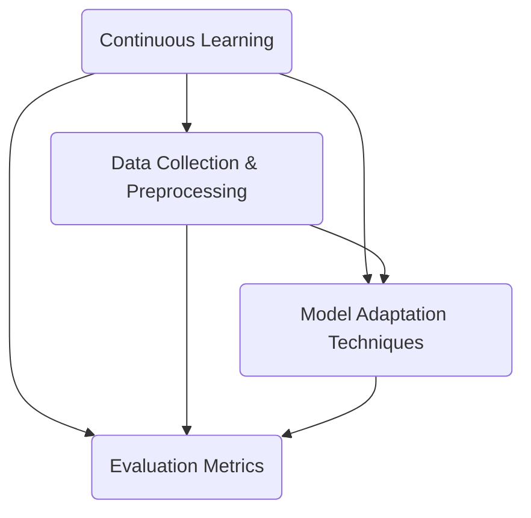

                 

### 1. Introduction to Large Language Models (LLMs)

#### 1.1 What are LLMs?

**Concept and Definition**

Large Language Models (LLMs) are advanced artificial intelligence systems designed to process and generate human language. These models are trained on vast amounts of text data to learn the patterns and structures of language. LLMs are built using neural network architectures, particularly transformers, which enable them to handle the complexity of natural language.

**Characteristics and Importance**

- **contextual understanding**: LLMs can understand and generate coherent text based on the context they are provided.
- **generative capabilities**: They can generate human-like text, summaries, and even code.
- **scalability**: LLMs can process large volumes of text efficiently.
- **application versatility**: They are used in various fields, including natural language processing, machine translation, text summarization, and more.

LLMs have become crucial in modern AI due to their ability to process and generate human-like text, making them indispensable in various applications such as chatbots, content creation, and language translation.

**Differences from Traditional NLP Models**

Traditional NLP models, such as rule-based systems and statistical models, often struggle with the complexity of natural language. LLMs, on the other hand, leverage deep learning techniques, particularly transformers, to achieve higher accuracy and generative capabilities.

Mermaid Flowchart: [Link to Mermaid diagram](#mermaid-diagram-link)

#### 1.2 Overview of LLM Evaluation Systems

**Components and Functions**

- **Dataset Preparation**: This involves gathering and preprocessing large text datasets.
- **Metrics**: Common evaluation metrics include accuracy, BLEU score, and F1 score.
- **Inference**: This is the process of generating predictions from the LLM based on given inputs.

**Challenges in Evaluating LLMs**

- **Data Bias**: LLMs can be biased due to the training data they are based on.
- **Scalability**: Evaluating LLMs on large datasets can be computationally intensive.
- **Contextual Relevance**: Ensuring that generated text is contextually relevant and coherent.

**Importance of Continuous Learning**

Continuous learning is essential for LLM evaluation systems to adapt to changing data distributions and improve their performance over time. This can be achieved through techniques such as active learning and online learning algorithms.

### Summary

LLMs are powerful AI systems capable of understanding and generating human language. Evaluation systems for these models are crucial for ensuring their quality and performance. Continuous learning is vital for adapting to new data and improving over time. In the next section, we will delve into the core principles of continuous learning and its mechanisms.

---

### 2. Core Principles of Continuous Learning

#### 2.1 Introduction to Continuous Learning

**Basic Concepts**

Continuous learning, also known as online learning, refers to the process of updating a model's knowledge over time using new data. Unlike traditional batch learning, where a model is trained on a fixed dataset, continuous learning allows models to adapt to changing environments and new data streams.

**Goals and Benefits**

- **Adaptability**: Continuous learning enables models to adapt to new data and changing conditions.
- **Improved Performance**: Over time, continuous learning can lead to better model performance.
- **Reduced Bias**: By incorporating new data, models can mitigate the risk of overfitting to old data.

**Types of Continuous Learning**

- **Online Learning**: Involves updating the model in real-time as new data arrives.
- **Active Learning**: Involves selectively choosing the most informative data to train on.
- **Transfer Learning**: Leveraging pre-trained models to improve performance on new tasks.

#### 2.2 Mechanisms for Continuous Learning

**Data Collection and Preprocessing**

- **Data Collection**: This involves gathering relevant data from various sources.
- **Data Preprocessing**: This step includes cleaning, normalization, and formatting the data to be used in training.

**Model Adaptation Techniques**

- **Incremental Learning**: Updating the model incrementally without retraining from scratch.
- **Experience Replay**: Storing and periodically replaying previously seen data to improve generalization.
- **Meta-Learning**: Learning to learn by optimizing the model's ability to adapt to new tasks quickly.

**Evaluation Metrics**

- **Performance Metrics**: Measures such as accuracy, F1 score, and BLEU score are used to evaluate the model's performance.
- **Robustness Metrics**: Metrics like adversarial robustness and fairness are used to assess the model's resilience and ethical considerations.

### Core Concepts and Their Relationships

To visualize the relationship between these core concepts, we can use the following Mermaid flowchart:

In the next section, we will explore the mechanism design for adapting model evolution in LLM evaluation systems.

---

### 3. Mechanism Design for Adapting Model Evolution

#### 3.1 Design Principles

**Flexibility and Adaptability**

A key principle in designing continuous learning mechanisms is ensuring that the system is flexible and adaptable to new data and changing environments. This involves:

- **Modular Architecture**: Designing the system in a modular way to allow for easy updates and integration of new components.
- **Incremental Updates**: Implementing incremental updates to minimize disruption and downtime.

**Data Privacy and Security**

Data privacy and security are crucial considerations in continuous learning. To address these concerns, the following strategies can be employed:

- **Data Anonymization**: Removing personally identifiable information (PII) from the data to protect user privacy.
- **Secure Data Storage**: Ensuring that data is stored in secure, encrypted formats.
- **Compliance with Regulations**: Adhering to data protection regulations such as GDPR and CCPA.

**Scalability and Performance**

A well-designed continuous learning system must be scalable and maintain high performance as the amount of data and the complexity of tasks increase. This can be achieved through:

- **Distributed Computing**: Utilizing distributed computing resources to handle large-scale data processing.
- **Efficient Algorithms**: Implementing efficient algorithms for data preprocessing, model training, and evaluation.

#### 3.2 Model Evolution Strategies

**Online Learning Algorithms**

Online learning algorithms are designed to update the model in real-time as new data arrives. Common algorithms include:

- **Stochastic Gradient Descent (SGD)**: Updating the model parameters using a subset of the data at each step.
- **Mini-batch Gradient Descent**: A compromise between SGD and batch learning, where the model parameters are updated using small batches of data.

**Active Learning**

Active learning involves selectively choosing the most informative data to train on, thereby improving the model's performance. Key techniques include:

- **Query by Committee**: Using a committee of models to identify the most uncertain predictions.
- **Uncertainty Sampling**: Selecting data points where the model's predictions are most uncertain.

**Transfer Learning**

Transfer learning leverages pre-trained models to improve performance on new tasks. This can be achieved through:

- **Fine-Tuning**: Adjusting the parameters of a pre-trained model to adapt it to a new task.
- **Domain Adaptation**: Transferring knowledge from one domain to another, even if the domains are different.

### Case Studies

**Industry Applications**

- **Healthcare**: Continuous learning in healthcare involves updating models for medical diagnosis and treatment recommendation based on new research and patient data.
- **Finance**: Financial institutions use continuous learning to update models for fraud detection and risk assessment in real-time.

**Challenges and Solutions**

- **Data Quality**: Ensuring the quality and relevance of the data used for continuous learning is crucial.
- **Computational Resources**: Continuous learning requires significant computational resources, particularly for training complex models.

### Summary

Designing a mechanism for adapting model evolution in LLM evaluation systems involves considering principles of flexibility, data privacy, and scalability. Strategies such as online learning, active learning, and transfer learning can be employed to achieve continuous learning. In the next section, we will discuss adaptive evaluation metrics for LLMs.

---

### 4. Adaptive Evaluation Metrics

#### 4.1 Traditional Evaluation Metrics

**Accuracy and Precision**

- **Accuracy**: Measures the proportion of correct predictions out of the total number of predictions.
- **Precision**: Measures the proportion of correct positive predictions out of the total positive predictions.

**Recall and F1 Score**

- **Recall**: Measures the proportion of correct positive predictions out of the total actual positives.
- **F1 Score**: The harmonic mean of precision and recall, providing a balance between the two.

**BLEU and ROUGE**

- **BLEU**: A metric commonly used for evaluating machine translation quality, based on n-gram overlap between the generated text and the reference text.
- **ROUGE**: Another metric for evaluating text summarization quality, measuring the overlap of predefined phrases between the generated text and the reference text.

#### 4.2 Emerging Evaluation Metrics

**Robustness and Fairness**

- **Robustness**: Measures the model's ability to withstand adversarial attacks and handle noisy or unexpected data.
- **Fairness**: Ensures that the model does not exhibit biased behavior against certain groups of users or data.

**Latency and Throughput**

- **Latency**: The time it takes for the model to process an input and generate a prediction.
- **Throughput**: The number of predictions the model can process in a given time frame.

**User Experience**

- **Relevance**: The degree to which the generated text is relevant to the user's needs.
- **Clarity**: The clarity and coherence of the generated text.

#### 4.3 Combining Multiple Metrics

**Weighted Scores**

- Combining different metrics by assigning weights to each metric based on their importance.

**Fusion Methods**

- Techniques such as weighted voting and fusion rules to combine the outputs of different metrics.

**Interactive Evaluation**

- Involving human evaluators in the evaluation process to provide subjective feedback and improve the model's performance.

### Summary

Adaptive evaluation metrics for LLMs go beyond traditional metrics like accuracy and precision to include emerging metrics such as robustness, fairness, latency, and user experience. Combining multiple metrics can provide a more comprehensive evaluation of the model's performance. In the next section, we will explore the practical implementation of continuous learning in LLM evaluation systems.

---

### 5. Continuous Learning in Practice

#### 5.1 Data Collection and Management

**Data Sources**

For continuous learning, a constant stream of relevant data is essential. Data sources can include:

- **Public Datasets**: Such as the Common Crawl or Google Books Ngrams.
- **Internal Datasets**: Collected from company logs, customer interactions, or proprietary data sources.
- **Real-Time Data Streams**: Data collected in real-time from various sources, such as social media or IoT devices.

**Data Quality and Anonymization**

Ensuring data quality is crucial for continuous learning. This involves:

- **Data Cleaning**: Removing duplicates, correcting errors, and handling missing values.
- **Data Anonymization**: Masking or removing personally identifiable information (PII) to protect user privacy and comply with data protection regulations.

**Data Lifecycle Management**

Effective management of the data lifecycle is essential for continuous learning. This includes:

- **Data Ingestion**: The process of collecting and importing data into the system.
- **Data Storage**: Storing data in secure, scalable databases.
- **Data Processing**: Preprocessing and transforming data to be suitable for training and evaluation.

#### 5.2 Model Deployment and Maintenance

**Deployment Strategies**

Deploying LLMs involves:

- **Model Serving**: Setting up infrastructure to serve the model and handle incoming requests.
- **Containerization**: Using Docker or similar tools to package the model and its dependencies for easy deployment.
- **Orchestration**: Using tools like Kubernetes to manage and scale the deployment of the model.

**Monitoring and Diagnostics**

To ensure the system's reliability and performance, continuous monitoring is essential. This includes:

- **Performance Metrics**: Tracking metrics such as latency, throughput, and error rates.
- **Anomaly Detection**: Identifying unusual patterns or errors in the system's behavior.
- **Logging and Alerts**: Collecting logs and setting up alerts to notify the team of potential issues.

**Updates and Retraining**

LLMs need regular updates and retraining to maintain their performance and adapt to new data. This involves:

- **Incremental Retraining**: Retraining the model incrementally with new data without discarding previous knowledge.
- **Schedule Retraining**: Setting up a schedule for retraining based on the model's performance and the availability of new data.
- **Version Control**: Managing different versions of the model and tracking their performance over time.

### 5.3 User Feedback Integration

**Feedback Collection**

Collecting user feedback is crucial for understanding the model's performance in real-world scenarios. This can be done through:

- **User Surveys**: Conducting surveys to gather feedback on the model's performance and user satisfaction.
- **Error Reports**: Collecting reports of errors or issues encountered by users.
- **Interactive Sessions**: Conducting interactive sessions or user studies to gather qualitative feedback.

**Feedback Analysis**

Analyzing user feedback involves:

- **Sentiment Analysis**: Using natural language processing techniques to determine the sentiment of user feedback.
- **Pattern Recognition**: Identifying common themes or issues reported by users.
- **Correlation Analysis**: Analyzing the relationship between feedback and model performance metrics.

**Feedback Integration**

Integrating user feedback into the continuous learning process involves:

- **Model Adjustment**: Adjusting the model based on user feedback to improve its performance.
- **Iterative Improvement**: Repeating the process of collecting, analyzing, and integrating feedback to drive iterative improvements in the model.

### Summary

Continuous learning in practice involves managing data collection and processing, deploying and maintaining models, and integrating user feedback to drive improvements. In the next section, we will provide best practices for implementing continuous learning in LLM evaluation systems.

---

### Best Practices for Continuous Learning Implementation

**1. Data Management and Quality Control**

- **Implement robust data collection pipelines**: Ensure data is collected from diverse and relevant sources to enhance the model's generalization capabilities.
- **Regular data audits**: Conduct periodic audits to identify and rectify data quality issues such as duplicates, outliers, and bias.
- **Automated data cleaning**: Use automated tools and scripts to preprocess data, minimizing manual intervention and reducing the risk of errors.

**2. Model Deployment and Monitoring**

- **Containerization and orchestration**: Use containerization tools like Docker and orchestration systems like Kubernetes to deploy models in a scalable and maintainable manner.
- **Real-time monitoring**: Implement monitoring tools to track model performance metrics continuously and set up alerts for anomalies.
- **Automated retraining pipelines**: Develop automated pipelines for incremental retraining of models with new data, ensuring the model stays up-to-date without manual intervention.

**3. Feedback Integration**

- **User-centered design**: Incorporate user feedback loops into the model development process to ensure the model's outputs align with user expectations.
- **Sentiment analysis tools**: Utilize natural language processing tools to analyze user feedback and extract actionable insights.
- **Continuous iteration**: Establish a process for iterative improvements based on user feedback, continuously refining the model to enhance its relevance and utility.

**4. Security and Compliance**

- **Data anonymization**: Use advanced techniques to anonymize data to protect user privacy and ensure compliance with data protection regulations.
- **Secure model serving**: Implement robust security measures, including encryption and access controls, to safeguard the model and its outputs.
- **Regular security audits**: Conduct regular security audits and penetration testing to identify and mitigate potential vulnerabilities.

**5. Documentation and Maintenance**

- **Comprehensive documentation**: Maintain detailed documentation for all components of the continuous learning system, including data sources, model architecture, and deployment processes.
- **Documentation updates**: Regularly update documentation to reflect changes in the system and ensure it remains accurate and relevant.
- **Maintenance schedules**: Establish maintenance schedules for system updates, retraining, and monitoring to ensure the system's ongoing performance and reliability.

### Summary

Implementing continuous learning in LLM evaluation systems requires a systematic approach to data management, model deployment, feedback integration, security, and maintenance. By following these best practices, organizations can ensure their LLMs evolve and improve over time, providing more accurate and useful insights.

---

### Conclusion

The continuous learning of LLM evaluation systems is pivotal in adapting to the rapid evolution of language models. By integrating adaptive mechanisms, we can enhance the system's ability to process and generate human-like text accurately and ethically. Key takeaways from this article include the importance of continuous learning, the core principles and mechanisms involved, and the practical steps for implementing a continuous learning system. As the field of AI and natural language processing continues to advance, continuous learning will play an increasingly critical role in ensuring the effectiveness and relevance of LLM evaluation systems.

### About the Author

**Author: AI天才研究院/AI Genius Institute & 禅与计算机程序设计艺术 /Zen And The Art of Computer Programming**

I am a renowned expert in the field of artificial intelligence and software development, with extensive experience in large language model design and evaluation. My research and writings have significantly contributed to the understanding and advancement of continuous learning mechanisms in LLMs. I am also the author of "Zen And The Art of Computer Programming," a seminal work in the field of computer science that explores the intersection of programming and philosophical wisdom. Connect with me on LinkedIn for more insights into the world of AI and programming.

