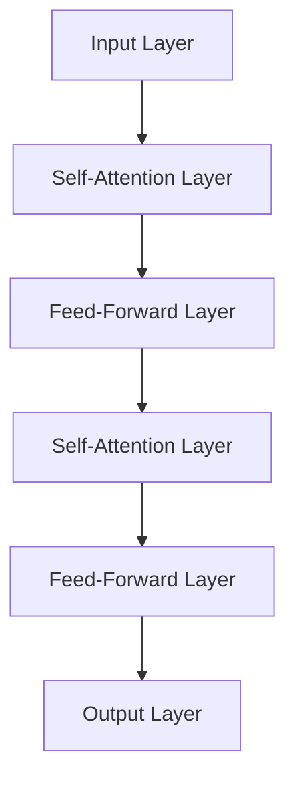

                 

### LLM Evaluation System Architecture Design: Balancing Comprehensiveness and Efficiency

Large Language Models (LLMs) have revolutionized the field of natural language processing (NLP), transforming how we interact with machines and process information. However, evaluating the performance and efficiency of these models is crucial for ensuring their reliability, usability, and security. This article delves into the architecture design of LLM evaluation systems, emphasizing the balance between comprehensiveness and efficiency.

#### Keywords

- Large Language Models (LLMs)
- Evaluation Metrics
- System Architecture
- Comprehensiveness
- Efficiency

#### Abstract

The architecture design of LLM evaluation systems plays a pivotal role in determining the effectiveness of LLMs. This article explores the fundamental concepts of LLMs, evaluates different metrics for assessing their performance, and discusses the principles of designing efficient and comprehensive evaluation systems. By analyzing the system architecture and providing practical insights, this article aims to guide developers and researchers in building robust and reliable LLM evaluation systems.

### Part 1: Fundamental Concepts and Framework

#### Chapter 1: Introduction to Large Language Models (LLMs)

##### 1.1 Definition and History of LLMs

**1.1.1 Overview of LLMs**

Large Language Models (LLMs) are artificial neural networks designed to understand and generate human language. They are trained on vast amounts of text data, allowing them to recognize patterns, semantics, and grammar in text. LLMs have become a cornerstone in NLP, enabling applications such as machine translation, sentiment analysis, question-answering, and text generation.

**1.1.2 Evolution and Impact of LLMs**

The development of LLMs can be traced back to the early 2000s with the advent of deep learning techniques. Initially, simpler models like the Long Short-Term Memory (LSTM) were used for language modeling. However, the introduction of the Transformer model in 2017 marked a significant breakthrough. Transformer-based models, such as BERT, GPT, and T5, have since dominated the field, achieving state-of-the-art performance on various NLP tasks.

**1.2 Core Concepts in LLMs**

**1.2.1 Neural Network Basics**

Neural networks are computational models inspired by the structure and function of the human brain. They consist of interconnected nodes (neurons) that process and transmit information. The core components of a neural network include inputs, weights, biases, and outputs.

- **Inputs**: Represent the features or inputs to the network. In LLMs, inputs are typically sequences of words or tokens.
- **Weights and Biases**: Determine the strength of connections between neurons. They are learned during the training process.
- **Outputs**: Represent the predictions or outputs of the network. In LLMs, outputs are often probabilities or discrete labels.

**1.2.1.1 Structure of Neural Networks**

Neural networks consist of layers, which are groups of interconnected neurons. There are typically three types of layers:

- **Input Layer**: Accepts the input data.
- **Hidden Layers**: Process the input data through a series of transformations.
- **Output Layer**: Generates the final output or prediction.

**1.2.1.2 Common Architectures in Neural Networks**

Several neural network architectures have been widely used in LLMs:

- **Convolutional Neural Networks (CNNs)**: Suitable for image and time series data due to their ability to capture local patterns.
- **Recurrent Neural Networks (RNNs)**: Effective for sequential data due to their ability to maintain state information.
- **Long Short-Term Memory (LSTM) Networks**: A type of RNN that addresses the vanishing gradient problem, enabling long-term dependencies.
- **Transformers**: A revolutionary architecture that uses self-attention mechanisms to process and generate text.

**1.2.2 Attention Mechanism and Transformer Model**

The attention mechanism is a key component of the Transformer model, allowing the network to focus on different parts of the input sequence when generating predictions. It assigns weights to each input token based on its relevance to the current prediction, enabling the model to generate more coherent and contextually appropriate outputs.

**1.2.2.1 Attention Mechanism Principles**

The attention mechanism works by calculating a weight for each input token based on its relevance to the current prediction. The weights are then used to compute a weighted sum of the input tokens, resulting in a context vector that represents the input sequence.

$$
Attention(x) = \sum_{i=1}^{n} w_i \cdot x_i
$$

where \( x_i \) represents the \( i \)-th input token, and \( w_i \) represents the weight assigned to \( x_i \).

**1.2.2.2 Transformer Model Architecture**

The Transformer model consists of multiple layers of self-attention mechanisms and feed-forward neural networks. Each layer captures different aspects of the input sequence, allowing the model to generate accurate and coherent outputs.

The architecture of the Transformer model can be visualized using a Mermaid diagram:

**1.2.3 Training and Inference Process of LLMs**

**1.2.3.1 Training Process**

The training process involves optimizing the model's parameters (weights and biases) using a large corpus of text data. The goal is to minimize the difference between the model's predictions and the ground truth labels.

The training process typically involves the following steps:

1. **Data Preprocessing**: Tokenize the text data and convert it into numerical representations.
2. **Model Initialization**: Initialize the model's parameters randomly.
3. **Forward Propagation**: Pass the input data through the model and calculate the predictions.
4. **Backpropagation**: Compute the gradients of the model's parameters with respect to the loss function.
5. **Parameter Update**: Update the model's parameters using the gradients.

**1.2.3.2 Inference Process**

The inference process involves using the trained model to generate predictions for new input data. The steps involved are similar to the training process but do not involve the computation of gradients or parameter updates.

1. **Input Preprocessing**: Tokenize and convert the input data into numerical representations.
2. **Forward Propagation**: Pass the input data through the trained model.
3. **Prediction Generation**: Generate predictions based on the model's outputs.

#### Chapter 2: Evaluation Metrics and Methods

##### 2.1 Evaluation Metrics for LLMs

Evaluating the performance of LLMs requires a set of metrics that capture their quality and efficiency. The following metrics are commonly used:

**2.1.1 Quality Metrics**

**2.1.1.1 Precision, Recall, and F1 Score**

Precision, recall, and F1 score are metrics used to evaluate the accuracy of LLMs on classification tasks. Precision measures the proportion of positive predictions that are correct, while recall measures the proportion of positive instances that are correctly identified. The F1 score is the harmonic mean of precision and recall.

- Precision: \( \frac{TP}{TP + FP} \)
- Recall: \( \frac{TP}{TP + FN} \)
- F1 Score: \( \frac{2 \cdot Precision \cdot Recall}{Precision + Recall} \)

where \( TP \) represents true positives, \( FP \) represents false positives, and \( FN \) represents false negatives.

**2.1.1.2 Bleu Score and Rouge Score**

Bleu and Rouge scores are metrics used to evaluate the quality of text generated by LLMs, particularly in text generation tasks. Bleu score measures the similarity between the generated text and the reference text using n-gram overlap. Rouge score combines various metrics, including precision, recall, and F1 score, to evaluate the coherence and relevance of the generated text.

**2.1.2 Efficiency Metrics**

**2.1.2.1 Latency and Throughput**

Latency and throughput are metrics used to evaluate the performance of LLMs in terms of speed and scalability. Latency measures the time taken to process a single request, while throughput measures the number of requests processed per unit of time.

- Latency: \( \frac{Time\_to\_Process}{Number\_of\_Requests} \)
- Throughput: \( \frac{Number\_of\_Requests}{Time\_to\_Process} \)

**2.1.2.2 Energy Consumption and Sustainability**

Energy consumption is a critical metric for evaluating the efficiency of LLMs, particularly in the context of large-scale deployments. Energy consumption can be measured in terms of kilowatt-hours (kWh) or gigaflops per watt (GFLOPS/W).

**2.2 Evaluation Methods**

Evaluating the performance of LLMs can be done using both offline and online methods.

**2.2.1 Offline Evaluation**

**2.2.1.1 Test Set Analysis**

Offline evaluation involves analyzing the performance of LLMs on a separate test set that was not used during training. This method provides a reliable estimate of the model's generalization capabilities.

**2.2.1.2 Cross-Validation Techniques**

Cross-validation techniques involve dividing the available data into multiple subsets and training and evaluating the model on different subsets. This method helps to ensure that the evaluation is robust and generalizes to different data distributions.

**2.2.2 Online Evaluation**

**2.2.2.1 A/B Testing**

A/B testing involves comparing the performance of two or more versions of an LLM on a live system. This method provides real-time insights into the performance and user preferences of different versions.

**2.2.2.2 Continuous Monitoring and Feedback**

Continuous monitoring and feedback involve periodically evaluating the performance of an LLM in a live environment and incorporating the feedback into the training process. This method helps to ensure that the LLM remains effective and adaptable over time.

### Part 2: System Architecture Design Principles

#### Chapter 3: System Architecture Design Principles

Designing an effective LLM evaluation system requires careful consideration of various architectural principles. The following principles are critical for achieving a balanced and efficient system:

**3.1 Design Principles for LLM Evaluation Systems**

**3.1.1 Modularity and Scalability**

Modularity and scalability are essential for designing a flexible and scalable LLM evaluation system. By breaking down the system into smaller, independent modules, it becomes easier to maintain, update, and scale the system as needed.

**3.1.2 Flexibility and Adaptability**

A flexible and adaptable system can accommodate different evaluation metrics, methodologies, and data sources. This allows the system to be easily customized to meet specific requirements and changing needs.

**3.1.3 Security and Privacy**

Security and privacy are critical considerations in the design of any evaluation system, particularly when dealing with sensitive data. Implementing robust security measures and ensuring data privacy help to protect the system and its users.

**3.2 Key Components of LLM Evaluation System Architecture**

The architecture of an LLM evaluation system typically includes several key components, such as data ingestion, preprocessing, model training, evaluation, and visualization. Each component plays a crucial role in the overall system performance.

**3.2.1 Data Ingestion**

Data ingestion involves collecting and importing data from various sources, such as text corpora, datasets, and live streams. The system should be capable of handling large volumes of data and integrating different data formats.

**3.2.2 Data Preprocessing**

Data preprocessing involves cleaning and preparing the data for evaluation. This includes tasks such as tokenization, normalization, and feature extraction. Preprocessing helps to ensure the quality and consistency of the data, enabling accurate and reliable evaluations.

**3.2.3 Model Training**

Model training involves training LLMs on the preprocessed data. This process requires significant computational resources and may involve techniques such as transfer learning, fine-tuning, and hyperparameter optimization. The training process should be efficient and scalable to handle large datasets and complex models.

**3.2.4 Evaluation**

Evaluation involves assessing the performance of LLMs using various metrics and methodologies. This process should be automated and capable of running multiple evaluations simultaneously. The results should be easily interpretable and actionable.

**3.2.5 Visualization**

Visualization helps to present the evaluation results in a clear and intuitive manner. This allows stakeholders to understand the performance of the LLMs and identify areas for improvement. Visualization techniques such as charts, graphs, and heatmaps can be used to represent the results effectively.

### Conclusion

The architecture design of LLM evaluation systems is a complex task that requires careful consideration of various factors, including modularity, scalability, flexibility, adaptability, security, and privacy. By following the principles outlined in this article and implementing the key components discussed, developers and researchers can build robust and efficient LLM evaluation systems. These systems can help ensure the reliability, usability, and security of LLMs, enabling their effective deployment in various applications.

### 作者信息

作者：AI天才研究院/AI Genius Institute & 禅与计算机程序设计艺术 /Zen And The Art of Computer Programming

本文探讨了大型语言模型（LLM）评估系统的架构设计，强调了全面性和效率之间的平衡。通过对基本概念、评估指标和系统架构的深入分析，本文为开发者提供了构建可靠且高效的评估系统的指导。

