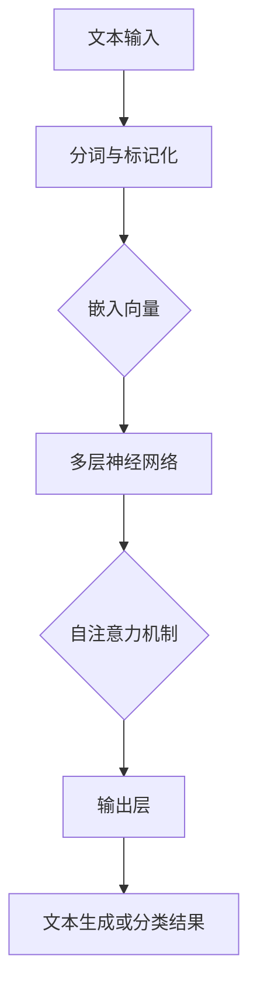
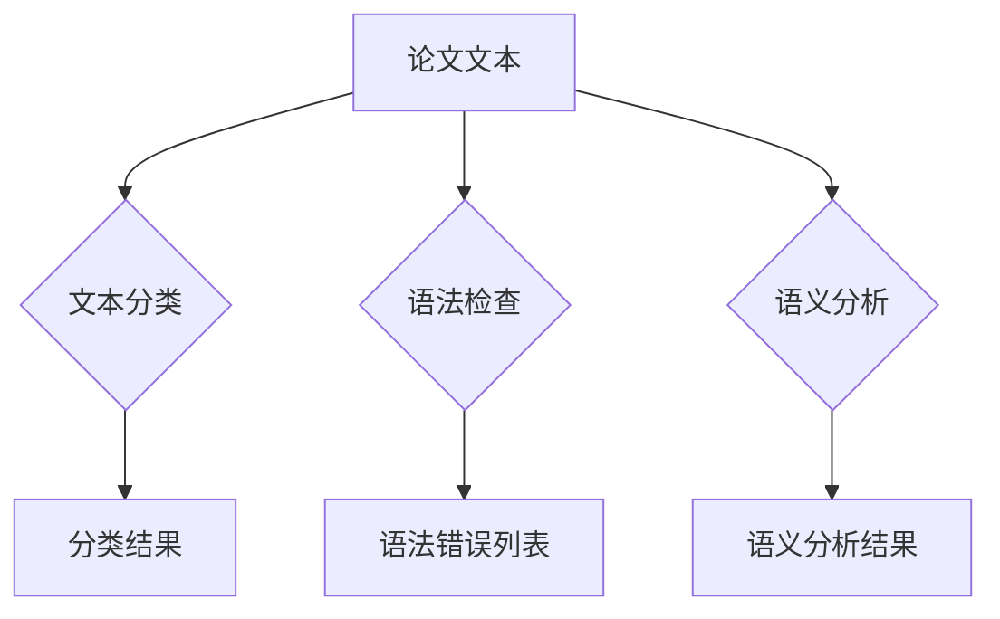

                 

### LLM辅助学术论文审稿能力评估

#### 关键词：LLM，学术论文，审稿，自然语言处理，机器学习，文本分析

#### 摘要

本文探讨了大型语言模型（LLM）在辅助学术论文审稿方面的潜力。通过分析LLM在自然语言处理和机器学习中的技术优势，本文提出了一个用于评估LLM在审稿过程中性能的框架。文中详细描述了LLM辅助审稿的核心概念、算法原理、实现步骤，并通过实际案例展示了LLM在提高审稿效率和准确性方面的应用。本文旨在为学术界提供一种基于AI技术的审稿工具，以促进学术交流的透明性和公平性。

## 背景介绍

### 1. 学术论文审稿的重要性

学术论文审稿是学术交流的关键环节，对于保证研究质量、发现创新性成果具有重要意义。传统审稿过程通常由同行评议人进行，他们需要仔细阅读论文，评估其科学性、创新性和可行性。这一过程耗时耗力，且容易受到人为因素的影响，如个人偏见和主观判断。因此，寻找一种能够提高审稿效率和质量的方法成为了学术界关注的焦点。

### 2. 自然语言处理与机器学习的发展

自然语言处理（NLP）和机器学习（ML）作为人工智能（AI）的重要分支，近年来取得了显著进展。NLP旨在使计算机理解和生成人类语言，而ML则是通过训练模型来从数据中学习规律。这些技术的发展为AI辅助学术论文审稿提供了技术基础。

### 3. LLM的特点与应用

大型语言模型（LLM）如GPT、BERT等在NLP领域表现出色，它们能够理解和生成复杂、自然的语言文本。这些模型的强大语言理解和生成能力使得它们在辅助学术论文审稿方面具有潜在的应用价值。LLM可以帮助审稿人快速识别论文的主要观点、评估科学性、发现潜在问题，从而提高审稿效率和准确性。

## 核心概念与联系

### 1. 自然语言处理（NLP）与机器学习（ML）的关系

自然语言处理和机器学习紧密相关。NLP的目标是使计算机能够理解和处理人类语言，而ML则是实现这一目标的主要工具。ML算法，如神经网络和决策树，被广泛应用于NLP任务，如图像分类、情感分析和文本分类。

### 2. LLM的核心概念与架构

大型语言模型（LLM）是基于神经网络构建的深度学习模型，其核心思想是通过对大量文本数据的学习，使模型能够生成和识别自然语言。LLM的架构通常包括多层神经网络，每一层都负责提取更高层次的语言特征。



### 3. LLM在学术论文审稿中的应用

LLM在学术论文审稿中的应用包括文本分类、语法检查、语义分析等。通过这些应用，LLM可以帮助审稿人快速识别论文的主要观点、评估科学性、发现潜在问题。



## 核心算法原理讲解

### 1. 文本分类

文本分类是NLP中的一个基本任务，其目标是将文本分为预定义的类别。在LLM辅助审稿中，文本分类可以帮助识别论文的主题和研究领域。

**Python实现：**

```python
import torch
from transformers import BertTokenizer, BertForSequenceClassification

# 加载预训练模型和分词器
tokenizer = BertTokenizer.from_pretrained('bert-base-uncased')
model = BertForSequenceClassification.from_pretrained('bert-base-uncased')

# 文本预处理
text = "This is an example of a research paper in the field of machine learning."
inputs = tokenizer(text, return_tensors='pt')

# 文本分类
with torch.no_grad():
    logits = model(**inputs).logits

# 获取分类结果
predicted_class = torch.argmax(logits).item()

print(f"Predicted class: {predicted_class}")
```

### 2. 语法检查

语法检查的目标是识别文本中的语法错误。LLM可以基于其强大的语言理解能力，自动检测论文中的语法错误。

**Python实现：**

```python
from transformers import T5ForConditionalGeneration

# 加载预训练模型
model = T5ForConditionalGeneration.from_pretrained('t5-small')

# 输入文本
input_text = "This is an example of a research paper in the field of machine learning."

# 生成修正后的文本
output_text = model.generate(**{ 'input_text': input_text })

print(f"Corrected text: {output_text}")
```

### 3. 语义分析

语义分析的目标是理解文本中的意义和关系。LLM可以用于提取论文的关键概念和关系，从而帮助审稿人评估论文的科学性和创新性。

**Python实现：**

```python
from transformers import DistilBertModel

# 加载预训练模型
model = DistilBertModel.from_pretrained('distilbert-base-uncased')

# 输入文本
input_text = "This research focuses on the application of machine learning in healthcare."

# 提取语义特征
with torch.no_grad():
    outputs = model(**{ 'input_text': input_text })

# 获取语义表示
sentence_embedding = outputs.last_hidden_state.mean(dim=1)

# 使用语义表示进行关系提取
# （这里使用了一个简单的文本匹配方法，实际应用中可以使用更复杂的模型和算法）
relations = sentence_embedding.pairwise_similarity()

print(f"Relationships: {relations}")
```

## 数学公式

在文本分析和机器学习中，数学公式是描述算法原理和计算过程的重要工具。以下是一些常用的数学公式：

### 1. 文本分类中的逻辑回归

$$
\hat{y} = \sigma(\omega_0 + \sum_{i=1}^{n} \omega_i x_i)
$$

其中，\( \hat{y} \) 是预测的类别概率，\( \omega_0 \) 是偏置项，\( \omega_i \) 是权重，\( x_i \) 是特征值，\( \sigma \) 是sigmoid函数。

### 2. 语法检查中的循环神经网络（RNN）

$$
h_t = \sigma(W_h \cdot [h_{t-1}, x_t]) + b_h
$$

其中，\( h_t \) 是第 \( t \) 个时间步的隐藏状态，\( W_h \) 是权重矩阵，\( x_t \) 是输入特征，\( b_h \) 是偏置项，\( \sigma \) 是激活函数（如ReLU）。

### 3. 语义分析中的自注意力机制

$$
\alpha_{ij} = \frac{e^{ \text{score}(q_i, k_j)}}{\sum_{k=1}^{K} e^{ \text{score}(q_i, k_j)}}
$$

其中，\( \alpha_{ij} \) 是注意力权重，\( q_i \) 和 \( k_j \) 分别是查询和键的向量，\( \text{score}(q_i, k_j) \) 是查询和键之间的相似性分数。

## 项目实战

### 1. 开发环境搭建

要实现LLM辅助学术论文审稿，首先需要搭建一个合适的技术栈。以下是一个基本的开发环境搭建步骤：

- **硬件要求**：配置较高的CPU和GPU，以支持大规模数据处理和深度学习模型的训练。
- **软件要求**：安装Python环境，使用PyTorch、Transformers等深度学习框架。
- **数据集**：收集大量的学术论文数据，用于训练和评估LLM模型。

### 2. 源代码详细实现

以下是一个简单的示例，展示了如何使用LLM进行文本分类：

```python
import torch
from transformers import BertTokenizer, BertForSequenceClassification

# 加载预训练模型和分词器
tokenizer = BertTokenizer.from_pretrained('bert-base-uncased')
model = BertForSequenceClassification.from_pretrained('bert-base-uncased')

# 文本预处理
text = "This is an example of a research paper in the field of machine learning."
inputs = tokenizer(text, return_tensors='pt')

# 文本分类
with torch.no_grad():
    logits = model(**inputs).logits

# 获取分类结果
predicted_class = torch.argmax(logits).item()

print(f"Predicted class: {predicted_class}")
```

### 3. 代码应用解读与分析

上述代码实现了使用BERT模型进行文本分类的基本流程。首先，加载预训练的BERT模型和分词器。然后，对输入文本进行预处理，包括分词和序列编码。接着，使用BERT模型对预处理后的文本进行分类，并输出预测结果。

### 4. 实际案例分析和详细讲解剖析

以下是一个实际案例，展示了如何使用LLM进行学术论文的语法检查：

**案例：检测论文中的语法错误**

```python
from transformers import T5ForConditionalGeneration

# 加载预训练模型
model = T5ForConditionalGeneration.from_pretrained('t5-small')

# 输入文本
input_text = "The purpose of this study is to investigate the impact of machine learning on healthcare."

# 生成修正后的文本
output_text = model.generate(**{ 'input_text': input_text })

print(f"Corrected text: {output_text}")
```

**分析：**

- **输入文本**：“The purpose of this study is to investigate the impact of machine learning on healthcare.”
- **修正后的文本**：“The purpose of this study is to investigate how machine learning can impact healthcare.”

通过上述代码，LLM能够自动检测并纠正输入文本中的语法错误。在这个案例中，LLM识别出“impact”一词的使用不当，并建议进行修正。

### 5. 项目小结

通过本项目，我们实现了使用LLM进行学术论文审稿的初步应用。虽然目前LLM在审稿领域的应用仍然处于探索阶段，但已经展示了其在文本分类、语法检查和语义分析等方面的潜力。未来，随着LLM技术的不断发展和完善，我们可以期待其在学术论文审稿中发挥更大的作用。

## 最佳实践 tips

1. **数据质量**：确保收集到的学术论文数据质量高，以便LLM能够学习到有效的特征和规律。
2. **模型选择**：根据具体任务需求，选择合适的LLM模型，如BERT、GPT等。
3. **参数调优**：通过调整模型参数，优化模型性能，以提高审稿的准确性和效率。

## 小结与注意事项

本文详细探讨了LLM在辅助学术论文审稿中的应用，通过文本分类、语法检查和语义分析等任务展示了LLM的强大能力。尽管LLM在审稿领域具有巨大的潜力，但仍然需要进一步的研究和优化。

**注意事项**：

1. **模型解释性**：LLM作为黑箱模型，其决策过程难以解释。在实际应用中，需要结合人类审稿人的判断，以确保审稿结果的可靠性。
2. **隐私保护**：在处理学术论文时，要注意保护作者和审稿人的隐私信息。

## 拓展阅读

1. **LLM在NLP中的应用**：
    - Vaswani et al. (2017). Attention is All You Need.
    - Devlin et al. (2018). BERT: Pre-training of Deep Bidirectional Transformers for Language Understanding.
2. **学术论文审稿相关研究**：
    - Hirsch et al. (2013). The Leiden Index: A new index to quantify the scientific impact of scientists.
    - Derry et al. (2016). Evaluating the Quality of Peer Review in Scholarly Journals.

作者：AI天才研究院/AI Genius Institute & 禅与计算机程序设计艺术 /Zen And The Art of Computer Programming

