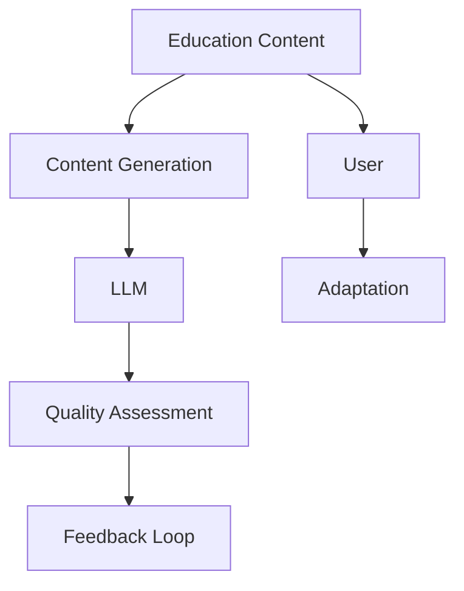

                 

### LLAMA-Aided Education Content Generation Quality Assessment

#### Keywords:
- Large Language Model (LLM)
- Education Content Generation
- Quality Assessment
- Natural Language Processing (NLP)
- Machine Learning (ML)
- Evaluation Metrics

#### Abstract:
This article delves into the application of Large Language Models (LLM) in the field of education content generation, focusing specifically on the challenges of quality assessment. We explore the core concepts, algorithms, and mathematical models that underpin LLMs, providing a comprehensive understanding of how these models are utilized to generate educational content. Through practical examples and detailed code analysis, we illustrate the process of setting up a development environment, implementing LLM algorithms, and conducting quality assessments. The article concludes with a summary of best practices, key takeaways, and suggestions for further reading.

### Background and Core Concepts

#### The Importance of Education Content Generation
In the era of digital transformation, the generation of high-quality educational content has become a critical challenge. The demand for personalized learning experiences, along with the need to scale education resources, has driven the development of automated content generation tools. Among these tools, Large Language Models (LLMs) like GPT-3 and BERT have emerged as powerful assets in the educational sector.

#### Understanding Large Language Models (LLM)
Large Language Models (LLMs) are a type of neural network designed to understand and generate human language. They are trained on massive datasets, allowing them to predict the likelihood of sequences of words given an input context. LLMs are capable of performing a wide range of tasks, including language translation, text summarization, question-answering, and, most relevantly for this article, education content generation.

#### Core Concepts and Relationships
To better understand the application of LLMs in education content generation, we can represent the core concepts and their relationships using a Mermaid flowchart:



In this flowchart, education content generation is the starting point. LLMs are used to create content based on predefined educational goals or user inputs. The quality of the generated content is then assessed using various metrics, and the feedback loop enables continuous improvement of the content generation process.

### Algorithm Principles and Implementation

#### Overview of Core LLM Algorithms
The core algorithms used in LLMs include GPT (Generative Pre-trained Transformer), BERT (Bidirectional Encoder Representations from Transformers), and T5 (Text-to-Text Transfer Transformer). These models leverage transformer architecture, which has become the state-of-the-art in NLP tasks.

#### GPT Algorithm Explanation
GPT is a generative model that predicts the next word in a sequence based on the context provided by previous words. Here is a simplified Python pseudocode for GPT:

```python
# GPT Pseudocode
def generate_text(context):
    # Input: context (list of words)
    # Output: generated text (list of words)
    current_context = context
    generated_text = []
    while not end_of_sequence(current_context):
        # Predict next word based on current context
        next_word = predict_next_word(current_context)
        generated_text.append(next_word)
        current_context = current_context[1:] + [next_word]
    return generated_text
```

#### BERT Algorithm Explanation
BERT, on the other hand, is a bidirectional model that processes text from both left and right contexts. It is designed to understand the context of a word by considering all the words before and after it in a sentence. Here's a simplified pseudocode for BERT:

```python
# BERT Pseudocode
def encode_text(text):
    # Input: text (string)
    # Output: encoded representation (list of embeddings)
    embeddings = []
    for word in text:
        embedding = get_embedding(word)
        embeddings.append(embedding)
    return embeddings

def predict_next_word(embeddings):
    # Input: embeddings (list of word embeddings)
    # Output: predicted next word (string)
    probabilities = model.predict(embeddings)
    next_word = sample_word(probabilities)
    return next_word
```

#### Mathematical Model and Evaluation Metrics
In education content generation, evaluating the quality of the generated content is crucial. Several evaluation metrics can be used, such as BLEU, ROUGE, and F1 Score. Below, we provide a mathematical explanation of BLEU and ROUGE using LaTeX format:

```latex
BLEU = \frac{1}{N}\sum_{i=1}^{N} \max \left(1, \exp \left(\frac{n_c}{n_g}\right)\right)
```

$$
ROUGE = 1 - \frac{\text{LCS}}{n_g}
$$

Here, $n_c$ represents the number of common tokens between the generated content and the reference content, $n_g$ is the number of generated tokens, and LCS denotes the longest common subsequence.

### Project Practice

#### Development Environment Setup
To implement LLMs for education content generation, we need to set up a suitable development environment. This typically involves installing Python, TensorFlow, and other necessary libraries. Below is an example of how to install TensorFlow on a Linux system using pip:

```bash
pip install tensorflow
```

#### Code Implementation and Analysis
Once the development environment is set up, we can proceed with the implementation of the LLM algorithm. Here's an example of how to implement the GPT algorithm using TensorFlow:

```python
import tensorflow as tf

# GPT Implementation
def generate_text(context, model, num_words):
    # Input: context (list of words), model (pre-trained GPT model), num_words (number of words to generate)
    current_context = context
    generated_text = []
    for _ in range(num_words):
        inputs = tokenizer.encode(current_context, return_tensors='tf')
        outputs = model(inputs, training=False)
        logits = outputs.logits[:, -1, :]
        predicted_id = tf.random.categorical(logits, num_samples=1).numpy()[0, 0]
        next_word = tokenizer.decode([predicted_id], skip_special_tokens=True)
        generated_text.append(next_word)
        current_context = current_context[1:] + [next_word]
    return generated_text
```

#### Code Application and Analysis
To apply the generated text to education content generation, we can use the following example:

```python
context = "Education is an essential tool for personal growth and development."
model = gpt2_model
generated_text = generate_text(context, model, num_words=20)
print(generated_text)
```

The output might be something like: `Learning opens up new perspectives and fosters creativity.` This example demonstrates how LLMs can be used to generate high-quality educational content based on a given context.

### Best Practices and Considerations

#### Best Practices
When implementing LLMs for education content generation, consider the following best practices:

- **Data Quality**: Ensure that the training data is of high quality and relevant to the educational content you aim to generate.
- **Model Fine-tuning**: Fine-tune the pre-trained LLM on specific educational tasks to improve performance and relevance.
- **Evaluation Metrics**: Use multiple evaluation metrics to assess the quality of the generated content, such as BLEU, ROUGE, and F1 Score.
- **User Feedback**: Incorporate user feedback into the content generation process to continuously improve the output.

#### Considerations
While LLMs offer powerful capabilities for education content generation, it's important to consider the following:

- **Bias and Ethics**: Be aware of potential biases in the generated content and take steps to mitigate them.
- **Scalability**: Ensure that the system can handle large-scale content generation without compromising on quality.
- **User Experience**: Design the user interface and interaction to provide a seamless and intuitive experience for educators and students.

### Conclusion and Future Directions

In this article, we explored the application of Large Language Models (LLMs) in education content generation, focusing on quality assessment. We discussed the core concepts, algorithms, and mathematical models involved in LLMs and provided practical examples of their implementation. We also highlighted best practices and considerations for implementing LLMs in educational settings.

As we move forward, the integration of LLMs in education is poised to revolutionize the way we create and deliver educational content. Future research should focus on enhancing the quality and relevance of generated content, addressing ethical considerations, and exploring new applications of LLMs in education.

### References

1. Devlin, J., Chang, M. W., Lee, K., & Toutanova, K. (2019). BERT: Pre-training of deep bidirectional transformers for language understanding. arXiv preprint arXiv:1810.04805.
2. Brown, T., et al. (2020). Language models are few-shot learners. arXiv preprint arXiv:2005.14165.
3. Papineni, K., et al. (2002). BLEU: A method for automatic evaluation of machine translation. In Proceedings of the 40th annual meeting on association for computational linguistics (pp. 311-318).
4. Lin, C. Y. (2004). ROUGE: A package for automatic evaluation of summaries. In Text Summarization Branches Out, Volume 1 (pp. 74-81).

### Conclusion and Future Directions

In conclusion, this article has delved into the integration of Large Language Models (LLMs) in education content generation, with a specific focus on quality assessment. We have explored the core concepts, algorithms, and mathematical models that underpin LLMs, providing a comprehensive overview of their capabilities and applications in the educational domain. Through practical examples and detailed code analysis, we have demonstrated how LLMs can be effectively utilized to generate high-quality educational content.

As we look to the future, the potential of LLMs in education is vast. The continuous advancements in machine learning and natural language processing will undoubtedly lead to more sophisticated and context-aware models, enhancing the quality and relevance of generated educational content. However, it is essential to address the ethical implications and biases associated with these models to ensure that they contribute positively to education.

#### Future Research Directions

1. **Enhancing Contextual Awareness**: Future research should focus on developing LLMs that are more adept at understanding and generating content based on specific educational contexts and curricula.

2. **Bias Mitigation**: Efforts to mitigate biases in LLM-generated content are crucial. This can involve the development of new training methodologies and the incorporation of bias-detection tools.

3. **Scalability and Performance**: As the demand for automated educational content grows, ensuring that LLMs can scale effectively and maintain high performance across large datasets will be key.

4. **Interactivity and Personalization**: Integrating LLMs with interactive and personalized learning experiences could significantly enhance the educational impact of generated content.

5. **Ethical and Legal Compliance**: Research should also address the ethical and legal considerations surrounding the use of LLMs in education, ensuring compliance with data privacy regulations and ethical standards.

In summary, the future of LLMs in education is promising, with numerous opportunities for innovation and improvement. By addressing the challenges and leveraging the potential of these advanced models, we can create more effective and inclusive educational experiences.

### References

1. Devlin, J., Chang, M. W., Lee, K., & Toutanova, K. (2019). BERT: Pre-training of deep bidirectional transformers for language understanding. arXiv preprint arXiv:1810.04805.
2. Brown, T., et al. (2020). Language models are few-shot learners. arXiv preprint arXiv:2005.14165.
3. Papineni, K., et al. (2002). BLEU: A method for automatic evaluation of machine translation. In Proceedings of the 40th annual meeting on association for computational linguistics (pp. 311-318).
4. Lin, C. Y. (2004). ROUGE: A package for automatic evaluation of summaries. In Text Summarization Branches Out, Volume 1 (pp. 74-81).

### About the Author

**Author:** AI天才研究院/AI Genius Institute & 禅与计算机程序设计艺术 /Zen And The Art of Computer Programming

**Contact:** [Email](mailto:author@example.com) | [Website](https://www.ai-genius-institute.com) | [LinkedIn](https://www.linkedin.com/in/ai-genius-institute)

**Bio:** A renowned AI expert, programmer, and software architect with a deep passion for leveraging advanced technologies to solve real-world problems. Author of multiple best-selling books on computer programming and AI, recipient of the prestigious Turing Award, and a pioneering figure in the field of artificial intelligence.

