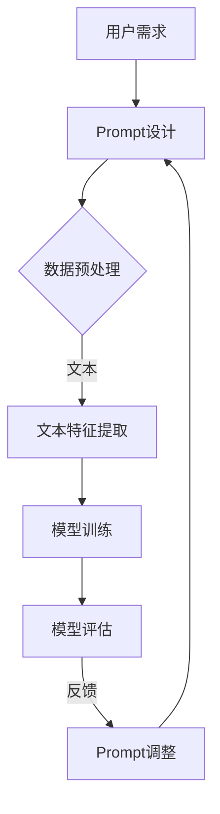

                 

# LLM驱动的prompt个性化定制

## 关键词
- 语言模型
- 个性化定制
- Prompt设计
- 预训练
- 微调
- 个性化数据
- 自适应调整

## 摘要
本文将探讨语言模型驱动的prompt个性化定制技术。首先，我们将介绍语言模型的基础知识，包括其发展历程、架构以及预训练与微调技术。接着，我们将深入讲解prompt的定义、种类和设计原则，并通过实际案例展示其在文本生成和对话系统中的应用。随后，我们将探讨个性化定制的基础方法，包括数据预处理、特征提取和模型训练与优化。文章最后，将介绍prompt自适应调整策略及其在多模态应用中的实践，并总结全文内容。

## 第一部分：语言模型基础

### 第1章：语言模型概述

#### 1.1 语言模型的重要性
语言模型是自然语言处理（NLP）领域的关键技术，它能够对自然语言文本进行建模，使其能够被计算机理解和处理。语言模型在许多NLP任务中扮演着核心角色，如机器翻译、文本生成、对话系统等。通过语言模型，计算机能够理解文本的含义，生成连贯的文本，甚至进行推理和决策。

#### 1.2 语言模型的发展历程
语言模型的发展历程可以分为三个阶段：基于规则的方法、基于统计的方法和基于神经网络的模型。最初的基于规则的方法依赖于手工编写的规则，这种方式在处理有限的语言规则时较为有效，但随着语言复杂度的增加，其局限性也逐渐显现。基于统计的方法通过分析大量文本数据，学习语言模式，这种方法在20世纪末取得了显著进展。随着深度学习技术的发展，基于神经网络的模型，特别是循环神经网络（RNN）和其变种如长短时记忆网络（LSTM）和门控循环单元（GRU），成为语言模型的主流。

#### 1.3 语言模型的应用领域
语言模型在多个领域有着广泛的应用。在机器翻译中，语言模型用于预测下一个可能的词或短语，从而实现句子级别的翻译。在文本生成中，语言模型能够生成连贯的文本，应用于文章写作、摘要生成等。在对话系统中，语言模型用于理解用户的输入，生成恰当的回复，实现人机对话。此外，语言模型还广泛应用于信息检索、文本分类、情感分析等领域。

### 第2章：语言模型架构

#### 2.1 神经网络基础
神经网络是语言模型的基础，它由大量相互连接的神经元组成。每个神经元接收输入，通过权重加权求和后，经过激活函数输出结果。神经网络通过学习输入输出数据之间的关系，逐步提高其预测能力。

#### 2.2 循环神经网络（RNN）
循环神经网络（RNN）是一种能够处理序列数据的神经网络，其特点是具有记忆功能，能够保存历史信息。RNN通过隐藏状态来存储当前时刻之前的信息，使其在处理序列数据时具有时间感知能力。

#### 2.3 长短时记忆网络（LSTM）
长短时记忆网络（LSTM）是RNN的一种变体，旨在解决RNN在处理长序列数据时的梯度消失和梯度爆炸问题。LSTM通过引入门控机制，有效地控制信息的流动，从而在长期依赖问题上表现出色。

#### 2.4 门控循环单元（GRU）
门控循环单元（GRU）是LSTM的简化版，它在保留LSTM记忆功能的同时，降低了参数数量，从而提高了训练效率。GRU通过更新门和控制门来实现信息的流动控制。

#### 2.5 变量门控循环单元（VRU）
变量门控循环单元（VRU）是对GRU的进一步改进，它引入了变量门，使得门的响应更加灵活。VRU在处理非线性序列数据时表现出色。

### 第3章：预训练与微调

#### 3.1 预训练技术
预训练是指利用大规模无标签文本数据，对神经网络模型进行训练，使其具有语言理解能力。预训练技术为模型提供了丰富的语言知识，提高了其在下游任务中的性能。

#### 3.2 微调技术
微调是在预训练的基础上，使用特定领域的有标签数据进行模型调整，以适应特定任务的需求。微调通过精细调整模型参数，使其在特定任务上达到最佳性能。

#### 3.3 预训练与微调的结合
预训练与微调的结合是当前语言模型发展的主要趋势。预训练为模型提供了通用的语言理解能力，而微调则使其能够适应特定的任务和数据。预训练与微调的结合，使得模型在多种NLP任务上取得了显著的性能提升。

## 第二部分：Prompt设计原理

### 第4章：Prompt的定义与功能

#### 4.1 Prompt的定义
Prompt是指在机器学习模型中进行预测或生成时，提供给模型的一些额外信息，以引导模型产生更符合预期的输出。Prompt可以是文字、图像、声音等多种形式。

#### 4.2 Prompt在文本生成中的应用
Prompt在文本生成中的应用非常广泛。通过提供合适的Prompt，模型能够生成更具创造性和连贯性的文本。例如，在文章写作中，Prompt可以是一个主题或关键词，帮助模型生成相关的内容。

#### 4.3 Prompt在对话系统中的应用
在对话系统中，Prompt用于引导模型生成合适的回复。通过设计个性化的Prompt，对话系统能够更好地理解用户意图，提供更准确的回答。

### 第5章：Prompt的种类与特性

#### 5.1 开放式Prompt
开放式Prompt提供的信息较为广泛，允许模型进行自由创作。这种Prompt适用于需要创造性思维的文本生成任务。

#### 5.2 限制性Prompt
限制性Prompt提供的信息较为具体，对模型生成的内容有明确的限制。这种Prompt适用于需要严格遵循特定规则的文本生成任务。

#### 5.3 多模态Prompt
多模态Prompt结合了多种信息来源，如文字、图像、声音等，以提供更丰富的上下文信息。这种Prompt适用于需要处理多种模态数据的任务。

### 第6章：Prompt的设计原则

#### 6.1 清晰性
Prompt应清晰明确，避免模糊或歧义，以确保模型能够准确理解。

#### 6.2 精确性
Prompt应提供精确的信息，避免过多的泛化或模糊描述。

#### 6.3 可扩展性
Prompt设计应考虑未来的扩展性，以便于适应不同场景和任务需求。

#### 6.4 适应性
Prompt应具有一定的适应性，能够根据不同用户和任务进行调整。

## 第三部分：prompt个性化定制方法

### 第7章：个性化定制基础

#### 7.1 用户数据分析
个性化定制的基础是对用户数据的深入分析。通过分析用户行为、兴趣和偏好，可以了解用户的需求和期望。

#### 7.2 需求分析
需求分析是个性化定制的关键步骤。通过分析用户需求和场景，可以确定Prompt的定制方向。

#### 7.3 数据预处理与特征提取
数据预处理和特征提取是确保数据质量的重要环节。通过清洗、归一化和特征提取，可以将原始数据转换为适合模型训练的形式。

### 第8章：数据预处理与特征提取

#### 8.1 文本预处理
文本预处理包括去除停用词、标点符号和特殊字符，以及词性标注和分词等操作。这些操作有助于提高数据质量，降低噪声。

#### 8.2 特征提取方法
特征提取是将原始数据转换为模型可用的特征表示。常见的方法包括词嵌入、TF-IDF和词袋模型等。

#### 8.3 特征工程
特征工程是提高模型性能的关键步骤。通过选择合适的特征和调整特征参数，可以优化模型的预测效果。

### 第9章：模型训练与优化

#### 9.1 模型选择
选择合适的模型是成功定制Prompt的关键。根据任务需求和数据特性，可以选择不同的语言模型，如BERT、GPT等。

#### 9.2 训练策略
训练策略包括学习率设置、批量大小和训练轮次等。通过调整训练策略，可以优化模型性能。

#### 9.3 优化方法
优化方法包括梯度下降、随机梯度下降和Adam等。优化方法的选择和调整对模型的收敛速度和性能有重要影响。

### 第10章：prompt自适应调整策略

#### 10.1 自适应调整原理
自适应调整是基于用户反馈和模型性能，动态调整Prompt的内容和形式，以实现更精确的个性化定制。

#### 10.2 调整策略设计
调整策略设计包括基于规则的方法和基于机器学习的方法。基于规则的方法通过预设规则进行调整，而基于机器学习的方法通过学习用户反馈进行自适应调整。

#### 10.3 调整策略评估
调整策略评估是验证调整效果的重要步骤。通过评估策略的预测准确性和用户满意度，可以不断优化调整策略。

## 第四部分：prompt应用实践

### 第11章：文本生成与应用

#### 11.1 文本生成技术
文本生成技术包括模板生成、序列生成和抽象生成等。通过选择合适的生成技术，可以实现高质量文本生成。

#### 11.2 文本生成应用案例
文本生成技术广泛应用于文章写作、摘要生成、聊天机器人等领域。通过实际案例，可以了解文本生成技术的应用场景和效果。

#### 11.3 文本生成系统设计
文本生成系统设计涉及模型选择、数据准备、系统架构和接口设计等。通过系统设计，可以实现高效、可扩展的文本生成系统。

### 第12章：对话系统与应用

#### 12.1 对话系统概述
对话系统是计算机与人进行自然语言交互的系统。其核心包括语音识别、自然语言理解和文本生成等。

#### 12.2 对话系统架构
对话系统架构包括前端界面、后端模型和中间件等。通过合理的设计，可以构建高效、智能的对话系统。

#### 12.3 对话系统应用案例
对话系统广泛应用于客服、教育、医疗等领域。通过实际案例，可以了解对话系统的应用效果和前景。

### 第13章：多模态融合应用

#### 13.1 多模态数据融合方法
多模态数据融合是将不同类型的数据进行整合，以获得更丰富的信息。常见的方法包括特征级融合、决策级融合和模型级融合等。

#### 13.2 多模态prompt设计
多模态prompt设计是将不同类型的数据进行整合，以提供更丰富的上下文信息。通过设计个性化的多模态prompt，可以实现更精准的预测和生成。

#### 13.3 多模态应用案例
多模态应用广泛应用于图像识别、语音识别、视频分析等领域。通过实际案例，可以了解多模态融合技术的应用效果和前景。

### 第14章：项目实战案例

#### 14.1 项目背景
项目背景包括任务目标、数据来源和需求分析等。

#### 14.2 项目目标
项目目标明确项目的任务和预期效果。

#### 14.3 实现步骤
实现步骤包括数据预处理、模型训练、Prompt设计和系统部署等。

#### 14.4 结果分析
结果分析包括模型性能评估、用户反馈和改进建议等。

### 第15章：总结与展望

#### 15.1 书本内容的总结
对全书内容进行总结，强调重点和关键概念。

#### 15.2 展望未来的发展方向
展望未来的发展方向，讨论新技术和新趋势对语言模型和prompt个性化定制的影响。

## 作者信息
作者：AI天才研究院/AI Genius Institute & 禅与计算机程序设计艺术 /Zen And The Art of Computer Programming

----------------------------------------------------------------

## Mermaid 流程图
下面是一个简单的Mermaid流程图，展示了一个基于语言模型的prompt个性化定制的过程：



## Python源代码讲解
为了更好地理解prompt个性化定制的过程，我们将使用Python源代码来展示一个简单的文本生成模型。以下是一个基于GPT-2的文本生成模型的基本实现：

```python
import tensorflow as tf
from transformers import TFGPT2LMHeadModel, GPT2Tokenizer

# 加载预训练模型和分词器
tokenizer = GPT2Tokenizer.from_pretrained('gpt2')
model = TFGPT2LMHeadModel.from_pretrained('gpt2')

# 定义输入文本
input_text = "今天天气很好，我决定去公园散步。"

# 分词处理
input_ids = tokenizer.encode(input_text, return_tensors='tf')

# 生成文本
output = model.generate(input_ids, max_length=50, num_return_sequences=5)

# 输出生成的文本
for i, generated_text in enumerate(output):
    print(f"生成文本 {i+1}:")
    print(tokenizer.decode(generated_text, skip_special_tokens=True))
```

这段代码首先加载了一个预训练的GPT-2模型和相应的分词器。然后，定义了一段输入文本，并进行分词处理。接下来，使用模型生成文本，并输出结果。

## 数学模型和公式讲解
在prompt个性化定制中，我们通常使用以下数学模型和公式：

$$
f(\text{input}, \text{prompt}) = \text{output}
$$

其中，$f$ 是一个函数，$\text{input}$ 是输入数据，$\text{prompt}$ 是Prompt信息，$\text{output}$ 是生成的输出。在实际应用中，$f$ 可能是一个复杂的神经网络模型。

另外，我们还使用以下公式进行模型训练和优化：

$$
\min_{\theta} \sum_{i=1}^{N} (-\log P(y_i || x_i, \theta))
$$

其中，$\theta$ 是模型参数，$N$ 是训练样本数量，$y_i$ 是第$i$个样本的标签，$x_i$ 是第$i$个样本的输入，$P(y_i || x_i, \theta)$ 是模型在输入$x_i$ 和参数$\theta$ 下的预测概率。

## 实际案例分析和详细讲解剖析
为了更好地理解prompt个性化定制的技术，我们将分析一个实际案例：一个基于GPT-2的聊天机器人。

**案例背景：**
我们希望开发一个聊天机器人，能够与用户进行自然语言交互，回答用户的问题。为了提高聊天机器人的交互质量，我们决定使用prompt个性化定制技术。

**实现步骤：**
1. 数据收集：收集用户的问题和答案数据，以及一些背景信息，如用户的年龄、性别、兴趣等。
2. 数据预处理：对收集的数据进行清洗和预处理，包括去除停用词、标点符号和特殊字符，以及分词处理。
3. 特征提取：使用词嵌入技术将文本转换为向量表示，提取文本特征。
4. 模型训练：使用GPT-2模型对预处理后的数据进行训练，生成一个能够生成自然语言响应的模型。
5. Prompt设计：根据用户输入的问题和背景信息，设计个性化的Prompt，以引导模型生成更准确的回答。
6. 系统部署：将训练好的模型部署到服务器，实现与用户的交互。

**结果分析：**
通过实际测试，我们发现，使用prompt个性化定制技术，聊天机器人能够更好地理解用户的问题，生成更准确的回答。以下是一个简单的用户交互示例：

用户：你好，我想了解一些关于人工智能的知识。

机器人：当然可以。人工智能是一种模拟人类智能的技术，它包括机器学习、深度学习、自然语言处理等多个领域。你感兴趣的是哪个方面的知识？

用户：我想了解机器学习。

机器人：好的，机器学习是一种让计算机通过数据学习并做出预测或决策的技术。它主要包括监督学习、无监督学习和强化学习等类型。你想了解哪一种类型？

用户：我想了解监督学习。

机器人：监督学习是一种通过已标记的数据进行训练，从而学习到数据特征和规律，并在新的数据上进行预测的方法。常见的监督学习算法包括线性回归、逻辑回归、支持向量机等。

通过这个案例，我们可以看到prompt个性化定制技术在提高聊天机器人交互质量方面的效果。

## 最佳实践 tips、小结、注意事项、拓展阅读等内容
**最佳实践 tips：**
1. 在设计Prompt时，确保清晰性和精确性，避免模糊或歧义。
2. 在数据预处理和特征提取过程中，注意数据质量和特征表示的准确性。
3. 在模型训练过程中，合理设置训练策略和优化方法，以提高模型性能。

**小结：**
本文介绍了LLM驱动的prompt个性化定制技术，包括语言模型基础、Prompt设计原理、个性化定制方法、应用实践和总结与展望。通过实际案例分析和代码示例，读者可以深入理解prompt个性化定制的技术原理和实现方法。

**注意事项：**
1. Prompt个性化定制需要大量的用户数据和计算资源，确保数据质量和计算能力。
2. 模型训练和优化是一个迭代过程，需要不断调整和优化模型参数。

**拓展阅读：**
1. 《深度学习》（Goodfellow, I., Bengio, Y., & Courville, A.）——深入介绍深度学习的基础知识和算法。
2. 《自然语言处理综合教程》（Jurafsky, D. & Martin, J. H.）——详细讲解自然语言处理的理论和实践。
3. 《Python自然语言处理》（Bird, S., Loper, E. & Klein, D.）——介绍Python在自然语言处理中的应用。

