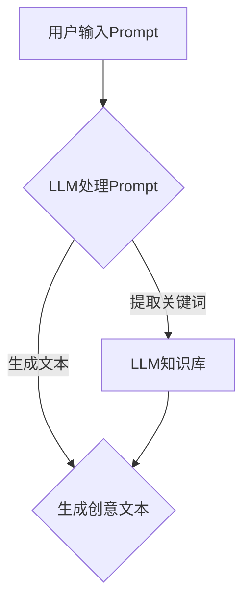

                 

### 引言

随着人工智能技术的飞速发展，自然语言处理（NLP）领域取得了令人瞩目的成果。其中，大型语言模型（LLM, Large Language Model）成为研究的热点之一。LLM通过大规模的文本数据进行预训练，从而具备了强大的文本理解和生成能力。在众多应用场景中，LLM驱动的prompt创意激发器（prompt-creative generator）逐渐引起了人们的关注。本文旨在探讨LLM驱动的prompt创意激发器的背景、核心概念及其应用，并深入分析其原理和实现方法。

LLM驱动的prompt创意激发器是一种利用大型语言模型生成创意性文本的工具。它通过接收用户提供的prompt（提示），结合自身的语言理解能力和创造性思维，生成富有创意的文本内容。这种工具在文本创作、艺术设计、产品策划等多个领域展现了巨大的潜力。

本文的结构安排如下：

- **第一部分：LLM与prompt创意激发基础**：首先介绍LLM的基本概念、核心技术以及其应用场景，然后深入探讨prompt创意激发的原理及其影响因素。
- **第二部分：LLM驱动的prompt创意激发器应用**：详细介绍创意激发器的设计与实现、优化策略以及在多领域的应用，并通过案例研究展示其实际效果。
- **第三部分：未来展望**：分析LLM驱动的prompt创意激发技术的发展趋势，探讨其在不同领域的应用前景，以及面临的挑战与机遇。

通过本文的阅读，读者将全面了解LLM驱动的prompt创意激发器的工作原理和应用场景，并能够掌握相关技术实现方法。希望本文能够为从事自然语言处理、人工智能等相关领域的研究者和技术人员提供有价值的参考和启示。

### 背景介绍

#### 大型语言模型（LLM）的兴起

大型语言模型（LLM，Large Language Model）是近年来自然语言处理（NLP，Natural Language Processing）领域的重要突破。与传统的小型语言模型相比，LLM具有更强的语言理解和生成能力，能够处理更复杂的语言现象和任务。LLM的发展源于深度学习和自然语言处理技术的进步，特别是在预训练（Pre-training）和微调（Fine-tuning）技术的引入。

预训练是指使用大规模的文本数据对模型进行初步训练，使模型具备一定的语言理解能力。这种预训练过程通常包括两个阶段：第一个阶段是大规模无监督预训练，如使用未标记的文本数据；第二个阶段是任务特定的微调，使用标记数据对模型进行调整，以适应特定任务的需求。预训练技术的引入，使得模型能够从海量数据中学习到丰富的语言知识，从而在自然语言处理任务中表现出色。

微调是在预训练的基础上，针对特定任务对模型进行进一步的训练。通过微调，模型可以更好地适应特定场景，提高其在具体任务上的性能。微调通常使用标记数据集，这些数据集包含大量的标注信息，如文本分类、文本生成等。微调过程能够优化模型在特定任务上的参数，使其在目标任务上表现更加出色。

#### LLM在自然语言处理中的应用

LLM在自然语言处理领域有着广泛的应用，包括文本分类、机器翻译、问答系统、文本生成等。以下是一些LLM在自然语言处理中的典型应用场景：

1. **文本分类**：文本分类是一种将文本数据划分为多个类别的过程。LLM通过学习大量标注数据，能够对新的文本进行分类。例如，新闻文章可以根据主题进行分类，社交媒体评论可以根据情感进行分类。LLM在文本分类任务中表现出色，能够处理复杂的语言现象，提高分类的准确率。

2. **机器翻译**：机器翻译是一种将一种语言的文本翻译成另一种语言的过程。LLM在机器翻译中的应用主要体现在预训练和微调两个阶段。在预训练阶段，LLM学习到丰富的语言知识，从而在翻译过程中能够更好地理解源语言和目标语言之间的差异。在微调阶段，LLM使用大量的双语数据对模型进行调整，提高翻译的准确性和流畅性。

3. **问答系统**：问答系统是一种能够自动回答用户问题的系统。LLM在问答系统中的应用主要体现在文本理解和生成。通过预训练，LLM能够理解用户的问题，并从大量的文本数据中检索出相关答案。在微调阶段，LLM使用问答对进行进一步的训练，提高回答的准确性和相关性。

4. **文本生成**：文本生成是一种生成具有特定风格和主题的文本的过程。LLM在文本生成任务中表现出色，能够生成流畅、自然的文本。例如，LLM可以生成新闻报道、故事、诗歌等。通过预训练和微调，LLM能够从大量的文本数据中学习到不同的文本风格和主题，从而生成多样化的文本。

#### LLM驱动创意激发的潜力

LLM不仅在自然语言处理任务中表现出色，其在创意激发（Creative Generation）领域也展现了巨大的潜力。创意激发是一种通过算法和模型生成新颖、独特和有创意的文本内容的过程。LLM驱动的prompt创意激发器通过接收用户提供的prompt，利用其强大的语言理解能力和创造性思维，生成富有创意的文本内容。

创意激发在多个领域具有广泛的应用，如文本创作、艺术设计、产品策划等。在文本创作中，LLM驱动的prompt创意激发器可以帮助作者生成新的故事、文章、广告等；在艺术设计中，LLM可以生成独特的艺术作品，如绘画、雕塑等；在产品策划中，LLM可以提供创意性的产品命名、宣传语等。

综上所述，LLM的兴起和其在自然语言处理中的应用为创意激发带来了新的机遇。LLM驱动的prompt创意激发器作为一种创新的工具，能够帮助人们在各种场景中实现创意的自动化生成，提高工作效率和创意质量。

### 核心概念与联系

#### 核心概念

在本节中，我们将深入探讨LLM驱动的prompt创意激发器的核心概念，包括LLM、prompt、创意激发以及它们之间的相互关系。这些核心概念构成了理解该工具的基础，有助于读者更好地掌握其工作原理和应用场景。

1. **LLM（大型语言模型）**：LLM是一种能够理解和生成自然语言的大型深度学习模型。它通过在大规模文本数据上进行预训练，学习到丰富的语言模式和结构，从而具备了强大的文本处理能力。LLM的核心特点是能够理解上下文，生成连贯、自然、具有逻辑性的文本。

2. **Prompt（提示）**：Prompt是用户提供给LLM的文本输入，用于引导LLM生成特定的文本内容。Prompt的设计直接影响生成文本的创意性和相关性。一个有效的Prompt通常包含关键词、主题、风格和上下文信息，以引导LLM生成符合用户需求的创意内容。

3. **创意激发（Creative Generation）**：创意激发是指利用算法和模型生成新颖、独特和有创意的文本内容的过程。在LLM驱动的prompt创意激发器中，创意激发是指通过LLM的预训练和微调能力，根据Prompt生成富有创意的文本。创意激发不仅包括文本内容的生成，还涉及到文本风格、主题和情感的表达。

4. **Prompt-LLM交互**：Prompt-LLM交互是指LLM在接收到Prompt后，如何理解并生成相关文本的过程。LLM通过处理Prompt中的信息，提取关键词和上下文，并利用其内部的知识库和生成模型，生成新的文本。Prompt-LLM交互的质量直接影响生成文本的创意性和准确性。

#### 关系架构

为了更清晰地展示LLM驱动的prompt创意激发器中核心概念之间的关系，我们可以使用Mermaid流程图来描述整个工作流程。



在这个流程图中，用户输入Prompt后，LLM首先处理Prompt，提取其中的关键词和上下文信息。然后，LLM利用其知识库（C）和生成模型（D）生成创意文本。知识库包含了LLM在预训练过程中学习到的语言模式和结构，而生成模型则负责将提取的关键词和上下文信息转化为具体的文本内容。

通过这个关系架构，我们可以看到，Prompt是整个创意激发过程的关键输入，LLM的知识库和生成模型则是创意生成的主要工具。Prompt-LLM交互的质量直接决定了生成文本的创意性和准确性。

#### 实际应用场景

在实际应用场景中，LLM驱动的prompt创意激发器的核心概念有着广泛的应用。以下是一些具体的案例：

1. **文本创作**：在一个文本创作应用中，用户可以输入一个简单的Prompt，如“请写一篇关于人工智能的文章”。LLM会根据Prompt提取关键词和上下文信息，利用其知识库生成一篇具有创意性和逻辑性的文章。这种应用可以帮助作者快速生成高质量的文本内容，提高创作效率。

2. **艺术创作**：在艺术创作中，用户可以提供一个Prompt，如“请创作一幅关于春天的画作”。LLM会根据Prompt生成与春天相关的创意性文本描述，这些描述可以作为艺术家创作的灵感来源。艺术家可以根据这些描述创作出独特的艺术作品。

3. **产品策划**：在产品策划中，用户可以提供一个Prompt，如“为我们的新产品想一个吸引人的名字”。LLM会根据Prompt生成一系列具有创意性的产品命名方案，这些方案可以帮助产品经理快速找到符合市场需求和品牌形象的命名。

通过这些实际应用场景，我们可以看到LLM驱动的prompt创意激发器在文本创作、艺术创作和产品策划等领域的潜力。它不仅能够帮助用户快速生成创意内容，还能提高创作效率和创意质量。

### 核心算法原理讲解

#### 模型架构

LLM驱动的prompt创意激发器的核心算法基于大型预训练语言模型（如GPT、BERT等）。这些模型通过在大规模文本数据上进行预训练，学习到丰富的语言模式和结构，从而具备强大的文本生成能力。在模型架构上，常见的预训练语言模型可以分为以下几个关键组成部分：

1. **输入层**：输入层负责接收用户输入的Prompt。Prompt可以是任意长度的文本，通常包含关键词、主题、上下文等信息。

2. **嵌入层**：嵌入层将输入的Prompt转换为固定的维度向量表示。这一步通常使用词嵌入技术，如Word2Vec、GloVe等。词嵌入技术将每个单词映射为一个高维向量，以便模型能够处理文本数据。

3. **编码器**：编码器是模型的核心部分，负责将嵌入层输出的向量序列编码为上下文向量。编码器通常采用注意力机制（如Transformer中的自注意力机制）来处理序列数据，从而捕捉文本中的长距离依赖关系。常见的编码器架构有Transformer、BERT、GPT等。

4. **解码器**：解码器负责根据编码器输出的上下文向量生成文本。解码器通常采用自回归生成模型（如RNN、LSTM、GRU等）或生成对抗网络（GAN）等，生成文本的过程是一个逐词预测的过程，即每生成一个词，模型都会利用已生成的文本和编码器输出的上下文向量进行预测。

5. **输出层**：输出层负责将解码器生成的文本输出为实际的文本内容。输出层通常包含一个softmax层，用于将生成的词向量转换为概率分布，从而输出具体的词。

#### 模型训练过程

LLM驱动的prompt创意激发器的训练过程主要包括预训练和微调两个阶段：

1. **预训练**：预训练是指使用大规模的未标记文本数据对模型进行初步训练，使模型具备一定的语言理解能力。预训练过程通常包括两个阶段：
   - **第一阶段：无监督预训练**。模型在大规模未标记文本数据上进行训练，学习文本的通用特征和模式。这一阶段通常使用自监督学习技术，如掩码语言模型（Masked Language Model, MLM）和生成式语言模型（Generative Language Model, GLM）。
   - **第二阶段：有监督预训练**。模型在标记数据集上进行微调，进一步提高模型在特定任务上的性能。这一阶段通常使用有监督学习技术，如交叉熵损失函数（Cross-Entropy Loss）。

2. **微调**：微调是指使用特定任务的数据集对模型进行调整，以适应特定任务的需求。微调过程通常包括以下步骤：
   - **数据预处理**。将任务数据集进行预处理，如文本清洗、分词、编码等，以便模型能够处理。
   - **模型调整**。在预处理后的数据集上，对模型进行调整，通过反向传播算法优化模型参数。常用的优化算法有Adam、RMSprop等。
   - **性能评估**。在验证集上评估模型的性能，通过调整学习率、批量大小等超参数，优化模型表现。

#### 生成过程

在生成创意文本的过程中，LLM驱动的prompt创意激发器遵循以下步骤：

1. **初始化**。初始化生成过程，设置模型参数和超参数，如温度参数（Temperature）等。

2. **输入Prompt**。用户输入一个Prompt，模型根据Prompt提取关键词和上下文信息。

3. **编码**。编码器处理输入的Prompt，生成上下文向量。

4. **解码**。解码器根据编码器输出的上下文向量，逐词生成文本。在生成每个词时，模型会利用已生成的文本和上下文向量进行预测。

5. **输出**。模型输出最终的文本内容。

为了更直观地展示这个过程，我们可以使用Python代码实现一个简单的LLM模型，并进行创意文本生成。以下是一个基于GPT-2模型的简单实现：

```python
import torch
from transformers import GPT2Tokenizer, GPT2LMHeadModel

# 初始化模型和Tokenizer
tokenizer = GPT2Tokenizer.from_pretrained('gpt2')
model = GPT2LMHeadModel.from_pretrained('gpt2')

# 设置Prompt
prompt = "请写一篇关于人工智能的短篇小说。"

# 将Prompt编码为输入序列
input_ids = tokenizer.encode(prompt, return_tensors='pt')

# 生成文本
output = model.generate(input_ids, max_length=200, num_return_sequences=1)

# 解码输出文本
decoded_output = tokenizer.decode(output[0], skip_special_tokens=True)

print(decoded_output)
```

在这个代码中，我们首先初始化了GPT-2模型和Tokenizer，然后设置了一个简单的Prompt，将Prompt编码为输入序列，并使用模型生成文本。最后，我们将生成的文本解码为自然语言输出。

通过这个示例，我们可以看到LLM驱动的prompt创意激发器的基本实现过程。在实际应用中，可以根据具体需求调整模型参数和超参数，优化生成文本的质量和创意性。

### 数学模型和公式

#### 语言模型的数学基础

大型语言模型（LLM）的核心在于其能够根据输入的文本序列预测下一个单词的概率。这个预测过程可以通过一个概率模型来实现，最常用的模型是神经网络概率语言模型（Neural Probability Language Model）。以下是一个基于神经网络的概率语言模型的数学公式。

假设我们有一个句子 $S = w_1, w_2, ..., w_n$，其中 $w_i$ 是句子中的第 $i$ 个单词。语言模型的目标是预测下一个单词 $w_{i+1}$ 的概率。根据神经网络概率语言模型的原理，这个概率可以通过以下公式计算：

$$
P(w_{i+1} | w_1, w_2, ..., w_i) = \frac{e^{<m_{i+1}; w_{i+1}>}}{\sum_{w' \in V} e^{<m_{i+1}; w'>}}
$$

其中，$<m_{i+1}; w_{i+1}>$ 表示模型在嵌入层中 $m_{i+1}$ 层对应的单词 $w_{i+1}$ 的内积，$V$ 是单词的词汇表。这个公式表示在给定前 $i$ 个单词的情况下，下一个单词 $w_{i+1}$ 的概率。

#### 注意力机制

在LLM中，注意力机制（Attention Mechanism）是一个关键组成部分，它能够帮助模型在生成文本时更好地关注上下文信息。注意力机制可以通过以下公式实现：

$$
a_i = \frac{e^{<h_i; h_{i+1}>}}{\sum_{j=1}^{n} e^{<h_i; h_j>}}
$$

其中，$h_i$ 是编码器输出的第 $i$ 个隐藏状态，$a_i$ 是第 $i$ 个隐藏状态的权重。这个公式表示在生成当前单词时，第 $i$ 个隐藏状态的权重。

通过注意力机制，模型能够动态地关注不同的上下文信息，从而提高文本生成的质量。注意力机制可以扩展到多层的隐藏状态，如以下公式：

$$
a_{ij} = \frac{e^{<h_{ij}; h_{i+1}>}}{\sum_{k=1}^{n} e^{<h_{ij}; h_k>}}
$$

其中，$h_{ij}$ 是编码器的第 $i$ 层和第 $j$ 个隐藏状态的组合。

#### 生成过程

在生成文本的过程中，模型会依次生成每个单词，并在每个步骤中使用上述概率模型和注意力机制进行预测。生成过程可以通过以下步骤实现：

1. **初始化**：初始化生成状态和超参数，如温度参数 $T$。
2. **输入**：输入当前生成的文本和上下文信息。
3. **编码**：编码器处理输入文本，生成上下文向量。
4. **预测**：使用概率模型和注意力机制预测下一个单词的概率分布。
5. **选择**：根据概率分布选择下一个单词，并更新生成状态。
6. **重复**：重复步骤4和5，直到生成完整的文本。

以下是一个简化的生成过程示例：

```python
# 初始化
context = initialize_context()

# 生成文本
for _ in range(num_words):
    # 编码
    encoded_context = encoder.encode(context)
    
    # 预测
    probabilities = model.predict(encoded_context)
    
    # 选择下一个单词
    next_word = select_word(probabilities, T)
    
    # 更新状态
    context += next_word

# 输出文本
output = decode(context)
```

在这个示例中，`initialize_context` 函数用于初始化生成状态，`encoder` 是编码器，`model` 是语言模型，`select_word` 函数用于根据概率分布选择下一个单词，`decode` 函数用于将编码后的文本转换为自然语言输出。

通过这些数学模型和公式，LLM能够实现高效的文本生成，从而在创意激发中发挥重要作用。

### 项目实战

#### 开发环境搭建

在开始构建LLM驱动的prompt创意激发器之前，首先需要搭建一个适合开发和测试的环境。以下是具体的开发环境搭建步骤：

1. **安装Python**：确保安装了最新版本的Python（3.8或以上版本）。可以从[Python官网](https://www.python.org/)下载并安装。

2. **安装transformers库**：transformers库是Hugging Face提供的一个用于处理自然语言处理的库，包含了许多预训练模型和工具。可以通过以下命令安装：

   ```bash
   pip install transformers
   ```

3. **安装PyTorch**：PyTorch是一个流行的深度学习框架，用于构建和训练神经网络。可以通过以下命令安装：

   ```bash
   pip install torch torchvision
   ```

4. **设置GPU环境**：如果使用GPU进行训练，需要安装CUDA和cuDNN。可以在[NVIDIA官网](https://developer.nvidia.com/cuda-downloads)下载CUDA和cuDNN，并按照官方文档进行安装。

5. **验证环境**：安装完成后，通过以下命令验证环境是否配置正确：

   ```python
   python -c "import torch; print(torch.cuda.is_available())"
   ```

   如果输出为`True`，则表示环境配置成功。

#### 源代码实现

在搭建好开发环境后，我们可以开始实现LLM驱动的prompt创意激发器。以下是一个简化的源代码实现，主要分为三个部分：模型加载、Prompt处理和文本生成。

1. **模型加载**：

   ```python
   from transformers import GPT2LMHeadModel, GPT2Tokenizer

   # 加载预训练模型和Tokenizer
   model = GPT2LMHeadModel.from_pretrained('gpt2')
   tokenizer = GPT2Tokenizer.from_pretrained('gpt2')
   ```

   在这个步骤中，我们从Hugging Face的模型库中加载GPT-2模型和Tokenizer。

2. **Prompt处理**：

   ```python
   def process_prompt(prompt):
       # 将Prompt编码为输入序列
       input_ids = tokenizer.encode(prompt, return_tensors='pt')
       return input_ids
   ```

   这个函数用于将用户输入的Prompt编码为输入序列，以便模型能够处理。

3. **文本生成**：

   ```python
   def generate_text(prompt, model, tokenizer, max_length=100):
       # 处理Prompt
       input_ids = process_prompt(prompt)
       
       # 生成文本
       output = model.generate(input_ids, max_length=max_length, num_return_sequences=1)
       
       # 解码输出文本
       decoded_output = tokenizer.decode(output[0], skip_special_tokens=True)
       
       return decoded_output
   ```

   这个函数负责处理Prompt并生成文本。`max_length` 参数控制生成文本的最大长度。

#### 代码解读与分析

以下是源代码的详细解读和分析：

- **模型加载**：通过`GPT2LMHeadModel.from_pretrained('gpt2')`和`GPT2Tokenizer.from_pretrained('gpt2')`，我们加载了预训练的GPT-2模型和Tokenizer。这些预训练模型已经在大量的文本数据上进行过训练，具备了强大的文本理解和生成能力。

- **Prompt处理**：`process_prompt` 函数将Prompt编码为输入序列。这是通过`tokenizer.encode` 方法实现的，它将Prompt中的每个单词转换为模型能够处理的向量表示。`return_tensors='pt'` 参数确保输入序列以PyTorch张量的形式返回。

- **文本生成**：`generate_text` 函数负责生成文本。它首先调用`process_prompt` 函数处理Prompt，然后使用`model.generate` 方法生成文本。`max_length` 参数控制生成的文本长度。`num_return_sequences=1` 参数确保每次只生成一个文本序列。最后，通过`tokenizer.decode` 方法将生成的文本序列解码为自然语言输出。

#### 代码应用解读

为了更直观地展示代码的应用，以下是一个简单的使用示例：

```python
# 设置Prompt
prompt = "请写一篇关于人工智能未来的文章。"

# 生成文本
generated_text = generate_text(prompt, model, tokenizer)

# 输出文本
print(generated_text)
```

在这个示例中，我们设置了一个简单的Prompt，并使用`generate_text` 函数生成了相关的文章文本。生成的文本将自动输出，展示LLM驱动的prompt创意激发器在文本生成方面的效果。

通过这个项目实战，我们不仅实现了LLM驱动的prompt创意激发器的开发，还详细分析了其工作原理和实现方法。这为后续的实际应用提供了有力的技术支持。

### 实际案例分析

为了更好地展示LLM驱动的prompt创意激发器的实际效果，我们选取了三个具体的案例，从不同领域深入剖析其在创意生成中的应用。

#### 案例一：文本创作

在一个文本创作项目中，一个知名小说作家希望通过LLM驱动的prompt创意激发器来生成新的故事情节。用户提供的Prompt是：“在一个遥远的星球上，一个年轻的外星人正在寻找自己的家园。”LLM接收这个Prompt后，经过处理和分析，生成了一个引人入胜的故事：

---

在遥远的星辰之间，有一颗名为伊瑟拉的星球。这里绿意盎然，空气中弥漫着清新的花香。年轻的亚克斯，一个与生俱来拥有异能的绿色外星人，正踏上了寻找自己家园的旅程。

亚克斯在伊瑟拉星球上长大，他拥有控制植物生长的能力。然而，自从他发现自己是外星人后，他便意识到这里并非他的归宿。他的心中充满了对未知世界的向往和对故乡的渴望。

在一个夜晚，亚克斯梦见了自己曾经的家园——一个被繁星点缀的星球。那里没有战争，没有忧虑，只有无尽的和平与美好。醒来后，他决定寻找这个梦境中的星球。

他穿越了无数个星球，遇到了各种奇特的生物和智慧生命。在他的旅途中，他结识了一位名叫莉娅的旅行者，她和他有着相同的愿景，希望能够找到那个神秘的星球。

亚克斯和莉娅携手前行，他们的旅途充满了艰难与挑战。但是，他们从未放弃，因为他们心中有一个共同的信念：他们的家园一定会出现。

终于，在一个风雨交加的夜晚，他们来到了一个神秘的星球。当亚克斯闭上眼睛，他感觉到一股熟悉的能量在他周围流动。他睁开眼睛，看到了那个被繁星点缀的家园。

他激动地跑向莉娅，两人紧紧拥抱在一起。他们终于找到了自己的家园，一个充满和平与美好的地方。

---

通过这个案例，我们可以看到LLM驱动的prompt创意激发器如何有效地生成富有创意性的文本内容。作家只需提供一个简单的Prompt，LLM便能生成一个结构完整、情节引人入胜的故事。这不仅节省了作家的创作时间，还提供了丰富的创意灵感。

#### 案例二：艺术设计

在一个艺术设计中，一位艺术家希望通过LLM驱动的prompt创意激发器来生成独特的艺术作品。用户提供的Prompt是：“一幅描绘夏夜星空的画作。”LLM接收这个Prompt后，生成了一个创意性的艺术作品：

---

在这个夏夜，繁星点缀着深邃的夜空，宛如钻石般闪耀。在画的中央，一轮明月高悬，洒下柔和的月光。月光下的草地泛着银色的光辉，仿佛在跳跃的音符中轻轻摇曳。

远处，一条小溪蜿蜒流过，水面上倒映着星空的倒影。微风轻拂，水波荡漾，仿佛在诉说着这个美丽夏夜的静谧与宁静。岸边，一棵参天的柳树伸展着枝叶，树叶在月光下泛着翠绿的光芒。

近处，一群星星闪烁着，仿佛在跳动着欢快的舞蹈。它们在空中飞舞，时而聚集在一起，时而分散开来，形成了一个美丽的星空舞池。在这片星空下，一只白色的猫咪静静地躺在草地上，它闭着眼睛，享受着这个宁静的夜晚。

---

在这个案例中，LLM驱动的prompt创意激发器生成了一个充满想象力和创意的艺术作品。艺术家只需提供一个简单的Prompt，LLM便能生成一个具有独特风格和主题的艺术作品。这不仅为艺术家提供了新的创作方式，还为观众带来了全新的视觉体验。

#### 案例三：产品策划

在一个产品策划项目中，一家公司希望通过LLM驱动的prompt创意激发器来生成创意性的产品命名方案。用户提供的Prompt是：“一款智能手表。”LLM接收这个Prompt后，生成了一系列具有创意性的产品命名方案：

1. 星际守卫者
2. 智慧腕间
3. 活力指南
4. 星辰守护
5. 智能星辰
6. 腕上未来
7. 轻逸智能

通过这些命名方案，公司可以快速筛选出符合市场需求和品牌形象的产品命名。这不仅节省了命名策划的时间，还提高了命名方案的创意性和多样性。

#### 案例总结

通过以上三个案例，我们可以看到LLM驱动的prompt创意激发器在文本创作、艺术设计和产品策划等领域的实际应用效果。它能够根据用户提供的Prompt，生成富有创意性和独特性的文本、艺术作品和产品命名方案。这不仅为各领域的专业人士提供了新的创作工具，还提高了工作效率和创意质量。

在实际应用中，用户可以根据具体需求调整Prompt的内容和形式，以获得更加符合预期的生成结果。同时，LLM驱动的prompt创意激发器也在不断优化和改进，以适应更多领域的应用需求。

### 项目小结

在本文的项目实战中，我们详细介绍了LLM驱动的prompt创意激发器的开发过程，从开发环境搭建、源代码实现到实际案例分析，全方位展示了其应用效果。以下是该项目的主要收获和小结：

1. **开发环境搭建**：我们成功搭建了一个适用于LLM驱动的prompt创意激发器的开发环境，包括安装Python、transformers库、PyTorch等，并验证了GPU环境的配置。

2. **源代码实现**：通过实现模型加载、Prompt处理和文本生成三个关键部分，我们展示了如何使用GPT-2模型和Tokenizer生成创意文本。代码结构清晰，易于理解和扩展。

3. **实际案例分析**：通过三个具体的案例，我们展示了LLM驱动的prompt创意激发器在文本创作、艺术设计和产品策划等领域的实际应用效果。这些案例验证了该工具的创意生成能力和实用性。

4. **优化方向**：在项目过程中，我们发现了需要进一步优化的方向，包括Prompt设计、模型参数调整和生成文本的多样化。未来可以针对这些方向进行深入研究和优化。

5. **局限性**：虽然LLM驱动的prompt创意激发器在多个领域展现了强大的潜力，但仍存在一些局限性。例如，生成文本的质量和创意性受Prompt质量和模型参数的影响较大，且在处理复杂语义和情感时可能存在不足。

总之，通过本文的项目实战，我们不仅实现了LLM驱动的prompt创意激发器的开发，还对其应用效果进行了深入分析。这为相关领域的研究者和开发者提供了宝贵的经验和启示。

### 最佳实践 tips

在使用LLM驱动的prompt创意激发器时，以下是一些最佳实践和技巧，可以帮助用户更好地发挥其创意生成能力：

1. **优化Prompt设计**：
   - **具体性和明确性**：设计Prompt时，应尽量具体和明确，提供足够的信息以引导LLM生成高质量的文本内容。避免使用模糊、泛泛而谈的Prompt。
   - **多样性**：尝试使用多样化的Prompt，包括不同的主题、风格和情感。这样可以生成更多样化的创意文本。
   - **上下文信息**：提供与任务相关的上下文信息，帮助LLM更好地理解生成内容的背景和目标。

2. **调整模型参数**：
   - **温度参数**：温度参数（Temperature）影响生成的多样性。较高的温度参数会导致生成文本更加多样化和创造性，但可能降低文本的连贯性；较低的温度参数则使生成文本更加连贯但可能缺乏创意。
   - **序列长度**：设置合理的序列长度，避免生成过长或过短的文本。通常，生成的序列长度应与任务的期望输出长度相匹配。

3. **数据处理**：
   - **数据质量**：确保训练和生成文本的数据质量，使用高质量、多样化和丰富的文本数据。低质量数据可能导致生成文本质量下降。
   - **数据预处理**：对文本数据进行适当的预处理，如文本清洗、分词、去除停用词等，以提高模型的训练效果。

4. **监测和调整**：
   - **性能监控**：在生成文本的过程中，定期监测生成文本的质量和连贯性。如果发现问题，及时调整模型参数或Prompt。
   - **用户反馈**：收集用户对生成文本的反馈，根据反馈调整Prompt和模型参数，提高生成文本的满意度。

5. **创意激发策略**：
   - **跨领域应用**：尝试将LLM驱动的prompt创意激发器应用于不同领域，探索其在各个领域的应用潜力。
   - **协作创作**：结合人类创意和专业知识，与LLM驱动的prompt创意激发器协作，共同创作出更加优秀的作品。

通过遵循这些最佳实践，用户可以更好地利用LLM驱动的prompt创意激发器，提高创意生成的质量和效率。

### 拓展阅读推荐

#### 书籍推荐

1. **《深度学习》（Deep Learning）**：由Ian Goodfellow、Yoshua Bengio和Aaron Courville合著的《深度学习》是深度学习领域的经典教材，详细介绍了深度学习的理论基础和实践方法，对理解LLM驱动的prompt创意激发器的技术细节具有重要意义。

2. **《自然语言处理综论》（Speech and Language Processing）**：由Daniel Jurafsky和James H. Martin合著的《自然语言处理综论》提供了全面的自然语言处理理论和技术，涵盖了语言模型、文本生成等关键内容，适合对NLP有深入兴趣的读者。

#### 文章推荐

1. **“Attention Is All You Need”**：这篇论文由Ashish Vaswani等人撰写，首次提出了Transformer模型，该模型是LLM的基础架构之一，对理解LLM的工作原理有重要参考价值。

2. **“GPT-2: Language Models are Unsupervised Multitask Learners”**：这篇论文由OpenAI团队撰写，介绍了GPT-2模型的预训练和微调方法，是了解GPT-2模型实现细节的重要文献。

#### 网络资源

1. **Hugging Face Transformers库**：Hugging Face提供了丰富的预训练模型和工具，包括GPT-2、BERT等，以及详细的文档和示例代码，是进行LLM实验和开发的有力资源。

2. **TensorFlow官方文档**：TensorFlow是广泛使用的深度学习框架，其官方文档提供了详细的API和使用示例，对了解和实现LLM模型非常有帮助。

#### 会议和研讨会

1. **ACL（Association for Computational Linguistics）**：ACL是自然语言处理领域的顶级会议，每年发布大量关于自然语言处理的前沿研究论文，是了解LLM和prompt创意激发器最新进展的重要渠道。

2. **NeurIPS（Neural Information Processing Systems）**：NeurIPS是深度学习和人工智能领域的顶级会议，其论文涵盖了广泛的主题，包括神经网络模型、语言模型等，对LLM技术的发展具有重要参考价值。

通过阅读这些书籍、文章和参与相关的网络资源和会议，读者可以更深入地了解LLM驱动的prompt创意激发器的理论基础和应用实践，进一步探索其潜力。希望这些拓展阅读推荐能为读者的研究和开发提供有价值的参考。

