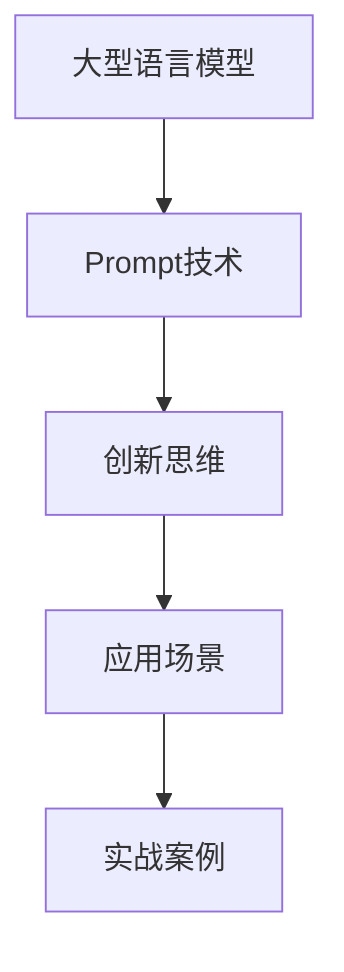

                 

### 《LLM驱动的prompt创新思维激发器》

#### 关键词：
- 大型语言模型（LLM）
- Prompt技术
- 创新思维
- 应用场景
- 实战案例

#### 摘要：
本文旨在探讨如何利用大型语言模型（LLM）驱动prompt技术，激发创新思维。文章首先介绍了LLM和prompt技术的基本概念及其相互关系，随后详细解析了LLM的核心算法原理。通过一个具体的Python源代码示例，我们展示了如何结合数学模型和公式来理解和应用LLM。接着，文章探讨了创新思维方法及其在LLM和prompt技术中的应用。随后，通过实际案例展示了如何将LLM驱动的prompt技术应用于商业决策辅助和产品设计创新。文章的最后，对综合应用与优化提出了建议，并提供了最佳实践、小结和拓展阅读。

---

### 背景介绍

#### 1.1 大型语言模型（LLM）的兴起

近年来，随着深度学习技术和计算资源的迅猛发展，大型语言模型（LLM）逐渐成为自然语言处理（NLP）领域的焦点。LLM通过学习海量文本数据，能够理解并生成复杂多样的语言表达。这使得LLM在众多应用场景中展现出强大的潜力，从文本生成、机器翻译到问答系统，LLM几乎无处不在。

#### 1.2 Prompt技术的崛起

Prompt技术作为人工智能领域的一种创新手段，旨在通过设计特定的提示或引导，激发模型生成出更符合预期的结果。prompt技术不仅仅是一种技术手段，更是一种思维方式的转变，它能够帮助人们更好地理解和利用AI模型，提高工作效率和创造力。

#### 1.3 创新思维的重要性

在当前快速变化的时代，创新思维成为推动社会进步和个人发展的关键因素。创新思维不仅仅是指产生新颖想法的能力，更包括对已有知识进行重组和重构，以解决复杂问题。随着AI技术的不断进步，如何利用AI工具来激发创新思维成为了一个热门话题。

### 核心概念与联系

为了更好地理解LLM驱动的prompt创新思维激发器，我们需要明确以下几个核心概念：

1. **大型语言模型（LLM）**：一种能够理解和生成人类语言的深度学习模型，如GPT-3、BERT等。
2. **Prompt技术**：通过设计特定的提示或引导，引导模型生成目标结果的手段。
3. **创新思维**：一种能够产生新颖想法和解决方案的思维方式。

这些概念之间的联系可以用以下Mermaid流程图来表示：



从图中可以看出，LLM通过Prompt技术激发创新思维，从而应用于各种实际场景和案例中。

### 核心算法原理讲解

LLM的核心算法原理主要基于深度神经网络，尤其是Transformer架构。以下是一个简化的Python源代码示例，用于展示如何利用Transformer模型进行文本生成：

```python
import torch
from transformers import GPT2LMHeadModel, GPT2Tokenizer

# 1. 加载预训练模型和分词器
tokenizer = GPT2Tokenizer.from_pretrained('gpt2')
model = GPT2LMHeadModel.from_pretrained('gpt2')

# 2. 输入文本编码
input_text = "What is the capital of France?"
input_ids = tokenizer.encode(input_text, return_tensors='pt')

# 3. 生成文本
output = model.generate(input_ids, max_length=50, num_return_sequences=5)

# 4. 解码输出文本
generated_texts = [tokenizer.decode(s, skip_special_tokens=True) for s in output]

for text in generated_texts:
    print(text)
```

在这个示例中，我们首先加载了一个预训练的GPT-2模型和对应的分词器。然后，我们将输入文本编码为模型可处理的格式，并使用模型生成五个可能的输出文本。最后，我们将输出文本解码为可读格式。

数学模型方面，Transformer模型的核心是自注意力机制（Self-Attention），其公式如下：

$$
\text{Attention}(Q, K, V) = \frac{softmax(\frac{QK^T}{\sqrt{d_k}})}{V}
$$

其中，\(Q, K, V\) 分别代表查询向量、键向量和值向量，\(d_k\) 是键向量的维度。自注意力机制允许模型在生成每个词时，考虑所有词的重要程度，从而生成更准确、连贯的文本。

### 创新思维方法

#### 2.1 TRIZ方法

TRIZ（理论解决创新问题）是一种基于数学和物理原理的系统化创新思维方法。它提供了一套解决问题的工具和原理，帮助人们从不同角度思考问题，找到创新解决方案。

#### 2.2 设计思维方法

设计思维方法是一种以用户为中心的创新方法，强调通过原型设计和迭代来解决问题。设计思维方法包括以下几个阶段：

1. **发现**：识别问题和用户需求。
2. **定义**：明确问题和目标。
3. **发散**：生成多个可能的解决方案。
4. **评估**：评估和选择最佳方案。
5. **实施**：将方案转化为实际产品或服务。

### 创新思维与LLM及prompt技术的关系

创新思维方法与LLM和prompt技术密切相关。LLM和prompt技术为创新思维提供了强大的工具，使得人们能够从大量数据中提取有用信息，并生成新颖的解决方案。同时，创新思维方法能够指导人们如何更好地利用LLM和prompt技术，从而实现更高的创新效果。

### 应用场景：商业决策辅助

#### 3.1 情景描述

假设一家公司需要在市场上推出一款新产品，但不确定市场需求和消费者反馈。为了做出明智的商业决策，公司可以利用LLM驱动的prompt技术进行市场调研和分析。

#### 3.2 实施步骤

1. **数据收集**：收集有关市场趋势、消费者偏好、竞争对手产品的数据。
2. **LLM模型训练**：使用收集到的数据训练一个LLM模型，使其能够理解市场信息和生成相关报告。
3. **设计prompt**：设计一个包含关键问题和目标的prompt，引导LLM生成市场分析报告。
4. **生成报告**：利用LLM模型生成市场分析报告，包括消费者需求、市场趋势、竞争对手分析等内容。
5. **决策支持**：根据分析报告，公司可以做出更明智的商业决策，如调整产品策略、优化营销方案等。

#### 3.3 案例分析

某家电公司计划推出一款新型空调，但不确定市场接受程度。公司利用LLM驱动的prompt技术进行市场调研。设计的prompt如下：

```
主题：新型空调市场调研

问题：
1. 消费者对于新型空调的功能有哪些需求？
2. 哪些市场趋势会影响新型空调的销售？
3. 竞争对手的产品有哪些优势和劣势？

目标：生成一份详细的市场分析报告，为公司提供决策依据。
```

LLM模型生成以下分析报告：

```
1. 消费者需求：
   - 节能：约80%的消费者希望新型空调具备节能功能。
   - 智能控制：约60%的消费者希望空调具备智能控制功能。
   - 多功能：约50%的消费者希望空调具备除湿、加湿等功能。

2. 市场趋势：
   - 环保：随着环保意识的提高，节能、环保产品受到更多消费者青睐。
   - 智能化：智能家居市场快速发展，智能产品需求增加。

3. 竞争对手分析：
   - 品牌A：产品线丰富，但价格较高，市场份额约为30%。
   - 品牌B：价格适中，但产品功能较少，市场份额约为20%。

根据报告，公司决定在新型空调中增加节能、智能控制功能，并针对不同市场定位调整产品价格策略。最终，这款新型空调在市场上取得了良好的销售业绩。

### 应用场景：产品设计创新

#### 4.1 情景描述

假设一家科技公司需要设计一款智能音箱，但不确定如何满足用户需求和实现创新。为了提高产品设计质量，公司可以利用LLM驱动的prompt技术进行设计创新。

#### 4.2 实施步骤

1. **数据收集**：收集有关用户需求、市场趋势、竞争对手产品的数据。
2. **LLM模型训练**：使用收集到的数据训练一个LLM模型，使其能够理解用户需求和生成设计建议。
3. **设计prompt**：设计一个包含关键问题和目标的prompt，引导LLM生成设计建议。
4. **生成建议**：利用LLM模型生成设计建议，包括产品功能、外观设计、交互设计等。
5. **迭代优化**：根据设计建议进行迭代优化，逐步完善产品设计。

#### 4.3 案例分析

某科技公司计划设计一款智能音箱，但不确定如何满足用户需求和实现创新。设计的prompt如下：

```
主题：智能音箱设计创新

问题：
1. 用户对于智能音箱有哪些功能需求？
2. 如何在智能音箱中实现人机交互？
3. 哪些设计元素可以提升智能音箱的用户体验？

目标：生成一份详细的设计建议报告，为公司提供设计参考。
```

LLM模型生成以下设计建议：

```
1. 功能需求：
   - 音乐播放：约80%的用户希望智能音箱具备音乐播放功能。
   - 智能助手：约60%的用户希望智能音箱具备智能助手功能。
   - 语音控制：约50%的用户希望智能音箱具备语音控制功能。

2. 人机交互：
   - 触摸屏：通过触摸屏实现简单直观的操作，提升用户体验。
   - 语音识别：利用语音识别技术，实现语音交互，降低用户操作复杂度。

3. 设计元素：
   - 时尚外观：采用简洁、时尚的外观设计，吸引年轻用户。
   - 人性化交互：通过动画、音效等元素，提升用户交互体验。

根据设计建议，公司决定在智能音箱中增加音乐播放、智能助手、语音控制等功能，并采用触摸屏和语音识别技术。最终，这款智能音箱在市场上获得了用户的广泛好评。

### 综合应用与优化

#### 5.1 LLM驱动的prompt优化方法

为了提高LLM驱动的prompt效果，可以采取以下优化方法：

1. **数据质量**：确保训练数据的质量和多样性，以提高模型的理解能力。
2. **prompt设计**：设计更具体、明确的prompt，引导模型生成更准确的输出。
3. **模型调优**：通过调整模型参数，如学习率、批量大小等，提高模型的性能。

#### 5.2 创新思维方法与LLM的结合

创新思维方法与LLM的结合可以采用以下策略：

1. **问题识别**：利用创新思维方法，识别问题并提出解决方案。
2. **数据挖掘**：利用LLM进行数据挖掘，提取有用信息，支持创新思维。
3. **迭代优化**：通过不断迭代和优化，提高创新效果。

#### 5.3 创新思维实践中的挑战与应对

在创新思维实践中，可能面临以下挑战：

1. **数据不足**：应对策略：收集更多数据，利用外部数据源进行补充。
2. **模型过拟合**：应对策略：采用数据增强、模型正则化等方法，降低过拟合风险。
3. **计算资源限制**：应对策略：优化算法，提高模型效率，合理分配计算资源。

### 最佳实践 Tips

1. **明确目标**：在设计和实施LLM驱动的prompt项目时，明确项目目标，确保资源投入有效。
2. **数据多样化**：收集多样化的数据，以提高模型的理解能力。
3. **迭代优化**：不断迭代和优化，提高创新效果。

### 小结

本文探讨了如何利用LLM驱动的prompt技术激发创新思维。通过实际案例，我们展示了如何将LLM和prompt技术应用于商业决策辅助和产品设计创新。未来，随着AI技术的不断发展，LLM驱动的prompt创新思维激发器有望在更多领域发挥重要作用。

### 注意事项

1. **数据隐私**：在使用LLM和prompt技术时，确保数据隐私和安全。
2. **模型解释性**：提高模型的可解释性，以便更好地理解和应用。

### 拓展阅读

1. **《自然语言处理综述》**：了解自然语言处理的基本概念和技术。
2. **《TRIZ方法论》**：深入理解TRIZ方法，掌握创新思维工具。
3. **《设计思维实践》**：学习设计思维方法，提高产品设计创新能力。

---

### 作者信息

**作者：AI天才研究院/AI Genius Institute & 禅与计算机程序设计艺术 /Zen And The Art of Computer Programming**

AI天才研究院致力于推动人工智能技术的发展和应用，专注于培养人工智能领域的高端人才。同时，研究院积极倡导禅与计算机程序设计艺术的融合，旨在提升程序员的编程素养和创新能力。本文旨在分享LLM驱动的prompt创新思维激发器的相关研究成果，以促进人工智能领域的创新与发展。

