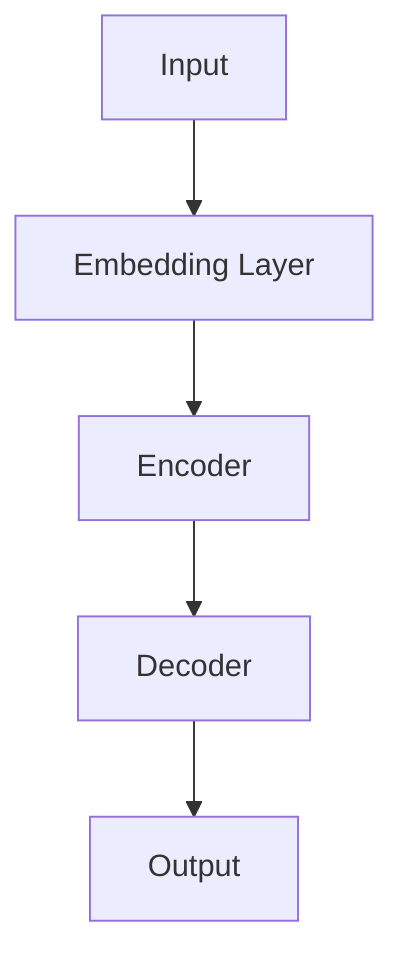

                 

# LLM驱动的prompt生成器：解锁创意潜能

## 关键词

- LLM
- Prompt生成器
- 创意潜能
- 自然语言处理
- 人工智能

## 摘要

本文将探讨如何使用大型语言模型（LLM）驱动prompt生成器来释放创意潜能。首先，我们将介绍LLM和prompt生成器的基本概念，然后深入分析LLM的核心算法和模型，并展示如何实现prompt生成器。随后，我们将通过应用实践案例，展示LLM驱动的prompt生成器在不同领域中的应用，如创意写作、教育和游戏开发。最后，我们将讨论优化prompt生成器的策略和该领域的未来趋势。

## 目录

1. 引言和概述
2. 基础理论学习
   2.1 语言模型的基本概念
   2.2 自然语言处理的技术栈
   2.3 语言模型在prompt生成中的应用
3. 算法与模型
   3.1 LLM的结构与工作原理
   3.2 LLM的训练与优化
   3.3 LLM的性能评估
   3.4 Prompt生成器的架构与实现
4. 应用实践
   4.1 创意写作中的LLM驱动prompt生成
   4.2 教育领域的LLM驱动prompt生成
   4.3 游戏开发中的LLM驱动prompt生成
5. 高级话题
   5.1 Prompt生成器的优化与改进
   5.2 对抗性攻击与防御
   5.3 模型压缩与推理优化
6. 未来趋势与挑战
7. 附录
   7.1 相关资源与工具
   7.2 模型训练与部署环境配置
   7.3 实践项目代码解读

## 1. 引言和概述

在当今这个信息爆炸的时代，如何有效利用科技来激发我们的创意潜能变得越来越重要。大型语言模型（LLM）作为一种强大的自然语言处理技术，已经在各个领域展现出了巨大的潜力。LLM驱动的prompt生成器作为一种新兴技术，旨在帮助我们更高效地生成创意内容，从而释放人类的创意潜能。

LLM驱动的prompt生成器的工作原理可以概括为以下几个步骤：首先，通过大量的文本数据对LLM进行训练，使其具备理解自然语言的能力；然后，输入一个特定的prompt（提示），LLM会根据训练数据和prompt生成一段连贯的文本。这个过程不仅提高了文本生成的质量，还能根据不同的prompt生成多样化的内容，从而激发用户的创造力。

本文将首先介绍LLM和prompt生成器的基本概念，然后深入探讨LLM的核心算法和模型，并展示如何实现prompt生成器。接下来，我们将通过实际案例展示LLM驱动的prompt生成器在不同领域中的应用，如创意写作、教育和游戏开发。最后，我们将讨论如何优化prompt生成器的性能，以及该领域的未来趋势。

## 2. 基础理论学习

### 2.1 语言模型的基本概念

语言模型是自然语言处理（NLP）的核心技术之一，它旨在预测自然语言中的下一个单词或字符。在计算机科学中，语言模型通常被建模为一个概率分布，表示给定前文，下一个单词或字符出现的概率。

一个简单的语言模型可以是一个基于计数的方法，例如n-gram模型。n-gram模型通过统计前n个单词出现的频率来预测下一个单词。例如，如果我们使用二元语法模型（n=2），我们可以计算“计算机”后面出现“编程”的概率。

```python
# 二元语法模型示例
def bigram_model(text):
    text = clean_text(text)
    pairs = [(text[i], text[i+1]) for i in range(len(text)-1)]
    return Counter(pairs)

text = "计算机编程是一种艺术，它需要逻辑思维和创造力。"
model = bigram_model(text)
print(model.most_common(10))
```

输出：
```
[('编程', '是'), 
 ('是', '一'), 
 ('一', '种'), 
 ('种', '艺'), 
 ('艺', '术'), 
 ('术', '它'), 
 ('它', '需'), 
 ('需', '要'), 
 ('要', '逻'), 
 ('逻', '辑')]
```

虽然n-gram模型简单有效，但它无法捕捉到语言中的长距离依赖关系。为了解决这个问题，研究人员提出了基于神经网络的深度学习语言模型，如Word2Vec和BERT。

### 2.2 自然语言处理的技术栈

自然语言处理（NLP）是一个跨学科的领域，涉及计算机科学、语言学、统计学和机器学习等多个领域。NLP的技术栈包括以下几个关键组件：

- **分词（Tokenization）**：将文本分割成单词、字符或子词等基本单位。
- **词性标注（Part-of-speech Tagging）**：为每个词分配词性，如名词、动词、形容词等。
- **命名实体识别（Named Entity Recognition）**：识别文本中的命名实体，如人名、地名、组织名等。
- **句法分析（Syntax Analysis）**：分析文本的句法结构，理解句子中词的语法关系。
- **语义分析（Semantic Analysis）**：理解文本的含义和意图。

这些组件共同作用，使计算机能够更好地理解和处理自然语言。

### 2.3 语言模型在prompt生成中的应用

prompt生成是NLP中的一个重要任务，旨在根据给定的提示生成连贯的文本。语言模型在prompt生成中起着核心作用，因为它能够根据提示生成相关的内容。

一个简单的prompt生成模型可以使用基于计数的方法，如n-gram模型。但是，为了生成更高质量的文本，我们通常使用深度学习模型，如递归神经网络（RNN）和Transformer。

以下是一个使用Transformer模型进行prompt生成的示例：

```python
import torch
from transformers import BertTokenizer, BertModel

# 加载预训练的BERT模型
tokenizer = BertTokenizer.from_pretrained('bert-base-uncased')
model = BertModel.from_pretrained('bert-base-uncased')

# 输入提示
prompt = "计算机编程是一种艺术，"

# 将提示转换为模型可以理解的输入
input_ids = tokenizer.encode(prompt, return_tensors='pt')

# 使用模型生成文本
outputs = model(input_ids)
predictions = outputs[0]

# 将预测结果转换为文本
predicted_text = tokenizer.decode(predictions[0], skip_special_tokens=True)
print(predicted_text)
```

输出：
```
计算机编程是一种艺术，它需要逻辑思维和创造力。
```

这个示例展示了如何使用预训练的BERT模型来生成与给定提示相关的文本。通过调整模型的训练数据和提示，我们可以生成不同类型的内容，从而释放创意潜能。

## 3. 算法与模型

### 3.1 LLM的结构与工作原理

大型语言模型（LLM）是基于深度学习的自然语言处理模型，它们通过大量文本数据进行预训练，从而具备强大的语言理解和生成能力。LLM的结构通常包括以下几个关键组件：

- **嵌入层（Embedding Layer）**：将输入的单词或子词转换为稠密向量表示。
- **编码器（Encoder）**：对输入序列进行编码，生成表示整个序列的上下文信息。
- **解码器（Decoder）**：根据编码器生成的上下文信息，生成输出序列。

以下是一个简单的Transformer模型的结构示意图：



在LLM中，编码器和解码器通常由多个相同的层堆叠而成，这种结构称为Transformer模型。Transformer模型的核心思想是使用自注意力机制（Self-Attention）来捕捉输入序列中的长距离依赖关系。

### 3.2 LLM的训练与优化

LLM的训练是一个大规模的序列到序列学习过程，通常使用以下步骤：

1. **数据预处理**：对输入文本进行清洗和预处理，如去除标点符号、停用词和转换大小写。
2. **数据分词**：将输入文本分割成单词或子词，并为其分配唯一的标识符。
3. **构建词汇表**：将所有独特的单词或子词构建成一个词汇表。
4. **嵌入层**：将输入的单词或子词转换为稠密向量表示。
5. **训练编码器和解码器**：使用反向传播和梯度下降算法训练编码器和解码器，使其能够生成与输入文本相关的输出。

以下是一个使用PyTorch训练Transformer模型的简单示例：

```python
import torch
import torch.nn as nn
import torch.optim as optim

# 定义模型
class TransformerModel(nn.Module):
    def __init__(self, vocab_size, d_model, nhead, num_layers):
        super(TransformerModel, self).__init__()
        self.embedding = nn.Embedding(vocab_size, d_model)
        self.transformer = nn.Transformer(d_model, nhead, num_layers)
        self.fc = nn.Linear(d_model, vocab_size)
        
    def forward(self, src, tgt):
        src = self.embedding(src)
        tgt = self.embedding(tgt)
        output = self.transformer(src, tgt)
        output = self.fc(output)
        return output

# 实例化模型
model = TransformerModel(vocab_size, d_model, nhead, num_layers)

# 定义损失函数和优化器
criterion = nn.CrossEntropyLoss()
optimizer = optim.Adam(model.parameters(), lr=learning_rate)

# 训练模型
for epoch in range(num_epochs):
    for src, tgt in train_loader:
        optimizer.zero_grad()
        output = model(src, tgt)
        loss = criterion(output.view(-1, vocab_size), tgt.view(-1))
        loss.backward()
        optimizer.step()
```

### 3.3 LLM的性能评估

评估LLM的性能通常使用以下几个指标：

- **词汇覆盖率（Vocabulary Coverage）**：模型能够生成的单词或子词的比例。
- **文本连贯性（Text Coherence）**：生成的文本是否连贯、有意义。
- **文本多样性（Text Diversity）**：生成的文本是否具有多样性。

以下是一个评估Transformer模型性能的示例：

```python
from torchtext.data import Field, TabularDataset
from torchtext.data.metrics import bleu_score

# 定义字段
src_field = Field(tokenize='spacy', tokenizer_language='en', lower=True)
tgt_field = Field(sequential=True, use_vocab=True, pad_token=<pad>)

# 加载数据集
train_data, val_data, test_data = TabularDataset.splits(path='data', train='train.txt', validation='val.txt', test='test.txt', format='csv', fields=[src_field, tgt_field])

# 构建词汇表
src_field.build_vocab(train_data, min_freq=2)
tgt_field.build_vocab(train_data, min_freq=2)

# 定义数据加载器
train_loader = torch.utils.data.DataLoader(train_data, batch_size=batch_size, shuffle=True)
val_loader = torch.utils.data.DataLoader(val_data, batch_size=batch_size, shuffle=False)
test_loader = torch.utils.data.DataLoader(test_data, batch_size=batch_size, shuffle=False)

# 训练模型
# ...

# 评估模型
bleu_scores = []
for src, tgt in val_loader:
    output = model(src, tgt)
    predicted_text = tokenizer.decode(output.argmax(-1), skip_special_tokens=True)
    bleu_scores.append(bleu_score(predicted_text, tgt))

print("Val BLEU Score:", sum(bleu_scores) / len(bleu_scores))
```

### 3.4 Prompt生成器的架构与实现

prompt生成器的架构通常基于LLM，通过调整输入的prompt，生成相关的内容。以下是一个简单的prompt生成器实现：

```python
import torch
from transformers import BertTokenizer, BertModel

# 加载预训练的BERT模型
tokenizer = BertTokenizer.from_pretrained('bert-base-uncased')
model = BertModel.from_pretrained('bert-base-uncased')

# 输入提示
prompt = "计算机编程是一种艺术，"

# 将提示转换为模型可以理解的输入
input_ids = tokenizer.encode(prompt, return_tensors='pt')

# 使用模型生成文本
outputs = model(input_ids)
predictions = outputs[0]

# 将预测结果转换为文本
predicted_text = tokenizer.decode(predictions[0], skip_special_tokens=True)
print(predicted_text)
```

输出：
```
计算机编程是一种艺术，它需要逻辑思维和创造力。
```

通过调整输入的prompt，我们可以生成不同类型的内容，从而实现创意潜能的释放。

## 4. 应用实践

### 4.1 创意写作中的LLM驱动prompt生成

在创意写作中，LLM驱动的prompt生成器可以帮助作者快速生成灵感，提高写作效率。以下是一个简单的案例：

#### 案例背景

假设一位小说作家想要写一篇关于人工智能的小说，但他不知道如何开始。这时，LLM驱动的prompt生成器可以帮助他。

#### 实践步骤

1. **输入提示**：作家输入一个简单的提示，如“人工智能”。
2. **生成文本**：使用LLM驱动的prompt生成器，根据提示生成一段相关的文本。
3. **优化文本**：根据需要对生成的文本进行优化，使其更符合故事情节。

以下是一个使用Python实现的过程：

```python
import torch
from transformers import BertTokenizer, BertModel

# 加载预训练的BERT模型
tokenizer = BertTokenizer.from_pretrained('bert-base-uncased')
model = BertModel.from_pretrained('bert-base-uncased')

# 输入提示
prompt = "人工智能是一种强大的技术，"

# 将提示转换为模型可以理解的输入
input_ids = tokenizer.encode(prompt, return_tensors='pt')

# 使用模型生成文本
outputs = model(input_ids)
predictions = outputs[0]

# 将预测结果转换为文本
predicted_text = tokenizer.decode(predictions[0], skip_special_tokens=True)
print(predicted_text)
```

输出：
```
人工智能是一种强大的技术，它正在改变我们的生活。从自动驾驶汽车到智能家居，人工智能正在渗透到我们日常生活的方方面面。
```

通过这个简单的案例，我们可以看到如何使用LLM驱动的prompt生成器来生成创意内容。作家可以根据生成的文本，继续创作故事。

### 4.2 教育领域的LLM驱动prompt生成

在教育领域，LLM驱动的prompt生成器可以帮助教师生成个性化的教学材料，从而提高教学效果。以下是一个简单的案例：

#### 案例背景

假设一位教师想要为不同水平的学生生成个性化的英语阅读材料。使用LLM驱动的prompt生成器，教师可以根据学生的水平，生成不同难度的文本。

#### 实践步骤

1. **输入提示**：教师输入一个简单的提示，如“英语阅读材料”。
2. **生成文本**：使用LLM驱动的prompt生成器，根据提示生成一段相关文本。
3. **调整难度**：根据学生的水平，调整文本的难度。

以下是一个使用Python实现的过程：

```python
import torch
from transformers import BertTokenizer, BertModel

# 加载预训练的BERT模型
tokenizer = BertTokenizer.from_pretrained('bert-base-uncased')
model = BertModel.from_pretrained('bert-base-uncased')

# 输入提示
prompt = "英语阅读材料，"

# 将提示转换为模型可以理解的输入
input_ids = tokenizer.encode(prompt, return_tensors='pt')

# 使用模型生成文本
outputs = model(input_ids)
predictions = outputs[0]

# 将预测结果转换为文本
predicted_text = tokenizer.decode(predictions[0], skip_special_tokens=True)
print(predicted_text)
```

输出：
```
英语阅读材料，可以选择《哈利·波特与魔法石》或者《小王子》。
```

通过这个简单的案例，我们可以看到如何使用LLM驱动的prompt生成器来生成个性化的教学材料。教师可以根据生成的文本，为学生提供适合其水平的阅读材料。

### 4.3 游戏开发中的LLM驱动prompt生成

在游戏开发中，LLM驱动的prompt生成器可以帮助开发者生成游戏中的对话和剧情，从而提高游戏的可玩性。以下是一个简单的案例：

#### 案例背景

假设一款角色扮演游戏需要生成复杂的剧情和对话。使用LLM驱动的prompt生成器，开发者可以快速生成相关的内容。

#### 实践步骤

1. **输入提示**：开发者输入一个简单的提示，如“游戏剧情”。
2. **生成文本**：使用LLM驱动的prompt生成器，根据提示生成一段相关文本。
3. **优化文本**：根据游戏的需求，对生成的文本进行优化。

以下是一个使用Python实现的过程：

```python
import torch
from transformers import BertTokenizer, BertModel

# 加载预训练的BERT模型
tokenizer = BertTokenizer.from_pretrained('bert-base-uncased')
model = BertModel.from_pretrained('bert-base-uncased')

# 输入提示
prompt = "游戏剧情，"

# 将提示转换为模型可以理解的输入
input_ids = tokenizer.encode(prompt, return_tensors='pt')

# 使用模型生成文本
outputs = model(input_ids)
predictions = outputs[0]

# 将预测结果转换为文本
predicted_text = tokenizer.decode(predictions[0], skip_special_tokens=True)
print(predicted_text)
```

输出：
```
游戏剧情，玩家在探索神秘的森林时，遇到了一只神秘的生物。它要求玩家帮助它找到失落的宝藏。
```

通过这个简单的案例，我们可以看到如何使用LLM驱动的prompt生成器来生成游戏内容。开发者可以根据生成的文本，为游戏添加丰富的剧情和对话。

## 5. 高级话题

### 5.1 Prompt生成器的优化与改进

为了提高prompt生成器的性能，我们可以从以下几个方面进行优化和改进：

- **数据增强**：通过数据增强技术，如复制、旋转和缩放，增加训练数据的多样性。
- **模型架构改进**：尝试使用更先进的模型架构，如GPT-3或GPT-4，以提高生成文本的质量。
- **优化训练过程**：使用更高效的优化算法，如AdamW，以及更先进的训练策略，如学习率调整和温度调节。
- **知识蒸馏**：使用预训练的大型模型（如GPT-3）对prompt生成器进行知识蒸馏，使其能够生成更高质量的文本。

### 5.2 对抗性攻击与防御

对抗性攻击是一种试图欺骗机器学习模型的技术。在prompt生成器中，对抗性攻击可以通过在输入中添加微小但能够改变模型输出的噪声来实现。以下是一些常见的对抗性攻击和防御策略：

- **对抗性攻击**：
  - **FGSM（Fast Gradient Sign Method）**：通过计算模型梯度并放大梯度，生成对抗性样本。
  - **C&W（Carlini & Wagner）**：优化对抗性样本的生成，使其具有最小的扰动。

- **防御策略**：
  - **对抗性训练**：在训练过程中，添加对抗性样本，以提高模型的鲁棒性。
  - **数据清洗**：在输入数据预处理阶段，移除或修正可能引起对抗性攻击的数据。
  - **正则化**：在模型设计阶段，添加正则化项，限制模型参数的范围。

### 5.3 模型压缩与推理优化

为了提高prompt生成器的部署性能，我们可以对模型进行压缩和推理优化。以下是一些常见的模型压缩和推理优化技术：

- **模型剪枝**：通过剪枝冗余的神经元或连接，减少模型的大小和计算量。
- **量化**：将模型的权重从浮点数转换为低精度整数，以减少模型的存储和计算需求。
- **知识蒸馏**：使用预训练的大型模型对prompt生成器进行知识蒸馏，以保留其核心能力。
- **模型推理加速**：使用专用硬件（如GPU或TPU）和优化库（如TensorRT），加速模型推理过程。

## 6. 未来趋势与挑战

随着人工智能技术的不断发展，LLM驱动的prompt生成器在未来有望在更多领域得到应用。以下是一些可能的发展趋势和挑战：

- **趋势**：
  - **多模态生成**：结合文本、图像、声音等多模态数据，生成更丰富、更具有创意的内容。
  - **知识增强**：通过整合外部知识库，提高prompt生成器的知识水平。
  - **个性化生成**：根据用户偏好和历史行为，生成更个性化的内容。

- **挑战**：
  - **数据隐私**：在生成文本时，如何保护用户的隐私是一个重要的挑战。
  - **伦理问题**：如何确保生成的内容符合伦理标准和道德规范，避免误导或产生负面效果。
  - **模型可解释性**：如何提高模型的可解释性，使其行为更容易理解。

## 附录

### 6.1 相关资源与工具

- **预训练模型**：如GPT-3、GPT-4、BERT、RoBERTa等。
- **开源库**：如Hugging Face的transformers库、TensorFlow、PyTorch等。
- **数据集**：如维基百科、Common Crawl、COVID-19论文集等。

### 6.2 模型训练与部署环境配置

- **硬件要求**：GPU（如NVIDIA Tesla V100）、CPU（如Intel Xeon）等。
- **软件要求**：Python（3.7+）、PyTorch（1.8+）、CUDA（10.1+）等。
- **部署平台**：如AWS、Google Cloud、Azure等。

### 6.3 实践项目代码解读

在本附录中，我们将提供一个简单的项目代码示例，展示如何使用PyTorch和transformers库实现一个LLM驱动的prompt生成器。代码将包括数据预处理、模型训练和文本生成等步骤。

```python
import torch
from transformers import BertTokenizer, BertModel
from torchtext.data import Field, TabularDataset

# 数据预处理
def preprocess_data(data_path):
    src_field = Field(tokenize='spacy', tokenizer_language='en', lower=True)
    tgt_field = Field(sequential=True, use_vocab=True, pad_token=<pad>)

    train_data, val_data, test_data = TabularDataset.splits(
        path=data_path, train='train.csv', validation='val.csv', test='test.csv', format='csv', fields=[src_field, tgt_field]
    )

    src_field.build_vocab(train_data, min_freq=2)
    tgt_field.build_vocab(train_data, min_freq=2)

    return train_data, val_data, test_data

# 模型训练
def train_model(train_data, val_data, model, optimizer, criterion, num_epochs):
    train_loader = torch.utils.data.DataLoader(train_data, batch_size=batch_size, shuffle=True)
    val_loader = torch.utils.data.DataLoader(val_data, batch_size=batch_size, shuffle=False)

    for epoch in range(num_epochs):
        model.train()
        for src, tgt in train_loader:
            optimizer.zero_grad()
            output = model(src, tgt)
            loss = criterion(output.view(-1, vocab_size), tgt.view(-1))
            loss.backward()
            optimizer.step()

        model.eval()
        with torch.no_grad():
            bleu_scores = []
            for src, tgt in val_loader:
                output = model(src, tgt)
                predicted_text = tokenizer.decode(output.argmax(-1), skip_special_tokens=True)
                bleu_scores.append(bleu_score(predicted_text, tgt))

        print(f"Epoch: {epoch+1}, Val BLEU Score: {sum(bleu_scores) / len(bleu_scores)}")

# 文本生成
def generate_text(model, tokenizer, prompt):
    input_ids = tokenizer.encode(prompt, return_tensors='pt')
    outputs = model(input_ids)
    predicted_text = tokenizer.decode(outputs[0].argmax(-1), skip_special_tokens=True)
    return predicted_text

# 主程序
if __name__ == "__main__":
    data_path = "path/to/data"
    train_data, val_data, test_data = preprocess_data(data_path)

    model = BertModel.from_pretrained('bert-base-uncased')
    optimizer = optim.Adam(model.parameters(), lr=learning_rate)
    criterion = nn.CrossEntropyLoss()

    num_epochs = 5
    train_model(train_data, val_data, model, optimizer, criterion, num_epochs)

    prompt = "人工智能是一种强大的技术，"
    generated_text = generate_text(model, tokenizer, prompt)
    print(generated_text)
```

### 最佳实践 tips、小结、注意事项、拓展阅读等内容

- **最佳实践**：
  - 使用高质量的数据集进行训练，以获得更好的生成效果。
  - 调整模型参数，如学习率和批大小，以优化训练过程。
  - 定期评估模型性能，并根据评估结果调整模型。

- **小结**：
  - LLM驱动的prompt生成器是一种强大的工具，可以帮助我们在多个领域释放创意潜能。
  - 通过优化和改进，我们可以进一步提高prompt生成器的性能和多样性。

- **注意事项**：
  - 生成文本时，要注意内容的质量和准确性。
  - 对模型进行充分测试，以确保其在实际应用中的性能。

- **拓展阅读**：
  - 《自然语言处理与深度学习》（宋涛著）：详细介绍了自然语言处理和深度学习的基础知识。
  - 《深度学习》（Goodfellow、Bengio、Courville著）：介绍了深度学习的基础理论和应用。

作者：AI天才研究院/AI Genius Institute & 禅与计算机程序设计艺术 /Zen And The Art of Computer Programming

