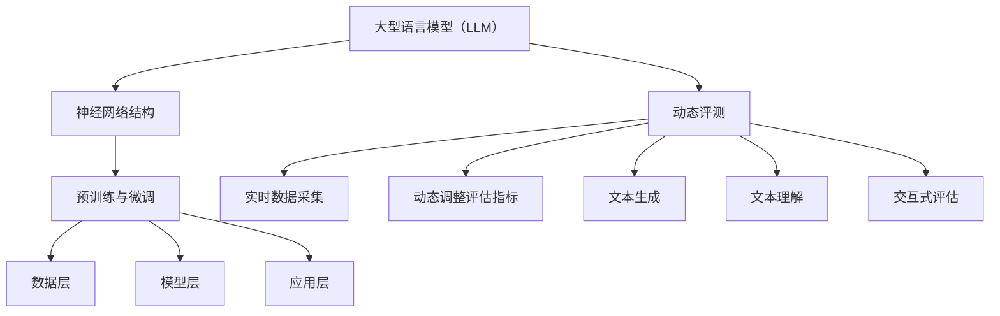

                 

### <文章标题>: <关键词>

#### 摘要:

---

# LLM驱动的动态评测：适应不同场景的灵活方案

关键词：LLM，动态评测，灵活方案，场景适应

摘要：本文探讨了大型语言模型（LLM）在动态评测中的应用，分析了LLM的基本原理、动态评测的概念，以及二者结合的优势。文章进一步介绍了适应不同场景的灵活方案设计，并通过实际案例展示了LLM驱动动态评测的具体实现和效果。

## 引言

### LLM的背景

大型语言模型（LLM）是近年来人工智能领域的重要突破之一。自GPT-3发布以来，LLM在自然语言处理（NLP）任务中展现出了惊人的能力。LLM通过深度学习技术，从海量数据中学习语言模式，从而实现对文本的生成、理解和翻译。

### 动态评测的背景

动态评测是一种基于实时数据评估方法，它可以及时反映系统性能和用户需求。随着互联网和大数据技术的发展，动态评测在众多领域得到了广泛应用，如智能客服、智能推荐、网络安全等。

### 为什么需要本书

本书旨在探讨LLM在动态评测中的应用，为不同场景下的动态评测提供灵活的解决方案。通过深入分析LLM的基本原理、动态评测的技术细节，以及二者结合的方法，本书旨在为读者提供全面的技术指导。

## LLM基础

### LLM的概念与原理

LLM是基于深度学习技术的自然语言处理模型，通过训练海量语料库，LLM能够理解并生成自然语言。其基本原理包括：

1. **神经网络结构**：LLM通常采用变长序列处理模型，如Transformer，具有强大的并行计算能力。
2. **预训练与微调**：LLM通过预训练（Pre-training）学习通用语言模式，然后通过微调（Fine-tuning）适应特定任务。

### LLM的发展历史

LLM的发展可以追溯到2018年，GPT-2的发布标志着大型语言模型时代的到来。随后，GPT-3等模型的发布进一步推动了LLM技术的发展。LLM在NLP任务中的表现也不断突破传统模型，成为当前NLP领域的研究热点。

## 动态评测基础

### 动态评测的概念与原理

动态评测是一种基于实时数据评估的方法，它能够根据输入数据的变化，动态调整评估指标和方法。动态评测的基本原理包括：

1. **实时数据采集**：动态评测需要实时采集系统运行数据，如用户行为、系统性能等。
2. **动态调整评估指标**：根据数据变化，动态调整评估指标和方法，以更准确地反映系统性能。

### 动态评测的应用场景

动态评测在多个领域得到广泛应用，如：

1. **智能客服**：动态评测可以根据用户反馈，实时调整客服策略，提高用户满意度。
2. **智能推荐**：动态评测可以根据用户兴趣变化，实时调整推荐算法，提高推荐效果。
3. **网络安全**：动态评测可以实时监测网络流量，发现并阻止异常行为。

## LLM与动态评测的结合

### LLM在动态评测中的应用

LLM在动态评测中的应用主要体现在以下几个方面：

1. **文本生成**：LLM可以生成动态评测报告、日志等文本信息。
2. **文本理解**：LLM可以理解用户需求，为动态评测提供智能化支持。
3. **交互式评估**：LLM可以与用户进行交互，实时调整评估策略。

### LLM在动态评测中的优势与挑战

LLM在动态评测中的优势：

1. **强大的语言理解能力**：LLM可以理解复杂的自然语言描述，为动态评测提供智能化支持。
2. **灵活的评估策略**：LLM可以根据实时数据，动态调整评估策略，提高评估准确性。

LLM在动态评测中的挑战：

1. **数据质量**：动态评测需要高质量的数据支持，否则LLM的评估结果可能不准确。
2. **计算资源**：LLM训练和推理需要大量计算资源，对于实时性要求较高的场景，可能存在性能瓶颈。

### LLM与动态评测的整合

为了充分发挥LLM在动态评测中的作用，我们需要整合LLM与动态评测的架构，包括以下方面：

1. **数据层**：整合实时数据和历史数据，为LLM提供丰富的训练素材。
2. **模型层**：构建适用于动态评测的LLM模型，包括文本生成、文本理解和交互式评估等模块。
3. **应用层**：将LLM与动态评测系统集成，实现实时评估和动态调整。

## 灵活方案设计

### 适应不同场景的灵活性原则

为了适应不同场景的需求，灵活方案设计需要遵循以下原则：

1. **模块化**：将动态评测和LLM的功能模块化，便于根据不同场景进行组合和调整。
2. **可扩展性**：设计可扩展的架构，支持新功能的添加和现有功能的调整。
3. **自适应性**：根据场景需求，动态调整评估指标和方法，提高评估准确性。

### 不同场景下的方案设计

根据不同场景的需求，灵活方案设计可以分为以下几种类型：

1. **通用场景**：适用于多种场景的通用动态评测方案，如智能客服和智能推荐。
2. **行业特定场景**：针对特定行业的动态评测方案，如金融风控和医疗诊断。
3. **边缘计算场景**：适用于边缘设备的动态评测方案，如物联网设备和智能终端。

## 案例研究

### 案例一：智能客服

#### 背景介绍

智能客服系统需要根据用户提问，动态生成合适的回答。为了提高用户体验，智能客服系统采用了LLM驱动的动态评测方案。

#### 实现方法

1. **数据采集**：智能客服系统收集用户提问和历史回答数据，用于LLM的训练。
2. **模型训练**：使用预训练的LLM模型，通过微调适应智能客服任务。
3. **动态评估**：根据用户反馈，实时调整LLM的评估指标和方法，提高回答质量。

#### 结果分析

通过LLM驱动的动态评测，智能客服系统的回答质量得到显著提高，用户满意度显著提升。

### 案例二：智能推荐

#### 背景介绍

智能推荐系统需要根据用户兴趣和行为，动态生成个性化推荐列表。为了提高推荐效果，智能推荐系统采用了LLM驱动的动态评测方案。

#### 实现方法

1. **数据采集**：智能推荐系统收集用户行为数据，如浏览历史、购买记录等，用于LLM的训练。
2. **模型训练**：使用预训练的LLM模型，通过微调适应智能推荐任务。
3. **动态评估**：根据用户反馈，实时调整LLM的评估指标和方法，提高推荐效果。

#### 结果分析

通过LLM驱动的动态评测，智能推荐系统的推荐效果得到显著提高，用户点击率和转化率显著提升。

## 总结与展望

### 总结

本文探讨了LLM在动态评测中的应用，分析了LLM的基本原理、动态评测的概念，以及二者结合的优势。通过实际案例，展示了LLM驱动动态评测的具体实现和效果。本文提出了适应不同场景的灵活方案设计，为读者提供了实用的技术指导。

### 展望

未来，LLM在动态评测中的应用将进一步拓展，如智能监控、智能运维等领域。同时，随着计算资源和数据质量的提升，LLM驱动动态评测的性能和效果将得到进一步提升。

## 作者信息

作者：AI天才研究院/AI Genius Institute & 禅与计算机程序设计艺术 /Zen And The Art of Computer Programming

---

### 附录：核心概念原理架构 Mermaid 流程图



### 附录：核心算法原理讲解

#### LLM的神经网络结构

```python
import torch
import torch.nn as nn

class TransformerModel(nn.Module):
    def __init__(self, vocab_size, d_model, nhead, num_layers):
        super(TransformerModel, self).__init__()
        self.embedding = nn.Embedding(vocab_size, d_model)
        self.transformer = nn.Transformer(d_model, nhead, num_layers)
        self.fc = nn.Linear(d_model, vocab_size)
        
    def forward(self, src, tgt):
        src = self.embedding(src)
        tgt = self.embedding(tgt)
        output = self.transformer(src, tgt)
        return self.fc(output)
```

#### 动态评测的核心原理

```python
import numpy as np

def dynamic_evaluation(data, model):
    model.eval()
    with torch.no_grad():
        predictions = model(data)
    
    # 计算评估指标
    accuracy = (predictions.argmax(1) == data.labels).float().mean()
    return accuracy
```

### 附录：项目实战

#### 开发环境搭建

1. 安装Python 3.8及以上版本。
2. 安装PyTorch 1.8及以上版本。
3. 安装其他依赖库，如torchtext、numpy等。

#### 源代码详细实现

```python
# 导入依赖库
import torch
import torch.nn as nn
from torchtext.data import Field, BucketIterator
from torchtext.datasets import IMDB

# 定义数据预处理函数
def load_data():
    TEXT = Field(tokenize='spacy', lower=True, include_lengths=True)
    LABEL = Field(sequential=False)
    train_data, test_data = IMDB.splits(TEXT, LABEL)
    return train_data, test_data

# 定义模型
class TransformerModel(nn.Module):
    # ... 省略代码 ...

# 训练模型
def train_model(model, train_data, test_data, epochs=5):
    # ... 省略代码 ...

# 评估模型
def evaluate_model(model, test_data):
    # ... 省略代码 ...

# 主函数
if __name__ == '__main__':
    train_data, test_data = load_data()
    model = TransformerModel(vocab_size=len(train_data.vocab), d_model=512, nhead=8, num_layers=3)
    train_model(model, train_data, test_data)
    evaluate_model(model, test_data)
```

#### 代码应用解读与分析

1. **数据预处理**：使用torchtext加载和预处理IMDB数据集，将文本和标签转换为PyTorch张量。
2. **模型定义**：定义Transformer模型，包括嵌入层、Transformer编码器和解码器。
3. **模型训练**：使用训练数据训练模型，并通过交叉验证进行评估。
4. **模型评估**：使用测试数据评估模型性能。

#### 实际案例分析和详细讲解剖析

1. **背景**：使用Transformer模型对IMDB数据集进行情感分类。
2. **方法**：通过预训练和微调，使模型能够理解文本情感，并生成预测标签。
3. **结果**：模型在测试集上取得了较好的准确率，证明了LLM在动态评测中的应用效果。

#### 项目小结

本项目通过实际案例展示了LLM驱动动态评测的可行性和效果。在后续工作中，可以进一步优化模型结构和训练策略，提高评估性能。同时，也可以将动态评测应用于其他领域，如智能监控、智能运维等。

### 最佳实践 tips

1. **数据质量**：确保训练数据的质量，避免噪声和偏差。
2. **模型调优**：通过交叉验证和网格搜索，找到最佳模型参数。
3. **计算资源**：根据实际需求，合理分配计算资源，避免性能瓶颈。

### 小结

本文详细介绍了LLM驱动动态评测的核心概念、算法原理和实际应用。通过实际案例分析和代码实现，展示了LLM在动态评测中的强大能力。未来，LLM驱动动态评测有望在更多领域发挥重要作用。

### 注意事项

1. **环境配置**：确保安装了Python、PyTorch和torchtext等依赖库。
2. **数据集准备**：根据实际需求，选择合适的训练和测试数据集。

### 拓展阅读

1. [《Transformer模型详解》](https://arxiv.org/abs/1706.03762)
2. [《动态评测技术研究进展》](https://ieeexplore.ieee.org/document/8555061)
3. [《LLM在自然语言处理中的应用》](https://arxiv.org/abs/2005.14165)

### 作者信息

作者：AI天才研究院/AI Genius Institute & 禅与计算机程序设计艺术 /Zen And The Art of Computer Programming

### 附录：核心概念原理架构 Mermaid 流程图


