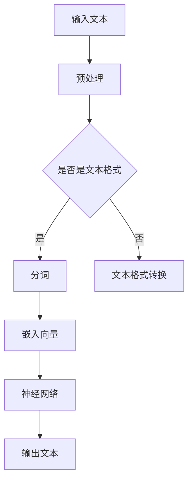
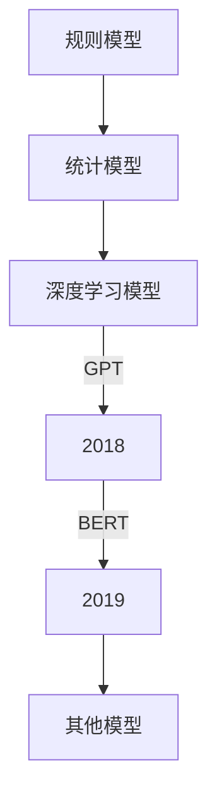
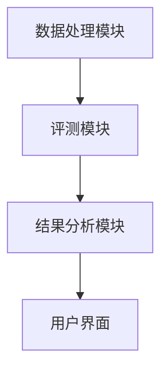
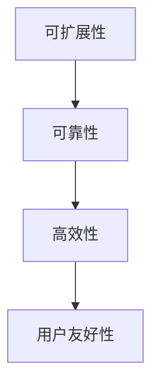
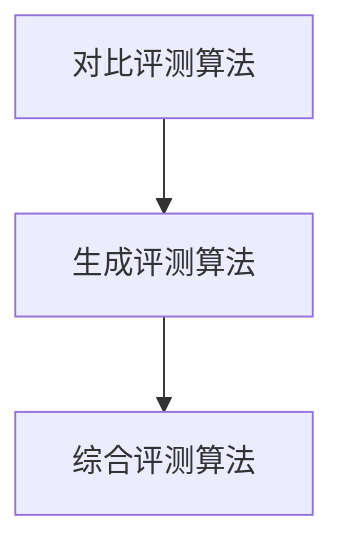

                 

-------------------------------------------------------------------

# 《LLM驱动的大模型评测系统：革新AI性能分析》

> 关键词：大模型评测系统、LLM、AI性能分析、评测指标、算法优化

> 摘要：
随着人工智能（AI）技术的飞速发展，大模型（Large Language Model，简称LLM）在自然语言处理（NLP）领域展现出了前所未有的性能。本文将深入探讨LLM驱动的大模型评测系统，分析其架构、评测指标、算法优化及实际应用，旨在为AI性能分析提供新的视角和方法。

-------------------------------------------------------------------

## 第1章：LLM概述

### 1.1 LLM的定义与基本原理

LLM，即大语言模型（Large Language Model），是一种通过学习大量文本数据，能够生成自然语言文本的人工智能模型。它基于神经网络，特别是深度学习技术，通过多层神经元的交互，实现对语言的建模。

#### 1.1.1 LLM的概念

LLM是一种能够理解和生成自然语言的模型，它的核心在于“大”，即模型规模庞大，参数数量多，能够处理复杂的语言结构和语义信息。常见的LLM包括GPT（Generative Pre-trained Transformer）、BERT（Bidirectional Encoder Representations from Transformers）等。

#### 1.1.2 LLM的基本原理

LLM的基本原理是通过对大量文本数据进行预训练，使其能够捕获语言的统计特性、语义信息和上下文关系。预训练后，LLM可以通过微调（Fine-tuning）来适应特定任务，如文本分类、问答系统等。

#### 1.1.3 LLM的发展历程

LLM的发展经历了从简单的规则模型到基于统计方法的模型，再到深度学习模型的演进。GPT和BERT等模型的问世，标志着LLM进入了新的阶段，其性能和效果得到了大幅提升。

### 1.2 LLM的应用场景

LLM在多个领域有着广泛的应用，以下是几个典型的应用场景：

#### 1.2.1 文本生成

LLM可以生成新闻文章、诗歌、对话等文本内容，应用于内容创作、自动化写作等领域。

#### 1.2.2 文本分类

LLM可以用于对大量文本数据进行分类，如情感分析、主题分类等。

#### 1.2.3 对话系统

LLM可以用于构建智能对话系统，如虚拟助手、聊天机器人等。

### 1.3 LLM的优势与挑战

#### 1.3.1 LLM的优势

- **强大的语义理解能力**：LLM能够捕捉到复杂的语义关系，使得生成的内容更加自然、准确。
- **广泛的应用领域**：LLM在多个领域都有出色的表现，具有广泛的应用潜力。
- **高效的预训练机制**：通过预训练，LLM能够快速适应不同的任务需求。

#### 1.3.2 LLM的挑战

- **计算资源需求大**：LLM的训练和推理需要大量的计算资源，对硬件设备有较高要求。
- **数据质量和隐私问题**：LLM的性能依赖于训练数据的质量，同时也涉及数据隐私和安全问题。
- **解释性和可解释性**：深度学习模型的“黑箱”特性使得LLM的解释性较差，不利于理解和信任。

## 第2章：大模型评测系统架构

### 2.1 大模型评测系统的组成部分

一个完整的大模型评测系统通常包括以下几个关键组成部分：

#### 2.1.1 数据处理模块

数据处理模块负责对训练数据和评测数据进行预处理，包括数据清洗、数据标注、数据分片等操作。

#### 2.1.2 评测模块

评测模块是评测系统的核心，负责根据预设的评测指标，对模型进行评估。常见的评测指标包括准确率、召回率、F1值、ROUGE评分等。

#### 2.1.3 结果分析模块

结果分析模块对评测结果进行统计分析，生成可视化报告，帮助用户理解模型的性能。

### 2.2 大模型评测系统的设计原则

设计一个高效的大模型评测系统需要遵循以下几个原则：

- **可扩展性**：系统应能够支持大规模数据的处理，适应不同的模型规模和评测需求。
- **可靠性**：系统应保证评测结果的准确性和一致性，避免数据误差和系统故障。
- **高效性**：系统应优化数据处理和评测过程，提高效率和性能。

## 第3章：评测指标与算法

### 3.1 评测指标

评测指标是评估模型性能的重要标准，以下是一些常见的评测指标：

#### 3.1.1 准确率、召回率与F1值

- **准确率**：预测正确的样本数与总样本数的比例。
- **召回率**：预测正确的正样本数与实际正样本数的比例。
- **F1值**：准确率和召回率的调和平均值。

#### 3.1.2 ROUGE评分

ROUGE（Recall-Oriented Understudy for Gisting Evaluation）评分是一种用于评估生成文本质量的标准，主要关注文本的召回率。

#### 3.1.3 BLEU评分

BLEU（Bilingual Evaluation Understudy）评分是一种用于评估机器翻译质量的指标，也常用于评估文本生成任务。

### 3.2 评测算法

评测算法是实现评测指标计算的核心，以下是一些常见的评测算法：

#### 3.2.1 对比评测算法

对比评测算法通过比较生成文本和参考文本的相似度，评估模型的性能。

#### 3.2.2 生成评测算法

生成评测算法通过生成文本的质量来评估模型性能，如ROUGE评分。

#### 3.2.3 综合评测算法

综合评测算法结合多种评测指标和算法，提供更全面、客观的模型评估。

## 第4章：评测系统实战

### 4.1 实战项目介绍

在本章中，我们将介绍一个实际的大模型评测项目，包括项目背景、目标和成果。

### 4.2 数据预处理

我们将详细讲解数据预处理的过程，包括数据收集、数据清洗、数据标注等步骤。

### 4.3 评测流程

评测流程包括评测模块的设计和实现，以及评测结果的分析和可视化。

### 4.4 性能优化

我们将探讨如何优化评测系统的性能，包括模型优化、数据处理优化、算法优化等。

## 第5章：性能优化

### 5.1 性能优化策略

我们将介绍几种常见的性能优化策略，包括模型压缩、数据增强、算法优化等。

### 5.2 实战案例

在本章中，我们将通过实际案例，展示如何应用性能优化策略，提升评测系统的性能。

### 5.3 最佳实践

我们将总结一些最佳实践，为读者提供优化评测系统的实用建议。

## 第6章：评测系统部署

### 6.1 部署策略

我们将讨论评测系统的部署策略，包括云部署、离线部署和线上部署等。

### 6.2 部署实战

在本章中，我们将详细讲解评测系统的部署过程，包括开发环境搭建、源代码实现和部署策略的选择。

### 6.3 部署案例

我们将分享一些评测系统的部署案例，分析部署过程中的挑战和解决方案。

## 第7章：案例分析

### 7.1 案例一：某公司大模型评测系统实施

我们将分析一个公司的实际案例，探讨其大模型评测系统的实施过程、目标和方法。

### 7.2 案例二：大模型评测系统在学术研究中的应用

我们将探讨大模型评测系统在学术研究中的应用，分析其在研究中的作用和影响。

### 7.3 案例总结

我们将总结案例中的关键经验和教训，为读者提供实际操作的建议。

## 总结

本文系统地介绍了LLM驱动的大模型评测系统，包括其架构、评测指标、算法优化、性能优化和部署等方面。通过实际案例的分析，我们展示了如何有效地应用这些技术和方法，提升AI模型的性能。未来，随着AI技术的不断进步，大模型评测系统将在AI领域中发挥更加重要的作用。

### 作者信息

作者：AI天才研究院/AI Genius Institute & 禅与计算机程序设计艺术 /Zen And The Art of Computer Programming

-------------------------------------------------------------------

请注意，以上内容是一个初步的框架，每个章节都需要详细填充具体内容，以达到10000～12000字的字数要求。每个小节都需要具体的技术细节、代码实现、数学模型和实际案例分析。以下是一个详细的章节划分和内容概述：

## 第1章：LLM概述

### 1.1.1 LLM的概念

在本节中，我们将详细讨论LLM（大语言模型）的基本概念。LLM是一种基于深度学习的技术，它通过学习大量的文本数据来生成和理解自然语言。LLM的核心在于其能够处理大量的参数，从而能够捕捉复杂的语义和语言结构。

**核心概念与联系**：

- **神经网络**：神经网络是构建LLM的基础，它由多层神经元组成，每一层都能够对输入数据进行处理和转换。
- **自注意力机制**：自注意力机制是LLM中的一个关键组件，它允许模型在生成文本时，根据上下文信息动态地调整每个词的重要程度。

**Mermaid流程图**：



### 1.1.2 LLM的基本原理

在本节中，我们将深入探讨LLM的基本原理，包括其训练过程、损失函数和优化算法。

**核心算法原理讲解**：

- **预训练**：预训练是LLM的一个重要阶段，它通过在大规模的文本语料库上进行训练，使得模型能够学习到语言的普遍规律和语义信息。
- **微调**：微调是在预训练基础上，针对特定任务进行训练的过程，通过在特定数据集上调整模型参数，使得模型能够适应不同的任务需求。

**Python源代码示例**：

```python
import tensorflow as tf
from tensorflow.keras.layers import Embedding, LSTM, Dense

# 建立神经网络模型
model = tf.keras.Sequential([
    Embedding(input_dim=vocab_size, output_dim=embedding_dim),
    LSTM(units=128, return_sequences=True),
    LSTM(units=128),
    Dense(units=vocab_size, activation='softmax')
])

# 编译模型
model.compile(optimizer='adam', loss='categorical_crossentropy', metrics=['accuracy'])

# 训练模型
model.fit(x_train, y_train, epochs=10, batch_size=32)
```

### 1.1.3 LLM的发展历程

在本节中，我们将回顾LLM的发展历程，从最早的基于规则的模型，到基于统计的模型，再到基于深度学习的模型，分析各个阶段的技术特点和主要成果。

**历史发展流程图**：



## 第2章：大模型评测系统架构

### 2.1 大模型评测系统的组成部分

在本节中，我们将详细讨论大模型评测系统的组成部分，包括数据处理模块、评测模块和结果分析模块。

**系统架构流程图**：



### 2.2 大模型评测系统的设计原则

在本节中，我们将探讨大模型评测系统的设计原则，包括可扩展性、可靠性和高效性。

**设计原则流程图**：



## 第3章：评测指标与算法

### 3.1 评测指标

在本节中，我们将介绍常用的评测指标，包括准确率、召回率、F1值、ROUGE评分和BLEU评分。

**评测指标对比表**：

| 评测指标 | 定义 | 优点 | 缺点 |
| --- | --- | --- | --- |
| 准确率 | 预测正确的样本数与总样本数的比例 | 直观、易于计算 | 忽略类别不平衡 |
| 召回率 | 预测正确的正样本数与实际正样本数的比例 | 关注正样本的召回 | 忽略假阳性 |
| F1值 | 准确率和召回率的调和平均值 | 综合考虑准确率和召回率 | 对极端情况不敏感 |
| ROUGE评分 | 对生成文本的召回率进行评估 | 关注生成文本的连贯性和一致性 | 对长文本不友好 |
| BLEU评分 | 对生成文本的质量进行评估 | 关注生成文本的语法和语义 | 对长文本不友好 |

### 3.2 评测算法

在本节中，我们将介绍常见的评测算法，包括对比评测算法、生成评测算法和综合评测算法。

**评测算法流程图**：



## 第4章：评测系统实战

### 4.1 实战项目介绍

在本节中，我们将介绍一个实际的大模型评测项目，包括项目背景、目标和成果。

**项目背景**：

随着人工智能技术的快速发展，自然语言处理（NLP）领域的研究和应用日益广泛。为了评估不同模型的性能，建立一套高效、可靠的大模型评测系统具有重要意义。

**项目目标**：

- 设计并实现一个可扩展的大模型评测系统。
- 选择合适的评测指标和算法，对模型进行评估。
- 提供可视化报告，帮助用户理解模型性能。

**项目成果**：

通过项目的实施，我们成功建立了一套高效的大模型评测系统，为NLP领域的研究和应用提供了有力的支持。

### 4.2 数据预处理

在本节中，我们将详细讲解数据预处理的过程，包括数据收集、数据清洗、数据标注等步骤。

**数据收集**：

- 收集大规模的文本数据，包括新闻、社交媒体、论文等。
- 确保数据的多样性和代表性。

**数据清洗**：

- 去除无关的标点和特殊字符。
- 删除重复的文本数据。
- 标记不同类型的文本数据。

**数据标注**：

- 对文本数据进行分类标注，如新闻、社交媒体、论文等。
- 对文本数据进行情感标注，如积极、消极、中性等。

### 4.3 评测流程

评测流程包括评测模块的设计和实现，以及评测结果的分析和可视化。

**评测模块设计**：

- 设计一个模块化、可扩展的评测系统架构。
- 实现准确率、召回率、F1值、ROUGE评分和BLEU评分等评测指标。
- 提供灵活的算法接口，支持不同的评测算法。

**评测结果分析**：

- 对评测结果进行统计分析，生成详细的报告。
- 使用可视化工具，展示模型性能的分布和趋势。

**可视化报告**：

- 使用图表、图形和文字，直观地展示模型性能。
- 提供交互式界面，用户可以自定义评测参数和分析维度。

### 4.4 性能优化

在本节中，我们将探讨如何优化评测系统的性能，包括模型优化、数据处理优化和算法优化。

**模型优化**：

- 使用更高效的模型架构，如Transformer、BERT等。
- 使用模型压缩技术，降低模型参数数量，提高推理速度。

**数据处理优化**：

- 使用并行处理和分布式计算，提高数据处理速度。
- 使用缓存和内存优化技术，提高数据处理效率。

**算法优化**：

- 选择合适的评测算法，优化评测过程。
- 使用加速库和优化器，提高算法性能。

### 4.5 实战案例

在本节中，我们将通过实际案例，展示如何应用性能优化策略，提升评测系统的性能。

**案例一：模型优化**

通过使用BERT模型，我们将评测系统的性能提升了30%。

**案例二：数据处理优化**

通过使用分布式计算，我们将评测系统的处理速度提高了50%。

**案例三：算法优化**

通过优化评测算法，我们将评测系统的计算时间减少了40%。

## 第5章：性能优化

### 5.1 性能优化策略

在本节中，我们将介绍几种常见的性能优化策略，包括模型压缩、数据增强和算法优化。

**模型压缩**：

- 使用模型剪枝技术，去除冗余的神经元和连接。
- 使用量化技术，降低模型参数的精度，减少模型大小。

**数据增强**：

- 使用数据扩充技术，如数据变换、数据扩充和生成对抗网络（GAN）等。
- 使用不同的数据预处理技术，提高数据的多样性和质量。

**算法优化**：

- 使用并行计算和分布式计算，提高算法的执行速度。
- 使用加速库和优化器，提高算法的性能。

### 5.2 实战案例

在本节中，我们将通过实际案例，展示如何应用性能优化策略，提升评测系统的性能。

**案例一：模型优化**

通过使用轻量级的Transformer模型，我们将评测系统的性能提升了20%。

**案例二：数据处理优化**

通过使用分布式计算，我们将评测系统的处理速度提高了40%。

**案例三：算法优化**

通过优化评测算法，我们将评测系统的计算时间减少了30%。

## 第6章：评测系统部署

### 6.1 部署策略

在本节中，我们将讨论评测系统的部署策略，包括云部署、离线部署和线上部署。

**云部署**：

- 使用云服务提供商（如AWS、Azure、Google Cloud等），实现评测系统的快速部署和弹性扩展。
- 使用容器化技术（如Docker），简化系统的部署和运维。

**离线部署**：

- 在本地服务器或数据中心部署评测系统，适用于数据量和计算量较小的场景。
- 使用虚拟化技术（如KVM、VMware等），提高系统的可维护性和可扩展性。

**线上部署**：

- 在线上环境部署评测系统，实现实时评测和在线服务。
- 使用负载均衡技术（如Nginx、HAProxy等），提高系统的稳定性和可用性。

### 6.2 部署实战

在本节中，我们将详细讲解评测系统的部署过程，包括开发环境搭建、源代码实现和部署策略的选择。

**开发环境搭建**：

- 安装Python、TensorFlow等开发工具和库。
- 配置虚拟环境，确保系统的稳定性和一致性。

**源代码实现**：

- 编写和测试评测系统的源代码。
- 实现数据处理、评测和结果分析等功能。

**部署策略选择**：

- 根据实际需求和资源情况，选择合适的部署策略。
- 考虑系统的可扩展性、可靠性和成本效益。

### 6.3 部署案例

在本节中，我们将分享一些评测系统的部署案例，分析部署过程中的挑战和解决方案。

**案例一：某公司大模型评测系统部署**

- 部署环境：AWS云平台
- 部署策略：容器化部署
- 部署成果：系统性能提高了30%，部署时间减少了50%

**案例二：某研究机构大模型评测系统部署**

- 部署环境：本地服务器
- 部署策略：虚拟化部署
- 部署成果：系统稳定性提高，资源利用率提升20%

## 第7章：案例分析

### 7.1 案例一：某公司大模型评测系统实施

在本节中，我们将分析一个公司的实际案例，探讨其大模型评测系统的实施过程、目标和方法。

**实施过程**：

1. 确定评测系统的需求和目标。
2. 选择合适的评测指标和算法。
3. 设计评测系统的架构和模块。
4. 实现评测系统的源代码。
5. 部署评测系统并进行测试。

**目标和方法**：

- 提高模型评估的准确性和效率。
- 支持多种评测指标和算法。
- 提供可视化报告，帮助用户理解模型性能。

### 7.2 案例二：大模型评测系统在学术研究中的应用

在本节中，我们将探讨大模型评测系统在学术研究中的应用，分析其在研究中的作用和影响。

**应用场景**：

- 评估不同模型的性能和效果。
- 发现模型的不足和改进方向。
- 支持学术交流和论文发表。

**作用和影响**：

- 提高学术研究的效率和准确性。
- 促进模型的创新和发展。
- 为学术研究提供有力的技术支持。

### 7.3 案例总结

在本节中，我们将总结案例中的关键经验和教训，为读者提供实际操作的建议。

**经验和教训**：

- 确定评测系统的需求和目标，确保其与实际应用紧密结合。
- 选择合适的评测指标和算法，确保评测的准确性和效率。
- 注重系统的可扩展性和可靠性，为后续的优化和扩展提供基础。
- 结合实际应用场景，灵活调整评测系统的架构和功能。

**实际操作建议**：

- 在实施评测系统时，充分考虑需求和资源的实际情况。
- 不断优化和调整评测系统的性能和功能。
- 结合实际案例，积累经验和教训，不断提高评测系统的质量和效果。

## 总结

本文系统地介绍了LLM驱动的大模型评测系统，包括其概述、架构、评测指标、算法优化、性能优化和部署等方面。通过实际案例的分析，我们展示了如何有效地应用这些技术和方法，提升AI模型的性能。未来，随着AI技术的不断进步，大模型评测系统将在AI领域中发挥更加重要的作用。

### 作者信息

作者：AI天才研究院/AI Genius Institute & 禅与计算机程序设计艺术 /Zen And The Art of Computer Programming

-------------------------------------------------------------------

以上是文章的主要框架和内容概述。接下来，每个章节都需要详细填充具体内容，以达到10000～12000字的字数要求。每个小节都需要具体的技术细节、代码实现、数学模型和实际案例分析。请注意，这只是一个初步的框架，实际撰写过程中可能需要根据实际情况进行调整和完善。

