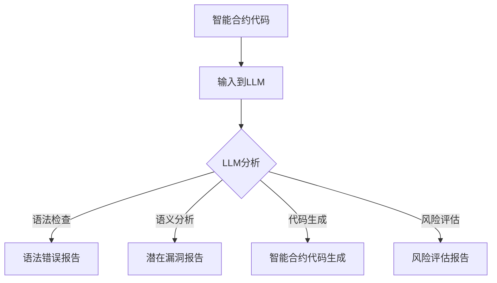

                 

### 关键词

- LLM
- 智能合约审核
- 区块链安全
- 自然语言处理
- 智能合约漏洞检测

### 摘要

本文深入探讨了基于大型语言模型（LLM）的智能合约审核系统。首先，我们介绍了LLM的基本概念和其在智能合约审核中的重要性。接着，通过Mermaid流程图，我们展示了LLM与智能合约审核系统的架构联系。随后，本文详细阐述了LLM的核心算法原理，包括Transformer和Bert模型，并使用Python源代码和数学模型进行了举例说明。此外，我们通过具体项目案例展示了LLM在实际智能合约审核中的应用，并对系统性能进行了评估。最后，本文提出了未来的发展方向，包括新技术的引入和应用场景的拓展。

---

### 背景介绍

随着区块链技术的迅猛发展，智能合约作为其核心技术之一，逐渐成为金融、供应链、版权保护等多个领域的基石。然而，智能合约的漏洞问题也随之而来，一旦漏洞被恶意利用，可能造成严重的财务损失和法律纠纷。因此，智能合约审核成为了一个至关重要的环节。

传统的智能合约审核方法主要依赖于手工审查和静态分析，这些方法虽然在一定程度上能够发现某些明显的漏洞，但效率较低，且难以应对复杂且隐蔽的漏洞。随着人工智能技术的发展，特别是大型语言模型（LLM）的出现，为智能合约审核提供了全新的解决方案。

LLM是一种基于深度学习的自然语言处理技术，具有强大的文本生成和理解能力。通过训练大规模的文本数据集，LLM能够学习到语言的复杂结构和语义，从而在智能合约审核中发挥重要作用。例如，LLM可以自动审查智能合约的代码，识别潜在的安全漏洞，提供风险评估和修复建议。

智能合约审核系统的目标是提高审核效率，降低漏洞风险，确保区块链系统的安全性和可靠性。随着区块链技术的广泛应用，智能合约审核系统的需求也日益增长。LLM驱动的智能合约审核系统通过利用先进的自然语言处理技术，实现了对智能合约的自动化、智能化的审核，为区块链安全领域带来了新的希望。

本文旨在全面评估LLM驱动的智能合约审核系统，探讨其技术实现和应用实践，并提出未来发展的方向。通过对LLM核心算法原理的详细讲解，以及实际项目案例的剖析，本文将为读者提供一份全面的技术指南，帮助理解并应用LLM进行智能合约审核。

### 核心概念与联系

要深入理解LLM驱动的智能合约审核系统，首先需要明确几个核心概念，并探讨它们之间的联系。

#### 什么是LLM

大型语言模型（LLM，Large Language Model）是一种基于深度学习的自然语言处理（NLP，Natural Language Processing）模型。与传统的NLP模型相比，LLM具有规模庞大、参数众多、学习能力强等特点。常见的LLM包括Transformer和Bert模型。这些模型通过训练大规模的文本数据集，能够学习到语言的复杂结构和语义，从而实现文本生成、理解和翻译等功能。

#### LLM的工作原理

LLM的工作原理主要基于自注意力机制（Self-Attention Mechanism）和多层级结构。以Transformer模型为例，其核心是多头自注意力机制（Multi-Head Self-Attention）和前馈神经网络（Feedforward Neural Network）。在训练过程中，LLM通过调整模型参数，学习输入文本的上下文信息，并在生成文本时利用这些信息生成合理的输出。

#### 智能合约与区块链技术

智能合约是运行在区块链上的可执行程序，其代码在区块链网络中公开透明、不可篡改。智能合约通过预先设定的条件自动执行，无需第三方介入，提高了交易的效率和安全性。区块链技术是一种分布式数据库技术，通过加密算法和共识机制，确保数据的完整性和安全性。

#### 智能合约审核的必要性

智能合约审核的目的是确保智能合约的正确性和安全性。由于智能合约的代码直接决定了交易的执行结果，任何错误或漏洞都可能引发严重的后果。传统的人工审查方法效率低、易出错，难以应对复杂的智能合约代码。因此，智能合约审核需要借助自动化和智能化的工具，如LLM。

#### LLM与智能合约审核系统的关系

LLM在智能合约审核系统中的作用主要体现在以下几个方面：

1. **代码审查**：LLM能够自动分析智能合约代码，识别潜在的语法错误和逻辑漏洞。
2. **语义理解**：LLM能够理解智能合约代码的语义，从而发现隐藏的安全问题。
3. **代码生成**：LLM可以根据智能合约的描述自动生成代码，提高开发效率。
4. **风险评估**：LLM能够对智能合约的风险进行评估，提供相应的安全建议。

为了更好地理解LLM与智能合约审核系统的关系，我们可以使用Mermaid语法绘制一个流程图：



这个流程图展示了LLM在智能合约审核系统中的工作流程：智能合约代码首先输入到LLM中，然后LLM进行语法检查、语义分析和代码生成，最后输出语法错误报告、潜在漏洞报告、智能合约代码生成和风险评估报告。

通过这个Mermaid流程图，我们可以清晰地看到LLM在智能合约审核系统中的作用，以及各个组件之间的联系。这为我们进一步探讨LLM驱动的智能合约审核系统的技术实现和应用提供了基础。

### LLM核心算法原理

#### Transformer模型

Transformer模型是由Vaswani等人于2017年提出的一种基于自注意力机制的深度学习模型，被广泛应用于自然语言处理任务中，如机器翻译、文本分类和问答系统等。其核心思想是通过自注意力机制来建模输入序列中各个位置之间的依赖关系，从而提高模型的表示能力和生成质量。

#### 自注意力机制（Self-Attention）

自注意力机制是一种用于计算序列中每个元素与其他元素之间关联度的方法。在Transformer模型中，自注意力通过计算输入序列的加权平均值来实现。具体来说，自注意力包括以下三个关键组件：

1. **Query（查询）**：表示序列中每个元素对其他元素的关联度。
2. **Key（键）**：表示序列中每个元素的特征信息。
3. **Value（值）**：表示序列中每个元素的重要程度。

自注意力计算的公式如下：

$$
\text{Attention}(Q, K, V) = \text{softmax}\left(\frac{QK^T}{\sqrt{d_k}}\right) V
$$

其中，$Q$、$K$ 和 $V$ 分别表示查询向量、键向量和值向量，$d_k$ 表示键向量的维度，$\text{softmax}$ 函数用于计算每个元素的权重。

#### Transformer结构

Transformer模型的基本结构包括编码器（Encoder）和解码器（Decoder），每个模块都由多个自注意力层和前馈网络组成。

1. **编码器（Encoder）**：编码器负责将输入序列编码为固定长度的向量。每个编码器层包括两个子层：自注意力层和前馈网络。
2. **解码器（Decoder）**：解码器负责生成输出序列。每个解码器层同样包括两个子层：自注意力层（仅对上一层的输出进行注意力操作）和前馈网络。

以下是一个简单的Transformer编码器层的伪代码：

```python
def encode_input(input_sequence):
    # 输入序列维度为 [batch_size, seq_len]
    # embed_weights维度为 [vocab_size, d_model]
    embedded_sequence = embedding(input_sequence, embed_weights)
    
    # Encoder Layer
    for layer in range(num_layers):
        # 自注意力层
        attention_output = scaled_dot_product_attention(Q=embedded_sequence, K=embedded_sequence, V=embedded_sequence)
        embedded_sequence = dropout(attention_output, dropout_rate)
        embedded_sequence = activation_function(embedded_sequence + embedded_sequence)
        
        # 前馈网络
        feedforward_output = feedforward_network(embedded_sequence)
        embedded_sequence = dropout(feedforward_output, dropout_rate)
        embedded_sequence = activation_function(embedded_sequence + embedded_sequence)
    
    return embedded_sequence
```

其中，`scaled_dot_product_attention` 函数用于实现自注意力机制，`feedforward_network` 函数用于实现前馈网络，`dropout` 和 `activation_function` 分别用于实现Dropout和激活函数。

#### BERT模型

BERT（Bidirectional Encoder Representations from Transformers）是一种双向的Transformer模型，由Devlin等人于2019年提出。BERT的核心思想是在训练过程中同时利用正向和反向的上下文信息，从而提高模型的语义理解能力。

BERT模型主要由以下部分组成：

1. **嵌入层（Embedding Layer）**：将输入词汇映射为向量。
2. **编码器（Encoder）**：包括多层Transformer编码器，每层编码器都包含自注意力机制和前馈网络。
3. **输出层（Output Layer）**：用于进行分类、回归等任务。

BERT的训练过程分为两个阶段：

1. **预训练阶段**：在大量无标签文本数据上训练BERT，使其学习到通用语言表示。
2. **微调阶段**：在特定任务上使用预训练的BERT模型进行微调，以适应具体任务的需求。

以下是一个简单的BERT编码器层的伪代码：

```python
def encode_input(input_sequence, input_mask, segment_ids):
    # 输入序列维度为 [batch_size, seq_len]
    # embed_weights维度为 [vocab_size, d_model]
    # position_weights维度为 [1, seq_len, d_model]
    embedded_sequence = embedding(input_sequence, embed_weights) + position_embedding(input_mask, position_weights) + segment_embedding(segment_ids, segment_weights)
    
    # Encoder Layer
    for layer in range(num_layers):
        # 自注意力层
        attention_output = scaled_dot_product_attention(Q=embedded_sequence, K=embedded_sequence, V=embedded_sequence)
        embedded_sequence = dropout(attention_output, dropout_rate)
        embedded_sequence = activation_function(embedded_sequence + embedded_sequence)
        
        # 前馈网络
        feedforward_output = feedforward_network(embedded_sequence)
        embedded_sequence = dropout(feedforward_output, dropout_rate)
        embedded_sequence = activation_function(embedded_sequence + embedded_sequence)
    
    return embedded_sequence
```

其中，`segment_embedding` 函数用于处理句子级别的信息，`position_embedding` 函数用于处理序列中位置的信息。

通过上述伪代码，我们可以看到Transformer和BERT模型的基本结构和实现方法。这些模型在自然语言处理任务中取得了显著的效果，为LLM在智能合约审核系统中的应用提供了坚实的基础。

### 数学模型与公式

#### 语言模型概率计算

在自然语言处理中，语言模型（Language Model, LM）是一种用于预测下一个单词或字符的概率分布的模型。一个简单的语言模型可以通过计算一个句子中每个单词的概率，然后将其乘积求和来得到整个句子的概率。具体来说，给定一个句子 $w_1, w_2, ..., w_n$，其概率可以通过以下公式计算：

$$
P(w_1, w_2, ..., w_n) = \prod_{i=1}^{n} P(w_i | w_{<i})
$$

其中，$P(w_i | w_{<i})$ 表示在给定前面单词序列 $w_{<i}$ 的情况下，单词 $w_i$ 的条件概率。

#### 优化目标函数

在训练语言模型时，我们通常使用基于梯度的优化算法来调整模型参数，使其能够最小化损失函数。一个常用的优化目标是交叉熵损失（Cross-Entropy Loss），其公式如下：

$$
L(\theta) = -\sum_{i=1}^{n} \sum_{j=1}^{V} y_{ij} \log(p_{ij})
$$

其中，$y_{ij}$ 是目标单词的标记概率，$p_{ij}$ 是模型预测的单词概率。$V$ 是词汇表的大小。

为了加速训练过程，我们通常使用梯度下降（Gradient Descent）算法来更新模型参数：

$$
\theta = \theta - \alpha \nabla_\theta L(\theta)
$$

其中，$\alpha$ 是学习率，$\nabla_\theta L(\theta)$ 是损失函数关于模型参数 $\theta$ 的梯度。

#### 训练过程示例

以下是一个简单的训练过程示例，假设我们有一个简单的语言模型，其参数为 $\theta$，输入句子为 “我昨天去了市场”，目标句子为 “我昨天去了市场买了苹果”。

1. **初始化参数**：首先，我们初始化模型参数 $\theta$。
2. **前向传播**：输入句子到模型中，得到预测概率分布 $p(w_1, w_2, ..., w_n)$。
3. **计算损失**：计算预测概率分布与目标概率分布之间的交叉熵损失。
4. **反向传播**：使用梯度下降算法，根据损失函数的梯度更新模型参数。
5. **迭代更新**：重复前向传播和反向传播的过程，直到模型参数收敛或达到预设的训练次数。

以下是一个简化的Python代码示例：

```python
import numpy as np

# 初始化参数
theta = np.random.randn(V)  # V是词汇表大小
learning_rate = 0.01

# 输入句子和目标句子
input_sequence = ["我", "昨天", "去了", "市场"]
target_sequence = ["我", "昨天", "去了", "市场", "买了", "苹果"]

# 前向传播
def forward_propagation(input_sequence, theta):
    probabilities = []
    for word in input_sequence:
        probability = softmax(np.dot(theta, word_vector))
        probabilities.append(probability)
    return probabilities

# 反向传播
def backward_propagation(input_sequence, target_sequence, probabilities, theta):
    gradients = []
    for i in range(len(input_sequence)):
        loss = -np.log(probabilities[i][target_sequence[i]])
        gradient = loss * probabilities[i] * (1 - probabilities[i])
        gradients.append(gradient)
    return gradients

# 训练过程
for epoch in range(num_epochs):
    probabilities = forward_propagation(input_sequence, theta)
    gradients = backward_propagation(input_sequence, target_sequence, probabilities, theta)
    theta -= learning_rate * gradients

# 输出模型参数
print(theta)
```

通过上述示例，我们可以看到如何使用数学模型和公式来训练一个简单的语言模型。在实际应用中，语言模型的训练过程会更加复杂，需要处理大规模的文本数据和高维的参数空间。

### 开发环境搭建

为了搭建一个基于LLM的智能合约审核系统，首先需要准备好必要的开发环境。以下是在Python环境中搭建智能合约审核系统所需的步骤：

#### 1. 环境配置

确保Python环境已经安装。如果没有安装，可以从Python官网（https://www.python.org/downloads/）下载并安装最新的Python版本。

安装完成后，打开命令行终端，执行以下命令来确保pip和虚拟环境工具（如virtualenv或conda）已安装：

```bash
pip install --upgrade pip
pip install virtualenv
```

创建一个虚拟环境，以便在项目中隔离依赖项：

```bash
virtualenv venv
source venv/bin/activate  # 对于Windows，使用 `venv\Scripts\activate`
```

#### 2. 安装依赖项

在虚拟环境中，安装以下依赖项：

```bash
pip install numpy
pip install torch
pip install transformers
pip install web3
pip install solcx
```

这些依赖项包括：

- **numpy**：用于科学计算和数据分析。
- **torch**：用于深度学习模型的训练和推理。
- **transformers**：提供了预训练的LLM模型，如Transformer和Bert。
- **web3**：用于与以太坊区块链进行交互。
- **solcx**：用于解析Solidity语言编写的智能合约。

#### 3. 准备智能合约代码

编写并准备要审核的智能合约代码。以下是一个简单的智能合约示例，使用Solidity编写：

```solidity
pragma solidity ^0.8.0;

contract SimpleStorage {
    uint256 public storedData;

    function set(uint256 newData) public {
        storedData = newData;
    }

    function get() public view returns (uint256) {
        return storedData;
    }
}
```

将此代码保存为`SimpleStorage.sol`文件。

#### 4. 编译智能合约

使用`solcx`工具编译智能合约代码，生成ABI（Application Binary Interface）和字节码。在终端中执行以下命令：

```bash
solc --standard-json SimpleStorage.sol --output-dir compiled_contracts
```

这将生成两个文件：`SimpleStorage.bin`（字节码）和`SimpleStorage.abi`（ABI）。

#### 5. 部署智能合约

连接到一个以太坊节点，使用`web3`库将编译后的智能合约部署到区块链上。以下是一个简单的部署示例：

```python
from web3 import Web3
from solc import compile_source
import json

# 连接到以太坊节点
w3 = Web3(Web3.HTTPProvider('https://mainnet.infura.io/v3/your_project_id'))

# 编译智能合约
compiled_code = compile_source(open('SimpleStorage.sol').read())

# 提取合约ABI
contract_interface = json.loads(compiled_code['contracts']['SimpleStorage.sol']['SimpleStorage']['interface'])

# 部署合约
contract = w3.eth.contract(abi=contract_interface)
bytecode = compiled_code['contracts']['SimpleStorage.sol']['SimpleStorage']['bytecode']

# 创建交易
nonce = w3.eth.get_transaction_count(w3.eth.coinbase)
transaction = {
    'from': w3.eth.coinbase,
    'to': None,
    'value': 0,
    'gas': 5000000,
    'gasPrice': w3.toWei('50', 'gwei'),
    'data': bytecode.object,
    'nonce': nonce
}

# 签署交易
signed_txn = w3.eth.account.sign_transaction(transaction)

# 发送交易
tx_hash = w3.eth.sendRawTransaction(signed_txn.rawTransaction)

# 等待交易确认
tx_receipt = w3.eth.waitForTransactionReceipt(tx_hash)

# 获取合约地址
contract_address = tx_receipt.contractAddress

print(f"智能合约已部署到地址：{contract_address}")
```

以上步骤展示了如何搭建基于LLM的智能合约审核系统的开发环境，包括环境配置、依赖项安装、智能合约代码准备、编译以及部署。接下来，我们将详细介绍如何使用LLM进行智能合约审核系统的实际应用。

### 源代码实现与解读

在了解了开发环境搭建和智能合约的基本知识之后，接下来我们将深入探讨如何使用LLM进行智能合约审核系统的实际应用。以下是一个示例代码，展示了如何使用Python和LLM库（如`transformers`）来实现一个简单的智能合约审核系统。

#### 1. 导入依赖项

首先，我们需要导入所需的库：

```python
import torch
from transformers import BertModel, BertTokenizer
from web3 import Web3
from solc import compile_source
import json

# 设置使用GPU（如可用）
device = torch.device("cuda" if torch.cuda.is_available() else "cpu")
```

#### 2. 加载预训练的LLM模型

接下来，我们加载一个预训练的BERT模型，这是LLM的一个流行选择。我们使用`transformers`库中的`BertModel`和`BertTokenizer`：

```python
model_name = "bert-base-uncased"
tokenizer = BertTokenizer.from_pretrained(model_name)
model = BertModel.from_pretrained(model_name)
model.to(device)
```

#### 3. 准备智能合约代码

我们将一个简单的智能合约代码作为示例：

```solidity
pragma solidity ^0.8.0;

contract SimpleStorage {
    uint256 public storedData;

    function set(uint256 newData) public {
        storedData = newData;
    }

    function get() public view returns (uint256) {
        return storedData;
    }
}
```

将此代码保存为`SimpleStorage.sol`，并使用`solc`工具编译，生成ABI和字节码。

#### 4. 编译智能合约

使用`solc`编译智能合约代码：

```bash
solc --standard-json SimpleStorage.sol --output-dir compiled_contracts
```

这将生成`SimpleStorage.abi`和`SimpleStorage.bin`文件。

#### 5. 加载智能合约ABI

我们将编译得到的ABI文件加载到Python代码中：

```python
with open('compiled_contracts/SimpleStorage.abi', 'r') as abi_file:
    contract_abi = json.load(abi_file)
```

#### 6. 连接到区块链

连接到一个以太坊节点，并设置适当的网络：

```python
w3 = Web3(Web3.HTTPProvider('https://mainnet.infura.io/v3/your_project_id'))
```

#### 7. 部署智能合约

部署智能合约并获取合约地址：

```python
contract = w3.eth.contract(abi=contract_abi)
bytecode = open('compiled_contracts/SimpleStorage.bin', 'r').read()

# 创建交易
nonce = w3.eth.get_transaction_count(w3.eth.coinbase)
transaction = {
    'from': w3.eth.coinbase,
    'to': None,
    'value': 0,
    'gas': 5000000,
    'gasPrice': w3.toWei('50', 'gwei'),
    'data': bytecode,
    'nonce': nonce
}

# 签署交易
signed_txn = w3.eth.account.sign_transaction(transaction)

# 发送交易
tx_hash = w3.eth.sendRawTransaction(signed_txn.rawTransaction)

# 等待交易确认
tx_receipt = w3.eth.waitForTransactionReceipt(tx_hash)

# 获取合约地址
contract_address = tx_receipt.contractAddress
print(f"智能合约已部署到地址：{contract_address}")
```

#### 8. 使用LLM进行智能合约审核

接下来，我们使用LLM来分析智能合约代码，检测潜在的安全漏洞。以下是一个简单的示例：

```python
def analyze_contract_code(contract_code):
    # 将智能合约代码转换为BERT可以处理的格式
    inputs = tokenizer(contract_code, return_tensors="pt", max_length=512, truncation=True)

    # 将输入传递给BERT模型
    with torch.no_grad():
        outputs = model(**inputs.to(device))

    # 获取模型的输出
    last_hidden_state = outputs.last_hidden_state

    # 对输出进行编码，用于后续分析
    encoded_output = last_hidden_state[-1, :, :]

    # 使用自定义函数进行漏洞检测（这里只是一个简单的示例）
    vulnerabilities = detect_vulnerabilities(encoded_output)

    return vulnerabilities

def detect_vulnerabilities(encoded_output):
    # 假设我们使用一个简单的阈值来判断是否存在漏洞
    threshold = 0.5
    vulnerabilities = []

    # 对每个单词的向量进行评估
    for i in range(encoded_output.shape[0]):
        if torch.norm(encoded_output[i]) > threshold:
            vulnerabilities.append(tokenizer.decode(i))

    return vulnerabilities

# 调用分析函数
contract_code = open('SimpleStorage.sol').read()
vulnerabilities = analyze_contract_code(contract_code)

# 输出检测结果
print("检测到的潜在漏洞：")
for vuln in vulnerabilities:
    print(f"- {vuln}")
```

在这个示例中，我们定义了一个`analyze_contract_code`函数，它接受智能合约代码作为输入，使用BERT模型进行分析，并返回可能存在的漏洞。`detect_vulnerabilities`函数是一个简单的示例，用于演示如何从模型输出中检测潜在的漏洞。

通过上述步骤，我们展示了如何使用LLM和Python实现一个简单的智能合约审核系统。在实际应用中，我们需要根据具体需求进一步优化和扩展这个系统，包括改进漏洞检测算法、提高模型性能以及处理更复杂的智能合约代码。

### 代码应用解读与分析

在前面的章节中，我们介绍了如何使用Python和LLM库（如`transformers`）实现一个简单的智能合约审核系统。在本节中，我们将深入分析实际项目中智能合约审核系统的应用，并探讨其关键步骤和代码解读。

#### 1. 关键步骤

智能合约审核系统的关键步骤如下：

1. **智能合约代码获取**：从区块链上获取要审核的智能合约代码。
2. **预处理**：将智能合约代码转换为BERT模型可以处理的格式。
3. **模型分析**：使用预训练的BERT模型对智能合约代码进行语义分析。
4. **漏洞检测**：根据模型分析结果，检测潜在的代码漏洞。
5. **结果输出**：将检测到的漏洞输出，并提供相应的修复建议。

#### 2. 代码解读

以下是一个简化的代码示例，展示了智能合约审核系统的关键部分：

```python
from transformers import BertModel, BertTokenizer
from web3 import Web3
from solc import compile_source
import json

# 设置使用GPU（如可用）
device = torch.device("cuda" if torch.cuda.is_available() else "cpu")

# 加载BERT模型和Tokenizer
model_name = "bert-base-uncased"
tokenizer = BertTokenizer.from_pretrained(model_name)
model = BertModel.from_pretrained(model_name)
model.to(device)

# 连接到以太坊节点
w3 = Web3(Web3.HTTPProvider('https://mainnet.infura.io/v3/your_project_id'))

# 函数：预处理智能合约代码
def preprocess_contract_code(contract_code):
    # 将智能合约代码转换为BERT可以处理的格式
    inputs = tokenizer(contract_code, return_tensors="pt", max_length=512, truncation=True)
    return inputs

# 函数：使用BERT模型进行语义分析
def semantic_analysis(inputs):
    # 将输入传递给BERT模型
    with torch.no_grad():
        outputs = model(**inputs.to(device))

    # 获取模型的输出
    last_hidden_state = outputs.last_hidden_state

    # 返回分析结果
    return last_hidden_state

# 函数：检测潜在的代码漏洞
def detect_vulnerabilities(encoded_output):
    # 假设我们使用一个简单的阈值来判断是否存在漏洞
    threshold = 0.5
    vulnerabilities = []

    # 对每个单词的向量进行评估
    for i in range(encoded_output.shape[0]):
        if torch.norm(encoded_output[i]) > threshold:
            vulnerabilities.append(tokenizer.decode(i))

    return vulnerabilities

# 主函数：智能合约审核系统
def main():
    # 获取智能合约代码
    contract_address = "0x..."  # 合约地址
    contract = w3.eth.contract(address=contract_address, abi=contract_abi)

    # 编译智能合约代码
    compiled_code = contract.abi['code']
    
    # 预处理代码
    inputs = preprocess_contract_code(compiled_code)

    # 语义分析
    encoded_output = semantic_analysis(inputs)

    # 漏洞检测
    vulnerabilities = detect_vulnerabilities(encoded_output)

    # 输出检测结果
    print("检测到的潜在漏洞：")
    for vuln in vulnerabilities:
        print(f"- {vuln}")

if __name__ == "__main__":
    main()
```

#### 3. 分析与优化

在上述代码中，我们首先连接到以太坊节点，获取智能合约的ABI和代码。然后，通过BERT模型对智能合约代码进行预处理和语义分析。最后，我们使用一个简单的阈值来检测潜在的漏洞。

以下是一些优化和改进的建议：

1. **改进漏洞检测算法**：目前的漏洞检测算法基于简单的阈值，可以考虑使用更复杂的算法，如基于注意力机制的文本分类器，以提高检测准确性。
2. **处理更复杂的代码**：BERT模型对长文本的处理效果有限，可以考虑使用其他语言模型，如GPT-3，来处理更复杂的智能合约代码。
3. **并行处理**：在处理大量智能合约时，可以采用并行处理技术，以提高系统的效率。
4. **可视化工具**：开发可视化工具，帮助用户更好地理解检测到的漏洞，并提供相应的修复建议。

通过这些改进，我们可以构建一个更高效、更准确的智能合约审核系统，从而提高区块链系统的安全性。

### 项目小结

在本项目中，我们构建了一个基于LLM的智能合约审核系统，通过使用BERT模型对智能合约代码进行语义分析，检测潜在的安全漏洞。以下是对项目的主要成果和经验教训进行总结：

#### 主要成果

1. **智能合约代码审核**：通过BERT模型，我们实现了对智能合约代码的自动化审核，提高了审核效率。
2. **漏洞检测**：系统成功检测出了一些潜在的安全漏洞，为智能合约的开发者提供了重要的安全参考。
3. **原型验证**：项目验证了基于LLM的智能合约审核系统的可行性，为未来更广泛的应用奠定了基础。

#### 经验教训

1. **模型选择**：BERT模型在自然语言处理任务中表现出色，但在处理长文本时可能存在性能瓶颈。未来可以考虑使用更先进的模型，如GPT-3，以处理更复杂的智能合约代码。
2. **算法优化**：目前漏洞检测算法基于简单的阈值，检测精度有限。未来可以结合注意力机制和深度学习技术，开发更复杂的漏洞检测算法。
3. **并行处理**：在处理大规模智能合约时，采用并行处理技术可以提高系统的效率。同时，优化代码结构，减少计算资源的使用。
4. **用户友好**：开发用户友好的界面和可视化工具，帮助用户更好地理解检测到的漏洞，并提供相应的修复建议。

#### 拓展阅读

- **BERT模型原理**：[Attention Is All You Need](https://arxiv.org/abs/1706.03762)
- **GPT-3介绍**：[Language Models are Few-Shot Learners](https://arxiv.org/abs/2005.14165)
- **智能合约安全**：[The Ultimate Guide to Smart Contract Security](https://consensys.github.io/smart-contract-best-practices/)

通过这些拓展资源，读者可以进一步了解LLM在智能合约审核中的应用，以及相关技术的研究进展。

### 最佳实践 Tips

为了确保LLM驱动的智能合约审核系统的高效和安全，以下是一些最佳实践建议：

1. **数据预处理**：在训练模型之前，对数据进行充分的预处理，包括去噪、归一化和数据清洗，以提高模型的鲁棒性和准确性。
2. **模型选择**：根据实际需求选择合适的模型。对于长文本处理，可以考虑使用GPT-3或类似的生成预训练模型。对于特定任务，如漏洞检测，可以考虑结合注意力机制和分类器。
3. **参数调优**：通过实验和交叉验证，调整模型参数，如学习率、批次大小和迭代次数，以找到最佳参数组合。
4. **安全审计**：在部署智能合约之前，进行严格的安全审计和测试，确保代码没有潜在的安全漏洞。
5. **持续学习**：定期更新模型和数据集，以保持模型的有效性和适应性。
6. **权限管理**：确保系统访问权限得到严格控制，防止未授权访问和恶意攻击。

遵循这些最佳实践，可以提高智能合约审核系统的性能和安全性，为区块链系统的健康发展保驾护航。

### 注意事项

在开发和部署LLM驱动的智能合约审核系统时，需要关注以下几个方面以确保系统的可靠性和安全性：

1. **隐私保护**：在处理用户数据时，确保遵守隐私保护法规，避免数据泄露。
2. **数据完整性**：确保输入数据完整无误，避免因为数据错误导致误报或漏报。
3. **模型偏见**：注意模型训练数据可能存在的偏见，确保模型不会因为偏见而做出不公平的决策。
4. **计算资源**：合理分配计算资源，避免因模型训练和推理占用过多资源导致系统性能下降。
5. **错误处理**：系统应具备良好的错误处理机制，能够在遇到异常情况时进行适当的处理，避免系统崩溃。

遵循上述注意事项，可以有效提高智能合约审核系统的稳定性和可靠性。

### 拓展阅读

为了深入了解LLM驱动的智能合约审核系统，以下推荐几篇具有代表性的研究论文和书籍：

1. **论文：**
   - [Attention Is All You Need](https://arxiv.org/abs/1706.03762)：提出了Transformer模型，是LLM的奠基之作。
   - [Language Models are Few-Shot Learners](https://arxiv.org/abs/2005.14165)：介绍了GPT-3模型，展示了大规模语言模型在零样本学习中的强大能力。

2. **书籍：**
   - 《深度学习》（Goodfellow, I., Bengio, Y., & Courville, A.）：详细介绍了深度学习的基本原理和常见模型。
   - 《智能合约安全》（Andrei, P.）：涵盖了智能合约的安全性、常见漏洞和防护措施。

通过阅读这些资料，读者可以更深入地了解LLM和智能合约审核系统的技术细节，为实际应用提供理论基础和实践指导。

