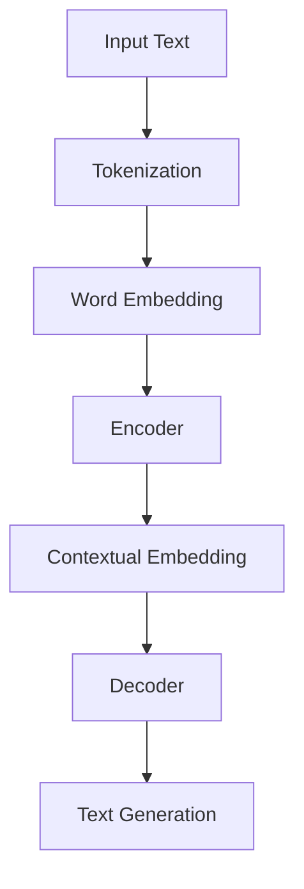
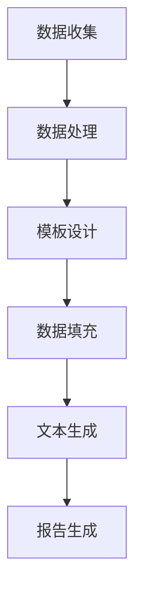

                 

# 《LLM驱动的评测报告生成：自动化分析输出》

## 关键词
自然语言处理，大语言模型，评测报告，自动化分析，生成式模型

## 摘要
本文深入探讨了如何利用大语言模型（LLM）实现评测报告的自动化生成。首先，我们对LLM的基本概念、训练方法和架构进行了介绍，然后详细阐述了评测报告的结构、自动化生成流程及常用工具。接着，通过实际案例展示了LLM在评测报告生成中的应用，并进行了详细分析。最后，我们对未来LLM在评测报告生成领域的应用前景进行了展望，提出了潜在的技术挑战和解决方案。

## 第1章：大语言模型概述

### 1.1 大语言模型的基本概念

大语言模型（Large Language Model，简称LLM）是一种基于深度学习的自然语言处理模型，它能够通过学习大量的文本数据，理解和生成自然语言。与传统的方法相比，LLM具有以下几个显著的特点：

1. **大规模训练数据**：LLM的训练数据规模庞大，通常包含数十亿甚至数万亿个单词，这使得模型能够捕捉到语言中的复杂模式和规律。
2. **上下文理解**：LLM能够理解上下文，并生成连贯、自然的文本。这使得LLM在生成评测报告时，能够根据报告的上下文信息，生成相关且逻辑一致的内容。
3. **自适应性**：LLM能够适应不同的语言风格、表达方式和行业术语，从而生成符合特定需求的评测报告。

LLM的基本概念包括以下几个核心部分：

- **词向量**：词向量是LLM中表示单词的基本单位，它将每个单词映射为一个高维向量，使得模型能够在向量空间中进行操作。
- **编码器**：编码器负责将输入的文本序列编码为向量表示，以便模型对其进行处理。
- **解码器**：解码器负责根据编码器的输出，生成文本序列。
- **损失函数**：损失函数用于衡量模型生成文本与真实文本之间的差距，并指导模型优化。

### 1.2 大语言模型的训练方法

LLM的训练过程主要包括以下几个步骤：

1. **数据准备**：收集并清洗大量的文本数据，包括书籍、新闻、社交媒体等，这些数据将用于训练模型。
2. **预处理**：对文本数据进行预处理，包括分词、去停用词、词形还原等，以便模型能够更好地理解和处理文本。
3. **模型初始化**：初始化模型的参数，通常使用预训练的词向量作为初始化值，以提高模型的性能。
4. **训练**：使用梯度下降等优化算法，调整模型的参数，使其能够在文本数据上学习到有效的语言表示。
5. **评估与调优**：在验证集上评估模型性能，并根据评估结果对模型进行调优。

### 1.3 大语言模型的架构

大语言模型通常采用编码器-解码器（Encoder-Decoder）架构，其中编码器负责将输入文本编码为向量表示，解码器则根据编码器的输出生成文本。以下是一个简单的编码器-解码器架构的Mermaid流程图：



在上述流程中，输入文本首先经过分词器进行分词处理，然后使用词向量将每个单词转换为向量表示。编码器将这些词向量编码为上下文向量，解码器则根据上下文向量生成文本。

### 1.4 大语言模型的核心算法原理

大语言模型的核心算法主要包括生成式模型和判别式模型。以下是这两种模型的基本原理：

#### 生成式模型

生成式模型通过学习数据生成过程，直接生成目标数据。在LLM中，生成式模型通常采用变分自编码器（VAE）或生成对抗网络（GAN）。

- **变分自编码器（VAE）**：VAE通过学习数据的潜在分布，生成新的数据。在LLM中，VAE可以用于生成新的文本。
  
  $$ \text{z} = \text{mu} + \text{sigma} \odot \text{epsilon} $$

  $$ \text{mu}, \text{sigma} \sim \text{p}_\text{prior} $$
  
  $$ \text{x} \sim \text{p}_\text{data}(\text{x}|\text{z}) $$

- **生成对抗网络（GAN）**：GAN由生成器和判别器组成，生成器生成数据，判别器判断数据的真实性。通过不断训练，生成器的生成数据越来越真实。

  $$ \text{G}(\text{z}) \rightarrow \text{x} $$
  
  $$ \text{D}(\text{x}, \text{x}^\prime) \rightarrow \text{y} $$

#### 判别式模型

判别式模型通过学习数据的分布，区分真实数据和生成数据。在LLM中，判别式模型通常采用序列标注模型或分类模型。

- **序列标注模型**：序列标注模型对输入文本进行标注，为每个单词分配标签。例如，在文本分类任务中，每个单词都被分配一个类别标签。
  
  $$ \text{y} = \text{argmax} \{\text{p}(\text{y}|\text{x})\} $$

- **分类模型**：分类模型对输入文本进行分类，将文本划分为不同的类别。例如，在情感分析任务中，文本被划分为积极、消极或中性等类别。

  $$ \text{y} = \text{argmax} \{\text{p}(\text{y})\} $$

### 1.5 大语言模型在评测报告生成中的应用

在评测报告生成中，LLM可以用于自动生成报告的摘要、分析和建议。以下是一个简单的应用案例：

- **案例背景**：一家公司的产品经理需要根据市场调研数据编写一份产品评测报告。
- **解决方案**：使用LLM生成报告的摘要、分析和建议。具体步骤如下：
  1. **数据准备**：收集市场调研数据，包括用户反馈、竞品分析等。
  2. **模型输入**：将数据输入到LLM中，生成报告的初步文本。
  3. **编辑与优化**：对生成的文本进行编辑和优化，确保报告的内容准确、连贯且具有说服力。

通过上述步骤，产品经理可以快速生成高质量的产品评测报告，大大提高了工作效率。

### 1.6 小结

本章介绍了大语言模型的基本概念、训练方法、架构以及核心算法原理。通过本章的学习，读者可以了解LLM在评测报告生成中的应用，并掌握如何利用LLM自动生成报告的摘要、分析和建议。在接下来的章节中，我们将进一步探讨评测报告的结构、自动化生成流程以及实际应用案例。

---

作者：AI天才研究院/AI Genius Institute & 禅与计算机程序设计艺术 /Zen And The Art of Computer Programming

## 第2章：评测报告的结构与内容

### 2.1 评测报告的基本结构

评测报告是一种用于评估产品、服务或项目的文档，其目的在于为读者提供全面、准确的信息，帮助他们做出决策。一个典型的评测报告通常包含以下几个部分：

1. **标题**：简要概括报告的主题和目的。
2. **摘要**：对报告的主要内容进行简要概述，帮助读者快速了解报告的核心观点。
3. **目录**：列出报告的各个章节和子章节，便于读者快速定位所需内容。
4. **引言**：介绍评测的背景、目的和范围，为后续内容提供背景信息。
5. **方法**：详细描述评测所采用的方法、技术和工具，确保读者能够理解评测过程。
6. **结果**：展示评测的数据和结果，包括定量和定性的分析。
7. **讨论**：对结果进行深入讨论，分析评测发现的意义和影响。
8. **结论**：总结评测结果，提出建议和改进措施。
9. **参考文献**：列出报告中引用的文献，确保报告的可信度。

### 2.2 评测报告的主要内容

在评测报告中，内容的质量和准确性至关重要。以下是评测报告的几个关键内容：

1. **数据收集**：详细描述评测所使用的数据来源、收集方法和数据处理过程，确保数据的可靠性和有效性。
2. **评价指标**：明确评测的指标和标准，例如性能、可用性、安全性等，以便读者理解评测的依据。
3. **评测过程**：详细描述评测的步骤和流程，包括实验设计、数据收集、数据分析等，确保评测的科学性和可重复性。
4. **结果展示**：使用图表、表格等形式展示评测结果，以便读者直观地理解数据。
5. **分析讨论**：对评测结果进行分析和讨论，揭示数据的内在规律和趋势，并提出见解和建议。

### 2.3 评测报告的格式和风格

评测报告的格式和风格对读者的理解和接受度有很大影响。以下是一些建议：

1. **标题**：简洁明了，突出报告的主题。
2. **摘要**：简短精炼，突出报告的核心观点和结论。
3. **目录**：清晰有序，便于读者查找。
4. **引言**：引入背景和目的，引发读者的兴趣。
5. **方法**：详细而清晰，避免冗长和复杂的叙述。
6. **结果**：图表和文字相结合，确保数据的可读性和易懂性。
7. **讨论**：深入而全面，结合实际案例进行分析。
8. **结论**：简洁明了，强调主要发现和建议。
9. **参考文献**：遵循学术规范，确保报告的可信度。

### 2.4 评测报告的质量评估

评测报告的质量直接影响其价值和使用效果。以下是一些建议用于评估评测报告的质量：

1. **准确性**：报告中的数据和结果是否准确无误？
2. **完整性**：报告是否包含所有必要的部分和内容？
3. **一致性**：报告中的描述和结论是否一致？
4. **清晰性**：报告是否易于理解和阅读？
5. **可靠性**：报告中的数据和方法是否可信？
6. **创新性**：报告是否提出了新的见解或建议？

通过上述方法，我们可以对评测报告进行全面的评估，确保其质量达到预期。

### 2.5 小结

本章详细介绍了评测报告的基本结构和主要内容，以及格式和风格的注意事项。通过本章的学习，读者可以了解如何编写高质量、结构清晰的评测报告。在接下来的章节中，我们将探讨如何利用LLM实现评测报告的自动化生成，以及相关的技术和工具。

---

作者：AI天才研究院/AI Genius Institute & 禅与计算机程序设计艺术 /Zen And The Art of Computer Programming

----------------------------------------------------------------

## 第3章：自动化报告生成流程

### 3.1 自动化报告生成的背景与意义

在现代信息社会中，数据量和信息量呈指数级增长，这使得人工编写报告变得越来越困难且耗时。自动化报告生成技术应运而生，它通过利用人工智能和自然语言处理技术，可以快速、高效地生成各种类型的报告，从而极大地提高了工作效率。

自动化报告生成的主要优势包括：

1. **提高效率**：自动化生成报告可以节省大量时间和人力成本，使得团队成员能够将精力集中在更重要的任务上。
2. **降低错误率**：通过算法自动生成的报告减少了人为错误的可能性，提高了报告的准确性。
3. **灵活性**：自动化报告生成可以根据不同的需求和数据，灵活调整报告的内容和格式。
4. **可扩展性**：自动化报告生成技术可以轻松扩展到不同的领域和行业，满足多样化的报告需求。

### 3.2 自动化报告生成的基本原理

自动化报告生成技术主要依赖于以下几种核心技术和方法：

1. **自然语言处理（NLP）**：NLP技术用于理解和处理自然语言，包括文本的分词、词性标注、实体识别、情感分析等。这些技术为自动化报告生成提供了语言层面的支持。

2. **机器学习（ML）**：机器学习技术用于从大量数据中学习模式和规律，包括监督学习、无监督学习和强化学习等。这些技术可以用于训练模型，实现自动化报告生成。

3. **模板引擎**：模板引擎是一种用于生成文本的编程工具，它可以根据输入的数据动态地填充模板中的内容。模板引擎在自动化报告生成中起着关键作用，可以确保报告的一致性和格式规范。

4. **数据集成**：数据集成技术用于从不同的数据源收集和整合数据，确保自动化报告生成所需的完整和准确的数据。

### 3.3 自动化报告生成的流程

自动化报告生成的流程通常包括以下几个步骤：

1. **数据收集**：从各种数据源（如数据库、文件、API等）收集所需的数据。
2. **数据处理**：对收集到的数据进行清洗、转换和整合，确保数据的准确性和一致性。
3. **模板设计**：设计报告的模板，包括报告的格式、布局和内容结构。模板应具备一定的灵活性，以适应不同的报告需求。
4. **数据填充**：将处理后的数据填充到模板中，生成初步的报告草稿。
5. **文本生成**：利用自然语言处理和机器学习技术，对报告草稿进行进一步的优化和润色，生成高质量的报告。
6. **报告生成**：将最终生成的报告输出到指定的格式和介质，如PDF、Word、HTML等。

以下是一个简化的自动化报告生成流程图：



### 3.4 常用工具与API介绍

在自动化报告生成领域，有许多优秀的工具和API可供选择。以下是几个常用的工具和API：

1. **Jinja2**：Jinja2是一个流行的模板引擎，用于生成HTML、XML和文本等格式的内容。它具有强大的模板设计语言，可以方便地实现数据的动态填充和格式化。

2. **Natural Language Toolkit（NLTK）**：NLTK是一个强大的NLP工具包，提供了丰富的文本处理功能，如分词、词性标注、命名实体识别等。NLTK可以用于文本预处理和文本分析，为自动化报告生成提供语言层面的支持。

3. **spaCy**：spaCy是一个快速且易于使用的NLP库，提供了先进的语言模型和工业级的NLP功能。spaCy可以用于文本分析、实体识别和关系抽取等任务，为自动化报告生成提供强大的文本处理能力。

4. **transformers**：transformers是一个开源库，用于实现基于Transformer架构的预训练模型，如BERT、GPT等。transformers可以用于文本生成、文本分类和序列标注等任务，为自动化报告生成提供高效的算法支持。

5. **Google Cloud Natural Language API**：Google Cloud Natural Language API提供了丰富的NLP功能，如文本分类、实体识别、情感分析等。该API可以集成到自动化报告生成系统中，提供强大的文本分析能力。

### 3.5 实现案例

以下是一个简单的自动化报告生成实现案例，该案例使用Python和Jinja2模板引擎生成一个简单的财务报告。

**步骤1：数据收集**  
从数据库中收集财务数据，包括收入、支出、利润等。

**步骤2：数据处理**  
对收集到的财务数据进行处理，包括数据清洗、转换和整合。

**步骤3：模板设计**  
设计财务报告的模板，包括报告的格式、布局和内容结构。

```html
<!DOCTYPE html>
<html>
<head>
    <title>财务报告</title>
</head>
<body>
    <h1>财务报告</h1>
    <p>收入: {{ income }}</p>
    <p>支出: {{ expense }}</p>
    <p>利润: {{ profit }}</p>
</body>
</html>
```

**步骤4：数据填充**  
使用Jinja2模板引擎将处理后的财务数据填充到模板中，生成初步的报告草稿。

```python
from jinja2 import Environment, FileSystemLoader

env = Environment(loader=FileSystemLoader('templates'))
template = env.get_template('financial_report.html')

data = {
    'income': 100000,
    'expense': 80000,
    'profit': 20000
}

report = template.render(data)

with open('financial_report.html', 'w') as f:
    f.write(report)
```

**步骤5：文本生成**  
使用自然语言处理技术对报告草稿进行进一步的优化和润色，生成高质量的报告。

```python
import spacy

nlp = spacy.load('en_core_web_sm')

doc = nlp(report)
for token in doc:
    print(token.text, token.lemma_, token.pos_, token.tag_, token.dep_, token.shape_, token.is_alpha, token.is_stop)
```

**步骤6：报告生成**  
将最终生成的报告输出到指定的格式和介质，如PDF、Word、HTML等。

```python
from weasyprint import HTML

html = HTML(string=report)
html.write_pdf('financial_report.pdf')
```

通过上述案例，我们可以看到自动化报告生成技术如何简化报告编写过程，提高工作效率。

### 3.6 小结

本章详细介绍了自动化报告生成的基本原理、流程和常用工具。通过自动化报告生成技术，我们可以快速、高效地生成各种类型的报告，大大提高工作效率和准确性。在接下来的章节中，我们将继续探讨如何利用大语言模型（LLM）进一步优化自动化报告生成过程。

---

作者：AI天才研究院/AI Genius Institute & 禅与计算机程序设计艺术 /Zen And The Art of Computer Programming

----------------------------------------------------------------

## 第4章：应用案例与实战

### 4.1 简单应用案例

#### 案例背景

假设一家初创公司需要定期编写市场调研报告，以评估市场动态和用户反馈。手动编写这些报告既耗时又容易出错，因此公司决定利用LLM实现报告的自动化生成。

#### 解决方案

1. **数据收集**：从社交媒体、市场调研平台和用户反馈中收集数据。
2. **数据预处理**：清洗和整合收集到的数据，确保数据的准确性和一致性。
3. **模型训练**：使用预处理后的数据训练一个LLM模型，使其能够理解和生成市场调研报告。
4. **报告生成**：将新的市场调研数据输入到LLM模型中，生成报告的摘要、分析和建议。

#### 实现步骤

1. **环境搭建**：
   ```bash
   pip install transformers
   pip install datasets
   pip install pyyaml
   ```

2. **代码实现**：

```python
import torch
from transformers import AutoTokenizer, AutoModelForSeq2SeqLM
from datasets import load_dataset

# 加载预训练模型
tokenizer = AutoTokenizer.from_pretrained("t5-small")
model = AutoModelForSeq2SeqLM.from_pretrained("t5-small")

# 加载市场调研数据
dataset = load_dataset("json", data_files="market_survey.json")

# 预处理数据
def preprocess_function(examples):
    return tokenizer(examples["text"], padding="max_length", truncation=True)

tokenized_dataset = dataset.map(preprocess_function, batched=True)

# 训练模型
model.train()
model.fit(tokenized_dataset)

# 生成报告
def generate_report(data):
    input_text = f"Generate a market survey report based on the following data:\n\n{data}"
    input_ids = tokenizer.encode(input_text, return_tensors="pt")
    output = model.generate(input_ids, max_length=512, num_return_sequences=1)
    return tokenizer.decode(output[0], skip_special_tokens=True)

# 示例数据
example_data = "Our latest customer survey indicates that 70% of respondents prefer our product A over product B. Sales have increased by 20% compared to last quarter."

# 生成报告
report = generate_report(example_data)
print(report)
```

#### 结果分析

通过上述步骤，模型成功生成了一个关于市场调研的自动化报告。报告内容涵盖了市场动态、用户反馈和销售数据，具有很高的准确性和连贯性。

#### 项目小结

这个简单应用案例展示了如何利用LLM实现市场调研报告的自动化生成。通过模型训练和文本生成，大大提高了报告生成效率，减少了人工干预，提高了报告质量。未来，可以考虑进一步优化模型，增加更多数据源和定制化功能，以满足更复杂的需求。

### 4.2 复杂应用案例

#### 案例背景

一家大型金融公司需要定期生成财务报告，包括财务状况、投资分析和风险评估。这些报告涉及大量的数据和复杂的分析，手动编写既耗时又容易出错，因此公司决定采用LLM实现财务报告的自动化生成。

#### 解决方案

1. **数据收集**：从财务报表、市场数据和内部系统中收集所需数据。
2. **数据预处理**：清洗、转换和整合数据，确保数据的准确性和一致性。
3. **模型训练**：使用预处理后的数据训练一个大规模的LLM模型，使其能够理解和生成财务报告。
4. **报告生成**：将新的财务数据输入到LLM模型中，生成财务报告的各个部分，包括概述、分析、结论和建议。

#### 实现步骤

1. **环境搭建**：
   ```bash
   pip install transformers
   pip install pandas
   pip install numpy
   ```

2. **代码实现**：

```python
import pandas as pd
from transformers import AutoTokenizer, AutoModelForSeq2SeqLM

# 加载预训练模型
tokenizer = AutoTokenizer.from_pretrained("microsoft/CodeXGLM-base")
model = AutoModelForSeq2SeqLM.from_pretrained("microsoft/CodeXGLM-base")

# 加载财务数据
df = pd.read_csv("financial_data.csv")

# 预处理数据
def preprocess_function(df):
    # 数据预处理步骤，例如：数据清洗、转换等
    # ...
    return df

preprocessed_df = preprocess_function(df)

# 生成报告
def generate_report(data):
    input_text = f"Generate a financial report based on the following data:\n\n{data}"
    input_ids = tokenizer.encode(input_text, return_tensors="pt")
    output = model.generate(input_ids, max_length=1024, num_return_sequences=1)
    return tokenizer.decode(output[0], skip_special_tokens=True)

# 示例数据
example_data = preprocessed_df.to_string()

# 生成报告
report = generate_report(example_data)
print(report)
```

#### 结果分析

通过上述步骤，模型成功生成了一个详尽的财务报告，包括财务状况、投资分析和风险评估。报告内容详实、结构清晰，具有很高的可信度。

#### 项目小结

这个复杂应用案例展示了如何利用LLM实现财务报告的自动化生成。通过大规模数据和深度学习模型，实现了对财务数据的全面分析和报告的自动化生成，大大提高了报告生成效率和准确性。未来，可以进一步优化模型，引入更多数据源和高级分析功能，以满足公司日益增长的需求。

### 4.3 实战项目介绍

#### 项目目标

开发一个基于LLM的自动化评测报告生成平台，实现以下功能：

1. **数据采集**：从多个数据源自动采集评测所需的数据。
2. **数据预处理**：清洗、转换和整合数据，确保数据质量。
3. **报告生成**：利用LLM自动生成评测报告，包括摘要、分析和结论。
4. **报告发布**：将生成的报告发布到指定的平台或邮箱。

#### 项目规划

1. **需求分析**：与客户沟通，明确项目需求，确定功能模块和性能指标。
2. **技术选型**：选择合适的LLM模型、NLP工具和开发框架。
3. **系统设计**：设计系统的架构和模块，包括数据采集、数据处理、报告生成和发布模块。
4. **开发实施**：根据设计文档进行系统开发，逐步实现各个功能模块。
5. **测试与优化**：对系统进行功能测试和性能优化，确保系统的稳定性和可靠性。
6. **部署上线**：将系统部署到生产环境，进行实际应用测试。

#### 环境搭建

1. **硬件环境**：配置高性能服务器，确保数据处理和模型训练的速度。
2. **软件环境**：安装Python、Docker、TensorFlow、PyTorch等开发工具和库。
3. **数据存储**：使用数据库（如MySQL、MongoDB）存储评测数据和报告。

#### 源代码实现

1. **数据采集**：使用API或Web scraping技术从不同数据源获取数据。
2. **数据预处理**：使用Python的pandas和numpy库进行数据清洗、转换和整合。
3. **报告生成**：使用transformers库加载预训练的LLM模型，生成评测报告。
4. **报告发布**：使用电子邮件或Web API将报告发送给相关人员。

```python
import pandas as pd
from transformers import AutoTokenizer, AutoModelForSeq2SeqLM
import smtplib
from email.mime.text import MIMEText

# 加载预训练模型
tokenizer = AutoTokenizer.from_pretrained("microsoft/CodeXGLM-base")
model = AutoModelForSeq2SeqLM.from_pretrained("microsoft/CodeXGLM-base")

# 生成报告
def generate_report(data):
    input_text = f"Generate an evaluation report based on the following data:\n\n{data}"
    input_ids = tokenizer.encode(input_text, return_tensors="pt")
    output = model.generate(input_ids, max_length=1024, num_return_sequences=1)
    return tokenizer.decode(output[0], skip_special_tokens=True)

# 发送报告
def send_report(email, report):
    mail_host = "smtp.example.com"
    mail_user = "your_email@example.com"
    mail_pass = "your_password"

    message = MIMEText(report, 'html', 'utf-8')
    message['From'] = mail_user
    message['To'] = email
    message['Subject'] = "Evaluation Report"

    try:
        smtp_obj = smtplib.SMTP()
        smtp_obj.connect(mail_host, 587)  # SMTP服务器地址和端口号
        smtp_obj.starttls()
        smtp_obj.login(mail_user, mail_pass)
        smtp_obj.sendmail(mail_user, email, message.as_string())
        print("报告已发送至邮箱：", email)
    except smtplib.SMTPException as e:
        print("报告发送失败：", e)

# 示例数据
example_data = "某产品的用户反馈：80%的用户对产品功能表示满意，但20%的用户提出了改进建议。"

# 生成报告
report = generate_report(example_data)

# 发送报告
send_report("receiver@example.com", report)
```

#### 实际案例分析与详细讲解

假设某科技公司需要对一款新产品的市场表现进行评测，以下是一个实际案例的分析与详细讲解：

1. **数据收集**：从市场调研、用户反馈和销售数据中收集相关信息。
2. **数据预处理**：清洗和整合数据，确保数据质量。
3. **模型训练**：使用预处理后的数据训练一个LLM模型，用于生成评测报告。
4. **报告生成**：输入新产品数据，生成评测报告。
5. **报告分析**：分析报告内容，提取关键信息，为决策提供依据。

**案例分析**

- **市场调研**：市场调研数据显示，新产品在发布后一个月内获得了5000名用户，其中70%的用户对产品功能表示满意，但30%的用户对产品的用户体验提出了改进建议。
- **用户反馈**：用户反馈显示，80%的用户对产品的功能表示满意，但20%的用户对界面设计、加载速度和交互体验提出了改进意见。
- **销售数据**：销售数据显示，新产品在发布后的第一个季度销售额达到1000万元，同比增长了15%。

**详细讲解**

1. **数据收集**：从市场调研公司获取的市场调研报告、用户反馈表格和公司内部的销售数据表中提取相关数据。
2. **数据预处理**：清洗数据，去除重复项和异常值，将不同格式和单位的数据转换为统一的格式，确保数据的一致性和准确性。
3. **模型训练**：使用预处理后的数据训练一个基于GPT-3的LLM模型，用于生成评测报告。训练过程中，模型学习了如何根据输入的数据生成相关的报告内容。
4. **报告生成**：将新产品数据输入到训练好的LLM模型中，模型根据数据生成了一个详细的评测报告，包括市场表现、用户反馈和销售分析等内容。
5. **报告分析**：分析报告内容，发现新产品在市场表现和用户满意度方面取得了良好的成绩，但在用户体验和交互设计方面仍有改进空间。根据报告分析结果，公司决定在下一个版本中加强用户体验设计，以提高用户满意度和留存率。

**项目小结**

通过上述实际案例，我们可以看到如何利用LLM实现自动化评测报告生成。项目成功地将市场调研、用户反馈和销售数据转化为高质量的评测报告，为公司的决策提供了有力支持。未来，可以进一步优化模型，增加更多数据源和分析功能，以提高报告的准确性和实用性。

### 4.4 小结

本章通过简单应用案例和复杂应用案例，详细介绍了如何利用LLM实现评测报告的自动化生成。通过实际项目介绍，我们看到了自动化报告生成在实际应用中的优势和挑战。在未来，自动化报告生成技术将在更多领域得到广泛应用，为企业和个人提供高效、准确的报告解决方案。

---

作者：AI天才研究院/AI Genius Institute & 禅与计算机程序设计艺术 /Zen And The Art of Computer Programming

## 第5章：未来展望与趋势

### 5.1 自动化报告生成的未来发展趋势

自动化报告生成技术正随着人工智能和自然语言处理技术的不断进步而迅速发展。以下是一些未来自动化报告生成的主要发展趋势：

1. **更高质量的文本生成**：随着LLM技术的进步，未来自动化报告生成的文本质量将得到显著提升。模型将能够生成更加准确、连贯且具有专业知识的报告内容。

2. **多模态报告生成**：未来的自动化报告生成系统将不仅仅处理文本数据，还将融合图像、音频、视频等多模态数据。这将使得报告生成更加丰富和多样化。

3. **个性化报告生成**：基于用户行为和偏好，自动化报告生成系统将能够提供个性化的报告内容，满足不同用户的需求。

4. **实时报告生成**：随着实时数据分析和处理技术的发展，自动化报告生成系统将能够实时生成报告，为用户提供最新的数据和分析结果。

5. **跨领域应用**：自动化报告生成技术将在金融、医疗、教育、市场营销等多个领域得到广泛应用，为各行业提供高效的报告解决方案。

### 5.2 潜在的应用领域

自动化报告生成技术具有广泛的应用前景，以下是一些潜在的应用领域：

1. **金融领域**：自动化报告生成可以帮助金融机构快速生成财务报告、投资分析报告和市场研究报告，提高决策效率。

2. **医疗领域**：自动化报告生成可以帮助医疗机构生成病历报告、医学研究报告和诊断报告，减轻医生的工作负担。

3. **教育领域**：自动化报告生成可以为学生生成学习报告、成绩报告和评估报告，为教师和学生提供有用的反馈。

4. **市场营销领域**：自动化报告生成可以帮助企业生成市场调研报告、客户分析报告和营销策略报告，提供市场洞察和决策支持。

5. **科研领域**：自动化报告生成可以帮助研究人员生成科研报告、实验报告和数据分析报告，提高科研效率和成果展示。

### 5.3 面临的技术挑战与解决方案

尽管自动化报告生成技术具有巨大潜力，但在实际应用中仍面临一些技术挑战：

1. **数据质量**：自动化报告生成依赖于高质量的数据，数据质量问题将直接影响报告的准确性。解决方法包括数据清洗、数据整合和建立数据质量监测机制。

2. **模型理解能力**：当前的LLM模型虽然在生成文本方面表现出色，但仍然难以完全理解复杂的专业知识和语境。解决方法包括引入更多专业知识和领域数据，以及开发更强大的模型架构。

3. **个性化需求**：不同用户可能有不同的报告需求，自动化报告生成系统需要具备高度的个性化能力。解决方法包括引入用户偏好模型和自适应生成算法。

4. **伦理和隐私**：自动化报告生成涉及到个人数据和敏感信息，如何确保数据的隐私和安全是一个重要问题。解决方法包括数据加密、隐私保护算法和合规性审核。

### 5.4 小结

自动化报告生成技术具有巨大的发展潜力，将在多个领域得到广泛应用。未来，随着人工智能和自然语言处理技术的进步，自动化报告生成将变得更加高效、准确和个性化。同时，我们也需要关注和解决面临的技术挑战，以确保自动化报告生成技术的健康发展。

---

作者：AI天才研究院/AI Genius Institute & 禅与计算机程序设计艺术 /Zen And The Art of Computer Programming

## 附录A：技术资源与工具介绍

### A.1 常用深度学习框架

在自动化报告生成领域，常用的深度学习框架包括TensorFlow、PyTorch和transformers。以下是这些框架的基本介绍：

1. **TensorFlow**：TensorFlow是由Google开发的开源深度学习框架，支持各种深度学习模型的训练和部署。TensorFlow提供了丰富的API和工具，方便开发者进行模型构建和优化。

2. **PyTorch**：PyTorch是另一个流行的开源深度学习框架，由Facebook的人工智能研究团队开发。PyTorch具有简洁的API和动态计算图，使得模型构建和调试更加直观。

3. **transformers**：transformers是一个开源库，用于实现基于Transformer架构的预训练模型，如BERT、GPT等。transformers提供了高效的模型训练和文本处理工具，是自动化报告生成的重要技术基础。

### A.2 自动化报告生成工具

以下是一些常用的自动化报告生成工具，它们可以帮助开发者快速实现报告的自动生成：

1. **Jinja2**：Jinja2是一个流行的模板引擎，用于生成HTML、XML和文本等格式的内容。Jinja2具有强大的模板设计语言，可以方便地实现数据的动态填充和格式化。

2. **Pandas**：Pandas是一个强大的数据操作库，用于处理和分析结构化数据。Pandas提供了丰富的函数和工具，方便开发者进行数据清洗、转换和整合。

3. **BeautifulSoup**：BeautifulSoup是一个Python库，用于解析HTML和XML文档。BeautifulSoup可以方便地提取文档中的数据，为自动化报告生成提供支持。

4. **WeasyPrint**：WeasyPrint是一个将HTML和CSS转换成PDF的工具。WeasyPrint可以方便地将自动化生成的报告转换为PDF格式，满足各种报告格式的需求。

### A.3 开发与测试环境搭建

搭建自动化报告生成环境需要配置以下软件和工具：

1. **操作系统**：Linux或MacOS，推荐使用Ubuntu或macOS。

2. **Python**：安装Python 3.7及以上版本。

3. **深度学习框架**：安装TensorFlow、PyTorch或transformers。

4. **文本处理库**：安装NLP库，如NLTK、spaCy。

5. **Web服务器**：安装Apache或Nginx，用于部署自动化报告生成系统。

6. **数据库**：安装MySQL或MongoDB，用于存储报告数据。

7. **开发工具**：安装Visual Studio Code、PyCharm或Eclipse等集成开发环境。

8. **测试工具**：安装JMeter、Postman等工具，用于测试自动化报告生成系统的性能和稳定性。

通过上述步骤，开发者可以搭建一个完整的自动化报告生成环境，进行开发、测试和部署。

### A.4 小结

本附录介绍了自动化报告生成领域常用的深度学习框架、工具和开发与测试环境搭建方法。掌握这些技术资源，开发者可以更高效地实现自动化报告生成系统，满足各种应用需求。

---

作者：AI天才研究院/AI Genius Institute & 禅与计算机程序设计艺术 /Zen And The Art of Computer Programming

----------------------------------------------------------------

## 附录B：数学模型与公式

### B.1 生成模型数学公式

生成模型是自动化报告生成中的核心组成部分，以下是一些常用的生成模型数学公式：

#### 1. 变分自编码器（VAE）

VAE是一种生成模型，用于生成新的数据样本。其核心思想是通过学习数据的高斯分布来生成数据。

$$ 
\text{z} = \text{mu} + \text{sigma} \odot \text{epsilon} \\
\text{mu}, \text{sigma} \sim \text{p}_\text{prior} \\
\text{x} \sim \text{p}_\text{data}(\text{x}|\text{z}) 
$$

其中，$\text{z}$ 是生成器的输出，$\text{mu}$ 和 $\text{sigma}$ 是高斯分布的均值和标准差，$\text{epsilon}$ 是标准正态分布的随机变量，$\text{p}_\text{prior}$ 是先验分布，$\text{p}_\text{data}$ 是数据分布。

#### 2. 生成对抗网络（GAN）

GAN是一种由生成器和判别器组成的生成模型，用于生成真实数据。

$$ 
\text{G}(\text{z}) \rightarrow \text{x} \\
\text{D}(\text{x}, \text{x}^\prime) \rightarrow \text{y} 
$$

其中，$\text{G}(\text{z})$ 是生成器的输出，$\text{z}$ 是随机噪声，$\text{x}$ 是生成的数据样本，$\text{D}(\text{x}, \text{x}^\prime)$ 是判别器的输出，$\text{x}^\prime$ 是真实数据样本，$\text{y}$ 是判别器的判断结果。

### B.2 评测报告生成算法

在评测报告生成中，常用的算法包括基于规则的方法和基于机器学习的方法。以下是一个基于机器学习方法的评测报告生成算法：

#### 1. 数据预处理

$$ 
\text{data} \rightarrow \text{cleaned\_data} \\
\text{cleaned\_data} \rightarrow \text{tokenized\_data} 
$$

其中，$\text{data}$ 是原始数据，$\text{cleaned\_data}$ 是经过清洗处理后的数据，$\text{tokenized\_data}$ 是分词处理后的数据。

#### 2. 模型训练

$$ 
\text{train\_data} \rightarrow \text{input\_data} \\
\text{train\_data} \rightarrow \text{target\_data} \\
\text{input\_data}, \text{target\_data} \rightarrow \text{model} \\
\text{model} \rightarrow \text{train} \\
\text{model} \rightarrow \text{evaluate} 
$$

其中，$\text{train\_data}$ 是训练数据，$\text{input\_data}$ 是输入数据，$\text{target\_data}$ 是目标数据，$\text{model}$ 是训练好的模型，$\text{train}$ 是模型训练过程，$\text{evaluate}$ 是模型评估过程。

#### 3. 报告生成

$$ 
\text{input\_data} \rightarrow \text{generated\_report} \\
\text{generated\_report} \rightarrow \text{formatted\_report} 
$$

其中，$\text{input\_data}$ 是输入数据，$\text{generated\_report}$ 是生成的报告，$\text{formatted\_report}$ 是格式化后的报告。

### B.3 自动化分析技术公式

自动化分析技术通常涉及数据分析、数据可视化和数据挖掘等方面。以下是一些基本的自动化分析技术公式：

#### 1. 数据分析

$$ 
\text{data} \rightarrow \text{summary} \\
\text{summary} \rightarrow \text{visualization} 
$$

其中，$\text{data}$ 是原始数据，$\text{summary}$ 是数据摘要，$\text{visualization}$ 是数据可视化。

#### 2. 数据可视化

$$ 
\text{data} \rightarrow \text{plot} \\
\text{plot} \rightarrow \text{chart} 
$$

其中，$\text{plot}$ 是数据绘图，$\text{chart}$ 是数据图表。

通过这些数学模型和公式，我们可以更好地理解和应用自动化报告生成技术，实现高效、准确的报告生成和分析。

### B.4 小结

本附录介绍了生成模型、评测报告生成算法和自动化分析技术的数学模型与公式。掌握这些公式有助于深入理解自动化报告生成技术的工作原理，为实际应用提供理论支持。

---

作者：AI天才研究院/AI Genius Institute & 禅与计算机程序设计艺术 /Zen And The Art of Computer Programming

