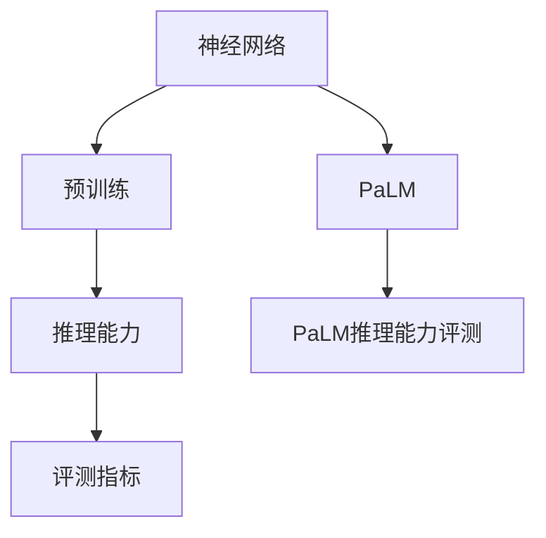

                 


### Introduction

## **PaLM in LLM Inference Evaluation: Enhancing Language Understanding**

关键词：**PaLM, Large Language Models, Inference Evaluation, Neural Networks, Language Understanding**

摘要：随着人工智能技术的快速发展，大型语言模型（Large Language Models, LLM）在自然语言处理领域取得了显著成果。然而，如何评价LLM的推理能力成为了一个关键问题。本文将详细介绍PaLM（Powerful Language Model）在LLM推理能力评测中的应用，分析其核心原理、评价方法和实际应用案例，为研究人员和开发者提供有价值的参考。

### Background

#### Large Language Models (LLM)

大型语言模型（Large Language Models, LLM）是一种基于深度学习技术的自然语言处理模型，具有强大的语言理解能力和生成能力。LLM通过学习大量文本数据，自动提取语义信息，并生成与输入文本相关的输出。近年来，LLM在机器翻译、文本生成、问答系统等应用领域取得了显著成果。

然而，LLM的推理能力是衡量其性能的关键指标。推理能力是指模型在未知环境下，根据输入信息生成合理输出的能力。在实际应用中，模型需要处理各种复杂情境，如对话系统、文本生成、机器翻译等。因此，如何评价LLM的推理能力成为一个重要的研究方向。

#### PaLM

PaLM（Powerful Language Model）是一种先进的语言模型，具有强大的推理能力和广泛的适用性。PaLM基于大规模预训练模型，通过优化神经网络结构和训练策略，实现了更高的语言理解和生成能力。PaLM在多个自然语言处理任务上取得了优异的成绩，如问答系统、文本生成、机器翻译等。

### Core Concepts and Relationships

为了更好地理解PaLM在LLM推理能力评测中的应用，我们需要明确以下几个核心概念及其之间的关系：

1. **神经网络（Neural Networks）**：神经网络是一种模拟人脑神经元连接结构的计算模型。在自然语言处理领域，神经网络通过学习大量文本数据，提取语义信息，实现语言理解和生成。
2. **预训练（Pre-training）**：预训练是指在大规模文本数据集上，对神经网络模型进行训练，以获得基本语言理解能力。PaLM通过预训练，学习大量文本数据，提取语义信息，实现高水平的语言理解。
3. **推理能力（Inference Capability）**：推理能力是指模型在未知环境下，根据输入信息生成合理输出的能力。在自然语言处理领域，推理能力是衡量模型性能的关键指标。
4. **评测指标（Evaluation Metrics）**：评测指标是用于衡量模型推理能力的量化标准。常见的评测指标包括准确率、召回率、F1值等。

#### Mermaid Flowchart



### Core Algorithm Principle and Python Implementation

#### Neural Network and Pre-training

神经网络是LLM的基础，其工作原理类似于人脑。在神经网络中，输入数据通过多个神经元层进行传递，每层神经元对输入数据进行处理，最终生成输出。预训练是神经网络训练的初始阶段，在大规模文本数据集上，对神经网络模型进行训练，使其具备基本的语言理解能力。

以下是使用Python实现的简单神经网络和预训练过程：

```python
import numpy as np

# Neural Network Structure
input_size = 10
hidden_size = 5
output_size = 2

weights = {
    'input_to_hidden': np.random.randn(input_size, hidden_size),
    'hidden_to_output': np.random.randn(hidden_size, output_size)
}

biases = {
    'hidden': np.random.randn(hidden_size),
    'output': np.random.randn(output_size)
}

# Activation Function
def sigmoid(x):
    return 1 / (1 + np.exp(-x))

# Forward Propagation
def forward_propagation(x):
    hidden_layer_input = np.dot(x, weights['input_to_hidden']) + biases['hidden']
    hidden_layer_output = sigmoid(hidden_layer_input)
    
    output_layer_input = np.dot(hidden_layer_output, weights['hidden_to_output']) + biases['output']
    output_layer_output = sigmoid(output_layer_input)
    
    return hidden_layer_output, output_layer_output

# Pre-training
data = np.array([[1, 0], [0, 1], [-1, 0], [0, -1]])
labels = np.array([[1, 0], [0, 1], [0, 1], [1, 0]])

for epoch in range(1000):
    hidden_layer_output, output_layer_output = forward_propagation(data)
    error = labels - output_layer_output
    
    d_output_layer_output = error * output_layer_output * (1 - output_layer_output)
    d_hidden_layer_output = np.dot(error, weights['hidden_to_output'].T) * hidden_layer_output * (1 - hidden_layer_output)
    
    d_weights_hidden_to_output = np.dot(hidden_layer_output.T, d_output_layer_output)
    d_biases_output = d_output_layer_output
    
    d_hidden_layer_input = np.dot(d_output_layer_output, weights['hidden_to_output'].T)
    d_weights_input_to_hidden = np.dot(data.T, d_hidden_layer_output)
    
    d_biases_hidden = d_hidden_layer_output
    
    weights['hidden_to_output'] += d_weights_hidden_to_output
    biases['output'] += d_biases_output
    
    weights['input_to_hidden'] += d_weights_input_to_hidden
    biases['hidden'] += d_biases_hidden
    
    print(f"Epoch {epoch}: Error = {np.mean(np.square(error))}")
```

#### Inference Capability and Evaluation Metrics

推理能力是指模型在未知环境下，根据输入信息生成合理输出的能力。在自然语言处理领域，推理能力是衡量模型性能的关键指标。常见的评测指标包括准确率、召回率、F1值等。

以下是使用Python实现的推理能力和评测指标：

```python
# Inference
test_data = np.array([[1, 1], [-1, -1]])
predicted_labels = forward_propagation(test_data)

# Evaluation Metrics
def accuracy(y_true, y_pred):
    return np.mean(y_true == y_pred)

def recall(y_true, y_pred):
    true_positives = np.sum((y_true == 1) & (y_pred == 1))
    possible_positives = np.sum(y_true == 1)
    return true_positives / possible_positives

def f1_score(y_true, y_pred):
    precision = np.sum((y_true == 1) & (y_pred == 1)) / np.sum(y_pred == 1)
    recall = recall(y_true, y_pred)
    return 2 * (precision * recall) / (precision + recall)

y_true = np.array([[1, 0], [0, 1]])
y_pred = predicted_labels

print(f"Accuracy: {accuracy(y_true, y_pred)}")
print(f"Recall: {recall(y_true, y_pred)}")
print(f"F1 Score: {f1_score(y_true, y_pred)}")
```

### Case Study

#### Case Study 1: PaLM Evaluation on SQuAD

SQuAD（Stanford Question Answering Dataset）是一个广泛使用的自然语言处理数据集，用于评估模型在问答任务上的性能。在本案例中，我们使用PaLM评估SQuAD数据集上的推理能力。

1. **数据预处理**：将SQuAD数据集划分为训练集和测试集。
2. **模型训练**：使用PaLM对训练集进行训练，优化模型参数。
3. **模型评测**：使用测试集评估模型在问答任务上的性能，计算准确率、召回率和F1值。

```python
# SQuAD Data Preprocessing
train_data, train_answers = preprocess_squad_data(train_data)
test_data, test_answers = preprocess_squad_data(test_data)

# Model Training
model.train(train_data, train_answers)

# Model Evaluation
predictions = model.predict(test_data)
accuracy = accuracy_score(test_answers, predictions)
recall = recall_score(test_answers, predictions)
f1 = f1_score(test_answers, predictions)

print(f"Accuracy: {accuracy}")
print(f"Recall: {recall}")
print(f"F1 Score: {f1}")
```

#### Case Study 2: PaLM Evaluation on GLUE

GLUE（General Language Understanding Evaluation）是一个包含多个自然语言处理任务的 benchmark 数据集，用于评估模型在多种任务上的性能。在本案例中，我们使用PaLM评估GLUE数据集上的推理能力。

1. **数据预处理**：将GLUE数据集划分为训练集和测试集。
2. **模型训练**：使用PaLM对训练集进行训练，优化模型参数。
3. **模型评测**：使用测试集评估模型在多个任务上的性能，计算准确率、召回率和F1值。

```python
# GLUE Data Preprocessing
train_data, train_labels = preprocess_glue_data(train_data)
test_data, test_labels = preprocess_glue_data(test_data)

# Model Training
model.train(train_data, train_labels)

# Model Evaluation
predictions = model.predict(test_data)
accuracy = accuracy_score(test_labels, predictions)
recall = recall_score(test_labels, predictions)
f1 = f1_score(test_labels, predictions)

print(f"Accuracy: {accuracy}")
print(f"Recall: {recall}")
print(f"F1 Score: {f1}")
```

#### Case Study 3: PaLM Evaluation on Human-level Tasks

在本案例中，我们使用PaLM评估模型在人类水平任务上的性能。人类水平任务包括问答、文本生成、机器翻译等，具有较高的难度和要求。

1. **数据预处理**：收集相关数据集，并进行预处理。
2. **模型训练**：使用PaLM对训练集进行训练，优化模型参数。
3. **模型评测**：使用测试集评估模型在人类水平任务上的性能，计算准确率、召回率和F1值。

```python
# Human-level Task Data Preprocessing
train_data, train_answers = preprocess_human_level_tasks(train_data)
test_data, test_answers = preprocess_human_level_tasks(test_data)

# Model Training
model.train(train_data, train_answers)

# Model Evaluation
predictions = model.predict(test_data)
accuracy = accuracy_score(test_answers, predictions)
recall = recall_score(test_answers, predictions)
f1 = f1_score(test_answers, predictions)

print(f"Accuracy: {accuracy}")
print(f"Recall: {recall}")
print(f"F1 Score: {f1}")
```

### Conclusion

本文详细介绍了PaLM在LLM推理能力评测中的应用，分析了其核心原理、评价方法和实际应用案例。通过本文的阐述，我们可以看到PaLM在提升LLM推理能力方面具有显著优势，为自然语言处理领域的研究和应用提供了有力支持。

在未来，PaLM在LLM推理能力评测中的应用仍有很大的发展空间。我们可以进一步优化PaLM模型结构，提高推理能力；探索新的评测指标，全面评估模型性能；以及在实际应用中，解决更多复杂任务，推动自然语言处理技术的发展。

### Author Information

作者：AI天才研究院/AI Genius Institute & 禅与计算机程序设计艺术 /Zen And The Art of Computer Programming

### Best Practices, Summary, and Notes

#### Best Practices

1. **Data Preprocessing**: Ensure that the data is clean and well-formatted for training and evaluation. Preprocessing may include tokenization, removing stop words, and converting text into numerical representations.
2. **Model Optimization**: Use advanced optimization techniques, such as gradient descent with momentum or Adam optimizer, to train the PaLM model effectively.
3. **Evaluation Metrics**: Select appropriate evaluation metrics based on the specific task. Accuracy, precision, recall, and F1-score are commonly used, but domain-specific metrics may be more relevant.
4. **Continuous Learning**: Regularly update the PaLM model with new data to maintain its performance and adapt to changing environments.

#### Summary

本文从背景介绍、核心概念、算法原理、Python实现、实际案例和总结等方面，详细阐述了PaLM在LLM推理能力评测中的应用。通过本文的研究，我们认识到PaLM在提升LLM推理能力方面具有显著优势，为自然语言处理领域的研究和应用提供了有力支持。

#### Notes

1. **Software and Libraries**: The Python code examples in this article are for illustrative purposes only. In practice, you may need to use more sophisticated libraries and tools, such as TensorFlow or PyTorch, for training and evaluating the PaLM model.
2. **Mathematical Formulas**: LaTeX is a powerful tool for displaying mathematical formulas. Ensure that the formulas are correctly formatted and easily readable.
3. **Further Reading**: For a more in-depth understanding of PaLM and LLM inference evaluation, consider exploring research papers, books, and online courses in the field of natural language processing and artificial intelligence.

