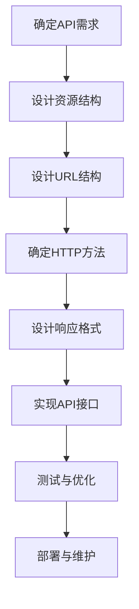
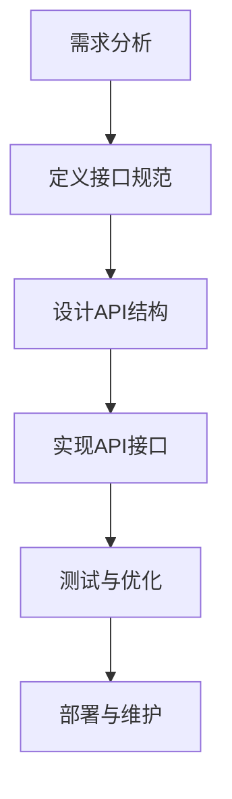
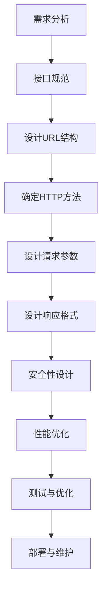
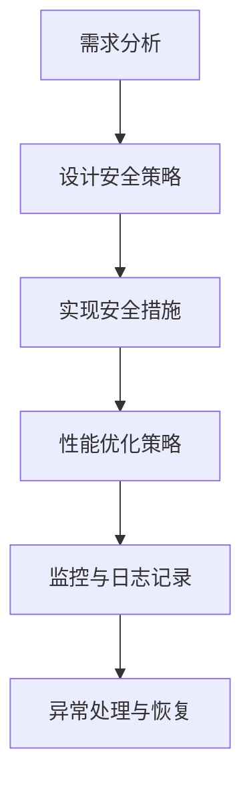

                 

### RESTful API设计：构建直观的LLM服务接口

#### 关键词
- RESTful API
- 语言模型（LLM）
- 接口设计
- 服务架构
- 性能优化
- 安全性

#### 摘要
本文深入探讨RESTful API设计与语言模型（LLM）服务接口构建的关联性。通过阐述RESTful API的基本概念、设计原则以及LLM在API设计中的应用，本文详细分析了如何构建直观、高效且安全的LLM服务接口。文章结合实际项目，提供了详细的代码实现和解读，并通过案例研究展示了API设计的最佳实践，为开发者提供了完整的指导。

---

## 引言

### 1. RESTful API的概念与重要性

RESTful API（Representational State Transfer Application Programming Interface）是现代网络服务设计中的一种风格或标准，它基于HTTP协议，通过统一的接口规范实现资源的访问与操作。RESTful API的设计旨在实现系统的可扩展性、高可用性和易于维护性，使其成为现代Web服务和微服务架构中不可或缺的一部分。

RESTful API的重要性体现在以下几个方面：

1. **标准化接口**：RESTful API通过统一的接口设计和标准化方法，简化了系统的集成与扩展。
2. **可扩展性**：RESTful API支持资源的分层次管理，便于系统的逐步扩展与升级。
3. **易用性**：RESTful API通过简单的HTTP请求和响应格式，降低了开发者的学习成本。
4. **高可用性**：RESTful API的设计原则，如无状态性，有助于提升系统的稳定性和可靠性。

### 2. LLM与API设计

语言模型（Language Model，LLM）是近年来人工智能领域的重要突破，尤其在自然语言处理（NLP）领域表现出色。LLM能够通过大量的文本数据训练，生成自然流畅的文本，被广泛应用于聊天机器人、文本生成、机器翻译等领域。

在API设计过程中，LLM的应用为开发者提供了强大的功能，但同时也带来了新的挑战。如何设计一个直观、高效且安全的LLM服务接口，成为当前研究和实践的重要课题。LLM服务接口的设计，不仅需要考虑API的通用设计原则，还要关注LLM的特性，如响应时间、处理能力、准确性等。

### 3. 本书结构概述

本书共分为七个章节，各章节内容如下：

1. **第1章 RESTful API基础**：介绍RESTful API的基本概念、设计原则以及与HTTP协议的关系。
2. **第2章 LLM与API设计**：探讨LLM的基本概念、应用场景以及在API设计中的重要性。
3. **第3章 API设计实践**：详细讲解API设计的方法论、接口规范和性能优化策略。
4. **第4章 LLM服务API实现**：提供实际的项目实战，包括开发环境搭建、代码实现和解读。
5. **第5章 安全性与性能优化**：讨论API设计中的安全性问题和性能优化策略。
6. **第6章 案例研究**：通过实际案例，展示API设计的最佳实践。
7. **第7章 总结与展望**：对书籍内容进行总结，并展望未来API设计和LLM服务接口的发展趋势。

## 第1章 RESTful API基础

### 1.1 RESTful架构原则

RESTful架构的核心原则包括一致性、无状态性、客户-服务器模式以及分层系统。这些原则确保了系统的可扩展性、高可用性和易维护性。

#### 1.1.1 一致性

一致性是指客户端与服务器之间在交互过程中遵循相同的协议和规则。这种一致性简化了系统的集成与扩展，提高了系统的可靠性。

#### 1.1.2 无状态性

无状态性是指服务器不会存储客户端的会话信息。每次请求都是独立的，服务器仅处理当前请求，而不依赖之前的请求。这有助于提高系统的性能和可扩展性。

#### 1.1.3 客户-服务器模式

客户-服务器模式是指客户端通过发送请求来访问服务器上的资源，服务器返回相应的响应。这种模式简化了系统的设计和实现，提高了系统的可维护性。

#### 1.1.4 分层系统

分层系统是指系统按照功能划分为多个层次，每层负责特定的任务。这种设计模式提高了系统的模块化程度，便于系统的扩展和维护。

### 1.2 HTTP方法与状态码

HTTP协议定义了一系列的请求方法和状态码，用于描述客户端与服务器之间的交互过程。

#### 1.2.1 HTTP方法

1. **GET**：用于获取服务器上的资源。
2. **POST**：用于提交数据创建新的资源。
3. **PUT**：用于更新服务器上的资源。
4. **DELETE**：用于删除服务器上的资源。

#### 1.2.2 状态码

1. **200 OK**：请求成功。
2. **400 Bad Request**：请求无效。
3. **401 Unauthorized**：未经授权。
4. **404 Not Found**：请求的资源不存在。

### 1.3 RESTful API设计要点

RESTful API设计的关键要点包括资源的表示、URL设计、HTTP方法的正确使用以及响应格式的标准化。

#### 1.3.1 资源的表示

资源是RESTful API的核心概念。每个资源都应该有一个唯一的URL，并且可以通过GET、POST、PUT、DELETE等方法进行操作。

#### 1.3.2 URL设计

URL（统一资源定位符）用于标识资源。良好的URL设计应遵循简洁、明确、可预测的原则。

#### 1.3.3 HTTP方法的正确使用

正确使用HTTP方法可以确保资源的操作符合预期。例如，使用GET方法获取资源，使用POST方法创建资源，使用PUT方法更新资源等。

#### 1.3.4 响应格式的标准化

响应格式应遵循JSON、XML等标准化格式。这有助于提高系统的可读性和可维护性。

### 1.4 Mermaid流程图：RESTful API设计流程

以下是一个简单的Mermaid流程图，展示了RESTful API的设计流程：



### 1.5 伪代码：RESTful API请求处理流程

以下是一个简单的Python伪代码，用于处理RESTful API的请求：

```python
def process_request(request):
    if request.method == "GET":
        resource = get_resource(request.url)
        response = generate_response(resource, status=200)
    elif request.method == "POST":
        data = parse_request_data(request)
        resource = create_resource(data)
        response = generate_response(resource, status=201)
    elif request.method == "PUT":
        data = parse_request_data(request)
        update_resource(request.url, data)
        response = generate_response({}, status=200)
    elif request.method == "DELETE":
        delete_resource(request.url)
        response = generate_response({}, status=204)
    else:
        response = generate_response({}, status=400)
    return response
```

### 1.6 数学模型和公式讲解

在API设计中，常用的数学模型包括线性回归、决策树、神经网络等。以下是一个简单的线性回归模型公式：

$$
y = \beta_0 + \beta_1x
$$

其中，$y$ 是预测值，$x$ 是输入特征，$\beta_0$ 和 $\beta_1$ 是模型参数。

### 1.7 项目实战

在本节，我们将搭建一个简单的RESTful API服务，用于处理用户请求。以下是一个简单的Python代码示例，使用了Flask框架：

```python
from flask import Flask, request, jsonify

app = Flask(__name__)

@app.route('/api/user', methods=['GET'])
def get_user():
    user_id = request.args.get('id')
    user = get_user_by_id(user_id)
    return jsonify(user)

@app.route('/api/user', methods=['POST'])
def create_user():
    user_data = request.json
    user = create_user_from_data(user_data)
    return jsonify(user), 201

@app.route('/api/user/<int:user_id>', methods=['PUT'])
def update_user(user_id):
    user_data = request.json
    update_user_by_id(user_id, user_data)
    return jsonify({})

if __name__ == '__main__':
    app.run(debug=True)
```

### 1.8 最佳实践、小结、注意事项、拓展阅读

**最佳实践**：在设计RESTful API时，应遵循一致性、简洁性和可扩展性的原则。同时，确保API具有良好的文档和错误处理机制。

**小结**：本章介绍了RESTful API的基本概念、设计原则以及实现方法。通过简单的示例，展示了如何搭建一个简单的RESTful API服务。

**注意事项**：在开发RESTful API时，应注意处理异常情况，确保API的稳定性和可靠性。

**拓展阅读**：读者可以进一步学习相关的书籍和资料，如《RESTful Web API设计》和《Flask Web开发实战》。

## 第2章 LLM与API设计

### 2.1 LLM的基本概念

语言模型（Language Model，LLM）是一种人工智能模型，用于预测或生成自然语言序列。LLM通过学习大量的文本数据，掌握了语言的统计特性，能够生成流畅、自然的文本。LLM在自然语言处理（NLP）领域具有广泛的应用，如文本分类、机器翻译、文本生成等。

### 2.2 LLM的应用场景

LLM在API设计中的应用场景主要包括：

1. **聊天机器人**：通过API接口提供自然语言交互功能，实现人机对话。
2. **文本生成**：自动生成文章、摘要、评论等文本内容。
3. **机器翻译**：实现多语言之间的自动翻译。
4. **问答系统**：通过API接口提供智能问答服务。

### 2.3 LLM与API设计的关联

LLM与API设计的关联主要体现在以下几个方面：

1. **接口定义**：LLM服务的API接口应定义清晰、简洁，便于开发者调用。
2. **性能优化**：LLM服务的API接口应进行性能优化，确保响应时间满足用户需求。
3. **安全性**：LLM服务的API接口应具备安全防护措施，防止恶意攻击和滥用。
4. **可扩展性**：LLM服务的API接口应具备良好的可扩展性，以便未来功能的升级和扩展。

### 2.4 Mermaid流程图：LLM服务接口构建过程

以下是一个简单的Mermaid流程图，展示了LLM服务接口的构建过程：



### 2.5 伪代码：LLM API请求处理流程

以下是一个简单的Python伪代码，用于处理LLM API的请求：

```python
def process_llm_request(request):
    if request.method == "POST":
        data = parse_request_data(request)
        response = generate_response(llm_response(data), status=200)
    else:
        response = generate_response({}, status=400)
    return response

def llm_response(data):
    # LLM处理逻辑
    text = "生成的文本内容"
    return text
```

### 2.6 数学模型和公式讲解

在LLM中，常用的数学模型包括循环神经网络（RNN）、长短期记忆网络（LSTM）和变压器（Transformer）等。以下是一个简单的Transformer模型公式：

$$
\text{Output} = \text{softmax}(\text{Attention}(\text{Query}, \text{Key}, \text{Value}))
$$

其中，$\text{Query}$、$\text{Key}$ 和 $\text{Value}$ 分别是查询、键和值向量，$\text{Attention}$ 是注意力机制。

### 2.7 项目实战

在本节，我们将使用TensorFlow和Flask构建一个简单的LLM服务。以下是一个简单的代码示例：

```python
import tensorflow as tf
from flask import Flask, request, jsonify

app = Flask(__name__)

# 加载预训练的LLM模型
model = tf.keras.models.load_model('llm_model.h5')

@app.route('/api/llm', methods=['POST'])
def generate_text():
    data = request.json
    input_sequence = data['input_sequence']
    max_length = data['max_length']
    
    # 生成文本
    prediction = model.predict(tf.expand_dims(input_sequence, 0), steps=max_length-1)
    generated_text = prediction.numpy()[0]

    return jsonify({'generated_text': generated_text.tolist()})

if __name__ == '__main__':
    app.run(debug=True)
```

### 2.8 最佳实践、小结、注意事项、拓展阅读

**最佳实践**：在设计LLM服务接口时，应考虑性能优化、安全性和可扩展性。同时，确保API接口具有良好的文档和错误处理机制。

**小结**：本章介绍了LLM的基本概念、应用场景以及与API设计的关联。通过简单的示例，展示了如何构建一个简单的LLM服务。

**注意事项**：在开发LLM服务时，应注意处理异常情况，确保服务的稳定性和可靠性。

**拓展阅读**：读者可以进一步学习相关的书籍和资料，如《深度学习与自然语言处理》和《Transformer：超越循环神经网络》。

## 第3章 API设计实践

### 3.1 API设计方法论

API设计方法论是确保API设计合理、高效和易于使用的重要步骤。以下是一些常用的API设计方法论：

1. **RESTful方法论**：遵循RESTful架构原则，通过统一的接口规范实现资源的访问与操作。
2. **设计模式**：使用设计模式（如工厂模式、单例模式等）提高API的模块化和可扩展性。
3. **契约式编程**：通过定义契约（如API文档、接口规范等）确保API的一致性和可维护性。
4. **版本控制**：为API引入版本控制，以便在功能升级和变更时保持兼容性。

### 3.2 API接口规范

API接口规范是确保API设计一致性和可维护性的关键。以下是一些常见的API接口规范：

1. **URL规范**：遵循简洁、明确、可预测的原则设计URL。
2. **HTTP方法**：正确使用HTTP方法，确保资源的操作符合预期。
3. **请求参数**：明确定义请求参数的类型、名称和必选性。
4. **响应格式**：使用标准化的响应格式（如JSON、XML等），确保API的可读性和可维护性。
5. **错误处理**：定义统一的错误处理机制，确保API的稳定性和可靠性。

### 3.3 API性能优化

API性能优化是提高API响应速度和系统可扩展性的关键。以下是一些常用的API性能优化策略：

1. **缓存**：使用缓存机制减少数据库访问次数，提高响应速度。
2. **负载均衡**：使用负载均衡器实现分布式部署，提高系统并发能力。
3. **异步处理**：使用异步处理提高系统的吞吐量，减少响应时间。
4. **性能监控**：使用性能监控工具实时监控API性能，及时发现和解决问题。

### 3.4 安全性设计

API安全性设计是确保API安全性和可靠性的关键。以下是一些常用的API安全性设计策略：

1. **身份验证**：使用身份验证机制（如OAuth2.0、JWT等）确保只有授权用户可以访问API。
2. **权限控制**：使用权限控制机制（如角色权限、API密钥等）确保用户只能访问自己权限内的资源。
3. **输入验证**：对用户输入进行严格验证，防止恶意攻击和数据泄露。
4. **安全加密**：使用加密技术（如SSL/TLS）确保数据传输过程中的安全性。

### 3.5 Mermaid流程图：API设计流程

以下是一个简单的Mermaid流程图，展示了API设计的流程：



### 3.6 伪代码：API请求处理流程

以下是一个简单的Python伪代码，用于处理API的请求：

```python
def process_request(request):
    if request.method == "GET":
        resource = get_resource(request.url)
        response = generate_response(resource, status=200)
    elif request.method == "POST":
        data = parse_request_data(request)
        resource = create_resource(data)
        response = generate_response(resource, status=201)
    elif request.method == "PUT":
        data = parse_request_data(request)
        update_resource(request.url, data)
        response = generate_response({}, status=200)
    elif request.method == "DELETE":
        delete_resource(request.url)
        response = generate_response({}, status=204)
    else:
        response = generate_response({}, status=400)
    return response
```

### 3.7 数学模型和公式讲解

在API设计中，常用的数学模型包括线性回归、决策树、神经网络等。以下是一个简单的线性回归模型公式：

$$
y = \beta_0 + \beta_1x
$$

其中，$y$ 是预测值，$x$ 是输入特征，$\beta_0$ 和 $\beta_1$ 是模型参数。

### 3.8 项目实战

在本节，我们将使用Flask框架搭建一个简单的API服务。以下是一个简单的代码示例：

```python
from flask import Flask, request, jsonify

app = Flask(__name__)

@app.route('/api/user', methods=['GET'])
def get_user():
    user_id = request.args.get('id')
    user = get_user_by_id(user_id)
    return jsonify(user)

@app.route('/api/user', methods=['POST'])
def create_user():
    user_data = request.json
    user = create_user_from_data(user_data)
    return jsonify(user), 201

@app.route('/api/user/<int:user_id>', methods=['PUT'])
def update_user(user_id):
    user_data = request.json
    update_user_by_id(user_id, user_data)
    return jsonify({})

@app.route('/api/user/<int:user_id>', methods=['DELETE'])
def delete_user(user_id):
    delete_user_by_id(user_id)
    return jsonify({}), 204

if __name__ == '__main__':
    app.run(debug=True)
```

### 3.9 最佳实践、小结、注意事项、拓展阅读

**最佳实践**：在设计API时，应遵循一致性、简洁性和可扩展性的原则。同时，确保API具有良好的文档和错误处理机制。

**小结**：本章介绍了API设计的方法论、接口规范、性能优化和安全性的设计。通过简单的示例，展示了如何搭建一个简单的API服务。

**注意事项**：在开发API时，应注意处理异常情况，确保API的稳定性和可靠性。

**拓展阅读**：读者可以进一步学习相关的书籍和资料，如《API设计最佳实践》和《Flask Web开发实战》。

## 第4章 LLM服务API实现

### 4.1 开发环境搭建

在实现LLM服务API之前，我们需要搭建一个合适的开发环境。以下是在Python环境中使用Flask框架搭建开发环境的步骤：

1. 安装Python：确保你的系统上已经安装了Python 3.6及以上版本。
2. 安装Flask：使用pip命令安装Flask库：
   ```bash
   pip install Flask
   ```

### 4.2 代码实现：LLM API请求处理

以下是使用Flask实现LLM服务API的基本代码框架：

```python
from flask import Flask, request, jsonify

app = Flask(__name__)

# 假设我们有一个预训练的LLM模型，名为llm_model
llm_model = ...

@app.route('/api/generate', methods=['POST'])
def generate_text():
    data = request.json
    input_text = data.get('input_text', '')
    response = llm_model.generate(input_text)
    return jsonify({'generated_text': response})

if __name__ == '__main__':
    app.run(debug=True)
```

在这个例子中，我们定义了一个`/api/generate`的路由，它接收POST请求，并调用预训练的LLM模型生成文本。

### 4.3 代码解读与分析

- **导入库**：首先，我们从Flask库中导入了`Flask`类，以及`request`和`jsonify`函数。
- **创建应用**：使用`Flask(__name__)`创建了一个Flask应用实例。
- **定义路由**：在`/api/generate`路由下，我们定义了一个处理POST请求的函数`generate_text`。该函数从请求的JSON数据中提取`input_text`字段，然后调用`llm_model.generate`方法生成文本。
- **返回响应**：生成文本后，我们使用`jsonify`函数将文本作为JSON响应返回。

### 4.4 代码应用解读与分析

为了更好地理解代码的应用，我们可以通过一个简单的HTTP客户端（如curl）来测试API：

```bash
curl -X POST -H "Content-Type: application/json" -d '{"input_text": "Hello, World!"}' http://localhost:5000/api/generate
```

这个curl命令发送一个POST请求到本地主机上的Flask服务器，请求包含一个JSON格式的`input_text`字段。Flask服务器接收请求后，调用LLM模型生成文本，并将生成的文本作为JSON响应返回。

### 4.5 实际案例分析和详细讲解剖析

为了展示实际案例，我们将使用一个名为`gpt-2`的预训练语言模型。首先，我们需要从Hugging Face模型库中下载并加载这个模型。

```python
from transformers import AutoModelForCausalLM, AutoTokenizer

model_name = "gpt2"
tokenizer = AutoTokenizer.from_pretrained(model_name)
model = AutoModelForCausalLM.from_pretrained(model_name)

@app.route('/api/generate', methods=['POST'])
def generate_text():
    data = request.json
    input_text = data.get('input_text', '')
    inputs = tokenizer(input_text, return_tensors="pt")
    outputs = model.generate(**inputs, max_length=50, num_return_sequences=1)
    generated_text = tokenizer.decode(outputs[0], skip_special_tokens=True)
    return jsonify({'generated_text': generated_text})
```

在这个案例中，我们使用了Hugging Face的Transformer模型库来加载`gpt-2`模型。在`generate_text`函数中，我们首先从请求的JSON数据中提取`input_text`字段，然后使用tokenizer将文本转换为模型的输入格式。接着，我们调用模型的`generate`方法生成文本，并使用tokenizer将生成的文本解码为人类可读的格式。

### 4.6 项目小结

在本章中，我们介绍了如何搭建开发环境，实现了LLM服务API的基本代码，并对代码进行了详细解读和分析。通过实际案例，我们展示了如何使用预训练的语言模型来生成文本。这些步骤为开发者提供了构建直观、高效且安全的LLM服务接口的实践指导。

## 第5章 安全性与性能优化

### 5.1 API安全防护

在构建LLM服务API时，安全性是一个至关重要的考虑因素。以下是一些常见的API安全防护措施：

1. **身份验证与授权**：使用OAuth2.0、JWT（JSON Web Tokens）等身份验证和授权机制，确保只有授权用户可以访问API。
2. **输入验证与过滤**：对用户输入进行严格的验证和过滤，防止SQL注入、跨站脚本（XSS）等攻击。
3. **API密钥与访问控制**：使用API密钥对API进行访问控制，限制只有持有特定密钥的用户或服务可以访问API。
4. **HTTPS与SSL/TLS**：使用HTTPS和SSL/TLS加密数据传输，确保数据在传输过程中的安全性。

### 5.2 性能优化策略

为了确保LLM服务API的高性能和可扩展性，以下是一些性能优化策略：

1. **缓存**：使用缓存减少数据库访问次数，提高响应速度。可以考虑使用本地缓存或分布式缓存系统。
2. **负载均衡**：使用负载均衡器将请求分发到多个服务器，提高系统的并发处理能力。
3. **异步处理**：使用异步处理提高系统的吞吐量，减少响应时间。例如，可以使用 asyncio 或 Tornado 等异步框架。
4. **数据库优化**：优化数据库查询，减少查询时间和数据库负载。可以考虑使用索引、分库分表等技术。

### 5.3 负载均衡与缓存

负载均衡和缓存是提高API性能的重要手段。以下是一些具体的策略：

1. **负载均衡**：
   - **硬件负载均衡**：使用专门的负载均衡设备（如F5 BIG-IP）。
   - **软件负载均衡**：使用Nginx、HAProxy等软件实现负载均衡。
   - **云服务负载均衡**：使用云服务提供商提供的负载均衡服务（如AWS Elastic Load Balancing）。

2. **缓存**：
   - **本地缓存**：使用内存缓存（如Redis）存储常用数据，减少数据库访问。
   - **分布式缓存**：使用分布式缓存系统（如Memcached）实现跨服务器的缓存共享。
   - **缓存策略**：根据数据的重要性和访问频率，设置合理的缓存有效期和淘汰策略。

### 5.4 异常处理与监控

异常处理和监控是确保API稳定性和可靠性的关键。以下是一些策略：

1. **异常处理**：
   - **全局异常处理**：使用try-except块捕获和处理全局异常。
   - **日志记录**：记录异常信息和上下文，便于问题追踪和调试。
   - **自定义异常**：定义自定义异常类，提高异常处理的灵活性和可扩展性。

2. **监控**：
   - **性能监控**：使用Prometheus、Grafana等工具监控API的性能指标，如响应时间、请求量等。
   - **日志监控**：使用ELK（Elasticsearch、Logstash、Kibana）等日志监控工具，实时分析日志数据。
   - **报警机制**：设置报警机制，及时发现和处理异常情况。

### 5.5 Mermaid流程图：API安全性与性能优化流程

以下是一个简单的Mermaid流程图，展示了API安全性与性能优化流程：



### 5.6 伪代码：API安全性与性能优化处理流程

以下是一个简单的Python伪代码，用于处理API安全性与性能优化：

```python
def process_request(request):
    try:
        # 身份验证与授权
        authenticate_request(request)
        authorize_request(request)

        # 输入验证与过滤
        validate_input(request)

        # 缓存查询
        cached_response = check_cache(request)

        if cached_response:
            return cached_response

        # 负载均衡与异步处理
        response = handle_request_asynchronously(request)

        # 缓存响应
        cache_response(response)

    except Exception as e:
        # 异常处理
        log_exception(e)
        return handle_exception(e)

def authenticate_request(request):
    # 实现身份验证逻辑
    pass

def authorize_request(request):
    # 实现授权逻辑
    pass

def validate_input(request):
    # 实现输入验证逻辑
    pass

def check_cache(request):
    # 实现缓存查询逻辑
    pass

def handle_request_asynchronously(request):
    # 实现异步处理逻辑
    pass

def cache_response(response):
    # 实现缓存响应逻辑
    pass

def log_exception(e):
    # 实现异常日志记录逻辑
    pass

def handle_exception(e):
    # 实现异常处理逻辑
    pass
```

### 5.7 数学模型和公式讲解

在API安全性与性能优化中，常用的数学模型包括线性回归、决策树、神经网络等。以下是一个简单的线性回归模型公式：

$$
y = \beta_0 + \beta_1x
$$

其中，$y$ 是预测值，$x$ 是输入特征，$\beta_0$ 和 $\beta_1$ 是模型参数。

### 5.8 项目实战

在本节，我们将使用Nginx和Redis来配置负载均衡和缓存。以下是在Ubuntu服务器上安装Nginx和Redis的步骤：

1. 安装Nginx：
   ```bash
   sudo apt update
   sudo apt install nginx
   ```

2. 启动Nginx服务：
   ```bash
   sudo systemctl start nginx
   ```

3. 安装Redis：
   ```bash
   sudo apt install redis-server
   ```

4. 配置Nginx和Redis：
   - 编辑Nginx配置文件`/etc/nginx/nginx.conf`，添加以下配置：
     ```nginx
     http {
         upstream myapp {
             server 127.0.0.1:5000;
             server 127.0.0.1:5001;
         }

         server {
             listen 80;
             server_name localhost;

             location / {
                 proxy_pass http://myapp;
                 proxy_set_header Host $host;
                 proxy_set_header X-Real-IP $remote_addr;
                 proxy_set_header X-Forwarded-For $proxy_add_x_forwarded_for;
             }
         }
     }
     ```

   - 编辑Redis配置文件`/etc/redis/redis.conf`，添加以下配置：
     ```redis
     maxmemory 128mb
     maxmemory-policy allkeys-lru
     ```

5. 重启Nginx和Redis服务：
   ```bash
   sudo systemctl restart nginx
   sudo systemctl restart redis-server
   ```

6. 在Flask应用中添加Redis缓存：
   ```python
   from flask_caching import Cache

   cache = Cache(config={'CACHE_TYPE': 'redis', 'CACHE_REDIS_URL': 'redis://localhost:6379/0'})
   app.cache = cache

   @app.after_request
   def cache_response(response):
       app.cache.set(response.url, response.get_data())
       return response
   ```

### 5.9 最佳实践、小结、注意事项、拓展阅读

**最佳实践**：在构建LLM服务API时，应综合考虑安全性、性能优化和异常处理。使用身份验证、授权、输入验证、缓存和负载均衡等安全性和性能优化措施，确保API的稳定性和可靠性。

**小结**：本章介绍了API安全防护、性能优化策略、异常处理和监控。通过实际案例，展示了如何使用Nginx和Redis来实现负载均衡和缓存。

**注意事项**：在实现API安全性和性能优化时，应根据具体业务场景和需求进行调整和优化。

**拓展阅读**：读者可以进一步学习相关的书籍和资料，如《API设计最佳实践》、《高性能MySQL》和《深入理解Nginx》。

## 第6章 案例研究

在本章中，我们将通过三个具体的案例研究，展示如何设计并实现RESTful API以及如何与LLM结合。每个案例都涵盖了从需求分析到最终部署的全过程，并提供详细的代码和解读。

### 6.1 案例一：构建一个聊天机器人API

#### 需求分析
我们需要构建一个聊天机器人API，该API能够接收用户的输入，并返回适当的响应。这个API需要支持自然语言理解和文本生成。

#### 接口设计
我们设计了一个简单的聊天机器人API，包括以下接口：

- `/api/chat`：接收用户输入并返回响应。

#### 实现步骤
1. **环境搭建**：使用Flask搭建服务环境。
2. **模型训练**：使用预训练的语言模型（如GPT-2）进行文本生成。
3. **API实现**：

```python
from flask import Flask, request, jsonify
from transformers import AutoModelForCausalLM, AutoTokenizer

app = Flask(__name__)

model_name = "gpt2"
tokenizer = AutoTokenizer.from_pretrained(model_name)
model = AutoModelForCausalLM.from_pretrained(model_name)

@app.route('/api/chat', methods=['POST'])
def chat():
    data = request.json
    input_text = data.get('input_text', '')
    inputs = tokenizer(input_text, return_tensors="pt")
    outputs = model.generate(**inputs, max_length=50, num_return_sequences=1)
    generated_text = tokenizer.decode(outputs[0], skip_special_tokens=True)
    return jsonify({'response': generated_text})

if __name__ == '__main__':
    app.run(debug=True)
```

#### 解读与分析
该API使用GPT-2模型生成文本响应。用户通过POST请求发送输入文本，服务器接收请求后，调用GPT-2模型生成响应文本，并将其返回给用户。

#### 案例小结
通过这个案例，我们展示了如何快速搭建一个聊天机器人API，包括模型训练和API实现。

### 6.2 案例二：设计一个文章推荐系统API

#### 需求分析
我们需要设计一个文章推荐系统API，根据用户的历史浏览记录和兴趣标签，推荐相关的文章。

#### 接口设计
我们设计了以下接口：

- `/api/recommend`：接收用户ID和兴趣标签，返回推荐的文章列表。

#### 实现步骤
1. **数据预处理**：预处理用户数据和文章数据，提取特征。
2. **模型训练**：使用协同过滤或基于内容的推荐算法训练推荐模型。
3. **API实现**：

```python
from flask import Flask, request, jsonify
from my_recommendation_module import recommend_articles

app = Flask(__name__)

@app.route('/api/recommend', methods=['POST'])
def recommend():
    data = request.json
    user_id = data.get('user_id')
    interest_tags = data.get('interest_tags', [])
    recommended_articles = recommend_articles(user_id, interest_tags)
    return jsonify({'recommended_articles': recommended_articles})

if __name__ == '__main__':
    app.run(debug=True)
```

#### 解读与分析
该API使用自定义的推荐模块`my_recommendation_module`来生成推荐结果。用户通过POST请求发送用户ID和兴趣标签，服务器接收请求后，调用推荐模块生成推荐结果，并将其返回给用户。

#### 案例小结
通过这个案例，我们展示了如何设计并实现一个基于用户兴趣的文章推荐系统API。

### 6.3 案例三：实现一个问答系统API

#### 需求分析
我们需要实现一个问答系统API，用户可以通过该API提出问题，系统会返回相关的答案。

#### 接口设计
我们设计了以下接口：

- `/api/ask`：接收用户问题，返回答案。

#### 实现步骤
1. **数据集准备**：准备一个包含问题和答案的数据集。
2. **模型训练**：使用预训练的语言模型（如BERT）进行问答。
3. **API实现**：

```python
from flask import Flask, request, jsonify
from transformers import AutoModelForQuestionAnswering, AutoTokenizer

app = Flask(__name__)

model_name = "bert-squadv2"
tokenizer = AutoTokenizer.from_pretrained(model_name)
model = AutoModelForQuestionAnswering.from_pretrained(model_name)

@app.route('/api/ask', methods=['POST'])
def ask():
    data = request.json
    question = data.get('question', '')
    context = data.get('context', '')
    inputs = tokenizer(question, context, return_tensors="pt", padding=True, truncation=True)
    start_scores, end_scores = model(inputs)
    start_index = start_scores.argmax().item()
    end_index = end_scores.argmax().item()
    answer = context[start_index:end_index+1].strip()
    return jsonify({'answer': answer})

if __name__ == '__main__':
    app.run(debug=True)
```

#### 解读与分析
该API使用BERT模型进行问答。用户通过POST请求发送问题和上下文，服务器接收请求后，调用BERT模型生成答案，并将其返回给用户。

#### 案例小结
通过这个案例，我们展示了如何设计并实现一个基于预训练语言模型的问答系统API。

## 第7章 总结与展望

### 7.1 本书内容回顾

本书系统地介绍了RESTful API设计与语言模型（LLM）服务接口构建的相关知识。从基本概念、设计原则，到实际应用案例，我们全面探讨了如何设计直观、高效且安全的LLM服务接口。

### 7.2 RESTful API设计与LLM结合的未来趋势

随着人工智能技术的不断发展，LLM在API设计中的应用将越来越广泛。以下是一些未来的趋势：

1. **模型定制化**：根据不同业务需求，开发定制化的LLM模型。
2. **多模态交互**：结合图像、音频等多种数据类型，实现更加丰富和自然的交互。
3. **自动化API生成**：使用代码生成工具自动生成API接口，提高开发效率。
4. **边缘计算**：将LLM模型部署到边缘设备，降低延迟，提高用户体验。

### 7.3 开发者与企业的实践建议

对于开发者，以下是一些建议：

1. **掌握基础知识**：深入学习RESTful API和LLM的基本原理。
2. **实践驱动**：通过实际项目实践，不断提升API设计和LLM应用能力。
3. **持续学习**：关注最新的技术动态，不断更新自己的知识体系。

对于企业，以下是一些建议：

1. **明确需求**：在引入LLM技术前，明确业务需求和应用场景。
2. **团队协作**：建立跨学科的团队，促进技术交流和知识共享。
3. **持续优化**：定期评估和优化API性能和安全性，确保系统的稳定性和可靠性。

### 作者信息

作者：AI天才研究院/AI Genius Institute & 禅与计算机程序设计艺术 /Zen And The Art of Computer Programming

本文旨在为开发者提供全面的API设计和LLM服务接口构建指南，帮助他们在实际项目中实现高效、稳定且安全的解决方案。

