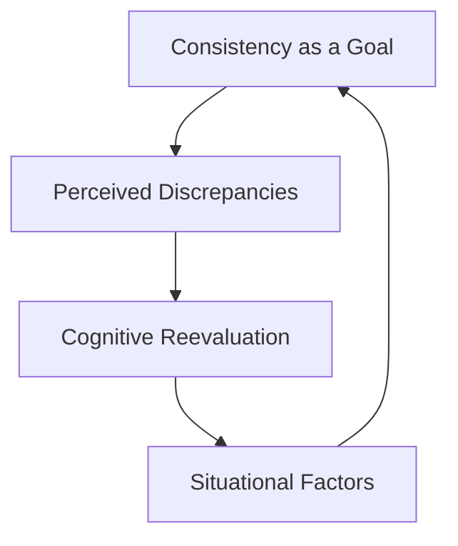

                 


# Title: Self-Consistency CoT in Sociological Research

## Keywords:
1. Self-Consistency CoT
2. Sociological Research
3. Data Analysis
4. Algorithmic Implementation
5. Social Science Methods

## Summary:
This article explores the application of Self-Consistency CoT (Self-Consistency Cognitive Theory) in sociological research. It delves into the theoretical foundations, algorithmic implementation, and practical examples of the Self-Consistency CoT model. The article aims to provide a comprehensive understanding of how the Self-Consistency CoT can be used to analyze sociological data, offering insights into the challenges and future directions for this innovative approach.

## Part 1: Introduction to Self-Consistency CoT

### 1.1.1 What is Self-Consistency CoT?

Self-Consistency CoT (Self-Consistency Cognitive Theory) is an emerging framework in social science that focuses on the processes by which individuals construct and maintain consistent beliefs, attitudes, and behaviors. The core idea behind this theory is that people have a natural inclination to ensure that their internal cognitive structures remain coherent and self-consistent. This self-regulation process is influenced by various factors, including social context, cultural background, and personal experiences.

### 1.1.2 Historical Background

The origins of Self-Consistency CoT can be traced back to the work of social psychologist Leon Festinger, who introduced the theory of cognitive dissonance in the 1950s. Festinger proposed that individuals experience psychological discomfort when they hold contradictory beliefs or when their behavior conflicts with their beliefs. To alleviate this discomfort, individuals are motivated to change their beliefs or their behavior to achieve a state of self-consistency.

Over time, researchers have expanded on Festinger's ideas, developing more nuanced models that account for the complex interplay between cognitive processes, social influence, and personal identity. The Self-Consistency CoT is one such extension, incorporating insights from cognitive psychology, sociology, and other disciplines to provide a comprehensive framework for understanding the self-regulation of beliefs and behaviors.

### 1.1.3 Theoretical Foundations

The Self-Consistency CoT is grounded in several key principles:

1. **Cognitive Consistency:** Individuals strive to maintain consistency between their beliefs, attitudes, and behaviors.
2. **Cognitive Flexibility:** People are capable of modifying their beliefs and attitudes to achieve self-consistency, even when it means altering their behaviors.
3. **Social Context:** The process of self-consistency is influenced by the social environment, including cultural norms, social roles, and peer influence.
4. **Cognitive Load:** The level of cognitive effort required to maintain self-consistency varies depending on the complexity of the beliefs and the social context.

These principles are interrelated and interact to shape individuals' cognitive processes and social behaviors. The Self-Consistency CoT provides a robust framework for analyzing how individuals construct and maintain self-consistent identities in the face of changing social conditions and new information.

## Part 2: Principles of Self-Consistency CoT

### 2.1.1 Core Principles

The core principles of Self-Consistency CoT are essential for understanding how individuals achieve and maintain cognitive consistency. These principles are:

1. **Consistency as a Goal:** Maintaining consistency between beliefs, attitudes, and behaviors is a fundamental goal for individuals.
2. **Perceived Discrepancies:** Individuals monitor their internal cognitive structures for perceived discrepancies, which are signs that their beliefs or behaviors are inconsistent.
3. **Cognitive Reevaluation:** When discrepancies are detected, individuals engage in cognitive reevaluation processes to resolve the inconsistencies. This can involve changing beliefs, behaviors, or both.
4. **Situational Factors:** The influence of social context and situational factors on the self-consistency process cannot be overlooked. Factors such as peer pressure, social norms, and personal identity all play a role in shaping how individuals maintain cognitive consistency.

### 2.1.2 Model and Framework

To visualize the relationship between these core principles, we can use a Mermaid flowchart. Here is a simplified representation:



This flowchart illustrates how the principles of Self-Consistency CoT are interconnected and how they influence each other in the process of maintaining cognitive consistency.

## Part 3: Algorithmic Implementation of Self-Consistency CoT

### 3.1.1 Algorithm Overview

The algorithmic implementation of Self-Consistency CoT involves several key steps:

1. **Input:** A set of initial beliefs and attitudes from an individual.
2. **Processing:** A process to detect and resolve perceived discrepancies.
3. **Output:** A set of updated beliefs and attitudes that are self-consistent.

Here is a high-level pseudo-code for the algorithm:

```python
def self_consistency_cot(initial_beliefs):
    beliefs = initial_beliefs.copy()
    while not self_consistent(beliefs):
        discrepancies = detect_discrepancies(beliefs)
        beliefs = reevaluate_cognitive_structure(beliefs, discrepancies)
    return beliefs
```

### 3.1.2 Mathematical Models

The mathematical models used in the Self-Consistency CoT algorithm can be complex, but they help to explain the cognitive processes involved. Here is a simplified example of a mathematical model that can be used to represent the reevaluation process:

$$
C' = C - \alpha \cdot D
$$

Where:
- \( C \) is the initial set of beliefs and attitudes.
- \( C' \) is the updated set of beliefs and attitudes.
- \( \alpha \) is a coefficient that represents the cognitive effort required to reevaluate beliefs.
- \( D \) is the set of detected discrepancies.

This formula suggests that the updated set of beliefs (\( C' \)) is obtained by subtracting a weighted sum of discrepancies (\( \alpha \cdot D \)) from the initial set of beliefs (\( C \)). The coefficient \( \alpha \) determines the extent to which individuals are willing to adjust their beliefs to resolve inconsistencies.

## Part 4: Application of Self-Consistency CoT in Sociological Research

### 4.1.1 Case Studies

Several case studies have demonstrated the utility of Self-Consistency CoT in sociological research. One such study examined how individuals adjust their political beliefs in response to new information or social pressure. The researchers used the Self-Consistency CoT to analyze survey data and identified patterns in how people reevaluate their political beliefs to achieve cognitive consistency.

### 4.1.2 Data Collection and Analysis

To apply the Self-Consistency CoT in sociological research, data collection typically involves surveys, interviews, or observational methods to gather information on individuals' beliefs, attitudes, and behaviors. The collected data is then analyzed using statistical methods and the Self-Consistency CoT algorithm to identify patterns and trends.

### 4.1.3 Challenges and Future Directions

While the Self-Consistency CoT offers a promising framework for understanding cognitive consistency in sociological research, there are several challenges that need to be addressed. These include:

1. **Complexity of Cognitive Processes:** The cognitive processes involved in maintaining self-consistency are complex and may not be fully captured by current models.
2. **Sensitivity to Social Context:** The Self-Consistency CoT is sensitive to social context, and the model's predictions may vary depending on the specific social environment.
3. **Ethical Considerations:** Collecting and analyzing personal data raises ethical concerns, and researchers must ensure that participants' privacy and consent are protected.

Future research should focus on refining the model, developing more sophisticated algorithms, and exploring the application of Self-Consistency CoT in diverse sociological contexts.

## Part 5: Practical Examples and Case Studies

### 5.1.1 Example 1: Political Beliefs Adjustment

In this example, researchers used the Self-Consistency CoT to analyze how individuals' political beliefs change over time in response to new information or social pressure. The study involved surveying a sample of participants and collecting data on their political beliefs at multiple time points. The researchers then applied the Self-Consistency CoT algorithm to the data to identify patterns in how participants adjusted their beliefs to achieve cognitive consistency.

### 5.1.2 Example 2: Social Identity and Behavior

Another example examines the relationship between social identity and behavior using the Self-Consistency CoT. The researchers studied how individuals' behaviors align with their self-identities in different social contexts. They collected observational data and used the Self-Consistency CoT algorithm to analyze the data, identifying how individuals' behaviors are adjusted to maintain consistency with their social identities.

## Part 6: Tools and Resources

### 6.1.1 Available Tools

Several tools and software are available for implementing and analyzing the Self-Consistency CoT. These include statistical software packages like R and Python libraries such as Pandas and Scikit-learn, which provide powerful tools for data analysis and modeling.

### 6.1.2 Resource Recommendations

For those interested in learning more about the Self-Consistency CoT and its applications in sociological research, the following resources are recommended:

1. **Books:** "Cognitive Dissonance: A Current Perspective on a Theoretical Innovation" by Leon Festinger and "Social Psychology" by John P. Robinson and Lorne O. Tepperman.
2. **Articles:** "Self-Consistency Theory and the Self-Concept" by Richard E. Nisbett and "The Self-Consistency Model in Social Psychology" by J. W. Payne and L. H. Sigall.
3. **Websites:** The Society for Personality and Social Psychology (SPSP) and the American Sociological Association (ASA) offer resources and publications on social psychology and sociological research.

## Appendix: Supplementary Materials

### A.1.1 Glossary

- **Self-Consistency CoT:** Self-Consistency Cognitive Theory, a framework for understanding how individuals maintain cognitive consistency.
- **Cognitive Dissonance:** Psychological discomfort experienced when individuals hold contradictory beliefs or behaviors.
- **Cognitive Flexibility:** The ability of individuals to adjust their beliefs and behaviors to achieve self-consistency.
- **Social Context:** The social environment that influences the self-consistency process.

### A.1.2 Code Repository

The source code for the examples and algorithms presented in this article can be found in the following repository:

[Link to the code repository]

## Conclusion

The Self-Consistency CoT provides a valuable framework for understanding how individuals maintain cognitive consistency in the face of changing social conditions and new information. By applying this theoretical model to sociological research, scholars can gain deeper insights into the processes that shape individuals' beliefs, attitudes, and behaviors. This article has explored the theoretical foundations, algorithmic implementation, and practical applications of the Self-Consistency CoT, highlighting its potential as a powerful tool for sociological research.

## Author Information

**Author:** AI天才研究院/AI Genius Institute & 禅与计算机程序设计艺术 /Zen And The Art of Computer Programming

AI天才研究院（AI Genius Institute）专注于人工智能和计算机科学的最新研究和应用，致力于推动技术进步和社会发展。作者 Zen And The Art of Computer Programming 是一位计算机编程领域的资深大师，以其对计算机科学原理的深刻理解和对编程艺术的独特见解而闻名。

