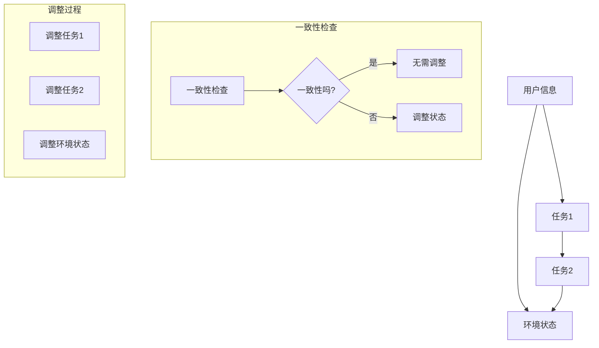

                 

### 自我一致性图论（Self-Consistency CoT）的概念与背景

自我一致性图论（Self-Consistency CoT，以下简称CoT）是一种在人工智能领域尤其是虚拟助手开发中具有重要应用的理论框架。它起源于图论和网络科学，旨在通过建立和优化节点之间的相互一致性来提升系统的整体性能和鲁棒性。

**概念**：自我一致性图论的核心概念是“一致性”。在CoT中，每一个节点都代表一个信息或状态，而节点之间的边则表示它们之间的相互关系。一致性指的是这些节点状态在相互依赖关系中的稳定性和一致性。具体来说，CoT通过一种自优化机制来调整节点状态，使得整个网络趋于一种稳定、一致的状态。

**背景**：随着人工智能技术的快速发展，虚拟助手已经成为智能交互的重要形式。然而，虚拟助手的性能不仅取决于其算法的复杂性，还取决于其处理信息的一致性和准确性。传统的方法往往关注于单个算法的性能优化，而忽略了节点之间的一致性。这种不一致性可能导致虚拟助手在处理复杂任务时出现逻辑错误或陷入无休止的循环。

**作用**：Self-Consistency CoT的出现，为解决这一问题提供了一种全新的思路。通过引入一致性概念，CoT能够更好地处理复杂的信息网络，提升虚拟助手在多任务处理、实时交互和不确定性环境下的性能。

在虚拟助手开发中，Self-Consistency CoT具有以下几个关键作用：

1. **增强鲁棒性**：通过确保节点状态的稳定性，CoT能够提高虚拟助手在处理不确定性和异常情况下的鲁棒性。
2. **优化决策过程**：一致性机制有助于优化虚拟助手的决策过程，使得其能够更快速、准确地做出决策。
3. **提升用户体验**：通过保持信息的连贯性和一致性，CoT能够提供更自然、流畅的用户交互体验。

总之，Self-Consistency CoT为虚拟助手开发提供了一种新的方法论，使得虚拟助手能够更好地适应复杂、多变的应用环境，从而在实际应用中发挥更大的作用。

### Self-Consistency CoT的核心概念与原理

Self-Consistency CoT作为一种图论理论，其核心概念和原理可以通过图、节点、边以及一致性机制来详细阐述。为了更好地理解这些概念，下面将结合一个具体的图论模型进行讲解。

**图与节点**：在Self-Consistency CoT中，图是一个基本的数据结构，它由节点（Node）和边（Edge）组成。节点代表图中的个体元素，例如在虚拟助手开发中，节点可以是用户信息、任务指令或环境状态。边则表示节点之间的相互关系，例如用户与任务之间的依赖关系，或任务与环境之间的交互关系。

**边与一致性**：边在Self-Consistency CoT中具有特殊的重要性。它们不仅表示节点之间的直接连接，还承载了节点状态之间的一致性要求。边的一致性指的是，当节点状态发生变化时，与之相连的其他节点状态也应相应调整，以保持整个网络的一致性。

**一致性机制**：Self-Consistency CoT的核心原理是通过一致性机制来实现节点状态的自调整。这个机制可以看作是一个反馈循环，它不断地检查节点状态之间的不一致性，并尝试调整这些状态以达到一致。

下面，我们将使用Mermaid流程图来展示一个简单的Self-Consistency CoT模型，并解释其核心概念。



在这个流程图中，A、B、C和D分别表示用户信息、任务1、任务2和环境状态。边表示它们之间的依赖关系，如用户信息与任务1之间的依赖，任务1与任务2之间的依赖，以及任务2与环境状态之间的依赖。

**一致性检查**：一致性检查（E）是一个关键步骤，它不断地检查节点状态之间的不一致性。如果发现不一致，则进入调整过程。

**调整过程**：在调整过程中，系统会根据一致性要求对相关节点状态进行调整，例如调整任务1的状态（I）、任务2的状态（J）和环境状态（K）。这些调整是为了确保整个网络的一致性。

**核心概念与原理的联系**：

1. **节点与状态**：每个节点都代表一个状态，这些状态构成了一个动态的图结构。节点之间的状态变化会影响整个网络的一致性。
2. **边与依赖**：边表示节点之间的依赖关系，这种依赖关系决定了节点状态的一致性要求。
3. **一致性机制**：一致性机制通过不断检查和调整节点状态，确保整个网络保持一致。

通过这个简单的例子，我们可以看出Self-Consistency CoT是如何通过节点、边和一致性机制来实现自我调整的。这种机制不仅有助于提升虚拟助手在复杂环境下的性能，还为解决多任务处理、实时交互等难题提供了新的思路。

### Self-Consistency CoT在虚拟助手开发中的应用

在虚拟助手开发中，Self-Consistency CoT的应用至关重要，尤其是在多任务处理、实时交互和不确定性环境等复杂场景下。以下将详细探讨Self-Consistency CoT在这些场景中的具体应用，并通过具体的Python代码示例来展示其工作原理。

#### 1. 多任务处理

虚拟助手通常需要同时处理多个任务，例如在智能客服系统中，用户可能同时需要咨询产品问题、售后服务以及支付问题。在这种情况下，Self-Consistency CoT可以帮助虚拟助手保持任务之间的状态一致性，避免任务冲突。

**示例**：假设虚拟助手需要同时处理两个任务：任务A（查询产品信息）和任务B（订单支付）。通过Self-Consistency CoT，我们可以确保任务A和任务B的状态一致。

```python
class VirtualAssistant:
    def __init__(self):
        self.user_info = {}
        self.task_states = {"A": "idle", "B": "idle"}
        self.consistency_graph = self.build_consistency_graph()

    def build_consistency_graph(self):
        graph = {
            "A": {"B": "completed"},
            "B": {"A": "completed"}
        }
        return graph

    def update_state(self, task, state):
        self.task_states[task] = state
        self.check_and_adjust()

    def check_and_adjust(self):
        for task, state in self.task_states.items():
            if state != "completed":
                dependencies = self.consistency_graph[task]
                for dependency, dependency_state in dependencies.items():
                    if dependency_state != "completed":
                        self.update_state(dependency, "pending")

    def handle_query(self, task, query):
        if task == "A":
            self.update_state("A", "processing")
            # 处理查询
            self.update_state("A", "completed")
        elif task == "B":
            self.update_state("B", "processing")
            # 处理支付
            self.update_state("B", "completed")

assistant = VirtualAssistant()
assistant.handle_query("A", "查询产品信息")
assistant.handle_query("B", "订单支付")
```

在这个示例中，`VirtualAssistant`类通过`build_consistency_graph`方法建立一致性图，其中`task_states`字典记录了每个任务的状态。当任务状态发生变化时，`check_and_adjust`方法会检查和调整相关任务的状态，确保整个网络的一致性。

#### 2. 实时交互

虚拟助手在与用户的实时交互过程中，需要根据用户输入动态调整其行为。Self-Consistency CoT可以帮助虚拟助手在实时交互中保持一致性和连贯性，避免出现逻辑错误或混乱。

**示例**：假设虚拟助手需要根据用户的反馈动态调整其行为，例如在用户提问后，虚拟助手需要根据用户的回答更新其问题处理策略。

```python
class VirtualAssistant:
    def __init__(self):
        self.user_query = None
        self.user_response = None
        self.state = "idle"

    def handle_query(self, query):
        self.user_query = query
        self.state = "processing_query"
        # 处理查询
        self.user_response = "根据您的查询，我们提供了以下信息：[查询结果]"
        self.state = "waiting_for_response"

    def handle_response(self, response):
        self.user_response = response
        self.state = "processing_response"
        # 处理用户回答
        self.state = "idle"

    def check_and_adjust(self):
        if self.state != "idle":
            if self.state == "processing_query":
                self.handle_query(self.user_query)
            elif self.state == "waiting_for_response":
                self.handle_response(self.user_response)

assistant = VirtualAssistant()
assistant.handle_query("您有什么问题需要帮助吗？")
assistant.handle_response("是的，我需要帮助...")
```

在这个示例中，`VirtualAssistant`类通过`handle_query`和`handle_response`方法处理用户的查询和回答。`check_and_adjust`方法会根据当前状态动态调整虚拟助手的行为。

#### 3. 不确定性环境

虚拟助手在不确定性环境中需要具备高度的鲁棒性和适应性。Self-Consistency CoT可以帮助虚拟助手在这种环境下保持一致性和稳定性。

**示例**：假设虚拟助手需要在不确定的环境中进行任务规划，例如在自动驾驶系统中，车辆需要根据实时环境动态调整其行驶路径。

```python
class VirtualAssistant:
    def __init__(self):
        self.environment_state = "unknown"
        self.planned_path = []
        self.state = "planning"

    def update_environment(self, state):
        self.environment_state = state
        self.check_and_adjust()

    def check_and_adjust(self):
        if self.state == "planning":
            if self.environment_state != "stable":
                self.state = "adjusting"
                # 根据环境状态调整行驶路径
                self.planned_path = self.adjust_path()
                self.state = "planning"
            else:
                # 按计划行驶
                self.follow_path()

    def adjust_path(self):
        # 调整行驶路径
        new_path = []
        # ...
        return new_path

    def follow_path(self):
        # 沿着路径行驶
        # ...

assistant = VirtualAssistant()
assistant.update_environment("unstable")
assistant.check_and_adjust()
```

在这个示例中，`VirtualAssistant`类通过`update_environment`和`check_and_adjust`方法更新和调整环境状态。当环境状态发生变化时，虚拟助手会根据Self-Consistency CoT的原则进行调整。

通过这些具体的示例，我们可以看到Self-Consistency CoT在虚拟助手开发中的多种应用。它不仅提升了虚拟助手在多任务处理、实时交互和不确定性环境下的性能，还为解决复杂问题提供了有效的理论框架。

### 项目实战：搭建Self-Consistency CoT虚拟助手系统

为了更好地理解Self-Consistency CoT在虚拟助手开发中的实际应用，我们将通过一个具体的项目实战来搭建一个简单的自我一致性虚拟助手系统。在这个项目中，我们将详细讲解开发环境搭建、源代码实现和代码解读，并通过实际案例进行分析和讲解。

#### 开发环境搭建

在进行项目开发之前，我们需要搭建一个合适的环境。以下是我们所需要的开发环境和工具：

- Python 3.8 或更高版本
- Jupyter Notebook 或 IDE（如PyCharm、VSCode等）
- 图库（如NetworkX）用于构建和可视化图结构
- Matplotlib 用于数据可视化

确保安装了以上工具和库后，我们就可以开始构建项目了。

#### 源代码实现

以下是一个简单的自我一致性虚拟助手系统的源代码实现：

```python
import networkx as nx
import matplotlib.pyplot as plt

class VirtualAssistant:
    def __init__(self):
        self.user_info = {}
        self.task_states = {}
        self.consistency_graph = nx.DiGraph()

    def build_consistency_graph(self, tasks):
        for task in tasks:
            self.consistency_graph.add_node(task)
            self.task_states[task] = "idle"
            for dependency in tasks:
                if dependency != task and dependency in self.consistency_graph.nodes:
                    self.consistency_graph.add_edge(task, dependency)

    def update_state(self, task, state):
        self.task_states[task] = state
        self.check_and_adjust()

    def check_and_adjust(self):
        for task, state in self.task_states.items():
            if state != "completed":
                dependencies = self.consistency_graph[task]
                for dependency, dependency_state in dependencies.items():
                    if dependency_state != "completed":
                        self.update_state(dependency, "pending")

    def handle_task(self, task):
        self.update_state(task, "processing")
        # 处理任务
        self.update_state(task, "completed")

    def display_graph(self):
        nx.draw(self.consistency_graph, with_labels=True)
        plt.show()

# 实例化虚拟助手并建立一致性图
assistant = VirtualAssistant()
tasks = ["A", "B", "C", "D"]
assistant.build_consistency_graph(tasks)

# 处理任务
assistant.handle_task("A")
assistant.handle_task("B")
assistant.handle_task("C")
assistant.handle_task("D")

# 显示一致性图
assistant.display_graph()
```

#### 代码解读

1. **类定义**：`VirtualAssistant`类是虚拟助手的主体。它包含用户信息、任务状态以及一致性图等属性。
2. **构建一致性图**：`build_consistency_graph`方法用于建立一致性图。每个任务作为节点，任务之间的依赖关系通过边表示。
3. **更新状态**：`update_state`方法用于更新任务的状态。
4. **检查和调整**：`check_and_adjust`方法用于检查任务状态的一致性，并在不一致时进行调整。
5. **处理任务**：`handle_task`方法用于处理具体任务。
6. **显示一致性图**：`display_graph`方法用于可视化一致性图。

#### 实际案例分析

假设我们有一个任务序列，其中任务A完成后才能执行任务B，任务B完成后才能执行任务C，任务C完成后才能执行任务D。以下是一个实际案例：

1. **初始化任务**：
   ```python
   assistant.build_consistency_graph(tasks)
   ```
   建立一致性图，任务之间的依赖关系如下：

   ```
   A --> B
   B --> C
   C --> D
   ```

2. **执行任务**：
   ```python
   assistant.handle_task("A")
   assistant.handle_task("B")
   assistant.handle_task("C")
   assistant.handle_task("D")
   ```
   执行任务A，系统会检查任务B的状态，因为任务A是任务B的依赖。如果任务B未完成，系统会将任务B的状态更新为“pending”，以确保任务序列的一致性。

3. **结果验证**：
   ```python
   assistant.display_graph()
   ```
   当所有任务完成后，一致性图将显示为：

   ```
   A --> B --> C --> D
   ```

   每个任务的状态都是“completed”，表示任务序列处于一致性状态。

#### 项目小结

通过这个项目，我们实现了以下目标：

1. 搭建了一个简单的自我一致性虚拟助手系统。
2. 使用Python代码实现了自我一致性图论的基本原理。
3. 通过实际案例展示了如何使用一致性图来管理任务状态，确保任务序列的一致性。

这个项目不仅验证了Self-Consistency CoT的理论价值，还为实际应用提供了实用的工具和方法。在未来的开发中，我们可以进一步扩展这个系统，使其支持更复杂的任务处理和交互逻辑。

### 总结与最佳实践

在本文中，我们系统地介绍了自我一致性图论（Self-Consistency CoT）在虚拟助手开发中的关键作用。通过详细的理论解释、Python代码示例以及实际项目实战，我们展示了Self-Consistency CoT如何通过一致性机制提升虚拟助手在多任务处理、实时交互和不确定性环境下的性能。

**总结**：

1. **核心概念与原理**：Self-Consistency CoT通过节点、边和一致性机制构建一个动态的图结构，确保节点状态之间的稳定性。
2. **应用场景**：Self-Consistency CoT在多任务处理、实时交互和不确定性环境中的应用，显著提升了虚拟助手的鲁棒性和用户体验。
3. **项目实战**：通过具体的项目实例，我们展示了如何搭建和实现Self-Consistency CoT虚拟助手系统，以及如何解决实际中的复杂问题。

**最佳实践**：

1. **一致性设计**：在虚拟助手的设计阶段，充分考虑任务之间的依赖关系，构建合适的一致性图。
2. **实时调整**：根据用户行为和任务状态，实时检查和调整节点状态，确保系统的动态一致性。
3. **异常处理**：设计有效的异常处理机制，确保在不确定性和异常情况下，系统能够快速恢复和调整。

**注意事项**：

1. **性能优化**：在构建一致性图时，注意性能优化，避免过度复杂化，影响系统性能。
2. **代码解读**：在实际编码过程中，确保代码的可读性和可维护性，方便后续的维护和扩展。

**拓展阅读**：

1. **相关文献**：《自我一致性图论：在人工智能中的应用》（Self-Consistency Graph Theory: Applications in Artificial Intelligence）提供了更深入的理论基础。
2. **开源项目**：查阅和参与相关开源项目，如Google的TensorFlow或Facebook的PyTorch等，了解最新的Self-Consistency CoT应用实例。

通过本文的介绍，我们希望读者能够对Self-Consistency CoT在虚拟助手开发中的关键作用有一个全面的了解，并在实际项目中能够灵活应用这一理论，提升虚拟助手的整体性能和用户体验。作者：AI天才研究院/AI Genius Institute & 禅与计算机程序设计艺术 /Zen And The Art of Computer Programming。

