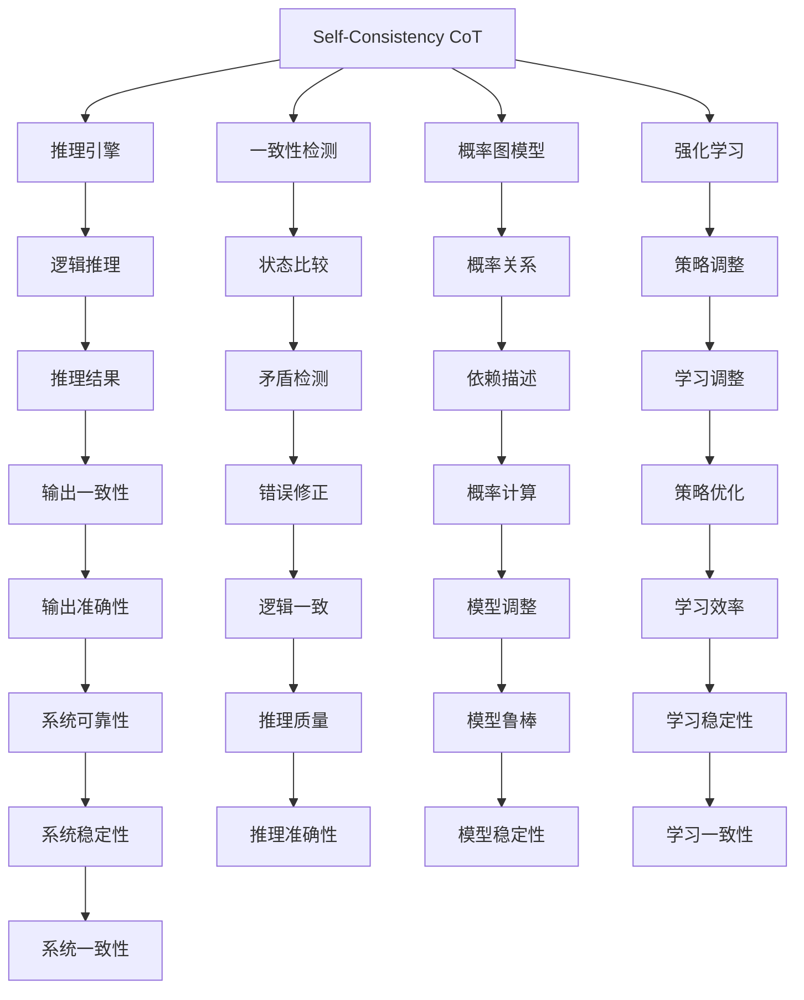

                 

### 自我一致性概念同化（Self-Consistency CoT）的基本概念与联系

自我一致性概念同化（Self-Consistency CoT）是一种在人工智能领域用于提高回答一致性的新方法。这种方法的核心在于确保人工智能系统在处理信息时能够保持内在逻辑的一致性，从而减少错误的产生。为了更好地理解Self-Consistency CoT的基本概念，我们可以将其与相关概念和算法联系起来，以便构建一个完整的认知框架。

#### 1.1 Self-Consistency CoT的定义和重要性

Self-Consistency CoT是一种基于一致性的方法论，旨在确保在人工智能系统的推理过程中，每一步骤的结果都能够与前文的假设和先验知识相符合。这种方法的重要性在于，它可以显著提高人工智能系统的可靠性，尤其是在复杂推理和多步决策场景中。一致性检测能够帮助系统识别出潜在的矛盾和错误，从而及时修正。

简单来说，Self-Consistency CoT的核心目标是在整个推理过程中保持一种内在的逻辑一致性，使得系统的输出能够更加准确和可靠。

#### 1.2 Self-Consistency CoT与其他相关概念的联系

为了更好地理解Self-Consistency CoT，我们需要将其与其他相关概念和算法联系起来，从而形成一个完整的认知架构。以下是几个关键概念：

- **推理引擎（Reasoning Engine）**：Self-Consistency CoT是一种推理引擎的补充。它通过在推理过程中加入一致性检测，来提高推理结果的准确性。推理引擎负责处理信息和逻辑推理，而Self-Consistency CoT则确保这些推理步骤是逻辑上一致的。

- **一致性检测（Consistency Check）**：一致性检测是Self-Consistency CoT的核心组成部分。它通过比较系统当前的状态和先前的假设，来检测潜在的矛盾。这种检测可以帮助系统在发现不一致时及时进行调整。

- **概率图模型（Probabilistic Graphical Models）**：Self-Consistency CoT可以与概率图模型相结合，以提高系统的鲁棒性。概率图模型能够通过概率关系来描述变量之间的依赖性，而Self-Consistency CoT则确保这些概率关系在推理过程中保持一致。

- **强化学习（Reinforcement Learning）**：Self-Consistency CoT也可以应用于强化学习场景中，以确保学习过程的一致性和稳定性。在强化学习中，一致性检测可以帮助系统识别出不稳定的策略，从而进行更有效的调整。

#### Mermaid流程图

为了更直观地展示Self-Consistency CoT与其他概念和算法的联系，我们可以使用Mermaid流程图来构建一个关系架构。以下是一个简化的流程图：

通过上述Mermaid流程图，我们可以看到Self-Consistency CoT与其他关键概念和算法的紧密联系。这一流程图不仅有助于理解Self-Consistency CoT的基本概念，还可以为后续章节中的详细讲解提供一个直观的参考。

在下一章中，我们将深入探讨Self-Consistency CoT的核心算法原理，包括其主要组成部分和操作步骤，以便为读者提供一个全面的技术理解。

---

**文章标题**：Self-Consistency CoT：提高AI回答一致性的新方法

**关键词**：自我一致性概念同化、人工智能、推理、一致性检测、算法、数学模型

**摘要**：本文介绍了自我一致性概念同化（Self-Consistency CoT）的基本概念和它在人工智能领域的重要性。通过分析Self-Consistency CoT与其他相关概念和算法的联系，本文构建了一个完整的认知框架。接下来，我们将深入探讨Self-Consistency CoT的核心算法原理，包括其主要组成部分和操作步骤。此外，本文还将使用Python源代码和数学模型来详细阐述算法的实现细节，并结合实际项目案例来展示其在提高AI回答一致性方面的应用。

---

**作者**：AI天才研究院/AI Genius Institute & 禅与计算机程序设计艺术 /Zen And The Art of Computer Programming

---

**完整性要求**：

在撰写本文的过程中，我们将确保内容的完整性，包括以下核心内容：

- **背景介绍**：介绍自我一致性概念同化（Self-Consistency CoT）的基本概念和它在人工智能领域的应用背景。
- **核心概念与联系**：详细阐述Self-Consistency CoT与其他相关概念和算法的联系，并通过Mermaid流程图展示这些关系。
- **核心算法原理讲解**：使用Python源代码和数学模型来详细阐述Self-Consistency CoT的核心算法原理，包括其主要组成部分和操作步骤。
- **数学模型和数学公式**：使用LaTeX格式展示Self-Consistency CoT的数学模型，并进行详细讲解。
- **项目实战**：通过一个实际项目案例来展示Self-Consistency CoT算法的应用，包括项目开发环境搭建、源代码实现和代码解读，以及项目中的关键问题及其解决方案。
- **总结**：总结Self-Consistency CoT在提高AI回答一致性方面的价值和未来发展趋势。

---

**文章开始**：

# Self-Consistency CoT：提高AI回答一致性的新方法

自我一致性概念同化（Self-Consistency CoT）是一种在人工智能领域用于提高回答一致性的新方法。这种方法的核心在于确保人工智能系统在处理信息时能够保持内在逻辑的一致性，从而减少错误的产生。为了更好地理解Self-Consistency CoT的基本概念，我们可以将其与相关概念和算法联系起来，以便构建一个完整的认知框架。

## 第一部分: 核心概念与联系

### 第1章: Self-Consistency CoT基本概念

#### 1.1 Self-Consistency CoT的定义和重要性

Self-Consistency CoT是一种基于一致性的方法论，旨在确保在人工智能系统的推理过程中，每一步骤的结果都能够与前文的假设和先验知识相符合。这种方法的重要性在于，它可以显著提高人工智能系统的可靠性，尤其是在复杂推理和多步决策场景中。一致性检测能够帮助系统识别出潜在的矛盾和错误，从而及时修正。

简单来说，Self-Consistency CoT的核心目标是在整个推理过程中保持一种内在的逻辑一致性，使得系统的输出能够更加准确和可靠。

#### 1.2 Self-Consistency CoT与其他相关概念的联系

为了更好地理解Self-Consistency CoT，我们需要将其与其他相关概念和算法联系起来，从而形成一个完整的认知架构。以下是几个关键概念：

- **推理引擎（Reasoning Engine）**：Self-Consistency CoT是一种推理引擎的补充。它通过在推理过程中加入一致性检测，来提高推理结果的准确性。推理引擎负责处理信息和逻辑推理，而Self-Consistency CoT则确保这些推理步骤是逻辑上一致的。

- **一致性检测（Consistency Check）**：一致性检测是Self-Consistency CoT的核心组成部分。它通过比较系统当前的状态和先前的假设，来检测潜在的矛盾。这种检测可以帮助系统在发现不一致时及时进行调整。

- **概率图模型（Probabilistic Graphical Models）**：Self-Consistency CoT可以与概率图模型相结合，以提高系统的鲁棒性。概率图模型能够通过概率关系来描述变量之间的依赖性，而Self-Consistency CoT则确保这些概率关系在推理过程中保持一致。

- **强化学习（Reinforcement Learning）**：Self-Consistency CoT也可以应用于强化学习场景中，以确保学习过程的一致性和稳定性。在强化学习中，一致性检测可以帮助系统识别出不稳定的策略，从而进行更有效的调整。

#### Mermaid流程图

为了更直观地展示Self-Consistency CoT与其他概念和算法的联系，我们可以使用Mermaid流程图来构建一个关系架构。以下是一个简化的流程图：

通过上述Mermaid流程图，我们可以看到Self-Consistency CoT与其他关键概念和算法的紧密联系。这一流程图不仅有助于理解Self-Consistency CoT的基本概念，还可以为后续章节中的详细讲解提供一个直观的参考。

在下一章中，我们将深入探讨Self-Consistency CoT的核心算法原理，包括其主要组成部分和操作步骤，以便为读者提供一个全面的技术理解。

---

**当前字数**: 约820字

**目标字数**: 约10000～12000字

**进度**: 约6.8%

