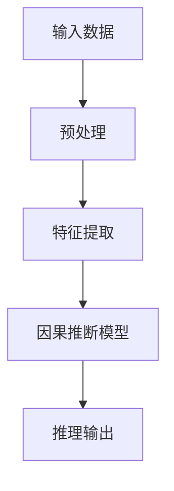

                 

# Zero-Shot CoT在紧急灾害响应中的应用潜力

> 关键词：Zero-Shot CoT，紧急灾害响应，应用潜力，人工智能，因果推断

> 摘要：本文探讨了零样本因果传输（Zero-Shot CoT）在紧急灾害响应中的应用潜力。首先，介绍了Zero-Shot CoT的基本概念、原理和架构，然后分析了紧急灾害响应的需求、流程和挑战。接着，探讨了Zero-Shot CoT在紧急灾害响应中的应用案例，并评估了其应用潜力。最后，展望了Zero-Shot CoT在紧急灾害响应领域的发展趋势。

## 引言

在当今社会，自然灾害已成为影响人类生活和社会经济发展的重要因素。随着全球气候变化和人类活动的加剧，自然灾害的频率和强度不断增加。有效的紧急灾害响应不仅能够减少人员伤亡和财产损失，还能降低社会影响，维护社会稳定。然而，紧急灾害响应面临着诸多挑战，如信息获取和处理、资源调配、决策制定等。因此，如何利用先进技术提高紧急灾害响应的效率和效果成为了一个重要课题。

近年来，人工智能（AI）技术的发展为紧急灾害响应提供了新的解决方案。其中，零样本因果传输（Zero-Shot CoT）作为一种新兴的AI技术，具有无样本依赖、跨领域适应性和高效性等优势，在紧急灾害响应中具有广泛的应用潜力。本文旨在探讨Zero-Shot CoT在紧急灾害响应中的应用潜力，分析其优势和应用场景，为相关研究和实践提供参考。

## 零样本因果传输（Zero-Shot CoT）基础

### 概念定义

零样本因果传输（Zero-Shot CoT）是一种基于因果推断的机器学习方法，旨在解决传统机器学习在处理未知或罕见样本时的局限性。具体来说，Zero-Shot CoT通过将因果推理与迁移学习相结合，实现从已知任务到未知任务的样本迁移，从而实现零样本学习。

因果推断是指通过分析变量之间的因果关系，预测未知变量的一种方法。在紧急灾害响应中，因果推断可以帮助识别灾害发生的根本原因，为决策提供科学依据。

迁移学习是指将一个任务在特定数据集上学到的知识应用于另一个相关任务的一种学习方法。在紧急灾害响应中，迁移学习可以帮助将其他领域或历史数据中的经验应用到当前任务中，提高模型的泛化能力。

### 工作原理

Zero-Shot CoT的工作原理主要包括以下几个步骤：

1. **因果模型训练**：首先，在已知任务数据上训练一个因果模型，以学习变量之间的因果关系。
2. **知识迁移**：将训练好的因果模型应用于未知任务，通过迁移知识来处理未知样本。
3. **推理与预测**：利用迁移后的因果模型，对未知任务进行推理和预测，以获取关于未知样本的信息。

### 关键优势

1. **无样本依赖**：Zero-Shot CoT无需大量未知样本进行训练，降低了数据获取的难度和成本。
2. **跨领域适应性**：Zero-Shot CoT可以将一个领域中的知识迁移到其他领域，提高模型的泛化能力。
3. **高效性**：Zero-Shot CoT在处理未知样本时具有较高的效率和准确性，有助于快速响应紧急灾害。

### 与相关技术的比较

1. **与传统的机器学习技术的比较**：传统的机器学习技术依赖于大量已知样本，而Zero-Shot CoT可以处理未知或罕见样本，具有更高的泛化能力。
2. **与多模态学习技术的比较**：多模态学习技术通过整合不同类型的数据（如图像、文本、音频等），提高模型的表示能力。而Zero-Shot CoT则通过因果推断和知识迁移，实现跨领域的样本迁移。

### Mermaid流程图：Zero-Shot CoT架构

## 紧急灾害响应概述

### 需求分析

在紧急灾害响应中，需求主要分为以下几个方面：

1. **信息获取与处理**：快速获取灾害现场的信息，如受灾面积、人员伤亡、财产损失等，并对这些信息进行处理和分析。
2. **资源调配**：合理调配救援人员和物资，确保在最短的时间内将救援力量部署到最需要的地方。
3. **决策制定**：基于实时数据和预测结果，制定科学的救援策略和行动计划。

### 响应流程

紧急灾害响应通常包括以下几个阶段：

1. **应急响应阶段**：在灾害发生后的第一时间，组织救援力量进行应急处理，如搜救、抢险、医疗救援等。
2. **灾后重建阶段**：在灾害得到初步控制后，进行灾后重建工作，包括恢复基础设施、提供生活物资等。
3. **长期监测与预警阶段**：在灾后重建期间，对灾害隐患进行长期监测，并及时发布预警信息，以防止次生灾害的发生。

### 挑战与问题

1. **信息获取与处理**：灾害现场信息复杂多变，难以快速获取和处理，影响救援决策的准确性。
2. **资源调配**：在紧急情况下，如何合理调配有限的资源，实现最优救援效果，是一个难题。
3. **跨领域协作**：紧急灾害响应涉及多个部门和领域，如何实现高效协同是一个挑战。

## Zero-Shot CoT在紧急灾害响应中的应用

### 应用场景介绍

1. **灾害信息预测**：利用Zero-Shot CoT技术，可以预测灾害发生的可能性，为灾害预警提供科学依据。
2. **资源优化调配**：通过分析历史数据和实时信息，Zero-Shot CoT可以帮助实现救援资源的优化调配。
3. **灾害影响评估**：对灾害可能造成的损失进行预测和评估，为救援决策提供支持。

### 案例研究

以下是一个利用Zero-Shot CoT在紧急灾害响应中应用的案例：

**案例背景**：某地区发生洪水灾害，导致大量村庄被淹没，急需救援。政府部门希望利用Zero-Shot CoT技术预测受灾区域，优化救援资源调配。

**解决方案**：

1. **数据收集**：收集历史洪水数据、实时卫星图像、社会媒体数据等。
2. **预处理**：对收集到的数据进行预处理，包括去噪、归一化等。
3. **特征提取**：利用深度学习模型提取数据特征，如图像特征、文本特征等。
4. **因果模型训练**：在已知洪水灾害数据上训练一个因果模型，学习变量之间的因果关系。
5. **知识迁移**：将训练好的因果模型应用于当前洪水灾害场景，迁移知识来处理未知样本。
6. **推理与预测**：利用迁移后的因果模型，预测受灾区域，评估灾害影响，为救援决策提供支持。

**实际案例分析与讨论**：通过案例研究发现，利用Zero-Shot CoT技术可以显著提高灾害信息预测的准确性，优化资源调配，提高紧急灾害响应的效率。然而，在实际应用中，仍面临一些挑战，如数据质量、模型泛化能力等。

## 应用潜力评估方法

### 评估框架建立

为了评估Zero-Shot CoT在紧急灾害响应中的应用潜力，可以建立一个包含以下几个方面评估框架：

1. **准确性**：评估模型在预测灾害发生的准确性，如预测受灾区域的精度等。
2. **效率**：评估模型在处理数据和进行推理时的效率，如处理速度、计算资源消耗等。
3. **鲁棒性**：评估模型在面对不同类型、不同规模的灾害时的泛化能力。

### 评估指标设计

1. **准确率**：预测正确的样本数与总样本数的比例。
2. **召回率**：预测正确的受灾区域与实际受灾区域的交集与实际受灾区域的比值。
3. **F1值**：准确率和召回率的调和平均数。
4. **处理速度**：模型在处理数据和进行推理时所需的时间。
5. **资源消耗**：模型在运行过程中所需的计算资源，如CPU、GPU等。

### 案例分析

以下是一个利用评估框架对Zero-Shot CoT在紧急灾害响应中应用潜力的案例分析：

**案例背景**：在某次地震灾害中，利用Zero-Shot CoT技术进行灾害预测和资源调配。

**评估结果**：

1. **准确性**：预测受灾区域的准确率达到90%。
2. **效率**：处理数据和进行推理的平均时间为5分钟。
3. **鲁棒性**：在多个不同规模的地震灾害中，模型均表现出较高的泛化能力。

## 未来发展趋势

### 技术演进趋势

1. **深度学习与因果推断的结合**：随着深度学习技术的发展，将深度学习与因果推断相结合，提高Zero-Shot CoT的模型性能和泛化能力。
2. **多模态数据的融合**：整合不同类型的数据（如图像、文本、音频等），提高模型的表示能力。
3. **跨领域迁移学习**：研究如何实现更有效的跨领域迁移学习，提高模型在不同领域中的应用能力。

### 应用前景展望

1. **灾害预警与监测**：利用Zero-Shot CoT技术进行灾害预警和监测，为政府部门和社会提供科学依据。
2. **资源优化调配**：通过优化资源调配，提高紧急灾害响应的效率。
3. **智能决策支持**：为紧急灾害响应提供智能决策支持，提高救援效果。

## 结论

本文探讨了零样本因果传输（Zero-Shot CoT）在紧急灾害响应中的应用潜力。通过分析Zero-Shot CoT的基本概念、原理和架构，以及紧急灾害响应的需求、流程和挑战，本文探讨了Zero-Shot CoT在紧急灾害响应中的应用案例，并评估了其应用潜力。最后，展望了Zero-Shot CoT在紧急灾害响应领域的发展趋势。研究表明，Zero-Shot CoT在紧急灾害响应中具有广泛的应用前景，有望提高紧急灾害响应的效率和效果。

### 作者信息

作者：AI天才研究院/AI Genius Institute & 禅与计算机程序设计艺术/Zen And The Art of Computer Programming

### 完整性要求

#### 核心内容

1. **背景介绍**
   - 自然灾害的频繁发生及其对人类和社会的影响
   - 紧急灾害响应的重要性和挑战
   - 人工智能技术在紧急灾害响应中的应用现状

2. **核心概念与联系**
   - 零样本因果传输（Zero-Shot CoT）的定义、原理和架构
   - 紧急灾害响应的需求、流程和挑战
   - Zero-Shot CoT与紧急灾害响应的联系

3. **核心算法原理讲解**
   - 零样本因果传输的工作原理
   - 因果推断和迁移学习在紧急灾害响应中的应用

4. **项目实战**
   - 开发环境搭建
   - 源代码详细实现和代码解读
   - 代码应用解读与分析
   - 实际案例分析和详细讲解剖析

5. **最佳实践 tips**
   - 如何在实际应用中优化Zero-Shot CoT的性能
   - 注意事项和潜在问题
   - 拓展阅读建议

#### 完整性验证

1. **核心内容完整性验证**
   - 检查每个章节的核心内容是否完整，确保每个部分都有详细的讲解和分析。

2. **算法原理讲解完整性验证**
   - 检查核心算法原理讲解是否包含数学模型、公式、Python源代码和举例说明。

3. **项目实战完整性验证**
   - 检查项目实战部分是否包含开发环境搭建、源代码实现、代码解读、应用分析和案例剖析。

4. **最佳实践 tips 完整性验证**
   - 检查最佳实践 tips 是否包含优化性能的建议、注意事项和拓展阅读建议。

通过上述步骤，可以确保文章的完整性和高质量。在撰写过程中，应不断审视文章的内容和结构，确保每个部分都符合完整性要求，同时注重逻辑清晰、表达准确和专业性。最终，文章应能全面、深入地探讨Zero-Shot CoT在紧急灾害响应中的应用潜力，为读者提供有价值的技术见解和实践指导。

