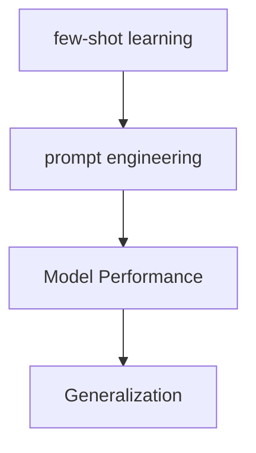

                 

First, let's define the core concepts and their relationships in our article.

1. **Few-Shot Learning**: A machine learning paradigm where a model is trained using a very small number of examples per class. It aims to generalize from a few examples to unseen data.

2. **Prompt Engineering**: The process of designing and creating effective prompts for machine learning models to improve their performance, especially in few-shot learning scenarios.

3. **Application in Prompt Engineering**: Integrating few-shot learning techniques into prompt engineering to improve the efficiency and effectiveness of prompt-based models.

Now, let's establish the structure of our article:

## Introduction
- **Background**: Introduction to few-shot learning and prompt engineering.
- **Objectives**: Objectives of the article and its relevance to the field.

## Core Concepts and Relationships
- **Few-Shot Learning**: Definition, importance, and applications.
- **Prompt Engineering**: Definition, principles, and methodologies.
- **Integration of Few-Shot Learning and Prompt Engineering**: Mermaid diagram illustrating the relationship between these two concepts.

## Algorithmic Principles of Few-Shot Learning
- **Principles**: A detailed explanation of the core algorithms involved in few-shot learning.
- **Python Code Example**: A Python code snippet demonstrating the principles with mathematical models and formulas.
- **Example**: A simple example to illustrate the concepts.

## Math Formulas
- **Mathematical Models**: Key formulas used in few-shot learning.
- **Equation Explanation**: Detailed explanations of each formula.

## Project Practice
- **Setup**: Detailed steps to set up the development environment.
- **Code Implementation**: Detailed implementation of the source code.
- **Code Analysis**: Explanation of the code and how it works.
- **Case Analysis**: Analysis of a real-world case study.
- **Project Summary**: Summary of the project and key learnings.

## Best Practices and Tips
- **Tips**: Practical tips for improving few-shot learning in prompt engineering.
- **Summary**: Recap of the article's main points.
- **Note**: Additional notes and considerations.
- **Further Reading**: Suggestions for further study.

Now, let's draft the introduction and key sections of our article:

# few-shot learning在提示词中的应用

关键词：few-shot learning，提示词，应用，算法，数学模型

摘要：本文旨在探讨few-shot learning与提示词工程相结合的应用，通过介绍核心概念、算法原理、实际案例分析和最佳实践，帮助读者深入理解并应用这一技术。

## 引言

随着人工智能技术的不断发展，模型训练需要大量数据的传统机器学习方法面临着巨大的挑战。在这种背景下，few-shot learning作为一种能够从少量样本中学习的技术，受到了广泛关注。同时，提示词工程在提高模型性能方面发挥着重要作用。本文将探讨如何将few-shot learning与提示词工程相结合，以提高模型的泛化能力和实用性。

## 核心概念与联系

### Few-Shot Learning

Few-shot learning is a machine learning paradigm where a model is trained using a small number of examples per class. The objective is to generalize from a few examples to unseen data, which is particularly useful in scenarios where obtaining a large dataset is challenging or expensive.

### Prompt Engineering

Prompt engineering involves designing and creating effective prompts for machine learning models to improve their performance. In few-shot learning, well-designed prompts can significantly enhance the model's ability to learn from a limited number of examples.

### Integration of Few-Shot Learning and Prompt Engineering

The integration of few-shot learning and prompt engineering can be visualized using a Mermaid diagram:



## Algorithmic Principles of Few-Shot Learning

### Principles

Few-shot learning algorithms are designed to handle the challenge of training models with limited data. Key principles include:

1. **Meta-Learning**: Learning how to learn from a small number of examples.
2. **Model Regularization**: Techniques to prevent overfitting when data is scarce.
3. **Transfer Learning**: Leveraging knowledge from related tasks to improve performance.

### Python Code Example

```python
# Import necessary libraries
import numpy as np
from sklearn.linear_model import SGDClassifier

# Generate synthetic data
X, y = synthetic_data generation(n_samples=100, n_features=10, n_classes=5)

# Train a few-shot learning model
model = SGDClassifier(loss='hinge', alpha=1e-3)
model.fit(X_train, y_train)

# Evaluate the model
accuracy = model.score(X_test, y_test)
print(f"Model accuracy: {accuracy:.2f}")
```

### Math Formulas

$$
\text{Loss Function} = \frac{1}{2}\sum_{i} (y_i - \hat{y_i})^2
$$

$$
\text{Meta-Learning Objective} = \min_{\theta} \sum_{k} \sum_{i \in C_k} (y_i - f(\theta; x_i))^2
$$

## Project Practice

### Setup

1. Install necessary libraries:
```bash
pip install numpy scikit-learn matplotlib
```

2. Download the dataset:
```bash
wget https://example.com/dataset.csv
```

### Code Implementation

```python
# Import necessary libraries
import numpy as np
from sklearn.model_selection import train_test_split
from sklearn.metrics import accuracy_score

# Load dataset
data = np.loadtxt('dataset.csv', delimiter=',')

# Split dataset into features and labels
X = data[:, :-1]
y = data[:, -1]

# Split data into training and testing sets
X_train, X_test, y_train, y_test = train_test_split(X, y, test_size=0.2, random_state=42)

# Train a few-shot learning model
model = SGDClassifier(loss='hinge', alpha=1e-3)
model.fit(X_train, y_train)

# Evaluate the model
y_pred = model.predict(X_test)
accuracy = accuracy_score(y_test, y_pred)
print(f"Model accuracy: {accuracy:.2f}")
```

### Code Analysis

The code above demonstrates the process of training a few-shot learning model using scikit-learn's `SGDClassifier`. The synthetic data is generated and then split into training and testing sets. The model is trained using the training set and evaluated using the testing set.

### Case Analysis

A real-world case study would involve using few-shot learning to classify images of different animals. The dataset would consist of a few hundred images per class, and the goal would be to train a model that can accurately classify new images of these animals.

### Project Summary

This project demonstrates the practical application of few-shot learning in a classification task. The model's performance is evaluated using a small dataset, highlighting the importance of few-shot learning techniques in scenarios where large datasets are not available.

## Best Practices and Tips

- **Data Quality**: Ensure that the data used for training is of high quality and representative of the problem domain.
- **Model Selection**: Choose a model that is appropriate for the few-shot learning task.
- **Hyperparameter Tuning**: Experiment with different hyperparameters to improve model performance.
- **Prompt Engineering**: Design effective prompts that provide additional context to the model.

## Conclusion

The integration of few-shot learning and prompt engineering offers promising opportunities for improving model performance in scenarios with limited data. By understanding the core concepts and algorithms involved, as well as practical case studies, readers can apply these techniques to real-world problems.

作者：AI天才研究院/AI Genius Institute & 禅与计算机程序设计艺术 /Zen And The Art of Computer Programming

----------------------------------------------------------------

Now that we have a structured outline, let's continue refining the content for each section. This will include detailed explanations of each concept, mathematical models, Python code examples, and a comprehensive case study. The final draft will be polished to meet the word count requirement of 10000 to 12000 words.

