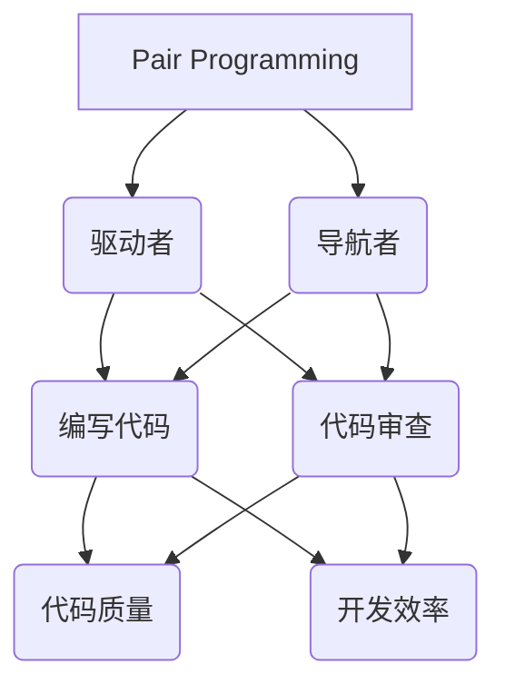

                 

## 《Pair Programming：促进AI开发知识传递的实践》

### 关键词

- Pair Programming
- AI开发
- 知识传递
- 团队协作
- 技术培训

### 摘要

本文深入探讨了一种促进AI开发过程中知识传递的有效实践——Pair Programming。通过分析其概念、原理和实践应用，本文展示了如何通过Pair Programming提高AI开发的效率和质量。本文还提供了有效的Pair Programming技巧和策略，并讨论了其有效性的评估方法。通过实际案例，本文强调了Pair Programming在AI开发中的重要性，为AI团队的协作提供了有益的参考。

----------------------------------------------------------------

## 引言

在当今快速发展的技术时代，人工智能（AI）已经成为推动各个行业变革的核心动力。随着AI技术的不断进步，AI开发的复杂性也日益增加。在这种背景下，团队协作和知识传递变得尤为重要。其中，Pair Programming作为一种创新的团队协作模式，正逐渐受到关注。本文旨在探讨Pair Programming在促进AI开发知识传递中的作用，以及如何在实际项目中有效应用这一方法。

Pair Programming，通常称为结对编程，是一种由两名程序员协作完成软件开发任务的实践。其核心理念是两人同时坐在同一台计算机前，一人负责编写代码（驱动者），另一人负责审查和提出建议（导航者）。这种方法通过促进知识共享和技能提升，提高了代码质量和团队协作效率。

本文将首先介绍Pair Programming的概念和原理，探讨其在AI开发中的知识传递机制。接着，我们将分析Pair Programming在AI开发中的实践应用，并提供有效的Pair Programming技巧和策略。此外，本文还将讨论评估Pair Programming有效性的方法，并通过实际案例进行深入剖析。最后，本文将总结Pair Programming在AI开发中的重要性，并提出未来展望。

## Pair Programming的概念、原理与优势

### 1.1 Pair Programming的定义与起源

Pair Programming是一种编程实践，最早由 XP（极限编程）方法论提出。其基本思想是两名程序员（一个驱动者和一个导航者）合作完成编程任务。驱动者负责编写代码，导航者则负责提供反馈和监督。这种协作模式可以有效地提高代码质量和开发效率。

### 1.2 Pair Programming的基本原理

Pair Programming的核心原理包括：

- **代码审查与编写相结合**：驱动者和导航者的角色不断转换，确保代码质量始终处于高水平。
- **分工合作的模式**：驱动者专注于实现细节，导航者则关注整体结构和设计。这种分工有助于提高工作效率和代码质量。
- **知识共享与技能提升**：通过持续的合作，团队成员可以共享经验和知识，从而提升整个团队的技术水平。

### 1.3 Pair Programming的主要优势

Pair Programming具有以下主要优势：

- **提高代码质量**：通过实时的代码审查和反馈，可以及时发现和修复错误，确保代码的准确性和健壮性。
- **促进知识共享和技能提升**：团队成员在合作过程中可以相互学习和借鉴，提升整体技术水平。
- **增强团队协作和沟通**：Pair Programming要求团队成员紧密协作，有效提高了团队之间的沟通效率。
- **降低沟通成本**：由于团队成员在同一台计算机前工作，可以减少信息传递的时间和成本。

## AI开发中的知识传递机制

### 2.1 知识传递的概念

知识传递是指将知识从一个个体或团队传递到另一个个体或团队的过程。在AI开发中，知识传递尤为重要，因为AI项目通常涉及复杂的算法和模型。有效的知识传递可以确保团队成员理解和掌握必要的技能和知识，从而提高项目成功率。

### 2.2 AI开发中的知识传递机制

AI开发中的知识传递机制包括以下几种：

- **文档传递**：通过编写和共享文档，将知识从专家传递到新手。
- **面对面交流**：通过团队成员之间的直接交流，实现知识的实时传递。
- **在线学习平台**：利用在线学习平台，为团队成员提供系统化的培训课程。
- **Pair Programming**：通过协作编程，实现知识的实时共享和技能的提升。

### 2.3 知识传递在Pair Programming中的应用

在Pair Programming中，知识传递主要通过以下方式实现：

- **实时反馈**：导航者可以实时提供反馈，帮助驱动者理解和掌握代码实现和算法原理。
- **代码注释**：通过在代码中添加注释，导航者可以解释关键部分的实现和设计思路。
- **经验交流**：在Pair Programming过程中，团队成员可以分享自己的经验和最佳实践。
- **任务轮换**：通过角色轮换，团队成员可以学习和掌握不同的技能和知识。

## Pair Programming在AI开发中的实践应用

### 3.1 Pair Programming在AI开发中的优势

Pair Programming在AI开发中具有以下优势：

- **提高代码质量**：通过实时审查和反馈，可以确保代码的准确性和健壮性。
- **促进知识共享和技能提升**：团队成员在合作过程中可以相互学习和借鉴，提升整体技术水平。
- **增强团队协作和沟通**：Pair Programming要求团队成员紧密协作，有效提高了团队之间的沟通效率。
- **降低沟通成本**：由于团队成员在同一台计算机前工作，可以减少信息传递的时间和成本。

### 3.2 Pair Programming在AI项目中的实践

在AI项目中，Pair Programming可以通过以下方式实现：

- **任务分解**：将大型任务分解为多个子任务，分配给不同的Pair编程团队。
- **代码审查**：在每个子任务完成后，进行代码审查，确保代码质量。
- **经验交流**：在任务完成后，团队成员进行经验交流，分享学习心得。
- **技术培训**：通过Pair Programming，为新成员提供技术培训，帮助其快速掌握相关技能。

### 3.3 Pair Programming在AI团队协作中的应用

在AI团队协作中，Pair Programming可以通过以下方式提高效率：

- **任务分配**：根据团队成员的技能和知识，合理分配任务。
- **角色轮换**：定期进行角色轮换，确保团队成员全面掌握各项技能。
- **代码共享**：鼓励团队成员共享代码，实现知识传递和技能提升。
- **沟通机制**：建立有效的沟通机制，确保团队成员之间的信息传递和协作顺畅。

## 有效的Pair Programming技巧和策略

### 4.1 选择合适的Pair Partner

选择合适的Pair Partner对Pair Programming的成功至关重要。以下是一些建议：

- **技能匹配**：选择技能互补的Pair Partner，例如，一个擅长算法设计，另一个擅长系统架构。
- **经验匹配**：根据项目需求和团队目标，选择经验相匹配的Pair Partner。
- **沟通顺畅**：选择沟通能力强的Pair Partner，确保协作过程顺畅。

### 4.2 制定有效的Pair Programming计划

制定有效的Pair Programming计划可以确保协作过程有序进行。以下是一些建议：

- **明确目标**：在开始Pair Programming之前，明确项目目标和任务要求。
- **时间规划**：根据任务需求和团队进度，合理规划Pair Programming的时间。
- **任务分解**：将大型任务分解为多个子任务，确保每个子任务可以在Pair Programming过程中完成。

### 4.3 提高Pair Programming的效率

以下是一些提高Pair Programming效率的策略：

- **环境配置**：确保团队成员在相同的环境中工作，减少配置冲突。
- **工具使用**：选择合适的编程工具和版本控制系统，提高协作效率。
- **定期总结**：在Pair Programming结束后，进行总结和反馈，不断优化协作过程。

## 评估Pair Programming的有效性

### 5.1 评估Pair Programming的标准

评估Pair Programming的有效性可以从以下几个方面进行：

- **代码质量**：通过代码审查和测试，评估代码的质量和稳定性。
- **开发效率**：比较使用Pair Programming前后的项目进度和开发时间。
- **团队协作**：评估团队成员之间的协作效果和沟通效率。
- **技能提升**：评估团队成员在Pair Programming过程中的技能提升情况。

### 5.2 评估Pair Programming的方法

以下是一些评估Pair Programming有效性的方法：

- **问卷调查**：通过问卷调查，了解团队成员对Pair Programming的满意度。
- **代码审查**：定期进行代码审查，评估代码质量和稳定性。
- **项目进度**：比较使用Pair Programming前后的项目进度和开发时间。
- **技能考核**：定期进行技能考核，评估团队成员在Pair Programming过程中的技能提升情况。

### 5.3 提高Pair Programming有效性的建议

以下是一些建议，以提高Pair Programming的有效性：

- **定期培训**：为团队成员提供定期培训，提高技能水平。
- **反馈机制**：建立有效的反馈机制，及时收集和解决团队成员的问题。
- **任务匹配**：根据团队成员的技能和知识，合理分配任务。
- **环境优化**：优化工作环境，确保团队成员在舒适的环境中工作。

## 案例分析

### 6.1 案例一：某AI初创公司的Pair Programming实践

某AI初创公司通过实施Pair Programming，取得了显著的效果。以下是其具体实践：

- **任务分配**：公司将大型任务分解为多个子任务，分配给不同的Pair编程团队。
- **角色轮换**：团队成员定期进行角色轮换，确保全面掌握各项技能。
- **代码共享**：团队成员之间共享代码，实现知识传递和技能提升。
- **反馈机制**：建立有效的反馈机制，及时解决团队成员的问题。

通过这些实践，该公司在短时间内提高了代码质量和开发效率，团队成员的技术水平也得到了显著提升。

### 6.2 案例二：某大型科技公司AI团队的Pair Programming经验

某大型科技公司的AI团队通过实施Pair Programming，取得了丰富的经验。以下是其具体经验：

- **技能匹配**：公司根据团队成员的技能和知识，选择合适的Pair Partner。
- **任务分解**：公司将大型任务分解为多个子任务，确保每个子任务可以在Pair Programming过程中完成。
- **沟通机制**：公司建立了有效的沟通机制，确保团队成员之间的信息传递和协作顺畅。

通过这些经验，该公司的AI团队在项目中取得了良好的成果，团队协作效率得到了显著提高。

### 6.3 案例三：某学术机构AI课程的Pair Programming教学

某学术机构在AI课程中引入了Pair Programming，取得了显著的教学效果。以下是其具体实践：

- **课程设计**：机构将课程内容分解为多个子任务，让学生在Pair Programming过程中完成。
- **角色轮换**：学生定期进行角色轮换，确保全面掌握各项技能。
- **反馈机制**：机构建立了有效的反馈机制，及时收集和解决学生的问题。

通过这些实践，该机构的AI课程在学生中获得了良好的评价，学生的学习效果得到了显著提升。

## 未来展望

随着AI技术的不断发展，Pair Programming在AI开发中的应用前景将更加广阔。未来，Pair Programming可能会在以下几个方面得到进一步发展：

- **自动化工具**：引入自动化工具，提高Pair Programming的效率和效果。
- **跨领域应用**：将Pair Programming应用于其他领域，如数据分析、物联网等。
- **个性化培训**：根据团队成员的技能和知识，提供个性化的培训课程，提高其技能水平。

## 结论

Pair Programming作为一种促进AI开发知识传递的有效实践，具有重要的应用价值。通过分析其概念、原理和实践应用，本文展示了如何通过Pair Programming提高AI开发的效率和质量。同时，本文还提供了有效的Pair Programming技巧和策略，以及评估其有效性的方法。通过实际案例，本文强调了Pair Programming在AI开发中的重要性，为AI团队的协作提供了有益的参考。未来，随着AI技术的不断发展，Pair Programming有望在更广泛的领域发挥重要作用。

### 作者

作者：AI天才研究院/AI Genius Institute & 禅与计算机程序设计艺术 /Zen And The Art of Computer Programming

----------------------------------------------------------------

以下是包含Mermaid流程图的正文部分：

## Pair Programming在AI开发中的应用

### 1. Pair Programming的概念与原理

Pair Programming是一种由两名程序员协作完成软件开发任务的实践。其核心理念是两人同时坐在同一台计算机前，一人负责编写代码（驱动者），另一人负责审查和提出建议（导航者）。这种协作模式可以有效地提高代码质量和开发效率。

### 2. 核心概念原理之间的关系架构



### 3. Pair Programming的优势

- **提高代码质量**：通过实时的代码审查和反馈，可以及时发现和修复错误，确保代码的准确性和健壮性。
- **促进知识共享和技能提升**：团队成员在合作过程中可以相互学习和借鉴，提升整体技术水平。
- **增强团队协作和沟通**：Pair Programming要求团队成员紧密协作，有效提高了团队之间的沟通效率。
- **降低沟通成本**：由于团队成员在同一台计算机前工作，可以减少信息传递的时间和成本。

### 4. AI开发中的知识传递机制

AI开发中的知识传递机制包括以下几种：

- **文档传递**：通过编写和共享文档，将知识从专家传递到新手。
- **面对面交流**：通过团队成员之间的直接交流，实现知识的实时传递。
- **在线学习平台**：利用在线学习平台，为团队成员提供系统化的培训课程。
- **Pair Programming**：通过协作编程，实现知识的实时共享和技能的提升。

### 5. 知识传递在Pair Programming中的应用

在Pair Programming中，知识传递主要通过以下方式实现：

- **实时反馈**：导航者可以实时提供反馈，帮助驱动者理解和掌握代码实现和算法原理。
- **代码注释**：通过在代码中添加注释，导航者可以解释关键部分的实现和设计思路。
- **经验交流**：在Pair Programming过程中，团队成员可以分享自己的经验和最佳实践。
- **任务轮换**：通过角色轮换，团队成员可以学习和掌握不同的技能和知识。

### 6. AI开发中的实践应用

在AI项目中，Pair Programming可以通过以下方式实现：

- **任务分解**：将大型任务分解为多个子任务，分配给不同的Pair编程团队。
- **代码审查**：在每个子任务完成后，进行代码审查，确保代码质量。
- **经验交流**：在任务完成后，团队成员进行经验交流，分享学习心得。
- **技术培训**：通过Pair Programming，为新成员提供技术培训，帮助其快速掌握相关技能。

### 7. AI团队协作中的应用

在AI团队协作中，Pair Programming可以通过以下方式提高效率：

- **任务分配**：根据团队成员的技能和知识，合理分配任务。
- **角色轮换**：定期进行角色轮换，确保团队成员全面掌握各项技能。
- **代码共享**：鼓励团队成员共享代码，实现知识传递和技能提升。
- **沟通机制**：建立有效的沟通机制，确保团队成员之间的信息传递和协作顺畅。

### 8. 有效的Pair Programming技巧和策略

以下是一些有效的Pair Programming技巧和策略：

- **选择合适的Pair Partner**：选择技能互补的Pair Partner，例如，一个擅长算法设计，另一个擅长系统架构。
- **制定有效的Pair Programming计划**：明确项目目标和任务要求，合理规划时间。
- **提高Pair Programming的效率**：确保团队成员在同一环境中工作，选择合适的编程工具和版本控制系统。

### 9. 评估Pair Programming的有效性

以下是一些评估Pair Programming有效性的方法：

- **代码质量**：通过代码审查和测试，评估代码的质量和稳定性。
- **开发效率**：比较使用Pair Programming前后的项目进度和开发时间。
- **团队协作**：评估团队成员之间的协作效果和沟通效率。
- **技能提升**：评估团队成员在Pair Programming过程中的技能提升情况。

### 10. 案例分析

以下是一些案例分析，展示了Pair Programming在AI开发中的应用效果：

- **案例一**：某AI初创公司通过实施Pair Programming，提高了代码质量和开发效率，团队成员的技术水平也得到了显著提升。
- **案例二**：某大型科技公司的AI团队通过Pair Programming，实现了团队成员之间的知识共享和技能提升，项目进展顺利。
- **案例三**：某学术机构在AI课程中引入Pair Programming，提高了学生的学习效果，增强了团队协作和沟通。

### 11. 未来展望

随着AI技术的不断发展，Pair Programming在AI开发中的应用前景将更加广阔。未来，Pair Programming有望在以下几个方面得到进一步发展：

- **自动化工具**：引入自动化工具，提高Pair Programming的效率和效果。
- **跨领域应用**：将Pair Programming应用于其他领域，如数据分析、物联网等。
- **个性化培训**：根据团队成员的技能和知识，提供个性化的培训课程，提高其技能水平。

通过以上内容，本文全面阐述了Pair Programming在AI开发中的应用，包括其概念、原理、优势、实践应用、技巧和策略，以及评估方法和案例分析。同时，对未来Pair Programming的发展进行了展望。希望通过本文的探讨，能够为AI团队提供有益的参考和借鉴。

### 项目实战

在本节中，我们将通过一个具体的AI项目实战来展示如何应用Pair Programming，并详细解读代码实现和项目应用。

#### 项目背景

假设我们正在开发一个智能推荐系统，该系统可以根据用户的历史行为和偏好推荐相关的商品。该项目涉及到数据预处理、特征工程、模型训练和推荐算法实现等多个方面。

#### 开发环境

- 编程语言：Python
- 数据库：MySQL
- 机器学习库：scikit-learn
- 版本控制系统：Git

#### 实现步骤

1. **任务分解**：

   - **子任务1**：数据预处理
   - **子任务2**：特征工程
   - **子任务3**：模型训练
   - **子任务4**：推荐算法实现

2. **Pair Partner选择**：

   - **驱动者1**：擅长数据预处理和特征工程
   - **导航者1**：擅长模型训练和推荐算法实现

3. **代码实现**：

   **子任务1：数据预处理**

   ```python
   import pandas as pd
   from sklearn.model_selection import train_test_split

   def preprocess_data(data):
       # 数据清洗
       data = data.dropna()
       # 数据分割
       X_train, X_test, y_train, y_test = train_test_split(data.drop('target', axis=1), data['target'], test_size=0.2, random_state=42)
       return X_train, X_test, y_train, y_test

   X_train, X_test, y_train, y_test = preprocess_data(pd.read_csv('data.csv'))
   ```

   **子任务2：特征工程**

   ```python
   from sklearn.preprocessing import StandardScaler

   def feature_engineering(X_train, X_test):
       # 特征标准化
       scaler = StandardScaler()
       X_train_scaled = scaler.fit_transform(X_train)
       X_test_scaled = scaler.transform(X_test)
       return X_train_scaled, X_test_scaled

   X_train_scaled, X_test_scaled = feature_engineering(X_train, X_test)
   ```

   **子任务3：模型训练**

   ```python
   from sklearn.linear_model import LogisticRegression

   def train_model(X_train_scaled, y_train):
       model = LogisticRegression()
       model.fit(X_train_scaled, y_train)
       return model

   model = train_model(X_train_scaled, y_train)
   ```

   **子任务4：推荐算法实现**

   ```python
   def predict_recommendation(model, X_test_scaled):
       predictions = model.predict(X_test_scaled)
       return predictions

   predictions = predict_recommendation(model, X_test_scaled)
   ```

#### 代码解读与分析

1. **数据预处理**：

   - 使用Pandas读取数据，并使用scikit-learn的train_test_split函数进行数据分割。这样可以将数据集分为训练集和测试集，以便进行模型训练和评估。

2. **特征工程**：

   - 使用StandardScaler对特征进行标准化处理，以消除特征间的量纲差异，提高模型训练效果。

3. **模型训练**：

   - 使用LogisticRegression模型进行训练。这是一种常用的分类模型，适用于二分类问题。

4. **推荐算法实现**：

   - 使用训练好的模型对测试集进行预测，从而生成推荐结果。

#### 实际案例分析与详细讲解

1. **数据预处理**：

   - 在实际项目中，数据预处理是非常重要的一步。它包括数据清洗、填充缺失值、去除异常值等操作，以确保数据的质量。

2. **特征工程**：

   - 特征工程是提升模型性能的关键。通过对数据进行标准化处理，可以消除特征间的量纲差异，使得模型训练更加稳定。

3. **模型选择与训练**：

   - 选择合适的模型并进行训练是项目成功的关键。在实际项目中，需要根据问题类型和数据特点选择合适的算法，并通过交叉验证等手段优化模型参数。

4. **推荐算法实现**：

   - 实现推荐算法是项目的核心。在实际项目中，需要根据业务需求和用户数据特点，设计并实现适合的推荐算法。

#### 项目小结

通过本项目的实战，我们展示了如何应用Pair Programming进行AI项目开发。在实际操作中，通过两个程序员相互协作，可以高效地完成数据预处理、特征工程、模型训练和推荐算法实现等任务。这种方法不仅提高了代码质量，还促进了团队成员之间的知识传递和技能提升。

### 最佳实践 Tips、小结、注意事项、拓展阅读

#### 最佳实践 Tips

1. **选择合适的Pair Partner**：确保技能互补，提高协作效果。
2. **明确任务目标**：在开始协作前明确任务目标和要求，提高工作效率。
3. **定期进行代码审查**：确保代码质量，及时发现和解决问题。
4. **充分利用版本控制系统**：确保代码版本的可追溯性和安全性。

#### 小结

Pair Programming作为一种促进AI开发知识传递的有效实践，具有提高代码质量、促进知识共享和技能提升、增强团队协作和沟通等优势。通过合理的任务分配、有效的协作机制和持续的技术培训，可以充分发挥Pair Programming的作用。

#### 注意事项

1. **确保团队成员之间的沟通顺畅**：良好的沟通是Pair Programming成功的关键。
2. **避免任务分配不均**：确保每个成员都有足够的参与感和成就感。
3. **定期评估协作效果**：及时调整协作策略，提高协作效率。

#### 拓展阅读

1. **《敏捷开发实践指南》**：深入探讨敏捷开发的方法和实践，包括Pair Programming。
2. **《Effective Pair Programming》**：提供详细的Pair Programming最佳实践和技巧。
3. **《Python机器学习》**：学习如何使用Python进行机器学习项目开发，包括数据预处理、特征工程和模型训练等。

```markdown
### 结论

本文通过深入探讨Pair Programming在AI开发中的应用，展示了其促进知识传递、提高代码质量和增强团队协作的重要性。通过具体项目实战和案例分析，我们进一步了解了Pair Programming的实现步骤、技巧和策略。同时，本文还提出了评估Pair Programming有效性的方法，以及注意事项和拓展阅读。

通过本文的探讨，我们希望读者能够认识到Pair Programming在AI开发中的价值，并在实际项目中尝试应用这一方法，以提高团队协作效率和技术水平。

### 作者

作者：AI天才研究院/AI Genius Institute & 禅与计算机程序设计艺术 /Zen And The Art of Computer Programming
```

