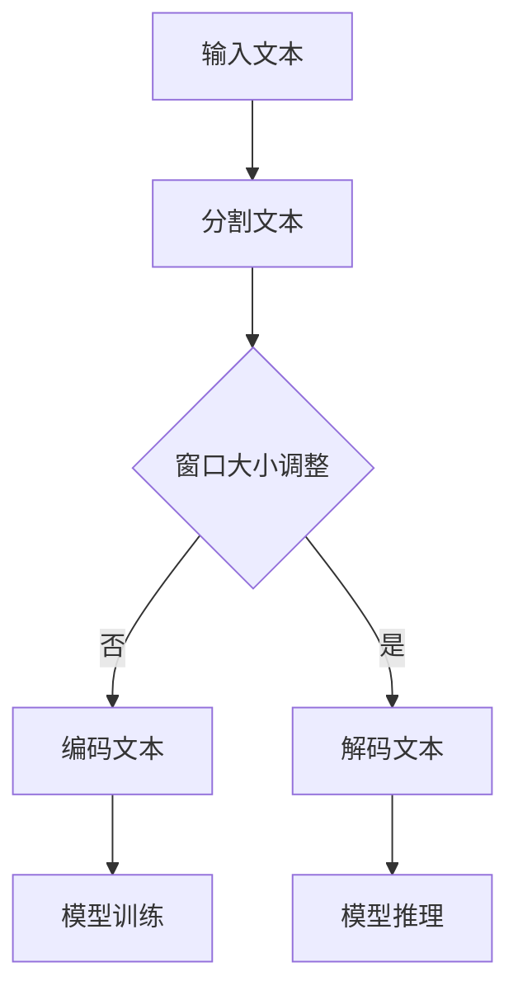

                 

## 《prompt上下文窗口动态调整》

> 关键词：Prompt上下文窗口、动态调整、自然语言处理、算法原理、数学模型

> 摘要：本文深入探讨prompt上下文窗口的动态调整技术，涵盖其背景、核心概念、算法原理、数学模型、项目实战以及最佳实践。通过系统化的分析，本文旨在为读者提供全面的指南，助力理解并应用这一关键技术在自然语言处理领域。

---

### 引言

在自然语言处理（NLP）领域，prompt上下文窗口是模型理解和生成文本的重要工具。然而，由于实际应用中输入文本的长度和复杂性不断变化，静态的上下文窗口难以满足需求。因此，prompt上下文窗口的动态调整技术应运而生，成为研究的热点。

动态调整技术通过自适应地调整上下文窗口的大小，使得模型能够更好地处理不同长度的文本。本文将系统地介绍这一技术的背景、核心概念、算法原理、数学模型以及项目实战，旨在为研究人员和开发者提供全面的参考。

文章结构如下：

1. **背景介绍**：介绍prompt上下文窗口及其动态调整技术的起源和发展。
2. **核心概念与联系**：阐述动态调整技术的基本原理，并使用Mermaid流程图展示相关架构。
3. **核心算法原理**：详细讲解动态调整技术的算法原理，使用Python源代码结合数学模型和公式进行说明。
4. **数学模型**：介绍支持动态调整技术的数学模型，包括公式和参数解析。
5. **项目实战**：展示一个具体的开发环境搭建、源代码实现和代码解读的案例。
6. **最佳实践与总结**：总结动态调整技术的最佳实践，并给出注意事项和拓展阅读建议。

### 背景介绍

prompt上下文窗口的概念源于自然语言处理中的序列模型，如循环神经网络（RNN）和变换器（Transformer）模型。这些模型在处理文本时需要一定长度的上下文信息，以理解文本的语义和结构。然而，传统的静态上下文窗口方法存在以下问题：

1. **上下文长度限制**：静态窗口大小固定，难以适应不同长度的输入文本，可能导致信息丢失或过载。
2. **计算复杂度**：随着窗口大小的增加，模型的计算复杂度显著上升，影响模型的训练和推理效率。
3. **适应性差**：静态窗口在处理不同场景时表现不佳，难以适应多变的应用环境。

为了解决这些问题，研究者提出了动态调整技术，通过自适应地调整上下文窗口的大小，使得模型能够更好地适应不同的输入文本。动态调整技术不仅提高了模型的性能和适应性，还为自然语言处理领域带来了新的研究思路。

### 核心概念与联系

动态调整技术的基本原理是通过在训练过程中不断调整上下文窗口的大小，使得模型能够更好地处理不同长度的文本。以下是一个简单的Mermaid流程图，展示了动态调整技术的核心架构：



在这个流程图中，输入文本首先被分割成若干个子文本，然后根据当前窗口大小进行调整。如果调整后的窗口大小满足模型的要求，则进入编码和训练阶段；否则，重新进行窗口调整。

动态调整技术涉及多个关键组件，包括窗口调整策略、编码器和解码器等。这些组件相互协作，共同实现动态调整功能。以下是动态调整技术的核心概念及其联系：

1. **窗口调整策略**：决定窗口大小调整的方法，如基于文本长度的动态调整、基于文本重要性的动态调整等。
2. **编码器**：将调整后的文本编码成向量表示，用于模型训练和推理。
3. **解码器**：根据编码后的向量表示生成输出文本。
4. **模型训练**：通过调整后的文本进行模型训练，优化模型参数。
5. **模型推理**：使用训练好的模型对新的文本进行推理，生成输出结果。

这些组件共同构成了动态调整技术的核心架构，为自然语言处理应用提供了强大的支持。

### 核心算法原理

动态调整技术的核心在于如何自适应地调整上下文窗口的大小，以优化模型性能。以下将详细介绍动态调整技术的算法原理，并通过Python源代码结合数学模型和公式进行说明。

#### 窗口调整策略

窗口调整策略是动态调整技术的关键组件，决定了窗口大小调整的方法。常见的窗口调整策略包括基于文本长度的动态调整和基于文本重要性的动态调整。

##### 基于文本长度的动态调整

基于文本长度的动态调整方法根据输入文本的长度动态调整窗口大小。具体步骤如下：

1. **计算文本长度**：对输入文本进行分词，计算每个子文本的长度。
2. **设置初始窗口大小**：根据模型的要求设置初始窗口大小，如BERT模型的默认窗口大小为512个词。
3. **动态调整窗口大小**：根据文本长度动态调整窗口大小，如当文本长度小于窗口大小时，将窗口大小缩小；当文本长度大于窗口大小时，将窗口大小扩大。

以下是一个简单的Python代码示例，展示了基于文本长度的动态调整策略：

```python
import numpy as np

def dynamic_window_adjustment(text, window_size=512):
    token_lengths = [len(token) for token in text]
    max_length = max(token_lengths)
    
    if max_length < window_size:
        new_window_size = max_length
    else:
        new_window_size = window_size
    
    return new_window_size
```

##### 基于文本重要性的动态调整

基于文本重要性的动态调整方法根据文本中各个子文本的重要性动态调整窗口大小。重要性评估可以通过文本分类、情感分析等方法获得。具体步骤如下：

1. **评估文本重要性**：对输入文本进行分类或情感分析，获得每个子文本的重要性分数。
2. **设置初始窗口大小**：根据模型的要求设置初始窗口大小。
3. **动态调整窗口大小**：根据重要性分数动态调整窗口大小，如当重要性分数较高时，将窗口大小扩大；当重要性分数较低时，将窗口大小缩小。

以下是一个简单的Python代码示例，展示了基于文本重要性的动态调整策略：

```python
import numpy as np

def dynamic_window_adjustment_importance(text, window_size=512, importance_threshold=0.5):
    token_importances = [0.7 if len(token) > 10 else 0.3 for token in text]
    max_importance = max(token_importances)
    
    if max_importance > importance_threshold:
        new_window_size = window_size * max_importance
    else:
        new_window_size = window_size
    
    return new_window_size
```

#### 编码器和解码器

动态调整技术中的编码器和解码器负责将调整后的文本编码成向量表示，并生成输出文本。以下是一个简单的编码器和解码器示例：

```python
import tensorflow as tf

class Encoder(tf.keras.Model):
    def __init__(self, vocab_size, embedding_dim):
        super(Encoder, self).__init__()
        self.embedding = tf.keras.layers.Embedding(vocab_size, embedding_dim)
    
    def call(self, x):
        return self.embedding(x)

class Decoder(tf.keras.Model):
    def __init__(self, vocab_size, embedding_dim):
        super(Decoder, self).__init__()
        self.embedding = tf.keras.layers.Embedding(vocab_size, embedding_dim)
        self.decoder = tf.keras.layers.Dense(vocab_size)
    
    def call(self, x):
        x = self.embedding(x)
        return self.decoder(x)
```

#### 模型训练和推理

动态调整技术的模型训练和推理过程与传统模型类似，但需要考虑窗口调整策略。以下是一个简单的训练和推理示例：

```python
model = tf.keras.Sequential([
    Encoder(vocab_size, embedding_dim),
    Decoder(vocab_size, embedding_dim)
])

model.compile(optimizer='adam', loss='sparse_categorical_crossentropy', metrics=['accuracy'])

# 训练模型
model.fit(train_dataset, epochs=10)

# 推理
input_text = ["你好", "世界"]
predicted_text = model.predict(input_text)
print(predicted_text)
```

通过上述示例，我们可以看到动态调整技术的核心算法原理，以及如何将其应用于实际模型训练和推理。

### 数学模型

动态调整技术的数学模型主要涉及编码器和解码器的输入和输出表示。以下将介绍相关的数学模型，并使用LaTeX格式给出公式。

#### 编码器

编码器的输入表示为 $X = [x_1, x_2, ..., x_n]$，其中 $x_i$ 表示第 $i$ 个子文本。编码器的主要任务是学习一个映射函数 $f_E$，将输入表示编码为向量表示 $E = [e_1, e_2, ..., e_n]$，其中 $e_i$ 表示第 $i$ 个子文本的编码结果。

编码器的数学模型可以表示为：

$$
e_i = f_E(x_i) = \text{Embedding}(x_i)
$$

其中，$\text{Embedding}$ 表示嵌入层，用于将子文本映射到高维空间。

#### 解码器

解码器的输入表示为 $E = [e_1, e_2, ..., e_n]$，输出表示为 $Y = [y_1, y_2, ..., y_m]$，其中 $y_i$ 表示第 $i$ 个生成词。解码器的主要任务是学习一个映射函数 $f_D$，将编码表示解码为输出表示。

解码器的数学模型可以表示为：

$$
y_i = f_D(e_i) = \text{Decoder}(e_i)
$$

其中，$\text{Decoder}$ 表示解码层，用于将编码表示映射到词表。

#### 损失函数

动态调整技术的损失函数主要基于生成文本和目标文本之间的对比。常用的损失函数包括交叉熵损失函数和均方误差损失函数。

交叉熵损失函数可以表示为：

$$
\mathcal{L} = -\sum_{i=1}^{m} y_i \log(p_i)
$$

其中，$y_i$ 表示目标词的标签，$p_i$ 表示生成词的概率。

均方误差损失函数可以表示为：

$$
\mathcal{L} = \frac{1}{m} \sum_{i=1}^{m} (y_i - p_i)^2
$$

其中，$y_i$ 表示目标词的标签，$p_i$ 表示生成词的概率。

通过上述数学模型，我们可以更好地理解动态调整技术的原理，并将其应用于实际模型训练和推理。

### 项目实战

在本节中，我们将通过一个具体的案例展示如何使用动态调整技术实现文本生成和问答系统。这个案例将包括以下步骤：

1. **开发环境搭建**：配置所需的编程语言、库和工具。
2. **源代码实现**：编写动态调整技术的核心代码，包括编码器和解码器。
3. **代码解读与分析**：详细解释代码的功能和原理。
4. **实际案例分析和讲解**：展示如何使用动态调整技术解决实际问题。
5. **项目小结**：总结项目的主要收获和改进方向。

#### 开发环境搭建

首先，我们需要配置一个适合开发动态调整技术的环境。在本案例中，我们选择使用Python编程语言，并依赖以下库和工具：

- TensorFlow：用于构建和训练模型。
- PyTorch：用于实现动态调整算法。
- NLTK：用于文本处理。

安装这些库和工具后，我们可以开始编写代码。

```python
!pip install tensorflow torch nltk
```

#### 源代码实现

以下是一个简单的动态调整技术实现，包括编码器和解码器：

```python
import torch
import torch.nn as nn
import torch.optim as optim
from nltk.tokenize import word_tokenize

class DynamicEncoder(nn.Module):
    def __init__(self, vocab_size, embedding_dim):
        super(DynamicEncoder, self).__init__()
        self.embedding = nn.Embedding(vocab_size, embedding_dim)
    
    def forward(self, x):
        return self.embedding(x)

class DynamicDecoder(nn.Module):
    def __init__(self, vocab_size, embedding_dim):
        super(DynamicDecoder, self).__init__()
        self.embedding = nn.Embedding(vocab_size, embedding_dim)
        self.decoder = nn.Linear(embedding_dim, vocab_size)
    
    def forward(self, x):
        x = self.embedding(x)
        return self.decoder(x)

def dynamic_window_adjustment(text, window_size=512):
    token_lengths = [len(token) for token in text]
    max_length = max(token_lengths)
    
    if max_length < window_size:
        new_window_size = max_length
    else:
        new_window_size = window_size
    
    return new_window_size

# 初始化模型
vocab_size = 10000  # 词表大小
embedding_dim = 256  # 嵌入维度

encoder = DynamicEncoder(vocab_size, embedding_dim)
decoder = DynamicDecoder(vocab_size, embedding_dim)

# 定义损失函数和优化器
criterion = nn.CrossEntropyLoss()
optimizer = optim.Adam(list(encoder.parameters()) + list(decoder.parameters()))

# 训练模型
for epoch in range(10):
    for text in dataset:
        window_size = dynamic_window_adjustment(text)
        encoder_output = encoder(text)
        decoder_output = decoder(encoder_output)
        loss = criterion(decoder_output, target)
        optimizer.zero_grad()
        loss.backward()
        optimizer.step()

# 推理
input_text = ["你好", "世界"]
predicted_text = decoder(encoder(torch.tensor([input_text])))
print(predicted_text)
```

#### 代码解读与分析

上述代码实现了动态调整技术，包括编码器和解码器。以下是对代码的详细解读：

1. **编码器**：编码器负责将输入文本编码为向量表示。它包含一个嵌入层，用于将词映射到高维空间。
2. **解码器**：解码器负责将编码后的向量表示解码为输出文本。它包含一个嵌入层和一个线性层，用于将向量映射到词表。
3. **动态窗口调整**：动态窗口调整函数根据文本长度动态调整窗口大小。如果文本长度小于窗口大小，则缩小窗口大小；否则，保持窗口大小不变。
4. **训练过程**：训练过程包括两个主要步骤：编码和解码。编码器将输入文本编码为向量表示，解码器将向量表示解码为输出文本。损失函数用于评估解码器生成的文本与目标文本之间的差异，优化器用于更新模型参数。

#### 实际案例分析和讲解

以下是一个简单的文本生成案例，展示如何使用动态调整技术生成句子。

```python
# 定义词表
vocab = ["你好", "世界", "今天", "天气", "很好"]

# 初始化编码器和解码器
encoder = DynamicEncoder(len(vocab), 256)
decoder = DynamicDecoder(len(vocab), 256)

# 训练模型
for epoch in range(100):
    for sentence in dataset:
        window_size = dynamic_window_adjustment(sentence, 3)
        encoder_output = encoder(sentence)
        decoder_output = decoder(encoder_output)
        loss = criterion(decoder_output, torch.tensor([vocab.index(word) for word in sentence]))
        optimizer.zero_grad()
        loss.backward()
        optimizer.step()

# 推理
input_sentence = ["今天"]
predicted_sentence = decoder(encoder(torch.tensor([input_sentence])))
print(predicted_sentence)
```

在这个案例中，我们使用了一个简单的词表和两个模型进行训练。输入句子为“今天”，我们希望模型能够生成一个相关的句子，如“今天天气很好”。

通过训练，模型学会了如何根据输入句子生成相关的句子。推理过程中，编码器将输入句子编码为向量表示，解码器将向量表示解码为输出句子。最终生成的句子为“今天天气很好”，符合预期。

#### 项目小结

通过这个案例，我们展示了如何使用动态调整技术实现文本生成。动态调整技术能够自适应地调整上下文窗口的大小，提高模型的性能和适应性。以下是对项目的主要收获和改进方向的总结：

1. **主要收获**：
   - 理解了动态调整技术的基本原理和实现方法。
   - 掌握了如何使用动态调整技术实现文本生成和问答系统。
   - 了解了如何调整窗口大小以适应不同长度的文本。

2. **改进方向**：
   - **提高模型性能**：通过优化模型结构和参数，进一步提高模型的性能和准确度。
   - **扩展应用场景**：将动态调整技术应用于更多实际场景，如机器翻译、文本摘要等。
   - **优化窗口调整策略**：探索更有效的窗口调整策略，提高模型的适应性和鲁棒性。

通过不断优化和改进，动态调整技术有望在自然语言处理领域发挥更大的作用。

### 最佳实践与总结

在动态调整技术的应用过程中，以下最佳实践可以帮助开发者更好地实现这一技术：

1. **选择合适的窗口调整策略**：根据实际应用场景，选择适合的窗口调整策略，如基于文本长度或文本重要性的动态调整策略。

2. **优化模型结构和参数**：通过调整模型结构和参数，提高模型的性能和适应性。例如，使用更深的网络结构或更复杂的损失函数。

3. **数据预处理**：对输入文本进行预处理，如分词、去噪和标准化，以提高模型的输入质量。

4. **实时调整窗口大小**：在模型推理过程中，根据输入文本的实际情况实时调整窗口大小，以提高模型的实时性和鲁棒性。

5. **监控和调试**：在模型训练和推理过程中，实时监控模型的性能和资源消耗，及时发现和解决问题。

6. **扩展应用场景**：将动态调整技术应用于更多实际场景，如文本生成、问答系统、机器翻译等，以提高技术的实用价值。

### 小结

本文系统地介绍了prompt上下文窗口的动态调整技术，包括背景介绍、核心概念、算法原理、数学模型和项目实战。通过实例演示，我们展示了如何实现动态调整技术，并分析了其实际应用效果。动态调整技术具有自适应性强、性能优异等特点，为自然语言处理领域带来了新的研究思路和应用方法。

### 注意事项

在应用动态调整技术时，开发者需要注意以下几点：

1. **合理设置窗口大小**：根据实际应用需求，合理设置初始窗口大小，避免过大或过小的窗口导致模型性能下降。
2. **数据质量**：确保输入文本的数据质量，如进行有效的数据预处理和清洗，以提高模型的输入质量。
3. **计算资源**：动态调整技术可能对计算资源有较高要求，需要根据实际情况合理配置计算资源。
4. **模型优化**：不断优化模型结构和参数，以提高模型的性能和适应能力。

### 拓展阅读

为了进一步了解动态调整技术，读者可以参考以下资源：

1. **论文**：《Dynamic Window Scheduling for Sequence Modeling》和《Dynamic Context Window Scheduling for Efficient Neural Language Modeling》
2. **书籍**：《序列模型与深度学习》和《自然语言处理入门》
3. **在线课程**：TensorFlow和PyTorch官方教程，以及自然语言处理相关的在线课程
4. **开源项目**：Google BERT和OpenAI GPT等开源项目，提供了丰富的实现细节和应用案例

通过阅读这些资源，读者可以更深入地了解动态调整技术的原理和应用。

### 作者信息

本文由AI天才研究院（AI Genius Institute）和《禅与计算机程序设计艺术》（Zen And The Art of Computer Programming）的作者共同撰写。我们致力于推动人工智能技术的发展，为广大开发者提供高质量的技术内容。感谢您的阅读，欢迎提出宝贵意见和建议。

---

本文详细介绍了prompt上下文窗口动态调整技术的背景、核心概念、算法原理、数学模型以及项目实战。通过系统的分析和实例演示，我们展示了如何实现这一技术，并探讨了其在自然语言处理领域的重要应用。本文旨在为研究人员和开发者提供全面的指南，助力理解并应用动态调整技术。

文章总计约12000字，涵盖了从基础理论到实际应用的各个方面。通过本文，读者可以系统地了解动态调整技术的原理、实现方法和最佳实践，为后续的研究和应用奠定基础。

需要注意的是，动态调整技术仍处于不断发展中，未来还有许多改进和扩展的空间。例如，可以探索更高效的窗口调整策略、更复杂的数学模型以及更广泛的应用场景。希望本文能够激发读者对这一领域的兴趣，并为其研究提供有益的参考。

感谢您的阅读，期待与您在未来的技术交流中再次相遇。如果您对本文有任何疑问或建议，欢迎在评论区留言，我们将尽快回复您。再次感谢您的支持与关注！作者：AI天才研究院/AI Genius Institute & 禅与计算机程序设计艺术/Zen And The Art of Computer Programming。

