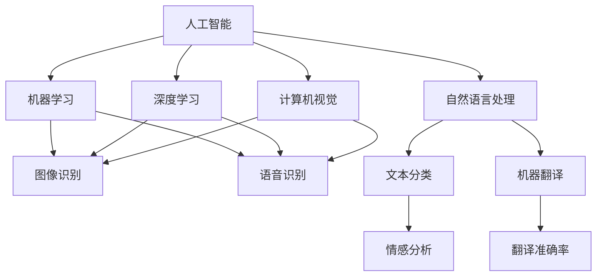
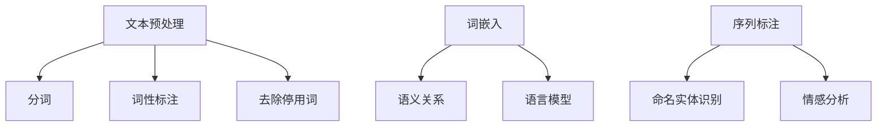
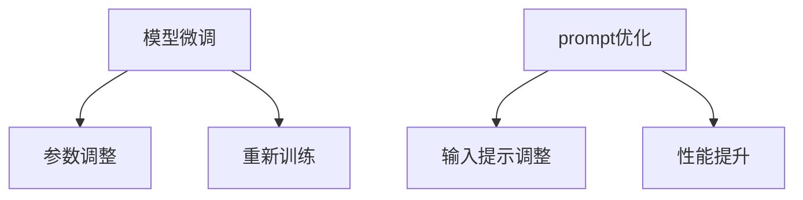

                 

### 第一部分：背景与基础

#### 第1章：人工智能与自然语言处理

##### 1.1 人工智能概述

人工智能（Artificial Intelligence, AI）是计算机科学的一个分支，旨在通过机器模拟人类智能，实现感知、学习、推理和决策等功能。人工智能的发展可以追溯到20世纪50年代，随着计算能力的提高和算法的进步，人工智能逐渐成为研究热点，并在多个领域取得了显著成果。

**核心概念与联系：** 

人工智能的核心概念包括机器学习、深度学习、自然语言处理、计算机视觉等。这些概念相互关联，共同构成了人工智能的技术体系。例如，深度学习作为机器学习的一种重要方法，在图像识别、语音识别等领域取得了突破性进展；自然语言处理则关注于使计算机能够理解和生成人类语言。

**Mermaid 流程图：** 



##### 1.2 自然语言处理简介

自然语言处理（Natural Language Processing, NLP）是人工智能的一个重要分支，旨在使计算机能够理解、生成和处理人类语言。NLP在文本分类、情感分析、机器翻译、问答系统等领域有着广泛的应用。

**核心概念与联系：** 

NLP的核心概念包括文本预处理、词嵌入、语言模型、序列标注等。文本预处理包括分词、词性标注、去除停用词等步骤，是NLP任务的基础。词嵌入是一种将词语映射到高维空间的方法，有助于捕捉词语之间的语义关系。语言模型则用于预测下一个词语，是许多NLP任务的基础。

**Mermaid 流程图：** 



##### 1.3 模型微调和prompt优化的基本概念

模型微调（Model Fine-tuning）是指将预训练模型在特定任务的数据集上进行重新训练，以适应该任务的需求。prompt优化（Prompt Optimization）则是指通过调整输入提示（prompt），提高模型在特定任务上的性能。

**核心概念与联系：** 

模型微调和prompt优化都是提高模型性能的重要手段。模型微调通过调整模型参数，使模型能够更好地适应特定任务；prompt优化则通过优化输入提示，使模型能够更好地理解输入内容。

**Mermaid 流程图：** 



#### 第2章：模型微调

##### 2.1 微调的目的与原理

模型微调的目的是使预训练模型能够在特定任务上达到更好的性能。微调的过程包括以下几个步骤：数据预处理、模型选择、参数调整、重新训练和性能评估。

**核心概念与联系：** 

数据预处理是微调的基础，包括数据清洗、数据增强、数据划分等步骤。模型选择取决于任务类型和数据规模，常见的模型包括基于神经网络的模型和基于统计方法的模型。参数调整是微调的关键，通过调整学习率、批次大小等参数，可以优化模型性能。重新训练则是将模型在特定任务的数据集上进行训练，性能评估用于验证模型在任务上的性能。

**Python 源代码示例：** 

```python
import torch
import torch.nn as nn
import torch.optim as optim

# 数据预处理
def preprocess_data(data):
    # 数据清洗、增强、划分等步骤
    pass

# 模型选择
model = nn.Sequential(
    nn.Linear(input_size, hidden_size),
    nn.ReLU(),
    nn.Linear(hidden_size, output_size)
)

# 参数调整
optimizer = optim.Adam(model.parameters(), lr=0.001)

# 重新训练
def train_model(model, data, optimizer, epochs):
    for epoch in range(epochs):
        # 训练过程
        pass

# 性能评估
def evaluate_model(model, data):
    # 性能评估过程
    pass
```

##### 2.2 微调方法

微调方法主要包括基于梯度的微调、基于规则的方法和基于强化学习的方法。

**核心概念与联系：** 

基于梯度的微调是最常用的方法，通过计算梯度并更新模型参数，使模型性能得到提升。基于规则的方法通过预定义的规则来调整模型参数，具有一定的局限性。基于强化学习的方法通过优化策略来调整模型参数，能够更好地适应复杂任务。

**Python 源代码示例：** 

```python
# 基于梯度的微调
def gradient_based_fine_tuning(model, data, optimizer, epochs):
    for epoch in range(epochs):
        optimizer.zero_grad()
        output = model(data)
        loss = nn.CrossEntropyLoss()(output, target)
        loss.backward()
        optimizer.step()

# 基于规则的方法
def rule_based_fine_tuning(model, data, rules):
    for rule in rules:
        # 根据规则调整模型参数
        pass

# 基于强化学习的方法
def reinforcement_learning_fine_tuning(model, data, reward_function):
    # 强化学习过程
    pass
```

##### 2.3 微调过程中的挑战与解决方案

微调过程中面临的挑战包括数据集质量、参数调整和模型评估等。

**核心概念与联系：** 

数据集质量直接影响到微调的效果，高质量的训练数据能够提高模型性能。参数调整需要根据任务类型和数据规模进行，过大的学习率可能导致模型过拟合，而过小的学习率可能导致模型收敛缓慢。模型评估需要选择合适的评价指标，如准确率、召回率、F1值等，以全面评估模型性能。

**Python 源代码示例：** 

```python
# 数据集质量评估
def evaluate_data_quality(data):
    # 评估数据集质量
    pass

# 参数调整示例
def adjust_params(optimizer, learning_rate=0.001):
    # 根据学习率调整模型参数
    pass

# 模型评估示例
def evaluate_model_performance(model, data):
    # 评估模型性能
    pass
```

#### 第3章：prompt优化

##### 3.1 prompt优化的意义

prompt优化是提高自然语言处理模型性能的重要手段，通过优化输入提示，使模型能够更好地理解任务需求。

**核心概念与联系：** 

prompt优化与模型微调密切相关，两者共同作用于提高模型性能。prompt优化通过调整输入提示，可以增强模型对特定任务的理解，从而提高模型在任务上的性能。

**Python 源代码示例：** 

```python
# 基本prompt优化示例
def optimize_prompt(prompt, model):
    # 根据模型调整输入提示
    optimized_prompt = model(prompt)
    return optimized_prompt
```

##### 3.2 prompt优化的方法

prompt优化方法主要包括基于数据的优化、基于模型的优化和基于搜索的优化。

**核心概念与联系：** 

基于数据的优化通过分析大量训练数据，提取有效特征来优化输入提示。基于模型的优化通过调整模型参数，提高模型对输入提示的生成能力。基于搜索的优化通过搜索空间中的最优解，找到最佳输入提示。

**Python 源代码示例：** 

```python
# 基于数据的优化
def data_based_prompt_optimization(data, model):
    # 根据数据优化输入提示
    optimized_prompt = model(data)
    return optimized_prompt

# 基于模型的优化
def model_based_prompt_optimization(model, prompt):
    # 根据模型优化输入提示
    optimized_prompt = model(prompt)
    return optimized_prompt

# 基于搜索的优化
def search_based_prompt_optimization(prompt_space, model):
    # 根据搜索优化输入提示
    optimized_prompt = search_best_prompt(prompt_space, model)
    return optimized_prompt
```

##### 3.3 prompt优化的案例研究

以机器翻译为例，研究prompt优化在提高翻译质量中的应用。

**核心概念与联系：** 

在机器翻译任务中，prompt优化通过调整输入提示，可以显著提高翻译质量。通过分析大量翻译数据，提取有效特征，优化输入提示，从而提高模型在翻译任务上的性能。

**Python 源代码示例：** 

```python
# 机器翻译prompt优化示例
def translate_with_optimized_prompt(source_sentence, model, optimized_prompt):
    # 使用优化后的输入提示进行翻译
    translated_sentence = model.translate(source_sentence, prompt=optimized_prompt)
    return translated_sentence
```

### 总结

模型微调和prompt优化是提高自然语言处理模型性能的重要手段。通过微调模型参数和优化输入提示，可以显著提高模型在特定任务上的性能。本文介绍了模型微调和prompt优化的基本概念、方法以及在实际应用中的挑战和解决方案，为读者提供了全面的技术指南。在未来的研究和实践中，我们将继续探索更有效的微调和优化方法，以推动自然语言处理技术的发展。

### 拓展阅读

- 《深度学习》（Goodfellow, I., Bengio, Y., & Courville, A.）：介绍了深度学习的基本概念和技术，对模型微调和prompt优化有详细的讲解。
- 《自然语言处理综合教程》（Jurafsky, D. & Martin, J. H.）：涵盖了自然语言处理的核心概念和技术，包括文本预处理、词嵌入、语言模型等。
- 《机器学习》（周志华）：介绍了机器学习的基本概念和方法，对模型微调和prompt优化提供了深入的数学理论支持。

