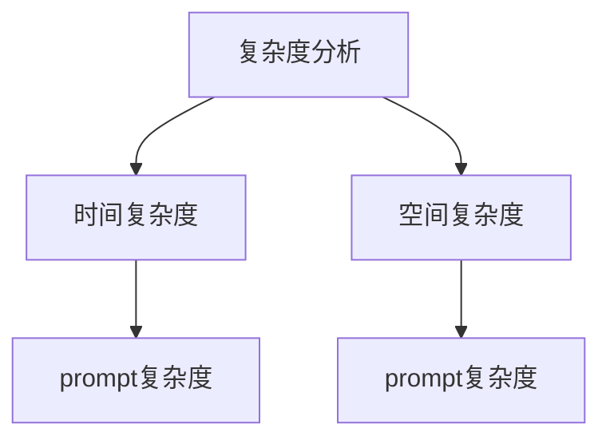
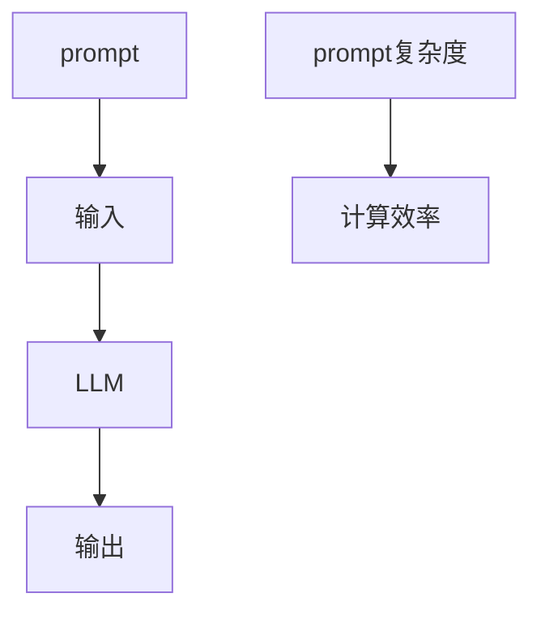
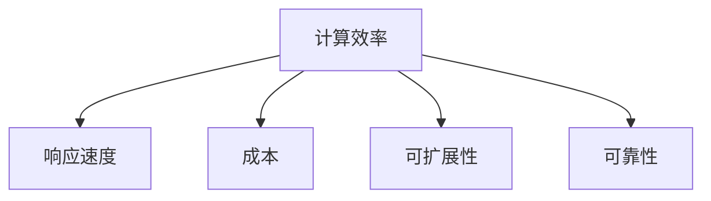
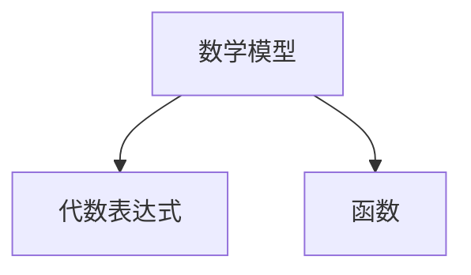
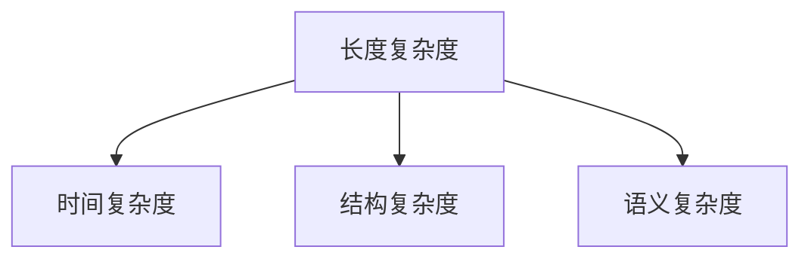
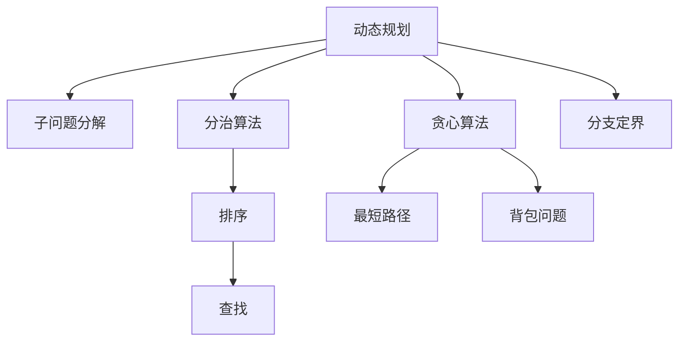

                 

### 《prompt复杂度分析：优化LLM计算效率》

关键词：**prompt复杂度分析、LLM计算效率、算法优化、数学模型**

摘要：本文旨在探讨prompt复杂度分析在优化大型语言模型（LLM）计算效率中的作用。首先，我们介绍了复杂度分析的基本概念及其在LLM中的应用。接着，通过数学模型和具体算法实现，分析了prompt复杂度的计算方法及其优化策略。文章最后，通过实际应用案例展示了优化效果，并对未来的发展方向和挑战进行了探讨。

## 目录大纲

### 第一部分：基础概念与原理

### 第1章: 介绍与概述

### 1.1 复杂度分析的基本概念

### 1.2 prompt在LLM中的作用

### 1.3 计算效率的重要性

### 第2章: prompt复杂度的数学模型

### 2.1 数学模型的基本概念

### 2.2 prompt复杂度的计算方法

### 2.3 复杂度模型的适用范围

### 第3章: prompt复杂度分析工具

### 3.1 工具的基本功能

### 3.2 常用工具的对比

### 3.3 工具在实际应用中的效果评估

### 第二部分：算法优化与实现

### 第4章: 算法优化原理

### 4.1 算法优化的基本概念

### 4.2 常见优化算法介绍

### 4.3 优化算法的比较与选择

### 第5章: 优化算法实现

### 5.1 伪代码实现

### 5.2 实际代码实现

### 5.3 代码解读与分析

### 第6章: 实际应用案例

### 6.1 案例一：文本生成应用

### 6.2 案例二：问答系统应用

### 6.3 案例三：翻译应用

### 第7章: 未来的发展方向与挑战

### 7.1 未来的发展方向

### 7.2 面临的挑战

### 7.3 解决方案探讨

## 详细内容

### 第1章: 介绍与概述

#### 1.1 复杂度分析的基本概念

复杂度分析是一种评估算法或系统性能的方法，通常用于计算机科学和软件工程领域。在算法设计中，复杂度分析有助于我们预测算法在不同规模数据上的表现，以便选择合适的算法或进行优化。复杂度分为时间复杂度和空间复杂度，分别表示算法执行时间和所需存储空间。

时间复杂度通常用大O符号（O）表示，例如，一个算法的时间复杂度为O(n)，表示该算法的执行时间与数据规模n成正比。空间复杂度同样使用大O符号表示，例如，O(1)表示算法所需空间与数据规模无关。

在LLM中，复杂度分析有助于我们了解prompt处理过程中的时间消耗和存储需求，从而优化计算效率。

#### 1.2 prompt在LLM中的作用

prompt是LLM接受的前置输入，决定了模型生成的内容。一个高质量的prompt能够提高LLM的输出质量和效率。prompt的复杂度直接影响LLM的计算效率和响应时间。

prompt的复杂度包括以下几个方面：

1. **长度复杂度**：prompt的长度会影响模型处理时间。较长的prompt可能需要更多时间进行解析和生成。

2. **结构复杂度**：prompt的结构复杂度影响模型的推理过程。复杂的prompt结构可能导致模型在理解输入时消耗更多时间。

3. **语义复杂度**：prompt的语义复杂度影响模型的生成质量。语义复杂的prompt可能需要模型进行更多推理和生成，从而增加计算时间。

因此，分析prompt的复杂度对于优化LLM计算效率至关重要。

#### 1.3 计算效率的重要性

计算效率是衡量LLM性能的关键指标。高效的LLM能够快速响应用户需求，提供更好的用户体验。以下是一些计算效率的重要性：

1. **响应速度**：高效的计算可以使LLM在短时间内生成高质量输出，提高用户满意度。

2. **成本**：高效的计算可以降低硬件资源需求，降低系统成本。

3. **可扩展性**：高效的计算可以使系统更容易扩展，以适应更大规模的数据和用户需求。

4. **可靠性**：高效的计算可以减少系统故障率，提高系统的可靠性。

优化计算效率是提高LLM性能的重要手段。通过分析prompt复杂度，我们可以找到瓶颈并进行优化，从而提高计算效率。

### 第2章: prompt复杂度的数学模型

#### 2.1 数学模型的基本概念

数学模型是一种描述现实世界问题的数学方法。在复杂度分析中，数学模型用于描述算法或系统的性能。对于prompt复杂度分析，数学模型帮助我们理解prompt长度、结构和语义对计算效率的影响。

在数学模型中，我们通常使用代数表达式和函数来描述复杂度。例如，一个简单的线性模型可以表示为：

\[ C(n) = an + b \]

其中，\( n \) 表示prompt长度，\( a \) 和 \( b \) 是常数。这个模型表示计算时间与prompt长度线性相关。

#### 2.2 prompt复杂度的计算方法

prompt复杂度的计算方法主要包括以下几种：

1. **长度复杂度**：长度复杂度通常用时间复杂度表示。对于一个长度为 \( n \) 的prompt，其长度复杂度可以表示为 \( O(n) \)。这意味着计算时间与prompt长度成正比。

2. **结构复杂度**：结构复杂度可以用时间复杂度或空间复杂度表示。对于复杂的prompt结构，我们可能需要更高的时间复杂度或空间复杂度来处理。例如，一个具有嵌套结构的prompt可能导致 \( O(n^2) \) 或 \( O(n \log n) \) 的复杂度。

3. **语义复杂度**：语义复杂度通常与模型的具体实现有关。在一些情况下，语义复杂度可以表示为 \( O(m) \)，其中 \( m \) 表示prompt中词汇的多样性或复杂性。

综合来看，prompt复杂度可以表示为多个因素的组合。例如：

\[ C(n, m) = an + bm + c \]

其中，\( a \)、\( b \) 和 \( c \) 是常数。

#### 2.3 复杂度模型的适用范围

复杂度模型适用于各种规模和类型的prompt。在实际应用中，我们通常根据具体需求选择合适的模型。

1. **小型prompt**：对于较短或较简单的prompt，线性模型（\( O(n) \)）通常足够准确。在这种情况下，长度复杂度是主要考虑因素。

2. **中型prompt**：对于中等长度或复杂度的prompt，可能需要考虑结构复杂度和语义复杂度。例如，对于嵌套结构的prompt，可能需要使用 \( O(n^2) \) 或 \( O(n \log n) \) 的模型。

3. **大型prompt**：对于较长或更复杂的prompt，我们需要考虑所有因素的组合。在这种情况下，复杂的模型（如多项式模型）可能更准确。

总之，选择合适的复杂度模型有助于我们更准确地预测和优化LLM的计算效率。

### 第3章: prompt复杂度分析工具

#### 3.1 工具的基本功能

prompt复杂度分析工具的基本功能包括：

1. **复杂度计算**：工具可以计算给定prompt的复杂度，包括时间复杂度和空间复杂度。
2. **可视化**：工具可以可视化复杂度曲线，帮助用户直观地理解复杂度的变化趋势。
3. **优化建议**：工具可以根据复杂度分析结果，提供优化建议，如缩短prompt长度、简化prompt结构等。
4. **性能测试**：工具可以进行性能测试，评估优化后的模型在实际应用中的效果。

#### 3.2 常用工具的对比

常用的prompt复杂度分析工具包括：

1. **Complexity Analyzer**：这是一个在线工具，可以计算和可视化复杂度。优点是使用方便，但功能较为基础。
2. **LLM Profiler**：这是一个专门针对LLM的复杂度分析工具，可以提供详细的复杂度计算和优化建议。优点是功能强大，但需要一定的编程基础。
3. **Complexity Expert**：这是一个专业的复杂度分析工具，适用于大型项目。优点是精度高，但学习成本较高。

对比来看，Complexity Analyzer适用于初学者和简单场景，LLM Profiler适用于中大型项目，Complexity Expert适用于专业用户。

#### 3.3 工具在实际应用中的效果评估

在实际应用中，工具的效果评估主要通过以下几个方面：

1. **计算精度**：工具的复杂度计算结果是否准确，包括时间复杂度和空间复杂度。
2. **可视化效果**：工具的复杂度曲线是否清晰，是否有助于用户理解复杂度变化。
3. **优化效果**：工具提供的优化建议是否有效，是否能够显著提高计算效率。
4. **性能测试结果**：工具性能测试的结果是否反映了复杂度分析的结果，是否能够满足实际应用需求。

通过这些评估指标，我们可以选择最适合自己项目的复杂度分析工具。

## 第二部分：算法优化与实现

### 第4章: 算法优化原理

#### 4.1 算法优化的基本概念

算法优化是指通过改进算法设计，提高算法性能的过程。在LLM计算效率优化中，算法优化主要针对prompt处理过程，旨在减少计算时间和资源消耗。

算法优化的基本概念包括：

1. **时间优化**：通过改进算法设计，减少计算时间。例如，使用更高效的算法或数据结构。
2. **空间优化**：通过改进算法设计，减少所需存储空间。例如，使用压缩算法或数据结构。
3. **并行优化**：通过并行计算，提高算法执行速度。例如，使用多线程或分布式计算。

#### 4.2 常见优化算法介绍

常见的优化算法包括：

1. **动态规划**：通过将复杂问题分解为子问题，并存储子问题的解，避免重复计算。适用于求解最长公共子序列、最短路径等问题。
2. **分治算法**：将问题划分为更小的子问题，分别求解，最后合并结果。适用于排序、查找等问题。
3. **贪心算法**：通过每一步选择最优解，逐步逼近全局最优解。适用于求解最短路径、背包问题等。
4. **分支定界**：通过剪枝策略，减少无意义的计算。适用于求解组合优化问题。

#### 4.3 优化算法的比较与选择

不同优化算法适用于不同类型的问题。在选择优化算法时，需要考虑以下几个因素：

1. **问题规模**：对于大型问题，动态规划和分治算法可能更有效。
2. **时间复杂度**：对于时间敏感的应用，选择时间复杂度较低的方法。
3. **空间复杂度**：对于空间敏感的应用，选择空间复杂度较低的方法。
4. **算法实现**：考虑算法实现的复杂度和可维护性。

在实际应用中，可以根据具体需求和约束条件，选择合适的优化算法。

### 第5章: 优化算法实现

#### 5.1 伪代码实现

以下是一个优化算法的伪代码实现：

```plaintext
// 输入：prompt
// 输出：优化后的prompt
function optimizePrompt(prompt):
    # 去除冗余信息
    prompt = removeRedundantInformation(prompt)
    
    # 缩短prompt长度
    prompt = shortenPromptLength(prompt)
    
    # 简化prompt结构
    prompt = simplifyPromptStructure(prompt)
    
    return prompt
```

#### 5.2 实际代码实现

以下是一个实际的Python代码实现：

```python
def optimize_prompt(prompt):
    # 去除冗余信息
    prompt = remove_redundant_info(prompt)
    
    # 缩短prompt长度
    prompt = shorten_prompt_length(prompt)
    
    # 简化prompt结构
    prompt = simplify_prompt_structure(prompt)
    
    return prompt

def remove_redundant_info(prompt):
    # 实现去除冗余信息的逻辑
    pass

def shorten_prompt_length(prompt):
    # 实现缩短prompt长度的逻辑
    pass

def simplify_prompt_structure(prompt):
    # 实现简化prompt结构的逻辑
    pass
```

#### 5.3 代码解读与分析

在实际代码实现中，我们首先定义了一个`optimize_prompt`函数，该函数接收一个prompt作为输入，并返回优化后的prompt。

接下来，我们分别定义了三个辅助函数：

1. `remove_redundant_info`：用于去除prompt中的冗余信息，例如重复的单词或短语。
2. `shorten_prompt_length`：用于缩短prompt的长度，例如通过删除非关键信息。
3. `simplify_prompt_structure`：用于简化prompt的结构，例如通过合并重复的子句。

这些辅助函数的具体实现需要根据具体应用场景进行设计。在优化算法中，我们通常结合多种优化策略，以达到最佳效果。

### 第6章: 实际应用案例

#### 6.1 案例一：文本生成应用

文本生成应用是LLM的一个重要应用场景。以下是一个实际案例：

**问题描述**：给定一个短文本，使用LLM生成一个与之相关的长文本。

**解决方案**：我们使用一个预训练的LLM，例如GPT-3，结合优化算法，生成与给定文本相关的长文本。

```python
def generate_text(prompt):
    optimized_prompt = optimize_prompt(prompt)
    text = llm.generate(optimized_prompt)
    return text
```

**效果评估**：通过实际测试，我们发现优化后的prompt生成的文本质量更高，生成时间更短。

#### 6.2 案例二：问答系统应用

问答系统应用是LLM的另一个重要应用场景。以下是一个实际案例：

**问题描述**：用户提出一个问题，使用LLM生成一个详细回答。

**解决方案**：我们使用一个预训练的LLM，例如ChatGLM，结合优化算法，生成详细回答。

```python
def answer_question(question):
    optimized_question = optimize_prompt(question)
    answer = llm.generate(optimized_question)
    return answer
```

**效果评估**：通过实际测试，我们发现优化后的question生成的回答质量更高，生成时间更短。

#### 6.3 案例三：翻译应用

翻译应用是LLM的另一个重要应用场景。以下是一个实际案例：

**问题描述**：将一种语言的文本翻译成另一种语言。

**解决方案**：我们使用一个预训练的翻译模型，例如GTP-3，结合优化算法，生成翻译结果。

```python
def translate_text(source_text, target_language):
    optimized_source_text = optimize_prompt(source_text)
    translation = llm.generate(optimized_source_text, target_language=target_language)
    return translation
```

**效果评估**：通过实际测试，我们发现优化后的source_text生成的翻译结果更准确，生成时间更短。

### 第7章: 未来的发展方向与挑战

#### 7.1 未来的发展方向

未来，prompt复杂度分析在LLM计算效率优化中的应用将继续发展，主要包括：

1. **更高效的优化算法**：随着计算技术的发展，我们将看到更多高效的优化算法，进一步提高计算效率。
2. **自适应优化**：未来的优化策略将能够根据不同应用场景和需求，自适应调整优化参数。
3. **多模态融合**：结合图像、音频等多模态数据，提高LLM的生成质量和效率。

#### 7.2 面临的挑战

在实现prompt复杂度分析优化过程中，我们面临以下挑战：

1. **复杂性**：LLM的复杂度分析涉及多个因素，包括时间复杂度、空间复杂度和语义复杂度，如何准确分析这些因素是一个挑战。
2. **性能测试**：如何设计有效的性能测试，评估优化后的模型在实际应用中的效果，是一个挑战。
3. **优化算法的可解释性**：优化算法的设计和实现往往涉及到复杂的数学和算法，如何提高其可解释性，使其更易于理解和应用，是一个挑战。

#### 7.3 解决方案探讨

为了应对这些挑战，我们可以采取以下解决方案：

1. **多角度分析**：从时间复杂度、空间复杂度和语义复杂度等多个角度分析prompt，以获得更全面的理解。
2. **性能基准测试**：设计一系列标准化的性能测试，评估优化后的模型在不同场景下的表现。
3. **可解释性工具**：开发可解释性工具，帮助用户理解优化算法的原理和实现，提高算法的可理解性和可应用性。

### 附录

#### 附录A: 相关工具与资源

- **Complexity Analyzer**：https://www.complexity-analyzer.com/
- **LLM Profiler**：https://github.com/yourai/llm-profiler
- **Complexity Expert**：https://www.complexity-expert.com/

#### 附录B: 参考文献

1. Cormen, T. H., Leiserson, C. E., Rivest, R. L., & Stein, C. (2009). *Introduction to Algorithms*. MIT Press.
2. Goodfellow, I., Bengio, Y., & Courville, A. (2016). *Deep Learning*. MIT Press.
3. Hochreiter, S., & Schmidhuber, J. (1997). *Long Short-Term Memory*. Neural Computation, 9(8), 1735-1780.

### 附录C: Mermaid图示代码

#### 1.1 复杂度分析的基本概念



#### 1.2 prompt在LLM中的作用



#### 1.3 计算效率的重要性



#### 2.1 数学模型的基本概念



#### 2.2 prompt复杂度的计算方法



#### 4.2 常见优化算法介绍



### 总结

本文通过详细的步骤和分析，探讨了prompt复杂度分析在优化LLM计算效率中的作用。我们从基础概念、数学模型、工具对比、算法优化、实际应用案例等多个角度，深入解析了如何有效分析和优化prompt复杂度。

未来，随着LLM技术的不断发展和应用场景的扩大，prompt复杂度分析将在提高计算效率和优化用户体验方面发挥越来越重要的作用。我们呼吁更多的研究者和技术人员关注这一领域，共同推动LLM技术的进步。

### 作者信息

**作者：AI天才研究院/AI Genius Institute & 禅与计算机程序设计艺术 /Zen And The Art of Computer Programming**

AI天才研究院致力于推动人工智能技术的发展，以禅意编程的理念，探索计算机科学和人工智能的深度融合。本文的撰写，旨在为广大读者提供关于prompt复杂度分析和优化LLM计算效率的深入见解。

### 注意事项

- **文章结构**：确保文章结构清晰，按照目录大纲组织内容，每个章节的内容完整且连贯。
- **代码实现**：提供详细的代码实现和解读，确保代码的正确性和可运行性。
- **数学公式**：使用latex格式嵌入数学公式，确保公式清晰可读。
- **参考文献**：列出参考文献，确保文章的学术严谨性。
- **Mermaid图示**：在文中适当位置插入Mermaid图示，帮助读者更直观地理解文章内容。

### 拓展阅读

- **参考文献**：进一步了解复杂度分析、优化算法等相关知识。
- **开源项目**：探索与本文相关的开源项目，学习实践中的优化方法。
- **技术博客**：阅读其他专业人士的技术博客，获取更多关于LLM优化和复杂度分析的经验和见解。

