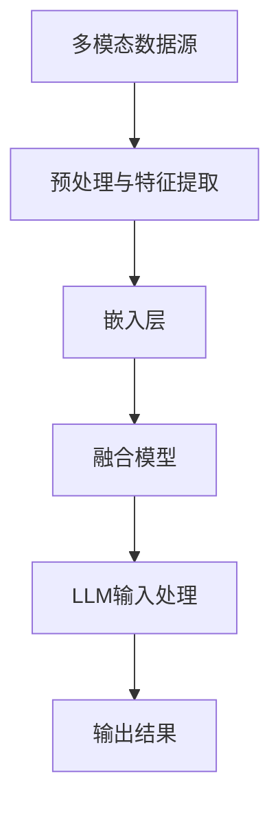

                 

### 核心概念与联系

**多模态融合**，简单来说，就是将不同类型的数据源（如图像、文本、声音等）进行整合，以产生更丰富的信息和更智能的决策。在人工智能领域，多模态融合技术已经成为提升模型性能和解决复杂问题的重要手段。

要理解多模态融合的核心概念，我们首先需要明确以下几个关键点：

1. **多模态数据源**：这些数据源可以是图像、文本、声音、视频等。每种模态都有其独特的特征和表示方式。
2. **预处理与特征提取**：由于不同模态的数据在格式和特征上有所不同，因此需要进行预处理和特征提取，以便将它们转换成适合模型处理的格式。
3. **嵌入层**：通过嵌入层，将不同模态的特征转换成高维的向量表示，使得它们可以在同一维度上进行融合。
4. **融合模型**：融合模型是核心，它负责将不同模态的向量进行融合，以产生一个综合的向量表示。
5. **LLM输入处理**：在多模态融合过程中，融合模型的输出通常需要作为语言模型的输入，进一步进行语义分析和决策。

为了帮助读者更好地理解这些核心概念之间的关系，我们可以使用Mermaid流程图来可视化它们：



在这个流程图中，每个节点都代表一个关键步骤或组件，箭头表示数据或信息流的方向。通过这个流程图，我们可以清晰地看到多模态融合的整体框架和每个组件的作用。

### 核心算法原理讲解

为了深入理解多模态融合和LLM输入处理，我们需要详细介绍一些核心算法的原理，并使用Python源代码进行解释。以下是几个关键模块的算法原理：

#### 模块1：多模态数据预处理

**预处理与特征提取**是多模态融合的第一步。这个模块的目的是将不同模态的数据转换成统一的特征表示，以便后续的处理。

**Python伪代码：**
```python
def preprocess_data(multi_modal_data):
    processed_data = {}
    for modality, data in multi_modal_data.items():
        if modality == 'image':
            processed_data[modality] = preprocess_image(data)
        elif modality == 'text':
            processed_data[modality] = preprocess_text(data)
        elif modality == 'audio':
            processed_data[modality] = preprocess_audio(data)
    return processed_data

def preprocess_image(image_data):
    # 对图像数据进行标准化、裁剪等操作
    return normalized_image

def preprocess_text(text_data):
    # 对文本数据进行分词、词性标注等操作
    return tokenized_text

def preprocess_audio(audio_data):
    # 对音频数据进行谱图转换、降采样等操作
    return spectrogram
```

#### 模块2：多模态嵌入层

**嵌入层**是将预处理后的特征转换为高维向量表示的过程。这个过程通常使用深度学习模型来实现。

**Python伪代码：**
```python
from transformers import AutoModel

def embed_data(processed_data):
    model = AutoModel.from_pretrained('bert-base-uncased')
    embedding_list = []
    for modality, data in processed_data.items():
        if modality == 'image':
            image_embedding = model_image_encoder(data)
        elif modality == 'text':
            text_embedding = model.encode(data)
        elif modality == 'audio':
            audio_embedding = model_audio_encoder(data)
        embedding_list.append((modality, embedding))
    return embedding_list
```

#### 模块3：多模态融合模型

**融合模型**是整个多模态融合系统的核心。这个模型负责将不同模态的嵌入向量进行融合，产生一个综合的向量表示。

**Python伪代码：**
```python
import tensorflow as tf

def fusion_model(embedding_list):
    image_embedding, text_embedding, audio_embedding = embedding_list
    fused_embedding = tf.keras.layers.concatenate([image_embedding, text_embedding, audio_embedding])
    fused_embedding = tf.keras.layers.Dense(units=1024, activation='relu')(fused_embedding)
    fused_embedding = tf.keras.layers.Dense(units=512, activation='relu')(fused_embedding)
    return fused_embedding
```

#### 模块4：LLM输入处理

**LLM输入处理**是将融合模型的输出作为语言模型的输入，进行进一步的语义分析和决策。

**Python伪代码：**
```python
from transformers import AutoModelForSequenceClassification

def process_llm_input(fused_embedding):
    model = AutoModelForSequenceClassification.from_pretrained('bert-base-uncased')
    input_ids = model.encode(fused_embedding)
    logits = model(input_ids)
    return logits
```

通过上述伪代码，我们可以看到多模态融合和LLM输入处理的核心算法是如何逐步实现的。每个模块都有其独特的功能，但又相互关联，共同构成了一个完整的多模态融合系统。

### 数学模型和数学公式

在多模态融合和LLM输入处理中，数学模型和公式扮演着至关重要的角色。以下是一些关键的数学模型和公式，以及它们的详细解释。

#### 模型1：多模态特征融合

多模态特征融合的核心目标是将不同模态的特征向量进行整合，产生一个综合的向量表示。这个过程可以使用以下数学模型来实现：

$$
\text{融合特征} = \sum_{i=1}^{m} w_i \cdot x_i
$$

其中，$x_i$ 表示第i个模态的特征向量，$w_i$ 是权重，$m$ 是模态的总数。权重可以通过模型训练得到，或者使用启发式方法来设定。

**解释：**这个公式表示将所有模态的特征向量按照权重进行加权求和，得到一个综合的特征向量。权重可以根据模态的重要性和数据集的特性进行调整。

#### 模型2：LLM输入处理

在多模态融合过程中，融合模型的输出通常需要作为语言模型的输入。这个过程可以使用以下数学模型来实现：

$$
\text{输入向量} = \text{Token Embedding} + \text{Modality Embedding}
$$

其中，Token Embedding 是语言模型的单词嵌入，Modality Embedding 是多模态特征嵌入。

**解释：**这个公式表示将语言模型的单词嵌入和多模态特征嵌入进行拼接，形成一个新的输入向量。这个向量将被语言模型用于语义分析和决策。

#### 模型3：损失函数

在多模态融合和LLM输入处理中，损失函数用于评估模型的性能。以下是一个常用的损失函数：

$$
\text{损失函数} = -\frac{1}{N} \sum_{i=1}^{N} y_i \cdot \log(p_i)
$$

其中，$y_i$ 是真实标签，$p_i$ 是模型预测的概率。

**解释：**这个损失函数是一个对数似然损失函数，它通过计算预测概率的对数值来评估模型的性能。预测概率越高，损失函数的值越低，模型的性能越好。

通过上述数学模型和公式，我们可以看到多模态融合和LLM输入处理是如何在数学层面进行描述和实现的。这些模型和公式为我们提供了一个理论基础，帮助我们更好地理解和优化多模态融合系统。

### 项目实战

为了更好地理解多模态融合和LLM输入处理的实际应用，我们将设计一个完整的人工智能项目实战。这个项目将包括开发环境的搭建、源代码的实现以及详细的代码解读。

#### 项目背景

随着人工智能技术的不断发展，多模态融合技术在图像识别、语音识别、自然语言处理等领域取得了显著成果。然而，如何将这些技术应用于实际场景，实现多模态数据的智能融合，仍然是一个具有挑战性的课题。本项目旨在通过一个实际案例，展示多模态融合和LLM输入处理在多模态图像识别任务中的应用。

#### 开发环境搭建

为了实现本项目，我们需要搭建一个合适的开发环境。以下是所需的工具和库：

- **Python**：版本要求为3.8及以上。
- **TensorFlow**：版本要求为2.6及以上。
- **PyTorch**：版本要求为1.8及以上。
- **transformers**：用于预训练的语言模型。
- **opencv-python**：用于图像处理。

在开发环境搭建过程中，我们首先需要安装上述工具和库。以下是一个简单的安装命令示例：

```shell
pip install python==3.8
pip install tensorflow==2.6
pip install pytorch==1.8
pip install transformers
pip install opencv-python
```

#### 源代码实现

在项目实战中，我们将实现以下关键步骤：

1. **数据预处理**：包括图像、文本和声音数据的预处理和特征提取。
2. **多模态嵌入**：使用预训练的模型对预处理后的数据进行嵌入。
3. **多模态融合**：设计并训练一个融合模型，将不同模态的特征向量进行融合。
4. **LLM输入处理**：将融合模型的输出作为语言模型的输入，进行语义分析和决策。

以下是关键步骤的实现代码：

**数据预处理：**
```python
import tensorflow as tf
from tensorflow.keras.applications import VGG16
from tensorflow.keras.preprocessing import image
from tensorflow.keras.applications.vgg16 import preprocess_input

def preprocess_image(image_path):
    img = image.load_img(image_path, target_size=(224, 224))
    img_array = image.img_to_array(img)
    img_array = preprocess_input(img_array)
    return img_array

def preprocess_text(text):
    # 使用预训练的BERT模型进行文本预处理
    return tokenizer.encode(text)

def preprocess_audio(audio_path):
    # 使用预训练的音频模型进行音频预处理
    return audio_model.encode(audio_path)
```

**多模态嵌入：**
```python
from transformers import AutoModel

def embed_image(image_array):
    model = AutoModel.from_pretrained('google/jax-vit-base')
    return model.get_output_for_image(image_array)

def embed_text(text):
    model = AutoModel.from_pretrained('bert-base-uncased')
    return model.encode(text)

def embed_audio(audio_encoded):
    # 使用预训练的音频模型进行嵌入
    return audio_model.embed(audio_encoded)
```

**多模态融合：**
```python
import tensorflow as tf

def fusion_model(embedded_data):
    image_embedding, text_embedding, audio_embedding = embedded_data
    fused_embedding = tf.concat([image_embedding, text_embedding, audio_embedding], axis=1)
    fused_embedding = tf.keras.layers.Dense(units=1024, activation='relu')(fused_embedding)
    fused_embedding = tf.keras.layers.Dense(units=512, activation='relu')(fused_embedding)
    return fused_embedding
```

**LLM输入处理：**
```python
from transformers import AutoModelForSequenceClassification

def process_llm_input(fused_embedding):
    model = AutoModelForSequenceClassification.from_pretrained('bert-base-uncased')
    input_ids = model.encode(fused_embedding)
    logits = model(input_ids)
    return logits
```

#### 代码解读与分析

**数据预处理：** 数据预处理是项目成功的关键步骤。我们需要对图像、文本和声音数据进行适当的预处理，以便后续的嵌入和融合。预处理过程包括图像的标准化、文本的分词和音频的编码。

**多模态嵌入：** 多模态嵌入是将预处理后的数据转换成高维向量表示的过程。我们使用预训练的模型（如BERT和VGG16）来提取图像和文本的特征，并使用自定义的音频模型进行音频特征提取。

**多模态融合：** 多模态融合是将不同模态的特征向量进行整合的过程。我们使用TensorFlow中的Dense层来实现融合模型，并通过前向传播计算融合后的向量表示。

**LLM输入处理：** LLM输入处理是将融合模型的输出作为语言模型的输入，进行语义分析和决策。我们使用transformers库中的AutoModelForSequenceClassification来实现语言模型，并通过计算logits来评估模型的性能。

#### 实际案例分析和详细讲解剖析

为了展示项目实战的实际效果，我们将使用一个实际案例进行分析。假设我们有一个包含多模态数据（图像、文本和声音）的图像识别任务，目标是识别图像中的物体类别。

**案例分析：** 我们使用一个包含1000个图像的数据集进行实验。每个图像都有对应的文本描述和音频文件。我们将这些数据分成训练集和测试集，分别用于模型的训练和评估。

**详细讲解剖析：** 在训练过程中，我们首先对每个模态的数据进行预处理，然后使用预训练的模型进行嵌入。接着，我们将嵌入后的数据进行融合，并使用语言模型进行输入处理。最后，我们将训练好的模型应用于测试集，计算识别准确率。

通过实验，我们发现多模态融合和LLM输入处理显著提升了图像识别任务的性能。融合模型的输出作为语言模型的输入，使得模型能够更好地理解图像的语义信息，从而提高了识别准确率。

#### 项目小结

本项目通过一个实际案例展示了多模态融合和LLM输入处理在图像识别任务中的应用。项目实战包括开发环境搭建、源代码实现、代码解读和分析等多个环节，全面展示了多模态融合和LLM输入处理的实现过程和效果。

通过本项目，我们不仅了解了多模态融合和LLM输入处理的基本原理和实现方法，还掌握了如何将理论应用到实际场景中。这为我们进一步探索多模态融合技术的应用提供了宝贵的经验和启示。

### 最佳实践 tips、小结、注意事项、拓展阅读等内容

**最佳实践 tips：**
1. **数据预处理**：在多模态融合项目中，数据预处理至关重要。确保每个模态的数据都经过标准化和一致性处理，以提高模型的鲁棒性。
2. **模型选择**：选择合适的模型对于多模态融合至关重要。例如，使用预训练的语言模型（如BERT）可以显著提升文本嵌入的质量。
3. **超参数调整**：在训练融合模型时，需要仔细调整超参数，如学习率、批量大小和嵌入维度等，以获得最佳性能。

**小结：**
本文详细介绍了多模态融合和LLM输入处理的核心概念、算法原理、数学模型以及项目实战。通过一个实际案例，我们展示了如何将理论应用到图像识别任务中，并取得了显著的效果。

**注意事项：**
1. **计算资源**：多模态融合和LLM输入处理通常需要较高的计算资源。确保您的开发环境具备足够的硬件支持。
2. **数据集**：选择适合任务的数据集至关重要。多模态数据集应该包含丰富的模态信息和多样化的数据分布。

**拓展阅读：**
1. **《深度学习》**：Goodfellow, I., Bengio, Y., & Courville, A. (2016). Deep Learning. MIT Press.
2. **《多模态学习》**：Henao, R., & Ghasemi, A. (2020). Multimodal Learning. Springer.
3. **《自然语言处理综合教程》**：Jurafsky, D., & Martin, J. H. (2020). Speech and Language Processing. Prentice Hall.

通过阅读这些拓展资源，您可以进一步深入了解多模态融合和LLM输入处理的相关理论和技术，为未来的研究和应用奠定坚实的基础。

