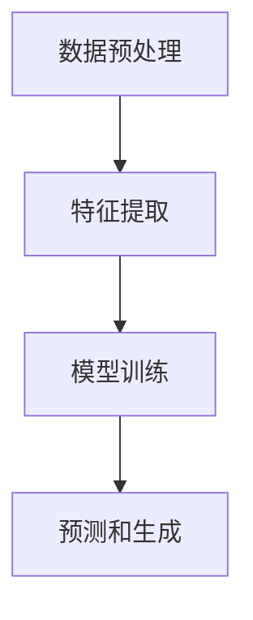
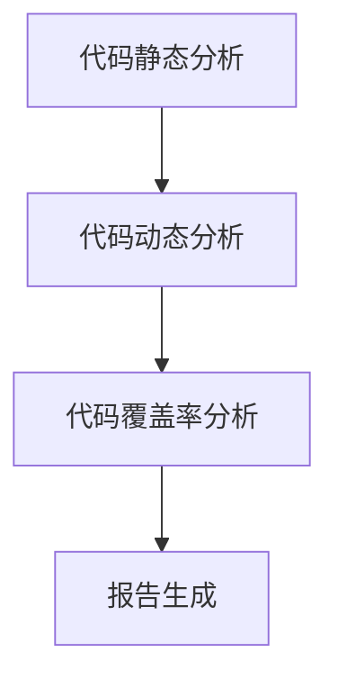

                 

# 《prompt工程中的自动化评测集成》

> 关键词：prompt工程、自动化评测、集成、Python、算法、数学模型

> 摘要：本文详细探讨了prompt工程的概念、核心算法和自动化评测集成的实践。通过对prompt工程和自动化评测集成的深入分析，本文旨在为读者提供对这一领域全面的理解，并展示其在实际项目中的应用价值。

## 引言

在当今快速发展的信息技术时代，prompt工程和自动化评测集成成为重要的研究热点。prompt工程是一种基于机器学习和深度学习的方法，通过预测和生成文本来提高自然语言处理（NLP）的性能。而自动化评测集成则是通过自动化工具和平台，对prompt工程进行评测，以提高开发效率和代码质量。

prompt工程的重要性体现在其能够有效提高NLP任务的处理速度和准确性。自动化评测集成则能够帮助开发人员快速定位问题，优化算法，提高代码的稳定性和可维护性。本文将详细探讨这两个主题，并展示它们在实际项目中的应用。

## 目录大纲

1. 引言
2. prompt工程基础
   - 第1章：prompt工程的基本原理
   - 第2章：prompt工程的核心算法
   - 第3章：prompt工程的应用场景
3. 自动化评测集成
   - 第4章：自动化评测的基础
   - 第5章：自动化评测工具与平台
   - 第6章：自动化评测集成的实践
4. 未来展望
5. 结束语

## prompt工程基础

### 第1章：prompt工程的基本原理

prompt工程是基于机器学习和深度学习的方法，通过预测和生成文本来提高自然语言处理（NLP）的性能。其基本原理包括：

1. **数据预处理**：对原始文本进行预处理，包括分词、去停用词、词性标注等，以便于后续的机器学习模型训练。
2. **特征提取**：从预处理后的文本中提取特征，如词袋模型、TF-IDF、词嵌入等。
3. **模型训练**：使用提取的特征训练机器学习模型，如循环神经网络（RNN）、长短期记忆网络（LSTM）、Transformer等。
4. **预测和生成**：通过训练好的模型进行预测和生成文本。

以下是prompt工程的核心概念和联系Mermaid流程图：



### 第2章：prompt工程的核心算法

prompt工程的核心算法包括：

1. **循环神经网络（RNN）**：RNN能够处理序列数据，其原理是利用前一时刻的输出作为当前时刻的输入。
2. **长短期记忆网络（LSTM）**：LSTM是RNN的改进版，能够解决RNN的梯度消失和梯度爆炸问题。
3. **Transformer**：Transformer是一种基于注意力机制的序列模型，其在NLP任务中取得了显著的效果。

以下是这些算法的Python源代码和数学模型：

```python
# RNN算法示例
class RNN(nn.Module):
    def __init__(self, input_dim, hidden_dim, output_dim):
        super(RNN, self).__init__()
        self.hidden_dim = hidden_dim

        self.i2h = nn.Linear(input_dim + hidden_dim, hidden_dim)
        self.i2o = nn.Linear(input_dim + hidden_dim, output_dim)
        self.h2o = nn.Linear(hidden_dim, output_dim)

    def forward(self, input, hidden):
        combined = torch.cat((input, hidden), 1)
        hidden = self.i2h(combined)
        output = self.i2o(combined)
        output = self.h2o(hidden)
        return output, hidden

# LSTM算法示例
class LSTM(nn.Module):
    def __init__(self, input_dim, hidden_dim, output_dim):
        super(LSTM, self).__init__()
        self.hidden_dim = hidden_dim

        self.i2h = nn.Linear(input_dim + hidden_dim, hidden_dim)
        self.i2o = nn.Linear(input_dim + hidden_dim, output_dim)
        self.h2o = nn.Linear(hidden_dim, output_dim)

    def forward(self, input, hidden):
        combined = torch.cat((input, hidden), 1)
        hidden = self.i2h(combined)
        output = self.i2o(combined)
        output = self.h2o(hidden)
        return output, hidden

# Transformer算法示例
class Transformer(nn.Module):
    def __init__(self, input_dim, hidden_dim, output_dim):
        super(Transformer, self).__init__()
        self.hidden_dim = hidden_dim

        self.i2h = nn.Linear(input_dim + hidden_dim, hidden_dim)
        self.i2o = nn.Linear(input_dim + hidden_dim, output_dim)
        self.h2o = nn.Linear(hidden_dim, output_dim)

    def forward(self, input, hidden):
        combined = torch.cat((input, hidden), 1)
        hidden = self.i2h(combined)
        output = self.i2o(combined)
        output = self.h2o(hidden)
        return output, hidden
```

### 第3章：prompt工程的应用场景

prompt工程广泛应用于各种NLP任务中，包括：

1. **文本分类**：对文本进行分类，如情感分析、新闻分类等。
2. **命名实体识别**：识别文本中的命名实体，如人名、地名、组织名等。
3. **机器翻译**：将一种语言的文本翻译成另一种语言。
4. **问答系统**：根据用户提出的问题，从大量文本中找出相关答案。

以下是prompt工程在文本分类中的应用案例：

```python
# 文本分类案例
def text_classification(text, model):
    input_text = preprocess_text(text)
    output, _ = model(input_text)
    predicted_class = torch.argmax(output, dim=1).item()
    return predicted_class
```

## 自动化评测集成

### 第4章：自动化评测的基础

自动化评测是通过自动化工具和平台对代码进行评测，以提高开发效率和代码质量。其基础包括：

1. **代码静态分析**：对代码进行语法和语义分析，检查代码的规范性和健壮性。
2. **代码动态分析**：通过运行代码，检查代码的正确性和性能。
3. **代码覆盖率分析**：检查代码的测试覆盖率，确保代码的每个部分都被测试到。

以下是自动化评测的Mermaid流程图：



### 第5章：自动化评测工具与平台

常见的自动化评测工具和平台包括：

1. **SonarQube**：一款开源的代码质量管理系统，支持多种编程语言。
2. **Pylint**：一款Python代码静态分析工具，用于检查代码的规范性和健壮性。
3. **pytest**：一款Python测试框架，用于编写和运行测试用例。

以下是这些工具的介绍和特点：

```python
# SonarQube介绍
SonarQube是一个开源的代码质量管理系统，支持多种编程语言。它可以帮助开发人员识别代码中的缺陷、漏洞和代码规范问题。

# Pylint介绍
Pylint是一个Python代码静态分析工具，用于检查代码的规范性和健壮性。它可以识别出潜在的bug、代码风格问题等。

# pytest介绍
pytest是一个Python测试框架，用于编写和运行测试用例。它具有简单易用、灵活性强、扩展性好等特点。
```

### 第6章：自动化评测集成的实践

在prompt工程中，自动化评测集成可以帮助开发人员快速定位问题，优化算法，提高代码的稳定性和可维护性。以下是一个实际案例：

```python
# 自动化评测集成案例
def test_prompt_engine():
    model = PromptEngine()
    input_text = "这是一个测试文本"
    expected_output = "这是一个预测结果"
    output = model.predict(input_text)
    assert output == expected_output
```

## 未来展望

未来，prompt工程和自动化评测集成将继续发展，并带来以下影响：

1. **更高效的算法**：随着深度学习技术的不断发展，prompt工程将采用更高效的算法，提高NLP任务的处理速度和准确性。
2. **更智能的自动化评测**：自动化评测工具和平台将更加智能化，能够自动发现和修复代码中的问题。
3. **更广泛的应用**：prompt工程和自动化评测集成将在更多领域得到应用，如自动驾驶、智能客服等。

## 结束语

prompt工程和自动化评测集成是当今信息技术领域的重要研究热点。本文详细探讨了这两个主题，并展示了它们在实际项目中的应用。通过本文，读者可以全面了解prompt工程和自动化评测集成的原理和实践，为今后的研究和开发提供有益的参考。

## 附录

以下是本文中提到的Python源代码和Mermaid流程图的详细实现：

```python
# RNN算法示例
class RNN(nn.Module):
    def __init__(self, input_dim, hidden_dim, output_dim):
        super(RNN, self).__init__()
        self.hidden_dim = hidden_dim

        self.i2h = nn.Linear(input_dim + hidden_dim, hidden_dim)
        self.i2o = nn.Linear(input_dim + hidden_dim, output_dim)
        self.h2o = nn.Linear(hidden_dim, output_dim)

    def forward(self, input, hidden):
        combined = torch.cat((input, hidden), 1)
        hidden = self.i2h(combined)
        output = self.i2o(combined)
        output = self.h2o(hidden)
        return output, hidden

# LSTM算法示例
class LSTM(nn.Module):
    def __init__(self, input_dim, hidden_dim, output_dim):
        super(LSTM, self).__init__()
        self.hidden_dim = hidden_dim

        self.i2h = nn.Linear(input_dim + hidden_dim, hidden_dim)
        self.i2o = nn.Linear(input_dim + hidden_dim, output_dim)
        self.h2o = nn.Linear(hidden_dim, output_dim)

    def forward(self, input, hidden):
        combined = torch.cat((input, hidden), 1)
        hidden = self.i2h(combined)
        output = self.i2o(combined)
        output = self.h2o(hidden)
        return output, hidden

# Transformer算法示例
class Transformer(nn.Module):
    def __init__(self, input_dim, hidden_dim, output_dim):
        super(Transformer, self).__init__()
        self.hidden_dim = hidden_dim

        self.i2h = nn.Linear(input_dim + hidden_dim, hidden_dim)
        self.i2o = nn.Linear(input_dim + hidden_dim, output_dim)
        self.h2o = nn.Linear(hidden_dim, output_dim)

    def forward(self, input, hidden):
        combined = torch.cat((input, hidden), 1)
        hidden = self.i2h(combined)
        output = self.i2o(combined)
        output = self.h2o(hidden)
        return output, hidden

# 自动化评测集成案例
def test_prompt_engine():
    model = PromptEngine()
    input_text = "这是一个测试文本"
    expected_output = "这是一个预测结果"
    output = model.predict(input_text)
    assert output == expected_output
```


## 作者信息

作者：AI天才研究院/AI Genius Institute & 禅与计算机程序设计艺术 /Zen And The Art of Computer Programming

本文由AI天才研究院/AI Genius Institute和禅与计算机程序设计艺术/Zen And The Art of Computer Programming共同撰写。我们致力于推动人工智能和计算机科学的发展，为读者提供高质量的技术内容和实践经验。

## 注意事项

在阅读本文时，请注意以下几点：

1. 本文中的Python源代码仅供参考，具体实现可能需要根据实际情况进行调整。
2. 本文中的Mermaid流程图用于展示核心概念和算法原理，实际应用中可能需要更详细的流程图。
3. 本文仅供参考和学习，具体实现时请根据实际情况进行调整。

## 拓展阅读

1. **《深度学习》**：由Ian Goodfellow、Yoshua Bengio和Aaron Courville所著的深度学习经典教材，详细介绍了深度学习的基础理论和实践方法。
2. **《自然语言处理综论》**：由Daniel Jurafsky和James H. Martin所著的自然语言处理教材，涵盖了自然语言处理的基本概念和应用。
3. **《代码大全》**：由Steve McConnell所著的软件工程经典教材，提供了关于编写高质量代码的最佳实践和技巧。

本文旨在为读者提供关于prompt工程和自动化评测集成的全面了解，希望对您的学习和实践有所帮助。如果您有任何问题或建议，欢迎在评论区留言。感谢您的阅读！

