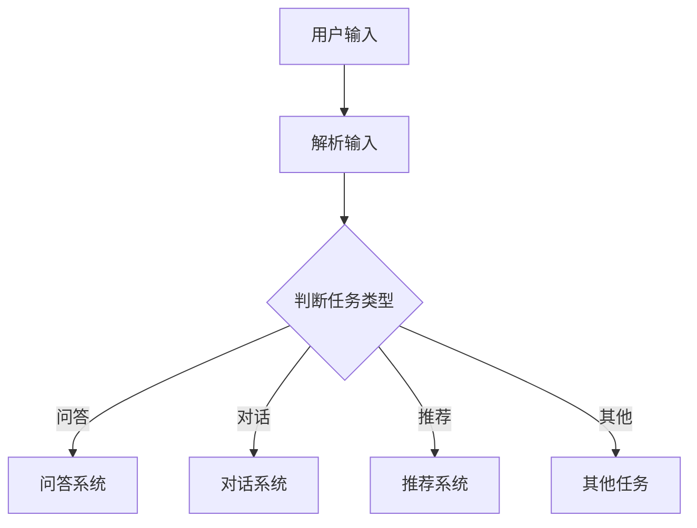

                 

### 第1章: 提示工程概述

#### 背景介绍

提示工程（Prompt Engineering）是近年来人工智能领域中一个快速发展的分支。它主要关注如何构建、优化和应用高质量提示（prompt）来增强人工智能系统的性能和表现。在自然语言处理（NLP）、问答系统、对话系统、推荐系统等多个领域，提示工程已经展现出了其独特的价值。

随着深度学习和自然语言处理技术的不断发展，传统的基于规则的方法已经逐渐被基于模型的自动化方法所取代。提示工程正是这种趋势下的一种新兴方法，它通过精心设计的提示，使得模型能够更好地理解和生成人类语言，从而提升人工智能系统的智能化程度。

#### 核心概念与联系

**提示**：提示是用户与系统交互的桥梁，它是系统理解用户意图、生成响应的基础。一个高质量的提示应该具备明确的目标、具体的问题描述以及必要的上下文信息。

**语言模型**：语言模型是自然语言处理的核心组件之一，它用于预测单词序列的概率分布。在提示工程中，常用的语言模型包括循环神经网络（RNN）、长短期记忆网络（LSTM）和变换器（Transformer）等。

**上下文嵌入**：上下文嵌入是将文本转换为向量表示的方法，它使得模型能够利用上下文信息来更好地理解文本。上下文嵌入技术包括Word2Vec、BERT、GPT等。

**任务导向**：提示工程强调任务导向的提示设计，即根据具体的任务需求来设计提示。这涉及到对任务目标的明确、问题陈述的优化以及上下文信息的选取等。

#### Mermaid 流程图

下面是一个简单的Mermaid流程图，用于描述提示工程的核心组件和流程：

#### 结论

提示工程是一个跨领域的综合性技术，它通过精心设计的提示来提升人工智能系统的性能。在未来的发展中，提示工程有望在更多领域发挥作用，为人工智能的发展提供新的动力。

### 文章摘要

本章对提示工程进行了概述，介绍了其背景、核心概念以及与语言模型、上下文嵌入等的联系。通过一个简单的Mermaid流程图，我们清晰地展示了提示工程的核心组件和流程。本章旨在为读者提供一个对提示工程的初步了解，为后续章节的深入学习奠定基础。

