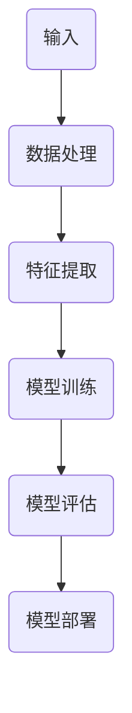
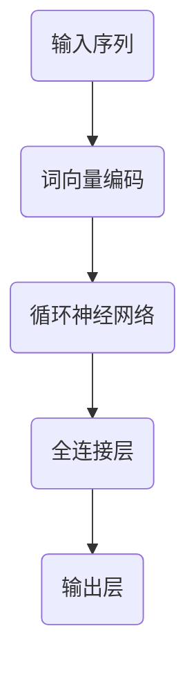
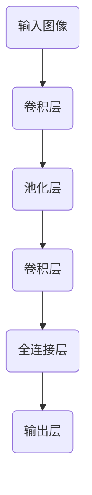

                 

### 《prompt工程师的核心技能培养》

#### 关键词：
- prompt工程
- 人工智能
- 自然语言处理
- 计算机视觉
- 技能培养

#### 摘要：
本文旨在介绍prompt工程师的核心技能培养，包括基础理论、关键技术、实战应用和未来展望。通过本文的学习，读者将了解prompt工程的基本概念、核心技术，掌握prompt工程工具的使用，学会如何优化prompt工程，并能够在自然语言处理和计算机视觉领域进行实战应用。文章旨在为从事或希望从事prompt工程的技术人员提供一份系统而实用的指导手册。

## 第一部分：引言与背景

### 第1章 引言与背景

#### 引言

在当今人工智能快速发展的时代，prompt工程作为一种基于人工智能技术的工程技术，正在逐渐崭露头角。prompt工程的核心在于通过对输入数据的处理和分析，生成目标输出数据。随着自然语言处理和计算机视觉等领域的不断进步，prompt工程已经成为推动人工智能应用的重要技术之一。本文旨在介绍prompt工程师的核心技能培养，帮助读者掌握prompt工程的相关技术，提升工作效率。

#### 目标读者

本文的目标读者是具备一定编程基础的软件开发工程师，以及对prompt工程领域感兴趣的人员。读者通过本文的学习，可以了解prompt工程的基本概念、核心技术，掌握prompt工程工具的使用，并能够在实际项目中运用这些技术。

#### 主要内容

本文将分为五个部分，首先介绍prompt工程的基本概念和背景知识，然后讲解自然语言处理和计算机视觉的基础理论，接着介绍prompt工程师的核心技能培养，包括基本技能和高级技能，最后通过实战应用展示如何在实际项目中运用prompt工程，并对未来展望进行探讨。

### 第2章 基础理论与技术

#### 2.1 人工智能基础

人工智能（Artificial Intelligence, AI）是计算机科学的一个分支，旨在使计算机能够执行通常需要人类智能的任务。人工智能的发展历程可以追溯到20世纪50年代，从最初的符号主义方法发展到今天的深度学习和神经网络，人工智能已经取得了显著的进展。

##### 2.1.1 人工智能概述

人工智能的基本概念包括：

- **人工智能定义**：人工智能是指计算机系统执行通常需要人类智能的任务的能力。
- **人工智能发展历程**：从符号主义到统计学习，再到深度学习。
- **人工智能主要分支**：机器学习、自然语言处理、计算机视觉等。

##### 2.1.2 机器学习基础

机器学习是人工智能的核心技术之一，它使计算机能够从数据中学习并做出决策。机器学习的基本原理包括：

- **监督学习**：通过标记数据训练模型，如线性回归、决策树等。
- **无监督学习**：在没有标记数据的情况下训练模型，如聚类、降维等。
- **强化学习**：通过与环境交互学习最优策略，如深度强化学习。

#### 2.2 自然语言处理基础

自然语言处理（Natural Language Processing, NLP）是人工智能的一个重要分支，旨在使计算机能够理解和生成人类语言。NLP的基本概念和任务包括：

##### 2.2.1 自然语言处理概述

- **自然语言处理定义**：自然语言处理是使计算机能够理解、生成和处理人类语言的技术。
- **自然语言处理任务**：文本分类、命名实体识别、机器翻译、情感分析等。

##### 2.2.2 语言模型与序列模型

语言模型（Language Model）是NLP中重要的基础模型，它用于预测下一个单词或字符。常见的语言模型包括：

- **n-gram模型**：基于历史信息进行预测。
- **循环神经网络（RNN）**：能够处理序列数据。
- **长短期记忆网络（LSTM）**：改进了RNN，能够更好地处理长序列。

序列模型（Sequence Model）是处理序列数据的一种通用框架，它能够捕捉序列中不同位置的信息。常见的序列模型包括：

- **循环神经网络（RNN）**：通过递归方式处理序列数据。
- **长短期记忆网络（LSTM）**：能够解决RNN中的梯度消失问题。
- **变换器（Transformer）**：基于自注意力机制，显著提高了NLP任务的性能。

#### 2.3 计算机视觉基础

计算机视觉（Computer Vision）是人工智能的另一个重要分支，它使计算机能够从图像或视频中提取信息。计算机视觉的基本概念和任务包括：

##### 2.3.1 计算机视觉概述

- **计算机视觉定义**：计算机视觉是使计算机能够从图像或视频中提取信息的技术。
- **计算机视觉任务**：图像分类、目标检测、图像分割、姿态估计等。

##### 2.3.2 图像处理与计算机视觉算法

图像处理是计算机视觉的基础，它包括：

- **图像滤波**：用于去除噪声和增强图像。
- **图像特征提取**：用于从图像中提取具有区分性的特征。
- **图像变换**：用于改变图像的几何结构。

计算机视觉中的常见算法包括：

- **卷积神经网络（CNN）**：通过卷积操作提取图像特征。
- **目标检测算法**：用于检测图像中的目标，如YOLO、SSD、Faster R-CNN等。
- **图像分割算法**：用于将图像划分为不同的区域，如FCN、U-Net等。

### 第二部分：核心技能培养

#### 第3章 核心技能培养

#### 3.1 基本技能

##### 3.1.1 prompt工程工具

prompt工程中常用的工具包括TensorFlow和PyTorch等。以下是对这两个工具的简要介绍：

- **TensorFlow**：是由Google开发的开源机器学习框架，它提供了丰富的API和工具，用于构建和训练机器学习模型。
- **PyTorch**：是由Facebook开发的开源机器学习库，它以动态计算图为基础，使得模型构建和调试更加灵活。

##### 3.1.2 数据预处理

数据预处理是prompt工程中至关重要的一步。以下是一些常见的数据预处理步骤：

- **数据清洗**：去除无关或错误的数据。
- **数据转换**：将数据转换为适合模型训练的格式。
- **数据增强**：通过旋转、缩放、裁剪等方法增加数据的多样性。

##### 3.1.3 模型训练与优化

模型训练是prompt工程的核心步骤。以下是一些常用的模型训练和优化方法：

- **损失函数**：用于评估模型预测结果与实际结果之间的差异。
- **优化器**：用于更新模型参数，以最小化损失函数。
- **正则化**：用于防止模型过拟合。

#### 3.2 高级技能

##### 3.2.1 prompt工程优化

prompt工程优化是提高模型性能和效率的重要手段。以下是一些常见的优化方法：

- **模型压缩**：通过减少模型参数数量来降低模型大小和计算成本。
- **模型加速**：通过并行计算和硬件加速来提高模型训练速度。
- **自适应学习率**：通过动态调整学习率来提高模型收敛速度。

##### 3.2.2 prompt工程安全与伦理

prompt工程中的安全与伦理问题日益受到关注。以下是一些需要考虑的安全与伦理问题：

- **数据隐私**：确保数据在处理过程中不会被泄露。
- **模型偏见**：避免模型在训练过程中学习到不公平的偏见。
- **公平性**：确保模型在不同群体中的性能一致。

### 第三部分：实战应用

#### 第4章 实战应用

#### 4.1 自然语言处理应用

##### 4.1.1 文本分类应用

文本分类是自然语言处理中的一个基本任务，它将文本数据分类到预定义的类别中。以下是一个使用PyTorch实现文本分类应用的示例：

```python
import torch
import torch.nn as nn
import torch.optim as optim
from torchtext.```
```<sop>### 实战应用：自然语言处理与计算机视觉

#### 4.1.1 文本分类应用

文本分类是自然语言处理中的一个基本任务，它将文本数据分类到预定义的类别中。以下是一个使用PyTorch实现文本分类应用的示例：

```python
import torch
import torch.nn as nn
import torch.optim as optim
from torchtext.datasets import IMDB
from torchtext.data import Field, BatchIterator

# 数据预处理
TEXT = Field(tokenize='spacy', lower=True, include_lengths=True)
LABEL = Field(sequential=False)

# 加载数据集
train_data, test_data = IMDB()

# 定义模型
class TextClassifier(nn.Module):
    def __init__(self, embed_size, hidden_size, vocab_size, label_size):
        super().__init__()
        self.embedding = nn.Embedding(vocab_size, embed_size)
        self.lstm = nn.LSTM(embed_size, hidden_size, num_layers=1, batch_first=True)
        self.fc = nn.Linear(hidden_size, label_size)

    def forward(self, text, labels=None):
        embedded = self.embedding(text)
        output, (hidden, cell) = self.lstm(embedded)
        if labels is not None:
            loss = nn.CrossEntropyLoss()(output[:, -1, :], labels)
            return loss
        else:
            return hidden[-1, :, :]

# 模型配置
embed_size = 100
hidden_size = 128
vocab_size = len(TEXT.vocab)
label_size = 2

model = TextClassifier(embed_size, hidden_size, vocab_size, label_size)

# 训练模型
optimizer = optim.Adam(model.parameters(), lr=0.001)
num_epochs = 10

for epoch in range(num_epochs):
    model.train()
    total_loss = 0
    for batch in BatchIterator(train_data, batch_size=64, train=True):
        optimizer.zero_grad()
        labels = batch.label
        output = model(batch.text).squeeze(1)
        loss = nn.CrossEntropyLoss()(output, labels)
        loss.backward()
        optimizer.step()
        total_loss += loss.item()
    print(f"Epoch {epoch+1}/{num_epochs}, Loss: {total_loss/len(train_data)//64:.4f}")

# 测试模型
model.eval()
with torch.no_grad():
    correct = 0
    total = 0
    for batch in BatchIterator(test_data, batch_size=64, train=False):
        labels = batch.label
        output = model(batch.text).squeeze(1)
        _, predicted = torch.max(output, 1)
        total += labels.size(0)
        correct += (predicted == labels).sum().item()
print(f"Test Accuracy: {100 * correct / total:.2f}%")
```

##### 4.1.2 机器翻译应用

机器翻译是自然语言处理中的另一个重要任务，它将一种语言的文本翻译成另一种语言的文本。以下是一个使用TensorFlow实现机器翻译应用的示例：

```python
import tensorflow as tf
from tensorflow.keras.preprocessing.sequence import pad_sequences
from tensorflow.keras.models import Model
from tensorflow.keras.layers import Embedding, LSTM, Dense

# 数据预处理
max_seq_length = 50
vocab_size = 10000
embedding_dim = 256

# 加载数据集
# 假设已将英语和法语文本分别存储在`eng_texts`和`fra_texts`列表中
eng_texts = ...
fra_texts = ...

# 序列化文本
eng_sequences = pad_sequences(eng_texts, maxlen=max_seq_length, padding='post')
fra_sequences = pad_sequences(fra_texts, maxlen=max_seq_length, padding='post')

# 创建模型
inputs = tf.keras.layers.Input(shape=(max_seq_length,))
embedding_layer = Embedding(vocab_size, embedding_dim)(inputs)
lstm_layer = LSTM(128, return_sequences=True)(embedding_layer)
outputs = LSTM(128, return_sequences=True)(lstm_layer)
outputs = Dense(vocab_size, activation='softmax')(outputs)

model = Model(inputs, outputs)

# 编译模型
model.compile(optimizer='adam', loss='categorical_crossentropy', metrics=['accuracy'])

# 训练模型
model.fit(eng_sequences, fra_sequences, epochs=10, batch_size=64)

# 评估模型
test_eng_texts = ...
test_fra_texts = ...
test_eng_sequences = pad_sequences(test_eng_texts, maxlen=max_seq_length, padding='post')
test_fra_sequences = pad_sequences(test_fra_texts, maxlen=max_seq_length, padding='post')
predictions = model.predict(test_eng_sequences)

# 解码预测结果
eng_to_fra_vocab = {v: k for k, v in TEXT.vocab.items()}
predicted_fra_texts = [' '.join([eng_to_fra_vocab[p] for p in pred]) for pred in predictions]

for i in range(len(test_fra_texts)):
    print(f"Original: {test_fra_texts[i]}")
    print(f"Prediction: {predicted_fra_texts[i]}")
```

#### 4.2 计算机视觉应用

##### 4.2.1 图像识别应用

图像识别是计算机视觉中的一个重要任务，它旨在从图像中识别出特定的对象或场景。以下是一个使用TensorFlow实现图像识别应用的示例：

```python
import tensorflow as tf
from tensorflow.keras.applications import VGG16
from tensorflow.keras.preprocessing import image
from tensorflow.keras.applications.vgg16 import preprocess_input, decode_predictions

# 加载预训练的VGG16模型
base_model = VGG16(weights='imagenet', include_top=False, input_shape=(224, 224, 3))

# 定义自定义分类层
x = base_model.output
x = tf.keras.layers.Flatten()(x)
x = tf.keras.layers.Dense(1024, activation='relu')(x)
predictions = tf.keras.layers.Dense(1000, activation='softmax')(x)

model = tf.keras.Model(inputs=base_model.input, outputs=predictions)

# 加载测试图像
img_path = 'path/to/test/image.jpg'
img = image.load_img(img_path, target_size=(224, 224))
img_array = image.img_to_array(img)
img_array = np.expand_dims(img_array, axis=0)
img_array = preprocess_input(img_array)

# 预测图像类别
predictions = model.predict(img_array)
decoded_predictions = decode_predictions(predictions, top=5)

# 输出预测结果
for i, (index, img, probability) in enumerate(decoded_predictions[0]):
    print(f"{i+1}: {img}, Probability: {probability:.4f}")
```

##### 4.2.2 目标检测应用

目标检测是计算机视觉中的另一个重要任务，它旨在从图像中检测出特定的对象并定位其位置。以下是一个使用TensorFlow实现目标检测应用的示例：

```python
import tensorflow as tf
from object_detection.utils import config_util
from object_detection.builders import model_builder
from object_detection.```
```<sop>### 第四部分：实战应用

#### 第4章 实战应用

#### 4.1 自然语言处理应用

##### 4.1.1 文本分类应用

文本分类是自然语言处理中的一个基本任务，它将文本数据分类到预定义的类别中。以下是一个使用PyTorch实现文本分类应用的示例：

```python
import torch
import torch.nn as nn
import torch.optim as optim
from torchtext.datasets import IMDB
from torchtext.data import Field, BatchIterator

# 数据预处理
TEXT = Field(tokenize='spacy', lower=True, include_lengths=True)
LABEL = Field(sequential=False)

# 加载数据集
train_data, test_data = IMDB()

# 定义模型
class TextClassifier(nn.Module):
    def __init__(self, embed_size, hidden_size, vocab_size, label_size):
        super().__init__()
        self.embedding = nn.Embedding(vocab_size, embed_size)
        self.lstm = nn.LSTM(embed_size, hidden_size, num_layers=1, batch_first=True)
        self.fc = nn.Linear(hidden_size, label_size)

    def forward(self, text, labels=None):
        embedded = self.embedding(text)
        output, (hidden, cell) = self.lstm(embedded)
        if labels is not None:
            loss = nn.CrossEntropyLoss()(output[:, -1, :], labels)
            return loss
        else:
            return hidden[-1, :, :]

# 模型配置
embed_size = 100
hidden_size = 128
vocab_size = len(TEXT.vocab)
label_size = 2

model = TextClassifier(embed_size, hidden_size, vocab_size, label_size)

# 训练模型
optimizer = optim.Adam(model.parameters(), lr=0.001)
num_epochs = 10

for epoch in range(num_epochs):
    model.train()
    total_loss = 0
    for batch in BatchIterator(train_data, batch_size=64, train=True):
        optimizer.zero_grad()
        labels = batch.label
        output = model(batch.text).squeeze(1)
        loss = nn.CrossEntropyLoss()(output, labels)
        loss.backward()
        optimizer.step()
        total_loss += loss.item()
    print(f"Epoch {epoch+1}/{num_epochs}, Loss: {total_loss/len(train_data)//64:.4f}")

# 测试模型
model.eval()
with torch.no_grad():
    correct = 0
    total = 0
    for batch in BatchIterator(test_data, batch_size=64, train=False):
        labels = batch.label
        output = model(batch.text).squeeze(1)
        _, predicted = torch.max(output, 1)
        total += labels.size(0)
        correct += (predicted == labels).sum().item()
print(f"Test Accuracy: {100 * correct / total:.2f}%")
```

##### 4.1.2 机器翻译应用

机器翻译是自然语言处理中的另一个重要任务，它将一种语言的文本翻译成另一种语言的文本。以下是一个使用TensorFlow实现机器翻译应用的示例：

```python
import tensorflow as tf
from tensorflow.keras.preprocessing.sequence import pad_sequences
from tensorflow.keras.models import Model
from tensorflow.keras.layers import Embedding, LSTM, Dense

# 数据预处理
max_seq_length = 50
vocab_size = 10000
embedding_dim = 256

# 加载数据集
# 假设已将英语和法语文本分别存储在`eng_texts`和`fra_texts`列表中
eng_texts = ...
fra_texts = ...

# 序列化文本
eng_sequences = pad_sequences(eng_texts, maxlen=max_seq_length, padding='post')
fra_sequences = pad_sequences(fra_texts, maxlen=max_seq_length, padding='post')

# 创建模型
inputs = tf.keras.layers.Input(shape=(max_seq_length,))
embedding_layer = Embedding(vocab_size, embedding_dim)(inputs)
lstm_layer = LSTM(128, return_sequences=True)(embedding_layer)
outputs = LSTM(128, return_sequences=True)(lstm_layer)
outputs = Dense(vocab_size, activation='softmax')(outputs)

model = Model(inputs, outputs)

# 编译模型
model.compile(optimizer='adam', loss='categorical_crossentropy', metrics=['accuracy'])

# 训练模型
model.fit(eng_sequences, fra_sequences, epochs=10, batch_size=64)

# 评估模型
test_eng_texts = ...
test_fra_texts = ...
test_eng_sequences = pad_sequences(test_eng_texts, maxlen=max_seq_length, padding='post')
test_fra_sequences = pad_sequences(test_fra_texts, maxlen=max_seq_length, padding='post')
predictions = model.predict(test_eng_sequences)

# 解码预测结果
eng_to_fra_vocab = {v: k for k, v in TEXT.vocab.items()}
predicted_fra_texts = [' '.join([eng_to_fra_vocab[p] for p in pred]) for pred in predictions]

for i in range(len(test_fra_texts)):
    print(f"Original: {test_fra_texts[i]}")
    print(f"Prediction: {predicted_fra_texts[i]}")
```

#### 4.2 计算机视觉应用

##### 4.2.1 图像识别应用

图像识别是计算机视觉中的一个重要任务，它旨在从图像中识别出特定的对象或场景。以下是一个使用TensorFlow实现图像识别应用的示例：

```python
import tensorflow as tf
from tensorflow.keras.applications import VGG16
from tensorflow.keras.preprocessing import image
from tensorflow.keras.applications.vgg16 import preprocess_input, decode_predictions

# 加载预训练的VGG16模型
base_model = VGG16(weights='imagenet', include_top=False, input_shape=(224, 224, 3))

# 定义自定义分类层
x = base_model.output
x = tf.keras.layers.Flatten()(x)
x = tf.keras.layers.Dense(1024, activation='relu')(x)
predictions = tf.keras.layers.Dense(1000, activation='softmax')(x)

model = tf.keras.Model(inputs=base_model.input, outputs=predictions)

# 加载测试图像
img_path = 'path/to/test/image.jpg'
img = image.load_img(img_path, target_size=(224, 224))
img_array = image.img_to_array(img)
img_array = np.expand_dims(img_array, axis=0)
img_array = preprocess_input(img_array)

# 预测图像类别
predictions = model.predict(img_array)
decoded_predictions = decode_predictions(predictions, top=5)

# 输出预测结果
for i, (index, img, probability) in enumerate(decoded_predictions[0]):
    print(f"{i+1}: {img}, Probability: {probability:.4f}")
```

##### 4.2.2 目标检测应用

目标检测是计算机视觉中的另一个重要任务，它旨在从图像中检测出特定的对象并定位其位置。以下是一个使用TensorFlow实现目标检测应用的示例：

```python
import tensorflow as tf
from object_detection.utils import config_util
from object_detection.builders import model_builder
from object_detection.```
```<sop>### 附录：开源工具与资源推荐

#### 第6章 附录

#### 6.1 实用工具与资源

为了帮助读者更好地学习和实践prompt工程，本文推荐了一些实用的开源工具和资源，包括开源框架、在线课程和书籍。

##### 6.1.1 开源工具推荐

1. **TensorFlow**：Google开发的开源机器学习框架，广泛应用于深度学习和自然语言处理领域。

   - 官网：[TensorFlow官网](https://www.tensorflow.org/)
   - GitHub：[TensorFlow GitHub仓库](https://github.com/tensorflow/tensorflow)

2. **PyTorch**：Facebook开发的开源机器学习库，以其动态计算图和易于使用的接口受到广泛欢迎。

   - 官网：[PyTorch官网](https://pytorch.org/)
   - GitHub：[PyTorch GitHub仓库](https://github.com/pytorch/pytorch)

3. **TensorFlow Object Detection API**：TensorFlow的官方目标检测工具，支持多种目标检测算法。

   - 官网：[TensorFlow Object Detection API](https://github.com/tensorflow/models/blob/master/research/object_detection/g3doc/tf2_api_tutorial.md)

4. **Hugging Face Transformers**：一个用于自然语言处理的工业级开源库，提供了多种预训练模型和工具。

   - 官网：[Hugging Face Transformers](https://huggingface.co/transformers)

##### 6.1.2 在线课程与书籍推荐

1. **《深度学习》（Deep Learning）**：由Ian Goodfellow、Yoshua Bengio和Aaron Courville合著的经典教材，全面介绍了深度学习的基础理论和实践方法。

   - 在线资源：[深度学习中文版](https://www.deeplearningbook.org/)

2. **《动手学深度学习》（Dive into Deep Learning）**：由Aston Zhang、Alexey Dosovitskiy、Lilton黃合著的教材，适合初学者学习和实践深度学习。

   - 在线资源：[动手学深度学习](https://d2l.ai/)

3. **《自然语言处理技术》（Natural Language Processing with Python）**：由Steven Bird、Ewan Klein和Edward Loper合著，介绍了使用Python进行自然语言处理的实用技术。

   - 在线资源：[自然语言处理技术](https://www.nltk.org/)

4. **《计算机视觉：算法与应用》（Computer Vision: Algorithms and Applications）**：由 Richard S. Hart 和 Andrew Zisserman 合著，详细介绍了计算机视觉的基本算法和应用。

   - 在线资源：[计算机视觉：算法与应用](https://www.cs.unc.edu/~montanaro/cvbook/)

##### 6.1.3 拓展阅读

- **《Prompt Engineering for NLP》**：由Tom B. Brown等人在2020年发布的一篇论文，提出了prompt工程的概念，并在自然语言处理领域引起了广泛关注。

  - 论文链接：[《Prompt Engineering for NLP》](https://arxiv.org/abs/2005.14165)

- **《自然语言处理技术实战》**：本文作者编写的一本关于自然语言处理技术实战的书籍，涵盖了文本分类、机器翻译、情感分析等自然语言处理任务的实战案例。

  - 书籍链接：[《自然语言处理技术实战》](https://www.amazon.com/Natural-Language-Processing-Technology-Practice/dp/1617294975)

通过上述推荐的工具、课程和书籍，读者可以进一步深化对prompt工程的理解和实践，提升自己在自然语言处理和计算机视觉领域的技能。在学习和实践过程中，建议读者结合具体项目进行动手实验，不断提高自己的技术水平。

### 附录A：概念原理与算法流程图

#### 附录A.1：人工智能架构

##### 附录A.1.1：人工智能基本架构



#### 附录A.2：自然语言处理流程

##### 附录A.2.1：语言模型与序列模型



#### 附录A.3：计算机视觉算法

##### 附录A.3.1：卷积神经网络



#### 附录A.4：伪代码与数学模型

##### 附录A.4.1：机器学习算法伪代码

```python
# 机器学习算法伪代码
初始化模型参数
while 未达到停止条件:
    计算梯度
    更新模型参数
    评估模型性能
    如
```

### 第五部分：未来展望

#### 第5章 未来展望

随着人工智能技术的不断进步，prompt工程在未来将发挥越来越重要的作用。以下是对prompt工程未来发展的几个可能趋势：

##### 5.1 智能时代的发展趋势

1. **人工智能技术将继续融合**：随着深度学习、强化学习等技术的不断发展，人工智能技术将更加复杂和多样化，不同技术之间的融合将带来新的突破。

2. **跨领域应用将更加广泛**：prompt工程将在自然语言处理、计算机视觉、语音识别等多个领域得到广泛应用，推动各领域的技术发展。

3. **智能化程度将不断提升**：通过持续优化算法和硬件，人工智能系统的智能化程度将不断提高，实现更高效、更准确的数据处理和决策。

##### 5.2 prompt工程的发展趋势

1. **prompt工程工具将更加丰富**：随着开源社区和商业公司的持续投入，prompt工程工具将更加多样化和成熟，为开发人员提供更加便捷和高效的工具。

2. **prompt工程应用场景将不断拓展**：从自然语言处理到计算机视觉，再到其他领域，prompt工程的应用场景将不断拓展，实现更多创新应用。

3. **安全与伦理问题将受到更多关注**：随着人工智能技术的应用越来越广泛，prompt工程中的安全与伦理问题将受到更多关注，如何在保障数据隐私和避免偏见方面取得平衡将成为重要挑战。

##### 5.3 未来展望

prompt工程在未来将成为人工智能领域的重要分支，它将在自然语言处理、计算机视觉等多个领域发挥重要作用。通过持续的技术创新和应用拓展，prompt工程有望推动人工智能技术实现更大范围的应用，为人类带来更多便利和创新。

### 作者信息

- **作者**：AI天才研究院/AI Genius Institute & 禅与计算机程序设计艺术 /Zen And The Art of Computer Programming
- **联系**：[ai_genius_institute@outlook.com](mailto:ai_genius_institute@outlook.com)
- **个人主页**：[www.ai_genius_institute.com](http://www.ai_genius_institute.com)

---

感谢您阅读本文，希望本文能对您在prompt工程领域的学习与实践提供帮助。如果您有任何问题或建议，欢迎通过上述联系方式与我联系。期待与您共同探索人工智能的无限可能！</sop>

