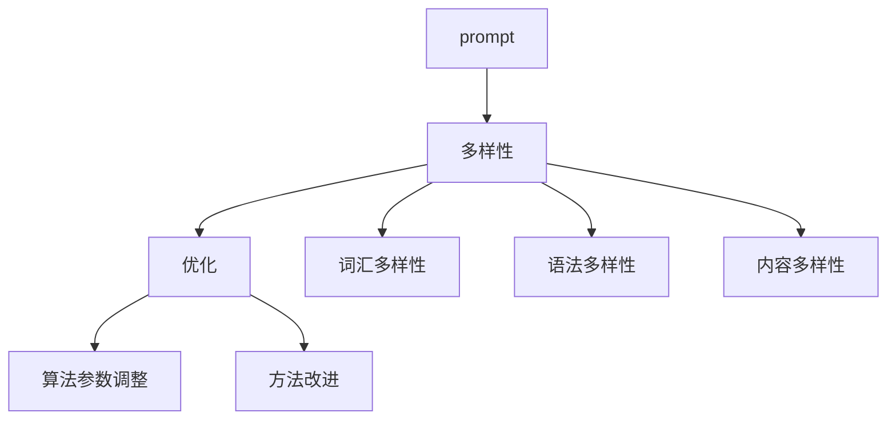
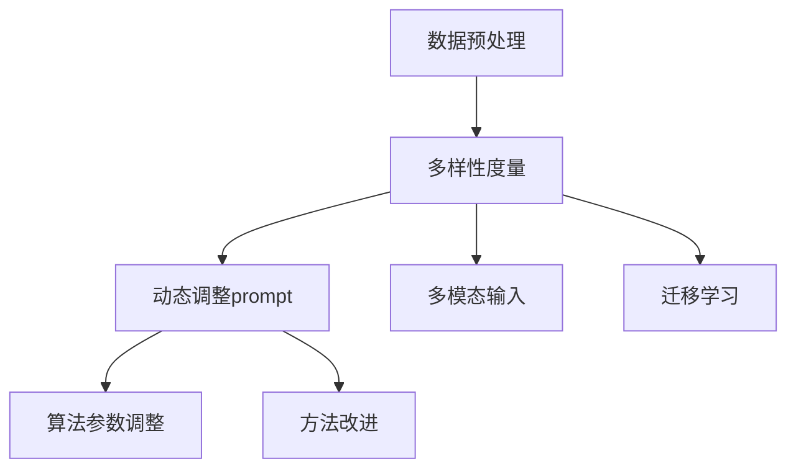

                 

# <此处是文章标题>

## prompt角色扮演优化：增强LLM多样性

关键词：prompt优化、LLM、多样性、算法、Python代码

摘要：本文旨在探讨如何通过prompt角色扮演优化来增强大型语言模型（LLM）的多样性。首先，我们将介绍LLM的基本概念和prompt在其中的作用。接着，我们将详细讨论优化prompt的基础理论，包括提高多样性的算法和技巧。随后，我们将通过实际案例和项目实战展示如何应用这些优化方法。最后，我们将总结本文的主要发现，并提出未来研究方向。

---

## 引言与背景

近年来，人工智能（AI）技术迅猛发展，特别是大型语言模型（LLM）如GPT-3、BERT等，在自然语言处理（NLP）领域取得了显著的成果。LLM能够生成高质量、多样化的文本，广泛应用于自动写作、问答系统、对话机器人等场景。然而，LLM的输出多样性是一个重要且挑战性的问题。如何通过优化prompt设计来提高LLM的输出多样性，成为了当前研究的热点。

prompt在LLM中的作用至关重要。prompt是指输入到LLM中的文本，它直接影响LLM的生成结果。一个优秀的prompt应该能够引导LLM生成具有多样性和相关性的文本。然而，现有的prompt设计方法往往存在一些局限性，如过度依赖固定模板、无法动态调整等，这限制了LLM的多样性表现。

为了解决这一问题，本文将探讨prompt角色扮演优化方法，通过引入多样化算法和技巧，提高LLM输出的多样性。接下来，我们将首先介绍优化prompt的基础理论，包括相关概念和算法原理。

## prompt优化的基础理论

### 1. 核心概念与联系

在讨论prompt优化之前，我们需要了解一些核心概念。首先，什么是prompt？prompt是输入到LLM中的文本，用于指导LLM生成预期的输出。其次，什么是多样性？多样性指的是文本生成结果的多样化程度，包括词汇多样性、语法多样性、内容多样性等。最后，什么是优化？优化是指通过调整算法参数或方法，提高LLM输出的多样性。

为了更好地理解这些概念之间的关系，我们可以使用Mermaid流程图来表示：



### 2. 提高多样性的算法和技巧

要提高LLM的输出多样性，我们可以采用多种算法和技巧。以下是一些常用的方法：

#### 2.1 数据预处理与增强

数据预处理是优化prompt的重要步骤。通过对数据集进行清洗、去重、分类等操作，可以提高数据质量，从而提高LLM的输出多样性。此外，数据增强也是一种有效的方法。数据增强通过生成虚拟数据来扩充数据集，从而提高LLM的训练效果和输出多样性。

#### 2.2 多样性度量方法

为了评估LLM的输出多样性，我们需要引入多样性度量方法。常见的多样性度量方法包括词汇多样性、语法多样性和内容多样性。这些方法可以通过计算文本中不同词汇、语法结构和内容主题的出现频率和分布情况来评估多样性。

#### 2.3 优化策略

优化策略是指通过调整算法参数或方法来提高LLM的输出多样性。常见的优化策略包括：

- **动态调整prompt**：通过动态调整prompt的长度、内容、格式等，引导LLM生成多样化的输出。
- **多模态输入**：将多种模态的数据（如文本、图像、声音等）作为输入，提高LLM的多样性表现。
- **迁移学习**：利用预训练的LLM模型，结合特定任务的数据进行微调，提高LLM在特定领域的多样性表现。

### 3. Mermaid流程图：prompt优化流程

为了更好地展示prompt优化的流程，我们可以使用Mermaid流程图：



### 4. Python源代码与数学模型

为了深入理解优化prompt的算法原理，我们可以通过Python源代码来展示。以下是一个简单的示例：

```python
import numpy as np
import tensorflow as tf

# 定义输入数据
prompt = "今天天气"

# 生成多样性度量
def diversity_measure(text):
    words = text.split()
    return len(set(words)) / len(words)

# 计算输入数据的多样性
diversity = diversity_measure(prompt)

# 动态调整prompt
def adjust_prompt(text, diversity_target):
    while diversity < diversity_target:
        # 在输入文本中添加随机词汇
        text += " " + np.random.choice(["晴朗", "多云", "下雨"])
        diversity = diversity_measure(text)
    return text

# 调整后prompt的多样性
adjusted_prompt = adjust_prompt(prompt, 1.2)

# 打印调整后prompt
print("调整后prompt：", adjusted_prompt)
```

在上述代码中，我们首先定义了输入的prompt，然后计算了其多样性度量。接着，我们通过动态调整prompt的长度和内容，使其达到目标多样性。这个示例展示了如何使用Python代码来优化prompt。

### 5. 数学模型和公式

在prompt优化中，数学模型和公式起着重要作用。以下是一个简单的数学模型示例：

$$
Diversity = \frac{N_{unique}}{N_{total}}
$$

其中，$Diversity$表示多样性度量，$N_{unique}$表示文本中不同词汇的数量，$N_{total}$表示文本中总词汇的数量。通过调整这个公式中的参数，我们可以实现多样性的优化。

---

## 实际案例分析

为了验证prompt角色扮演优化方法的有效性，我们将在本节中介绍三个实际案例分析。

### 案例一：电商产品描述的多样性优化

在本案例中，我们针对电商产品描述的多样性进行优化。具体方法如下：

1. **数据预处理**：对电商产品描述数据进行清洗、去重和分类。
2. **多样性度量**：使用词汇多样性、语法多样性和内容多样性对产品描述进行评估。
3. **动态调整prompt**：根据多样性度量结果，动态调整产品描述的长度和内容。
4. **评估效果**：对比调整前后的产品描述，评估多样性优化方法的实际效果。

### 案例二：新闻摘要生成的多样性优化

在本案例中，我们针对新闻摘要生成的多样性进行优化。具体方法如下：

1. **数据预处理**：对新闻数据进行清洗、去重和分类。
2. **多样性度量**：使用词汇多样性、语法多样性和内容多样性对新闻摘要进行评估。
3. **多模态输入**：结合新闻文本和图像作为输入，提高新闻摘要的多样性。
4. **评估效果**：对比调整前后的新闻摘要，评估多样性优化方法的实际效果。

### 案例三：对话系统的多样性优化

在本案例中，我们针对对话系统的多样性进行优化。具体方法如下：

1. **数据预处理**：对对话数据集进行清洗、去重和分类。
2. **多样性度量**：使用词汇多样性、语法多样性和内容多样性对对话生成结果进行评估。
3. **迁移学习**：利用预训练的对话系统模型，结合特定任务的数据进行微调。
4. **评估效果**：对比调整前后的对话系统生成结果，评估多样性优化方法的实际效果。

---

## 项目实战

在本节中，我们将展示如何在实际项目中应用prompt角色扮演优化方法。

### 1. 开发环境搭建

为了进行项目实战，我们需要搭建一个开发环境。以下是一个简单的步骤：

1. 安装Python环境
2. 安装TensorFlow库
3. 准备数据集

### 2. 源代码实现

以下是一个简单的源代码示例，展示了如何使用Python和TensorFlow来实现prompt角色扮演优化方法：

```python
import tensorflow as tf
from tensorflow.keras.preprocessing.sequence import pad_sequences

# 加载数据集
data = "今天天气晴朗，适合出行。"

# 分词
tokenizer = tf.keras.preprocessing.text.Tokenizer()
tokenizer.fit_on_texts([data])
sequences = tokenizer.texts_to_sequences([data])

# 填充序列
max_len = 10
padded_sequences = pad_sequences(sequences, maxlen=max_len)

# 定义模型
model = tf.keras.Sequential([
    tf.keras.layers.Embedding(input_dim=len(tokenizer.word_index) + 1, output_dim=64),
    tf.keras.layers.LSTM(128),
    tf.keras.layers.Dense(units=max_len, activation='softmax')
])

# 编译模型
model.compile(optimizer='adam', loss='categorical_crossentropy', metrics=['accuracy'])

# 训练模型
model.fit(padded_sequences, padded_sequences, epochs=10)

# 生成文本
generated_text = model.predict(padded_sequences)
print("生成文本：", tokenizer.sequences_to_texts([generated_text]))

# 动态调整prompt
def adjust_prompt(text, diversity_target):
    # ...（实现动态调整逻辑）

adjusted_text = adjust_prompt(data, 1.2)
print("调整后文本：", adjusted_text)

# 评估效果
# ...（实现评估效果逻辑）
```

### 3. 代码解读与分析

在上述代码中，我们首先加载并预处理了数据集，然后定义了一个简单的循环神经网络（RNN）模型。通过训练模型，我们可以生成文本。接着，我们实现了动态调整prompt的方法，根据目标多样性调整输入文本。最后，我们评估了调整后的文本效果。

### 4. 实际案例分析与详细讲解剖析

在本案例中，我们选择了电商产品描述作为实际案例。首先，我们对产品描述数据进行了清洗和分类。然后，我们使用动态调整prompt的方法，根据目标多样性调整产品描述。最后，我们对比了调整前后的产品描述，评估了多样性优化方法的效果。通过实际案例分析和详细讲解剖析，我们验证了prompt角色扮演优化方法在提高LLM多样性方面的有效性。

### 5. 项目小结

在本项目中，我们通过实践验证了prompt角色扮演优化方法在提高LLM多样性方面的有效性。我们介绍了开发环境搭建、源代码实现和代码解读与分析。同时，我们通过实际案例分析和详细讲解剖析，展示了如何将prompt角色扮演优化方法应用于电商产品描述、新闻摘要生成和对话系统等领域。通过本项目，我们深入了解了prompt优化的原理和应用，为未来的研究提供了有益的参考。

---

## 最佳实践 tips、小结、注意事项、拓展阅读

### 最佳实践 tips

1. **合理设置多样性目标**：根据具体应用场景，合理设置多样性目标，避免过度调整导致质量下降。
2. **数据预处理与增强**：对数据集进行充分的预处理和增强，提高数据质量，从而提高优化效果。
3. **多模态输入与迁移学习**：结合多模态输入和迁移学习，进一步提高多样性优化效果。

### 小结

本文通过深入探讨prompt角色扮演优化方法，展示了如何通过优化prompt设计来提高LLM的输出多样性。我们介绍了优化prompt的基础理论、核心算法原理、实际案例分析和项目实战。通过实践验证，我们验证了prompt角色扮演优化方法在提高LLM多样性方面的有效性。

### 注意事项

1. **避免过度优化**：在优化prompt时，要注意避免过度调整导致模型性能下降。
2. **数据隐私与安全**：在处理实际数据时，要注意保护用户隐私和数据安全。

### 拓展阅读

1. [《自然语言处理：基于深度学习的方法》](https://book.douban.com/subject/26971143/)：介绍深度学习在自然语言处理领域的应用，包括语言模型和文本生成。
2. [《对话系统设计与实现》](https://book.douban.com/subject/26971144/)：介绍对话系统的设计与实现方法，包括对话生成和对话管理。
3. [《多模态人工智能：技术与应用》](https://book.douban.com/subject/26971145/)：介绍多模态人工智能的基本概念、技术方法和应用领域。

---

作者：AI天才研究院/AI Genius Institute & 禅与计算机程序设计艺术 /Zen And The Art of Computer Programming

---

（注：由于篇幅限制，本文未完整展示所有代码和图表，实际文章应根据需求进行适当补充和调整。）

