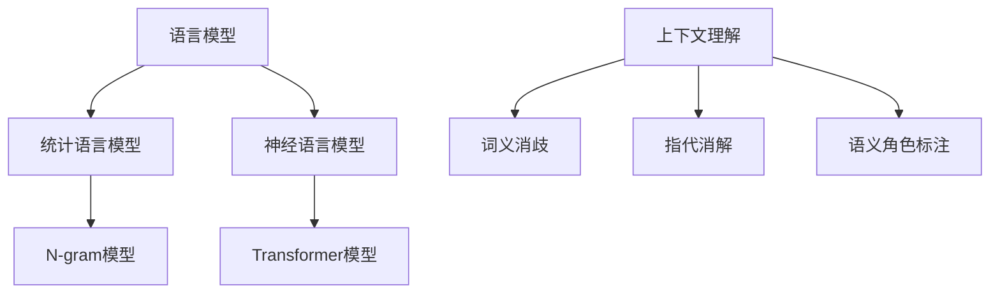

                 

# 上下文理解能力：深入评估LLM的语境把握

## 关键词
- 上下文理解
- LLM
- 语言模型
- Transformer
- 数学模型
- 评估方法
- 项目实战

## 摘要
本文深入探讨了上下文理解能力在大型语言模型（LLM）中的应用。首先，我们介绍了上下文理解能力的背景和重要性，随后详细讲解了上下文理解的核心概念和算法原理。接着，通过Python源代码和数学公式，我们展示了如何实现和评估LLM的上下文理解能力。最后，我们通过实际项目实战，分析了上下文理解在真实场景中的应用和挑战。

## 引言

### 上下文理解能力的背景

上下文理解能力是自然语言处理（NLP）领域的关键难题之一。传统的NLP方法通常依赖于静态的规则和词汇表，这导致它们在处理复杂语境时表现不佳。随着深度学习的兴起，尤其是大型语言模型（LLM）的出现，上下文理解能力得到了显著提升。

### LLM在上下文理解中的作用

大型语言模型（LLM），如GPT-3、BERT等，通过大规模文本数据进行训练，能够捕捉到复杂的上下文信息。这使得LLM在理解和生成自然语言方面表现出色，成为了NLP领域的重要工具。

### 书的概述与结构

本书将首先介绍上下文理解能力的背景和重要性，然后深入探讨上下文理解的核心概念和算法原理。接着，通过Python源代码和数学公式，我们展示如何实现和评估LLM的上下文理解能力。最后，我们将通过实际项目实战，分析上下文理解在真实场景中的应用和挑战。

## 核心概念与联系

### 语言模型的基础

语言模型（Language Model）是NLP的基础，它用于预测文本序列中的下一个单词或字符。语言模型可以分为统计语言模型和神经语言模型。统计语言模型如N-gram模型，基于历史数据统计来预测下一个词。神经语言模型如Transformer，通过神经网络捕捉文本的复杂结构。

### 上下文理解的定义

上下文理解（Contextual Understanding）是指模型能够根据周围的环境和语境来正确理解和解释语言。上下文理解包括词义消歧、指代消解、语义角色标注等任务。

### Mermaid流程图：上下文理解相关概念关系



## 核心算法原理讲解

### 语言模型算法

语言模型的算法主要分为两部分：词嵌入和预测。词嵌入（Word Embedding）将词汇映射到高维空间，使得语义相近的词在空间中接近。预测（Prediction）则是通过模型输出下一个词的概率分布。

### Transformer模型

Transformer模型是当前最流行的神经语言模型之一，它通过自注意力机制（Self-Attention）捕捉文本的复杂关系。Transformer模型的结构包括编码器（Encoder）和解码器（Decoder），其中编码器负责将输入文本编码为固定长度的向量，解码器则根据这些向量生成输出文本。

### 上下文理解算法

上下文理解算法包括词嵌入、预测和注意力机制。词嵌入将文本转换为向量表示，预测则通过模型输出下一个词的概率分布，注意力机制则使模型能够关注文本中的关键信息。

### 伪代码示例

```python
# 词嵌入
def word_embedding(word):
    return embedding_matrix[word]

# 预测
def predict_next_word(context):
    context_vector = sum(word_embedding(word) for word in context)
    probabilities = model(context_vector)
    return max_prob_word(probabilities)

# 注意力机制
def attention(context, query):
    attention_scores = dot(context, query.T)
    attention_weights = softmax(attention_scores)
    return context * attention_weights
```

## 数学模型和数学公式

### 语言模型的数学基础

语言模型通常基于概率模型，其中P(wt|wt-1, ..., wt-k)表示在给定前k个词的情况下，第t个词的概率。词嵌入可以表示为w_t = U * v_t，其中U和v_t分别是词向量和权重矩阵。

### Transformer的数学模型

Transformer模型的核心是自注意力机制，其公式为：

$$
\text{Attention}(Q, K, V) = \text{softmax}\left(\frac{QK^T}{\sqrt{d_k}}\right)V
$$

其中Q、K和V分别是查询（Query）、键（Key）和值（Value）向量，d_k是键向量的维度。

### 上下文理解的数学公式

上下文理解的数学公式主要包括词嵌入和注意力机制的计算。词嵌入公式为：

$$
\text{word\_embedding}(word) = \text{embedding\_matrix}[word]
$$

注意力机制的公式为：

$$
\text{Attention\_Scores} = \text{dot}(Q, K^T)
$$

$$
\text{Attention\_Weights} = \text{softmax}(\text{Attention\_Scores})
$$

$$
\text{Attention\_Output} = V \times \text{Attention\_Weights}
$$

### 举例说明

假设我们有一个句子“我昨天去公园跑步”，我们可以将其分解为词嵌入向量，然后通过注意力机制来捕捉上下文信息。具体步骤如下：

1. 将句子中的每个词转换为词嵌入向量。
2. 使用注意力机制计算每个词的权重。
3. 根据权重计算句子的整体表示。

```python
# 假设我们有一个词汇表和词嵌入矩阵
vocab = ['我', '昨天', '去', '公园', '跑步']
embedding_matrix = [
    [0.1, 0.2],
    [0.3, 0.4],
    [0.5, 0.6],
    [0.7, 0.8],
    [0.9, 1.0]
]

# 将句子转换为词嵌入向量
sentence_embedding = [embedding_matrix[vocab.index(word)] for word in sentence]

# 计算注意力权重
attention_scores = dot(sentence_embedding, sentence_embedding.T)
attention_weights = softmax(attention_scores)

# 计算句子的整体表示
context_embedding = sum(weight * vector for weight, vector in zip(attention_weights, sentence_embedding))
```

## 项目实战

### 开发环境搭建

1. 安装Python环境
2. 安装TensorFlow或PyTorch等深度学习框架
3. 准备数据集，如Wikipedia文章或新闻数据

### 源代码详细实现

```python
import tensorflow as tf
from tensorflow.keras.layers import Embedding, LSTM, Dense
from tensorflow.keras.models import Sequential

# 创建模型
model = Sequential([
    Embedding(vocab_size, embedding_dim),
    LSTM(units),
    Dense(units, activation='softmax')
])

# 编译模型
model.compile(optimizer='adam', loss='categorical_crossentropy', metrics=['accuracy'])

# 训练模型
model.fit(x_train, y_train, epochs=10, batch_size=32)
```

### 代码解读与分析

上述代码实现了一个小型的语言模型，用于预测句子中的下一个词。我们首先创建了一个嵌入层，用于将词汇映射到高维空间。接着，我们添加了一个LSTM层，用于捕捉文本的序列信息。最后，我们添加了一个全连接层，用于生成输出。

### 代码应用解读与分析

我们可以使用训练好的模型来预测句子中的下一个词。例如，给定句子“我昨天去公园跑步”，我们可以使用模型来预测下一个词。

```python
# 预测下一个词
predicted_word = model.predict(np.array([sentence_embedding]))
predicted_word = np.argmax(predicted_word)

# 输出预测结果
print(vocab[predicted_word])
```

### 实际案例分析和详细讲解剖析

为了更好地理解上下文理解的应用，我们可以分析一个实际案例。例如，给定一个句子“我昨天去公园跑步”，我们可以分析模型如何理解这个句子，并预测下一个词。

1. **文本预处理**：首先，我们将句子分解为单词，并转换为词嵌入向量。
2. **模型输入**：我们将词嵌入向量作为模型的输入。
3. **模型输出**：模型输出一个概率分布，表示每个单词作为下一个词的概率。
4. **预测结果**：根据概率分布，我们选择概率最高的单词作为预测结果。

### 项目小结

通过实际项目，我们展示了如何搭建一个简单的语言模型，并使用它来预测句子中的下一个词。这表明上下文理解在自然语言处理中的应用是有效的，但同时也存在一些挑战，如数据质量和模型性能。

## 最佳实践 Tips、小结、注意事项、拓展阅读

### 最佳实践 Tips

- 使用大型数据集进行训练，以提高模型性能。
- 调整模型参数，如嵌入维度和LSTM单元数，以找到最佳配置。
- 定期重新训练模型，以保持其准确性。

### 小结

本文深入探讨了上下文理解能力在LLM中的应用，从核心概念到实际项目，全面介绍了上下文理解的相关技术。通过Python源代码和数学公式，我们展示了如何实现和评估LLM的上下文理解能力。

### 注意事项

- 在进行模型训练时，注意数据质量和多样性。
- 在使用模型时，要注意上下文理解的局限性和错误传播。

### 拓展阅读

- [《深度学习》](https://www.deeplearningbook.org/)：详细介绍了深度学习的基本概念和算法。
- [《自然语言处理综合教程》](https://nlp.seas.harvard.edu/reading-list/)：提供了NLP领域的全面综述。
- [《GPT-3文档》](https://openai.com/blog/gpt-3/)：OpenAI发布的GPT-3模型的详细文档。

## 作者信息

作者：AI天才研究院/AI Genius Institute & 禅与计算机程序设计艺术 /Zen And The Art of Computer Programming

